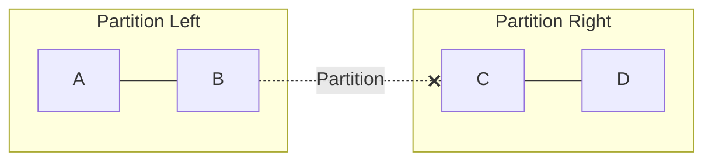
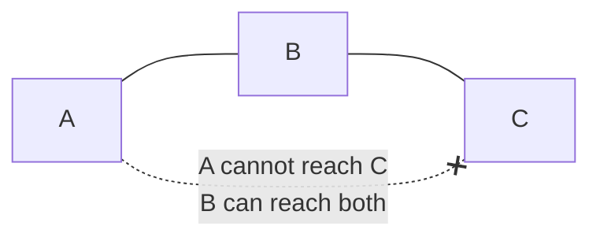
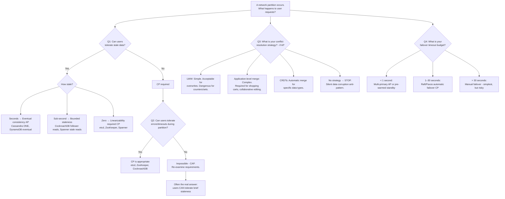

# CAP Theorem

## TL;DR

CAP theorem states: a distributed system can provide at most 2 of 3 guarantees — Consistency, Availability, Partition tolerance. But this framing is misleading. Partitions are not optional; they are a fact of distributed systems. The real engineering question is what your system does **during** a partition (favor C or A) and what tradeoffs it makes **when healthy** (PACELC: latency vs consistency). Every system sits on a spectrum, not in a bucket.

---

## The Three Properties

### Consistency (C)

Every read receives the most recent write or an error. In CAP's formal definition, this is **linearizability** — the strongest single-object consistency model:

- **Total order on operations**: all operations appear to execute atomically at some point between their invocation and response.
- **Real-time ordering**: if write W completes before read R starts (in wall-clock time), R must see W or a later write.
- **Single copy illusion**: the system behaves as if there is only one copy of the data, even though it is replicated.

Not to be confused with:
- **ACID Consistency**: preservation of application invariants (foreign keys, constraints).
- **Sequential Consistency**: total order exists but need not respect real-time. A weaker guarantee.

Practical implication: a linearizable system must coordinate on every write. In a 3-node Raft cluster with cross-AZ replication, that means at least 1 round-trip to a majority (~2–10 ms cross-AZ depending on region layout).

### Availability (A)

Every request received by a non-failing node must result in a non-error response.

Precision matters here:
- **No bounded time**: the formal definition does not specify latency. A response after 30 seconds still counts as "available."
- **Non-failing nodes only**: a crashed node is excluded. The property says every *live* node must respond.
- **No content guarantee**: the response may contain stale data. It must simply not be an error.

This is a stronger guarantee than "five nines uptime." CAP availability means **every single request** to a live node succeeds, not 99.999% of them.

### Partition Tolerance (P)

The system continues to operate despite arbitrary message loss or delay between nodes.

A partition means some subset of nodes cannot communicate with another subset. The system must still deliver its consistency and/or availability guarantees (whichever it chooses) despite this communication failure.



Key nuance: partition tolerance is not a feature you "enable." It describes whether the system's guarantees hold when the network misbehaves. Since you cannot prevent partitions, P is a requirement, not a choice.

---

## Formal Proof Sketch

### Gilbert & Lynch (2002) — The Impossibility Result

The original conjecture by Brewer (2000) was formalized and proven by Gilbert and Lynch in "Brewer's Conjecture and the Feasibility of Consistent, Available, Partition-Tolerant Web Services."

**Construction (simplified):**

Consider the simplest possible distributed system: two nodes, N1 and N2, sharing a single register x with initial value v0.

1. A network partition separates N1 and N2 — no messages can cross.
2. A client sends a write(x, v1) to N1. N1 must accept it (availability requires a non-error response from every live node).
3. A client sends read(x) to N2. N2 must respond (availability). But N2 cannot contact N1 to learn about v1 (partition). N2 can only return v0.
4. The read returns v0, violating consistency (linearizability requires seeing v1 since the write completed).

**The impossibility**: to satisfy consistency, N2 must either (a) contact N1 (impossible during partition) or (b) refuse to answer (violating availability). There is no third option.

**Key insight**: this is not a configuration problem or an implementation limitation. It is a fundamental impossibility result, as firm as the impossibility of consensus in asynchronous systems with one faulty process (FLP impossibility, 1985). No amount of engineering can circumvent it — only tradeoffs.

**Extension to N nodes**: the two-node proof generalizes trivially. In any distributed system with N > 1 nodes, a partition can isolate at least one node. That node faces the same dilemma: respond with potentially stale data (sacrifice C) or refuse to respond (sacrifice A). The number of nodes does not change the fundamental impossibility.

**Relationship to FLP impossibility**: FLP (Fischer, Lynch, Paterson, 1985) proved that deterministic consensus is impossible in an asynchronous system with even one faulty process. CAP and FLP are related but distinct: FLP says consensus cannot be guaranteed; CAP says consistency and availability cannot coexist during partitions. Both are impossibility results that bound what distributed systems can achieve.

**What the proof does NOT say:**
- It does not say you must always sacrifice C or A. Only during partitions.
- It does not say anything about latency. A "CA" system is possible if you can guarantee no partitions (single node, or synchronous network — neither realistic at scale).
- It does not apply to single-node systems. CAP is about distributed state.
- It does not distinguish between types of partitions. A 1-second micro-partition and a 1-hour network outage impose the same theoretical constraint.

---

## Why "Pick 2" Is Misleading

### Partitions Are Not Optional

The Venn diagram with three overlapping circles (CA, CP, AP) is the most common — and most misleading — visualization of CAP. It implies you choose two of three as a static design decision.

In reality:
- **Network partitions will happen** in any system spanning more than one process on more than one machine. Switches fail. NICs drop packets. GC pauses cause TCP timeouts that look like partitions to the other side.
- **You cannot choose "CA"** in a distributed system because you do not control the network. A single-node PostgreSQL is "CA" trivially — but it is not distributed.
- Google's internal studies reported roughly 5 network partition events per cluster per year. Cloudflare's 2020 backbone partition affected multiple regions for 27 minutes.

### The Real Choice Is Per-Partition, Per-Operation

When a partition occurs, each operation faces a binary choice:

**CP — Consistency + Partition tolerance:**
- Refuse requests that cannot be verified as current.
- Return errors or timeouts to clients on the minority side.
- Example: ZooKeeper minority partition returns `ConnectionLossException`.
- UX impact: users see errors. Writes fail. Reads may fail.

**AP — Availability + Partition tolerance:**
- Respond to every request, accepting potential staleness or divergence.
- Accept writes on both sides of the partition (creating conflicts).
- Example: Cassandra continues serving reads and writes from any reachable node.
- UX impact: users see data, but it may be stale. Conflicts must be resolved later.

### The Spectrum in Practice

Most production systems are not purely CP or AP. They offer per-operation or per-table granularity:

- **Cassandra**: `ONE` reads are AP, `QUORUM` reads approach CP, `ALL` reads are CP (but sacrifice availability).
- **MongoDB**: reads from primary are CP; reads from secondaries are AP (may be stale).
- **DynamoDB**: eventually consistent reads are AP; strongly consistent reads are CP.
- **CockroachDB**: always CP (linearizable), but you pay in latency.

CAP only forces a choice **during** partitions. When the network is healthy, you can have both consistency and availability simultaneously.

---

## What "Partition" Actually Means in Production

### Partition Taxonomy

Not all partitions are equal. The textbook "network cable cut" is the simplest case. Production partitions are far more subtle.

**Full partition**: complete communication failure between two groups of nodes. Clean split. Both sides know they cannot reach the other. Easiest to detect, rarest in practice.

**Partial partition**: node A can reach B, B can reach C, but A cannot reach C. Creates asymmetric views of cluster membership. Particularly dangerous because quorum calculations may disagree across nodes.



**Asymmetric partition**: node A can send to B, but B's replies to A are lost. A thinks B is alive (sends succeed). B thinks A is alive (receives succeed). But B's responses never arrive at A. Heartbeat protocols that rely on bidirectional communication detect this; one-way health checks may not.

**Slow partition (gray failure)**: messages are not lost, but delayed beyond timeout thresholds. A GC pause of 15 seconds causes the rest of the cluster to declare the paused node dead. When GC completes, the node believes it is still leader. This is a partition in all practical senses. Gray failures are the hardest to detect because monitoring systems see the node as "up" (it responds to health checks between pauses) while the cluster sees it as "dead" (it missed heartbeat deadlines).

**Network partition vs process partition**: a process that is alive but not processing messages (stuck in GC, blocked on disk I/O, CPU-starved by a noisy neighbor) is functionally partitioned from the cluster. The distinction between "network failure" and "process failure" is meaningless from the perspective of other nodes — both look like silence. This is why → [06 — Failure Modes](./06-failure-modes.md) treats crash failures and omission failures as part of the same spectrum. For partition-specific handling strategies → [07 — Network Partitions](./07-network-partitions.md).

### Real Causes in Production

| Cause | Mechanism | Detection Difficulty |
|-------|-----------|---------------------|
| Switch/router failure | Full partition between racks | Easy — total loss |
| GC pause (Java/Go) | Node unresponsive for seconds | Hard — node thinks it's fine |
| TCP retransmit backoff | Slow partition, exponential delays | Medium — gradual degradation |
| AWS AZ connectivity loss | BGP re-convergence, 1–5 min | Medium — partial, often asymmetric |
| NIC firmware bug | Packet corruption → drops | Hard — intermittent, partial |
| DNS resolution failure | Nodes resolve peers to wrong IP | Hard — subtle, application-level |
| TLS certificate expiry | Mutual TLS connections refused | Easy to diagnose, hard to predict |
| iptables / security group | Operator error, firewall rule | Hard — looks like network failure |
| MTU mismatch (jumbo frames) | Large packets dropped, small pass | Very hard — only some traffic fails |

### Case Study: Azure DNS Outage (April 2021)

**What happened**: a DNS configuration update caused Azure's authoritative DNS servers to become unreachable from certain networks. This was an asymmetric partition — Azure services could reach DNS internally, but external clients could not resolve Azure-hosted domains.

**Impact**: any service using custom domains hosted on Azure DNS was unreachable. This included Azure Portal itself for some users. Duration: ~1 hour.

**CAP lesson**: DNS is the most visible AP system in production. Its TTL-based caching (eventual consistency) is a feature — cached records kept working during the partition. Services with long TTLs (hours) were less affected than those with short TTLs (minutes). The AP design of DNS limited the blast radius compared to what a CP DNS system would have caused (complete resolution failure everywhere, immediately).

### Case Study: AWS US-East-1 EBS Outage (April 2011)

**What happened**: a network configuration change during routine scaling caused a partition within a single Availability Zone. EBS nodes in the affected AZ could not communicate with their replication peers.

**Cascade sequence**:
1. Partial partition isolated a subset of EBS nodes from their mirrors.
2. Isolated EBS nodes initiated re-mirroring — a CP recovery mechanism to restore replication factor.
3. All isolated nodes simultaneously searched for new mirrors, creating a re-mirroring storm.
4. The storm consumed all available EBS capacity in the AZ.
5. EBS volumes stuck in "attaching" state. EC2 instances with EBS-backed root volumes could not start.
6. RDS (which depends on EBS) became unavailable. Elastic Beanstalk, which depends on RDS, also failed.
7. Recovery took over 48 hours for some volumes. Some data was permanently lost.

**CAP lesson**: the EBS system was designed CP — lose availability rather than serve stale data. During the partial partition, the CP recovery mechanism (re-mirroring) itself consumed all resources, causing a wider availability failure than an AP design would have. CP is not inherently "safer" — it trades one failure mode for another.

---

## PACELC Deep Dive

### Beyond Partition Behavior

CAP describes behavior during an exceptional event (partition). But systems spend >99.9% of their time operating normally. Daniel Abadi proposed PACELC (2012) to capture the full tradeoff:

```
If (P)artition → choose (A)vailability or (C)onsistency
Else            → choose (L)atency or (C)onsistency

Written: P + A/C + E + L/C → e.g., PA/EL, PC/EC
```

The "Else" clause is where the real daily engineering tradeoff lives. During normal operation, stronger consistency requires more coordination, which costs latency. This is the tradeoff engineers configure every day — not the once-a-year partition event.

### Latency vs Consistency: Concrete Numbers

**Cassandra (v4.x):**

| Consistency Level | Typical Latency (cross-AZ) | Nodes Contacted | Partition Behavior |
|------------------|---------------------------|-----------------|-------------------|
| `ONE` | ~1–2 ms | 1 | AP — serves from any live node |
| `LOCAL_QUORUM` | ~5–10 ms | Majority in local DC | Partially CP within DC |
| `QUORUM` | ~10–30 ms | Majority across all DCs | CP across cluster |
| `ALL` | ~50–200 ms | All replicas | CP — any node failure = unavailable |
| `EACH_QUORUM` | ~15–40 ms | Majority in each DC | CP per-DC |

Engineering implication: moving from `ONE` to `QUORUM` in Cassandra costs 5–15x latency. For a service handling 50,000 reads/sec at p99 < 10 ms, switching to `QUORUM` may blow the latency budget. This is the EL tradeoff in practice.

**DynamoDB:**

| Read Type | Latency | Cost (RCU) | Consistency |
|-----------|---------|------------|-------------|
| Eventually consistent | ~1–5 ms | 0.5 RCU per 4 KB | AP — may read stale |
| Strongly consistent | ~5–15 ms | 1.0 RCU per 4 KB | CP — linearizable |
| Transactional (TransactGetItems) | ~10–25 ms | 2.0 RCU per 4 KB | CP — serializable |

Strong reads cost 2x the RCUs of eventual reads. At DynamoDB scale (millions of reads/sec), this doubles the read bill. Many teams use eventual reads for the list/browse path and strong reads only for checkout/payment.

**Google Spanner:**
- PACELC classification: **PC/EC** — always consistent, always pays latency.
- Every read-write transaction requires TrueTime uncertainty wait: ~7 ms.
- Read-only transactions at a specific timestamp can be served from any replica with no coordination (snapshot reads).
- Cross-region writes: ~50–150 ms depending on region distance (TrueTime wait + Paxos round-trips).
- Spanner does not offer an eventual consistency mode. Consistency is non-negotiable. You pay the latency or you don't use Spanner.
- Source: Corbett et al., "Spanner: Google's Globally-Distributed Database," OSDI 2012.

### PACELC Classification of Real Systems

| System | Version | P: A or C | E: L or C | Notes |
|--------|---------|-----------|-----------|-------|
| Cassandra | 4.x | PA | EL (at ONE) | Tunable per-query; QUORUM shifts toward EC |
| DynamoDB | — | PA | EL (eventual) | Strong reads shift to EC; 2x cost |
| MongoDB | 6.x+ | PA (default) | EC | w:majority, readConcern:majority = EC |
| CockroachDB | 23.x | PC | EC | Always serializable, Raft per-range |
| Spanner | — | PC | EC | TrueTime-based, ~7 ms floor |
| YugabyteDB | 2.x | PC | EC | Raft, similar model to CockroachDB |
| PostgreSQL (single) | — | CA (trivially) | EC | Not distributed; CAP does not apply meaningfully |
| Redis Cluster | 7.x | PA | EL | Async replication by design |
| etcd | 3.5+ | PC | EC | Raft quorum, linearizable reads |
| ZooKeeper | 3.8+ | PC | EC | ZAB protocol, linearizable |
| Kafka | 3.x+ | PA (default) | EL | Configurable via min.insync.replicas + acks |
| TiDB | 7.x | PC | EC | Raft per-region, similar to Spanner model |

### PACELC Decision Matrix

```mermaid
quadrantChart
    title PACELC Decision Matrix
    x-axis "PA (Available during Partition)" --> "PC (Consistent during Partition)"
    y-axis "EC (Consistent when healthy)" --> "EL (Low latency when healthy)"
    Cassandra: [0.25, 0.75]
    DynamoDB: [0.25, 0.65]
    Redis: [0.25, 0.85]
    MongoDB w:maj: [0.25, 0.35]
    Spanner: [0.75, 0.35]
    CockroachDB: [0.75, 0.25]
    etcd: [0.75, 0.15]
    ZooKeeper: [0.75, 0.10]
```

- **PA/EL** = Maximum performance, weakest guarantees. Best for: caching layers, session stores, social feeds.
- **PC/EC** = Maximum safety, highest latency. Best for: financial ledgers, coordination services, source of truth.
- **PA/EC** = Available during partition, consistent when healthy (common middle ground). Best for: most application databases (MongoDB, DynamoDB strong reads).
- **PC/EL** = Rare; hard to be fast normally but consistent during partition. Theoretically possible but practically contradictory.

### How to Evaluate PACELC for Your System

Ask these questions in order:

1. **How often do partitions occur in your deployment?** If you are single-region, single-AZ: very rarely. Multi-region: quarterly at minimum. The P choice matters proportionally to partition frequency.

2. **What is your latency budget?** If your SLA requires p99 < 10 ms for reads, PC/EC systems like Spanner (~7 ms floor + network) may not fit. PA/EL systems like Cassandra ONE (~1–2 ms) will.

3. **What is your consistency requirement?** Not "what sounds right," but "what is the actual business impact of a stale read?" If a user sees a 2-second-old product price, is that acceptable? For most e-commerce: yes. For real-time trading: no.

4. **What is your operational budget?** PA/EL systems require conflict resolution engineering. PC/EC systems require latency optimization engineering. Both cost engineering time — just in different places.

---

## Consistency Models Spectrum (Brief)

CAP's "Consistency" specifically means **linearizability**, but the consistency landscape is far richer:

| Model | Guarantee | Example System |
|-------|-----------|---------------|
| **Linearizability** | Real-time order, single-copy illusion | Spanner, etcd |
| **Sequential consistency** | Total order, but not real-time | ZooKeeper writes |
| **Causal consistency** | Respects happens-before relationships | MongoDB (causal sessions) |
| **Read-your-writes** | Client sees its own writes | DynamoDB (session) |
| **Monotonic reads** | Never see older data after newer | Cassandra (monotonic) |
| **Eventual consistency** | All replicas converge eventually | Cassandra ONE, DNS |

Many systems offer **tunable consistency** per-operation: Cassandra's consistency levels, DynamoDB's strong vs eventual reads, MongoDB's read/write concerns. The choice is not system-wide — it is per-query.

For the full spectrum treatment including formal definitions, session guarantees, CRDTs, and tunable consistency patterns:
**→ see [04 — Consistency Models](./04-consistency-models.md)**

---

## Real-World Partition Analysis by System

### ZooKeeper / etcd (CP — Raft/ZAB Quorum)

**Normal operation**: leader handles all writes, followers replicate via ZAB (ZooKeeper) or Raft (etcd). Reads can be served by any node (sequential consistency) or leader-only (linearizable, `sync` in ZK, `--consistency=l` in etcd).

**During partition (minority side)**:
1. Minority side loses contact with leader (or is the side without the leader).
2. Followers on minority side cannot form a quorum — they refuse all writes.
3. In ZooKeeper: clients connected to minority nodes receive `ConnectionLossException` after session timeout (default 40 seconds, configurable).
4. In etcd: reads return `context deadline exceeded` if linearizable; stale reads may succeed if serializable.
5. No data divergence — minority side simply stops serving.

**Recovery timeline**:
- Partition heals → followers rejoin, replay missed log entries from leader.
- Typical catch-up: seconds for short partitions, minutes if log has diverged significantly.
- etcd: if follower is too far behind, leader sends a snapshot (can take minutes for large datasets).
- ZooKeeper: similar snapshot mechanism via `SNAP` message.

**Operational risk**: if the partition isolates the leader on the minority side, the majority elects a new leader. Old leader's in-flight uncommitted proposals are lost. This is correct behavior (uncommitted = not acknowledged to client) but can surprise operators who see "leader changed" alerts.

### Cassandra (AP — Tunable Consistency)

**Normal operation**: coordinator receives request, forwards to replicas based on consistency level, waits for required acknowledgments.

**During partition**:
1. Coordinator cannot reach some replicas.
2. If consistency level is `ONE` and at least one replica is reachable — request succeeds. AP behavior.
3. If consistency level is `QUORUM` and quorum is unreachable — request fails with `UnavailableException`. CP behavior at that consistency level.
4. Writes to unreachable replicas are stored as **hinted handoffs** on the coordinator (default: hints stored for 3 hours, configurable via `max_hint_window`).

**Recovery sequence**:
1. **Hinted handoff delivery**: when the partitioned node returns, coordinator replays stored hints. Fast for short partitions.
2. **Read repair**: on subsequent reads, coordinator detects inconsistency across replicas and pushes the latest version. Probabilistic — only happens on reads.
3. **Anti-entropy repair** (`nodetool repair`): Merkle tree comparison across replicas. Full table scan. Should be run regularly (recommended: within `gc_grace_seconds`, default 10 days). Failure to run repair within gc_grace_seconds can cause deleted data to resurrect (zombie tombstones).

**Operational risk**: `gc_grace_seconds` is the most dangerous Cassandra configuration. If a node is partitioned for longer than gc_grace_seconds (10 days default) and repair has not run, tombstones may be garbage-collected on healthy replicas while the partitioned node still has the pre-delete data. When the partition heals, the old data "resurrects." This is not a bug — it is a fundamental consequence of AP design with distributed deletes.

### DynamoDB (AP Default, CP Available)

**Normal operation**: DynamoDB is a managed service; AWS handles replication across three AZs within a region. Writes are acknowledged after 2-of-3 replicas confirm (for standard writes).

**During partition (within AWS infrastructure)**:
1. Eventually consistent reads: served from any reachable replica. May return stale data during internal replication lag (typically < 1 second, but can spike during partitions).
2. Strongly consistent reads: must read from the leader replica. If leader is on the partitioned side, strong reads fail.
3. Global tables (multi-region): use last-writer-wins (LWW) with DynamoDB-managed timestamps. Concurrent writes to the same key in different regions → last timestamp wins.

**Conflict resolution**:
- Single-region: DynamoDB handles internally; strong reads prevent stale reads.
- Global tables: LWW based on wall-clock timestamp. No vector clocks in current implementation (unlike original Dynamo paper). Application-level conflict resolution requires conditional writes (`ConditionExpression`) or DynamoDB Streams + Lambda for custom merge logic.

**Operational risk**: global table LWW silently discards the "losing" write. For counters, this means lost increments. For sets, this means lost additions. Applications requiring merge semantics must implement them via Streams, not rely on DynamoDB's built-in resolution.

### CockroachDB (CP — Raft per Range)

**Normal operation**: data is divided into ranges (~512 MB each). Each range is a Raft group with a leader and followers across nodes (typically across AZs). All reads and writes go through Raft for linearizability.

**During partition**:
1. Ranges whose leader is on the majority side continue operating normally.
2. Ranges whose leader is on the minority side: majority elects a new leader. Old leader's uncommitted writes fail.
3. Ranges split across the partition with no majority on either side: completely unavailable until partition heals.
4. Client impact depends on which ranges their queries touch — different tables (or even different rows) may be affected differently.

**Latency cost per range**:
- Every write: 1 Raft round-trip to majority (cross-AZ: ~2–10 ms).
- Transactions spanning multiple ranges: 2-phase commit adds another round-trip (~4–20 ms total).
- Follower reads (v21.1+): can serve reads from followers with bounded staleness, trading consistency for latency.

**Operational consideration**: CockroachDB's range-level Raft means a partition does not cause a cluster-wide outage. Only ranges that lose quorum become unavailable. For well-distributed data, most of the cluster continues operating. This is a significant advantage over single-Raft systems like etcd where one partition affects the entire dataset.

### Redis Cluster (AP — Data Loss by Design)

**Normal operation**: Redis Cluster uses asynchronous replication. Primary receives write, acknowledges to client, then asynchronously sends to replicas. This is a deliberate design choice for performance.

**During partition**:
1. If a primary is isolated on the minority side, the majority promotes a replica to primary.
2. Any writes the old primary accepted but had not yet replicated are **permanently lost**.
3. If `cluster-node-timeout` (default: 15 seconds) passes, failover occurs.
4. The old primary, when the partition heals, discovers it is no longer primary and discards its divergent data.

**Split-brain scenario**:
```
Before partition:
  Primary-A (has writes w1, w2, w3)
  Replica-B (has w1, w2 — w3 not yet replicated)

Partition occurs. Majority side promotes Replica-B to Primary-B.

Primary-A (minority): continues accepting writes w4, w5 (if min-replicas-to-write=0)
Primary-B (majority): accepts new writes w6, w7

Partition heals:
  Primary-A discovers Primary-B exists → A demotes itself
  w3, w4, w5 are LOST permanently
```

**Mitigation**: `min-replicas-to-write` (formerly `min-slaves-to-write`) and `min-replicas-max-lag` can reduce the window. Setting `min-replicas-to-write=1` means the primary refuses writes if no replica has acknowledged within `min-replicas-max-lag` seconds. This shifts Redis toward CP at the cost of availability, but it is not true CP — the window between async replication and the lag check still exists.

**When to use Redis Cluster despite data loss risk**: Redis Cluster is appropriate when the data is reconstructible (caches, derived data, rate limiters) or when the performance benefit (sub-millisecond reads) outweighs the partition-time data loss. It is inappropriate as a sole source of truth for any data you cannot afford to lose. If you need Redis performance with stronger guarantees, consider Redis with AOF persistence + Sentinel (still AP, but reduces crash-time loss) or KeyDB with RAFT mode (experimental CP behavior).

**Quantifying the data loss window**: with default settings, the maximum data loss during failover is bounded by the replication lag at the moment of partition. For a primary processing 100,000 writes/sec with typical async replication lag of ~1 ms, the loss window is ~100 writes. With `min-replicas-max-lag=10`, it increases to ~1,000,000 writes in the worst case. Monitor `master_repl_offset` minus `slave_repl_offset` to measure your actual replication lag.

---

## Engineering Decision Framework

### Decision Tree



### Data Classification Guide

Before choosing CP or AP, classify every data entity in your system:

| Data Entity | Staleness Tolerance | Conflict Impact | Recommended | Rationale |
|-------------|--------------------|--------------------|-------------|-----------|
| User authentication token | 0 (zero) | Security breach | CP | Revoked tokens must not be honored |
| Product catalog price | Seconds | Customer sees old price | AP | Brief staleness acceptable; eventual update |
| Inventory count (high-stock) | Seconds | Oversell unlikely | AP | Buffer absorbs inconsistency |
| Inventory count (low-stock, < 10) | 0 (zero) | Oversell likely | CP | Low stock → conflict probability high |
| Shopping cart contents | Minutes | Lost items | AP + merge | User can re-add; merge preserves items |
| Payment transaction | 0 (zero) | Double charge / lost revenue | CP + idempotency | Must be exactly-once semantically |
| Social media feed | Minutes | User sees old post | AP | Staleness is normal UX |
| Leader election / distributed lock | 0 (zero) | Split-brain | CP | Correctness depends on single leader |
| DNS record | Hours (TTL) | Old IP served | AP | TTL-based staleness by design |
| Real-time bidding price | Milliseconds | Bid on stale price | Neither — local computation | Latency budget too tight for distributed consensus |

Note: some entities transition between categories dynamically. Inventory at 1,000 units can be AP. The same inventory at 3 units should be CP. Design your system to shift consistency levels based on state.

### Anti-Pattern: Choosing CP Without Modeling Partition UX

Teams choose CP because "consistency sounds important" without modeling what happens to users during a partition:

- **E-commerce checkout with CP database**: partition occurs → checkout returns 500 → user retries → partition heals → user submits again → double charge.
- **Better**: AP with idempotency key. User sees the page, submits once. Idempotency key prevents double-processing. Eventual consistency resolves within seconds.

The question is not "errors vs stale data" in the abstract. It is: **which failure mode causes more business damage?** For most user-facing flows, a 500 error is worse than 5 seconds of staleness.

### Anti-Pattern: Choosing AP Without Conflict Resolution

Teams choose AP because "availability sounds important" without implementing conflict resolution:

- **Inventory counter with AP (LWW)**: two nodes both decrement stock from 1 to 0. LWW keeps one write, discards the other. Actual stock: -1 (oversold). Neither write "won" correctly.
- **User profile with AP (no merge)**: user updates email on phone, updates address on laptop during a partition. LWW keeps one, loses the other. User's email or address silently reverts.

AP without a conflict strategy is not "eventually consistent." It is "eventually corrupted." Every AP design must answer: **when two conflicting writes exist, how do you merge them?**

### Anti-Pattern: Treating CAP as a One-Time Architecture Decision

CAP behavior should be revisited as the system evolves:

- **Scale changes tradeoffs**: a 3-node cluster in one AZ has very different partition probability than a 30-node cluster across 3 regions. What was CP-affordable at small scale may be latency-prohibitive at large scale.
- **Traffic pattern shifts**: a read-heavy system (100:1 read/write) has different CP cost than a write-heavy system (1:1). Adding a write-heavy feature to a CP system may blow latency budgets.
- **Regulation changes**: GDPR right-to-deletion requires that deletes propagate reliably. An AP system with unreliable anti-entropy may violate regulatory timelines for deletion.

Schedule a quarterly review of consistency requirements as part of production readiness reviews.

### Choosing the Right Failover Timeout

Failover timeout is the hidden variable in CAP decisions. Shorter timeout = faster recovery but more false positives (healthy nodes declared dead). Longer timeout = fewer false positives but longer outage during real failures.

| System | Default Timeout | Recommended Range | False Positive Risk |
|--------|----------------|-------------------|---------------------|
| ZooKeeper session | 40 seconds | 10–60 seconds | GC pauses > timeout |
| etcd election | ~1–1.5 seconds | 1–10 seconds | Network jitter |
| Cassandra phi failure detector | ~8 seconds (phi=8) | phi 5–12 | Cross-DC latency spikes |
| Redis Cluster node-timeout | 15 seconds | 5–30 seconds | Cloud network variability |
| Kafka controller failover | ~30 seconds | 10–60 seconds | ZooKeeper session timeout |
| CockroachDB Raft election | ~3 seconds | 1–10 seconds | Clock skew + network |

**Rule of thumb**: set failover timeout to at least 2x your worst-case observed GC pause or network latency spike. Monitor p99.9 latency, not p50, when calibrating.

---

## Consistency Verification

### Jepsen: How It Works

[Jepsen](https://jepsen.io) (Kyle Kingsbury) is the industry-standard methodology for testing distributed system consistency claims. It has changed vendor behavior across the industry.

**Methodology**:
1. Deploy system on 5 nodes (typically using LXC containers).
2. Run concurrent client operations: reads, writes, compare-and-swap, transactions.
3. Inject failures: network partitions (iptables), process kills (SIGKILL, SIGSTOP), clock skew (faketime), disk corruption.
4. Record every operation's invocation and completion time.
5. Verify the history against a consistency model (linearizability, serializability, etc.) using a checker like Knossos or Elle.

### Key Jepsen Findings

| System | Version Tested | Claimed Guarantee | Jepsen Finding | Issue |
|--------|---------------|-------------------|----------------|-------|
| MongoDB | 3.4.0–3.6.4 | Linearizable reads | Violations found | Stale reads under `readConcern: linearizable` with network partitions |
| Redis (Sentinel) | various | N/A (AP) | Data loss confirmed | Expected — async replication. Quantified the loss window |
| CockroachDB | 2.0.x | Serializable | Serializable violations | Fixed in subsequent versions |
| etcd | 3.4.3 | Linearizable | Generally correct | Some issues with watch API ordering |
| Cassandra | 2.x | Tunable | LWT violations | Lightweight transactions had linearizability bugs |
| RabbitMQ | 3.8.x | At-least-once | Message loss | Confirmed with partition + leader failover |
| PostgreSQL | 12.x | Serializable | Correct | Serializable snapshot isolation works as advertised |
| YugabyteDB | 2.2+ | Serializable | Violations found | Clock skew handling issues |
| TiDB | various | Snapshot isolation | Generally correct | Some edge cases with region leader transfers |

### Hermitage Test Suite

[Hermitage](https://github.com/ept/hermitage) (Martin Kleppmann) tests isolation levels in databases by running specific transaction interleavings:

- Tests for: dirty write, dirty read, fuzzy read, phantom read, lost update, read skew, write skew.
- Key finding: many databases claim "repeatable read" but actually implement snapshot isolation (weaker in some respects, stronger in others).
- PostgreSQL's "repeatable read" is actually snapshot isolation. MySQL's "repeatable read" has different anomaly behavior than PostgreSQL's.

### Running Your Own Consistency Tests

You do not need Jepsen's full infrastructure to test consistency in your deployment. Practical approaches:

1. **Linearizability smoke test**: write a known value to key K, immediately read K from a different node. Repeat 100,000 times. Count stale reads. Even 1 stale read at a consistency level that claims linearizability is a violation.

2. **Partition injection**: use `tc netem` (Linux traffic control) or `iptables` to simulate partitions between specific nodes. Observe:
   - Do writes succeed on both sides? (Split-brain test)
   - Do reads return stale data after partition heals? (Anti-entropy test)
   - How long until consistency restores? (Convergence time)

3. **Clock skew injection**: use `faketime` or `chrony`'s `makestep` to skew one node's clock by 1 second, 10 seconds, 1 minute. Observe whether LWW produces incorrect results.

4. **Kill -9 during write**: send `SIGKILL` to a database process mid-transaction. Verify: is the transaction committed? Is the data consistent? This tests crash recovery, which interacts with consistency guarantees.

These tests are not just academic. They should be part of your evaluation when selecting a distributed database. "The vendor says it's consistent" is not sufficient — Jepsen has disproven that claim for multiple major systems.

### Interpreting Jepsen Reports for System Selection

When reading a Jepsen report, focus on:

- **Workload**: which operations were tested? `register` (single-key read/write), `append` (list append), `bank` (transfers between accounts). Your application may use patterns not tested.
- **Nemesis**: which failure modes were injected? Some tests only use `kill`/`pause`, not network partitions. A passing result under `kill` does not guarantee safety under partition.
- **Consistency model checked**: linearizability, serializability, snapshot isolation, or something weaker? A system can pass a sequential consistency check but fail linearizability.
- **Version**: Jepsen results are version-specific. A vulnerability in v2.0 may be fixed in v2.1 or may have regressed in v3.0. Always check the tested version against your deployment version.

---

## Production Failure Modes (Partition-Specific)

### Split-Brain Write Amplification

When a primary/primary split-brain occurs (both sides accepting writes), the damage compounds over time:

```
Duration of split-brain: T
Write rate per side: W writes/sec
Conflicting writes: ~2WT (worst case)
Resolution cost: O(2WT) comparisons + merge logic

Example: T=300s (5 min partition), W=1000 writes/sec
  → 600,000 potentially conflicting writes to resolve
```

This is why split-brain detection and fencing (STONITH — Shoot The Other Node In The Head) matters. Every second of undetected split-brain multiplies the resolution cost.

### Phantom CP: Kafka min.insync.replicas=1

Kafka with `acks=all` and `min.insync.replicas=1` appears CP but is not:

- `acks=all` means "wait for all **in-sync** replicas to acknowledge."
- `min.insync.replicas=1` means "the leader alone counts as in-sync."
- Combined: the producer waits for the leader only. If the leader crashes after acknowledging but before replicating, the message is lost.
- This is `acks=1` with extra configuration steps. It is AP masquerading as CP.

**Correct CP configuration for Kafka**:
```
# Producer
acks=all

# Broker
min.insync.replicas=2   # At least leader + 1 follower
default.replication.factor=3  # 3 replicas per partition

# Result: writes require 2/3 replicas. Losing 1 broker = still available.
# Losing 2 brokers = writes rejected (CP behavior).
```

### Quorum Misconfiguration: W=1, R=1

In quorum-based systems (Cassandra, Riak), the quorum intersection formula is:

```
W + R > N  →  reads and writes overlap, guaranteeing consistency
```

Where N = replication factor, W = write acknowledgments, R = read acknowledgments.

With N=3, W=1, R=1: writes succeed after 1 node, reads from 1 node. W+R=2, which is not > N=3. No quorum intersection. A read can hit a node that missed the latest write. This is AP — which is fine if intended, dangerous if the team thinks they have CP.

Common safe configurations for N=3:
- W=2, R=2: quorum on both paths (W+R=4 > 3). Standard CP.
- W=3, R=1: write to all, read from any. High write latency, low read latency.
- W=1, R=3: write fast, read from all. Low write latency, high read latency.
- W=1, R=1: no consistency guarantee. Pure AP. Only use if staleness is acceptable.

### Clock Skew Interaction: Why Spanner Uses TrueTime

Last-writer-wins (LWW) conflict resolution depends on timestamps. If clocks disagree, "last" is ambiguous:

- NTP clock accuracy: typically ~1–10 ms in a well-configured datacenter. Spikes to 100+ ms are documented.
- If node A's clock is 50 ms ahead of node B's, A's writes always "win" even if B's were genuinely later.
- This is not theoretical: the Dynamo paper (DeCandia et al., 2007) documents LWW issues due to clock skew in production.

Spanner's TrueTime solves this with GPS + atomic clock hardware in every datacenter:
- TrueTime returns an interval `[earliest, latest]` instead of a point.
- Typical uncertainty: ~1–7 ms (mostly due to local oscillator drift between GPS syncs).
- Transactions wait out the uncertainty interval before committing (`commit-wait`), guaranteeing that no later transaction can have an earlier timestamp.
- This converts a fundamentally unsolvable problem (distributed clock synchronization) into an engineering problem (make the uncertainty interval small with better hardware).

Other systems' clock handling:
- CockroachDB: uses NTP. Requires `--max-offset` configuration (default 500 ms). If clock skew exceeds max-offset, the node self-terminates. Does not use commit-wait — instead uses a "read refresh" mechanism that retries transactions if uncertainty could cause anomalies.
- YugabyteDB: similar to CockroachDB. NTP-based with configurable max clock skew.
- Cassandra: relies on NTP for LWW timestamps. Clock skew directly causes incorrect conflict resolution. No built-in protection.

---

## Key Takeaways

1. **CAP is about partitions, not normal operation.** Systems spend >99.9% of time healthy. PACELC captures the daily latency-consistency tradeoff that actually drives architectural decisions.

2. **Partitions are not clean network cuts.** GC pauses, asymmetric routing, partial connectivity, and gray failures are the common partition modes. Design for partial and asymmetric partitions, not just full splits.

3. **"Pick 2" is wrong.** You pick CP or AP behavior per-operation, during partitions only. Most systems are tunable. Cassandra at `QUORUM` is not the same system as Cassandra at `ONE`.

4. **CP does not mean "safe."** CP means errors during partitions. Errors cause retries, retries without idempotency cause duplicate operations. CP without idempotency is more dangerous than AP with conflict resolution.

5. **AP without conflict resolution is data corruption.** Every AP design must answer: "when two conflicting writes exist after a partition heals, which one wins and why?" If the answer is "we haven't thought about it," choose CP until you have.

6. **Verify, don't trust.** Jepsen has found linearizability violations in systems that explicitly claimed linearizability. Run Jepsen or similar tests against your actual deployment configuration.

7. **The "Else" in PACELC is where the money is.** The daily cost of cross-AZ quorum latency (QUORUM: ~10 ms vs ONE: ~1 ms in Cassandra) affects every request. Partition behavior matters once a quarter. Design for the common case, plan for the exceptional case.

8. **Hybrid is the answer.** Different data in the same application has different consistency requirements. Shopping cart → AP. Payment ledger → CP. User session → AP. Leader election → CP. One system, multiple consistency strategies.

9. **Clock skew breaks LWW.** If your AP system uses last-writer-wins, NTP clock accuracy directly determines your conflict resolution correctness. Spanner solved this with hardware. Most of us need to design around it.

10. **Model the user experience, not the database property.** "What does the user see during a 30-second partition?" matters more than "is our database CP or AP?" A CP database that returns 500 errors for 30 seconds may cause more revenue loss than an AP database showing 30-second-stale prices.

---

## Further Reading

- Gilbert & Lynch, "Brewer's Conjecture and the Feasibility of Consistent, Available, Partition-Tolerant Web Services" (2002) — the formal proof.
- Brewer, "CAP Twelve Years Later: How the 'Rules' Have Changed" (2012) — Brewer's own retrospective correcting the "pick 2" misunderstanding.
- Abadi, "Consistency Tradeoffs in Modern Distributed Database System Design" (2012) — introduces PACELC.
- Corbett et al., "Spanner: Google's Globally-Distributed Database" (OSDI 2012) — TrueTime and external consistency.
- DeCandia et al., "Dynamo: Amazon's Highly Available Key-value Store" (SOSP 2007) — foundational AP design with vector clocks.
- Kleppmann, "Please Stop Calling Databases CP or AP" (2015) — why the binary label is insufficient.
- Kingsbury, [jepsen.io](https://jepsen.io) — consistency testing reports for dozens of distributed systems.
