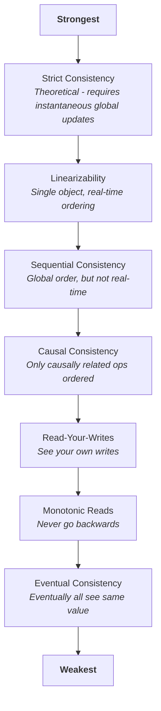
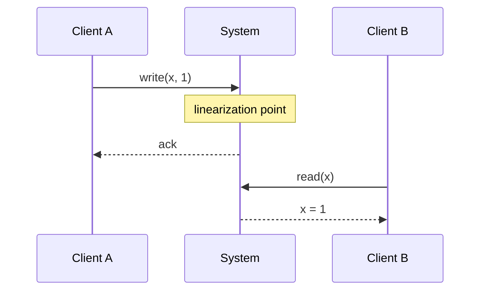
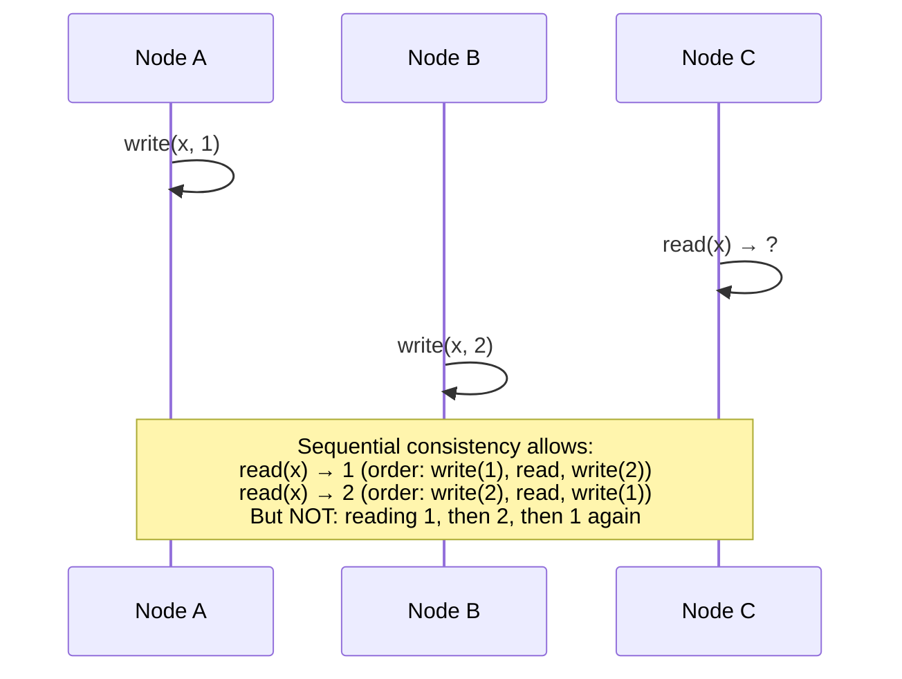
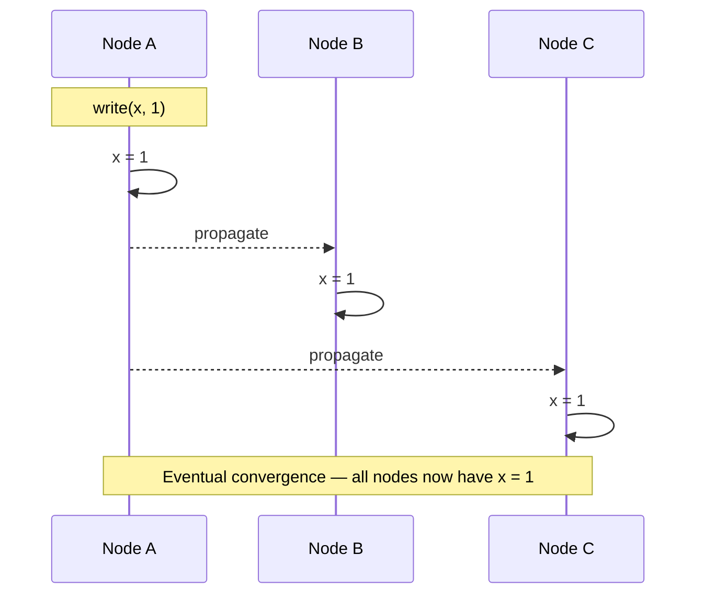

# Consistency Models

## TL;DR

Consistency models define what guarantees a distributed system provides about the order and visibility of operations. Stronger models (linearizability) are easier to reason about but expensive. Weaker models (eventual consistency) offer better performance but require careful application design.

---

## Why Consistency Models Matter

In a single-node system, operations happen in a clear order. In distributed systems:
- Nodes have different views of data at any moment
- Network delays cause operations to arrive out of order
- Failures mean some nodes miss updates

A consistency model is a contract between the system and application:
- **System promise**: "Here's what ordering guarantees you can rely on"
- **Application requirement**: "Here's what ordering I need for correctness"

---

## The Consistency Spectrum



---

## Linearizability

### Definition

Every operation appears to take effect atomically at some point between its start and end. All operations have a global order respecting real-time.



### Properties

1. **Recency**: Reads return most recent write
2. **Real-time ordering**: If op A completes before op B starts, A appears before B
3. **Single-copy illusion**: System behaves as if there's one copy

### Implementation Approaches

**Single leader with synchronous replication:**
```
Client → Leader → [sync write to followers] → ack to client
```

**Consensus (Raft, Paxos):**
```
Client → Leader → [majority agreement] → commit → ack
```

**Compare-and-swap registers:**
```
CAS(expected, new) → atomic read-modify-write
```

### Cost of Linearizability

| Aspect | Impact |
|--------|--------|
| Latency | Must wait for coordination |
| Availability | Cannot respond during partition |
| Throughput | Single serialization point |

### When You Need It

- Distributed locks
- Leader election
- Unique constraint enforcement
- Financial transactions

---

## Sequential Consistency

### Definition

All operations appear to execute in some sequential order, and each processor's operations appear in program order. But this order doesn't need to match real-time.



### Difference from Linearizability

Linearizability: Real-time order matters
Sequential: Only program order per process matters

```
Real time:
  Process 1: write(x,1) completes at t=10
  Process 2: read(x) starts at t=15

Linearizable: read must return 1
Sequential: read might return old value if "read" is ordered before "write"
```

### Use Cases

- Total order broadcast
- Multi-threaded programming model
- Replicated state machines

---

## Causal Consistency

### Definition

Operations that are causally related appear in the same order to all nodes. Concurrent (unrelated) operations may appear in different orders.

### Causality Defined

Operation A causally precedes B if:
1. Same process: A happens before B in program order
2. Reads-from: A is a write, B is a read that returns A's value
3. Transitivity: A precedes C, C precedes B → A precedes B

```
Causal chain:
  User 1: write("Hello")          [message 1]
          ↓ reads
  User 2: write("Reply to Hello") [message 2]

All nodes must see message 1 before message 2
```

### Concurrent Operations

```
User A: write("Post A")
User B: write("Post B")   ← concurrent, no causal relation

Node 1 might show: Post A, Post B
Node 2 might show: Post B, Post A
Both are valid under causal consistency
```

### Implementation: Vector Clocks

```
Vector clock: [A:3, B:2, C:1]

Each node maintains clock for every node
On local event: increment own counter
On send: attach vector clock
On receive: merge (max each component), then increment own
```

**Comparing vector clocks:**
```
V1 = [2, 3, 1]
V2 = [2, 2, 2]

V1 < V2?  No (3 > 2)
V2 < V1?  No (2 > 1)
Concurrent? Yes (neither dominates)
```

### Causal+ Consistency

Causal consistency plus convergence: concurrent writes resolve to same value everywhere.

Resolution strategies:
- Last-writer-wins (LWW)
- Multi-value (return all concurrent values)
- Application-specific merge

---

## Session Guarantees

Weaker consistency models that are often "good enough."

### Read Your Writes

After writing, you see your own writes.

```
✓ Correct:
  write(x, 1)
  read(x) → 1

✗ Violation:
  write(x, 1)
  read(x) → old_value  (stale replica)
```

**Implementation:**
- Sticky sessions (always same node)
- Include write timestamp, wait if replica behind
- Read from leader after writing

### Monotonic Reads

Once you've seen a value, you never see older values.

```
✓ Correct:
  read(x) → 5
  read(x) → 5 or higher

✗ Violation:
  read(x) → 5
  read(x) → 3  (went backwards)
```

**Implementation:**
- Track high-water mark per client
- Sticky sessions
- Version vectors

### Monotonic Writes

Writes by a process are seen in order by all nodes.

```
✓ Correct:
  write(x, 1)
  write(x, 2)
  All nodes eventually have: 1 → 2

✗ Violation:
  Node A sees: 2, then 1 (wrong order)
```

### Writes Follow Reads

If you read a value and then write, your write is ordered after the read.

```
Process reads x = 5, then writes y = 10

All nodes see: write(x, 5) happens before write(y, 10)
```

---

## Eventual Consistency

### Definition

If no new updates are made, eventually all replicas converge to the same value.



### What Eventual Consistency Does NOT Guarantee

- How long "eventually" takes
- What value you'll read before convergence
- Which write "wins" if concurrent

### Conflict Resolution

When concurrent writes exist:

**Last-Writer-Wins (LWW):**
```
write(x, 1) at t=10
write(x, 2) at t=15
Result: x = 2 (higher timestamp wins)

Problem: Clock skew can discard writes
```

**Multi-Value (Siblings):**
```
write(x, 1) at Node A
write(x, 2) at Node B (concurrent)
Result: x = {1, 2} (application must resolve)
```

**CRDTs (Conflict-free Replicated Data Types):**
```
G-Counter: only increment, merge = max per node
LWW-Register: last-writer-wins with logical clock
OR-Set: add wins over concurrent remove
```

---

## Tunable Consistency

Many systems allow per-operation consistency choice.

### Quorum Parameters

```
N = total replicas
W = write quorum (replicas that must ack write)
R = read quorum (replicas to read from)
```

**Guarantees:**
```
W + R > N  → Strong consistency (overlap guarantees seeing latest)
W + R ≤ N  → Eventual consistency (might miss latest)
```

**Common configurations:**

| Config | W | R | Consistency | Use Case |
|--------|---|---|-------------|----------|
| Strong | N | 1 | Strong | Writes slow, reads fast |
| Strong | ⌈N/2⌉+1 | ⌈N/2⌉+1 | Strong | Balanced |
| Eventual | 1 | 1 | Eventual | Maximum performance |
| Write-heavy | 1 | N | Eventual+ | Tolerate write loss |

### Example: Cassandra

```cql
-- Strong consistency
SELECT * FROM users WHERE id = 123 
USING CONSISTENCY QUORUM;

-- Eventual consistency (faster)
SELECT * FROM users WHERE id = 123 
USING CONSISTENCY ONE;
```

---

## Consistency in Practice

### Choosing a Model

| Requirement | Minimum Model |
|-------------|---------------|
| Distributed lock | Linearizable |
| Counter with exact count | Linearizable |
| User sees own posts | Read-your-writes |
| Chat message ordering | Causal |
| Social feed | Eventual |
| Shopping cart | Eventual + CRDT |
| Configuration | Linearizable |

### Mixing Consistency Levels

Most applications use multiple levels:

```
User profile updates: Eventual (staleness OK)
Password changes: Read-your-writes (must see new password)
Account balance: Linearizable (must be accurate)
```

### Testing Consistency

**Jepsen** - Black-box consistency testing:
1. Perform operations against cluster
2. Record history of operations
3. Check if history matches consistency model

**Linearizability checker:**
```
History:
  [invoke write(1)]
  [invoke read]
  [ok write(1)]
  [ok read → 0]  ← Violation! Read should see 1

Check: Is there a linearization? No.
```

---

## Implementation Cost Analysis

Understanding the concrete cost of each consistency model prevents over- or under-engineering.

### Coordination Rounds Per Operation

| Model | Coordination | Detail |
|-------|-------------|--------|
| Linearizable | 1 RTT to leader + majority ack | Write: client→leader→majority→ack. Read: leader lease or read-index RPC. |
| Sequential | 0 extra beyond total-order broadcast | Total order already established; no per-read coordination once log is applied. |
| Causal | Vector clock piggybacked on messages | No extra round trips — metadata travels with application messages. |
| Eventual | 0 | Fire-and-forget async replication. No coordination on the write path. |

### Latency Impact

Linearizable operations pay the price of cross-replica coordination on every request:

```
Latency breakdown (single-region, 3-AZ deployment):
  Linearizable write:  local disk (~1ms) + cross-AZ RTT (~5-15ms) + majority ack
  Linearizable read:   lease-based ~0ms extra, or read-index +1 RTT (~5-15ms)
  Causal write:        local disk (~1ms) + vector clock merge (<0.1ms)
  Eventual write:      local disk (~1ms)

Cross-region (US-East → EU-West, ~80ms RTT):
  Linearizable write:  +80-160ms (consensus across regions)
  Causal write:        +0ms (async replication, metadata only)
  Eventual write:      +0ms
```

### Bandwidth Overhead

| Model | Per-message overhead | Notes |
|-------|---------------------|-------|
| Linearizable | Consensus metadata (~50-100 bytes) | Raft log entry headers, term, index |
| Sequential | Log sequence number (~8 bytes) | Total order broadcast sequence |
| Causal | Vector clock (8 bytes × N nodes) | Grows with cluster size; use interval tree clocks for >50 nodes |
| Eventual | Version/timestamp (~8-16 bytes) | LWW timestamp or version vector |

**Key trade-off**: linearizable consistency in a 3-AZ deployment adds 5-15ms p50 latency per write. For a service doing 10k writes/sec, that means ~100k additional network round trips per second — a measurable infrastructure cost. Causal consistency gives strong-enough ordering for most user-facing features at near-zero overhead.

---

## Real System Consistency Guarantees

Knowing what a system actually provides — not what marketing claims — prevents production surprises. These are the per-operation guarantees as of late 2025.

| System | Version | Default Consistency | Strongest Available | Mechanism | Cost of Strongest |
|--------|---------|--------------------|--------------------|-----------|-------------------|
| Google Spanner | 2024+ | Linearizable (external consistency) | Linearizable | TrueTime + 2PC across Paxos groups | Always-on; ~7ms commit wait for clock uncertainty |
| CockroachDB | v23.2+ | Serializable | Serializable (strict serializable with AS OF SYSTEM TIME) | Raft per-range, HLC timestamps | Default; follower reads trade staleness for latency |
| DynamoDB | 2024 | Eventual | Strongly consistent reads | Leader-based reads from storage nodes | 2× RCU cost, higher latency, single-region only |
| Cassandra | 4.x / 5.0 | Tunable (ONE default) | Linearizable (SERIAL) | Paxos (LWT) for SERIAL; quorum overlap for QUORUM | SERIAL: 4× latency vs ONE; QUORUM: 2× vs ONE |
| MongoDB | 7.x+ | Causal (in causal sessions) | Linearizable | Majority read concern + majority write concern; linearizable reads via no-op Raft write | Linearizable reads add 1 Raft RTT per read |
| PostgreSQL | 16+ | Linearizable (single node, trivially) | Serializable (SSI) | Predicate locking on single node; async replicas are eventual | SSI adds ~5-10% overhead; streaming replicas lag by ms-seconds |
| etcd | v3.5+ | Linearizable | Linearizable | Raft consensus, leader-based reads | Default; serializable reads bypass leader (stale OK) |
| Redis (Cluster) | 7.x | Eventual (async replication) | Eventual (no strong option) | Async primary→replica | No strong consistency; WAIT command reduces but doesn't eliminate window |
| TiDB | v7.x+ | Snapshot isolation | Snapshot isolation (not serializable) | Percolator-style 2PC + Raft | Write-write conflicts detected; but no read-write anomaly protection |

**Common gotcha**: DynamoDB strongly consistent reads only work within a single region. Global Tables use eventual consistency across regions — there is no cross-region strong read option.

**PostgreSQL note**: Single-node PostgreSQL is trivially linearizable because there is only one copy. The moment you add streaming replicas, reads against those replicas are eventual (lag depends on `max_standby_streaming_delay` and load).

---

## CRDT Reference

CRDTs (Conflict-free Replicated Data Types) provide mathematically guaranteed convergence without coordination. Each type defines a merge function that is commutative, associative, and idempotent — meaning replicas can exchange state in any order and still converge.

### G-Counter (Grow-only Counter)

Each node maintains its own counter. The global count is the sum. Merge takes the max per node.

```
State:  { node_id → count }

increment(node_id):
    state[node_id] += 1

value():
    return sum(state.values())

merge(local, remote):
    for each node_id in union(local.keys(), remote.keys()):
        result[node_id] = max(local.get(node_id, 0),
                              remote.get(node_id, 0))
    return result

Example:
  Node A: {A:3, B:0} → value = 3
  Node B: {A:1, B:2} → value = 3
  merge:  {A:3, B:2} → value = 5
```

### PN-Counter (Positive-Negative Counter)

Two G-Counters: one for increments (`P`), one for decrements (`N`). Value = `P.value() - N.value()`.

```
State:  { P: G-Counter, N: G-Counter }

increment(node_id):  P.increment(node_id)
decrement(node_id):  N.increment(node_id)
value():             P.value() - N.value()

merge(local, remote):
    result.P = G-Counter.merge(local.P, remote.P)
    result.N = G-Counter.merge(local.N, remote.N)
    return result
```

### OR-Set (Observed-Remove Set)

Add wins over concurrent remove. Each add operation is tagged with a unique identifier. Remove only removes tags the remover has observed.

```
State:  { element → set_of_unique_tags }

add(element):
    tag = generate_unique_tag()  // e.g., (node_id, lamport_ts)
    state[element].add(tag)

remove(element):
    state[element] = {}  // remove only locally observed tags

lookup(element):
    return len(state[element]) > 0

merge(local, remote):
    for each element:
        result[element] = union(local[element], remote[element])
                          - (local_removed ∩ remote_removed)
    // In practice: keep all tags from both sides,
    // only discard tags that BOTH sides have removed
    return result
```

**Why unique tags matter**: without them, a concurrent add and remove on the same element creates ambiguity. Tags let the merge function distinguish "this add happened after the remove" from "this add was already removed."

### LWW-Register (Last-Writer-Wins Register)

Simplest convergent register. Each write carries a timestamp; highest timestamp wins.

```
State:  { value, timestamp }

write(new_value, ts):
    if ts > state.timestamp:
        state = { value: new_value, timestamp: ts }

read():
    return state.value

merge(local, remote):
    if remote.timestamp > local.timestamp:
        return remote
    return local
    // On tie: break by node_id or discard (implementation-specific)
```

**Warning**: LWW silently drops concurrent writes. This is acceptable for "last status update" use cases but dangerous for anything requiring all writes to be preserved (use OR-Set or a sequence CRDT instead).

---

## Consistency Verification (Jepsen)

[Jepsen](https://jepsen.io) is the industry-standard framework for black-box consistency testing of distributed systems. It injects faults (network partitions, clock skew, process crashes, disk corruption) while running concurrent workloads, then checks whether the recorded history of operations violates the system's claimed consistency model.

### Notable Violations Found

| System | Version | Claimed Guarantee | Actual Violation Found | Year |
|--------|---------|-------------------|----------------------|------|
| MongoDB | 2.6 | Linearizable (w:majority, r:majority) | Stale reads under network partitions; writes acknowledged by majority but not visible to majority reads | 2015 |
| Cassandra | 2.0.x | QUORUM reads = strong consistency | Stale reads after node restart; commitlog replay ordering issues | 2013 |
| etcd | 3.1 | Linearizable reads | Stale reads during leader transfer; new leader served reads before applying pending log entries | 2020 |
| Redis Sentinel | 3.x–5.x | CP (claimed by users) | Split-brain data loss; async replication means acknowledged writes lost on failover | 2013–2020 |
| TiDB | 2.1 | Snapshot isolation | Lost updates under high contention; timestamp oracle gaps caused visibility anomalies | 2019 |
| RabbitMQ | 3.x | Queue mirroring = no message loss | Messages lost during network partitions with `ha-mode: all`; confirmed publishes not replicated | 2014 |

### How Jepsen Catches These

```
1. Start cluster (Docker/LXC containers)
2. Run concurrent client operations (reads, writes, CAS)
3. Inject faults:
   - iptables partitions between specific node pairs
   - SIGSTOP/SIGKILL random nodes
   - Clock skew via ntpd manipulation
4. Record full operation history:
   [invoke :write 1] [ok :write 1] [invoke :read] [ok :read nil] ← violation?
5. Feed history to model checker:
   - Linearizability: Knossos or Elle checker
   - Serializability: Elle (Adya-style dependency graph analysis)
   - Causal: verify partial-order constraints
6. Output: either "valid" or counterexample with specific operations
```

### Hermitage: Single-Node Isolation Testing

For single-node databases, the [Hermitage](https://github.com/ept/hermitage) test suite verifies transaction isolation levels against the SQL standard. It tests for specific anomalies:

| Anomaly | Read Uncommitted | Read Committed | Repeatable Read | Serializable |
|---------|-----------------|----------------|-----------------|--------------|
| Dirty write | Prevented | Prevented | Prevented | Prevented |
| Dirty read | Possible | Prevented | Prevented | Prevented |
| Non-repeatable read | Possible | Possible | Prevented | Prevented |
| Phantom read | Possible | Possible | Possible* | Prevented |
| Write skew | Possible | Possible | Possible* | Prevented |

*Many databases (MySQL/InnoDB, PostgreSQL) prevent phantoms at Repeatable Read via MVCC/gap locks, exceeding the SQL standard minimum.

**Practical advice**: run Jepsen against your deployment configuration, not defaults. Many violations only surface under specific replication settings, failure modes, or version combinations. A system that passes Jepsen at `W=ALL, R=ALL` may fail at `W=QUORUM, R=QUORUM`.

---

## Key Takeaways

1. **Stronger isn't always better** - Pay for what you need
2. **Linearizability is expensive** - Requires coordination, hurts availability
3. **Causal consistency is often sufficient** - Preserves intuitive ordering
4. **Eventual consistency requires conflict handling** - CRDTs or application logic
5. **Session guarantees help** - Read-your-writes often enough for good UX
6. **Tune per-operation** - Different data has different requirements
7. **Test your assumptions** - Use tools like Jepsen to verify
