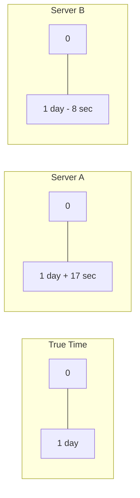
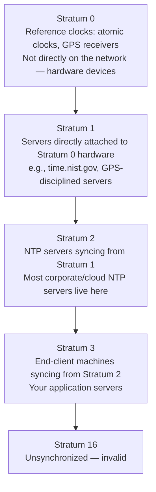
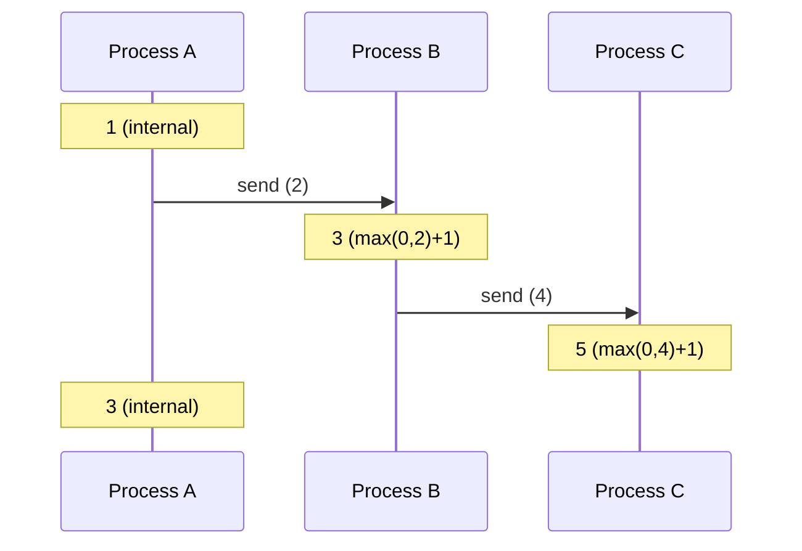
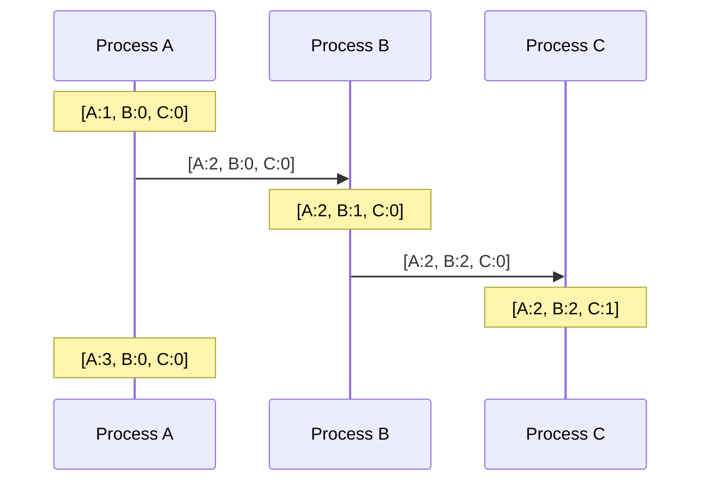
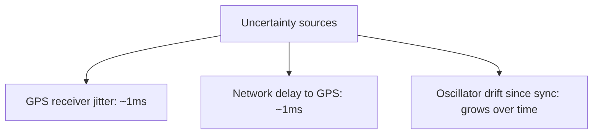
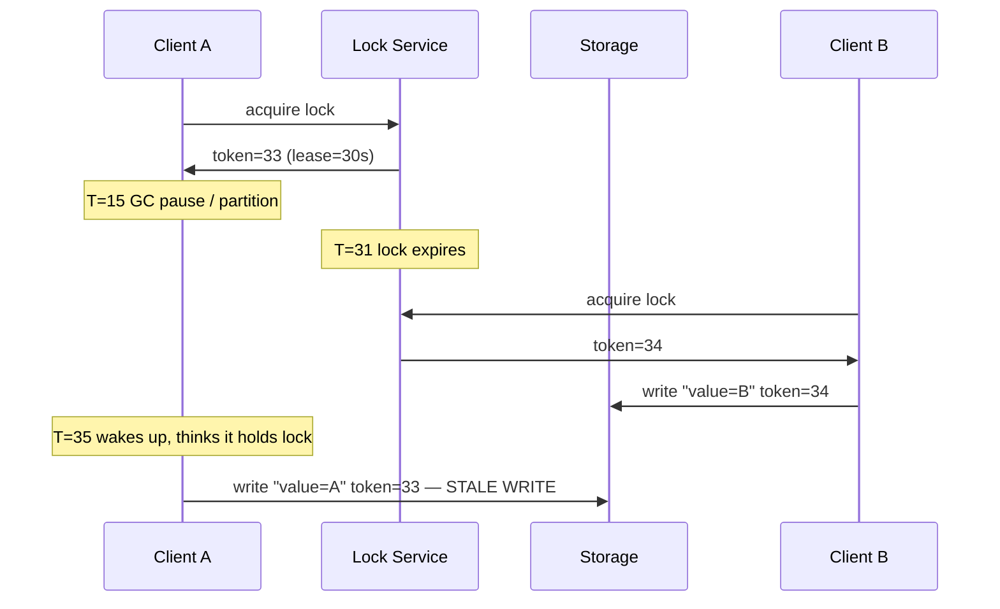
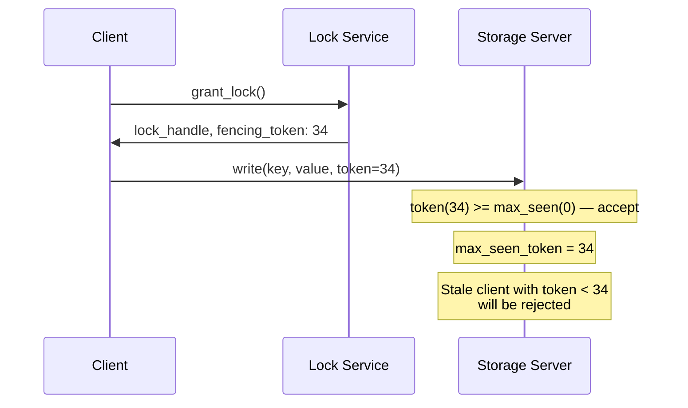

# Distributed Time

## TL;DR

There is no global clock in distributed systems. Physical clocks drift and can't provide ordering guarantees. Use logical clocks (Lamport, Vector) for causality tracking and hybrid clocks (HLC) when you need both causality and wall-clock time. Physical time is good for humans; logical time is good for machines.

---

## The Problem With Physical Time

### Clock Drift

Every computer has a quartz crystal oscillator. They're cheap but imprecise:
- Typical drift: 10-200 ppm (parts per million)
- 100 ppm = 8.6 seconds/day
- After a week: ~1 minute off



### NTP Synchronization

Network Time Protocol synchronizes clocks, but imperfectly:
- LAN accuracy: 1-10 ms typical
- WAN accuracy: 10-100 ms
- Spikes during network issues

```
NTP correction:
  Before: Server clock 500ms ahead
  After:  Clock slewed/stepped back
  
  t=1000ms  t=1001ms  t=1002ms  t=1001ms  t=1002ms
                                    ↑
                             Time went backwards!
```

### Leap Seconds

UTC occasionally adds leap seconds. Clocks might:
- Jump forward (missing a second)
- Repeat a second (same timestamp twice)
- "Smear" over hours (Google's approach)

---

## NTP Deep Dive

### Stratum Hierarchy

NTP uses a layered trust model called strata:



Each hop adds uncertainty. A Stratum 2 server has ~1-10ms accuracy; Stratum 3 clients typically 1-50ms depending on network path.

### Slew vs Step Correction

When NTP detects an offset, it has two correction strategies:

| Strategy | Behavior | When Used |
|----------|----------|-----------|
| **Slew** | Adjusts clock rate gradually, max ±500 ppm | Offset < 128ms (ntpd default) |
| **Step** | Jumps clock instantly to correct time | Offset > 128ms |

Slew is safer — no timestamp discontinuities — but slow. At 500 ppm, correcting a 100ms offset takes ~200 seconds. Step is faster but creates a time discontinuity where timestamps can repeat or gap.

```
Slew correction (offset = 50ms ahead):
  Clock rate slowed from 1.0 to 0.9995 for ~100 seconds
  Applications see time slow down slightly, never jump

Step correction (offset = 500ms ahead):
  Clock jumps:  10:00:05.500 → 10:00:05.000
  Applications see time go BACKWARDS by 500ms
```

### chrony vs ntpd

| Feature | ntpd | chrony |
|---------|------|--------|
| Convergence speed | Minutes to hours | Seconds to minutes |
| VM/container friendly | Poor (assumes stable clock) | Good (handles TSC instability) |
| Intermittent connectivity | Poor | Good (stores drift between restarts) |
| Default on modern distros | RHEL ≤6, older Debian | RHEL ≥7, Fedora, Ubuntu |

**Production recommendation:** Use chrony. It converges 10-100x faster after boot or network disruption, critical for containers and VMs that start/stop frequently.

### Reading `chronyc tracking`

```shell
$ chronyc tracking
Reference ID    : A9FEA97B (169.254.169.123)    # NTP server IP
Stratum         : 3                                # Our stratum level
Ref time (UTC)  : Sat Mar 14 10:23:45 2026        # Last sync time
System time     : 0.000000345 seconds fast          # Current offset from NTP
Last offset     : +0.000000213 seconds              # Offset at last correction
RMS offset      : 0.000000892 seconds              # Moving avg of recent offsets
Frequency       : 3.451 ppm slow                   # Crystal drift rate
```

Key fields: **System time** is the current error. **RMS offset** is your typical accuracy. **Frequency** tells you the crystal's natural drift rate — chrony compensates for this between syncs.

### Cloud Provider NTP

| Provider | NTP Endpoint | Smearing | Typical Accuracy |
|----------|-------------|----------|-----------------|
| **AWS** | `169.254.169.123` (link-local) | Leap-smeared | 0.1-1ms |
| **GCP** | `metadata.google.internal` | Leap-smeared (24h linear) | <1ms |
| **Azure** | `time.windows.com` | Not smeared by default | 5-50ms |

AWS provides a dedicated NTP service via the Nitro hypervisor at a link-local address — no network hop. GCP runs its own Stratum-1 fleet with atomic clocks (similar to Spanner infrastructure). Azure lags behind; for serious time requirements, configure chrony to use an external Stratum-1 source or deploy your own GPS-disciplined NTP server.

**Warning:** Mixing leap-smeared and non-smeared NTP sources causes subtle errors during leap second events — up to 0.5s of drift during the smearing window.

---

## Real-World Clock Incidents

### Linux Leap Second Bug (2012)

On June 30, 2012, a leap second insertion triggered a bug in the Linux kernel's `hrtimer` subsystem. The `CLOCK_REALTIME` adjustment interacted with the futex (fast userspace mutex) implementation, causing threads to spin at 100% CPU instead of sleeping.

**Impact:**
- Reddit, Mozilla, Yelp, FourSquare, StumbleUpon went down
- Qantas airlines grounded flights due to check-in system failures
- Java and MySQL processes particularly affected (heavy futex usage)

**Root cause:** The kernel's `ntp_leap()` called `clock_was_set()`, which invalidated timer caches. Futex waiters woke up, saw time hadn't advanced, and re-entered the wait — creating a busy-spin loop.

**Fix:** `date -s "$(date)"` (force-resetting the clock) was the immediate workaround. Kernel patches landed in 3.4+.

**Lesson:** Leap seconds are not a theoretical concern. If your system runs on Linux, you need leap smearing or kernel patches.

### Cloudflare RRDNS Outage (2017)

On January 1, 2017, Cloudflare's custom DNS server (RRDNS, written in Go) crashed during the leap second.

**Root cause:** The code computed time differences between two CLOCK_REALTIME readings. During the leap second, a later reading returned an earlier timestamp, producing a negative duration. This negative value was passed to a function expecting a positive duration, causing a panic.

```go
// Simplified version of the bug
elapsed := time.Now().Sub(startTime)  // Negative during leap second!
// Used elapsed to compute weighted random selection — panicked on negative
```

**Lesson:** Always use monotonic clocks for duration calculations. Go fixed this at the language level in Go 1.9 — `time.Now()` now stores both wall clock and monotonic readings.

### GPS Week Rollover (2019)

GPS encodes the current week in a 10-bit field, which rolls over every 1024 weeks (~19.7 years). On April 6, 2019, the second GPS week rollover occurred (first was in 1999).

**Impact:**
- Older GPS receivers reported dates from 1999 or showed invalid timestamps
- Affected aviation, maritime, and telecommunications timing equipment
- Some cell tower synchronization degraded, causing call drops

**Lesson:** Time infrastructure has hidden assumptions. If your system depends on GPS-disciplined clocks, verify firmware handles the rollover. The next 10-bit rollover is November 20, 2038 — around the same time as the Unix Y2K38 overflow.

---

## Clock Skew in Cloud Environments

Cloud VMs introduce unique clock challenges that bare-metal servers don't face: live migration, shared hypervisor scheduling, variable TSC (Time Stamp Counter) reliability, and stolen CPU time.

### Per-Provider Characteristics

| Provider | Steady State | During Live Migration | During CPU Steal |
|----------|-------------|----------------------|-----------------|
| **AWS EC2** | 0.1-3ms | 10-50ms spike, recovers in <5s with chrony | 1-10ms if steal >5% |
| **GCP** | <1ms | <5ms (migration is faster) | Rare on dedicated VMs |
| **Azure** | 5-50ms (default NTP) | 50-200ms spikes observed | Common on burstable tiers |

Live migration is the biggest risk: the VM pauses, moves to new hardware, resumes. The TSC jumps, and NTP must re-converge. With ntpd this can take minutes; with chrony, seconds.

### Monitoring Clock Skew

Use Prometheus `node_exporter` to track NTP health:

```promql
# Current offset from NTP server
node_timex_offset_seconds

# Estimated error bound
node_timex_maxerror_seconds

# Clock synchronized (1 = yes)
node_timex_sync_status
```

**Alert thresholds for production:**

| Scope | Warning | Page |
|-------|---------|------|
| Intra-datacenter | >1ms sustained for 5m | >10ms sustained for 1m |
| Cross-region | >10ms sustained for 5m | >50ms sustained for 1m |
| NTP sync loss | `sync_status == 0` for 1m | `sync_status == 0` for 5m |

**Key practice:** Log the local NTP offset with every request trace. When debugging ordering anomalies weeks later, you need to know how far off each node's clock was at that moment.

---

## Why Ordering Matters

### The Timestamp Ordering Problem

```
Server A (clock fast):   write(x, "A") at 10:00:05.000
Server B (clock slow):   write(x, "B") at 10:00:03.000

Actual wall-clock order: B happened first
Timestamp order:         A appears first

If using Last-Writer-Wins: wrong value wins!
```

### Causality Violations

```
Message ordering failure:

Alice → Bob: "Want to grab lunch?" [t=10:00:01.000]
Bob → Alice: "Sure, where?"        [t=10:00:00.500 - clock behind!]

Displayed to Alice:
  Bob: "Sure, where?"
  Alice: "Want to grab lunch?"
  
  ↑ Nonsensical order
```

---

## Lamport Clocks

### Definition

A logical clock that provides a partial ordering of events.

**Rules:**
1. Each process maintains a counter
2. On local event: increment counter
3. On send: attach counter, then increment
4. On receive: counter = max(local, received) + 1

### Example



### Lamport Clock Properties

**Provides:**
- If A → B (A causally precedes B), then L(A) < L(B)

**Does NOT provide:**
- If L(A) < L(B), we cannot conclude A → B
- They might be concurrent

```
L(A) = 5, L(B) = 7

Possible interpretations:
1. A caused B (A → B)
2. A and B are concurrent, happened to get these values
3. B happened before A in real time, but didn't cause it
```

### Total Ordering with Lamport Clocks

Break ties with process ID:

```
Event ordering: (timestamp, process_id)

Event at A: (5, A)
Event at B: (5, B)

Order: (5, A) < (5, B)  (assuming A < B alphabetically)
```

This gives a consistent total order, but it's arbitrary for concurrent events.

---

## Vector Clocks

### Definition

A vector of counters, one per process. Tracks causality precisely.

**Rules:**
1. Each process has a vector of N counters (N = number of processes)
2. On local event: increment own position
3. On send: attach entire vector, increment own position
4. On receive: merge vectors (component-wise max), then increment own

### Example



### Comparing Vector Clocks

```
V1 ≤ V2  iff  ∀i: V1[i] ≤ V2[i]
V1 < V2  iff  V1 ≤ V2 and V1 ≠ V2
V1 || V2 iff  ¬(V1 ≤ V2) and ¬(V2 ≤ V1)  (concurrent)
```

**Examples:**
```
[2, 3, 1] < [2, 4, 1]  ✓  (causally before)
[2, 3, 1] < [3, 3, 1]  ✓  (causally before)
[2, 3, 1] || [2, 2, 2]    (concurrent: 3>2 but 1<2)
[2, 3, 1] || [1, 4, 1]    (concurrent: 2>1 but 3<4)
```

### Vector Clock Properties

**Provides:**
- V(A) < V(B) ⟺ A → B (causally precedes)
- V(A) || V(B) ⟺ A and B are concurrent

**Limitations:**
- O(N) space per event
- Problematic with many processes
- Need to know all processes upfront

---

## Optimizations for Vector Clocks

### Version Vectors (Dotted)

Used in Dynamo-style systems. Track per-replica, not per-event.

```
Object version: {A:3, B:2}

Client reads from A, writes to B:
  New version: {A:3, B:3}

Concurrent write at A:
  Version: {A:4, B:2}

Conflict detected: {A:4, B:2} || {A:3, B:3}
```

### Interval Tree Clocks

For dynamic systems where processes join/leave:
- Split clock on fork
- Merge on join
- More complex but O(log N) typical size

### Bloom Clocks

Probabilistic: may say "concurrent" for causally related events, but never misses true concurrency.

---

## Hybrid Logical Clocks (HLC)

### Motivation

We want:
1. Causality tracking (like logical clocks)
2. Correlation with wall-clock time (for humans/debugging)
3. Bounded divergence from physical time

### Design

HLC = (physical_time, logical_counter)

```
HLC: (pt, l)
  pt = physical time component (wall clock)
  l  = logical component (counter)
```

**Rules:**
```
On local/send event:
  pt' = max(pt, physical_clock())
  if pt' == pt:
    l' = l + 1
  else:
    l' = 0
  
On receive(remote_pt, remote_l):
  pt' = max(pt, remote_pt, physical_clock())
  if pt' == pt == remote_pt:
    l' = max(l, remote_l) + 1
  elif pt' == pt:
    l' = l + 1
  elif pt' == remote_pt:
    l' = remote_l + 1
  else:
    l' = 0
```

### Example

```
Physical clocks: A=100, B=100, C=98 (C is behind)

Event at A: (100, 0)
Send A→B:   B receives, sees (100, 0)
            B's clock is 100, so: (100, 1)
Send B→C:   C receives (100, 1)
            C's clock is 98 (behind!)
            pt' = max(98, 100) = 100
            Result: (100, 2)
```

### HLC Properties

- Monotonic: always moves forward
- Bounded: l is bounded by max clock skew × message rate
- Causal: if A → B, then HLC(A) < HLC(B)
- Close to real time: pt tracks physical time

---

## TrueTime (Google Spanner)

### The Approach

Instead of pretending clocks are accurate, expose uncertainty.

```
TrueTime API:
  TT.now() → [earliest, latest]
  
Example:
  TT.now() = [10:00:05.003, 10:00:05.009]
  
  Meaning: actual time is somewhere in that interval
```

### Infrastructure

- GPS receivers + atomic clocks in datacenters
- Uncertainty typically 1-7ms
- After GPS outage, uncertainty grows



### Commit Wait

For serializable transactions:

```
Transaction T1:
  1. Acquire locks
  2. Get commit timestamp s = TT.now().latest
  3. Wait until TT.now().earliest > s  ("commit wait")
  4. Release locks

Transaction T2 starting after T1 completes:
  Gets timestamp > s guaranteed
  
Result: Real-time ordering of transactions
```

### Trade-off

Commit wait = latency cost:
- ~7ms added to writes
- Worth it for global serializability

---

## Time in Practice

### Use Cases by Clock Type

| Use Case | Clock Type | Why |
|----------|------------|-----|
| Log timestamps | Physical (NTP) | Human readability |
| Event ordering | Lamport | Simple, sufficient for total order |
| Conflict detection | Vector | Detect concurrent writes |
| Database transactions | HLC | Causality + time correlation |
| Global transactions | TrueTime | Real-time ordering guarantee |
| Cache TTL | Physical | Approximate is OK |
| Lease expiration | Physical + margin | Add safety buffer |

### Common Patterns

**Lease safety margin:**
```
Lease holder: refresh every 30s, lease valid 60s
Other nodes: assume lease valid until 60s + clock_skew
```

**Timestamp generation:**
```
// Ensure monotonicity despite clock adjustments
last_timestamp = 0

function get_timestamp():
  now = physical_clock()
  if now <= last_timestamp:
    now = last_timestamp + 1
  last_timestamp = now
  return now
```

**Distributed unique ID with time:**
```
// Snowflake-style ID
ID = [timestamp_ms (41 bits)][machine_id (10 bits)][sequence (12 bits)]

// 4096 IDs per millisecond per machine
// Ordered by time (mostly)
```

---

## Handling Clock Issues

### Detecting Clock Problems

```
On message receive:
  sender_time = message.timestamp
  receiver_time = local_clock()
  
  if receiver_time < sender_time - threshold:
    // Receiver clock behind
    log_warning("Clock skew detected")
    
  if sender_time < last_message_from_sender:
    // Sender clock went backward
    log_error("Clock regression detected")
```

### CLOCK_MONOTONIC vs CLOCK_REALTIME

Operating systems expose multiple clock sources. Choosing wrong causes real bugs (see Cloudflare 2017 incident above).

| Clock | Adjustable? | Use Case |
|-------|------------|----------|
| `CLOCK_REALTIME` | Yes — NTP step, admin change, leap second | Wall-clock timestamps for humans |
| `CLOCK_MONOTONIC` | No — always moves forward, NTP slewing only | Timeouts, durations, intervals |
| `CLOCK_MONOTONIC_RAW` | No — no NTP adjustment at all | Benchmarking, hardware timing |
| `CLOCK_BOOTTIME` | No — includes suspend time | Lease expiration across sleep/wake |

**The rule:** Use `CLOCK_MONOTONIC` for measuring elapsed time and timeouts. Use `CLOCK_REALTIME` only when you need a timestamp that means something to a human.

**Language mappings:**

| Language | REALTIME | MONOTONIC |
|----------|----------|-----------|
| **Go** | `time.Now().Unix()` | `time.Since(start)` uses monotonic internally (Go ≥1.9) |
| **Java** | `System.currentTimeMillis()` | `System.nanoTime()` |
| **Python** | `time.time()` | `time.monotonic()` |
| **Rust** | `SystemTime::now()` | `Instant::now()` |
| **C** | `clock_gettime(CLOCK_REALTIME, ...)` | `clock_gettime(CLOCK_MONOTONIC, ...)` |

Go 1.9 was a watershed: `time.Now()` stores both wall and monotonic readings. Subtraction between two `time.Time` values automatically uses the monotonic component, so `time.Since(start)` is safe even across NTP steps. Before 1.9, the Cloudflare RRDNS bug was possible in any Go program using `time.Now().Sub()`.

### Defensive Design

1. **Never trust equality:** `if time_a == time_b` is dangerous
2. **Use ranges:** "happened between T1 and T2"
3. **Include sequence numbers:** for ordering within same timestamp
4. **Prefer logical time for internal events**
5. **Reserve physical time for human interfaces**

---

## Fencing Tokens Pattern

### The Problem: Stale Leaders

Distributed locks have a fundamental time-dependent failure mode:



Without protection, Client A's stale write silently overwrites Client B's valid write. The lock provided no safety — only the illusion of safety.

### The Solution: Monotonic Fencing Tokens

Every time a lock is granted, the lock service issues a monotonically increasing **fencing token**. The storage layer enforces token ordering:



### Implementation with ZooKeeper

ZooKeeper provides natural fencing tokens via two mechanisms:

1. **`zxid` (transaction ID):** Globally ordered, incremented on every ZK write. Use the `zxid` returned by the lock creation call.
2. **Sequential ephemeral nodes:** Creating `/locks/resource-000000034` gives you `34` as a natural token.

```python
# Pseudocode: fenced lock usage
class FencedLock:
    def __init__(self, zk_client, resource_path):
        self.zk = zk_client
        self.path = resource_path

    def acquire(self):
        node = self.zk.create(
            f"{self.path}/lock-",
            ephemeral=True, sequence=True
        )
        self.token = int(node.split("-")[-1])  # Sequential number as token
        # ... standard lock recipe: watch predecessor, wait ...
        return self.token

    def write_with_fence(self, storage_client, key, value):
        # Token travels with every write — storage validates it
        storage_client.write(key, value, fencing_token=self.token)
```

```python
# Storage side
class FencedStorage:
    def __init__(self):
        self.max_token = {}  # per-key max token

    def write(self, key, value, fencing_token):
        if fencing_token < self.max_token.get(key, 0):
            raise StaleTokenError(
                f"token {fencing_token} < max {self.max_token[key]}"
            )
        self.max_token[key] = fencing_token
        self._persist(key, value)
```

### When You Can't Add Fencing to Storage

If the storage layer doesn't support fencing token validation (e.g., a managed database you don't control), alternatives include:
- **Conditional writes:** Use a version column — `UPDATE ... SET val=?, version=? WHERE version=?`
- **CAS operations:** etcd/Consul support compare-and-swap on revision numbers
- **Idempotency keys with ordering:** See `08-idempotency.md` for detailed patterns

The key insight: **a lock alone never guarantees mutual exclusion in an asynchronous system.** You need either fencing tokens or a consensus protocol that ties the lock to the write path.

---

## Key Takeaways

1. **Physical clocks drift** - Don't rely on them for ordering
2. **NTP helps but isn't perfect** - Millisecond accuracy typical
3. **Lamport clocks give total order** - Simple, low overhead
4. **Vector clocks detect concurrency** - But expensive at scale
5. **HLC combines benefits** - Causality + wall-clock correlation
6. **TrueTime exposes uncertainty** - Enables global transactions
7. **Choose based on requirements** - More guarantees = more cost
8. **Design defensively** - Assume clocks will misbehave
