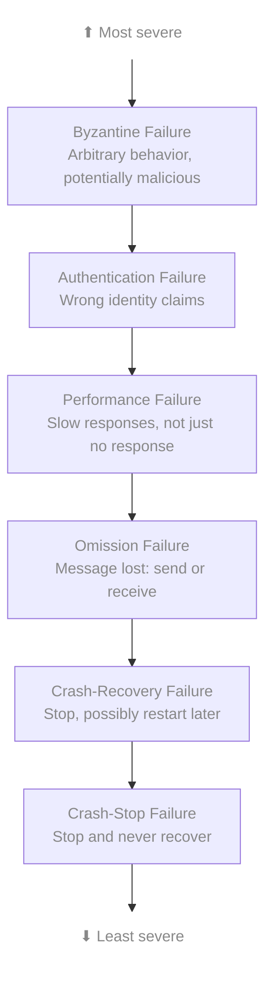
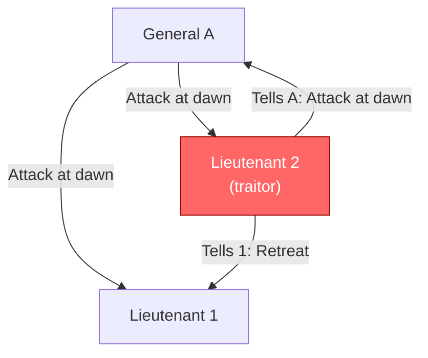
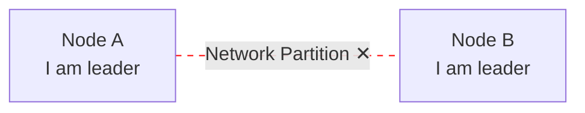
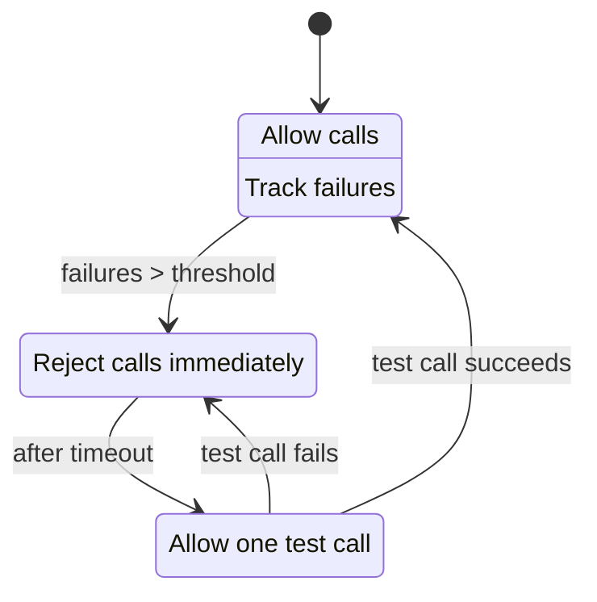
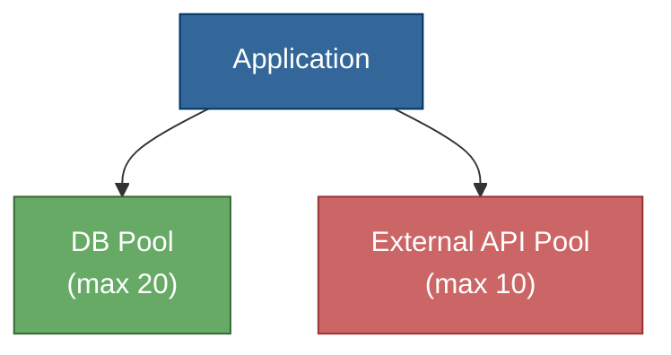

# Failure Modes

## TL;DR

Distributed systems fail in complex ways. Understanding failure modes helps design resilient systems. The key insight: assume anything can fail, and fail in subtle ways. Design for partial failure, not just total failure. Byzantine failures (malicious/arbitrary) are the hardest but also the rarest in most systems.

---

## Failure Model Hierarchy



Each level includes all behaviors of levels below it.

---

## Crash Failures

### Crash-Stop (Fail-Stop)

Node stops forever. Clean failure - other nodes eventually detect it.

```
Normal:     Request → Node → Response
Crashed:    Request → Node → ✕ (no response ever)
```

**Characteristics:**
- Simplest failure model
- Detected via timeout
- Safe assumption in many systems

**Handling:**
- Heartbeats for detection
- Redundancy (replicas)
- Failover to backup

### Crash-Recovery (Fail-Recovery)

Node crashes but may restart. May lose volatile state.

```
Timeline:
  Node: [running]──[crash]──[down]──[restart]──[running]
                      │               │
                Lost: RAM, in-flight requests
                Kept: Disk state (if persisted)
```

**Challenges:**
- What state was persisted?
- Am I seeing a restarted node or a new node?
- How to rejoin cluster?

**Patterns:**
```
// Write-ahead logging for recovery
log.append(operation)
log.fsync()  // ensure durable
execute(operation)

// On restart:
for op in log:
  if not applied(op):
    execute(op)
```

---

## Omission Failures

### Send Omission

Node fails to send a message it should have sent.

```
Node A: send(msg) → [lost in A's network stack] → ✕
```

**Causes:**
- Buffer overflow
- Network interface failure
- Kernel bug

### Receive Omission

Node fails to receive a message sent to it.

```
Sender → [network] → [Node B's buffer full] → ✕
```

**Causes:**
- Receive buffer overflow
- Processing too slow
- Firewall rules

### Network Omission

Message lost in transit.

```
Sender → [network drops packet] → Receiver never sees it
```

**Causes:**
- Router congestion
- Cable damage
- Network partition

### Detecting Omission

Cannot distinguish from slow response:

```
send(request)
wait(timeout)
// Did message get lost? Or just slow?
// Is node down? Or network broken?
```

**Solution: Retries + Idempotency**

---

## Timing Failures (Performance Failures)

### Definition

Node responds, but too slowly.

```
Expected: Request → [50ms] → Response
Actual:   Request → [5000ms] → Response

The response is correct, but too late
```

### Types

**Slow processing:**
- GC pause
- CPU contention
- Disk I/O waiting

**Slow network:**
- Congestion
- Routing issues
- Distance

**Clock failures:**
- Time jumps
- Slow/fast clock
- Leap second issues

### The "Gray Failure" Problem

System is partially working. Harder to detect than complete failure.

```
Node A health:
  CPU: 100% (overloaded)
  Memory: OK
  Network: 50% packet loss
  Disk: Slow (failing drive)

Health check: ping → "OK" (but node is barely functioning)
```

**Detection requires:**
- End-to-end health checks (actual operations)
- Latency percentile monitoring (p99, not just average)
- Anomaly detection

---

## Byzantine Failures

### Definition

Node behaves arbitrarily, including maliciously.

**Examples:**
- Send contradictory messages to different nodes
- Claim to have data it doesn't have
- Corrupt data intentionally
- Lie about its state

```
Byzantine node B:
  To Node A: "Value is X"
  To Node C: "Value is Y"
  To Node D: "Value is Z"
```

### Byzantine Generals Problem



With f traitors, need 3f+1 nodes to reach consensus

### BFT Tolerance Requirements

| Failure Type | Nodes Needed | Failures Tolerated |
|--------------|--------------|-------------------|
| Crash-stop | 2f + 1 | f |
| Byzantine | 3f + 1 | f |

**Why 3f + 1 for Byzantine?**
- f nodes might be faulty
- f nodes might be slow/unreachable
- Need f + 1 honest nodes to agree

### When to Use BFT

**Usually NOT needed:**
- Internal datacenter systems (trust nodes)
- Single-organization deployments

**Sometimes needed:**
- Public blockchains
- Multi-organization systems
- High-security environments
- Hardware that might fail silently

---

## Partial Failures

### The Fundamental Challenge

In distributed systems, some nodes fail while others work.

```
Cluster state:
  Node A: [OK]
  Node B: [CRASHED]
  Node C: [OK]
  Node D: [SLOW]
  Node E: [NETWORK PARTITION]

What is the system state?
Can we continue operating?
```

### Split Brain

Two parts of system believe they're authoritative.



**Consequences:**
- Both accept writes
- Data divergence
- Conflicts on heal

**Solutions:**
- Quorum-based leader election
- Fencing tokens
- External arbiter

### Cascading Failures

One failure triggers more failures.

```
1. Node A fails
2. Traffic redistributed to B, C, D
3. B overloaded → fails
4. Traffic to C, D
5. C overloaded → fails
6. D overloaded → fails
7. Total system failure

One failure → Total outage
```

**Prevention:**
- Circuit breakers
- Load shedding
- Backpressure
- Bulkheads (isolation)

---

## Failure Detection

### Heartbeat-Based

```
while running:
  send_heartbeat_to(coordinator)
  sleep(interval)

Coordinator:
  if time_since_last_heartbeat > timeout:
    mark_node_as_failed()
```

**Trade-offs:**
- Short timeout → Fast detection, more false positives
- Long timeout → Fewer false positives, slow detection

### Phi Accrual Failure Detector

Instead of binary alive/dead, calculate probability of failure.

```
phi = -log10(probability_node_is_alive)

phi = 1  → 10% chance of failure
phi = 2  → 1% chance of failure
phi = 8  → 0.000001% chance of failure

Trigger action when phi > threshold
```

**Advantages:**
- Adapts to network conditions
- No fixed timeout
- Confidence level, not binary

### Gossip-Based Detection

Nodes share observations about each other.

```
Node A → Node B: "I think C might be down"
Node B → Node D: "A and I both think C is down"
Node D → Node A: "Consensus: C is down"

Multiple observers reduce false positives
```

---

## Designing for Failure

### Assume Everything Fails

```
Failure checklist for any component:
  □ What if it crashes?
  □ What if it's slow?
  □ What if it returns wrong data?
  □ What if it's unreachable?
  □ What if it comes back after we thought it was dead?
```

### Failure Domains

Isolate failures to limit blast radius.

```
Physical:
  Datacenter → Rack → Server → Process

Logical:
  Region → Availability Zone → Service → Instance
```

**Design principle:** Replicas in different failure domains

```
Poor:  All replicas on same rack (rack failure = total failure)
Good:  Replicas across racks (rack failure = partial degradation)
Best:  Replicas across AZs (AZ failure = still available)
```

### Graceful Degradation

Continue operating with reduced functionality.

```
Full service:
  - Real-time recommendations
  - Personalized results
  - Full history

Degraded service (recommendation engine down):
  - Popular items instead
  - Generic results
  - "Temporarily limited"
```

### Blast Radius Reduction

Limit impact of any single failure.

**Techniques:**
- Cell-based architecture (isolated customer groups)
- Feature flags (disable broken features)
- Rollback capability
- Canary deployments

---

## Failure Handling Patterns

### Retry with Backoff

```
for attempt in range(max_retries):
  try:
    return call_service()
  except TransientError:
    wait(base_delay * (2 ** attempt) + random_jitter)
raise PermanentFailure()
```

### Circuit Breaker



### Bulkhead

Isolate resources to prevent cascade.



If External API hangs: Only its pool exhausted.
Database calls still work.

### Timeouts

Every external call needs a timeout.

```
// Bad: No timeout
response = http.get(url)  // Might hang forever

// Good: Explicit timeout
response = http.get(url, timeout=5s)

// Better: Deadline propagation
deadline = now() + 10s
response = http.get(url, deadline=deadline)
// Remaining time for next calls: deadline - now()
```

---

## Testing Failures

### Chaos Engineering

Deliberately inject failures to test resilience.

**Netflix Chaos Monkey principles:**
1. Inject failures in production
2. Start small, expand scope
3. Observe system behavior
4. Fix weaknesses found

**Types of chaos:**
- Kill random instances
- Inject latency
- Partition network
- Exhaust resources
- Return errors from dependencies

### Game Days

Planned exercises simulating outages.

```
Scenario: Primary database fails
Steps:
  1. Notify team (or not, for realism)
  2. Fail over primary DB
  3. Observe: Detection time, recovery time, data loss
  4. Document findings
```

### Formal Verification

Model check for failure scenarios.

```
// TLA+ style specification
Invariant: At most one leader at any time
Invariant: Committed writes are never lost
Invariant: Replicas eventually converge

Model checker explores all failure combinations
```

---

## Key Takeaways

1. **Expect partial failure** - Not just up/down, but every shade between
2. **Byzantine is rare but exists** - Most systems can assume crash-stop
3. **Gray failures are sneaky** - Partially working is harder than fully broken
4. **Cascading failures are dangerous** - One failure can take down everything
5. **Failure detection is probabilistic** - Cannot be certain, only confident
6. **Design for failure** - Redundancy, isolation, graceful degradation
7. **Test failures regularly** - Chaos engineering, game days
8. **Every call can fail** - Timeouts, retries, circuit breakers everywhere
