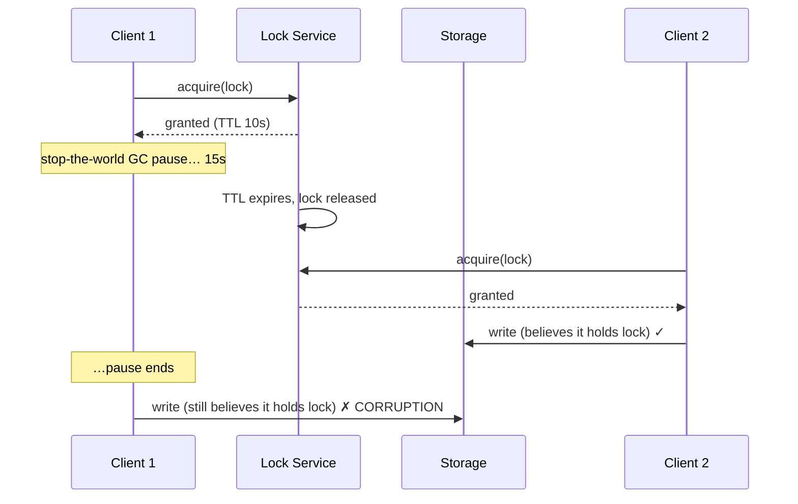

# Distributed Locks and Leases

## TL;DR

A distributed lock is mutual exclusion across machines — and it is fundamentally weaker than a local mutex, because the network can delay messages and a paused process doesn't know it has been paused. Decide first whether the lock is for **efficiency** (avoiding duplicate work; occasional double-execution is acceptable) or **correctness** (double-execution corrupts data). Efficiency locks can use Redis `SET NX` with a TTL. Correctness requires a consensus-backed store (ZooKeeper, etcd) **plus fencing tokens checked at the protected resource** — a lock service alone can never be sufficient, because the lock holder can always be stale without knowing it. Better still: design the lock away with idempotency, compare-and-swap, or single-writer partitioning.

---

## Why Distributed Locking Is Hard

A local mutex relies on guarantees the OS provides: the holder can't lose the lock without releasing it, and a dead holder takes the whole process down with it. Distributed systems provide neither. The canonical failure:



Client 1 is not malicious or buggy — it simply cannot distinguish "I hold the lock" from "I held the lock until 5 seconds ago." Process pauses (GC, VM migration, page faults, SIGSTOP), clock drift, and network delay all produce this scenario. Any design that depends on the holder *knowing* it lost the lock is broken; the holder finds out last.

### Efficiency vs. Correctness

| | Efficiency lock | Correctness lock |
|---|---|---|
| Purpose | Avoid duplicate expensive work | Prevent invariant violation |
| Cost of double-execution | Wasted compute, duplicate email | Corrupted data, double payment |
| Acceptable implementation | Single Redis node, TTL | Consensus store + fencing tokens |
| Better alternative | Often: just tolerate duplicates | Often: idempotency or single-writer |

Most locks in production systems are efficiency locks wearing correctness-lock costumes. Classify honestly before choosing machinery.

---

## Leases: Locks That Expire

A lock with a TTL is a **lease**. Expiry is mandatory in a distributed setting — without it, a crashed holder deadlocks the system forever — but expiry is precisely what creates the stale-holder problem above. Leases come with rules:

- **Renew early, expire late.** Renew at 1/3 of the TTL; size the TTL to survive renewal hiccups (a few missed heartbeats), not just the happy path.
- **Budget the work, not just the lease.** The holder must check remaining lease time before each side-effecting step and abort if insufficient. A 10s lease does not authorize a 60s job.
- **Don't trust your own clock for expiry decisions.** The lock service's clock decides when the lease ends; the holder's view is advisory. Clock skew between holder and service eats into your safety margin (see [Distributed Time](./05-distributed-time.md)).

```python
class LeaseGuard:
    """Wrap side-effecting work in lease-time checks."""

    def __init__(self, lease, safety_margin_s: float = 2.0):
        self.lease = lease
        self.margin = safety_margin_s

    def checkpoint(self):
        # Called before every side-effecting step.
        remaining = self.lease.expires_at - time.monotonic()
        if remaining < self.margin:
            raise LeaseExpiring(
                f"only {remaining:.1f}s left on lease; aborting before side effects"
            )
```

This narrows the unsafe window. It cannot close it — only fencing can.

---

## Fencing Tokens: The Part Everyone Skips

The fix for stale holders is to make the **protected resource** reject them. The lock service issues a monotonically increasing token with every grant; the resource remembers the highest token it has seen and rejects anything lower:

```mermaid
sequenceDiagram
    participant C1 as Client 1
    participant L as Lock Service
    participant S as Storage (checks tokens)
    participant C2 as Client 2

    C1->>L: acquire
    L-->>C1: granted, token=33
    Note over C1: long pause; lease expires
    C2->>L: acquire
    L-->>C2: granted, token=34
    C2->>S: write(token=34) ✓ (34 ≥ 34)
    C1->>S: write(token=33) ✗ rejected (33 < 34)
```

```sql
-- Resource-side fencing in SQL: one statement, no races
UPDATE jobs
SET state = 'done', result = :result, fence = :token
WHERE id = :job_id AND fence < :token;
-- 0 rows updated → you were fenced out; abort.
```

Two consequences that change how you design:

1. **The resource must participate.** If the protected resource can't compare tokens (a third-party API, a printer, an email send), fencing is impossible and a distributed lock cannot give you correctness there. You need idempotency keys at that boundary instead (see [Idempotency](./08-idempotency.md)).
2. **The token source must be monotonic across failovers** — which requires consensus in the lock service itself. ZooKeeper's `zxid`/sequence nodes and etcd's `revision` provide this for free. A lock service that can grant the same epoch twice after its own failover fences nothing.

---

## Implementations

### etcd

etcd builds locks from two primitives: **leases** (TTL'd sessions kept alive by heartbeat) and **revisions** (a cluster-wide monotonic counter — your fencing token).

```python
import etcd3

client = etcd3.client()

lease = client.lease(ttl=10)                      # session
status, _ = client.transaction(
    compare=[client.transactions.create("/locks/reindex") == 0],
    success=[client.transactions.put("/locks/reindex", my_id, lease)],
    failure=[],
)
if status:
    meta = client.get("/locks/reindex")[1]
    fencing_token = meta.mod_revision               # monotonic across failovers
    run_protected_work(fencing_token)               # pass token to the resource
```

### ZooKeeper

The classic recipe: create an **ephemeral sequential** node under the lock path; the lowest sequence number holds the lock; everyone else watches the node immediately before theirs (avoiding herd effects). The session mechanism doubles as the lease, and the sequence number doubles as the fencing token. Use Curator's `InterProcessMutex` rather than hand-rolling — the edge cases (connection loss vs. session loss) are subtle. This is the design Chubby pioneered (see [Chubby](../09-whitepapers/08-chubby.md)) — including the observation that coarse-grained, long-held locks are the workload a lock service is actually good at.

### Redis: `SET NX` and Redlock

```
SET lock:reindex <random_token> NX PX 30000
```

Release safely by checking the random value in a Lua script (delete-if-mine), never a bare `DEL`. On a single Redis node this is a perfectly good **efficiency** lock: fast, simple, and it loses safety on failover (a replica promoted before replicating the lock grants it twice).

**Redlock** — acquiring the lock on a majority of N independent Redis nodes — was proposed to make this safe. Kleppmann's analysis argues it still depends on timing assumptions (bounded clock drift, bounded pauses) that real systems violate, and it issues no fencing tokens; the rebuttal disputes how realistic those violations are. The practical resolution: the debate only matters if you needed a correctness lock — and if you do, use a consensus store with fencing and skip the controversy. For efficiency locks, single-node Redis was already enough.

### Databases as lock services

Often overlooked: if all participants already share a strongly consistent database, use it. Postgres advisory locks (`pg_advisory_lock`) give session-scoped mutual exclusion; a plain row with `SELECT ... FOR UPDATE` or a compare-and-swap on a version column gives fencing semantics with zero new infrastructure. The best lock service is frequently the one you already operate.

---

## Designing the Lock Away

Every distributed lock is a serialization point — a scalability ceiling and an availability liability. The strongest pattern is not needing it:

| Instead of locking… | Use |
|---|---|
| "Only one worker processes job X" | Idempotent processing + unique constraint on completion ([Idempotency](./08-idempotency.md)) |
| "Read–modify–write must be atomic" | Compare-and-swap / conditional write (version column, etcd txn, DynamoDB condition) |
| "Only one writer per entity" | Partition ownership: route all writes for a key to one worker ([Partitioning Strategies](../02-distributed-databases/05-partitioning-strategies.md)) |
| "Only one node runs the scheduler" | Leader election with fencing ([Leader Election](../02-distributed-databases/09-leader-election.md)) — same machinery, but held long-term and observable |
| "Don't run the cron twice" | Run it twice safely: make the job idempotent and cheap to no-op |

Single-writer-by-partition deserves emphasis: it converts a locking problem into a routing problem, which scales horizontally and fails more legibly. Kafka consumer groups, actor systems, and shard-ownership protocols are all this pattern.

---

## Production Guidance

- **TTL sizing:** long enough that renewal survives a worst-case pause you've actually measured (GC logs, p99.9 heartbeat gaps), short enough that failover after a real crash meets your recovery SLO. 10–30s is a common range; sub-second leases are asking for spurious expiry.
- **Jitter on acquisition retries** to avoid thundering herds when a popular lock releases ([Retries, Timeouts, and Hedging](../06-scaling/10-retries-timeouts-hedging.md)).
- **Instrument:** lock wait time, hold time, renewal failures, fencing rejections. A rising fencing-rejection rate is your stale-holder alarm; a lock with p99 hold time near its TTL is a lease about to start lying.
- **One lock service, not four.** Locks via Redis in one team, etcd in another, and DB rows in a third multiplies the failure modes. Consolidate on the consensus store you already run (often the Kubernetes etcd is *not* the right answer — it's a shared blast radius; run your own or use the database).
- **Test the pauses.** Inject SIGSTOP on lock holders in staging and verify fencing rejects the zombie's writes. If you can't demonstrate the rejection, you don't have a correctness lock; you have a hope.

---

## Trade-offs

| Approach | Safety | Liveness | Ops cost | Use for |
|---|---|---|---|---|
| Redis `SET NX` + TTL | Efficiency only | Excellent | Low | Dedup of expensive work |
| Redlock | Disputed | Good | Medium (N nodes) | Rarely the right tier |
| etcd lease + revision | Correctness (with fencing) | Good | Medium | Coordination, shard ownership |
| ZooKeeper ephemeral-seq | Correctness (with fencing) | Good | Medium-high | Same; JVM ecosystems |
| DB advisory/row locks | Correctness within the DB | Tied to DB | None extra | Participants already share the DB |
| No lock (CAS/idempotent/single-writer) | Best | Best | Design effort | Whenever you can |

---

## References

- [How to do distributed locking](https://martin.kleppmann.com/2016/02/08/how-to-do-distributed-locking.html) — Kleppmann; the fencing-token argument
- [Is Redlock safe?](http://antirez.com/news/101) — antirez's rebuttal; read both sides
- [The Chubby lock service](https://research.google/pubs/pub27897/) — Google; coarse-grained locking as a service
- [etcd concurrency API](https://etcd.io/docs/latest/dev-guide/api_concurrency_reference_v3/) and [ZooKeeper recipes](https://zookeeper.apache.org/doc/current/recipes.html)
- [Apache Curator](https://curator.apache.org/) — production ZooKeeper lock recipes
- *Designing Data-Intensive Applications*, ch. 8–9 — process pauses, fencing, and consensus
