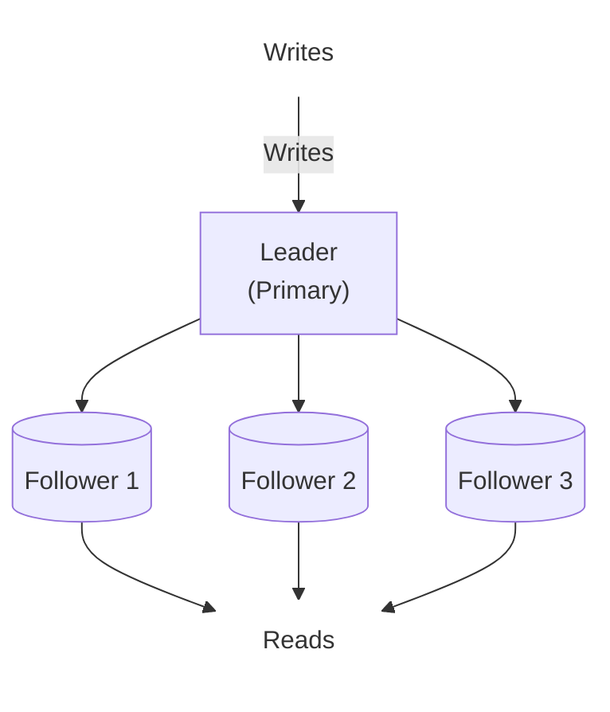
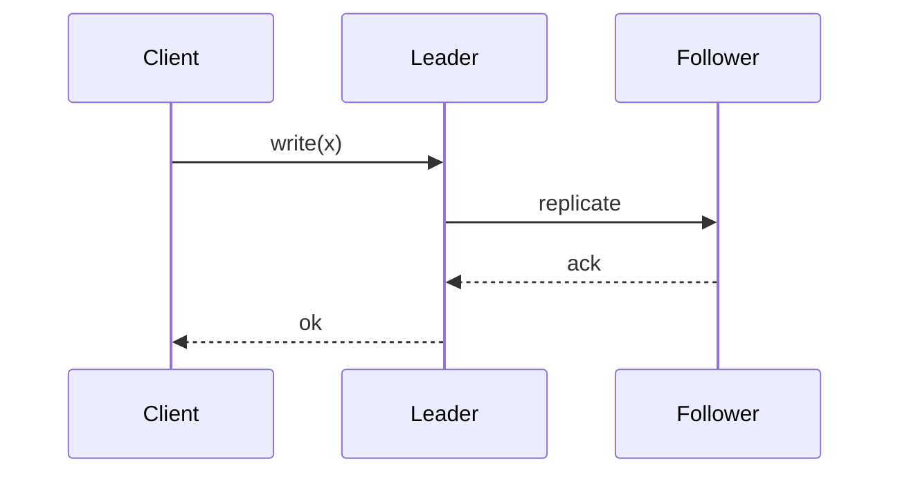
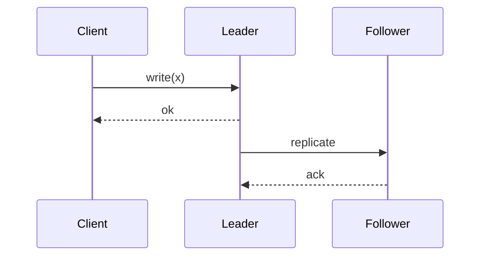
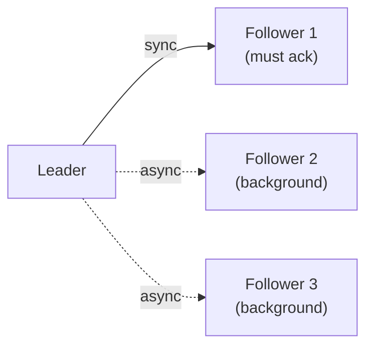
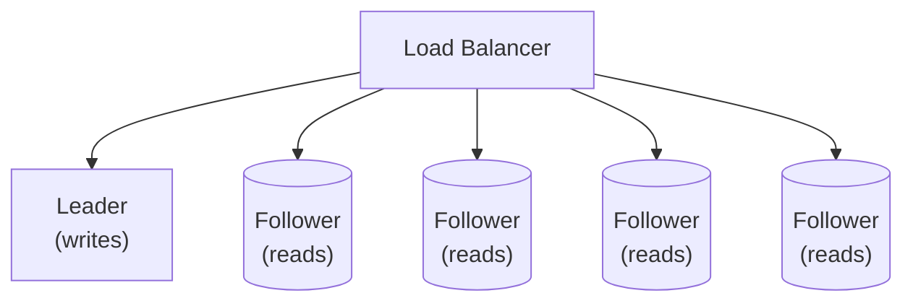
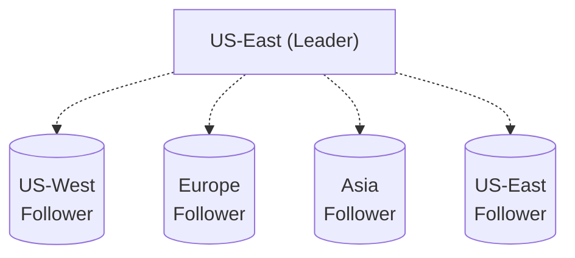
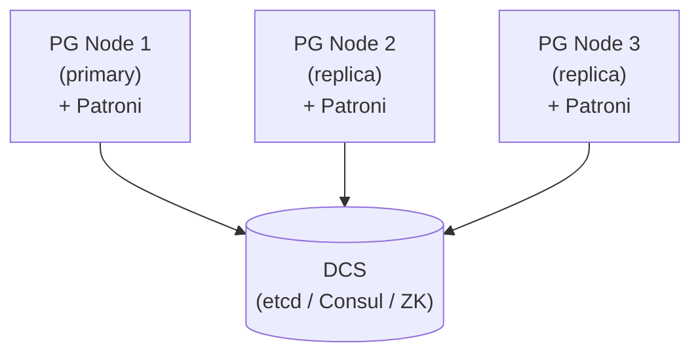
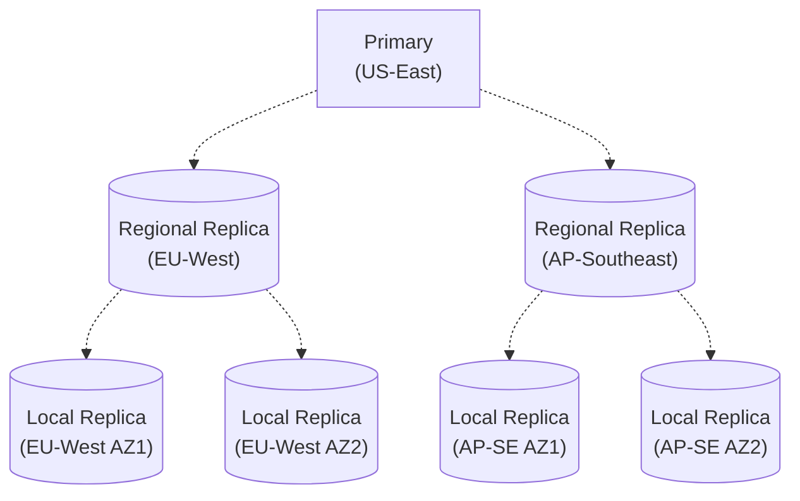

# Single-Leader Replication

## TL;DR

Single-leader (master-slave) replication routes all writes through one node (the leader) and replicates to followers. It provides simple consistency guarantees and is the most common replication model. Trade-offs: leader is a bottleneck and single point of failure; failover is complex. Use synchronous replication for durability, asynchronous for performance.

---

## How It Works

### Basic Architecture



### Write Path

```
1. Client sends write to leader
2. Leader writes to local storage
3. Leader sends replication log to followers
4. Followers apply changes
5. (Optional) Leader waits for acknowledgment
6. Leader responds to client
```

### Replication Log

The leader maintains a log of all changes:

```
Log entry:
  - Log Sequence Number (LSN): 12345
  - Operation: INSERT
  - Table: users
  - Data: {id: 1, name: "Alice"}
  - Timestamp: 2024-01-15T10:30:00Z

Followers:
  1. Fetch entries after their last known LSN
  2. Apply entries in order
  3. Update their LSN position
```

---

## Synchronous vs Asynchronous Replication

### Synchronous Replication

Leader waits for follower acknowledgment before confirming write.



**Guarantees:**
- Data exists on at least 2 nodes before ack
- Follower is always up-to-date

**Trade-offs:**
- Write latency includes replication time
- Follower failure blocks writes
- Usually only 1 sync follower (semi-sync)

### Asynchronous Replication

Leader confirms immediately, replicates in background.



**Trade-offs:**
- Fast writes (no waiting)
- Data loss possible if leader fails
- Followers may lag behind

### Semi-Synchronous

One follower is synchronous, others asynchronous.



**Used by:** MySQL semi-sync, PostgreSQL sync_commit

---

## Replication Lag

### What Is Lag?

Time or operations between leader state and follower state.

```
Timeline:
  Leader:   [op1][op2][op3][op4][op5]
  Follower: [op1][op2][op3]
                        │
                  3 ops behind (lag)
```

### Measuring Lag

```sql
-- PostgreSQL
SELECT 
  client_addr,
  pg_wal_lsn_diff(pg_current_wal_lsn(), replay_lsn) as lag_bytes,
  replay_lag
FROM pg_stat_replication;

-- MySQL
SHOW SLAVE STATUS\G
-- Look at: Seconds_Behind_Master
```

### Causes of Lag

| Cause | Impact | Mitigation |
|-------|--------|------------|
| Network latency | Delay in log delivery | Faster network |
| Follower CPU | Slow apply | Better hardware |
| Large transactions | Big log entries | Smaller batches |
| Long-running queries | Apply blocked | Query timeouts |
| Follower disk I/O | Write bottleneck | Faster storage |

### Consistency Problems from Lag

**Read-your-writes violation:**
```
Client writes to leader
Client reads from lagged follower
  → Doesn't see own write
```

**Monotonic reads violation:**
```
Client reads from follower A (up-to-date)
Client reads from follower B (lagged)
  → Time appears to go backward
```

**Solutions:**
- Read from leader for your own data
- Sticky sessions (same follower)
- Include version/timestamp, wait if behind

---

## Handling Node Failures

### Follower Failure

Follower crashes and restarts.

```
Recovery:
1. Check last applied LSN in local storage
2. Request log entries from leader starting at LSN
3. Apply entries sequentially
4. Resume normal replication
```

### Leader Failure (Failover)

Leader crashes; need to promote a follower.

```
Steps:
1. Detect leader failure (timeout)
2. Choose new leader (most up-to-date follower)
3. Reconfigure followers to replicate from new leader
4. Redirect clients to new leader
5. (If old leader recovers) Demote to follower
```

### Failover Challenges

**Detecting failure:**
```
Is leader dead or just slow?

Too aggressive: false positive, unnecessary failover
Too conservative: extended downtime

Typical: 10-30 second timeout
```

**Choosing new leader:**
```
Options:
1. Most up-to-date follower (least data loss)
2. Pre-designated standby
3. Consensus among followers (Raft-style)
```

**Lost writes:**
```
Leader had commits not yet replicated:
  - Lost when new leader takes over
  - May cause conflicts if old leader recovers
  
Prevention:
  - Sync replication (at least 1 copy)
  - Don't ack until replicated
```

**Split brain:**
```
Old leader comes back, doesn't know it's demoted:
  Two nodes accept writes!
  
Prevention:
  - Fencing tokens
  - STONITH (kill old leader)
  - Epoch numbers
```

---

## Read Scaling

### Reading from Followers

Distribute read load across followers.



### Read Scaling Math

```
Before scaling:
  Leader: 10,000 reads/sec, 1,000 writes/sec
  Bottleneck: Leader saturated

After adding 4 followers:
  Leader: 1,000 writes/sec (writes only)
  Followers: 2,500 reads/sec each
  Total reads: 10,000 reads/sec
  
Reads scale linearly with followers
Writes still limited to single leader
```

### Geo-Distribution

Place followers in different regions.



Users read from closest follower. Writes go to leader (higher latency for distant users).

---

## Statement-Based vs Row-Based Replication

### Statement-Based

Replicate the SQL statement.

```
Leader executes: INSERT INTO users VALUES (1, 'Alice')
Sends to followers: "INSERT INTO users VALUES (1, 'Alice')"
Followers execute same statement
```

**Problems:**
- Non-deterministic functions: `NOW()`, `RAND()`, `UUID()`
- Triggers, stored procedures may behave differently
- Order-dependent statements

### Row-Based (Logical)

Replicate the actual row changes.

```
Leader executes: INSERT INTO users VALUES (1, 'Alice')
Sends to followers: {table: users, type: INSERT, row: {id:1, name:'Alice'}}
Followers apply row change
```

**Advantages:**
- Deterministic
- Works with any statement
- Enables CDC (Change Data Capture)

**Trade-off:**
- Larger log for bulk updates
- Less human-readable

### Mixed Mode

Use statement-based when safe, row-based otherwise.

```
Simple INSERT → Statement-based (compact)
Statement with NOW() → Row-based (deterministic)
```

---

## Implementation Examples

### PostgreSQL Streaming Replication

```sql
-- Primary postgresql.conf
wal_level = replica
max_wal_senders = 10
synchronous_commit = on  -- or 'remote_apply'
synchronous_standby_names = 'follower1'

-- Replica recovery.conf (or standby.signal in PG12+)
primary_conninfo = 'host=primary port=5432 user=replicator'
recovery_target_timeline = 'latest'
```

### MySQL Replication

```sql
-- Leader
server-id = 1
log_bin = mysql-bin
binlog_format = ROW

-- Follower
server-id = 2
relay_log = relay-bin
read_only = ON

CHANGE MASTER TO
  MASTER_HOST = 'leader',
  MASTER_USER = 'replicator',
  MASTER_AUTO_POSITION = 1;
START SLAVE;
```

---

## Monitoring

### Key Metrics

| Metric | What It Shows | Alert Threshold |
|--------|---------------|-----------------|
| Replication lag | Follower behind leader | > 30 seconds |
| Log position diff | Bytes behind | > 100 MB |
| Follower state | Connected/disconnected | Not streaming |
| Apply rate | Log entries/second | Dropping |
| Disk usage | Log accumulation | > 80% |

### Health Checks

```python
def check_replication_health():
  leader_lsn = query_leader("SELECT pg_current_wal_lsn()")
  
  for follower in followers:
    follower_lsn = query_follower("SELECT pg_last_wal_replay_lsn()")
    lag = leader_lsn - follower_lsn
    
    if lag > threshold:
      alert(f"Follower {follower} lagging: {lag} bytes")
    
    if not follower.is_streaming:
      alert(f"Follower {follower} not connected")
```

---

## When to Use Single-Leader

### Good Fit

- Most reads, few writes (read-heavy workloads)
- Strong consistency requirements
- Simple operational model preferred
- Geographic read distribution
- Traditional OLTP applications

### Poor Fit

- Write-heavy workloads (leader bottleneck)
- Multi-region writes (latency to leader)
- Zero-downtime requirements (failover window)
- Conflicting writes from multiple locations

---

## PostgreSQL Streaming Replication Internals

### WAL Sender and Receiver

The primary spawns one **WAL sender** process per connected replica. Each WAL sender reads from the Write-Ahead Log and streams records over PostgreSQL's replication protocol (a libpq connection in `replication` mode). On the replica side, a **WAL receiver** process accepts the stream, writes records to the replica's local WAL files, and then hands them to the startup process for replay against the data files.

```mermaid
graph LR
    subgraph Primary
        WS["WAL Sender<br/>(per replica)"]
        WAL[("WAL<br/>Segments")]
        WAL -->|reads| WS
    end
    subgraph Replica
        WR["WAL Receiver"]
        LocalWAL[("Local WAL<br/>+ Startup Replay")]
        WR -->|writes to| LocalWAL
    end
    WS -->|replication protocol<br/>(streaming walsender)| WR
```

This is a push-based model: the primary pushes WAL as it's generated. The replica does not poll. If the replica falls behind, the WAL sender catches up from the retained WAL segments.

### Physical vs Logical Replication Slots

**Physical replication slots** deliver a byte-for-byte copy of WAL. The replica applies it identically, producing an exact binary clone of the primary. This is the standard mechanism for hot standby replicas.

**Logical replication slots** decode WAL into logical change events (INSERT, UPDATE, DELETE) using an output plugin (e.g., `pgoutput`). This enables:
- Selective table replication (not all-or-nothing)
- Independent schema evolution on subscriber and publisher
- Cross-version replication (e.g., PG 14 → PG 16 for upgrades)
- Feeding CDC pipelines (Debezium, etc.)

Physical slots are simpler and lower-overhead. Logical slots are more flexible but carry higher CPU cost due to decoding.

### Monitoring Replication Slots

```sql
SELECT slot_name, slot_type, active,
       restart_lsn, confirmed_flush_lsn,
       pg_wal_lsn_diff(pg_current_wal_lsn(), restart_lsn) AS retained_bytes
FROM pg_replication_slots;
```

Key fields:
- `active`: whether a consumer is connected. Inactive slots are the danger zone.
- `restart_lsn`: oldest WAL position the slot forces the primary to retain.
- `confirmed_flush_lsn`: (logical slots) position the consumer has confirmed processing.
- `retained_bytes`: how much WAL is being held. If this grows unbounded, you have a problem.

### Slot Bloat Failure Mode

If a consumer disconnects (replica down, Debezium crashed, network partition), the slot **prevents WAL recycling**. The primary accumulates WAL segments indefinitely until the disk fills, at which point the primary itself crashes — taking down writes for all clients.

Monitor with:
```sql
SELECT slot_name,
       pg_size_pretty(pg_wal_lsn_diff(pg_current_wal_lsn(), restart_lsn)) AS retained_wal
FROM pg_replication_slots
WHERE NOT active;
```

Alert when `retained_wal` exceeds a threshold (e.g., 10 GB). Remediation: drop the orphaned slot with `pg_drop_replication_slot('slot_name')` and re-provision the consumer.

### `wal_keep_size` vs Replication Slots

- `wal_keep_size` (formerly `wal_keep_segments`): a **hint** — keeps at least this much WAL, but if the follower is further behind, it will fail to catch up and need a full base backup.
- Replication slots: a **guarantee** — WAL is never recycled past the slot's `restart_lsn`, so the follower can always catch up. But this guarantee can fill your disk.

Best practice: use replication slots for reliability, but pair them with monitoring and automated slot cleanup for inactive consumers.

---

## Failover Automation

### Patroni

**Patroni** is the de facto standard for PostgreSQL HA. Its architecture:



Each Patroni agent holds a **leader lock** in the DCS with a TTL (typically 30s). The primary must renew the lock before expiry or lose leadership.

### Planned Switchover vs Unplanned Failover

**`patronictl switchover`** (planned):
1. Operator selects target replica
2. Patroni checkpoints the primary and waits for the target to catch up
3. Demotes old primary (shuts down PG or makes it read-only)
4. Promotes target replica
5. Other replicas reconfigure to follow new primary
6. Near-zero data loss, typically < 5s total

**`patronictl failover`** / automatic failover (unplanned):
1. Primary fails to renew DCS leader lock (detection time = TTL)
2. Patroni agents on replicas race to acquire the lock
3. Winner is the replica with least replication lag
4. Winner promotes itself, other replicas follow
5. Typical total time: 10–30s (detection + promotion + routing)

### Alternative Tools

| Tool | Database | DCS Required | Fencing |
|------|----------|-------------|---------|
| Patroni | PostgreSQL | Yes (etcd/Consul/ZK) | Watchdog + DCS lease |
| repmgr | PostgreSQL | No | SSH-based (less reliable) |
| Orchestrator | MySQL | No (uses own raft or DB backend) | Hooks-based |
| ProxySQL | MySQL | No | Routing layer only (no fencing) |
| Group Replication | MySQL | No (built-in Paxos) | Consensus-based |

**repmgr** is simpler to set up but lacks DCS integration. It relies on SSH to fence the old primary, which fails if the network is partitioned — exactly when you need fencing most.

### Key Metric

```
failover_time = detection_time + promotion_time + routing_update_time
```

With Patroni: typically 10–30s. The detection phase (DCS lease expiry) dominates. Promotion itself is fast (< 5s). Routing update depends on your proxy layer (HAProxy, PgBouncer, DNS TTL).

---

## Split-Brain Prevention Deep Dive

### Why Timeout-Based Detection Fails

A timeout fires when the primary stops responding. But "not responding" ≠ "dead":
- JVM/CLR GC pause (stop-the-world for 10+ seconds)
- Disk I/O stall (RAID rebuild, SAN hiccup)
- Network partition (primary is fine, just unreachable)
- CPU saturation (primary is alive but slow)

In all cases, the primary is still running and may still accept writes. If a replica promotes itself, you have **two primaries** — split brain.

### Fencing Tokens

A lock service (ZooKeeper, etcd) issues a **monotonically increasing token** with each lock acquisition. Every write to the storage layer must include the token. The storage rejects any write with a token lower than the highest it has seen.

```
Lock service issues token 33 → Old primary writes with token 33
Old primary loses lock
Lock service issues token 34 → New primary writes with token 34
Old primary tries to write with token 33 → REJECTED (33 < 34)
```

This requires the storage layer to participate in the protocol. Not all systems support it, but it is the theoretically sound solution (see Martin Kleppmann's critique of Redlock).

### STONITH (Shoot The Other Node In The Head)

Physical fencing: send an IPMI/BMC command to **power off** the old primary's hardware. If the node is off, it cannot accept writes. Brutal but effective.

Used in: Pacemaker/Corosync clusters, enterprise HA setups with BMC access. Not available in cloud environments (use cloud-native fencing instead — e.g., AWS `stop-instances` API).

### Patroni's Watchdog

Patroni can register a Linux **kernel watchdog** (`/dev/watchdog`). Patroni periodically pings the watchdog. If Patroni crashes or hangs (and thus cannot renew the DCS lock), the watchdog **reboots the entire node** within seconds. This prevents the zombie-primary scenario where the PG process is still running but Patroni is not managing it.

Configuration: set `watchdog.mode: required` in Patroni config. The watchdog timeout must be shorter than the DCS TTL.

### PostgreSQL Timeline Mechanism

After failover, the new primary starts a **new timeline** (timeline ID increments). Replicas must be configured with `recovery_target_timeline = 'latest'` to follow the promoted primary. If a replica is stuck on the old timeline, it will diverge and require a pg_rewind or fresh base backup.

---

## Replication Lag Decoded

### PostgreSQL `pg_stat_replication` Lag Fields

```sql
SELECT client_addr, application_name,
       write_lag, flush_lag, replay_lag
FROM pg_stat_replication;
```

These three fields represent **time intervals**, not byte offsets:

| Field | Measures | Meaning |
|-------|----------|---------|
| `write_lag` | Primary sent WAL → replica OS acknowledged write to disk buffer | Network + kernel buffer delay |
| `flush_lag` | Primary sent WAL → replica fsynced WAL to disk | Network + disk durability delay |
| `replay_lag` | Primary sent WAL → replica applied WAL to data files | Full end-to-end delay including apply |

### Which to Alert On

- **`replay_lag`** for query consistency: if you're reading from the replica, this is how stale your reads are.
- **`flush_lag`** for durability: if the primary dies right now, WAL up to `flush_lag` ago is safely on the replica's disk. Anything between `flush_lag` and `write_lag` is in the replica's OS buffer and could be lost if the replica also crashes.

### Recommended Thresholds

| Threshold | Action | Rationale |
|-----------|--------|-----------|
| `replay_lag` > 100ms | WARN | Read queries may return stale data |
| `replay_lag` > 1s | PAGE | Failover to this replica would lose 1s of data |
| `replay_lag` > 10s | CRITICAL | Replica is falling behind; investigate apply bottleneck |
| `flush_lag` > 5s | PAGE | Durability guarantee degraded |

### MySQL Comparison

MySQL's `Seconds_Behind_Master` is a single coarser metric. It measures the difference between the timestamp embedded in the relay log event and the current time when the SQL thread applies it. Limitations:
- Granularity is 1 second (PostgreSQL's fields are sub-millisecond)
- Does not distinguish write/flush/replay phases
- Can report 0 while the I/O thread is disconnected (misleading)
- Affected by clock skew between primary and replica

---

## Cascading Replication

### Topology



### Use Case

Cross-region replication without overloading the primary's WAL sender. Instead of 6 direct connections to the primary, you have 2 regional connections. The regional replicas fan out locally.

### Configuration

In PostgreSQL, set `primary_conninfo` on cascade replicas to point to the regional replica, not the primary:

```ini
# Local replica in EU-West AZ1
primary_conninfo = 'host=eu-west-regional port=5432 user=replicator'
```

The regional replica must have `wal_level = replica` and `max_wal_senders` configured, just like a primary.

### Trade-offs

- **Lag accumulates**: primary → regional = 50ms, regional → local = 50ms → total = ~100ms
- **Single point of failure**: if the regional replica fails, all downstream replicas lose replication
- **Mitigation**: each downstream replica should be **reconfigurable** to connect directly to the primary. Patroni handles this automatically. Without Patroni, you need an operator runbook or automation.

---

## Semi-Synchronous Silent Downgrade

### The Problem

MySQL's semi-synchronous replication has a parameter `rpl_semi_sync_master_timeout` (default: **10 seconds**). If no replica acknowledges within this timeout, MySQL **silently falls back to asynchronous replication**. It logs a warning but continues accepting writes.

This means:
1. You configured semi-sync expecting durability
2. A replica went down or became slow
3. After 10 seconds, MySQL switched to async **without any client error**
4. Data loss window is now open — writes are only on the primary
5. If the primary crashes, those writes are gone

### Detection

Monitor the MySQL status variable:
```sql
SHOW STATUS LIKE 'Rpl_semi_sync_master_status';
-- ON = semi-sync active
-- OFF = silently fell back to async
```

Alert immediately when this flips to OFF. Also monitor `Rpl_semi_sync_master_no_tx` (count of commits that fell back to async).

### Mitigation Options

| Strategy | Behavior | Risk |
|----------|----------|------|
| Set timeout to very high (e.g., `3600000` ms) | Writes block until replica comes back | Extended write downtime if replica fails |
| Accept the downgrade | Semi-sync is "best effort" | Silent data loss window |
| Use Group Replication (MySQL) | True consensus (Paxos-based) | Higher write latency, more operational complexity |
| Add more sync replicas | Timeout less likely to fire | More infrastructure cost |

### PostgreSQL Comparison

PostgreSQL handles this **more safely by default**. With `synchronous_commit = on` and `synchronous_standby_names` configured:
- If all named synchronous replicas are down, **writes block** — they do not silently fall back to async
- The primary waits indefinitely for a sync replica to come back
- This prevents silent data loss but can cause write availability issues

You can configure `synchronous_standby_names = 'ANY 1 (replica1, replica2, replica3)'` so that a write succeeds as long as any one of three replicas acknowledges. This balances durability with availability.

To opt into MySQL-like behavior (accept async fallback), set `synchronous_commit = local` — but this is an explicit choice, not a silent downgrade.

---

## Key Takeaways

1. **All writes through leader** - Simple consistency, single point of failure
2. **Sync replication for safety** - At cost of latency and availability
3. **Async for performance** - Accept potential data loss
4. **Replication lag is inevitable** - Design reads to handle it
5. **Failover is complex** - Split-brain, data loss, client redirect
6. **Scale reads with followers** - Writes don't scale
7. **Row-based replication is safer** - Deterministic, enables CDC
8. **Monitor lag continuously** - Early warning of problems
