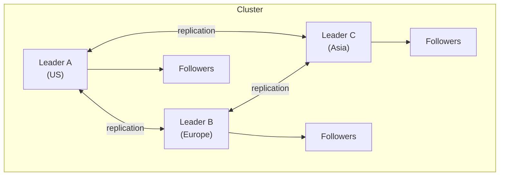
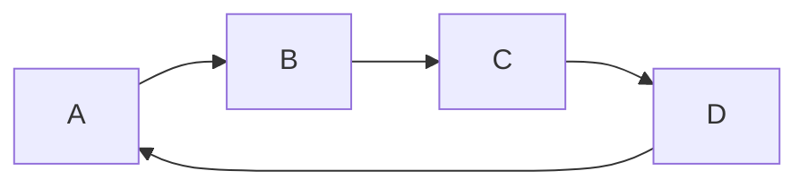
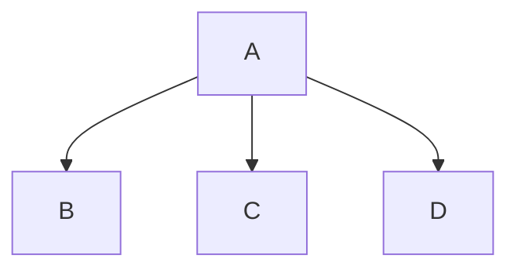
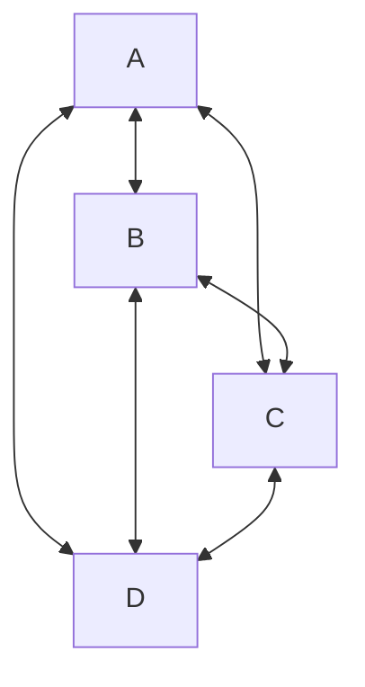
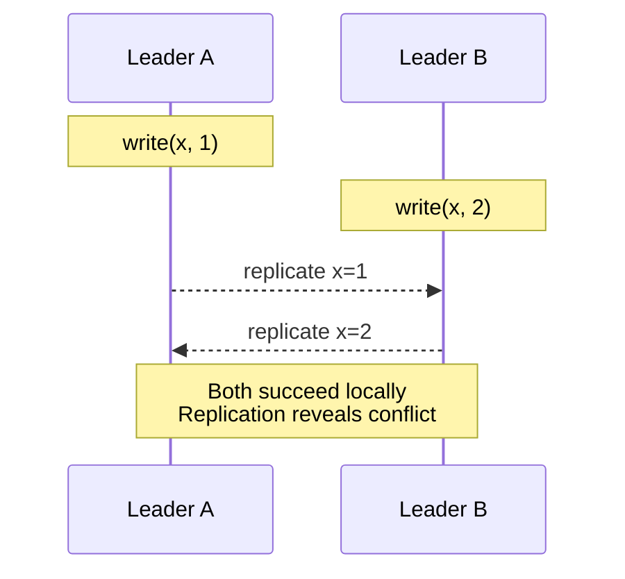

# Multi-Leader Replication

## TL;DR

Multi-leader (master-master) replication allows writes at multiple nodes, each replicating to others. It enables low-latency writes from any location and tolerates datacenter failures. The price: write conflicts are possible and must be resolved. Use when you need multi-region writes or high write availability; avoid when strong consistency is required.

---

## How It Works

### Architecture



Clients write to nearest leader.

### Write Flow

```
1. Client in Europe writes to Leader B
2. Leader B accepts write, responds to client
3. Leader B asynchronously replicates to A and C
4. Leaders A and C apply the change

Write succeeds without waiting for cross-datacenter round-trip
```

### Replication Topologies

**Circular:**


Each node replicates to next; failures break the ring.

**Star (Hub and Spoke):**


Central hub coordinates; hub failure is critical.

**All-to-All:**


Most resilient; conflicts more complex.

---

## Use Cases

### Multi-Datacenter Operation

```
US Datacenter:
  - Users write locally
  - <10ms write latency
  - Survives Europe/Asia outage

Europe Datacenter:
  - Users write locally
  - <10ms write latency
  - Survives US/Asia outage

Cross-DC replication: 100-200ms (async)
```

### Collaborative Editing

```
User A (laptop): types "Hello"
User B (phone): types "World" (same document, same position)

Both succeed locally
Conflict resolution determines final state
```

### Offline Clients

```
Mobile app (disconnected):
  Write changes locally (local leader)
  Queue for sync
  
When connected:
  Sync with server
  Resolve conflicts
  
Each device is essentially a leader
```

---

## Conflict Handling

### When Conflicts Occur



### Types of Conflicts

**Write-Write:**
Same field updated differently.
```
Leader A: user.email = "a@example.com"
Leader B: user.email = "b@example.com"
```

**Delete-Update:**
One deletes, one updates.
```
Leader A: DELETE user WHERE id=1
Leader B: UPDATE user SET name='Bob' WHERE id=1
```

**Uniqueness violation:**
Both create records with same unique value.
```
Leader A: INSERT (id=auto, email='x@y.com')
Leader B: INSERT (id=auto, email='x@y.com')
```

### Conflict Avoidance

Prevent conflicts by routing related writes to same leader.

```
Strategy: All writes for a user go to their "home" datacenter

User 123 → always Leader A
User 456 → always Leader B

Conflicts impossible for per-user data
Cross-user operations may still conflict
```

---

## Conflict Resolution Strategies

### Last-Writer-Wins (LWW)

Highest timestamp wins; discard other writes.

```
Write at A: {value: 1, timestamp: 100}
Write at B: {value: 2, timestamp: 105}

Resolution: value = 2 (higher timestamp)

Problem: Write at A is silently lost
Problem: Clock skew can choose "wrong" winner
```

### Merge Values

Combine conflicting values.

```
Shopping cart at A: [item1, item2]
Shopping cart at B: [item1, item3]

Merge: [item1, item2, item3]
```

### Custom Resolution

Application-specific logic.

```
// For document editing
func resolve_conflict(version_a, version_b):
  merged = three_way_merge(base, version_a, version_b)
  if has_semantic_conflict(merged):
    return create_conflict_marker(version_a, version_b)
  return merged
```

### Application-Level Resolution

Store all versions; let user decide.

```
Read returns: {
  versions: [
    {value: "Alice", timestamp: 100, origin: "A"},
    {value: "Bob", timestamp: 105, origin: "B"}
  ],
  conflict: true
}

UI: "Multiple versions found. Which is correct?"
```

### CRDTs

Conflict-free Replicated Data Types - mathematically guaranteed to converge.

```
G-Counter (grow-only counter):
  Node A: {A: 5, B: 3}
  Node B: {A: 4, B: 7}
  
  Merge: {A: max(5,4), B: max(3,7)} = {A: 5, B: 7}
  Total: 12
  
  Always converges, never conflicts
```

---

## Handling Causality

### The Problem

Without tracking causality, operations may be applied in wrong order.

```
User 1 at Leader A:
  1. INSERT message(id=1, text="Hello")
  2. INSERT message(id=2, text="World", reply_to=1)

Replication to Leader B might arrive:
  Message 2 arrives before Message 1
  reply_to=1 references non-existent message
```

### Version Vectors

Track causality across leaders.

```
Version vector: {A: 3, B: 5, C: 2}

Meaning: 
  - Seen 3 operations from A
  - Seen 5 operations from B
  - Seen 2 operations from C

Comparing:
  {A:3, B:5} vs {A:4, B:4}
  Neither dominates → concurrent, potential conflict
```

### Detecting Causality

```
Write at A: attached vector {A:10, B:5, C:7}
Write at B: attached vector {A:10, B:6, C:7}

A's write precedes B's? 
  Check if A's vector ≤ B's vector
  {A:10, B:5, C:7} ≤ {A:10, B:6, C:7}? 
  Yes: A ≤ B in all components

Apply A's write before B's
```

---

## Replication Lag and Ordering

### Causality Anomalies

```
Leader A: User posts message (seq 1)
Leader B: User edits profile (seq 1)

Without ordering:
  Follower might see edit before message
  Or message before edit
  
With logical clocks:
  Total order preserved across leaders
```

### Conflict-Free Operations

Some operations don't conflict even if concurrent:

```
Concurrent but safe:
  Leader A: UPDATE users SET last_login = now() WHERE id = 1
  Leader B: UPDATE users SET email_count = email_count + 1 WHERE id = 1

Different columns → merge both changes
```

---

## Implementation Considerations

### Primary Key Generation

Avoid conflicts on auto-increment IDs.

```
Strategy 1: Range allocation
  Leader A: IDs 1-1000000
  Leader B: IDs 1000001-2000000
  
Strategy 2: Composite keys
  ID = (leader_id, sequence_number)
  
Strategy 3: UUIDs
  Globally unique, no coordination needed
```

### Uniqueness Constraints

How to enforce unique email across leaders?

```
Option 1: Check before write (racy)
  Check locally → might conflict with other leader

Option 2: Conflict detection
  Accept write, detect duplicate on sync
  Application handles de-duplication

Option 3: Deterministic routing
  All writes for email domain → specific leader
```

### Foreign Key Constraints

Cross-leader FK enforcement is hard.

```
Leader A: INSERT order (user_id = 123)
Leader B: DELETE user WHERE id = 123 (concurrent)

Results:
  Order references non-existent user
  
Solutions:
  - Soft deletes
  - Application-level referential integrity
  - Accept inconsistency, repair later
```

---

## Real-World Systems

### CouchDB

```
// Writes go to any node
PUT /db/doc123
{
  "_id": "doc123",
  "_rev": "1-abc123",
  "name": "Alice"
}

// Conflict detection on sync
GET /db/doc123?conflicts=true
{
  "_id": "doc123",
  "_rev": "2-def456",
  "_conflicts": ["2-xyz789"],
  "name": "Alice Smith"
}

// Application resolves by deleting losing revisions
```

### MySQL Group Replication

```sql
-- Enable multi-primary mode
SET GLOBAL group_replication_single_primary_mode = OFF;

-- All members accept writes
-- Certification-based conflict detection
-- Conflicting transactions rolled back on one node
```

### Galera Cluster

```
wsrep_provider = /usr/lib/galera/libgalera_smm.so
wsrep_cluster_address = gcomm://node1,node2,node3

-- Synchronous replication with certification
-- Conflicts detected before commit
-- "Optimistic locking" - most transactions succeed
```

---

## Monitoring Multi-Leader

### Key Metrics

| Metric | Description | Alert Threshold |
|--------|-------------|-----------------|
| Replication lag | Time behind other leaders | > 1 minute |
| Conflict rate | Conflicts per second | Increasing trend |
| Conflict resolution time | Time to resolve | > 1 second avg |
| Cross-DC latency | Replication RTT | > 500ms |
| Queue depth | Pending replication ops | Growing |

### Health Checks

```python
def check_multi_leader_health():
  for leader in leaders:
    for other in leaders:
      if leader == other:
        continue
      
      # Check replication is flowing
      lag = get_replication_lag(leader, other)
      if lag > threshold:
        alert(f"{leader} → {other} lag: {lag}")
      
      # Check connectivity
      if not can_connect(leader, other):
        alert(f"{leader} cannot reach {other}")
```

---

## When to Use Multi-Leader

### Good Fit

- Multi-datacenter deployment with local writes
- Offline-first applications
- Collaborative editing
- High write availability requirements
- Tolerance for eventual consistency

### Poor Fit

- Strong consistency requirements
- Complex transactions across datacenters
- Low conflict tolerance
- Simple single-region deployments
- Applications unable to handle conflict resolution

---

## Conflict Detection Timing

The moment you choose to detect conflicts determines the fundamental character of your multi-leader system. There are two approaches, and the choice is not really a choice at all.

### Synchronous Detection

Detect conflicts at write time by coordinating with other leaders before acknowledging the write.

```
Client → Leader A: write(x, 1)
Leader A → Leader B: "I'm about to write x, any conflicts?"
Leader B → Leader A: "No conflict" (or "Conflict — reject")
Leader A → Client: "Write accepted"

Round-trip cost: cross-datacenter latency added to every write
```

This approach requires the same cross-leader communication that single-leader replication uses. If Leader B is unreachable, Leader A must either block (losing availability) or proceed without checking (losing the guarantee). You have re-invented single-leader replication with extra steps.

### Asynchronous Detection

Accept the write immediately, detect conflicts when replication delivers the write to other leaders.

```
Client → Leader A: write(x, 1)       ← returns immediately
Leader A → Leader B: replicate(x, 1) ← happens later
Leader B: detects conflict with local write(x, 2)
Leader B: applies resolution strategy
```

This is the standard approach. The write is fast because it only touches the local leader. Conflicts surface later — seconds or minutes later in cross-region setups — and are resolved after the fact.

### The Fundamental Tradeoff

```
Synchronous:  Strong consistency + high write latency + reduced availability
Asynchronous: Eventual consistency + low write latency  + high availability
```

Most multi-leader systems choose async detection because latency is the reason you chose multi-leader in the first place. If you could tolerate cross-datacenter round-trips on every write, you would use single-leader replication and avoid the entire conflict problem. Choosing synchronous conflict detection in a multi-leader setup is a contradiction — you pay the complexity cost of multi-leader without getting the latency benefit.

The exception: systems like Galera Cluster use "virtually synchronous" certification-based replication where the conflict check happens at commit time with minimal coordination. This works within a single region but breaks down at cross-region latencies.

---

## Real System Implementations

Understanding how production systems implement multi-leader replication reveals the gap between theory and practice. Most systems make significant compromises.

### CockroachDB

CockroachDB is **not true multi-leader**. It uses Raft consensus per range (a subset of keys), with a single leaseholder per range that accepts writes. From a client perspective it may look multi-leader — any node can accept a write request — but the node proxies that write to the leaseholder for the relevant range. This is single-leader-per-partition, not multi-leader.

```
Client → Node 3 → (proxy) → Node 1 (leaseholder for range) → Raft consensus → commit
```

This distinction matters: CockroachDB provides serializable isolation precisely because it avoids multi-leader conflicts.

### MySQL Group Replication (Multi-Primary Mode)

True multi-leader. All members accept writes. Conflict detection uses **certification-based replication**: each transaction carries a write set (the set of rows it modified). At commit time, the group communication layer checks whether any concurrent transaction modified overlapping rows. If so, the later transaction is rolled back.

```
Transaction T1 on Node A: write set = {row 5, row 12}
Transaction T2 on Node B: write set = {row 12, row 30}
Overlap on row 12 → T2 is rolled back, client must retry
```

This is synchronous conflict detection, which limits MySQL Group Replication to low-latency network environments (same region).

### PostgreSQL BDR (Bi-Directional Replication)

Asynchronous multi-leader replication with column-level conflict detection. If two leaders update different columns of the same row, BDR merges them without flagging a conflict. Supports CRDT-based data types for automatic resolution. See `01-foundations/04-consistency-models.md` for CRDT details.

```
Leader A: UPDATE user SET name='Alice' WHERE id=1
Leader B: UPDATE user SET email='a@new.com' WHERE id=1

Column-level detection → no conflict → merge both changes
Row-level detection → conflict → requires resolution
```

### Google Docs (Operational Transformation)

Technically multi-leader: every open client is a leader that accepts local edits immediately. Conflict resolution uses Operational Transformation (OT), which transforms concurrent operations so they can be applied in any order and converge to the same document state.

```
User A inserts "X" at position 5
User B inserts "Y" at position 3 (concurrent)

OT transforms A's operation: insert "X" at position 6 (shifted by B's insert)
Both converge to same document
```

OT works for character-level operations but does not generalize to arbitrary database writes.

### DynamoDB Global Tables

Multi-region multi-leader using last-writer-wins resolution. Each item carries a version attribute and a timestamp. Concurrent writes to the same item in different regions result in the higher-timestamp write winning. DynamoDB does not expose conflicts to the application — the losing write is silently discarded.

```
Region us-east-1: PutItem(pk="user#1", name="Alice", ts=100)
Region eu-west-1: PutItem(pk="user#1", name="Bob",   ts=102)

Resolution: name="Bob" (ts 102 > 100)
Alice's write is lost — no notification, no record
```

This is acceptable for session data, caches, and last-login timestamps. It is not acceptable for financial records, inventory counts, or anything where silent data loss causes business impact.

---

## Multi-Leader Anti-Patterns

These are recurring mistakes that cause production incidents in multi-leader deployments. Each looks harmless in a single-leader setup but becomes dangerous when multiple leaders accept concurrent writes.

### Auto-Increment Primary Keys

```
Leader A: INSERT user → id = 101
Leader B: INSERT user → id = 101

Replication: two different users with id = 101
Foreign keys, application caches, API responses — all corrupted
```

**Fix:** Use UUIDs, Snowflake IDs (Twitter-style time-sortable distributed IDs), or pre-allocated ID ranges per leader. UUIDs are simplest but use 128 bits and fragment B-tree indexes. Snowflake IDs give sortability without coordination.

### Foreign Key Constraints Across Leaders

```
Leader A: DELETE FROM users WHERE id = 123
Leader B: INSERT INTO orders (user_id) VALUES (123)  ← concurrent

After replication:
  Leader A has an order referencing a deleted user
  Leader B has a deleted user with no dangling orders (order was inserted before delete arrived)
  State diverges between leaders
```

**Fix:** Use soft deletes (`deleted_at` timestamp) so the row always exists for FK purposes. Or drop FK constraints entirely and enforce referential integrity at the application level with async repair jobs.

### Unique Constraints

```
Leader A: INSERT INTO users (email) VALUES ('alice@example.com')  ← succeeds locally
Leader B: INSERT INTO users (email) VALUES ('alice@example.com')  ← succeeds locally

After replication: two rows with same email on both leaders
Unique index is violated — most databases reject the replicated row
  leaving the two leaders permanently diverged
```

**Fix:** Route all writes for unique-constrained entities to a single designated leader (effectively falling back to single-leader for those tables). Alternatively, use deterministic conflict resolution (e.g., keep the row with the lower UUID).

### Triggers and Stored Procedures

Triggers that fire on write may produce different side effects on each leader depending on local state at execution time. A trigger that sends a notification email will send it twice — once on each leader when replication applies the write.

**Fix:** Design triggers to be idempotent and deterministic. Better yet, move side-effect logic out of the database and into application-level event handlers that deduplicate.

### Schema Changes (DDL)

```
Leader A: ALTER TABLE users ADD COLUMN phone VARCHAR(20)
Leader B: ALTER TABLE users ADD COLUMN phone INTEGER

Both succeed locally. Replication of data rows now fails
because column types don't match.
```

**Fix:** Coordinate DDL changes through a single control plane. Apply schema migrations to all leaders in a defined order. Tools like `pt-online-schema-change` or `gh-ost` help but must be orchestrated across leaders.

---

## Monitoring Multi-Leader Health

Standard database monitoring is necessary but not sufficient for multi-leader. You must monitor the replication relationships themselves — and monitor them in both directions.

### Replication Lag Per Direction

In single-leader, lag is unidirectional: leader → follower. In multi-leader, every pair of leaders has bidirectional replication, and lag may differ by direction.

```
A → B lag: 200ms  (normal — cross-Atlantic)
B → A lag: 45s    (problem — B's outbound replication is stalled)

Monitor each direction independently. Alert thresholds should
account for expected cross-region latency.
```

### Conflict Rate Tracking

Track conflicts per second, broken down by table and conflict type. A sudden spike in conflict rate usually indicates an application bug (e.g., a new code path that stopped routing writes to the correct leader) rather than an infrastructure problem.

```
Baseline: 2 conflicts/sec (acceptable for this workload)
Alert:    50 conflicts/sec sustained for 5 minutes
Action:   check recent deployments, examine conflict details
```

### Divergence Detection

Even with conflict resolution, leaders can silently diverge due to bugs in replication or resolution logic. Run periodic full-table checksums to verify that leaders hold identical data.

```
MySQL:   pt-table-checksum — computes per-chunk CRC32 across replicas
Postgres: pg_comparator — detects row-level differences between instances

Schedule: nightly for large tables, hourly for critical small tables
```

### Queue Depth and Split-Brain Indicators

Monitor pending replication events per leader. A growing queue means replication is falling behind consumption — eventually the queue fills and replication stalls or drops events.

Split-brain detection: if both leaders are accepting writes for the same key space but replication between them has been down for longer than your alert threshold, you are accumulating conflicts that will be painful to resolve. Alert on `replication_link_down AND write_rate > 0` for both leaders simultaneously.

---

## Key Takeaways

1. **Writes anywhere** - Low latency, but conflicts possible
2. **Conflicts are inevitable** - Must have resolution strategy
3. **LWW is simple but lossy** - Consider merge or CRDTs
4. **Topology matters** - All-to-all most resilient
5. **Causality tracking is complex** - Version vectors help
6. **Avoid conflicts when possible** - Route related writes together
7. **Unique constraints are hard** - Application-level handling often needed
8. **Great for multi-region** - Primary use case is geo-distribution
