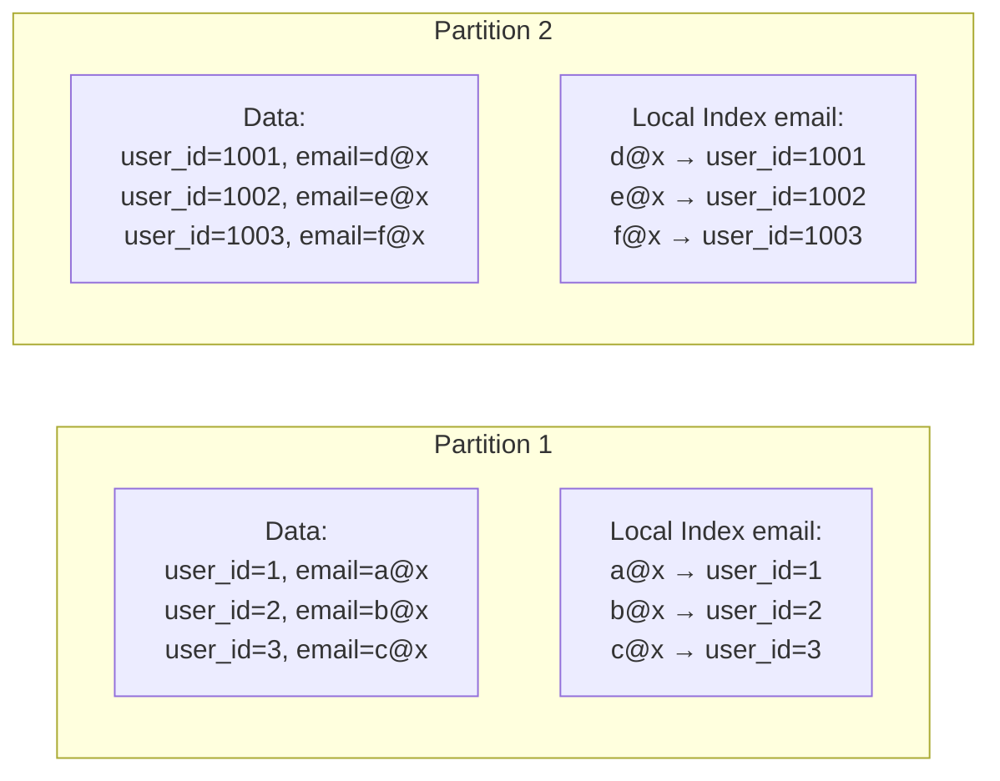
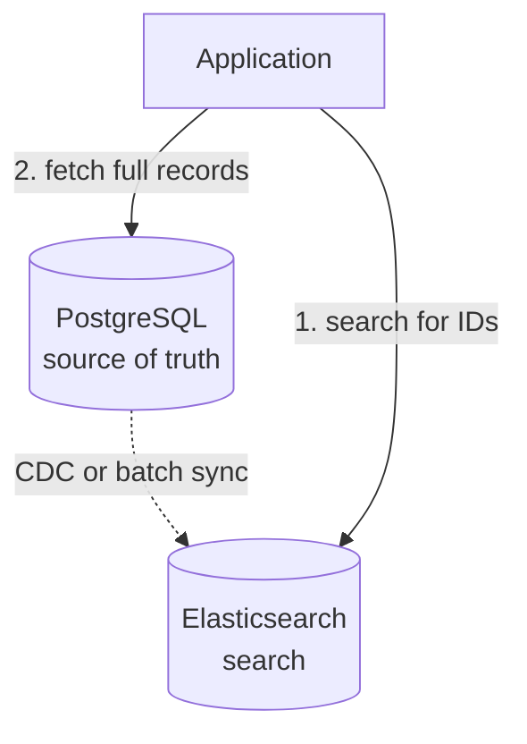
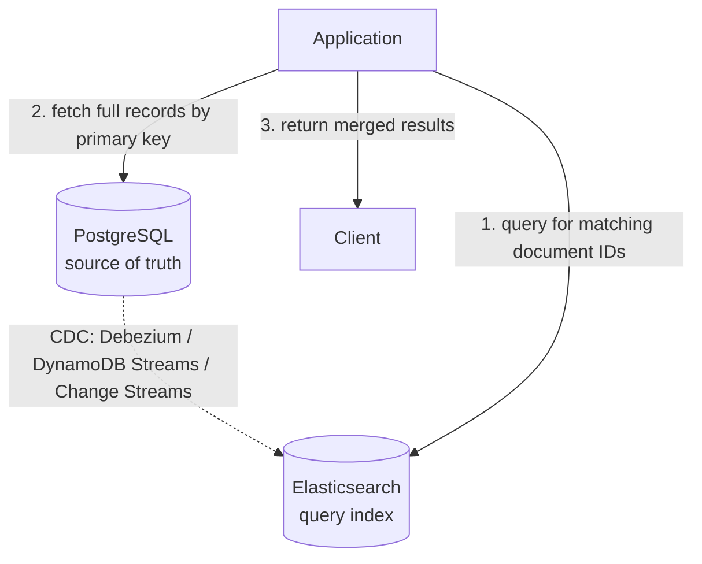

# Secondary Indexes in Distributed Databases

## TL;DR

Primary key determines partition location. Secondary indexes enable queries on non-partition-key columns but add complexity. Two approaches: local indexes (fast writes, scatter reads) and global indexes (fast reads, slow writes). Choose based on read/write ratio and query patterns. Secondary indexes are expensive in distributed systems—use sparingly.

---

## The Problem

### Partition by Primary Key

```
Users table, partitioned by user_id:

Partition 1: user_id 1-1000
Partition 2: user_id 1001-2000
Partition 3: user_id 2001-3000

Query: SELECT * FROM users WHERE user_id = 1500
  → Goes to Partition 2 only ✓
```

### Query by Non-Partition Column

```
Query: SELECT * FROM users WHERE email = 'alice@example.com'

Problem: email is not the partition key
  - Which partition has this email?
  - Must check ALL partitions (scatter-gather)
  
Without secondary index: O(N) partitions scanned
With secondary index: O(1) or O(few) partitions
```

---

## Local Secondary Indexes

### Concept

Each partition maintains its own index for local data.



### Write Path

```
INSERT user (id=1500, email='new@example.com')

1. Route to Partition 2 (based on id=1500)
2. Insert data row
3. Update local email index on Partition 2

Single partition operation ✓
```

### Read Path

```
SELECT * FROM users WHERE email = 'alice@example.com'

1. Don't know which partition has this email
2. Query ALL partitions' local indexes
3. Aggregate results

Scatter-gather to all partitions ✗
```

### Trade-offs

| Aspect | Local Index |
|--------|-------------|
| Write performance | Fast (single partition) |
| Read performance | Slow (all partitions) |
| Consistency | Strong (same partition) |
| Index maintenance | Simple |
| Hotspot risk | None (distributed) |

### Use Cases

- Write-heavy workloads
- Queries often include partition key
- Analytics queries (expect scatter-gather)
- Low-cardinality columns (few matches per partition)

---

## Global Secondary Indexes

### Concept

Index partitioned separately from data.

```mermaid
graph LR
    subgraph Data Partitions
        P1[("Partition 1<br/>user_id 1-1000")]
        P2[("Partition 2<br/>user_id 1001-2000")]
        P3[("Partition 3<br/>user_id 2001-3000")]
    end
    subgraph Index Partitions — by email hash
        IP1["Index Partition 1 (a-m)<br/>alice@x → user_id=5<br/>bob@x → user_id=1500<br/>carol@x → user_id=2500"]
        IP2["Index Partition 2 (n-z)<br/>ned@x → user_id=42<br/>zoe@x → user_id=999"]
    end
```

### Write Path

```
INSERT user (id=1500, email='bob@example.com')

1. Write data to Partition 2 (based on id)
2. Write to Index Partition 1 (based on email hash)

Two partitions involved
May need distributed transaction or async update
```

### Read Path

```
SELECT * FROM users WHERE email = 'bob@example.com'

1. Hash 'bob@example.com' → Index Partition 1
2. Lookup in Index Partition 1 → user_id=1500
3. Fetch from Data Partition 2

Two partitions, but targeted (not scatter) ✓
```

### Trade-offs

| Aspect | Global Index |
|--------|--------------|
| Write performance | Slow (multi-partition) |
| Read performance | Fast (targeted lookup) |
| Consistency | Async = eventual, Sync = slow |
| Index maintenance | Complex (distributed update) |
| Hotspot risk | Possible (popular index values) |

### Consistency Options

**Synchronous update:**
```
Transaction:
  1. Write data
  2. Write index
  3. Commit both

Guarantees: Read-your-writes
Cost: 2PC overhead, higher latency
```

**Asynchronous update:**
```
1. Write data (committed)
2. Queue index update
3. Apply index update (eventually)

Guarantees: Eventually consistent
Cost: May read stale index
```

---

## Partitioning the Global Index

### By Index Value (Term-Partitioned)

```
Index partitioned by the indexed column value:

email starting with a-m → Index Partition 1
email starting with n-z → Index Partition 2

Query: WHERE email = 'alice@x'
  → Only Index Partition 1
  
Good for: Single-value lookups
Bad for: Range queries across partition boundaries
```

### By Document ID

```
Index entries for same document → same partition

user_id 1-1000: all indexes in Index Partition 1
user_id 1001-2000: all indexes in Index Partition 2

Write: Single partition for all indexes
Read: May need multiple index partitions

Similar to local index but separated
```

---

## Implementation Examples

### DynamoDB Global Secondary Index

```
Table: Users
  Primary Key: user_id (partition key)
  Attributes: email, name, city

GSI: email-index
  Partition Key: email
  Projection: ALL  (copies all attributes)
  
Query:
  aws dynamodb query \
    --table-name Users \
    --index-name email-index \
    --key-condition-expression "email = :e" \
    --expression-attribute-values '{":e":{"S":"alice@x"}}'
```

**GSI Characteristics:**
- Eventually consistent reads
- Provisioned capacity separate from table
- Writes to table propagate async to GSI

### Cassandra Materialized Views

```sql
CREATE TABLE users (
    user_id uuid PRIMARY KEY,
    email text,
    name text
);

-- Materialized view for email lookups
CREATE MATERIALIZED VIEW users_by_email AS
    SELECT * FROM users
    WHERE email IS NOT NULL
    PRIMARY KEY (email, user_id);

-- Query by email
SELECT * FROM users_by_email WHERE email = 'alice@example.com';
```

**MV Characteristics:**
- Synchronous update
- Base table write waits for MV update
- Strongly consistent

### Elasticsearch

```json
// Index with multiple searchable fields
PUT /users
{
  "mappings": {
    "properties": {
      "user_id": { "type": "keyword" },
      "email": { "type": "keyword" },
      "name": { "type": "text" },
      "tags": { "type": "keyword" }
    }
  }
}

// Query by any field
GET /users/_search
{
  "query": {
    "term": { "email": "alice@example.com" }
  }
}
```

**ES Characteristics:**
- Inverted index for all fields
- Near real-time indexing
- Scatter-gather for distributed search

---

## Scatter-Gather Optimization

### Parallel Queries

```
Query all partitions simultaneously:

Coordinator:
  for partition in partitions:
    async_query(partition)
  
  results = await_all()
  return merge(results)

Latency = max(partition latencies) + merge time
```

### Short-Circuit Evaluation

```
Query: SELECT * FROM users WHERE email = 'x' LIMIT 1

Scatter to all partitions
First partition to return match → return immediately
Cancel other queries

Optimization for existence checks
```

### Bloom Filters

```
Each partition maintains Bloom filter for indexed values

Query: WHERE email = 'alice@example.com'

1. Check Bloom filter on each partition (local operation)
2. Only query partitions where Bloom filter says "maybe"
3. Skip partitions where Bloom filter says "definitely not"

Reduces scatter-gather to likely partitions
```

---

## Covering Indexes

### Include All Needed Columns

```
Index includes:
  - Indexed column (email)
  - Primary key (user_id)
  - Additional columns (name, city)

Query: SELECT name, city FROM users WHERE email = 'alice@x'

1. Lookup in index
2. Return directly from index (no data fetch needed)

Avoids second lookup to data partition
```

### Index-Only Scans

```sql
-- PostgreSQL example
CREATE INDEX idx_users_email_name ON users(email) INCLUDE (name);

EXPLAIN SELECT name FROM users WHERE email = 'alice@x';
-- Index Only Scan using idx_users_email_name
```

### Trade-off

```
+ Faster reads (no secondary fetch)
- Larger index (stores more data)
- More writes (update index on any included column change)
```

---

## Secondary Index Alternatives

### Denormalization

```
Instead of index on orders.customer_email:

Store customer_email directly in orders table:
  orders: {order_id, customer_id, customer_email, ...}

Query by email → query orders directly

Trade-off:
  + No index maintenance
  - Data duplication
  - Update anomalies
```

### Materialized Views

```
Pre-compute query results as a new table:

CREATE TABLE orders_by_customer_email AS
  SELECT * FROM orders
  JOIN customers ON orders.customer_id = customers.id;

Refresh periodically or on change

Trade-off:
  + Fast reads
  - Storage overhead
  - Staleness or refresh cost
```

### External Search System



Trade-off:
- (+) Purpose-built search
- (+) Complex query support
- (-) Operational complexity
- (-) Eventual consistency

---

## Choosing an Approach

### Decision Matrix

| Scenario | Recommendation |
|----------|----------------|
| Write-heavy, occasional reads | Local index |
| Read-heavy, rare writes | Global index |
| Full-text search | External search system |
| Analytics queries | Local index + scatter-gather |
| Single-value lookups | Global index |
| Point queries with partition key | No secondary index needed |

### Questions to Ask

1. **What's the read/write ratio?**
   - High reads → global index
   - High writes → local index

2. **Is eventual consistency acceptable?**
   - Yes → async global index
   - No → sync global index or local

3. **Do queries include partition key?**
   - Yes → local index might suffice
   - No → global index or scatter-gather

4. **How selective is the index?**
   - Low cardinality → local index OK
   - High cardinality → global index better

---

## Local vs Global Index Tradeoffs

### Side-by-Side Comparison

| Dimension | Local Index | Global Index |
|-----------|-------------|--------------|
| Write cost | 1 partition (cheap) | 2+ partitions (expensive) |
| Read cost (no partition key) | All partitions (scatter-gather) | 1 index partition + 1 data partition |
| Read cost (with partition key) | 1 partition | 1 index partition + 1 data partition |
| Consistency | Strong (same partition) | Sync = strong, Async = eventual |
| Failure impact | Isolated to one partition | Index partition failure → stale reads |
| Index lag | None | Async: milliseconds to seconds |

### Write Amplification in Global Indexes

Every write to a globally indexed table produces at least two writes on different partitions:

```
User insert (user_id=42, email='alice@x'):

  Write 1: Data partition (partition key = user_id)   → Partition A
  Write 2: Index partition (partition key = email)     → Partition B

If Partition B is unreachable:
  - Data write succeeds on Partition A
  - Index write fails or is queued
  - Index becomes stale until Partition B recovers
  - Reads via the index may miss user_id=42
```

This is the fundamental tension: **you cannot make a global index both strongly consistent and highly available**. You pick two out of three (consistency, availability, partition tolerance — CAP applies to the index itself).

### The DynamoDB Async Model

DynamoDB GSIs follow the async approach:

- Data write commits immediately on the base table
- Index update is propagated asynchronously (typically under one second)
- GSI reads are **always** eventually consistent — no strongly consistent read option on GSI
- If GSI write throughput is insufficient, updates queue up and index lag grows
- Monitoring `OnlineIndexPercentageProgress` and `ThrottleCount` on the GSI is critical

### When Local Beats Global

- **Write-heavy workloads (>80% writes):** Avoiding cross-partition coordination dominates
- **Queries usually include partition key:** Scatter-gather is avoided naturally
- **Low-latency write SLA (<5ms p99):** Cannot tolerate cross-partition round-trip
- **Partition count is small (<20):** Scatter-gather cost is bounded and acceptable

### When Global Beats Local

- **Read-heavy workloads (>80% reads):** Single-partition index lookup is worth the write overhead
- **Queries rarely include partition key:** Scatter-gather on every read is unacceptable at scale
- **High partition count (100+):** Scatter-gather latency grows linearly with partition count
- **Eventual consistency is acceptable:** Async global index gives best of both worlds

---

## Secondary Indexes in Distributed Databases

### Cassandra

Cassandra offers multiple secondary index strategies, each with distinct tradeoffs:

- **Materialized Views:** Server-maintained secondary table. Writes to the base table synchronously update the MV. Provides strong consistency but adds write latency. Cassandra documentation recommends limiting to low-cardinality use cases.
- **SAI (Storage-Attached Indexes):** Replacement for the deprecated SASI. Each node indexes its own data (local index). Supports equality, range, and `CONTAINS` queries. Recommended over SASI since Cassandra 5.0.
- **Manual denormalization:** Write to multiple tables in the application layer. Most control, most complexity. Use `BATCH` statements (logged) for atomicity across tables on the same partition.

### CockroachDB

CockroachDB treats secondary indexes as globally consistent via distributed transactions:

- Every index write participates in the same transaction as the data write
- Uses the Raft consensus protocol to replicate index entries across ranges
- Adds ~5–15ms latency per write when the index range lives on a remote node
- `CREATE INDEX` is an online schema change — does not block reads or writes during backfill
- Supports `STORING` clause (equivalent to PostgreSQL `INCLUDE`) for covering indexes

### MongoDB

MongoDB secondary indexes are **local to each shard**:

- Queries that include the shard key route to a single shard (targeted query)
- Queries on a secondary index **without** the shard key scatter to all shards (`SHARD_MERGE` stage in explain plan)
- Unique indexes on non-shard-key fields require the index to include the shard key as a prefix — true global uniqueness is not supported
- The `mongos` router coordinates scatter-gather and merges results

### DynamoDB (GSI and LSI)

- **GSI (Global Secondary Index):** Eventually consistent copy of data with a different partition key. Can be added or removed at any time. Has its own provisioned throughput (or on-demand capacity). Maximum 20 GSIs per table.
- **LSI (Local Secondary Index):** Same partition key as the base table, different sort key. Must be created at table creation time — cannot add later. Shares throughput with the base table. Supports strongly consistent reads. Maximum 5 LSIs per table. Imposes a 10 GB partition size limit.

### Elasticsearch as a Secondary Index

A common pattern for complex queries is maintaining Elasticsearch alongside a primary database:



Consistency: eventual (CDC lag typically <1s).
Failure mode: search degrades, primary DB unaffected.

This separates the write-optimized path (OLTP database) from the read-optimized path (search engine) — each system does what it does best.

---

## Index Maintenance Cost

### Write Amplification

Each secondary index adds at least one write operation per data mutation:

```
Table with 5 secondary indexes:

INSERT → 1 data write + 5 index writes = 6 writes total
UPDATE (1 indexed col) → 1 data write + 1 index delete + 1 index insert = 3 writes
DELETE → 1 data write + 5 index deletes = 6 writes

Write amplification factor = total writes / data writes
  Insert: 6×
  Delete: 6×
  Update: 2–6× depending on which columns change
```

In distributed databases, these writes may hit different partitions (global indexes) or different SSTables/pages (local indexes). The amplification is not just I/O — it is also network round-trips and transaction coordination.

### Storage Overhead

Index size depends on the key columns and whether the index is covering:

- **Minimal index:** indexed column(s) + primary key pointer. Typically 10–30% of table size per index.
- **Covering index:** indexed column(s) + included columns. Can approach 100% of table size if many columns are included.
- **Composite index:** multi-column keys are wider. A 3-column composite index stores all three values per entry.

Monitor index size relative to table size. If your indexes collectively exceed the table size, reconsider your indexing strategy.

### Lock Contention (B-tree Databases)

In B-tree-based systems (PostgreSQL, MySQL InnoDB, CockroachDB):

- Index page splits can temporarily lock a range of the index tree
- High-concurrency inserts into monotonically increasing indexes (e.g., timestamp) cause right-edge contention
- `pg_stat_user_indexes` exposes `idx_scan`, `idx_tup_read`, `idx_tup_fetch` for monitoring
- Index bloat (dead tuples in index pages) wastes space and slows scans — run `REINDEX` or use `pg_repack`

> For B-tree split mechanics and page structure details, see `03-storage-engines/01-b-trees.md`.

### Detecting and Dropping Unused Indexes

```sql
-- PostgreSQL: find indexes with zero scans since last stats reset
SELECT
    schemaname, tablename, indexname,
    idx_scan,
    pg_size_pretty(pg_relation_size(indexrelid)) AS index_size
FROM pg_stat_user_indexes
WHERE idx_scan = 0
ORDER BY pg_relation_size(indexrelid) DESC;

-- If idx_scan = 0 over a 30-day observation window → safe to drop
-- Always validate against slow query logs before dropping
```

Rule of thumb: **if an index has zero scans over 30 days, it is a candidate for removal.** The write cost and storage it consumes are pure overhead.

### Partial Indexes for Cost Reduction

Index only the rows you actually query:

```sql
-- Instead of indexing all orders:
CREATE INDEX idx_orders_status ON orders(status);

-- Index only active orders (dramatically smaller):
CREATE INDEX idx_orders_active ON orders(created_at)
    WHERE status = 'active';

-- If 95% of queries target active orders and only 5% of rows are active,
-- the partial index is ~20× smaller and ~20× cheaper to maintain.
```

Partial indexes are supported in PostgreSQL, CockroachDB, and MongoDB (as partial/sparse indexes). DynamoDB and Cassandra do not support partial indexes natively — use sparse GSI patterns or filtering at the application layer instead.

---

## Inverted Index Pattern

### Use Case

Finding records by attribute value when the attribute is not the primary key:

- Find all users in city = "Tokyo"
- Find all orders with status = "pending"
- Find all products with tag = "electronics"

### Implementation

An inverted index maps **attribute values to lists of record IDs**:

```
Forward index (normal):
  user_1 → {city: "Tokyo", age: 30}
  user_2 → {city: "Osaka", age: 25}
  user_3 → {city: "Tokyo", age: 35}

Inverted index (on city):
  "Tokyo" → [user_1, user_3]
  "Osaka" → [user_2]
```

This can be implemented as a dedicated mapping table, a database secondary index, or a search engine (Elasticsearch, Apache Solr).

### Term-Partitioned Inverted Index

Split the inverted index by term (attribute value):

```
Partition 1 (terms A-M):       Partition 2 (terms N-Z):
  "active"  → [order_3, ...]     "pending" → [order_1, order_5]
  "Chicago" → [user_7, ...]      "Tokyo"   → [user_1, user_3]

Query: status = "pending"
  → Route to Partition 2 only
  → Single partition read ✓
```

Efficient for single-term lookups. Hot terms (e.g., status = "active" covering 80% of rows) can cause partition hotspots.

### Document-Partitioned Inverted Index

Split by document (record), each partition has a complete inverted index for its local documents:

```
Partition 1 (users 1-1000):     Partition 2 (users 1001-2000):
  "Tokyo"  → [user_1, user_3]    "Tokyo"  → [user_1500]
  "Osaka"  → [user_2]            "Osaka"  → [user_1200]

Query: city = "Tokyo"
  → Must query ALL partitions (scatter-gather)
  → Merge results: [user_1, user_3, user_1500]
```

This is equivalent to a local secondary index. Writes are fast (single partition), reads require scatter-gather.

> For full treatment of inverted index data structures, posting lists, and search engine internals, see `14-search-systems/01-inverted-indexes.md`.

---

## Key Takeaways

1. **Local indexes are write-friendly** - But require scatter-gather for reads
2. **Global indexes are read-friendly** - But complicate writes
3. **Async global indexes** - Fast writes, eventual consistency
4. **Sync global indexes** - Strong consistency, slower writes
5. **Covering indexes reduce lookups** - At cost of larger indexes
6. **Bloom filters optimize scatter** - Skip partitions that don't match
7. **Consider alternatives** - Denormalization, materialized views, external search
8. **Indexes are expensive** - Use sparingly, measure performance
