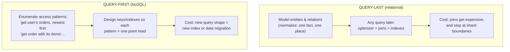
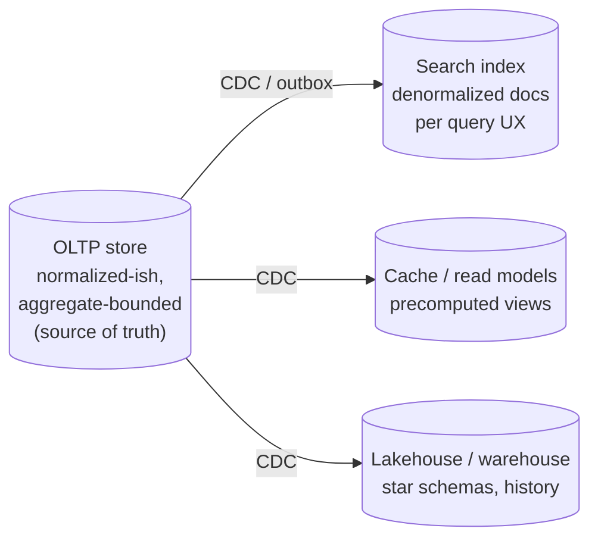

# Data Modeling for Access Patterns

## TL;DR

Data modeling decides your scaling ceiling before any engine choice does. Two philosophies: **query-last** (relational — normalize the domain, let the optimizer join anything; flexible forever, but joins don't cross shards) and **query-first** (NoSQL — enumerate every access pattern up front, then shape keys and indexes so each pattern is a point lookup; brutally fast, brutally rigid). The modern discipline uses both deliberately: normalize until you have measured reasons to denormalize; when you denormalize, you take on *write-time joins* whose copies must be maintained ([CDC](../13-data-pipelines/04-change-data-capture.md)/[outbox](../05-messaging/07-outbox-pattern.md)); choose partition keys for **distribution and access locality at once**, because the key is the sharding strategy; bound your aggregates so invariants live inside one partition's transaction; and accept that at scale you don't have *a* model — you have one model per workload (OLTP, search, analytics), synchronized by pipelines.

---

## Two Philosophies



The choice is about **when you pay**. Relational modeling pays at read time (joins) and buys you the right to ask questions you didn't anticipate — the correct default for evolving products on data that fits a beefy primary plus replicas (which is further than most people think — see [Figma's journey](../08-case-studies/11-figma.md)). Query-first modeling pays at design time and write time, and buys you O(1) reads at any scale — the correct posture once you're partitioned, because **a distributed join is the thing the architecture exists to avoid** ([Partitioning Strategies](./05-partitioning-strategies.md)).

The mistake is mixing the philosophies accidentally: modeling a DynamoDB/Cassandra table like normalized SQL (then doing N+1 fan-out reads to "join" in the application), or denormalizing Postgres on day one "for scale" you don't have, inheriting update anomalies for nothing.

## Normalization, and Earning Denormalization

Normalization in one sentence: **every fact lives in exactly one place**, so an update is one write and inconsistency is structurally impossible. That property is what you're selling when you denormalize — so sell it deliberately:

| Denormalize when | Because |
|---|---|
| A read joins N tables on every request at high QPS | Precomputing the join once at write time beats recomputing per read |
| The join crosses a shard/service boundary | Cross-partition joins are scatter-gather; copies keep reads local |
| Read:write ratio is extreme (100:1+) | One maintained copy serves a hundred cheap reads |
| The copy is *derivable and rebuildable* | A copy you can regenerate from the source of truth is a cache; one you can't is a liability |

And when you do, name the new obligations: every copy needs a **maintenance path** (same-transaction write, or async via [outbox/CDC](../05-messaging/07-outbox-pattern.md) with a freshness SLO), a **staleness budget** ("follower counts may lag 5s"), and a **reconciliation/rebuild job** for when a bug skews the copies — because it will. Counters are the classic case: storing `like_count` on the post is denormalization; the increment must be idempotent under retries ([Idempotency](../01-foundations/08-idempotency.md)) and periodically re-derived from the source table.

## Modeling Relationships Across Paradigms

**Documents — embed vs reference:** embed *one-to-few, owned, read-together* data (order items inside the order); reference *unbounded or shared* data (the order references the customer, never embeds it — unbounded arrays are documents that grow until they hit size limits and rewrite amplification). The deeper rule: **the document/aggregate is your transaction boundary** — model it so every invariant you must enforce atomically ("order total equals sum of items") lives inside one document/partition, and what's outside is eventually consistent by design ([Sagas](../05-messaging/09-saga-pattern.md) pick up from there).

**Wide-column / DynamoDB single-table:** the composite primary key is the whole game — partition key groups, sort key orders, and "joins" are precomputed by **storing related items adjacent in the same item collection**:

```
Access patterns first:
  AP1: get customer profile          AP2: get customer's orders, newest first
  AP3: get order + its items         AP4: get order by id (no customer)

Table (single-table design):
  PK                SK                     attributes
  CUST#alice        PROFILE                {name, tier…}
  CUST#alice        ORDER#2026-06-01#o917  {status, total…}     ← AP2: Query PK, SK desc
  ORDER#o917        META                   {status, total…}
  ORDER#o917        ITEM#1                 {sku, qty…}           ← AP3: Query PK=ORDER#o917
  ORDER#o917        ITEM#2                 {sku, qty…}
GSI1 (for AP4 and order-by-status views):
  GSI1PK=STATUS#open  GSI1SK=2026-06-01#o917
```

One `Query` per access pattern, no joins, no fan-out — and total rigidity: a new pattern ("orders by SKU") means a new GSI (an online backfill) or a redesign. This trade is exactly why [DynamoDB can promise predictable latency](../09-whitepapers/14-dynamodb-2022.md): the model forbids the operations that wouldn't scale.

**Time-series:** never let one key grow forever. **Bucket** by time window so partitions stay bounded (`PK = device#2026-06-13`, `SK = timestamp`); pick the bucket so a partition stays under the engine's comfort size (Cassandra folklore: ≤ ~100MB / low millions of cells); TTL old buckets or tier them to the [lakehouse](../13-data-pipelines/05-lakehouse-table-formats.md). Most "Cassandra fell over" stories are unbounded-partition stories.

## Keys Are the Sharding Strategy

The partition key chooses three things simultaneously — get all three or regret one:

1. **Distribution** — high cardinality, even write spread. Monotonic keys (timestamps, sequential IDs) funnel all writes to one partition: use hashed/composite keys or [time-ordered-but-random IDs](../06-scaling/03-database-sharding.md).
2. **Access locality** — queries you run constantly should hit *one* partition. `tenant_id` as the leading key term makes every tenant query local and doubles as the isolation boundary ([Multi-Tenancy](../06-scaling/12-multi-tenancy.md)).
3. **Skew tolerance** — one whale tenant or viral post becomes a hot partition regardless of cardinality. Mitigations: **write sharding** (append a suffix `post123#0…post123#9`, fan-in on read), splitting hot tenants to dedicated partitions, and caching the celebrity reads ([the Twitter problem](../08-case-studies/01-twitter.md)).

Re-keying a live table is a full [migration](../15-deployment/03-database-migrations.md) (dual-write, backfill, cutover) — which is the honest reason query-first design front-loads so much thinking: the key is the one thing you can't `ALTER`.

## One Model Per Workload

Past a certain size, the question "what's our data model?" has a plural answer, and that's the design:



The OLTP shape optimizes for correct writes; the search index wants fat denormalized documents ([Search Systems](../14-search-systems/02-full-text-search.md)); analytics wants facts-and-dimensions with full history ([Lakehouse](../13-data-pipelines/05-lakehouse-table-formats.md)). Trying to make one schema serve all three is how systems end up bad at everything. The discipline that makes polyglot modeling safe is a single rule: **one writer-owned source of truth; every other shape is a derived, rebuildable projection** maintained by the pipeline — never hand-updated, never authoritative ([CDC](../13-data-pipelines/04-change-data-capture.md)).

Finally, model for **evolution**: additive changes only on hot paths (new nullable fields; readers tolerate unknowns — the same [robustness rule as APIs and protobuf](../12-service-mesh/04-api-design-patterns.md)), explicit schema-version fields in long-lived documents, and [expand/contract](../15-deployment/03-database-migrations.md) for anything breaking. A model you can't evolve is a model you'll re-platform.

## Anti-Patterns

- **Entity-Attribute-Value as the main model** — "flexible schema" in SQL that forfeits types, constraints, and indexes; if the shape is truly dynamic, use a JSONB column with indexed extracted fields, or a document store.
- **The God JSON blob** — one unstructured column the application "knows" the shape of: invisible to the optimizer, unqueryable, and every consumer reimplements (and disagrees on) the parsing.
- **Relational habits on NoSQL** — normalized "tables" in DynamoDB joined by application fan-out: all of the rigidity, none of the point-read payoff.
- **Premature denormalization** — copies and counters maintained by hand for a join Postgres executed in 0.4ms.
- **Unbounded anything** — arrays, item collections, partitions that grow with usage forever; every unbounded structure is a future incident with a date you didn't choose.
- **Modeling the org chart** — tables mirroring internal team boundaries rather than access patterns or domain aggregates; the queries will tell you the truth.

---

## References

- *Designing Data-Intensive Applications*, ch. 2 — data models and query languages; the relational/document/graph trade in full
- *The DynamoDB Book* (Alex DeBrie) — single-table design, properly taught; and [AWS: NoSQL design for DynamoDB](https://docs.aws.amazon.com/amazondynamodb/latest/developerguide/bp-general-nosql-design.html)
- [Rick Houlihan — Advanced design patterns for DynamoDB (re:Invent)](https://www.youtube.com/watch?v=HaEPXoXVf2k) — the canonical access-pattern-first talks
- [Cassandra data modeling documentation](https://cassandra.apache.org/doc/latest/cassandra/developing/data-modeling/intro.html) — bucketing, partition sizing
- [MongoDB schema design: embedding vs referencing](https://www.mongodb.com/docs/manual/data-modeling/) — the one-to-few/one-to-many/one-to-squillions heuristics
- [Partitioning Strategies](./05-partitioning-strategies.md), [Database Migrations](../15-deployment/03-database-migrations.md), [CDC](../13-data-pipelines/04-change-data-capture.md) — the companion mechanics
