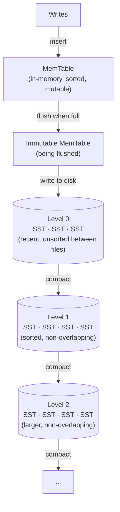
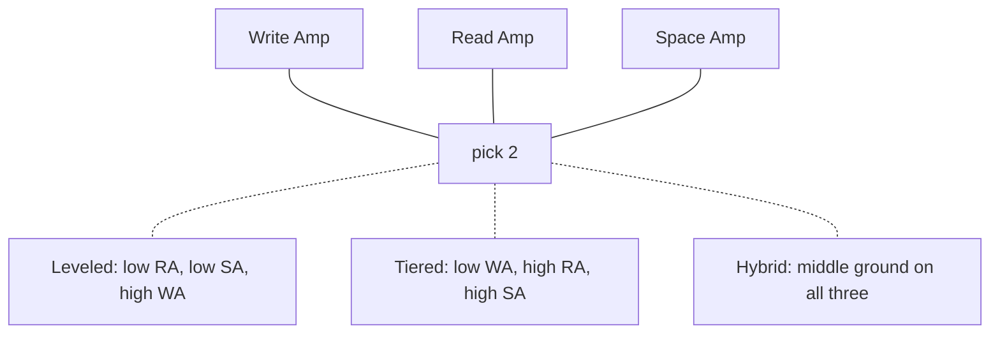

# LSM Trees

## TL;DR

Log-Structured Merge Trees trade read performance for write performance. Writes go to an in-memory buffer, then flush to immutable sorted files on disk. Background compaction merges files to maintain read performance. LSM trees excel at write-heavy workloads and are used by LevelDB, RocksDB, Cassandra, and HBase.

---

## The Write Problem

### B-Tree Write Cost

```
B-tree random write:
  1. Find page (random read)
  2. Modify page
  3. Write page back (random write)
  4. Write to WAL (sequential)
  
Random I/O is slow, especially on HDDs
```

### LSM Solution

```
Convert random writes to sequential:
  1. Buffer writes in memory (MemTable)
  2. When full, flush to disk as sorted file
  3. All disk writes are sequential

SSDs: Still faster (no erase-before-write)
HDDs: Much faster (10-100x improvement)
```

---

## LSM Tree Structure

### Overview



### MemTable

```
In-memory sorted structure:
  - Red-black tree
  - Skip list (common choice)
  - B-tree

Properties:
  - Fast writes: O(log n)
  - Ordered for efficient flush
  - Size limited (typically 64 MB)
```

### SSTable (Sorted String Table)

```
Immutable file on disk:

┌────────────────────────────────────────────┐
│ Data Block 1 │ Data Block 2 │ ... │ Index │
└────────────────────────────────────────────┘

Data Block:
  [key1, value1][key2, value2]...
  Sorted by key
  Compressed (LZ4, Snappy, Zstd)

Index Block:
  Sparse index: [key → block offset]
  Find block, then binary search within
```

---

## Write Path

### Step by Step

```
1. Write to WAL (sequential, for durability)
2. Write to MemTable (in-memory)
3. Ack to client

4. When MemTable full:
   - Make current MemTable immutable
   - Create new MemTable for writes
   - Background: Flush immutable MemTable to SSTable

5. Background compaction merges SSTables
```

### Code Example

```python
class LSMTree:
    def __init__(self):
        self.wal = WriteAheadLog()
        self.memtable = SkipList()
        self.immutable_memtables = []
        self.levels = [[] for _ in range(MAX_LEVELS)]
        
    def write(self, key, value):
        # Durability: Write to log first
        self.wal.append(key, value)
        
        # Then to memory
        self.memtable.put(key, value)
        
        if self.memtable.size() > MEMTABLE_SIZE:
            self.flush_memtable()
    
    def flush_memtable(self):
        # Make immutable
        self.immutable_memtables.append(self.memtable)
        self.memtable = SkipList()
        
        # Schedule background flush
        schedule(self.flush_to_l0)
    
    def flush_to_l0(self):
        immutable = self.immutable_memtables.pop(0)
        sstable = SSTable.create_from(immutable)
        self.levels[0].append(sstable)
        self.wal.truncate_flushed()
```

---

## Read Path

### Search Order

```
1. Check MemTable
2. Check Immutable MemTables (if any)
3. Check Level 0 SSTables (all of them, might overlap)
4. Check Level 1+ (binary search, non-overlapping)
5. Return value or "not found"
```

### Optimization: Bloom Filters

```
Before reading SSTable from disk:
  Check Bloom filter

if bloom_filter.might_contain(key):
    read_sstable()  # Might be there
else:
    skip()  # Definitely not there (false positive rate ~1%)
    
Reduces disk reads for non-existent keys
```

### Read Amplification

```
Worst case (key doesn't exist):
  MemTable: 1 check
  L0: N SSTables (all overlap)
  L1: 1 SSTable
  L2: 1 SSTable
  ...
  
Total: 1 + N + (L-1) checks

Bloom filters reduce actual disk reads
```

---

## Compaction

### Why Compact?

```
Without compaction:
  - Many overlapping files in L0
  - Same key in multiple SSTables
  - Read performance degrades
  - Disk space wasted (obsolete values)

Compaction:
  - Merges SSTables
  - Removes duplicates (keep latest)
  - Removes tombstones
  - Improves read performance
```

### Compaction Strategies

**Size-Tiered (STCS):**
```
Merge SSTables of similar size

When N SSTables of size S exist:
  Merge into 1 SSTable of size ~N*S

Pros: Simple, good write amplification
Cons: Space amplification (need 2x during compaction)
```

**Leveled (LCS):**
```
Each level has size limit: L(i) = L0 * ratio^i
Files in level are non-overlapping

When level exceeds limit:
  Pick file, merge with overlapping files in next level

Pros: Controlled space, better read performance
Cons: Higher write amplification
```

**FIFO:**
```
Delete oldest SSTables when size limit reached
No merge, just deletion

Use case: Time-series data with TTL
```

---

## Write Amplification

### Definition

```
Write amplification = (Total bytes written to disk) / (Bytes written by user)

Sources:
  1. WAL write
  2. MemTable flush
  3. Compaction (data rewritten multiple times)
```

### Leveled Compaction Math

```
Level ratio = 10
Data moves through ~L levels

At each level:
  Key might be rewritten ~10 times (merge with 10 files)

Total: ~10 * L writes per key
For 1 TB data, 4 levels: ~40x write amplification
```

### Trade-offs

| Strategy | Write Amp | Space Amp | Read Amp |
|----------|-----------|-----------|----------|
| Size-tiered | Low | High | High |
| Leveled | High | Low | Low |
| FIFO | None | None | N/A |

---

## Space Amplification

### Causes

```
1. Obsolete values
   Key updated multiple times, old values not yet compacted

2. Tombstones
   Deleted keys, tombstones not yet garbage collected

3. Compaction temp space
   During compaction, both old and new SSTables exist
```

### Size-Tiered Space

```
Worst case: All SSTables being compacted simultaneously
Space needed: 2x actual data size

Typical: 1.5-2x data size
```

### Leveled Space

```
Bounded by level ratio
Typical: 1.1x data size

Lower because:
  - Non-overlapping files per level
  - Incremental compaction
```

---

## Deletes and Tombstones

### Problem

```
Naive delete:
  Remove key from MemTable
  
But key might exist in SSTables!
Next read might find old value
```

### Tombstone Solution

```
Write special "tombstone" marker:
  write(key, TOMBSTONE)

Read returns "not found" when tombstone seen
Tombstone propagates through compaction
Eventually garbage collected at bottom level
```

### Tombstone Compaction

```
Tombstone can only be removed when:
  - It has reached the bottom level
  - All older versions are removed
  
Long-lived tombstones = space overhead
```

---

## LSM Tree Tuning

### Key Parameters

```
memtable_size:
  Larger: Better write throughput, longer recovery
  Typical: 64 MB - 256 MB

level0_file_num_compaction_trigger:
  Files in L0 before compaction triggers
  Larger: Better write, worse read
  Typical: 4

level_ratio (max_bytes_for_level_multiplier):
  Size ratio between levels
  Larger: Fewer levels, more write amp
  Typical: 10

write_buffer_count:
  Number of MemTables before stalling
  Typical: 2-4
```

### Bloom Filter Sizing

```
Bits per key: 10 = ~1% false positive
Bits per key: 15 = ~0.1% false positive

More bits = Less reads, more memory
Typical: 10 bits per key
```

### Compression

```
Level 0-1: LZ4/Snappy (fast, moderate compression)
Level 2+:  Zstd (better compression, slower)

Trade-off: CPU for I/O
SSDs favor faster compression
```

---

## Systems Using LSM Trees

### LevelDB / RocksDB

```
Google's LevelDB: Original, simple
Facebook's RocksDB: Production-hardened, many features

RocksDB additions:
  - Column families
  - Transactions
  - Multiple compaction styles
  - Statistics and monitoring
```

### Cassandra

```
Each table has its own LSM tree
Compaction strategies configurable per table

Size-tiered: Default (good for write-heavy)
Leveled: Better for read-heavy
Time-window: Time-series data
```

### HBase

```
LSM-based on HDFS
MemStore (MemTable) → HFiles (SSTables)

Major compaction: Merge all files
Minor compaction: Merge some files
```

---

## B-Tree vs LSM Tree

| Aspect | B-Tree | LSM Tree |
|--------|--------|----------|
| Write | Random I/O | Sequential I/O |
| Read | 1 lookup | Multiple lookups |
| Write amp | ~10x | ~10-30x |
| Space amp | ~1.5x | ~1.1-2x |
| Compaction | None | Background |
| Range scan | Excellent | Good |
| Point lookup | Excellent | Good |

### When to Use LSM

```
✓ Write-heavy workloads
✓ Sequential write patterns (time-series)
✓ SSD-based storage (tolerates read amp)
✓ Key-value stores
✓ Need high write throughput

✗ Read-heavy workloads
✗ Complex queries
✗ Latency-sensitive reads
✗ Predictable performance needed
```

---

## Write Amplification Deep Dive

### Formal Definition

```
Write Amplification (WA) = Total bytes written to storage device
                           ─────────────────────────────────────
                           Total bytes written by application

A WA of 20× means for every 1 GB the application writes,
the storage engine writes 20 GB to disk.
```

### Leveled Compaction WA

```
WA = O(L × size_ratio)

Where:
  L          = number of levels
  size_ratio = level size multiplier (typically 10)

Example (RocksDB defaults):
  6 levels, size_ratio = 10
  Each key may be rewritten up to size_ratio times per level
  WA ≈ 10–30× in practice

  For a 1 TB dataset:
    L0: 256 MB  →  L1: 2.56 GB  →  L2: 25.6 GB  →  L3: 256 GB  →  L4: 1 TB
    A single key written to L0 may be compacted through every level,
    each time merged with ~10 neighboring SSTables.
```

### Tiered Compaction WA

```
WA = O(T × levels)

Where:
  T = number of runs accumulated per tier before merge (typically 4)

Example (Cassandra STCS defaults):
  4 tiers before merge, ~4 levels deep
  WA ≈ 4–10× in practice

Lower WA because each merge combines same-tier files
rather than rewriting into a fully sorted level.
```

### Measuring WA in RocksDB

```
RocksDB exposes counters in its statistics:
  rocksdb.compact.write.bytes   — bytes written by compaction
  rocksdb.flush.write.bytes     — bytes written by flush
  rocksdb.bytes.written         — bytes written by application (Put/Merge/Delete)

  WA = (compact.write.bytes + flush.write.bytes) / bytes.written

Monitor via:
  db->GetProperty("rocksdb.stats", &stats);
  or the LOG file section "Cumulative compaction"
```

### The Amplification Tradeoff Triangle



```
Concrete numbers (RocksDB leveled, size_ratio=10, 6 levels):
  WA ≈ 20×  |  SA ≈ 1.1×  |  RA ≈ 1 disk read per point lookup (with bloom)

This triangle drives every LSM tuning decision.
```

---

## RocksDB Configuration for Production

### MemTable and Write Buffer

```
write_buffer_size = 128MB
  Size of a single memtable.
  Larger  → fewer flushes, better write throughput
  Smaller → faster recovery from WAL, lower memory
  Default: 64MB. For write-heavy on NVMe: 128–256MB.

max_write_buffer_number = 4
  Max memtables (active + immutable) before write stall.
  Default: 2. Set 3–4 for bursty write workloads.
  Memory budget: write_buffer_size × max_write_buffer_number per CF.

min_write_buffer_number_to_merge = 2
  Merge multiple memtables during flush to reduce L0 file count.
  Useful when write_buffer_size is small.
```

### L0 Compaction Triggers and Back-Pressure

```
level0_file_num_compaction_trigger = 4
  Compaction kicks in when L0 file count reaches this.
  Lower  → more frequent compaction, lower read amp
  Higher → batches more files per compaction, better write throughput

level0_slowdown_writes_trigger = 20
  RocksDB begins throttling writes (artificial delay).
  Provides back-pressure signal before stall.

level0_stop_writes_trigger = 36
  Hard stall — writes block completely.
  If you hit this, compaction cannot keep up.
  Increase max_background_compactions or reduce write rate.
```

### Compaction Parallelism

```
max_background_compactions = 4
  Number of concurrent compaction threads.
  Match to available I/O bandwidth, not CPU cores.
  NVMe SSD: 4–8, SATA SSD: 2–4, HDD: 1–2.

max_background_flushes = 2
  Separate from compaction threads.
  Usually 1–2 is sufficient.
```

### Compression Per Level

```
compression_per_level = [kNoCompression, kNoCompression, kLZ4, kLZ4, kLZ4, kZSTD, kZSTD]

Rationale:
  L0–L1: No compression. Data is short-lived, compacted quickly.
          Saves CPU on the hottest write path.
  L2–L4: LZ4. Fast compression (500 MB/s), moderate ratio (~2×).
          Good balance for mid-tier data.
  L5–L6: ZSTD. Best compression ratio (~3–4×), slower.
          Bottom levels hold ~90% of data; max savings where it matters.
```

### Annotated Production Config (100GB dataset, NVMe SSD)

```
# options.h / rocksdb::Options
write_buffer_size               = 134217728    # 128 MB
max_write_buffer_number         = 4
min_write_buffer_number_to_merge = 2

level0_file_num_compaction_trigger = 4
level0_slowdown_writes_trigger     = 20
level0_stop_writes_trigger         = 36

max_bytes_for_level_base       = 536870912     # 512 MB (L1 target size)
max_bytes_for_level_multiplier = 10            # Each level 10× larger

max_background_compactions     = 4
max_background_flushes         = 2

# Block-based table options
block_size                     = 16384         # 16 KB blocks
block_cache_size               = 8589934592    # 8 GB (~1/3 of 24 GB RAM)
cache_index_and_filter_blocks  = true          # Pin index/bloom in cache

# Bloom filter: 10 bits per key, ~1% FPR
filter_policy                  = bloomfilter:10:false

# Compression: none → LZ4 → ZSTD
compression_per_level          = [none, none, lz4, lz4, lz4, zstd, zstd]
```

---

## Compaction Strategies Compared

### Strategy Matrix

| Strategy | Write Amp | Read Amp | Space Amp | Best For |
|----------|-----------|----------|-----------|----------|
| Leveled (RocksDB default) | High (10–30×) | Low (1 read + bloom) | Low (1.1×) | Point lookups, read-heavy OLTP |
| Size-Tiered (Cassandra default) | Low (4–10×) | High (scan all tiers) | High (up to 2×) | Write-heavy, time-series ingestion |
| FIFO | None | N/A (full scan) | None (bounded) | TTL-based metrics, ephemeral data |
| Universal (RocksDB) | Medium (8–20×) | Medium | Medium (1.2–1.5×) | Mixed workloads, adaptive |

### Decision Framework

```
Start with leveled compaction (the safe default).

Switch to size-tiered or universal when:
  ✗ Write stalls appear in logs ("Stalling writes because...")
  ✗ Compaction pending bytes grow monotonically
  ✗ p99 write latency spikes during compaction

Switch to FIFO when:
  ✓ Data has a natural TTL (metrics, events, logs)
  ✓ Old data has no read value
  ✓ You want zero compaction CPU overhead

Switch to leveled when:
  ✓ Read latency SLAs are tight
  ✓ Point lookups dominate the workload
  ✓ Space efficiency matters (cloud storage cost)
```

### Hybrid Approaches

```
Cassandra: TimeWindowCompactionStrategy (TWCS)
  Uses size-tiered within each time window.
  Drops entire windows on TTL expiry.
  Best of both worlds for time-series.

RocksDB Universal Compaction:
  Dynamically chooses between size-tiered and leveled behavior.
  Controlled by:
    max_size_amplification_percent (default 200)
    size_ratio (default 1)
  Falls back to full sort when space amp exceeds threshold.

ScyllaDB Incremental Compaction Strategy (ICS):
  Breaks large compactions into smaller steps.
  Caps compaction-induced latency spikes to ~10ms.
  Requires more temporary space but delivers smoother p99.
```

---

## LSM Trees in Production Systems

### RocksDB as Embedded Engine

```
RocksDB is the storage engine beneath most modern distributed databases:

CockroachDB:
  Uses RocksDB (migrating to Pebble, a Go rewrite) for MVCC key-value storage.
  Each range (partition) is a RocksDB column family.
  Leveled compaction. Heavy use of prefix bloom filters.

TiDB (TiKV):
  Rust-based storage node embedding RocksDB.
  Separates default CF, write CF, and lock CF for isolation.
  Two RocksDB instances: one for Raft log, one for state machine.

YugabyteDB (DocDB):
  Custom RocksDB fork with MVCC-aware compaction.
  Removes stale MVCC versions during compaction (intent cleanup).
```

### LevelDB Lineage

```
LevelDB (Google, 2011):
  Original reference implementation by Jeff Dean and Sanjay Ghemawat.
  Used by Bitcoin Core for UTXO set, Chrome for IndexedDB.
  Single-threaded compaction, no column families.
  Still useful for embedded, single-writer use cases.

RocksDB (Facebook, 2012):
  Fork of LevelDB, optimized for server workloads.
  Multi-threaded compaction, rate limiter, statistics, transactions.
  De facto standard for embedded LSM in infrastructure.
```

### Cassandra and ScyllaDB

```
Cassandra:
  Each table (column family) has its own LSM tree.
  Default: STCS. Switch to LCS for read-heavy tables.
  TWCS for time-series. Compaction strategy is per-table config.
  Anti-compaction: splits SSTables during repair to isolate token ranges.

ScyllaDB:
  C++ rewrite of Cassandra (10× throughput per node in benchmarks).
  Incremental Compaction Strategy (ICS) reduces worst-case latency.
  Shard-per-core architecture: each LSM tree is pinned to a CPU core.
  No JVM GC pauses — critical for p99 latency guarantees.
```

### WiredTiger (MongoDB)

```
MongoDB's default storage engine since 3.2.
Hybrid architecture:
  - B-tree for user collections (primary + secondary indexes)
  - LSM-like journaling for the oplog (sequential write-optimized)
  - Hazard pointers and skip lists for in-memory structures

WiredTiger supports both B-tree and LSM table types,
but MongoDB exclusively uses B-tree for collections.
The oplog benefits from LSM characteristics: append-heavy,
sequential writes, range-scan reads for replication.
```

### Key Observation

```
LSM trees dominate distributed database storage engines because:
  1. Sequential writes align with SSD write patterns (avoid write cliff)
  2. Immutable SSTables simplify replication and snapshot isolation
  3. Compaction can run on dedicated I/O budget without blocking writes
  4. Range partitioning maps naturally to separate LSM instances per shard
```

---

## Monitoring LSM Health

### Critical Metrics

```
1. Compaction Pending Bytes
   What:  Sum of bytes waiting to be compacted.
   Alert: If monotonically growing, compaction cannot keep up.
   Fix:   Increase max_background_compactions, reduce write rate,
          or switch to a lower-WA compaction strategy.

2. L0 File Count
   What:  Number of SSTables in Level 0.
   Alert: Approaching level0_slowdown_writes_trigger (default 20).
   Fix:   Increase flush throughput or lower compaction trigger.
   Query: rocksdb.num-files-at-level0

3. Write Stall Duration
   What:  Cumulative time writes were stalled or slowed.
   Alert: Any non-zero value in production.
   Query: rocksdb.stall.micros
   Fix:   Widen the gap between trigger and stop thresholds,
          or add compaction threads.
```

### Latency and I/O Indicators

```
4. Read Latency P99
   Sudden spikes indicate:
     - Too many L0 files (high read amp)
     - Bloom filter misses (check filter effectiveness ratio)
     - Block cache thrashing (cache too small for working set)
   Query: application-level histogram or rocksdb.read.block.get.micros

5. Disk I/O Utilization
   Compaction is I/O-intensive and can starve foreground reads.
   Use RocksDB rate_limiter to cap compaction I/O:
     rate_limiter = NewGenericRateLimiter(100 * 1024 * 1024)  # 100 MB/s
   Monitor: iostat %util, await for the data volume.

6. Bloom Filter Effectiveness
   Query: rocksdb.bloom.filter.useful / rocksdb.bloom.filter.full.positive
   If useful rate < 90%, filters are not saving enough reads.
   Consider increasing bits_per_key from 10 to 14–16.
```

### RocksDB LOG File Analysis

```
The LOG file (in the DB directory) contains compaction summaries:

  ** Compaction Stats [default] **
  Level  Files  Size  Score  Read(GB)  Rn(GB)  Rnp1(GB)  Write(GB)  ...
  L0     3/0    192M  0.8    0.0       0.0     0.0        0.2
  L1     4/0    512M  1.0    0.7       0.2     0.5        0.5
  ...

Key columns:
  Score > 1.0    → level needs compaction (over target size)
  Rn + Rnp1      → input to compaction (read amp signal)
  Write > Read   → expanding data (new writes dominate)

Stall warnings appear as:
  "Stalling writes because we have 20 level-0 files"
  "Stopping writes because we have 36 level-0 files"

Parse these with a log shipper and alert on occurrence count.
```

---

## Key Takeaways

1. **Writes to memory first** - Sequential disk writes via flush
2. **SSTables are immutable** - Append-only design
3. **Compaction is essential** - Maintains read performance
4. **Trade-off triangle** - Write amp, read amp, space amp
5. **Bloom filters critical** - Reduce disk reads
6. **Leveled for reads** - Size-tiered for writes
7. **Tombstones have cost** - Delayed garbage collection
8. **Tuning is workload-specific** - No universal configuration
