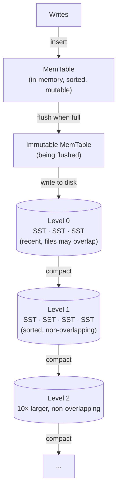
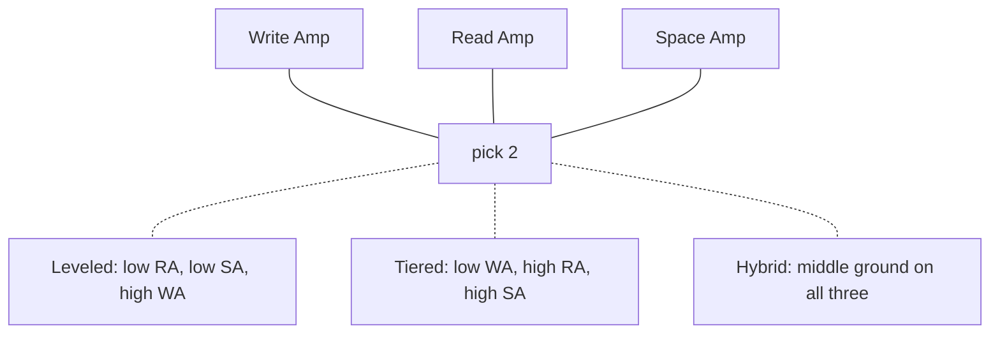

# LSM Trees

## TL;DR

The Log-Structured Merge tree is the answer to one question: what if the storage engine never performed a random write? All writes land in a sorted in-memory buffer and reach disk only as sequential flushes of immutable sorted files (SSTables); background *compaction* merges those files to keep reads and space in check. The price is that a key no longer lives in one place — reads must consult many runs (read amplification), compaction rewrites data many times (write amplification), and obsolete versions linger until merged away (space amplification). The three amplifications form a triangle: no compaction strategy wins all three, which is why leveled/tiered/FIFO exist and why LSM tuning is workload engineering, not configuration. LSMs power RocksDB (and through it CockroachDB, TiKV, YugabyteDB), Cassandra/ScyllaDB, and HBase — essentially every write-heavy distributed store. This chapter builds the structure, quantifies the triangle, and covers the production surface: RocksDB tuning, tombstone pathologies, write stalls, and monitoring.

---

## The Write Problem

A [B-tree](./01-b-trees.md) updates data in place. For a workload of small writes with random keys, that means a page-sized read-modify-write per update, scattered across the whole index:

```
B-tree, 100-byte insert with a random key, 8 KB pages:
  1. read the target leaf page      (random read — a miss once the
                                     tree exceeds the buffer pool)
  2. modify 100 bytes in memory
  3. WAL the change                 (sequential — cheap)
  4. eventually write the page back (random 8 KB write)

Per-insert device cost at steady state: ~1 random read + ~1 random write
  HDD  (~100-200 IOPS):    → low hundreds of inserts/sec. Catastrophic.
  NVMe (~10⁵-10⁶ IOPS):    → fine, until it isn't (below)
```

The LSM removes the random I/O entirely:

```
LSM, same insert:
  1. append to WAL                  (sequential)
  2. insert into in-memory memtable (no disk)
  ...later, amortized:
  3. flush a FULL memtable (64-256 MB) as one sequential file write
  4. compaction rewrites data in large sequential merges

Every byte the device sees is part of a large sequential write.
A single NVMe drive sustains 1-3 GB/s sequential — the ingest ceiling
becomes compaction bandwidth, not IOPS.
```

Two notes that survive the move from HDD to SSD. First, SSDs still strongly prefer large sequential writes: the FTL coalesces them into whole erase blocks, minimizing device-internal garbage collection and its write cliff (device-level write amplification compounds with the engine's). Second, immutable-file output is what makes the rest of the architecture fall out for free — checksummed, compressible, cache-friendly files that can be replicated or uploaded wholesale ([SSTables & Compaction](./03-sstables-compaction.md), [Object Storage](./08-object-storage.md)).

---

## Structure and the Write Path



**The memtable** is a sorted in-memory structure — almost always a **skip list** (RocksDB, Cassandra, Pebble), not a balanced tree. The reasons are concurrency-shaped: a skip list supports lock-free concurrent inserts with simple epoch-based memory reclamation, and its flat node structure makes the sorted iteration during flush cheap. Writes are O(log n) memory operations; the WAL append ahead of them is the only disk touch on the write path.

**The flush cycle:** when the memtable reaches its size limit (`write_buffer_size`, typically 64–256 MB), it is atomically swapped for a fresh one and becomes an *immutable memtable*; a background thread streams it to disk as a Level-0 SSTable and then truncates the corresponding WAL segment. Reads during the transition consult both memtables — no pause. The knob `max_write_buffer_number` bounds how many immutable memtables may pile up; if flush can't keep pace, the engine first throttles and then **stalls writes** — the LSM's signature failure mode, covered under monitoring.

```
Write path, end to end:
  1. append to WAL                          → durability
  2. insert into memtable                   → visibility
  3. ack the client                         (total: 1 sequential append
                                             + 1 in-memory insert)
  4. [async] memtable full → immutable → flushed as L0 SSTable
  5. [async] compaction merges L0 → L1 → ... in the background

The client-visible latency contains no random I/O and no compaction —
those are background costs, paid later. This deferral is both the
LSM's superpower and its operational trap: ingest can outrun
compaction for hours, and the debt comes due as read degradation
and, eventually, write stalls.
```

**Level 0 is special.** Each L0 file is a complete memtable snapshot, so L0 files overlap each other in key range — a read must check all of them. Every deeper level is one sorted run partitioned into non-overlapping files, so a read needs at most one file per level. Keeping L0 small is therefore the highest-priority compaction job.

---

## The Read Path

```
Get(key) — newest to oldest, first hit wins:
  1. memtable
  2. immutable memtable(s)
  3. every L0 file, newest first        ← all may contain the key
  4. one candidate file per level L1+   (binary search on file ranges)

Runs to consult ≈ #L0 files + #levels ≈ 10 in a healthy tree.
Without filters, a MISS costs ~10 file probes (index + data block each).
With a bloom filter per SSTable at 1% FPR, expected wasted reads ≈ 0.1.
```

Bloom filters are what make LSM point reads competitive — the filter math, cache-line-aware layouts, per-level FPR allocation (Monkey), and the static alternatives (ribbon, binary fuse) are covered in depth in [Bloom Filters](./05-bloom-filters.md).

What filters cannot fix: **range scans**, which must merge-iterate every run (no filter can answer a range question), and **hot-key version pileup** — a key updated thousands of times between compactions exists in many runs, and its read must still find the newest. Read amplification is thus workload-dependent in a way B-tree reads aren't: a well-compacted LSM reads like a B-tree; a compaction-starved one reads like a linear scan over runs.

---

## Compaction: Paying the Deferred Bill

Compaction merges sorted runs, keeping only the newest version of each key and (eventually) dropping tombstones. It exists because without it every deferred cost compounds: L0 grows unbounded (read amp ↑), obsolete versions accumulate (space amp ↑), and nothing is ever reclaimed.

The strategy space is a spectrum between two poles:

```
Size-tiered (STCS): collect ~4 runs of similar size, merge into one
  run in the next tier. Each key is rewritten ~once per tier.
  → LOW write amp, HIGH read amp (many runs), HIGH space amp
    (duplicates of a key may exist once per tier; worst case ~2×+)

Leveled (LCS): maintain one sorted run per level, levels sized
  L(i+1) = 10 × L(i). Compacting a file merges it with the ~10
  overlapping files below — each key is rewritten ~10× per level.
  → HIGH write amp (~10 per level), LOW read amp (1 file/level),
    LOW space amp (~1.1×)

FIFO: no merging at all; delete oldest files past a size/TTL bound.
  → for data whose value expires (metrics, logs)
```

Mechanics — file formats, merge iterators, tombstone GC rules, scheduling, trivial moves, subcompactions — live in [SSTables & Compaction](./03-sstables-compaction.md). The strategy comparison and selection guidance appear later in this chapter, after the amplification math that motivates them.

---

## Deletes and Tombstones

An immutable-file design cannot remove a key by touching old files; a delete is a *write* of a tombstone marker that shadows older versions:

```
delete(k)  →  write (k, TOMBSTONE, seq)

Read:  sees tombstone first (it's newest) → "not found"
Compaction: tombstone erases older versions of k it meets...
  ...but the tombstone itself can only be dropped when it reaches
  the bottom level (or provably overlaps no older data) — otherwise
  a yet-unmerged older version would "resurrect".
  Plus (Cassandra): not before gc_grace_seconds, so the tombstone
  has time to replicate to nodes that missed the delete — dropping
  it early resurrects data cluster-wide via repair.
```

Consequences worth designing around:

- **Deletes consume space before they release it.** A mass delete makes the dataset *larger* until compaction carries the tombstones to the bottom. Deleting a table's worth of rows the night before a capacity review is a classic self-own.
- **The queue anti-pattern.** Using an LSM table as a FIFO queue (insert, read, delete) accumulates tombstones at the head; every "read next" scans over millions of tombstoned entries before finding a live row. Cassandra emits `TombstoneOverwhelmingException` for exactly this. Queues belong in [message queues](../05-messaging/01-message-queues.md), or at minimum in time-bucketed tables dropped wholesale (the FIFO/TWCS pattern).
- **Range tombstones** (delete a whole prefix/partition in one marker) are far cheaper to write than per-key tombstones but make reads carry the range marker until compaction resolves it — bounded use only.
- **TTL data**: prefer natural-expiry strategies (FIFO/TWCS) where whole files age out — deletion by file drop costs zero compaction work and zero tombstones.

---

## The Amplification Triangle

```
Write Amplification (WA) = bytes written to device / bytes written by app
Read Amplification (RA)  = device reads per logical read
Space Amplification (SA) = bytes on device / logical data size
```



### Leveled WA, derived

```
WA(leveled) ≈ 1 (WAL) + 1 (flush) + size_ratio × (#levels - 1)
                                     ↑ each level rewrite merges the
                                       moving file with ~size_ratio
                                       overlapping files below

Example (RocksDB defaults, size_ratio = 10):
  1 TB dataset → levels: 256 MB → 2.5 GB → 25 GB → 250 GB → 1 TB (5 levels)
  WA ≈ 2 + 10 × 4 ≈ 40× worst case; 10-30× measured in practice
  (measured is lower: trivial moves, keys that die young in upper
   levels, and skew all reduce rewrites)

Consequence: sustained ingest of 100 MB/s at WA 20 = 2 GB/s of
compaction writes. THIS is the number to check against device
bandwidth — not the application write rate.
```

### Tiered WA, derived

```
WA(tiered) ≈ 1 + 1 + (#tiers)      — each key rewritten ~once per tier
Example (Cassandra STCS, ~4 tiers): WA ≈ 4-10×

The saving comes from merging same-size runs instead of pushing into
a fully-sorted level; the cost is carrying T overlapping runs per tier
(read amp) and up to a full duplicate of the dataset mid-merge (space).
Worst-case STCS space: a single giant compaction needs input + output
live simultaneously — budget 50%+ disk headroom.
```

### Measuring WA in RocksDB

```
  rocksdb.compact.write.bytes   — bytes written by compaction
  rocksdb.flush.write.bytes     — bytes written by flush
  rocksdb.bytes.written         — bytes written by application

  WA = (compact.write.bytes + flush.write.bytes) / bytes.written

Or read the LOG file's "Cumulative compaction" section.
Concrete healthy reference (leveled, ratio 10, 6 levels):
  WA ≈ 20×  |  SA ≈ 1.1×  |  RA ≈ 1 disk read per point lookup (with bloom)
```

The research frontier formalizes the triangle: **Monkey** (SIGMOD '17) optimizes filter-memory allocation across levels; **Dostoevsky** (SIGMOD '18) shows leveled and tiered are endpoints of a continuum ("lazy leveling") and picks the merge policy per level. RocksDB's universal compaction and ScyllaDB's ICS are production steps along the same continuum.

---

## RocksDB Configuration for Production

### MemTable and Write Buffer

```
write_buffer_size = 128MB
  Size of a single memtable.
  Larger  → fewer flushes, better write throughput
  Smaller → faster recovery from WAL, lower memory
  Default: 64MB. For write-heavy on NVMe: 128–256MB.

max_write_buffer_number = 4
  Max memtables (active + immutable) before write stall.
  Default: 2. Set 3–4 for bursty write workloads.
  Memory budget: write_buffer_size × max_write_buffer_number per CF.

min_write_buffer_number_to_merge = 2
  Merge multiple memtables during flush to reduce L0 file count.
  Useful when write_buffer_size is small.
```

### L0 Compaction Triggers and Back-Pressure

```
level0_file_num_compaction_trigger = 4
  Compaction kicks in when L0 file count reaches this.
  Lower  → more frequent compaction, lower read amp
  Higher → batches more files per compaction, better write throughput

level0_slowdown_writes_trigger = 20
  RocksDB begins throttling writes (artificial delay).
  Provides back-pressure signal before stall.

level0_stop_writes_trigger = 36
  Hard stall — writes block completely.
  If you hit this, compaction cannot keep up.
  Increase max_background_compactions or reduce write rate.
```

### Compaction Parallelism

```
max_background_compactions = 4
  Number of concurrent compaction threads.
  Match to available I/O bandwidth, not CPU cores.
  NVMe SSD: 4–8, SATA SSD: 2–4, HDD: 1–2.

max_background_flushes = 2
  Separate from compaction threads.
  Usually 1–2 is sufficient.
```

### Compression Per Level

```
compression_per_level = [kNoCompression, kNoCompression, kLZ4, kLZ4, kLZ4, kZSTD, kZSTD]

Rationale:
  L0–L1: No compression. Data is short-lived, compacted quickly.
          Saves CPU on the hottest write path.
  L2–L4: LZ4. Fast compression (500 MB/s), moderate ratio (~2×).
          Good balance for mid-tier data.
  L5–L6: ZSTD. Best compression ratio (~3–4×), slower.
          Bottom levels hold ~90% of data; max savings where it matters.
```

### Annotated Production Config (100GB dataset, NVMe SSD)

```
# options.h / rocksdb::Options
write_buffer_size               = 134217728    # 128 MB
max_write_buffer_number         = 4
min_write_buffer_number_to_merge = 2

level0_file_num_compaction_trigger = 4
level0_slowdown_writes_trigger     = 20
level0_stop_writes_trigger         = 36

max_bytes_for_level_base       = 536870912     # 512 MB (L1 target size)
max_bytes_for_level_multiplier = 10            # Each level 10× larger

max_background_compactions     = 4
max_background_flushes         = 2

# Block-based table options
block_size                     = 16384         # 16 KB blocks
block_cache_size               = 8589934592    # 8 GB (~1/3 of 24 GB RAM)
cache_index_and_filter_blocks  = true          # Pin index/bloom in cache

# Bloom filter: 10 bits per key, ~1% FPR
filter_policy                  = bloomfilter:10:false

# Compression: none → LZ4 → ZSTD
compression_per_level          = [none, none, lz4, lz4, lz4, zstd, zstd]
```

---

## Compaction Strategies Compared

### Strategy Matrix

| Strategy | Write Amp | Read Amp | Space Amp | Best For |
|----------|-----------|----------|-----------|----------|
| Leveled (RocksDB default) | High (10–30×) | Low (1 read + bloom) | Low (1.1×) | Point lookups, read-heavy OLTP |
| Size-Tiered (Cassandra default) | Low (4–10×) | High (scan all tiers) | High (up to 2×) | Write-heavy, time-series ingestion |
| FIFO | None | N/A (full scan) | None (bounded) | TTL-based metrics, ephemeral data |
| Universal (RocksDB) | Medium (8–20×) | Medium | Medium (1.2–1.5×) | Mixed workloads, adaptive |

### Decision Framework

```
Start with leveled compaction (the safe default).

Switch to size-tiered or universal when:
  ✗ Write stalls appear in logs ("Stalling writes because...")
  ✗ Compaction pending bytes grow monotonically
  ✗ p99 write latency spikes during compaction

Switch to FIFO when:
  ✓ Data has a natural TTL (metrics, events, logs)
  ✓ Old data has no read value
  ✓ You want zero compaction CPU overhead

Switch to leveled when:
  ✓ Read latency SLAs are tight
  ✓ Point lookups dominate the workload
  ✓ Space efficiency matters (cloud storage cost)
```

### Hybrid Approaches

```
Cassandra: TimeWindowCompactionStrategy (TWCS)
  Uses size-tiered within each time window.
  Drops entire windows on TTL expiry.
  Best of both worlds for time-series.

RocksDB Universal Compaction:
  Dynamically chooses between size-tiered and leveled behavior.
  Controlled by:
    max_size_amplification_percent (default 200)
    size_ratio (default 1)
  Falls back to full sort when space amp exceeds threshold.

ScyllaDB Incremental Compaction Strategy (ICS):
  Breaks large compactions into smaller steps.
  Caps compaction-induced latency spikes to ~10ms.
  Requires more temporary space but delivers smoother p99.
```

---

## LSM Trees in Production Systems

### RocksDB as Embedded Engine

```
RocksDB is the storage engine beneath most modern distributed databases:

CockroachDB:
  Migrated from RocksDB to Pebble (a Go reimplementation of the same
  design) for MVCC key-value storage. Leveled compaction; heavy use
  of prefix bloom filters.

TiDB (TiKV):
  Rust-based storage node embedding RocksDB.
  Separates default CF, write CF, and lock CF for isolation.
  Two RocksDB instances: one for Raft log, one for state machine.

YugabyteDB (DocDB):
  Custom RocksDB fork with MVCC-aware compaction.
  Removes stale MVCC versions during compaction (intent cleanup).
```

### LevelDB Lineage

```
LevelDB (Google, 2011):
  Original reference implementation by Jeff Dean and Sanjay Ghemawat,
  distilling the Bigtable tablet design.
  Used by Bitcoin Core for UTXO set, Chrome for IndexedDB.
  Single-threaded compaction, no column families.
  Still useful for embedded, single-writer use cases.

RocksDB (Facebook, 2012):
  Fork of LevelDB, optimized for server workloads.
  Multi-threaded compaction, rate limiter, statistics, transactions.
  De facto standard for embedded LSM in infrastructure.
```

### Cassandra and ScyllaDB

```
Cassandra:
  Each table (column family) has its own LSM tree.
  Default: STCS. Switch to LCS for read-heavy tables.
  TWCS for time-series. Compaction strategy is per-table config.
  Anti-compaction: splits SSTables during repair to isolate token ranges.

ScyllaDB:
  C++ rewrite of Cassandra (10× throughput per node in benchmarks).
  Incremental Compaction Strategy (ICS) reduces worst-case latency.
  Shard-per-core architecture: each LSM tree is pinned to a CPU core.
  No JVM GC pauses — critical for p99 latency guarantees.
```

### WiredTiger (MongoDB)

```
MongoDB's default storage engine since 3.2.
Hybrid architecture:
  - B-tree for user collections (primary + secondary indexes)
  - LSM-like journaling for the oplog (sequential write-optimized)
  - Hazard pointers and skip lists for in-memory structures

WiredTiger supports both B-tree and LSM table types,
but MongoDB exclusively uses B-tree for collections.
The oplog benefits from LSM characteristics: append-heavy,
sequential writes, range-scan reads for replication.
```

### Key Observation

```
LSM trees dominate distributed database storage engines because:
  1. Sequential writes align with SSD write patterns (avoid write cliff)
  2. Immutable SSTables simplify replication and snapshot isolation
  3. Compaction can run on dedicated I/O budget without blocking writes
  4. Range partitioning maps naturally to separate LSM instances per shard
```

---

## Monitoring LSM Health

### Critical Metrics

```
1. Compaction Pending Bytes
   What:  Sum of bytes waiting to be compacted.
   Alert: If monotonically growing, compaction cannot keep up.
   Fix:   Increase max_background_compactions, reduce write rate,
          or switch to a lower-WA compaction strategy.

2. L0 File Count
   What:  Number of SSTables in Level 0.
   Alert: Approaching level0_slowdown_writes_trigger (default 20).
   Fix:   Increase flush throughput or lower compaction trigger.
   Query: rocksdb.num-files-at-level0

3. Write Stall Duration
   What:  Cumulative time writes were stalled or slowed.
   Alert: Any non-zero value in production.
   Query: rocksdb.stall.micros
   Fix:   Widen the gap between trigger and stop thresholds,
          or add compaction threads.
```

### Latency and I/O Indicators

```
4. Read Latency P99
   Sudden spikes indicate:
     - Too many L0 files (high read amp)
     - Bloom filter misses (check filter effectiveness ratio)
     - Block cache thrashing (cache too small for working set)
   Query: application-level histogram or rocksdb.read.block.get.micros

5. Disk I/O Utilization
   Compaction is I/O-intensive and can starve foreground reads.
   Use RocksDB rate_limiter to cap compaction I/O:
     rate_limiter = NewGenericRateLimiter(100 * 1024 * 1024)  # 100 MB/s
   Monitor: iostat %util, await for the data volume.

6. Bloom Filter Effectiveness
   Query: rocksdb.bloom.filter.useful / rocksdb.bloom.filter.full.positive
   If useful rate < 90%, filters are not saving enough reads.
   Consider increasing bits_per_key from 10 to 14–16.
```

### RocksDB LOG File Analysis

```
The LOG file (in the DB directory) contains compaction summaries:

  ** Compaction Stats [default] **
  Level  Files  Size  Score  Read(GB)  Rn(GB)  Rnp1(GB)  Write(GB)  ...
  L0     3/0    192M  0.8    0.0       0.0     0.0        0.2
  L1     4/0    512M  1.0    0.7       0.2     0.5        0.5
  ...

Key columns:
  Score > 1.0    → level needs compaction (over target size)
  Rn + Rnp1      → input to compaction (read amp signal)
  Write > Read   → expanding data (new writes dominate)

Stall warnings appear as:
  "Stalling writes because we have 20 level-0 files"
  "Stopping writes because we have 36 level-0 files"

Parse these with a log shipper and alert on occurrence count.
```

---

## B-Tree vs LSM: The Real Decision

| Aspect | B-Tree | LSM Tree |
|--------|--------|----------|
| Write path | Random page RMW, immediate | Sequential append, deferred merge |
| Write amp | 2–10× amortized, page-sized spikes | 10–30× (leveled), paid in background |
| Point read | height page accesses, mostly cached | memtable + ~1 disk read (with bloom) |
| Range scan | Excellent (sibling-linked leaves) | Good (k-way merge across runs) |
| Space amp | 1.3–2× (fill factor, bloat) | 1.1× (leveled) to 2× (tiered) |
| Latency profile | Steady | Steady until compaction debt → stalls |
| Hot-row updates | Nearly free (same page) | Every version rewritten through levels |
| Concurrency cost | Latching complexity | Immutable files: trivial snapshot reads |

```
Choose LSM when:
  ✓ Ingest rate is the defining requirement (events, time-series, logs)
  ✓ Keys are write-once or write-rarely (unique IDs, append streams)
  ✓ Sequential-write economics matter (SSD endurance, cloud disks)
  ✓ You want immutable files for replication/backup/tiering

Choose B-tree when:
  ✓ Read latency predictability is the defining requirement
  ✓ Hot rows are updated repeatedly (update locality)
  ✓ Rich transactional workloads (the RDBMS ecosystem is B-tree-shaped)
  ✗ Don't choose LSM to "make writes fast" if your write rate is
    modest — you'll pay the read and operational tax for nothing.
```

---

## Key Takeaways

1. **LSM = never write randomly**: WAL + memtable + sequential flush; all random-I/O cost is converted into background sequential merge work.
2. **The triangle is the whole theory** — write amp, read amp, space amp; leveled and tiered are its two poles and every "new" strategy is a point between them.
3. **Compaction bandwidth is the real ingest ceiling**: sustained app writes × WA must fit in device sequential bandwidth, with headroom for reads.
4. **L0 is the pressure gauge** — file count there drives read amp and triggers the slowdown → stall ladder; alert on it.
5. **Deletes are writes** and tombstones have a lifecycle; mass deletes grow the dataset first, and FIFO/time-window strategies delete for free what compaction deletes expensively.
6. **Bloom filters are load-bearing**, not an optimization — without them every point read pays the run count ([Bloom Filters](./05-bloom-filters.md)).
7. **Immutable SSTables are the quiet win**: trivial snapshots, checksummed replication units, per-level compression, cloud tiering.
8. **Tune against measurements** — WA from compaction counters, stall micros, L0 count, pending compaction bytes; the defaults encode someone else's workload.

---

## References

- O'Neil, P., Cheng, E., Gawlick, D., & O'Neil, E. (1996). *The Log-Structured Merge-Tree*. Acta Informatica.
- Chang, F., et al. (2006). *Bigtable: A Distributed Storage System for Structured Data*. OSDI. (The design LevelDB distilled; see [Bigtable whitepaper chapter](../09-whitepapers/03-bigtable.md).)
- Dong, S., et al. (2017). *Optimizing Space Amplification in RocksDB*. CIDR.
- Dayan, N., Athanassoulis, M., & Idreos, S. (2017). *Monkey: Optimal Navigable Key-Value Store*. SIGMOD.
- Dayan, N., & Idreos, S. (2018). *Dostoevsky: Better Space-Time Trade-Offs for LSM-Tree Based Key-Value Stores*. SIGMOD.
- Luo, C., & Carey, M. (2020). *LSM-based Storage Techniques: A Survey*. VLDB Journal.
- RocksDB Wiki: *Compaction*, *Write Stalls*, *Tuning Guide*; ScyllaDB docs: *Incremental Compaction Strategy*.
