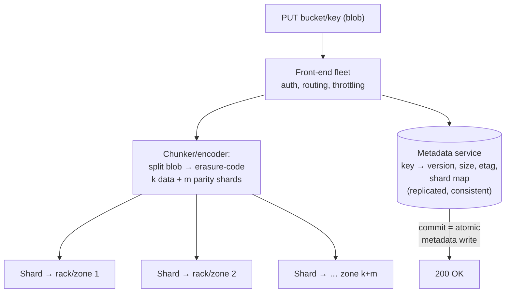

# Object Storage Internals

## TL;DR

Object storage (S3, GCS, Azure Blob, MinIO) is a flat-namespace key→blob store optimized for durability and throughput over latency: objects are immutable (replaced, never edited in place), written once and read many times. Internally it's two very different systems glued together: a **metadata/index service** — the genuinely hard distributed-systems part, mapping keys to chunk locations with strong consistency — and a **data plane** that stripes chunks with **erasure coding** across independent failure domains, achieving "11 nines" durability at ~1.5× storage overhead instead of replication's 3×. Modern object stores are strongly consistent (read-after-write) and support **conditional writes**, which quietly turned them into the substrate for lakehouse table formats, WAL-over-S3 databases, and leaderless coordination. Design for it as it is: high throughput, double-digit-ms first byte, per-prefix request limits, no rename, no append — and let lifecycle policies move cold bytes down the price ladder.

---

## What Object Storage Is (and Isn't)

| | Block storage | File system | Object storage |
|---|---|---|---|
| Unit | Fixed blocks | Files in directories | Objects under keys, flat namespace |
| Mutation | In-place writes | In-place + append | **Replace whole object only** |
| Namespace ops | — | Rename, move (cheap) | **No rename** — copy + delete |
| Latency | µs–ms | ms | ~10–100ms first byte |
| Throughput | Device-bound | Server-bound | Effectively unbounded (parallel) |
| Scale | Volumes | Servers/NAS | Exabytes, trillions of objects |
| Fits | Databases, boot disks | Shared POSIX workloads | Blobs, backups, lakes, media, logs |

"Directories" in object storage are a UI fiction over key prefixes — which is why there's no atomic rename, and why every system built on top (notably the early Hadoop-on-S3 era) that *assumed* atomic directory rename for commits eventually broke. The fix that stuck was moving commits into metadata pointers — exactly what [table formats](../13-data-pipelines/05-lakehouse-table-formats.md) do.

---

## Architecture: Metadata Plane + Data Plane

**The metadata service is the hard part.** It must answer `GET key` and `LIST prefix` with strong consistency at millions of requests per second, survive zone loss, and store an index of trillions of entries — a sharded, replicated database problem ([Partitioning](../02-distributed-databases/05-partitioning-strategies.md), [Consensus](../02-distributed-databases/08-consensus-algorithms.md)). The *commit point* of every upload is a metadata write: the object "exists" when the index says so, which is what makes operations atomic per key even though data shards landed across a dozen machines. S3 originally exposed this seam as eventual consistency; since 2020 it provides **strong read-after-write** consistency, and the industry followed — you can now read your own PUT, and overwrite visibility is linearizable per key.

**The data plane is mechanically simpler but enormous:** placement across failure domains, constant background repair, and integrity scrubbing (checksums on every shard; bit rot is a *when*, not an *if* — see also [Bloom Filters](./05-bloom-filters.md)-style metadata tricks for "does this chunk exist" queries at scale).

### Erasure coding: durability per dollar

Replication is simple and expensive: 3 copies = 3× cost, tolerates 2 losses. **Reed–Solomon erasure coding** splits an object into *k* data shards and computes *m* parity shards; *any k of the k+m* shards reconstruct the object:

| Scheme | Overhead | Tolerates | Reconstruction cost |
|---|---|---|---|
| 3× replication | 3.0× | 2 losses | Copy one replica |
| RS(6, 3) | 1.5× | 3 losses | Read 6 shards, decode |
| RS(10, 4) | 1.4× | 4 losses | Read 10 shards, decode |
| RS(12+, wide) | →1.2× | More, cross-zone | More repair I/O, higher tail latency |

Spread k+m shards across racks and zones and the durability math compounds: the famous 99.999999999% (11 nines) annual durability is the probability of losing k+m−(k−1) shards *faster than repair replaces them* — which is why **repair bandwidth, not disk failure rate, is the real durability knob**. The trade-off erasure coding pays: reconstruction reads amplify network traffic (a repair reads k shards to rebuild one), and degraded reads (one shard slow) inflate tail latency — mitigated in practice with locality-aware variants (e.g., local reconstruction codes, as in Azure) and by hedging shard reads ([Retries & Hedging](../06-scaling/10-retries-timeouts-hedging.md)). Hot small objects are often plain-replicated; EC kicks in for the bulk bytes — Facebook's f4 ran exactly this split between its hot "Haystack" tier and warm EC tier.

### Multipart upload, versioning, lifecycle

- **Multipart upload** is EC-friendly chunking exposed to the client: parts upload in parallel (and retry independently — each part is idempotent), then a *complete* call performs the single atomic metadata commit. It's also the only sane path past a few hundred MB.
- **Versioning** turns overwrite/delete into append-of-a-new-version (delete = tombstone marker), which is both an undo mechanism and a ransomware defense when combined with **object lock / immutability** ([Disaster Recovery](../15-deployment/05-disaster-recovery.md)).
- **Storage classes + lifecycle rules** move objects down the cost ladder (hot → infrequent → archive) automatically — the storage-engine equivalent of [tiered caching](../04-caching/05-multi-tier-caching.md), driven by age and access patterns instead of code.

---

## The Performance Model You Design Against

- **Throughput scales with parallelism, not per-stream speed.** One GET streams maybe 50–100 MB/s; a hundred parallel range-GETs saturate NICs. Readers should issue **ranged, parallel** requests (this is precisely how Parquet readers fetch column chunks).
- **Per-prefix request limits exist** (order of 3,500 writes / 5,500 reads per second per prefix on S3). Partitions split automatically by key prefix over time, but a brand-new bucket hammered on one prefix will throttle first — high-RPS workloads spread keys across prefixes by design (no more manual hash-prefix tricks needed, but the *distribution* still has to exist).
- **First-byte latency is tens of ms.** Object storage is not a cache and not a database for point reads; put a [CDN](../06-scaling/04-cdn-architecture.md) or cache tier in front for hot small objects, or use the express/one-zone low-latency classes where the durability trade is acceptable.
- **Requests cost money** — a pipeline that writes billions of tiny objects pays more for PUTs than for bytes; compact small records into larger objects (the same small-files problem that [table formats](../13-data-pipelines/05-lakehouse-table-formats.md) manage with compaction).
- **No append, no rename** shape every protocol on top: logs are written as sequences of immutable segment objects; "atomic publish" is a pointer swap in a catalog or a key whose content is written-once.

### Conditional writes: the quiet superpower

`PUT ... If-None-Match: *` (create-if-absent) and compare-and-swap on ETags turned object stores into coordination substrates: a winner-takes-all create becomes a lease/lock primitive, and a CAS on a manifest pointer becomes a transaction commit — this is how Iceberg-style catalogs, S3-backed WALs, and "Kafka-on-S3" systems (Warpstream-style, and S3's own append-capable express tier) implement atomicity without running a separate consensus service for the data path. The pattern: **bytes in immutable objects, truth in one small CAS-able pointer** ([Distributed Locks](../01-foundations/09-distributed-locks.md) — same fencing logic, different substrate).

---

## Building On It Well

- **Immutable-first data layout:** write-once segments + manifest, never read-modify-write of large blobs. Updates = new object + pointer flip.
- **ETag/checksum verification end-to-end** — request and verify integrity checksums on upload and download; silent corruption across multipart assembly is rare and real.
- **Presigned URLs** move bulk bytes client↔storage directly, keeping your services on the metadata path only — the cheapest bandwidth architecture available.
- **Event notifications** (object-created → queue) make the bucket a pipeline source ([Message Queues](../05-messaging/01-message-queues.md)), but remember delivery is at-least-once: consumers dedupe by key+etag ([Idempotency](../01-foundations/08-idempotency.md)).
- **Egress is the tax** — compute should move to the data's region, not bytes to compute ([FinOps](../11-observability/06-finops-cost-engineering.md)).
- Self-hosting (MinIO, Ceph RGW) buys you the same API with *your* failure domains — budget for the repair-bandwidth and scrubbing operations the hyperscalers made invisible.

---

## References

- [Building and operating a pretty big storage system (S3)](https://www.allthingsdistributed.com/2023/07/building-and-operating-a-pretty-big-storage-system.html) — Andy Warfield; the modern S3 internals account
- [f4: Facebook's Warm BLOB Storage System](https://www.usenix.org/conference/osdi14/technical-sessions/presentation/muralidhar) — OSDI '14; hot replication vs warm erasure coding
- [Windows Azure Storage: A Highly Available Cloud Storage Service with Strong Consistency](https://dl.acm.org/doi/10.1145/2043556.2043571) — SOSP '11; the layered stream/partition design
- [Erasure Coding in Windows Azure Storage (LRC)](https://www.usenix.org/conference/atc12/technical-sessions/presentation/huang) — local reconstruction codes
- [Amazon S3 strong consistency](https://aws.amazon.com/s3/consistency/) and [S3 performance guidelines](https://docs.aws.amazon.com/AmazonS3/latest/userguide/optimizing-performance.html)
- [MinIO erasure coding docs](https://min.io/docs/minio/linux/operations/concepts/erasure-coding.html) — a readable open-source implementation of the same math
