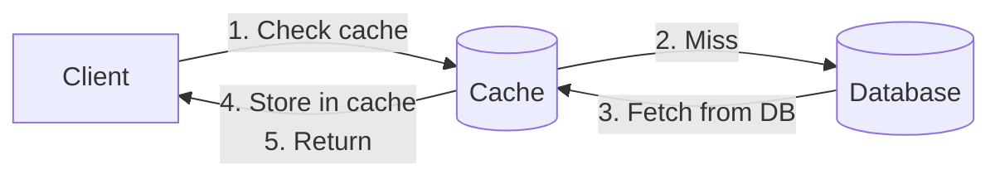
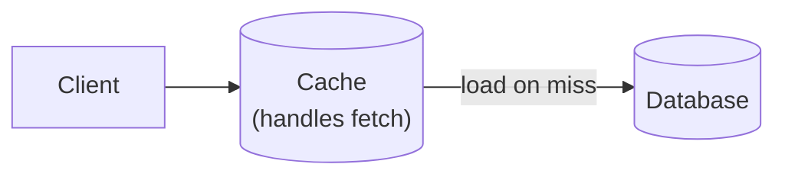
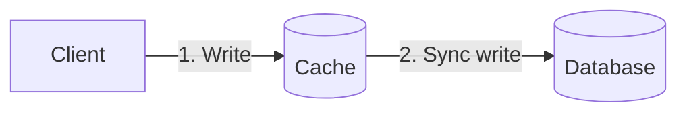
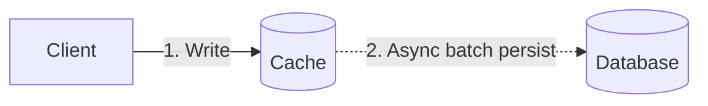

# Cache Strategies

## TL;DR

Caching reduces latency and database load by storing frequently accessed data in fast storage. Key strategies: Cache-aside (lazy loading), Read-through, Write-through, Write-behind, and Write-around. Choose based on read/write ratios, consistency requirements, and failure tolerance. Cache hit rate is the primary metric—optimize for your access patterns.

---

## Why Cache?

### The Latency Problem

```
Access times:
  L1 cache:         1 ns
  L2 cache:         4 ns
  RAM:              100 ns
  SSD:              100 μs
  Network (DC):     500 μs
  Disk:             10 ms

Database query: 1-100 ms (with network)
Cache hit: 1-10 ms (in-memory)

10-100x improvement possible
```

### Benefits

```
1. Reduced latency
   Cache hit: 1ms vs DB query: 50ms

2. Reduced database load
   1000 QPS → 100 QPS to DB (90% hit rate)

3. Cost reduction
   Cache memory cheaper than DB scaling

4. Improved availability
   Can serve from cache during DB issues
```

---

## Cache-Aside (Lazy Loading)

### How It Works



```
Application manages cache explicitly
```

### Implementation

```python
def get_user(user_id):
    # Check cache first
    cached = cache.get(f"user:{user_id}")
    if cached:
        return cached
    
    # Cache miss - fetch from database
    user = db.query("SELECT * FROM users WHERE id = ?", user_id)
    
    # Store in cache for next time
    cache.set(f"user:{user_id}", user, ttl=3600)
    
    return user
```

### Pros & Cons

```
Pros:
  + Only requested data is cached
  + Cache failures don't break reads
  + Simple to implement
  + Works with any data store

Cons:
  - First request always misses (cold start)
  - Data can become stale
  - Application must handle cache logic
  - "Cache stampede" on cold cache
```

---

## Read-Through

### How It Works



```
Cache transparently loads from DB on miss
Application only talks to cache
```

### Implementation

```python
class ReadThroughCache:
    def __init__(self, cache, db):
        self.cache = cache
        self.db = db
    
    def get(self, key):
        value = self.cache.get(key)
        if value is None:
            # Cache handles the fetch
            value = self.db.query_by_key(key)
            self.cache.set(key, value)
        return value

# Application code is simpler
user = cache.get(f"user:{user_id}")
```

### Pros & Cons

```
Pros:
  + Simpler application code
  + Cache logic centralized
  + Consistent caching behavior

Cons:
  - Cache must understand data schema
  - Harder to customize per-query
  - Cache failure = read failure
```

---

## Write-Through

### How It Works



```
1. Write to cache
2. Cache synchronously writes to DB
3. Return success after both complete
```

### Implementation

```python
class WriteThroughCache:
    def set(self, key, value):
        # Write to database first (must succeed)
        self.db.write(key, value)
        
        # Then update cache
        self.cache.set(key, value)
        
        return True

# Every write goes to both
cache.set(f"user:{user_id}", user_data)
```

### Pros & Cons

```
Pros:
  + Cache always consistent with DB
  + No stale reads
  + Simple mental model

Cons:
  - Write latency increased (cache + DB)
  - Every write hits cache (may cache unused data)
  - Cache failure blocks writes
```

---

## Write-Behind (Write-Back)

### How It Works



```
1. Write to cache immediately
2. Return success
3. Asynchronously persist to DB (batched)
```

### Implementation

```python
class WriteBehindCache:
    def __init__(self):
        self.dirty_keys = set()
        self.flush_interval = 1000  # ms
        
    def set(self, key, value):
        self.cache.set(key, value)
        self.dirty_keys.add(key)
        # Return immediately
    
    async def flush_loop(self):
        while True:
            await sleep(self.flush_interval)
            if self.dirty_keys:
                batch = list(self.dirty_keys)
                self.dirty_keys.clear()
                # Batch write to DB
                for key in batch:
                    self.db.write(key, self.cache.get(key))
```

### Pros & Cons

```
Pros:
  + Very fast writes (only cache)
  + Batch DB writes (efficient)
  + Absorbs write spikes

Cons:
  - Data loss risk (cache crash before flush)
  - Complex failure handling
  - Inconsistency window
  - Hard to debug
```

---

## Write-Around

### How It Works

```mermaid
graph LR
    Client["Client"] -->|Write directly| DB[("Database")]
    Client -.->|Read (cache-aside)| Cache[("Cache")]
    Cache -.->|Miss| DB
```

```
Writes go directly to DB, skip cache
Cache populated only on read
```

### Implementation

```python
def write_user(user_id, data):
    # Write directly to database
    db.write(f"user:{user_id}", data)
    # Optionally invalidate cache
    cache.delete(f"user:{user_id}")

def read_user(user_id):
    # Cache-aside for reads
    cached = cache.get(f"user:{user_id}")
    if cached:
        return cached
    user = db.query(user_id)
    cache.set(f"user:{user_id}", user)
    return user
```

### Pros & Cons

```
Pros:
  + Avoids caching infrequently read data
  + No cache pollution from writes
  + Simple write path

Cons:
  - Recent writes not in cache
  - Higher read latency after writes
  - Need cache invalidation strategy
```

---

## Eviction Policies

### LRU (Least Recently Used)

```
Access pattern: A, B, C, D, A, E (capacity: 4)

[A]           → A accessed
[A, B]        → B accessed  
[A, B, C]     → C accessed
[A, B, C, D]  → D accessed (full)
[B, C, D, A]  → A accessed (move to end)
[C, D, A, E]  → E accessed, B evicted (least recent)
```

### LFU (Least Frequently Used)

```
Track access count per item
Evict item with lowest count

Better for skewed access patterns
More memory overhead (counters)
```

### TTL (Time To Live)

```
Each entry has expiration time
Evict when expired

set("key", value, ttl=3600)  # Expires in 1 hour

Good for:
  - Data that changes periodically
  - Bounding staleness
```

### Random Eviction

```
Randomly select items to evict
Surprisingly effective for uniform access
Very simple to implement
Redis uses approximated LRU (random sampling)
```

---

## Cache Sizing

### Hit Rate Formula

```
Hit rate = Hits / (Hits + Misses)

Working set: Frequently accessed data
If cache > working set → high hit rate

Diminishing returns:
  10% cache: 80% hit rate
  20% cache: 90% hit rate
  50% cache: 95% hit rate
```

### Memory Calculation

```
Per-item overhead:
  Key: ~50 bytes avg
  Value: varies
  Metadata: ~50 bytes (pointers, TTL, etc.)
  
Example:
  1 million items
  100 bytes avg value
  Total: 1M × (50 + 100 + 50) = 200 MB
```

### Monitoring

```
Key metrics:
  - Hit rate (target: >90%)
  - Eviction rate
  - Memory usage
  - Latency percentiles
  
Alert on:
  - Hit rate drop
  - Memory pressure
  - High eviction rate
```

---

## Comparison

| Strategy | Read Latency | Write Latency | Consistency | Complexity |
|----------|--------------|---------------|-------------|------------|
| Cache-aside | Low (hit) | N/A | Eventual | Low |
| Read-through | Low | N/A | Eventual | Medium |
| Write-through | Low | High | Strong | Medium |
| Write-behind | Low | Very Low | Weak | High |
| Write-around | Medium | Low | Eventual | Low |

---

## Choosing a Strategy

### Decision Tree

```
Is write latency critical?
  Yes → Write-behind (if data loss acceptable)
      → Write-around (if not)
  No  → Write-through (if consistency critical)
      → Cache-aside (otherwise)

Is read latency critical?
  Yes → Any caching helps
  No  → May not need cache

Is consistency critical?
  Yes → Write-through or no cache
  No  → Cache-aside or write-behind
```

### Common Patterns

```
User profiles: Cache-aside + TTL
  - Read-heavy
  - Staleness OK for seconds
  
Session data: Write-through
  - Consistency important
  - Lost sessions = bad UX
  
Analytics: Write-behind
  - High write volume
  - Batch aggregation OK
  
Inventory: Write-around + invalidation
  - Writes change rarely-read data
  - Fresh data on read
```

---

## Hit Rate Economics

Hit rate is not a vanity metric — it directly determines how much load your database absorbs.

### The Core Formula

```
DB_QPS = total_QPS × (1 - hit_rate)
```

A seemingly small improvement in hit rate yields dramatic DB load reduction at scale:

| Total QPS | Hit Rate | DB QPS | DB Load Reduction vs 80% |
|-----------|----------|--------|--------------------------|
| 10,000    | 80%      | 2,000  | —                        |
| 10,000    | 90%      | 1,000  | 50%                      |
| 10,000    | 95%      | 500    | 75%                      |
| 10,000    | 99%      | 100    | 95%                      |

Going from 95% to 99% cuts DB QPS by 5x. This is why the last few percent of hit rate are worth engineering effort — each percentage point removed from misses has outsized impact.

### Break-Even Analysis

Cache infrastructure is justified when:

```
cost_of_cache_infra < cost_of_DB_scaling_to_handle_misses
```

In practice, a 3-node Redis cluster (~$1,500/mo on cloud) can absorb millions of reads that would require scaling a primary database from a db.r6g.xlarge ($1,200/mo) to a db.r6g.4xlarge ($4,800/mo). The cache pays for itself when it prevents even one DB tier jump.

### The 80/20 Rule of Caching

Most production workloads follow a power-law distribution. Caching the top 20% most-accessed keys typically captures 80%+ of all read traffic. This means you rarely need to cache your entire dataset — identify the hot subset and cache aggressively there. Use access frequency analysis before blindly caching everything.

### When Caching Hurts

If your workload has a uniform random access pattern (every key equally likely), cache hit rate scales linearly with cache size — no shortcut. In such cases, caching may cost more than it saves. Scan-heavy analytics workloads also pollute caches with one-time-use data.

---

## Cache Sizing in Production

The basic memory calculation from the sizing section above gets you started. Production sizing requires deeper analysis.

### Working Set Estimation

Your working set is the subset of data actively accessed within a given time window. To estimate it:

1. **Sample access logs** over 1 full TTL window (e.g., if TTL = 1 hour, analyze 1 hour of logs)
2. **Count unique keys** accessed in that window
3. **Use the 90th percentile** across multiple windows to account for traffic variance
4. Add 20-30% headroom for burst traffic and growth

```bash
# Quick Redis working set estimate from slowlog + keyspace analysis
redis-cli INFO keyspace
# db0:keys=2450000,expires=2100000,avg_ttl=3580000
# 2.45M keys in use, most with TTL ~ 1 hour
```

### Redis Memory Overhead

Redis is not a simple key-value byte store. Every key carries metadata:

```
String type:
  key overhead:    ~56 bytes (dictEntry + SDS header + redisObject)
  value overhead:  ~16 bytes (redisObject) + SDS header
  total per entry: key_bytes + value_bytes + ~90 bytes fixed overhead

Hash type (ziplist encoding, < 64 entries by default):
  Stores fields compactly in a contiguous block
  ~2x more memory-efficient than equivalent string keys
  Threshold controlled by: hash-max-ziplist-entries (default 128)
                           hash-max-ziplist-value   (default 64 bytes)
  Exceeding thresholds → hashtable encoding (more memory, faster O(1) access)
```

Use `redis-cli MEMORY USAGE <key>` to measure actual per-key cost in production.

### Memcached Slab Allocator

Memcached pre-allocates memory into slab classes with fixed chunk sizes (64B, 128B, 256B, ...):

```
Slab class 1: 96-byte chunks
Slab class 2: 120-byte chunks
...
Slab class 42: 1 MB chunks

A 65-byte item → stored in a 96-byte chunk → 31 bytes wasted (slab waste)
```

Key flags:
- `-I 2m` — max item size (default 1 MB, max 128 MB). Increasing this creates large slab classes.
- Fragmentation is inherent: items rarely fit chunk boundaries exactly. Monitor `stats slabs` for `mem_wasted`.
- If >30% memory is wasted, consider tuning `-f` (growth factor) to create more granular slab classes.

### Production Sizing Formula

```
memory_required = avg_item_size × estimated_unique_keys × overhead_factor

where:
  avg_item_size   = key_bytes + value_bytes (measure from production samples)
  unique_keys     = working set estimate from access log analysis
  overhead_factor = 1.2 (Redis, well-tuned) to 1.5 (Memcached, high fragmentation)
```

Always validate estimates with a shadow deploy or canary before committing to instance sizes.

---

## Production Configuration

### Redis Annotated Config

```
maxmemory 4gb
# Hard memory ceiling. When hit, eviction policy kicks in.
# Set to ~75% of instance RAM to leave room for fork (BGSAVE) overhead.

maxmemory-policy allkeys-lru
# Evict any key using approximated LRU when memory is full.
# Use 'volatile-lru'  → only evict keys WITH a TTL set (safe for mixed workloads)
# Use 'allkeys-lru'   → evict any key (best for pure cache, no persistent data)
# Use 'allkeys-lfu'   → evict least-frequently-used (better for skewed access patterns)
# Use 'noeviction'    → return errors on writes when full (use for session stores)

lazyfree-lazy-eviction yes
# Evict keys in a background thread instead of blocking the main thread.
# Critical at high eviction rates — prevents latency spikes during memory pressure.

lazyfree-lazy-expire yes
# Delete expired keys in a background thread.
# Same rationale: large keys expiring can block the event loop for milliseconds.

tcp-keepalive 300
# Send TCP keepalive probes every 300 seconds to detect dead connections.
# Cloud load balancers often drop idle connections at 350-400s.
# Set this lower than your LB idle timeout.
```

### When to Use Which Eviction Policy

```
allkeys-lru    → Pure cache. Every key is expendable.
                  Most common in production.

volatile-lru   → Mixed use: some keys are cache, some are persistent.
                  Only keys with TTL are eviction candidates.
                  Risk: if you forget to set TTL, those keys are never evicted.

allkeys-lfu    → Access frequency matters more than recency.
                  Better for CDN-style workloads where popular items
                  should stay cached even if not accessed in the last minute.
                  Redis 4.0+ only.

volatile-ttl   → Evict keys with shortest remaining TTL first.
                  Useful when TTL encodes priority (shorter TTL = lower value).
```

### Memcached Production Flags

```bash
memcached -m 4096 -I 2m -c 10000 -t 4
#   -m 4096   → 4 GB memory limit
#   -I 2m     → max item size 2 MB (default 1 MB)
#   -c 10000  → max concurrent connections (default 1024)
#   -t 4      → worker threads (match to available cores, not more)
```

Additional production flags:
- `-o modern` — enables newer optimizations (slab rebalancing, LRU crawler)
- `-v` / `-vv` — verbose logging (use in staging, not production)
- `-R 200` — max requests per event (prevents starvation under load)

---

## Cache Key Design

Good key design prevents collisions, simplifies debugging, and enables bulk invalidation.

### Namespacing Convention

Use a hierarchical `service:entity:id` pattern:

```
user-svc:profile:12345
order-svc:order:abc-789
catalog-svc:product:SKU-001
```

Benefits:
- Instantly identifies which service owns the key (critical during incidents)
- Enables pattern-based monitoring: `redis-cli --scan --pattern "user-svc:*"` to audit one service's footprint
- Prevents cross-service key collisions without coordination

### Version-Based Invalidation

Prefix keys with a version number to enable instant bulk invalidation:

```
v3:user:12345
v3:user:67890
```

When schema changes or a data migration occurs, increment to `v4:`. All `v3:` keys become unreachable and expire naturally via TTL. No need to enumerate and delete thousands of keys individually.

This is cheaper than `SCAN` + `DEL` at scale, especially in clustered Redis where keys are spread across shards.

### Hot Key Detection and Mitigation

A hot key is a single key receiving disproportionate traffic, creating a bottleneck on one cache shard.

Detection:
```bash
redis-cli --hotkeys
# Requires maxmemory-policy to be LFU-based for accurate results.

# Alternative: sample commands in real time
redis-cli MONITOR | head -10000 | sort | uniq -c | sort -rn | head -20
# WARNING: MONITOR is expensive. Run briefly and only in emergencies.
```

Mitigation strategies:
- **Local L1 cache**: application-level in-process cache (e.g., Caffeine, Guava) with 1-5s TTL in front of Redis
- **Key replication**: append a random suffix (`hot-key:{rand(1..8)}`) and read from a random replica. Write to all 8 copies on update.

### Key Size Guidelines

- Keep keys **under 200 bytes**. Redis stores keys in memory; bloated keys waste RAM at scale.
- For long composite keys (e.g., multi-field lookups), hash the components:
  ```
  Instead of: user-svc:profile:region=us-east-1:plan=enterprise:cohort=2024Q1:id=12345
  Use:        user-svc:profile:sha256(region=us-east-1:plan=enterprise:cohort=2024Q1):12345
  ```
- Document your key schema in a shared wiki. Teams will inevitably need to decode keys during incidents.

---

## Negative Caching

### The Pattern

Cache "not found" results to prevent repeated database queries for entities that do not exist:

```python
def get_user(user_id):
    cached = cache.get(f"user:{user_id}")
    if cached == SENTINEL_NOT_FOUND:
        return None              # Known miss — skip DB entirely
    if cached is not None:
        return cached

    user = db.query(user_id)
    if user is None:
        cache.set(f"user:{user_id}", SENTINEL_NOT_FOUND, ttl=60)  # Short TTL
        return None

    cache.set(f"user:{user_id}", user, ttl=3600)
    return user
```

### Why It Matters

Without negative caching, every lookup for a non-existent entity hits the database. Common scenarios:
- **User lookup by email** for unregistered emails (login attempts, invite checks)
- **Product catalog** lookups for discontinued SKUs still linked in old URLs
- **Permission checks** for resources that were deleted

A single bot or scraper can generate thousands of QPS for non-existent keys, hammering your DB with queries that always return zero rows.

### Risks and Mitigation

**Race condition**: a negative cache entry is written, then the entity is created (e.g., user registers). The short TTL window returns stale "not found" results.

Mitigations:
- **Short TTL** (30-60s) — bounds the staleness window
- **Invalidate on create** — when inserting a new entity, explicitly delete its negative cache entry
- **Use a distinct sentinel value** (not `None` or empty string) to distinguish "cached miss" from "not in cache"

---

## Production Failure Modes

Caches fail in predictable ways. Recognizing these patterns early prevents cascading outages.

### Memory Fragmentation

```bash
redis-cli INFO memory | grep mem_fragmentation_ratio
# mem_fragmentation_ratio: 1.12    → healthy
# mem_fragmentation_ratio: 1.8     → 80% overhead, wasting RAM
# mem_fragmentation_ratio: 0.8     → swapping to disk, critical
```

- **Ratio > 1.5**: Redis allocated memory is heavily fragmented. Caused by variable-size key churn (frequent create/delete of different-sized values).
- Fix: `MEMORY PURGE` (Redis 4+), or schedule a rolling restart. Use `activedefrag yes` for online defragmentation.
- Prevention: prefer uniform value sizes, avoid mixing tiny and large keys in the same instance.

### Eviction Storms

When `maxmemory` is hit under high write rates, Redis enters a continuous eviction cycle:

```
write → evict to make room → write → evict → ...
```

Hit rate collapses because entries are evicted before they can be read again. Latency spikes as eviction competes with serving reads. Symptoms: `evicted_keys` counter climbing rapidly, hit rate plummeting.

Fix: increase `maxmemory`, reduce TTLs to expire data before eviction kicks in, or shard to distribute the keyspace.

### Cache Poisoning

A stale or incorrect value is written to cache — and never corrected:

```
1. Request A reads DB (value = 100)
2. Request B updates DB (value = 200) and invalidates cache
3. Request A (slow, still running) writes its stale read (value = 100) to cache
4. Cache now holds value = 100 with no TTL → permanently wrong
```

Prevention: always set a TTL, even on write-through entries. A 24-hour TTL is a safety net that bounds the damage from race conditions. For critical data, use versioned writes (CAS / `SET ... NX`).

### Further Reading

→ see `04-cache-stampede.md` for thundering herd and cache stampede solutions

---

## Key Takeaways

1. **Cache-aside is most common** - Simple, resilient, flexible
2. **Write-through for consistency** - At cost of write latency
3. **Write-behind for write speed** - Accept data loss risk
4. **Hit rate is king** - Optimize for your access patterns
5. **Size for working set** - Not total dataset
6. **TTL provides freshness bounds** - Eventual consistency guarantee
7. **Monitor everything** - Hit rate, latency, evictions
8. **Failure modes matter** - Cache down shouldn't mean app down
