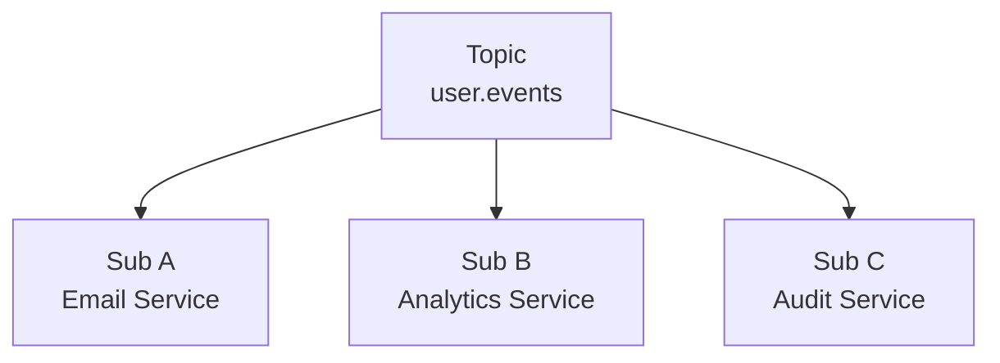
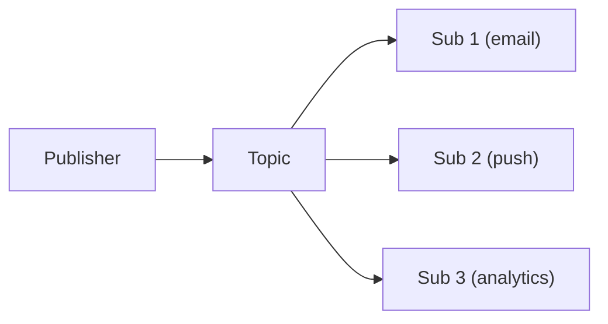
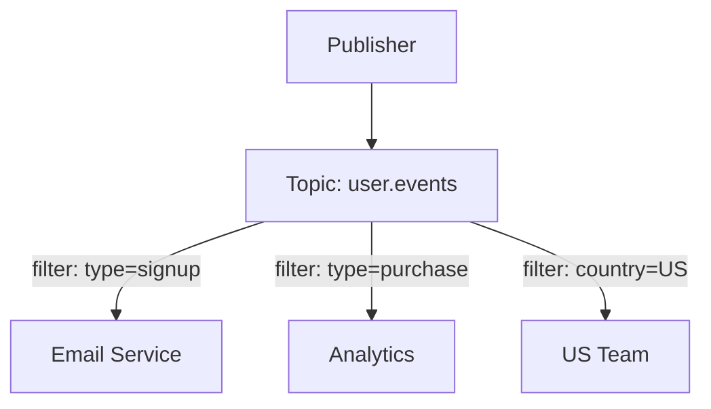
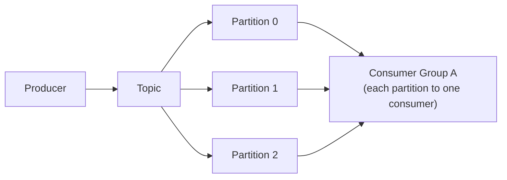
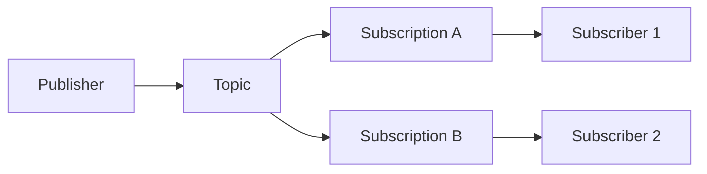
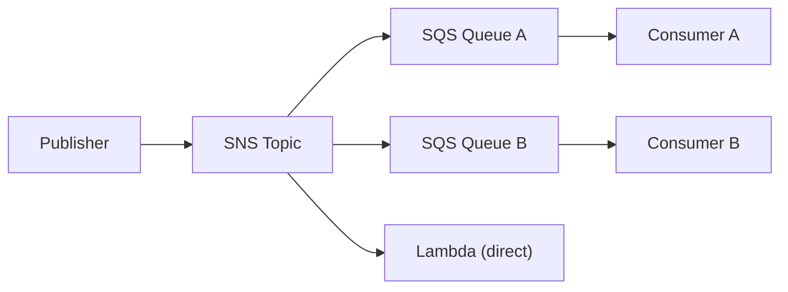
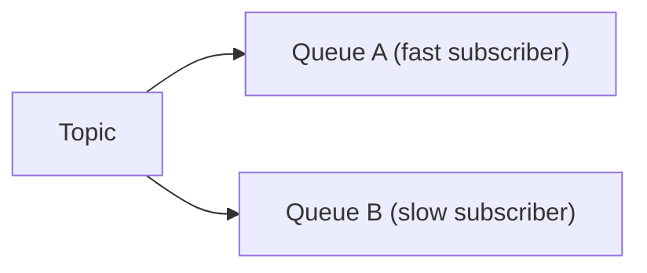
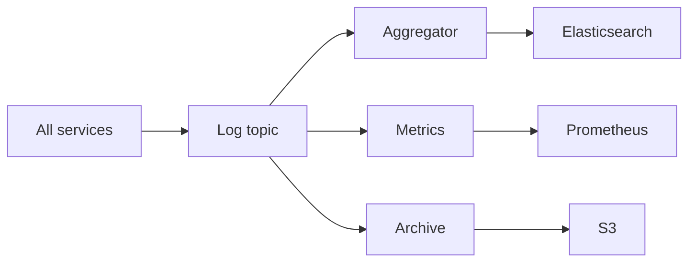
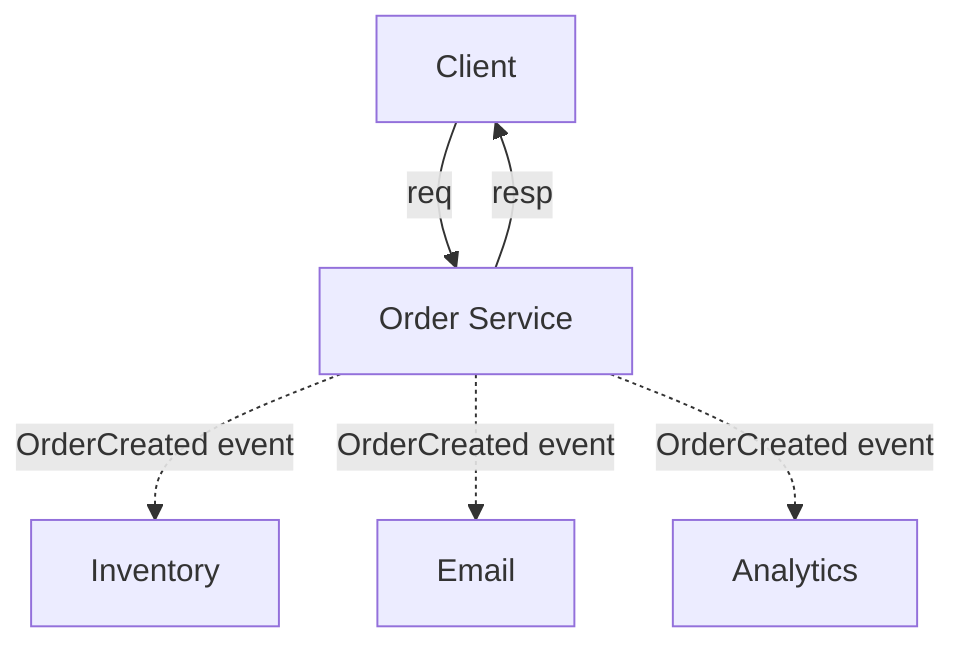

# Publish-Subscribe (Pub/Sub)

## TL;DR

Pub/Sub decouples message producers from consumers through topics. Publishers send messages to topics without knowing subscribers. Subscribers receive copies of all messages from topics they subscribe to. Enables event-driven architectures, real-time updates, and loose coupling. Key considerations: fan-out cost, ordering, filtering, and backpressure.

---

## Core Concepts

### Architecture



Publisher doesn't know about subscribers.
Each subscriber gets a copy of every message.

### vs Point-to-Point

```
Point-to-Point (Queue):
  Message ──► [Queue] ──► ONE consumer
  Work distribution

Pub/Sub (Topic):
  Message ──► [Topic] ──► ALL subscribers
  Event broadcasting
```

### Message Flow

```
1. Publisher sends event to topic
2. Broker stores message
3. Broker fans out to all subscribers
4. Each subscriber processes independently
5. Subscribers acknowledge individually
```

---

## Subscription Models

### Push vs Pull

**Push (Broker pushes to subscriber):**
```
Broker ──push──► Subscriber endpoint

Pros:
  - Low latency
  - Simple subscriber

Cons:
  - Subscriber must handle load
  - Need webhook endpoint
  
Example: Google Pub/Sub push subscriptions
```

**Pull (Subscriber pulls from broker):**
```
Subscriber ──pull──► Broker

Pros:
  - Subscriber controls rate
  - Works behind firewalls

Cons:
  - Polling overhead
  - Higher latency possible

Example: Kafka consumer groups
```

### Durable vs Ephemeral

**Durable Subscription:**
```
Subscriber disconnects at T=0
Messages arrive at T=1, T=2, T=3
Subscriber reconnects at T=4

Gets all messages (T=1, T=2, T=3)
Broker stored them during disconnect
```

**Ephemeral Subscription:**
```
Only receives messages while connected
Missed messages during disconnect are lost

Use for: Real-time displays, live updates
```

---

## Topic Design

### Hierarchical Topics

```
events.user.created
events.user.updated
events.user.deleted
events.order.placed
events.order.shipped

Wildcards:
  events.user.*     → All user events
  events.*.created  → All creation events
  events.#          → Everything under events
```

### Topic Naming Conventions

```
Pattern: <domain>.<entity>.<action>

Examples:
  payment.transaction.completed
  inventory.stock.low
  user.profile.updated
  
Benefits:
  - Clear ownership
  - Easy filtering
  - Logical grouping
```

### Single vs Multiple Topics

```
Single topic (events):
  All events in one place
  Consumers filter by type
  Simpler infrastructure

Multiple topics (events.user, events.order):
  Natural partitioning
  Subscribe to relevant topics only
  Better access control
  
Recommendation: Start with fewer topics, split when needed
```

---

## Fan-Out Patterns

### Simple Fan-Out

One message → N copies.



Each gets same message. Process independently.

### Fan-Out with Filtering

Not all subscribers want all messages.



### Implementation

```python
# Google Cloud Pub/Sub with filter
subscriber.create_subscription(
    name="email-signups",
    topic="user-events",
    filter='attributes.type = "signup"'
)

# Kafka: Consumer reads all, filters in code
for message in consumer:
    if message.value['type'] == 'signup':
        process_signup(message)
```

---

## Ordering Guarantees

### No Ordering (Default)

```
Published: A, B, C
Subscriber 1 sees: B, A, C
Subscriber 2 sees: A, C, B

No guarantee between subscribers or even for one subscriber
```

### Per-Publisher Ordering

```
Publisher 1: A1, B1, C1 → Subscriber sees A1, B1, C1
Publisher 2: A2, B2, C2 → Subscriber sees A2, B2, C2

But A1 and A2 may interleave arbitrarily
```

### Partition-Based Ordering

```
Messages with same key → same partition → ordered

user_123 events: login, view, purchase
  All go to partition 3
  Subscriber sees in order

Different users may interleave
```

### Total Ordering

```
All messages in strict global order
Very expensive (single bottleneck)
Rarely needed
```

---

## Implementations

### Apache Kafka



Features:
- Log-based (replay possible)
- Consumer groups for scaling
- Ordered within partition
- High throughput

### Google Cloud Pub/Sub



Features:
- Managed service
- Push and pull
- Message filtering
- At-least-once (exactly-once preview)

### Amazon SNS + SQS



Features:
- SNS for fan-out
- SQS for durability and processing
- Multiple protocols (HTTP, email, SMS)

### Redis Pub/Sub

```
Simple in-memory pub/sub

PUBLISH user-events '{"type":"login"}'
SUBSCRIBE user-events

Features:
  - Very fast
  - No persistence (ephemeral)
  - No consumer groups
  - Good for real-time
```

---

## Handling Backpressure

### The Problem

```
Publisher: 10,000 msg/sec
Subscriber A: Can handle 10,000 msg/sec ✓
Subscriber B: Can handle 1,000 msg/sec ✗

Subscriber B falls behind
Queue grows unbounded
Eventually: OOM or dropped messages
```

### Solutions

**Per-Subscriber Queues:**


Each queue buffers independently. Slow subscriber doesn't affect fast one.

**Backpressure Signals:**
```
Subscriber signals "slow down"
Broker reduces send rate
Or: Subscriber pulls at own pace
```

**Dead Letter after Timeout:**
```
Message unacked for > 1 hour
Move to dead letter queue
Alert and manual handling
```

---

## Exactly-Once Challenges

### Duplicate Delivery

```
Scenario:
  1. Broker sends message to subscriber
  2. Subscriber processes
  3. Ack lost in network
  4. Broker re-sends (thinks it failed)
  5. Subscriber processes again

Result: Processed twice
```

### Solutions

```
1. Idempotent subscriber
   Track processed message IDs
   Skip if already seen

2. Transactional processing
   Process + ack in same transaction
   (Not always possible)

3. Deduplication at broker
   Broker tracks delivered message IDs
   (Limited time window)
```

---

## Event Schema Evolution

### The Challenge

```
Version 1:
  {user_id: 123, name: "Alice"}

Version 2 (add field):
  {user_id: 123, name: "Alice", email: "..."}

Old subscribers must handle new fields
New subscribers must handle missing fields
```

### Best Practices

```
1. Only add optional fields
2. Never remove or rename fields
3. Use schema registry
4. Version in message (or use schema ID)

{
  "schema_version": 2,
  "user_id": 123,
  "name": "Alice",
  "email": "alice@example.com"  // Optional
}
```

### Schema Registry

```
Publisher:
  1. Register schema with registry
  2. Get schema ID
  3. Include schema ID in message

Subscriber:
  1. Get schema ID from message
  2. Fetch schema from registry
  3. Deserialize with correct schema
```

---

## Use Cases

### Event-Driven Architecture

```
User signs up
  → UserCreated event published

Subscribed services:
  - Email service: Send welcome email
  - Analytics: Track signup
  - Billing: Create account
  - Recommendations: Initialize profile

Services evolve independently
Add new subscriber without changing publisher
```

### Real-Time Updates

```
Stock price changes
  → PriceUpdated event

Subscribers:
  - Trading dashboards (WebSocket push)
  - Alert service (check thresholds)
  - Historical database (record)
```

### Log Aggregation



---

## Monitoring

### Key Metrics

```
Publication rate:
  Messages published per second

Fan-out latency:
  Time from publish to subscriber receive

Subscriber lag:
  Messages pending per subscription

Acknowledgment rate:
  Acks per second (subscriber health)

Dead letter rate:
  Failed messages per time
```

### Health Checks

```python
def check_pubsub_health():
    # Check broker connectivity
    assert can_connect_to_broker()
    
    # Check subscription lag
    for sub in subscriptions:
        lag = get_subscription_lag(sub)
        if lag > threshold:
            alert(f"Subscription {sub} lagging: {lag}")
    
    # Check dead letter queue
    dlq_size = get_dlq_size()
    if dlq_size > 0:
        alert(f"Dead letter queue has {dlq_size} messages")
```

---

## Pub/Sub at Scale

### The Fan-Out Problem

```
1 msg × 10K subscribers = 10K deliveries
1K msg/sec × 10K subscribers = 10M deliveries/sec

Single broker cannot handle this. Fan-out cost grows linearly with subscribers.
```

### Hierarchical Pub/Sub

```
Publisher → [Root Broker] → [US] [EU] [APAC] → Local subscribers

Cross-region traffic reduced to 1 copy per region.
Regional brokers fan out locally. Failure isolation per region.
```

### Topic Sharding

```
Topic "user.events" partitioned: subscribers split across broker instances.
  Shard 0 (subs 0-2499) → Broker A    Shard 2 (subs 5000-7499) → Broker C
  Shard 1 (subs 2500-4999) → Broker B  Shard 3 (subs 7500-9999) → Broker D

Coordinator distributes to shards. Each broker fans out to its subset only.
```

### Cloud Provider Approaches

```
Google Cloud Pub/Sub:
  - Push (broker POSTs to HTTPS) or Pull (subscriber polls)
  - Exactly-once via message dedup (window ~10 min)
  - Seek: replay by rewinding subscription to a timestamp

AWS SNS fan-out:
  - SNS → SQS queues, Lambda, HTTP/S endpoints, email, SMS
  - SNS + SQS for durability (SNS alone is fire-and-forget)
```

### Throughput Reference

```
Kafka:    100 partitions → 1M+ msg/sec (scales linearly with partitions)
RabbitMQ: Fanout exchange → 50K-100K msg/sec (degrades with subscriber count)
Redis:    In-memory pub/sub → 500K+ msg/sec (no durability, fire and forget)
```

---

## Topic Design Patterns

### Fine-Grained vs Coarse-Grained Topics

```
Fine-grained (one topic per event type):
  orders.created, orders.updated, orders.cancelled, orders.refunded
  ✓ Subscribe to exactly what you need, simpler consumer logic
  ✗ Topic proliferation, publisher must pick correct topic

Coarse-grained (one topic per domain):
  orders → { "event_type": "created", ... }
  ✓ Fewer topics, single subscription for all order events
  ✗ Consumers receive unwanted events, filtering pushed to subscriber
```

### Event Envelope Pattern

```json
{
  "event_id": "evt_a1b2c3d4",
  "event_type": "order.created",
  "timestamp": "2026-03-15T10:30:00Z",
  "correlation_id": "req_x9y8z7",
  "source": "order-service",
  "schema_version": 2,
  "payload": { "order_id": "ord_123", "customer_id": "cust_456", "total": 99.99 }
}
```

```
Standard wrapper enables:
  - Routing without deserializing payload
  - Distributed tracing via correlation_id
  - Deduplication via event_id
```

### Wildcard Subscriptions

```
RabbitMQ topic exchange:
  order.*.created  → matches order.us.created, order.eu.created
  order.#          → matches order.us.created, order.eu.shipped.delayed
  (* = exactly one word, # = zero or more words)

Kafka: No native wildcard on topics. Consumer subscribes by regex on
  topic names only: consumer.subscribe(Pattern.compile("orders\\..*"))
```

---

## Pub/Sub Failure Handling

### Slow Subscriber Impact

```
Does a slow subscriber block others?

Kafka:   No. Independent consumer offsets per group.
         Slow consumer falls behind; fast consumers unaffected.

RabbitMQ: Each subscriber has its own queue (slow queue grows independently).
         Classic queues: broker may backpressure publisher if queue is full.
         Quorum queues: better isolation, but memory pressure when large.
```

### Poison Messages

```
Message that crashes subscriber on every attempt → infinite redelivery loop.

Solution: Bounded retries with backoff, then route to DLQ.

  if retry_count >= max_retries:
      publish_to_dlq(message)   # See 08-dead-letter-queues.md
  else:
      redelivery_with_backoff(message)

Detection: log message ID on each failure, alert on repeated ID, include error in DLQ metadata.
```

### Subscriber Crash During Processing

```
1. Broker delivers message → 2. Subscriber processes → 3. Crash before ack
4. Broker redelivers → 5. Message processed twice

At-least-once delivery makes this unavoidable.
Subscriber MUST be idempotent. See 04-delivery-guarantees.md.

Idempotency: dedup table (skip seen IDs), upsert instead of insert,
  or use event_id as idempotency key for external API calls.
```

---

## Pub/Sub vs Request-Response

### When to Use Each

```
Use Pub/Sub when:
  ✓ Event notification ("something happened") — N downstream consumers
  ✓ Decoupled services — publisher doesn't know who listens
  ✓ Temporal decoupling — consumer processes when ready

Use Request-Response when:
  ✓ Need immediate answer — "price of item X?" → $29.99
  ✓ Synchronous workflow — each step needs prior result
  ✓ Single consumer — only one handler for the request
  ✓ Caller must know if operation failed
```

### Hybrid: Command + Event



Request-response for synchronous path. Pub/sub for async side effects.

### Anti-Pattern: RPC Over Messaging

```
DON'T: Client → [request.topic] → Service → [reply.topic + correlation_id] → Client

Problems:
  - Correlation ID management complexity
  - Reply topic per client or shared reply topic with filtering
  - Timeout handling is awkward (when to stop waiting?)
  - Debugging harder than direct call tracing

If you need request-response, use gRPC or HTTP.
Pub/sub is for fire-and-forget or fire-and-observe.
```

---

## Key Takeaways

1. **Pub/Sub decouples producers from consumers** - Neither knows the other
2. **Each subscriber gets every message** - Fan-out pattern
3. **Durable subscriptions survive disconnection** - Messages queued
4. **Ordering is expensive** - Use partition keys when needed
5. **Backpressure is critical** - Slow subscribers can cause problems
6. **Idempotency handles duplicates** - At-least-once is common
7. **Schema evolution needs planning** - Use registry, add-only changes
8. **Monitor subscriber lag** - Early warning of processing issues
