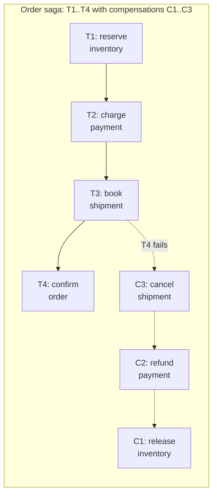
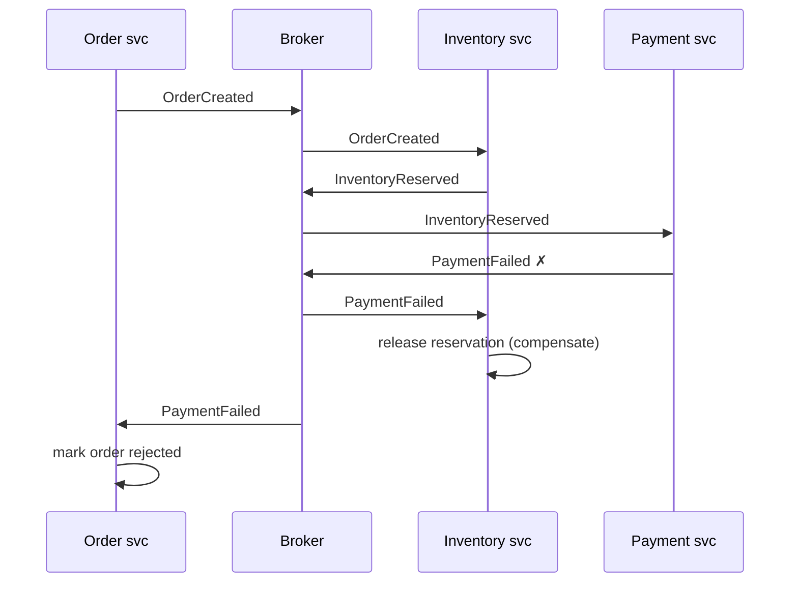

# Sagas and Durable Execution

## TL;DR

A saga executes a business transaction that spans services as a sequence of local transactions, each paired with a **compensating action** that semantically undoes it. There is no distributed commit and no isolation — other transactions see intermediate states — so sagas trade ACID's "A and I" for availability and loose coupling. Coordinate them by **choreography** (services react to each other's events) for simple, short flows, or **orchestration** (a coordinator owns the state machine) for anything with branching, timeouts, or more than ~3 steps. **Durable execution** engines (Temporal-style workflow-as-code) industrialized orchestration: the coordinator's state survives crashes via event-sourced replay, retries and timers come built-in, and the saga becomes ordinary code. Design the compensations first — if a step can't be compensated, it must go last.

---

## Why Not a Distributed Transaction?

Two-phase commit across services couples every participant's availability and holds locks across network round-trips — the coordinator is a blocking single point of failure, and a slow participant stalls everyone ([Distributed Transactions](../02-distributed-databases/07-distributed-transactions.md)). Across team and service boundaries, 2PC also couples *deployments*: every participant must speak the same transaction protocol forever. Sagas accept a weaker guarantee — **eventual atomicity**: either all steps complete, or completed steps are compensated — in exchange for each service using only its own local ACID transactions.



The execution rule: forward through T1…Tn; on failure at Tk, run compensations Ck-1…C1 in reverse. Compensations are **semantic** undos, not rollbacks — a refund is a new financial event, not the erasure of a charge. Some actions need no compensation (a reservation that expires); some can't be compensated at all (an email sent, cash dispensed) — order those last, or convert them into cancellable two-step actions (reserve → confirm).

---

## Choreography: Events Without a Coordinator

Each service subscribes to the previous step's event and emits its own. There is no central brain — the saga *is* the event flow.



```python
# Inventory service: forward step and compensation are just event handlers
@handles("OrderCreated")
def reserve(event, tx):
    tx.execute("UPDATE stock SET reserved = reserved + %s WHERE sku = %s AND available >= %s",
               event.qty, event.sku, event.qty)
    outbox.emit(tx, "InventoryReserved", order_id=event.order_id)   # outbox: state + event atomically

@handles("PaymentFailed")
def compensate(event, tx):
    tx.execute("UPDATE stock SET reserved = reserved - %s WHERE sku = %s",
               event.qty, event.sku)
    outbox.emit(tx, "InventoryReleased", order_id=event.order_id)
```

Every step must update local state and emit its event **atomically** — that is exactly the [Outbox Pattern](./07-outbox-pattern.md), and a saga without it will eventually lose or invent steps. Consumers must be idempotent, because delivery is at-least-once ([Delivery Guarantees](./04-delivery-guarantees.md)).

Choreography's strength is decoupling; its weakness is that **nobody can answer "where is order 4711 and what happens next?"** without mentally simulating the event graph. Cyclic subscriptions creep in; adding a step means touching multiple services. Past roughly three steps or any branching, the implicit state machine wants to be explicit.

## Orchestration: An Explicit State Machine

A coordinator (one of the services, or a dedicated one) sends commands, awaits replies, and owns the saga's state:

```python
class OrderSaga:
    """Explicit state machine; state persisted on every transition."""

    STEPS = [
        Step(cmd=ReserveInventory, compensation=ReleaseInventory),
        Step(cmd=ChargePayment,    compensation=RefundPayment),
        Step(cmd=BookShipment,     compensation=CancelShipment),
        Step(cmd=ConfirmOrder,     compensation=None),  # pivot: no undo past here
    ]

    def on_reply(self, saga_state, reply):
        if reply.ok:
            saga_state.completed.append(reply.step)
            return self.next_command(saga_state)
        # failure → run completed steps' compensations in reverse
        return [s.compensation(saga_state) for s in reversed(saga_state.completed)
                if s.compensation]
```

| | Choreography | Orchestration |
|---|---|---|
| Coupling | Services know event contracts only | Services know the orchestrator's commands |
| Visibility | Reconstructed from logs | One row/record tells you the state |
| Adding a step | Edit several services | Edit the orchestrator |
| Failure handling | Distributed across handlers | Centralized, testable |
| Risk | Implicit spaghetti state machine | Orchestrator grows god-object tendencies |
| Fits | 2–3 linear steps, stable flow | Branching, timeouts, SLAs, audits |

Keep the orchestrator a *coordinator*, not a *doer*: it decides sequencing; business logic stays in the services.

---

## The Missing "I": Saga Isolation

Sagas expose intermediate states — the reservation exists before payment clears, and a concurrent saga can observe or interfere. Garcia-Molina's original paper assumed semantically independent steps; real systems need countermeasures:

- **Semantic lock:** mark records `PENDING` while a saga owns them; other sagas treat pending as busy (retry or reroute). This is an application-level lock — keep it short and expiry-guarded ([Distributed Locks](../01-foundations/09-distributed-locks.md)).
- **Commutative updates:** design steps as `+= / -=` deltas rather than absolute writes, so interleaving order stops mattering.
- **Pessimistic ordering:** put the riskiest, most-likely-to-fail step first (validate + charge before reserving scarce inventory), shrinking the window in which compensations are visible.
- **Reread before the pivot:** the step after which there is no undo (the **pivot transaction**) revalidates critical assumptions ("price unchanged, items still reserved") before committing.
- **Version counters / fencing** on the records a saga touches, so a stale saga's late write is rejected rather than applied.

If two sagas updating the same record concurrently would corrupt it and none of these fit, that workflow may genuinely need a single-writer design or a real transaction inside one service boundary — redrawing the boundary is sometimes the honest fix.

---

## Durable Execution: Sagas as Ordinary Code

Hand-rolled orchestrators all converge on the same infrastructure: persist state per transition, recover after crashes, retry with backoff, handle timers, version the workflow logic. **Durable execution** engines (Temporal, and the pattern behind AWS Step Functions, Restate, Azure Durable Functions) provide that substrate and let you write the saga as straight-line code:

```python
@workflow.defn
class OrderWorkflow:
    @workflow.run
    async def run(self, order: Order) -> str:
        compensations = []
        try:
            await workflow.execute_activity(reserve_inventory, order,
                start_to_close_timeout=timedelta(seconds=30),
                retry_policy=RetryPolicy(maximum_attempts=5, backoff_coefficient=2.0))
            compensations.append(release_inventory)

            await workflow.execute_activity(charge_payment, order,
                start_to_close_timeout=timedelta(seconds=30))
            compensations.append(refund_payment)

            await workflow.execute_activity(book_shipment, order,
                start_to_close_timeout=timedelta(minutes=5))
            return "confirmed"
        except ActivityError:
            for undo in reversed(compensations):
                await workflow.execute_activity(undo, order,
                    start_to_close_timeout=timedelta(minutes=10))
            return "compensated"
```

How it survives crashes: every `execute_activity` result is appended to an **event history**; if the worker dies, another worker **replays** the workflow function against the history — completed activities return their recorded results instantly, and execution resumes exactly where it stopped. The saga state machine still exists; the engine derives it from your code.

The discipline this buys comes with rules:

- **Workflow code must be deterministic.** No wall-clock reads, random numbers, direct I/O, or iteration over unordered maps inside the workflow function — those live in activities. Replay re-executes the workflow code and must reach identical decisions.
- **Activities are at-least-once.** Exactly-once is an illusion the engine does *not* sell you; every activity needs an idempotency key, same as any consumer ([Idempotency](../01-foundations/08-idempotency.md)).
- **Version the workflow.** In-flight executions replay against the code that exists *now*; changing the step order breaks replay. Engines provide patching/versioning APIs — use them, and treat workflow definitions like database schemas: migrate, don't mutate.
- **Timers and human steps become trivial** — `await workflow.sleep(days=7)` or awaiting an approval signal costs nothing while parked, which is why durable execution also absorbs the "wait for the user to confirm" flows that cron-plus-state-table designs handle badly. (The same machinery now underpins long-running LLM agent loops — see [Orchestration Patterns](../17-llm-systems/02-orchestration-patterns.md).)

When is the engine overkill? A two-step saga with a single compensation inside one team's services is fine on the outbox + handler pattern. Adopt durable execution when you see hand-rolled state tables named `workflow_state`, `step`, `retry_count` — that's the engine, implemented badly.

---

## Operational Checklist

- [ ] Every step's state change + event emission is atomic (outbox)
- [ ] Every step and every compensation is idempotent and retried with backoff
- [ ] Compensations exist *before* the feature ships; uncompensatable steps are last (or made reservable)
- [ ] Pivot transaction identified; assumptions revalidated at the pivot
- [ ] Saga state is queryable in one place (orchestrator record / workflow history) for support and audit
- [ ] Stuck-saga alerting: age of oldest in-flight saga per type, compensation rate, dead-letter queue on poison steps ([Dead Letter Queues](./08-dead-letter-queues.md))
- [ ] Concurrency interference analyzed: semantic locks / commutative updates / versioning where two sagas share records
- [ ] Workflow logic versioned; replay compatibility tested in CI (for durable execution)

---

## References

- [Sagas](https://www.cs.cornell.edu/andru/cs711/2002fa/reading/sagas.pdf) — Garcia-Molina & Salem, 1987; the original paper
- [Saga pattern](https://microservices.io/patterns/data/saga.html) — Richardson; choreography vs. orchestration catalog entry
- *Microservices Patterns* (Richardson), ch. 4 — saga isolation countermeasures
- [Temporal documentation](https://docs.temporal.io/) — durable execution semantics, determinism rules, versioning
- [AWS Step Functions](https://docs.aws.amazon.com/step-functions/latest/dg/welcome.html) — managed state-machine orchestration
- [Life Beyond Distributed Transactions](https://queue.acm.org/detail.cfm?id=3025012) — Helland; the architectural argument underneath sagas
