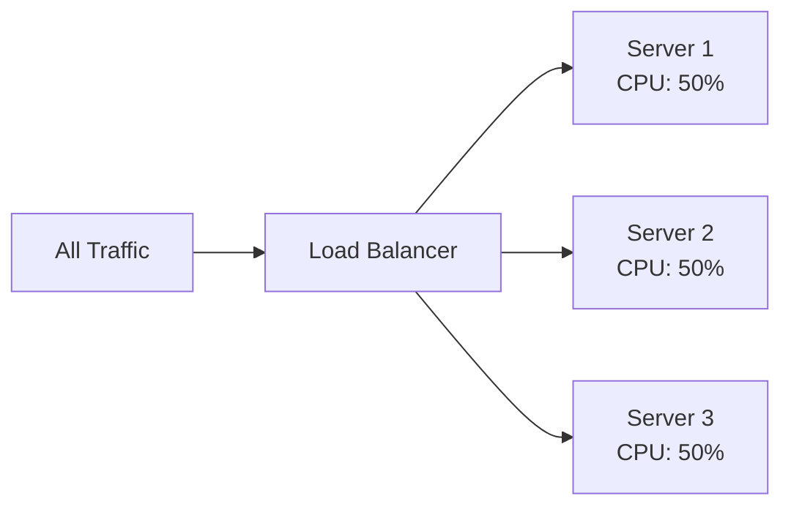
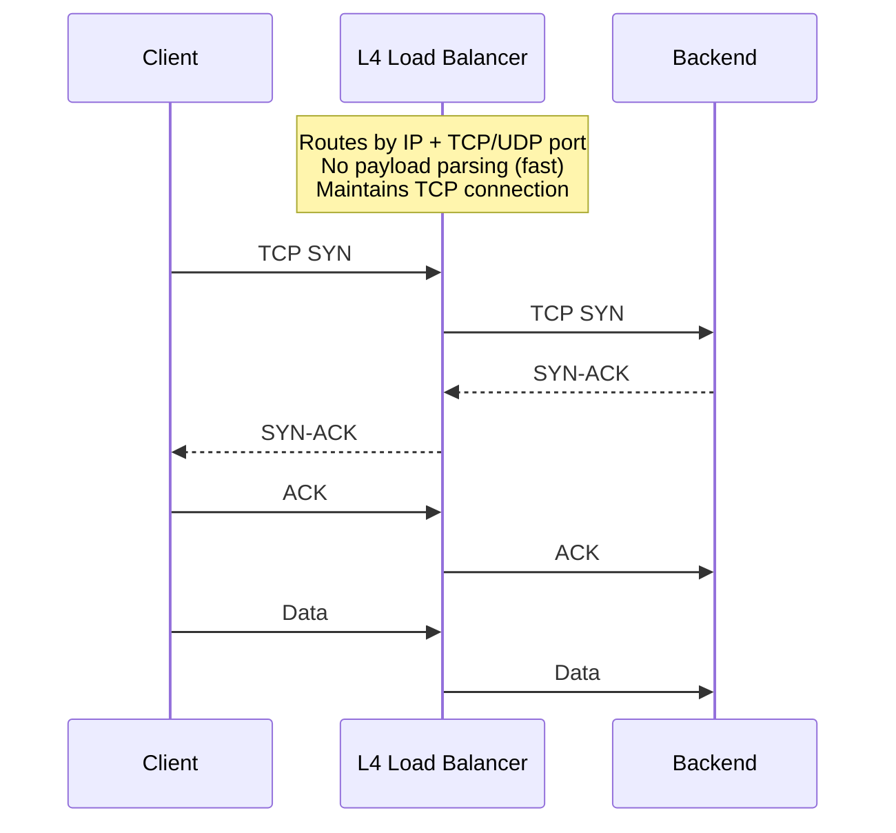
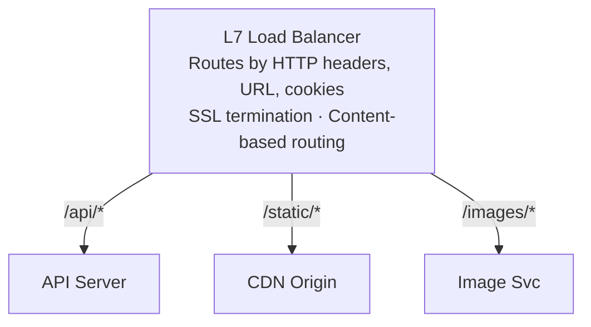
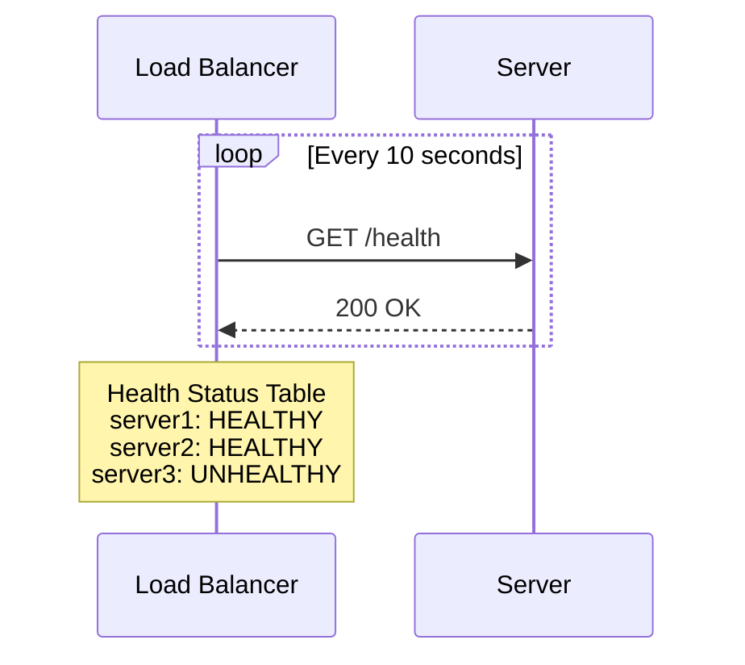
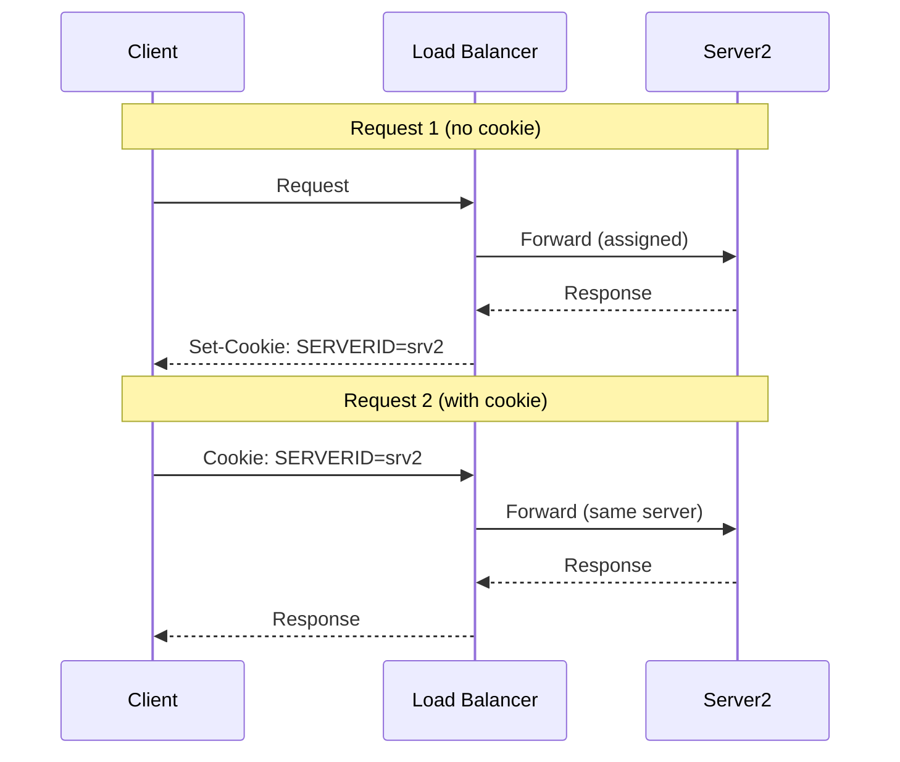
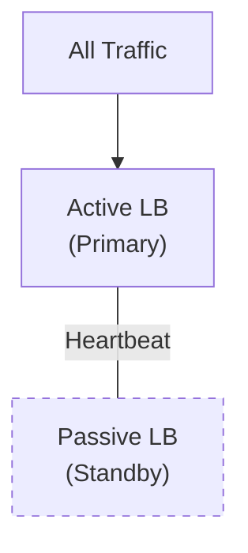
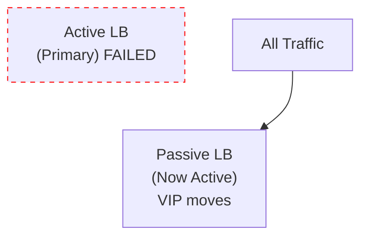
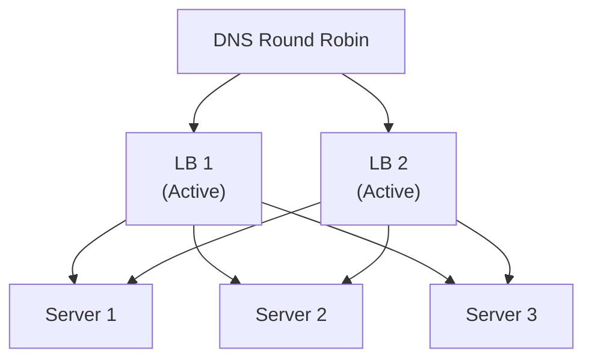
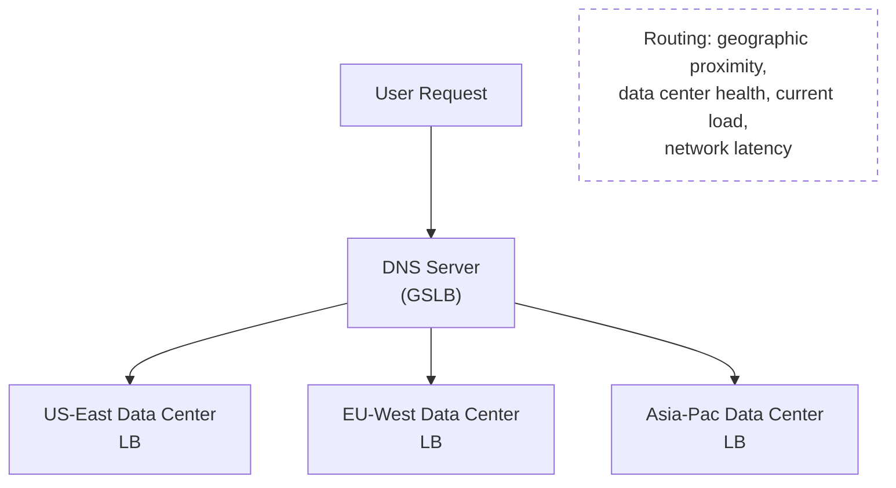

# Load Balancing

## TL;DR

Load balancing distributes incoming traffic across multiple servers to ensure no single server becomes overwhelmed, improving availability, reliability, and response times. Common algorithms include round-robin, least connections, weighted distribution, and consistent hashing.

---

## Why Load Balancing?

Without load balancing:

```
                    ┌─────────────────┐
                    │    Server 1     │
                    │   (overloaded)  │
All Traffic ───────►│   CPU: 100%     │
                    │   Memory: 95%   │
                    └─────────────────┘
                    
                    ┌─────────────────┐
                    │    Server 2     │
                    │     (idle)      │
                    │   CPU: 5%       │
                    └─────────────────┘
```

With load balancing:



---

## Load Balancer Types

### Layer 4 (Transport Layer)



L4 balancing is a *packet* job — per-unit work measured in nanoseconds — which is why production L4 data planes (Google's Maglev, Meta's Katran) are built on kernel bypass or XDP rather than the ordinary socket path; the packet-vs-request distinction and the kernel-path mechanics are in [Network Transport Internals](./14-network-transport-internals.md).

### Layer 7 (Application Layer)



---

## Load Balancing Algorithms

### 1. Round Robin

```nginx
# Round Robin — nginx default when no algorithm directive is specified.
# Requests cycle through the list in order: server1 → server2 → server3 → server1 …
upstream round_robin_backend {
    server server1.example.com:8080;   # receives request 1, 4, 7 …
    server server2.example.com:8080;   # receives request 2, 5, 8 …
    server server3.example.com:8080;   # receives request 3, 6, 9 …
}

server {
    listen 80;

    location / {
        proxy_pass http://round_robin_backend;
    }
}
```

```
Request 1 ──► Server 1
Request 2 ──► Server 2
Request 3 ──► Server 3
Request 4 ──► Server 1  ← cycles back
Request 5 ──► Server 2
```

### 2. Weighted Round Robin

```nginx
# Weighted Round Robin — higher-weight servers receive proportionally more requests.
# With weights 3:1:2, server1 gets 50%, server2 ~17%, server3 ~33% of traffic.
upstream weighted_backend {
    server server1.example.com:8080 weight=3;   # 50% of traffic
    server server2.example.com:8080 weight=1;   # ~17% of traffic
    server server3.example.com:8080 weight=2;   # ~33% of traffic
}

server {
    listen 80;

    location / {
        proxy_pass http://weighted_backend;
    }
}
```

### 3. Least Connections

```nginx
# Least Connections — each new request goes to the server with the fewest
# active connections, adapting naturally to varying request durations.
#
# Visualization:
#   Server 1: [████████░░] 8 connections
#   Server 2: [██░░░░░░░░] 2 connections  ← next request goes here
#   Server 3: [█████░░░░░] 5 connections
upstream least_conn_backend {
    least_conn;

    server server1.example.com:8080;
    server server2.example.com:8080;
    server server3.example.com:8080;
}

server {
    listen 80;

    location / {
        proxy_pass http://least_conn_backend;
    }
}
```

### 4. Weighted Least Connections

```nginx
# Weighted Least Connections — combines least_conn with weight so that
# higher-capacity servers absorb proportionally more connections.
#
# Effective score = active_connections / weight  (lower wins)
# Example:
#   server1 (weight 3): 6 conns → score = 6/3 = 2.0
#   server2 (weight 1): 1 conn  → score = 1/1 = 1.0  ← next request goes here
upstream weighted_least_conn_backend {
    least_conn;

    server server1.example.com:8080 weight=3;
    server server2.example.com:8080 weight=1;
}

server {
    listen 80;

    location / {
        proxy_pass http://weighted_least_conn_backend;
    }
}
```

### 5. IP Hash (Session Persistence)

```nginx
# IP Hash — the client's IP address determines which server receives the
# request, giving sticky-session behaviour without cookies.
# Same IP always routes to the same server:
#   192.168.1.100 → always server2
#   192.168.1.101 → always server1
upstream ip_hash_backend {
    ip_hash;

    server server1.example.com:8080;
    server server2.example.com:8080;
    server server3.example.com:8080;
}

server {
    listen 80;

    location / {
        proxy_pass http://ip_hash_backend;
    }
}
```

### 6. Consistent Hashing

```
Consistent Hashing — Pseudocode

INIT(servers, replicas_per_server = 100):
    ring   ← empty sorted list        # positions on the hash ring (0 … 2^128)
    map    ← empty hash map           # ring position → server

    for each server in servers:
        ADD_SERVER(server)

ADD_SERVER(server):
    for i in 0 .. replicas_per_server:
        pos ← HASH(server + ":" + i)  # e.g. MD5, SHA-256
        INSERT pos into ring (keep sorted)
        map[pos] ← server

REMOVE_SERVER(server):
    for i in 0 .. replicas_per_server:
        pos ← HASH(server + ":" + i)
        DELETE pos from ring
        DELETE map[pos]

GET_SERVER(request_key):
    if ring is empty: return NULL

    pos ← HASH(request_key)
    idx ← first index in ring where ring[idx] >= pos   # binary search
    if idx == length(ring):
        idx ← 0                                        # wrap around
    return map[ring[idx]]

---
Why this matters:
  • Adding/removing a server remaps only ~1/N of keys (N = server count).
  • Virtual replicas (typically 100-200 per server) smooth out distribution.
  • Cannot be expressed as a single nginx directive — real implementations
    live in application code or specialised proxies (e.g. Envoy, Maglev).
```

```
Consistent Hash Ring:
                    0
                    │
           ┌────────┴────────┐
          S3                 S1
         /                    \
        /                      \
      270 ──────────────────── 90
        \                      /
         \                    /
          S2                 S1
           └────────┬────────┘
                    │
                   180

Key "user:123" hashes to position 45 → routes to S1
Key "user:456" hashes to position 200 → routes to S2

When S2 is removed:
- Only keys that were on S2 need to move
- Keys on S1 and S3 stay where they are
```

---

## Health Checks

```nginx
# Nginx — passive health checks (open-source) + active checks (nginx Plus)
upstream healthcheck_backend {
    server server1.example.com:8080 max_fails=3 fail_timeout=30s;
    server server2.example.com:8080 max_fails=3 fail_timeout=30s;
    server server3.example.com:8080 max_fails=3 fail_timeout=30s;
    # max_fails  — consecutive failures before marking the server as down
    # fail_timeout — how long the server stays marked down, and the window
    #                in which max_fails failures must occur
}

server {
    listen 80;

    location / {
        proxy_pass              http://healthcheck_backend;
        proxy_connect_timeout   5s;
        proxy_read_timeout      10s;
        proxy_next_upstream     error timeout http_502 http_503;
        #                       ↑ on failure, retry the next server automatically
    }

    # Self health endpoint (for upstream LBs or orchestrators to probe)
    location = /health {
        access_log off;
        return 200 "healthy\n";
    }
}
```

```haproxy
# HAProxy — active health checks with thresholds
backend app_servers
    balance roundrobin

    option httpchk GET /health          # active probe endpoint
    http-check expect status 200

    default-server inter 10s            # check every 10 s
                    fall  3             # 3 failures → mark DOWN
                    rise  2             # 2 successes → mark UP
                    timeout check 5s    # per-check timeout

    server srv1 192.168.1.10:8080 check
    server srv2 192.168.1.11:8080 check
    server srv3 192.168.1.12:8080 check
```



---

## Session Persistence (Sticky Sessions)

```nginx
# Sticky Sessions — nginx uses a cookie to pin a client to the same backend.
# Option A: ip_hash (no cookie, based on client IP)
upstream sticky_ip {
    ip_hash;

    server server1.example.com:8080;
    server server2.example.com:8080;
    server server3.example.com:8080;
}

# Option B: sticky cookie (nginx Plus — explicit cookie-based affinity)
# upstream sticky_cookie {
#     sticky cookie SERVERID expires=1h path=/;
#
#     server server1.example.com:8080;
#     server server2.example.com:8080;
#     server server3.example.com:8080;
# }

server {
    listen 80;

    location / {
        proxy_pass http://sticky_ip;
    }
}
```

```haproxy
# HAProxy — cookie-based sticky sessions (open-source)
backend sticky_servers
    balance roundrobin

    # Insert a SERVERID cookie; the client sends it back on subsequent requests
    # so HAProxy routes to the same backend.
    cookie SERVERID insert indirect nocache maxlife 1h

    server srv1 192.168.1.10:8080 check cookie srv1
    server srv2 192.168.1.11:8080 check cookie srv2
    server srv3 192.168.1.12:8080 check cookie srv3
```



---

## Load Balancer Architectures

### Active-Passive (Failover)



On failure:



### Active-Active



---

## Global Server Load Balancing (GSLB)



---

## NGINX Load Balancer Configuration

```nginx
# Layer 7 Load Balancing
upstream backend {
    # Least connections algorithm
    least_conn;
    
    # Server definitions with weights
    server backend1.example.com:8080 weight=3;
    server backend2.example.com:8080 weight=2;
    server backend3.example.com:8080 weight=1;
    
    # Backup server (only used when others are down)
    server backup.example.com:8080 backup;
    
    # Health check parameters
    server backend4.example.com:8080 max_fails=3 fail_timeout=30s;
    
    # Keep connections alive to backends
    keepalive 32;
}

server {
    listen 80;
    
    location / {
        proxy_pass http://backend;
        proxy_http_version 1.1;
        proxy_set_header Connection "";
        proxy_set_header Host $host;
        proxy_set_header X-Real-IP $remote_addr;
        proxy_set_header X-Forwarded-For $proxy_add_x_forwarded_for;
        
        # Timeouts
        proxy_connect_timeout 5s;
        proxy_send_timeout 60s;
        proxy_read_timeout 60s;
    }
    
    # Health check endpoint
    location /health {
        access_log off;
        return 200 "healthy\n";
    }
}

# IP Hash for session persistence
upstream sticky_backend {
    ip_hash;
    server backend1.example.com:8080;
    server backend2.example.com:8080;
    server backend3.example.com:8080;
}

# Content-based routing
server {
    listen 80;
    
    location /api/ {
        proxy_pass http://api_servers;
    }
    
    location /static/ {
        proxy_pass http://static_servers;
    }
    
    location /websocket {
        proxy_pass http://ws_servers;
        proxy_http_version 1.1;
        proxy_set_header Upgrade $http_upgrade;
        proxy_set_header Connection "upgrade";
    }
}
```

---

## HAProxy Configuration

```haproxy
global
    maxconn 50000
    log stdout format raw local0

defaults
    mode http
    timeout connect 5s
    timeout client 50s
    timeout server 50s
    option httplog
    option dontlognull

frontend http_front
    bind *:80
    
    # ACLs for content-based routing
    acl is_api path_beg /api
    acl is_static path_beg /static
    
    # Route based on ACLs
    use_backend api_servers if is_api
    use_backend static_servers if is_static
    default_backend web_servers

backend web_servers
    balance roundrobin
    option httpchk GET /health
    http-check expect status 200
    
    server web1 192.168.1.10:8080 check weight 3
    server web2 192.168.1.11:8080 check weight 2
    server web3 192.168.1.12:8080 check weight 1

backend api_servers
    balance leastconn
    option httpchk GET /api/health
    
    # Sticky sessions using cookie
    cookie SERVERID insert indirect nocache
    
    server api1 192.168.1.20:8080 check cookie api1
    server api2 192.168.1.21:8080 check cookie api2

backend static_servers
    balance uri
    hash-type consistent
    
    server static1 192.168.1.30:8080 check
    server static2 192.168.1.31:8080 check

# Statistics page
listen stats
    bind *:8404
    stats enable
    stats uri /stats
    stats refresh 10s
```

---

## AWS Application Load Balancer (ALB)

```python
import boto3

def create_alb():
    elbv2 = boto3.client('elbv2')
    
    # Create load balancer
    alb = elbv2.create_load_balancer(
        Name='my-application-lb',
        Subnets=['subnet-12345', 'subnet-67890'],
        SecurityGroups=['sg-12345'],
        Scheme='internet-facing',
        Type='application',
        IpAddressType='ipv4'
    )
    
    alb_arn = alb['LoadBalancers'][0]['LoadBalancerArn']
    
    # Create target group
    target_group = elbv2.create_target_group(
        Name='my-targets',
        Protocol='HTTP',
        Port=80,
        VpcId='vpc-12345',
        HealthCheckProtocol='HTTP',
        HealthCheckPath='/health',
        HealthCheckIntervalSeconds=30,
        HealthyThresholdCount=2,
        UnhealthyThresholdCount=3,
        TargetType='instance'
    )
    
    tg_arn = target_group['TargetGroups'][0]['TargetGroupArn']
    
    # Register targets
    elbv2.register_targets(
        TargetGroupArn=tg_arn,
        Targets=[
            {'Id': 'i-1234567890abcdef0', 'Port': 80},
            {'Id': 'i-0987654321fedcba0', 'Port': 80}
        ]
    )
    
    # Create listener with rules
    elbv2.create_listener(
        LoadBalancerArn=alb_arn,
        Protocol='HTTPS',
        Port=443,
        Certificates=[
            {'CertificateArn': 'arn:aws:acm:...'}
        ],
        DefaultActions=[
            {'Type': 'forward', 'TargetGroupArn': tg_arn}
        ]
    )
    
    return alb_arn
```

---

## Algorithm Comparison

| Algorithm | Best For | Pros | Cons |
|-----------|----------|------|------|
| Round Robin | Uniform servers | Simple, fair distribution | Ignores server capacity |
| Weighted RR | Mixed capacity | Accounts for server power | Static weights |
| Least Connections | Varying request duration | Adapts to load | More overhead |
| IP Hash | Session persistence | No external session store | Uneven distribution |
| Consistent Hash | Cache servers | Minimal redistribution | Complex implementation |
| Random | Simple scenarios | No state needed | Potentially uneven |

---

## Key Takeaways

1. **Layer 4 vs Layer 7**: Layer 4 is faster but less flexible; Layer 7 enables content-based routing and SSL termination

2. **Algorithm choice matters**: Round-robin for uniform workloads, least-connections for variable request times, consistent hashing for caches

3. **Health checks are critical**: Implement robust health checks with appropriate thresholds to avoid flapping

4. **Session persistence trade-offs**: Sticky sessions simplify stateful apps but can cause uneven load distribution

5. **High availability**: Use active-passive or active-active configurations to eliminate single points of failure

6. **Monitor everything**: Track connection counts, response times, error rates, and server health metrics
