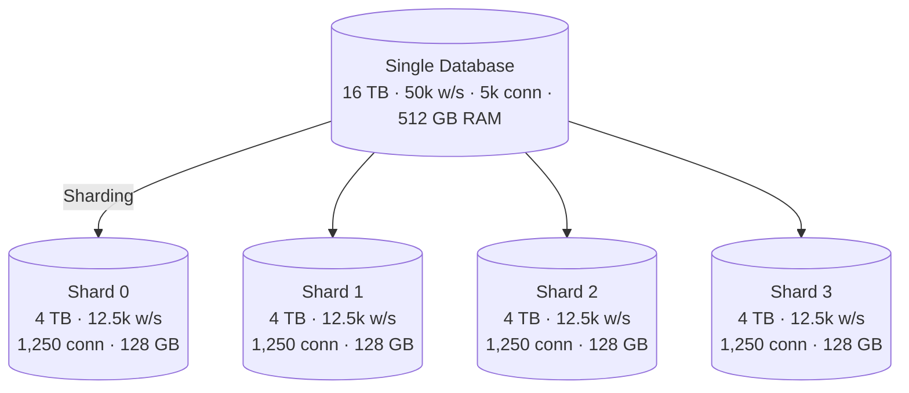
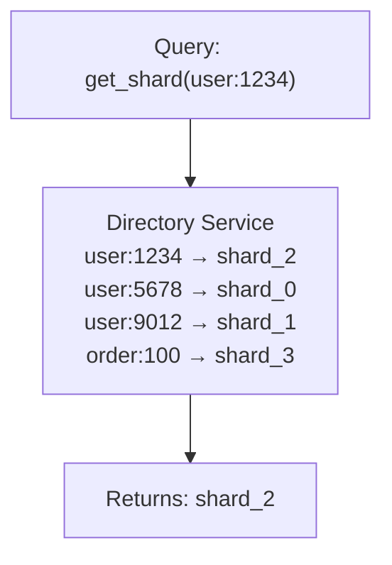
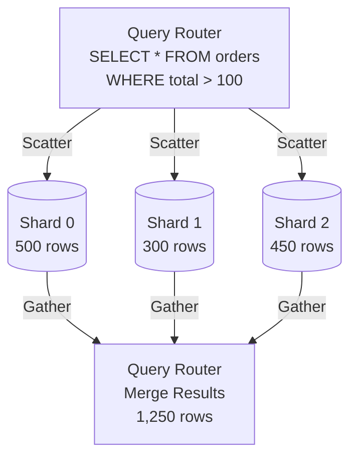
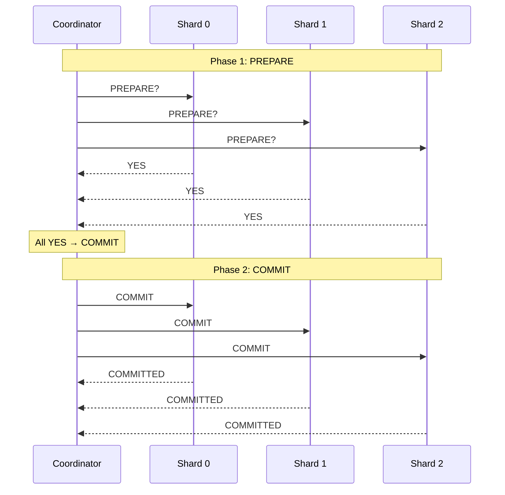
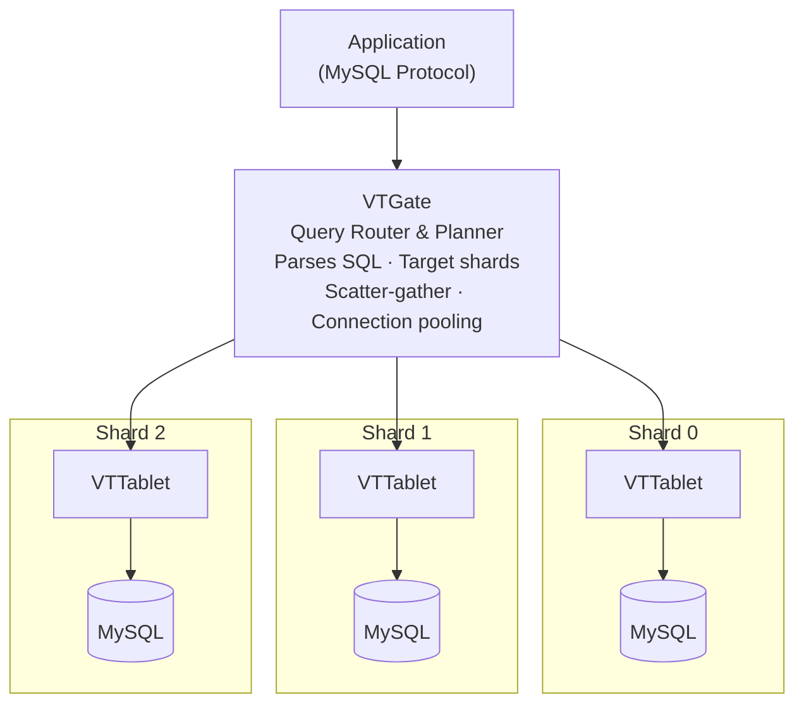

# Database Sharding

## TL;DR

Database sharding horizontally partitions data across multiple database instances (shards), where each shard holds a subset of the total data. This enables write scalability beyond single-server limits but adds complexity around shard key selection, cross-shard queries, and rebalancing.

---

## Why Sharding?

Single database limitations:



---

## Sharding Strategies

### 1. Hash-Based Sharding

```python
import hashlib
from typing import Any

class HashBasedRouter:
    def __init__(self, shard_count: int):
        self.shard_count = shard_count
    
    def get_shard(self, shard_key: Any) -> int:
        """Hash the key to determine shard"""
        key_bytes = str(shard_key).encode()
        hash_value = int(hashlib.md5(key_bytes).hexdigest(), 16)
        return hash_value % self.shard_count
    
    def route_query(self, user_id: int) -> str:
        shard = self.get_shard(user_id)
        return f"shard_{shard}.database.internal"

# Example distribution
router = HashBasedRouter(shard_count=4)
# user_id=1000 → shard_2
# user_id=1001 → shard_0
# user_id=1002 → shard_3
# user_id=1003 → shard_1
```

```
Hash Distribution:

user_id    hash(user_id) % 4    Shard
────────────────────────────────────────
   1            1                  1
   2            2                  2
   3            3                  3
   4            0                  0
   5            1                  1
  ...          ...                ...

┌─────────────────────────────────────────────────────────┐
│                    Hash Function                         │
│                        │                                 │
│    user_id ──────► hash(user_id) % N ──────► shard_id   │
│                                                          │
└─────────────────────────────────────────────────────────┘
```

### 2. Range-Based Sharding

```python
from dataclasses import dataclass
from typing import Optional

@dataclass
class ShardRange:
    shard_id: int
    min_key: int  # inclusive
    max_key: int  # exclusive
    host: str

class RangeBasedRouter:
    def __init__(self):
        self.ranges = [
            ShardRange(0, 0, 1_000_000, "shard0.db.internal"),
            ShardRange(1, 1_000_000, 2_000_000, "shard1.db.internal"),
            ShardRange(2, 2_000_000, 3_000_000, "shard2.db.internal"),
            ShardRange(3, 3_000_000, float('inf'), "shard3.db.internal"),
        ]
    
    def get_shard(self, user_id: int) -> ShardRange:
        for range_info in self.ranges:
            if range_info.min_key <= user_id < range_info.max_key:
                return range_info
        raise ValueError(f"No shard found for user_id: {user_id}")
    
    def split_shard(self, shard_id: int, split_point: int):
        """Split a shard into two when it gets too large"""
        # Find the shard to split
        for i, shard in enumerate(self.ranges):
            if shard.shard_id == shard_id:
                # Create new shard
                new_shard = ShardRange(
                    shard_id=len(self.ranges),
                    min_key=split_point,
                    max_key=shard.max_key,
                    host=f"shard{len(self.ranges)}.db.internal"
                )
                # Update existing shard
                shard.max_key = split_point
                # Insert new shard
                self.ranges.insert(i + 1, new_shard)
                return new_shard
```

```
Range-Based Distribution:

        ┌────────────────────────────────────────────────────────┐
        │                    Key Space                           │
        │   0         1M         2M         3M         4M        │
        │   ├──────────┼──────────┼──────────┼──────────┤        │
        │   │  Shard0  │  Shard1  │  Shard2  │  Shard3  │        │
        │   │ 0-999999 │ 1M-1.99M │ 2M-2.99M │ 3M+      │        │
        └────────────────────────────────────────────────────────┘

Pros: Range queries efficient within shard
Cons: Hot spots if recent data accessed more
      (e.g., recent user_ids all on newest shard)
```

### 3. Directory-Based Sharding

```python
import redis
from typing import Dict

class DirectoryBasedRouter:
    def __init__(self, redis_client: redis.Redis):
        self.directory = redis_client
    
    def get_shard(self, entity_id: str, entity_type: str) -> str:
        """Look up shard location in directory"""
        key = f"shard_directory:{entity_type}:{entity_id}"
        shard = self.directory.get(key)
        
        if shard is None:
            # Assign to shard with least data
            shard = self._assign_new_entity(entity_id, entity_type)
        
        return shard.decode()
    
    def _assign_new_entity(self, entity_id: str, entity_type: str) -> str:
        """Assign entity to least loaded shard"""
        shard_loads = {}
        for i in range(4):
            count = self.directory.get(f"shard_count:{i}") or 0
            shard_loads[f"shard_{i}"] = int(count)
        
        # Pick least loaded shard
        target_shard = min(shard_loads, key=shard_loads.get)
        
        # Record in directory
        key = f"shard_directory:{entity_type}:{entity_id}"
        self.directory.set(key, target_shard)
        self.directory.incr(f"shard_count:{target_shard[-1]}")
        
        return target_shard
    
    def move_entity(self, entity_id: str, entity_type: str, 
                    from_shard: str, to_shard: str):
        """Move entity to different shard (for rebalancing)"""
        key = f"shard_directory:{entity_type}:{entity_id}"
        self.directory.set(key, to_shard)
        self.directory.decr(f"shard_count:{from_shard[-1]}")
        self.directory.incr(f"shard_count:{to_shard[-1]}")
```



Pros: Flexible, can move entities between shards
Cons: Extra lookup latency, directory is SPOF

### 4. Consistent Hashing

```python
import hashlib
from bisect import bisect_left
from collections import defaultdict

class ConsistentHashShardRouter:
    def __init__(self, virtual_nodes: int = 150):
        self.virtual_nodes = virtual_nodes
        self.ring = []
        self.node_map = {}
    
    def _hash(self, key: str) -> int:
        return int(hashlib.sha256(key.encode()).hexdigest(), 16)
    
    def add_shard(self, shard_id: str):
        """Add a shard with virtual nodes"""
        for i in range(self.virtual_nodes):
            virtual_key = f"{shard_id}:vn{i}"
            hash_value = self._hash(virtual_key)
            self.ring.append(hash_value)
            self.node_map[hash_value] = shard_id
        self.ring.sort()
    
    def remove_shard(self, shard_id: str):
        """Remove a shard and its virtual nodes"""
        for i in range(self.virtual_nodes):
            virtual_key = f"{shard_id}:vn{i}"
            hash_value = self._hash(virtual_key)
            self.ring.remove(hash_value)
            del self.node_map[hash_value]
    
    def get_shard(self, key: str) -> str:
        if not self.ring:
            raise ValueError("No shards available")
        
        hash_value = self._hash(key)
        idx = bisect_left(self.ring, hash_value)
        
        if idx >= len(self.ring):
            idx = 0
        
        return self.node_map[self.ring[idx]]
    
    def get_data_movement(self, new_shard: str) -> dict:
        """Calculate what data moves when adding a shard"""
        # Before adding the new shard, calculate which keys
        # would move to the new shard
        movements = defaultdict(list)
        
        for i in range(self.virtual_nodes):
            virtual_key = f"{new_shard}:vn{i}"
            hash_value = self._hash(virtual_key)
            
            # Find which shard currently owns this position
            idx = bisect_left(self.ring, hash_value)
            if idx >= len(self.ring):
                idx = 0
            current_owner = self.node_map[self.ring[idx]]
            
            movements[current_owner].append(hash_value)
        
        return movements
```

```
Consistent Hash Ring:

              0°
              │
     ┌────────┴────────┐
    S3                  S1
     │                   │
90° ─┼───────────────────┼─ 270°
     │                   │
    S2                  S1
     └────────┬────────┘
              │
            180°

Adding Shard S4:
- Only ~25% of data moves (from adjacent shard)
- Other 75% stays in place
```

---

## Shard Key Selection

### Good Shard Keys

```python
# 1. User ID for user-centric data
# - Each user's data on single shard
# - User operations don't cross shards

CREATE TABLE orders (
    order_id BIGINT,
    user_id BIGINT,  -- Shard key
    amount DECIMAL,
    created_at TIMESTAMP,
    PRIMARY KEY (user_id, order_id)
);

# 2. Tenant ID for multi-tenant SaaS
# - Tenant data isolation
# - Easy per-tenant scaling

CREATE TABLE documents (
    doc_id BIGINT,
    tenant_id INT,  -- Shard key
    content TEXT,
    PRIMARY KEY (tenant_id, doc_id)
);

# 3. Geographic region for location-based data
# - Data locality
# - Regulatory compliance

CREATE TABLE transactions (
    txn_id BIGINT,
    region VARCHAR(10),  -- Shard key: 'us-east', 'eu-west'
    user_id BIGINT,
    amount DECIMAL,
    PRIMARY KEY (region, txn_id)
);
```

### Bad Shard Keys

```python
# 1. Auto-incrementing ID (monotonic)
# - All new writes go to same shard
# - Hot spot problem

CREATE TABLE events (
    event_id BIGSERIAL,  # BAD: monotonic
    data JSONB
);

# Problem visualization:
# Time ──────────────────────────────►
# Shard0: [████████] ← Old events (cold)
# Shard1: [████████] ← Old events (cold)
# Shard2: [████████] ← Old events (cold)
# Shard3: [████████████████████████] ← All new events (HOT!)

# 2. Low cardinality keys
# - Limited number of distinct values
# - Can't scale beyond key count

CREATE TABLE orders (
    order_id BIGINT,
    status VARCHAR(20),  # BAD: only ~5 possible values
    data JSONB
);

# 3. Timestamp-based keys
# - Similar to monotonic IDs
# - Recent data all on same shard

CREATE TABLE logs (
    log_time TIMESTAMP,  # BAD: all recent logs on one shard
    message TEXT
);
```

---

## Cross-Shard Operations

### Cross-Shard Queries

```python
import asyncio
from dataclasses import dataclass
from typing import List

@dataclass
class ShardResult:
    shard_id: int
    rows: list
    count: int

class CrossShardQueryExecutor:
    def __init__(self, shard_connections: dict):
        self.shards = shard_connections
    
    async def scatter_gather(self, query: str, params: dict) -> List[ShardResult]:
        """Execute query on all shards and gather results"""
        tasks = []
        for shard_id, conn in self.shards.items():
            task = self._execute_on_shard(shard_id, conn, query, params)
            tasks.append(task)
        
        results = await asyncio.gather(*tasks)
        return results
    
    async def _execute_on_shard(self, shard_id: int, conn, 
                                 query: str, params: dict) -> ShardResult:
        async with conn.execute(query, params) as cursor:
            rows = await cursor.fetchall()
            return ShardResult(
                shard_id=shard_id,
                rows=rows,
                count=len(rows)
            )
    
    async def aggregate_count(self, table: str, 
                               where_clause: str = "") -> int:
        """Count across all shards"""
        query = f"SELECT COUNT(*) FROM {table} {where_clause}"
        results = await self.scatter_gather(query, {})
        return sum(r.rows[0][0] for r in results)
    
    async def global_top_n(self, query: str, order_by: str, 
                           n: int, params: dict) -> list:
        """Get top N across all shards"""
        # Get top N from each shard
        shard_query = f"{query} ORDER BY {order_by} LIMIT {n}"
        results = await self.scatter_gather(shard_query, params)
        
        # Merge and get global top N
        all_rows = []
        for result in results:
            all_rows.extend(result.rows)
        
        # Sort merged results
        all_rows.sort(key=lambda x: x[order_by], reverse=True)
        return all_rows[:n]
```



### Cross-Shard Transactions

```python
from enum import Enum
from typing import List, Dict
import uuid

class TxnState(Enum):
    PENDING = "pending"
    PREPARED = "prepared"
    COMMITTED = "committed"
    ABORTED = "aborted"

class TwoPhaseCommitCoordinator:
    def __init__(self, shards: Dict[int, 'ShardConnection']):
        self.shards = shards
        self.transactions = {}
    
    async def begin_transaction(self) -> str:
        txn_id = str(uuid.uuid4())
        self.transactions[txn_id] = {
            'state': TxnState.PENDING,
            'participants': set(),
            'prepared': set()
        }
        return txn_id
    
    async def execute(self, txn_id: str, shard_id: int, 
                      query: str, params: dict):
        """Execute query as part of distributed transaction"""
        self.transactions[txn_id]['participants'].add(shard_id)
        await self.shards[shard_id].execute(txn_id, query, params)
    
    async def commit(self, txn_id: str) -> bool:
        """Two-phase commit"""
        txn = self.transactions[txn_id]
        participants = txn['participants']
        
        # Phase 1: Prepare
        prepare_results = []
        for shard_id in participants:
            result = await self.shards[shard_id].prepare(txn_id)
            prepare_results.append((shard_id, result))
        
        # Check if all prepared successfully
        all_prepared = all(result for _, result in prepare_results)
        
        if all_prepared:
            # Phase 2: Commit
            txn['state'] = TxnState.PREPARED
            for shard_id in participants:
                await self.shards[shard_id].commit(txn_id)
            txn['state'] = TxnState.COMMITTED
            return True
        else:
            # Phase 2: Abort
            for shard_id in participants:
                await self.shards[shard_id].rollback(txn_id)
            txn['state'] = TxnState.ABORTED
            return False
```



---

## Resharding (Adding/Removing Shards)

```python
import asyncio
from enum import Enum

class ReshardingState(Enum):
    IDLE = "idle"
    COPYING = "copying"
    CATCHING_UP = "catching_up"
    SWITCHING = "switching"
    COMPLETE = "complete"

class OnlineResharder:
    def __init__(self, source_shards: list, target_shards: list):
        self.source = source_shards
        self.target = target_shards
        self.state = ReshardingState.IDLE
        self.new_router = None
    
    async def expand_shards(self, old_count: int, new_count: int):
        """Double-write approach for online resharding"""
        
        # Step 1: Set up new shards
        self.state = ReshardingState.COPYING
        self.new_router = ConsistentHashShardRouter()
        for i in range(new_count):
            self.new_router.add_shard(f"shard_{i}")
        
        # Step 2: Enable double-writes
        # (Write to both old and new shard locations)
        await self._enable_double_writes()
        
        # Step 3: Background copy existing data
        await self._copy_existing_data()
        
        # Step 4: Catch up on writes during copy
        self.state = ReshardingState.CATCHING_UP
        await self._replay_write_log()
        
        # Step 5: Atomic switch to new routing
        self.state = ReshardingState.SWITCHING
        await self._atomic_switch()
        
        # Step 6: Clean up old shard data
        self.state = ReshardingState.COMPLETE
        await self._cleanup_old_data()
    
    async def _copy_existing_data(self):
        """Copy data to new shard locations"""
        for source_shard in self.source:
            async for batch in source_shard.scan_all_data(batch_size=1000):
                for row in batch:
                    # Determine new shard location
                    new_shard = self.new_router.get_shard(row['shard_key'])
                    if new_shard != row['current_shard']:
                        # Copy to new location
                        await new_shard.insert(row)
    
    async def _enable_double_writes(self):
        """Route writes to both old and new shard locations"""
        # Implemented at application layer or proxy layer
        pass
```

```
Online Resharding Timeline:

Time ──────────────────────────────────────────────────────►

Phase 1: Double-Write Enabled
┌──────────────────────────────────────────────────────────┐
│ Write ──► Old Shard                                      │
│       └─► New Shard (new location)                       │
│                                                          │
│ Read ───► Old Shard (still primary)                      │
└──────────────────────────────────────────────────────────┘

Phase 2: Background Copy
┌──────────────────────────────────────────────────────────┐
│ Existing Data ════════════════════════► New Shards       │
│                    (batch copy)                          │
│                                                          │
│ New Writes still double-written                          │
└──────────────────────────────────────────────────────────┘

Phase 3: Catch-up
┌──────────────────────────────────────────────────────────┐
│ Replay writes that happened during copy                  │
│ Wait for replication lag → 0                             │
└──────────────────────────────────────────────────────────┘

Phase 4: Switch
┌──────────────────────────────────────────────────────────┐
│ Read/Write ──► New Shards (atomic flip)                  │
│                                                          │
│ Old shards: read-only, then decommission                 │
└──────────────────────────────────────────────────────────┘
```

---

## Application-Level Sharding

```python
from functools import wraps
from typing import Callable

class ShardedRepository:
    def __init__(self, shard_router: 'ShardRouter', 
                 shard_connections: dict):
        self.router = shard_router
        self.connections = shard_connections
    
    def _get_connection(self, shard_key):
        shard = self.router.get_shard(shard_key)
        return self.connections[shard]
    
    # User operations - sharded by user_id
    async def get_user(self, user_id: int) -> dict:
        conn = self._get_connection(user_id)
        return await conn.fetchone(
            "SELECT * FROM users WHERE id = $1", user_id
        )
    
    async def create_order(self, user_id: int, order_data: dict) -> int:
        conn = self._get_connection(user_id)
        return await conn.execute(
            """
            INSERT INTO orders (user_id, amount, status)
            VALUES ($1, $2, $3) RETURNING id
            """,
            user_id, order_data['amount'], 'pending'
        )
    
    async def get_user_orders(self, user_id: int) -> list:
        # Same shard as user - efficient
        conn = self._get_connection(user_id)
        return await conn.fetch(
            "SELECT * FROM orders WHERE user_id = $1", user_id
        )
    
    async def get_all_orders_by_date(self, date: str) -> list:
        # Cross-shard query - scatter/gather
        results = []
        for shard, conn in self.connections.items():
            shard_results = await conn.fetch(
                "SELECT * FROM orders WHERE DATE(created_at) = $1",
                date
            )
            results.extend(shard_results)
        return results

# Decorator for automatic sharding
def sharded(shard_key_param: str):
    def decorator(func: Callable):
        @wraps(func)
        async def wrapper(self, *args, **kwargs):
            shard_key = kwargs.get(shard_key_param) or args[0]
            conn = self._get_connection(shard_key)
            return await func(self, conn, *args, **kwargs)
        return wrapper
    return decorator

class OrderService:
    def __init__(self, shard_router, connections):
        self.router = shard_router
        self.connections = connections
    
    def _get_connection(self, shard_key):
        shard = self.router.get_shard(shard_key)
        return self.connections[shard]
    
    @sharded('user_id')
    async def place_order(self, conn, user_id: int, items: list):
        # conn is automatically the correct shard connection
        return await conn.execute(...)
```

---

## Vitess: MySQL Sharding

```yaml
# Vitess VSchema (sharding configuration)
{
  "sharded": true,
  "vindexes": {
    "user_hash": {
      "type": "hash"
    },
    "order_user_id": {
      "type": "consistent_lookup",
      "params": {
        "table": "user_order_idx",
        "from": "order_id",
        "to": "user_id"
      }
    }
  },
  "tables": {
    "users": {
      "column_vindexes": [
        {
          "column": "id",
          "name": "user_hash"
        }
      ]
    },
    "orders": {
      "column_vindexes": [
        {
          "column": "user_id",
          "name": "user_hash"
        },
        {
          "column": "order_id",
          "name": "order_user_id"
        }
      ]
    }
  }
}
```



---

## Comparison of Sharding Strategies

| Strategy | Pros | Cons | Best For |
|----------|------|------|----------|
| Hash | Even distribution | Range queries hit all shards | Random access patterns |
| Range | Range queries efficient | Hot spots on recent data | Time-series with range queries |
| Directory | Flexible, can rebalance | Extra lookup, SPOF | Complex routing rules |
| Consistent Hash | Minimal data movement | Complex implementation | Dynamic shard count |

---

## Key Takeaways

1. **Choose shard key carefully**: High cardinality, even distribution, query-aligned—changing shard keys later is extremely difficult

2. **Avoid cross-shard operations**: Design schema so common queries stay within a single shard

3. **Plan for resharding**: Eventually you'll need to add shards; design for online resharding from day one

4. **Test at scale**: Sharding bugs often only appear at scale; test with production-like data volumes

5. **Consider alternatives first**: Read replicas, caching, and vertical scaling are simpler—shard only when necessary

6. **Tooling matters**: Use proven sharding solutions (Vitess, Citus, ProxySQL) rather than building from scratch

7. **Monitor shard balance**: Regularly check for hot shards and data skew
