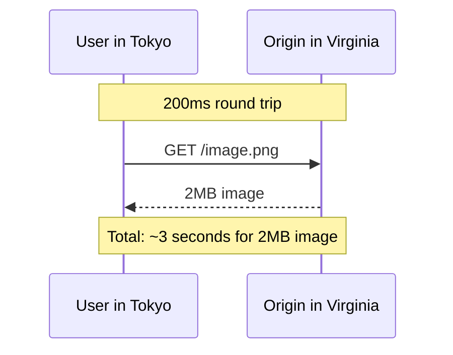
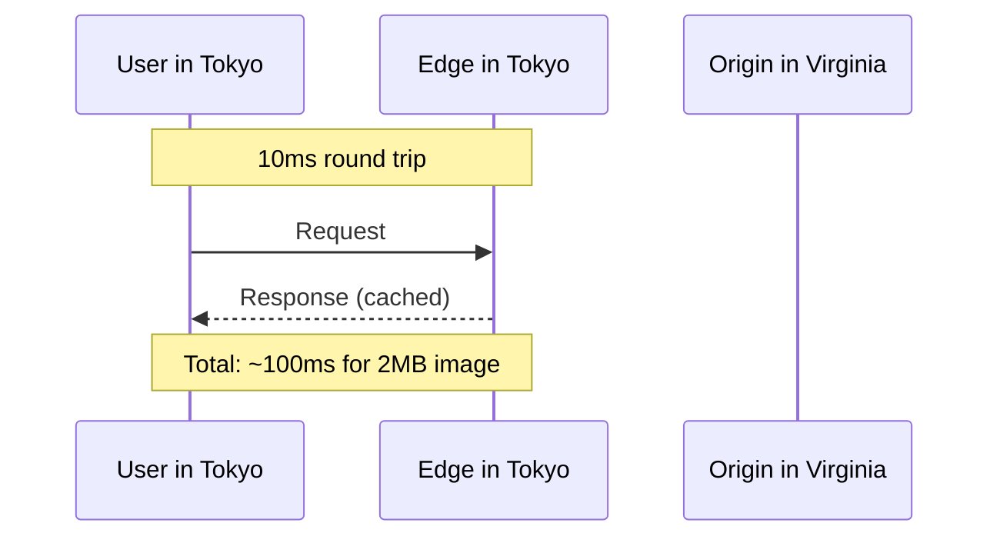
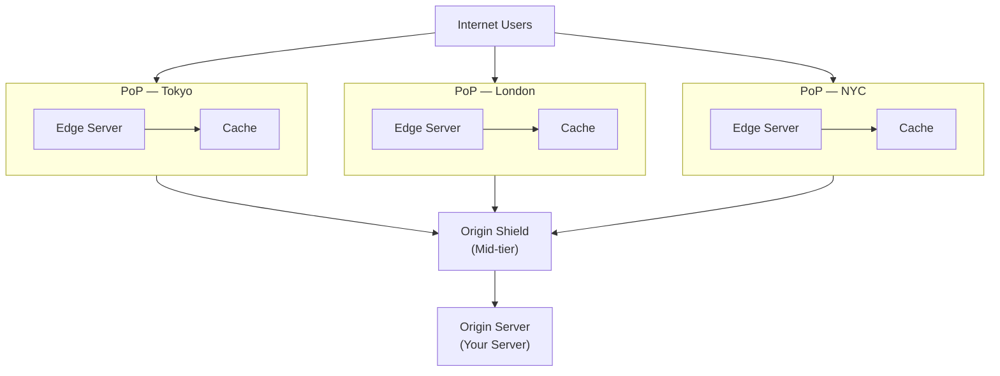
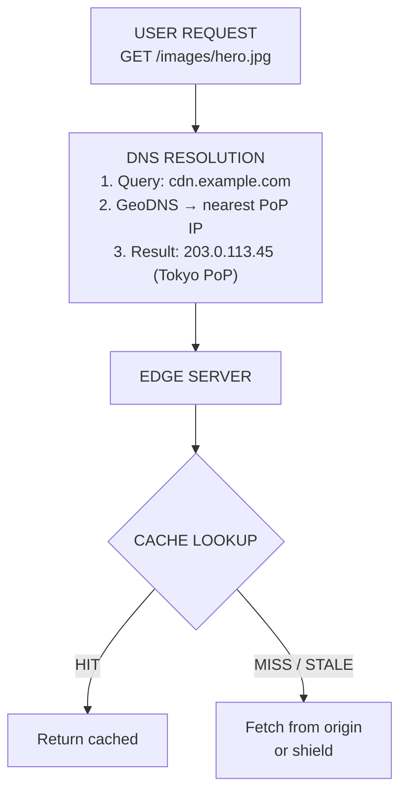
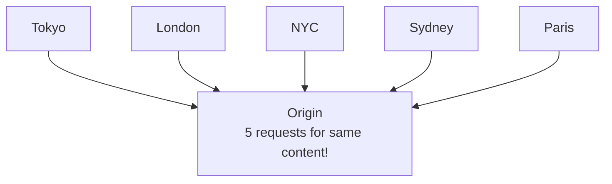
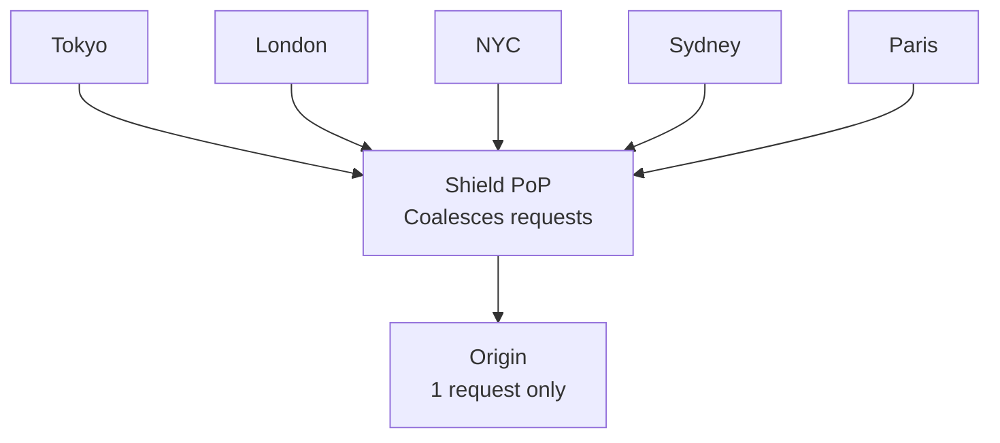
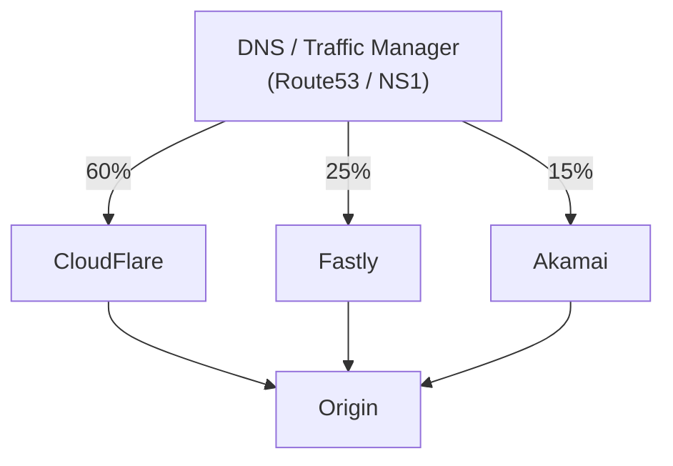

# CDN Architecture

## TL;DR

A Content Delivery Network (CDN) distributes content across geographically dispersed edge servers, caching static and dynamic content close to users. This reduces latency, offloads origin servers, and improves availability. Modern CDNs also provide edge computing, security features, and real-time optimization.

---

## Why CDN?

Without CDN:



With CDN:



---

## CDN Architecture Overview



PoP = Point of Presence

---

## CDN Request Flow

```nginx
# Edge server configuration with caching and origin fetch
# Defines a shared memory cache zone: 10MB key space, 10GB storage, inactive eviction at 60m
proxy_cache_path /var/cache/nginx/cdn
                 levels=1:2                # Two-level directory hash for cache files
                 keys_zone=cdn_cache:10m   # 10MB shared memory for cache keys
                 max_size=10g              # Maximum disk space for cached responses
                 inactive=60m              # Evict entries not accessed in 60 minutes
                 use_temp_path=off;        # Write directly to cache dir (avoid extra copy)

server {
    listen 443 ssl http2;
    server_name cdn.example.com;

    # Activate the cache zone defined above
    proxy_cache cdn_cache;

    # Cache key: scheme + host + URI covers most variations
    proxy_cache_key "$scheme$host$request_uri";

    # Forward requests to the origin server on cache MISS or STALE
    location / {
        proxy_pass https://origin.example.com;

        # TTL rules by upstream status code
        proxy_cache_valid 200 302  10m;   # Cache successful responses for 10 minutes
        proxy_cache_valid 301      1h;    # Permanent redirects cached longer
        proxy_cache_valid 404      1m;    # Cache 404s briefly to protect origin

        # Bypass cache when client sends Cache-Control: no-cache
        proxy_cache_bypass $http_cache_control;

        # Serve stale content while revalidating in the background
        proxy_cache_use_stale error timeout updating
                              http_500 http_502 http_503 http_504;
        proxy_cache_background_update on;

        # Collapse concurrent requests for the same uncached resource into one origin fetch
        proxy_cache_lock on;
        proxy_cache_lock_timeout 5s;

        # Expose cache status to the client via response header
        add_header X-Cache-Status $upstream_cache_status always;
        add_header X-Edge-Location "Tokyo" always;
    }
}
```

Cache status values returned by `$upstream_cache_status`:

| Header value | Meaning |
|---|---|
| `HIT` | Served from cache |
| `MISS` | Not in cache, fetched from origin |
| `STALE` | Expired entry served while revalidating |
| `BYPASS` | Cache skipped (e.g., `Cache-Control: no-cache`) |
| `REVALIDATED` | Confirmed fresh with origin via conditional request |

```bash
# Cache HIT — asset served from the edge, 120 seconds old
$ curl -I https://cdn.example.com/images/hero.jpg
HTTP/2 200
content-type: image/jpeg
cache-control: public, max-age=600
age: 120
x-cache-status: HIT
x-edge-location: Tokyo

# Cache MISS — first request, fetched from origin
$ curl -I https://cdn.example.com/images/new-banner.jpg
HTTP/2 200
content-type: image/jpeg
cache-control: public, max-age=600
age: 0
x-cache-status: MISS
x-edge-location: Tokyo

# Cache BYPASS — client explicitly skipped cache
$ curl -I -H "Cache-Control: no-cache" https://cdn.example.com/images/hero.jpg
HTTP/2 200
content-type: image/jpeg
cache-control: public, max-age=600
age: 0
x-cache-status: BYPASS
x-edge-location: Tokyo
```



---

## Caching Strategies

### Cache-Control Headers

```nginx
server {
    listen 443 ssl http2;
    server_name cdn.example.com;

    # ── Static assets: immutable, cache for 1 year ─────────────────────
    # Versioned filenames (app.a1b2c3.js) make long TTLs safe.
    location ~* \.(js|css|png|jpg|jpeg|gif|ico|svg|woff2?)$ {
        proxy_pass https://origin.example.com;
        proxy_cache cdn_cache;
        proxy_cache_valid 200 365d;

        # public          → allow CDN and browser caching
        # max-age=31536000 → 1 year in seconds
        # immutable       → tell browsers: never revalidate
        add_header Cache-Control "public, max-age=31536000, immutable" always;
    }

    # ── API responses: short CDN TTL + stale fallbacks ─────────────────
    # s-maxage overrides max-age for shared caches (CDN) only.
    # stale-while-revalidate lets the CDN serve stale while refreshing.
    # stale-if-error serves stale if origin returns 5xx.
    location /api/ {
        proxy_pass https://origin.example.com;
        proxy_cache cdn_cache;
        proxy_cache_valid 200 60s;

        add_header Cache-Control "public, s-maxage=60, stale-while-revalidate=300, stale-if-error=86400" always;

        # nginx equivalent of stale-if-error: serve stale on upstream failures
        proxy_cache_use_stale error timeout http_500 http_502 http_503 http_504;
        proxy_cache_background_update on;   # revalidate in background (stale-while-revalidate)
    }

    # ── User-specific data: never cache on CDN ─────────────────────────
    # private  → only the end-user's browser may cache
    # no-store → CDN must not store a copy at all
    location /api/me {
        proxy_pass https://origin.example.com;
        proxy_no_cache 1;        # do not write to cache
        proxy_cache_bypass 1;    # do not read from cache

        add_header Cache-Control "private, no-store, max-age=0" always;
    }
}
```

```bash
# Verify Cache-Control headers for each content type

# Static asset — long-lived, immutable
$ curl -I https://cdn.example.com/static/app.a1b2c3.js
HTTP/2 200
content-type: application/javascript
cache-control: public, max-age=31536000, immutable
x-cache-status: HIT
age: 8640

# API response — short CDN TTL with stale fallbacks
$ curl -I https://cdn.example.com/api/products
HTTP/2 200
content-type: application/json
cache-control: public, s-maxage=60, stale-while-revalidate=300, stale-if-error=86400
x-cache-status: HIT
age: 45

# User-specific data — private, never cached by CDN
$ curl -I -H "Authorization: Bearer tok_xxx" https://cdn.example.com/api/me
HTTP/2 200
content-type: application/json
cache-control: private, no-store, max-age=0
x-cache-status: BYPASS
```

### Cache Key Design

```nginx
# Cache key design — include request variations so different
# representations get their own cache entry.

# Default cache key uses scheme + host + URI
proxy_cache_key "$scheme$host$request_uri";

location ~* \.(jpg|png|webp)$ {
    proxy_pass https://origin.example.com;
    proxy_cache cdn_cache;
    proxy_cache_valid 200 1h;

    # ── Vary by Accept header (WebP vs JPEG) ──────────────────────
    # Origin sends `Vary: Accept` so the CDN stores one entry per
    # Accept value. Extend the cache key to match.
    proxy_cache_key "$scheme$host$request_uri$http_accept";

    # ── Vary by device pixel ratio and width query param ──────────
    # For responsive images, include DPR header and width param
    # so each device resolution gets its own cached variant.
    proxy_cache_key "$scheme$host$request_uri|Accept=$http_accept|DPR=$http_dpr|width=$arg_width";

    # Pass variation headers upstream so origin can respond correctly
    proxy_set_header Accept $http_accept;
    proxy_set_header DPR $http_dpr;
}
```

```bash
# Two requests for the same image produce different cache entries:

# WebP-capable browser at 2x resolution
$ curl -I -H "Accept: image/webp" -H "DPR: 2" "https://cdn.example.com/images/hero.jpg?width=800"
HTTP/2 200
content-type: image/webp
vary: Accept, DPR
x-cache-status: MISS
# Cache key: "https|cdn.example.com|/images/hero.jpg?width=800|Accept=image/webp|DPR=2|width=800"

# JPEG-only browser at 1x resolution
$ curl -I -H "Accept: image/jpeg" -H "DPR: 1" "https://cdn.example.com/images/hero.jpg?width=400"
HTTP/2 200
content-type: image/jpeg
vary: Accept, DPR
x-cache-status: MISS
# Cache key: "https|cdn.example.com|/images/hero.jpg?width=400|Accept=image/jpeg|DPR=1|width=400"
```

---

## Origin Shield

Without Shield (Origin receives N requests per cache miss):



With Shield (Origin receives 1 request per cache miss):



```nginx
# Origin Shield configuration
# The shield is a mid-tier nginx proxy that sits between edge PoPs and the origin.
# It coalesces concurrent requests for the same resource so the origin sees only one.

proxy_cache_path /var/cache/nginx/shield
                 levels=1:2
                 keys_zone=shield_cache:20m    # Larger key zone — aggregates all edge traffic
                 max_size=50g
                 inactive=24h                  # Keep entries longer than edge caches
                 use_temp_path=off;

server {
    listen 443 ssl http2;
    server_name shield.internal.example.com;

    proxy_cache shield_cache;
    proxy_cache_key "$scheme$host$request_uri";

    location / {
        proxy_pass https://origin.example.com;

        # Cache durations mirror edge, but shield holds entries longer
        proxy_cache_valid 200 302  30m;
        proxy_cache_valid 301      6h;
        proxy_cache_valid 404      5m;

        # ── Request coalescing ────────────────────────────────────
        # proxy_cache_lock ensures only ONE request per cache key
        # reaches the origin. All other concurrent requests wait for
        # the first to complete, then share its cached response.
        proxy_cache_lock on;
        proxy_cache_lock_age 10s;      # Max time to wait before sending another request
        proxy_cache_lock_timeout 15s;  # Max time a waiting request will block

        # Serve stale on origin failure — shield is the last line of defense
        proxy_cache_use_stale error timeout updating
                              http_500 http_502 http_503 http_504;
        proxy_cache_background_update on;

        add_header X-Shield-Cache $upstream_cache_status always;
    }
}
```

```bash
# Edge servers point to the shield instead of directly to origin:
# (in edge server config)
#   proxy_pass https://shield.internal.example.com;

# First edge request — shield fetches from origin (MISS)
$ curl -sI https://cdn.example.com/images/hero.jpg | grep -i x-
x-cache-status: MISS
x-shield-cache: MISS

# Second edge request from a different PoP — shield serves cached (HIT)
$ curl -sI https://cdn.example.com/images/hero.jpg | grep -i x-
x-cache-status: MISS
x-shield-cache: HIT
# Origin received only 1 request even though 2 PoPs asked
```

---

## Cache Invalidation

### Purge by URL

```bash
# ── Purge specific URLs ───────────────────────────────────────────────
$ curl -X POST "https://api.cloudflare.com/client/v4/zones/${ZONE_ID}/purge_cache" \
  -H "Authorization: Bearer ${CF_API_TOKEN}" \
  -H "Content-Type: application/json" \
  -d '{"files": [
    "https://cdn.example.com/images/hero.jpg",
    "https://cdn.example.com/css/main.css"
  ]}'
# {"success": true, "result": {"id": "abc123..."}}

# ── Purge by URL prefix ──────────────────────────────────────────────
$ curl -X POST "https://api.cloudflare.com/client/v4/zones/${ZONE_ID}/purge_cache" \
  -H "Authorization: Bearer ${CF_API_TOKEN}" \
  -H "Content-Type: application/json" \
  -d '{"prefixes": ["https://cdn.example.com/images/"]}'

# ── Purge by cache tag (most efficient — surgical invalidation) ──────
# Origin sets: Cache-Tag: product-123, category-electronics
$ curl -X POST "https://api.cloudflare.com/client/v4/zones/${ZONE_ID}/purge_cache" \
  -H "Authorization: Bearer ${CF_API_TOKEN}" \
  -H "Content-Type: application/json" \
  -d '{"tags": ["product-123"]}'
# Invalidates all pages tagged with product-123, leaves everything else intact

# ── Nuclear option — purge everything ────────────────────────────────
$ curl -X POST "https://api.cloudflare.com/client/v4/zones/${ZONE_ID}/purge_cache" \
  -H "Authorization: Bearer ${CF_API_TOKEN}" \
  -H "Content-Type: application/json" \
  -d '{"purge_everything": true}'
```

```nginx
# Origin server: attach cache tags to responses so purges can target them
location /products/ {
    proxy_pass http://backend;

    # Tag every product page with its product ID and category.
    # When product-123 changes, purge the "product-123" tag
    # instead of listing every URL that includes it.
    add_header Cache-Tag "product-$arg_id, category-$arg_cat" always;
    add_header Cache-Control "public, s-maxage=3600" always;
}
```

### Cache Versioning (URL-based invalidation)

```nginx
# Cache versioning via content-hashed filenames
# Build tools (webpack, vite) produce filenames like app.a1b2c3d4.js.
# When the file changes, the hash changes → new URL → automatic cache bust.

# Match versioned static assets (contain a hash segment in the filename)
location ~* \.(js|css)$ {
    proxy_pass https://origin.example.com;
    proxy_cache cdn_cache;

    # Safe to cache for 1 year because the filename itself changes on update
    proxy_cache_valid 200 365d;
    add_header Cache-Control "public, max-age=31536000, immutable" always;
}

# Strip query-string version params so old ?v= patterns still get cached
# consistently — the filename hash is the canonical version key.
location ~* ^/static/ {
    proxy_pass https://origin.example.com;
    proxy_cache cdn_cache;
    proxy_cache_valid 200 365d;

    # Ignore ?v= query strings in cache key — filename hash is sufficient
    proxy_cache_key "$scheme$host$uri";

    add_header Cache-Control "public, max-age=31536000, immutable" always;
}
```

```bash
# In HTML templates:
#   <script src="/static/app.a1b2c3d4.js"></script>
#
# When app.js changes, the build produces app.ef56gh78.js — a brand-new URL.
# The old cached entry expires naturally; no purge needed.

$ curl -I https://cdn.example.com/static/app.a1b2c3d4.js
HTTP/2 200
content-type: application/javascript
cache-control: public, max-age=31536000, immutable
x-cache-status: HIT
age: 259200
```

---

## Edge Computing

```nginx
# ── A/B testing at the edge ───────────────────────────────────────────
# Route users to variant a or b based on a cookie.
# Sticky: once assigned, the cookie keeps the user on the same variant.

map $cookie_variant $ab_variant {
    "b"       "b";           # Existing cookie → honour it
    default   "a";           # No cookie → default to variant a
}

server {
    listen 443 ssl http2;
    server_name cdn.example.com;

    location / {
        # Rewrite request path to /<variant>/original/path before forwarding
        rewrite ^(.*)$ /$ab_variant$1 break;
        proxy_pass https://origin.example.com;

        # Tag the response so downstream can see which variant was served
        add_header X-Variant $ab_variant always;

        # Set the variant cookie if the client doesn't already have one
        # (nginx evaluates $cookie_variant from the request)
        if ($cookie_variant = "") {
            add_header Set-Cookie "variant=$ab_variant; Max-Age=86400; Path=/" always;
        }
    }
}

# ── Geolocation-based origin routing ──────────────────────────────────
# Use the GeoIP2 module to select the closest origin.

map $geoip2_data_country_code $geo_origin {
    CN    "apac-origin.example.com";
    HK    "apac-origin.example.com";
    TW    "apac-origin.example.com";
    DE    "eu-origin.example.com";
    FR    "eu-origin.example.com";
    GB    "eu-origin.example.com";
    default "us-origin.example.com";
}

server {
    listen 443 ssl http2;
    server_name cdn-geo.example.com;

    # ── Bot detection — return lightweight response for crawlers ──────
    location / {
        if ($http_user_agent ~* "(Googlebot|Bingbot|curl|wget)") {
            # Serve a pre-rendered or stripped-down page for bots
            rewrite ^ /bot-render$request_uri break;
        }

        proxy_pass https://$geo_origin;
        proxy_set_header Host $host;
    }

    # ── Image optimization — serve correct format & size at the edge ──
    location ~* \.(jpg|png|webp)$ {
        proxy_pass https://$geo_origin;
        proxy_cache cdn_cache;
        proxy_cache_valid 200 1h;

        # Vary cache by Accept (WebP support) and DPR (pixel density)
        proxy_cache_key "$scheme$host$request_uri|$http_accept|$http_dpr";

        # Pass client hints to the image-resizing origin
        proxy_set_header Accept $http_accept;
        proxy_set_header DPR    $http_dpr;
        proxy_set_header Width  $arg_width;
    }
}
```

```bash
# Verify A/B variant assignment
$ curl -I https://cdn.example.com/landing
HTTP/2 200
x-variant: a
set-cookie: variant=a; Max-Age=86400; Path=/

# Subsequent request with cookie — same variant, no new cookie
$ curl -I -b "variant=a" https://cdn.example.com/landing
HTTP/2 200
x-variant: a

# Geo-routed request — origin selected by country
$ curl -I https://cdn-geo.example.com/products
HTTP/2 200
x-cache-status: MISS
# Request forwarded to eu-origin.example.com (based on client IP in GB)
```

---

## Multi-CDN Architecture



```nginx
# Multi-CDN routing via nginx as a traffic-splitting load balancer.
# Weighted upstreams distribute traffic across CDN providers.
# Health checks automatically remove unhealthy providers.

upstream cdn_backends {
    # ── Weighted traffic split ────────────────────────────────────
    # CloudFlare: 60%, Fastly: 25%, Akamai: 15%
    server cf.example.com      weight=60;
    server fastly.example.com  weight=25;
    server akamai.example.com  weight=15;

    # ── Health checks (nginx Plus / OpenResty) ────────────────────
    # Probe each backend every 10s; mark as down after 3 failures;
    # re-enable after 2 consecutive successes.
    # Traffic auto-redistributes among healthy backends.
    health_check interval=10 fails=3 passes=2 uri=/health;

    # ── Failover ──────────────────────────────────────────────────
    # If the selected backend fails, retry on the next one
    # (up to 2 retries before returning an error to the client).
}

server {
    listen 443 ssl http2;
    server_name www.example.com;

    location / {
        proxy_pass https://cdn_backends;
        proxy_set_header Host $host;

        # Retry on the next upstream if the chosen one fails
        proxy_next_upstream error timeout http_502 http_503 http_504;
        proxy_next_upstream_tries 2;        # Max 2 failover attempts
        proxy_next_upstream_timeout 5s;     # Time budget for retries

        # Pass the selected backend name for observability
        add_header X-CDN-Backend $upstream_addr always;
    }
}
```

```bash
# Verify weighted routing — repeated requests hit different backends
$ for i in $(seq 1 5); do
    curl -sI https://www.example.com/ | grep x-cdn-backend
  done
x-cdn-backend: 104.16.132.229:443     # CloudFlare
x-cdn-backend: 104.16.132.229:443     # CloudFlare
x-cdn-backend: 151.101.1.57:443       # Fastly
x-cdn-backend: 104.16.132.229:443     # CloudFlare
x-cdn-backend: 23.215.0.136:443       # Akamai

# When a backend goes down, health checks remove it automatically.
# All traffic redistributes among remaining healthy providers.
```

---

## Performance Metrics

```nginx
# ── nginx logging for CDN metrics ─────────────────────────────────────
# Custom log format capturing cache status, latency, and upstream timing.
# Feed these logs into Prometheus/Grafana or any log aggregator.

log_format cdn_metrics
    '$remote_addr - [$time_local] '
    '"$request" $status $body_bytes_sent '
    'cache=$upstream_cache_status '          # HIT, MISS, BYPASS, etc.
    'edge_time=${request_time}s '            # Total time at edge
    'origin_time=${upstream_response_time}s ' # Time waiting on origin
    'bytes_sent=$bytes_sent';

access_log /var/log/nginx/cdn_access.log cdn_metrics;
```

```bash
# ── Collect metrics via Cloudflare API ────────────────────────────────

# Cache hit ratio, bandwidth, error rates (last 1 hour)
$ curl -s "https://api.cloudflare.com/client/v4/zones/${ZONE_ID}/analytics/dashboard?since=-60" \
  -H "Authorization: Bearer ${CF_API_TOKEN}" | jq '.result.totals'
{
  "requests": {
    "all": 1250000,
    "cached": 1137500,       # 91% cache hit ratio  (target: >90%)
    "uncached": 112500
  },
  "bandwidth": {
    "all": 52428800000,      # ~52 GB total
    "cached": 47185920000,   # ~47 GB served from cache
    "uncached": 5242880000   # ~5 GB pulled from origin
  },
  "threats": { "all": 342 },
  "pageViews": { "all": 890000 },
  "uniques": { "all": 245000 }
}

# ── Latency percentiles via curl timing ───────────────────────────────
# Measure real edge latency from the client's perspective.
$ curl -o /dev/null -s -w "\
  dns:       %{time_namelookup}s\n\
  connect:   %{time_connect}s\n\
  ttfb:      %{time_starttransfer}s\n\
  total:     %{time_total}s\n\
  http_code: %{http_code}\n" \
  https://cdn.example.com/images/hero.jpg
  dns:       0.012s
  connect:   0.025s
  ttfb:      0.038s          # Time to first byte — edge latency (target: <50ms)
  total:     0.052s
  http_code: 200

# ── Cost savings calculation ──────────────────────────────────────────
# With 91% cache hit ratio and $0.09/GB origin egress:
#   Bandwidth saved:  47 GB × $0.09 = $4.23/hour saved
#   Origin load:      reduced to 9% of total traffic
#   Effective origin capacity: 1 / (1 - 0.91) ≈ 11× multiplier
```

Key metrics and targets:

| Metric | Target | How to measure |
|---|---|---|
| Cache hit ratio | > 90% | `$upstream_cache_status` in logs or CDN analytics API |
| Edge latency p50 | < 50ms | `curl -w '%{time_starttransfer}'` or RUM |
| Edge latency p99 | < 200ms | Log percentiles from `$request_time` |
| Error rate (4xx) | < 1% | `$status` in nginx logs |
| Error rate (5xx) | < 0.1% | `$status` in nginx logs + CDN dashboard |

---

## CDN Provider Comparison

| Feature | CloudFlare | Fastly | Akamai | AWS CloudFront |
|---------|------------|--------|--------|----------------|
| Global PoPs | 285+ | 80+ | 4000+ | 450+ |
| Edge Compute | Workers | Compute@Edge | EdgeWorkers | Lambda@Edge |
| Instant Purge | Yes | Yes (<150ms) | No (~5s) | Yes (~1min) |
| Free Tier | Generous | Limited | No | Limited |
| WebSocket | Yes | Yes | Yes | Yes |
| Real-time logs | Yes | Yes | Yes | Yes |

---

## Key Takeaways

1. **Cache everything possible**: Static assets, API responses, HTML pages—the more you cache, the better performance and lower costs

2. **Use appropriate TTLs**: Long TTLs (1 year) for versioned static assets; short TTLs with stale-while-revalidate for dynamic content

3. **Implement cache tags**: Enable surgical purging without purging unrelated content

4. **Deploy origin shield**: Reduces origin load dramatically, especially for cache misses across multiple PoPs

5. **Consider multi-CDN**: Critical for high-availability; use active-active or failover configurations

6. **Leverage edge computing**: Move logic closer to users for authentication, A/B testing, personalization

7. **Monitor cache hit ratio**: Aim for >90%; investigate patterns causing cache misses
