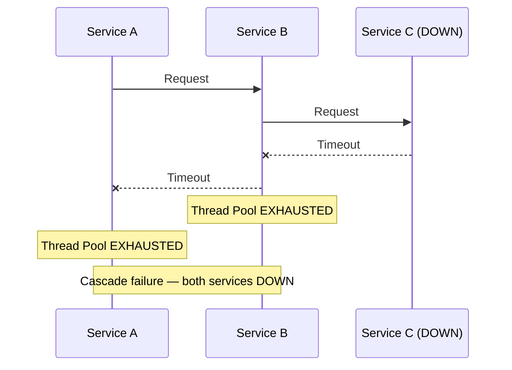
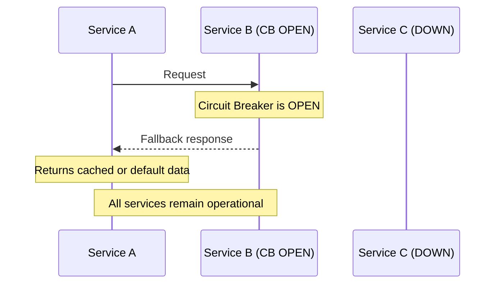
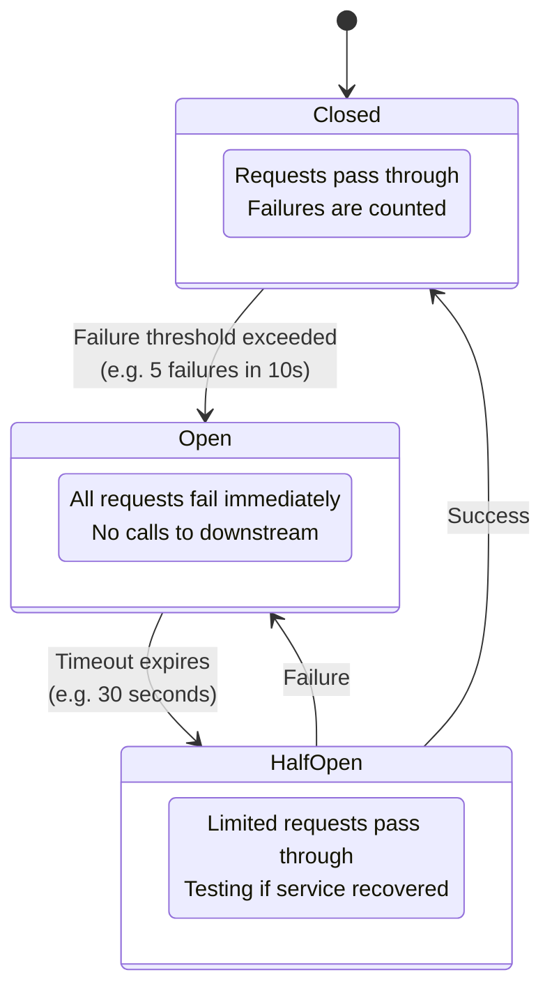
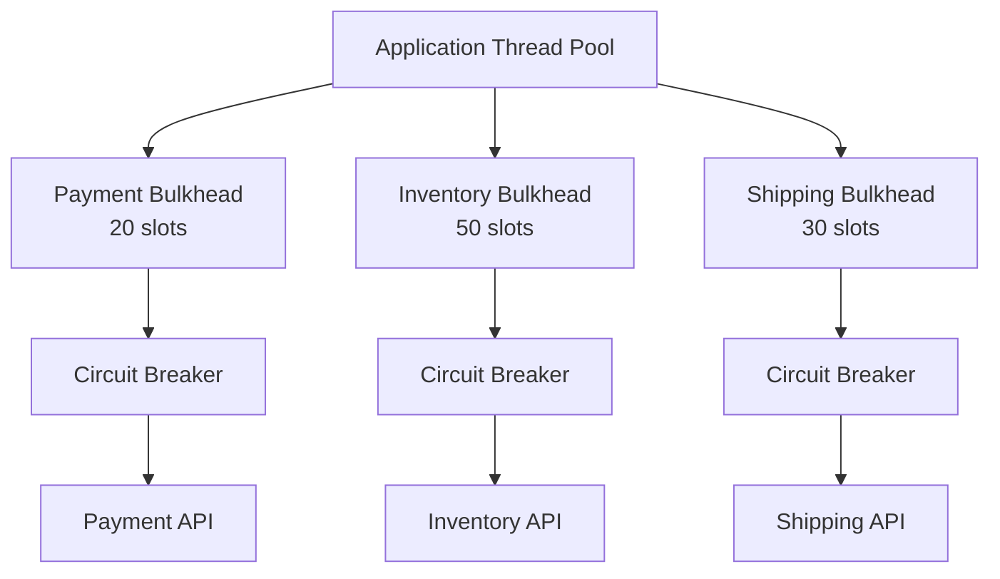

# Circuit Breakers

## TL;DR

A circuit breaker prevents cascading failures in distributed systems by monitoring calls to external services and "opening" the circuit when failure rates exceed a threshold. When open, requests fail immediately without attempting the downstream call, giving the failing service time to recover. After a timeout, the circuit moves to "half-open" to test if the service has recovered.

---

## Why Circuit Breakers?

Without circuit breaker:



With circuit breaker:



---

## Circuit Breaker States



---

## Basic Implementation

```go
package circuitbreaker

import (
	"bytes"
	"encoding/json"
	"errors"
	"fmt"
	"io"
	"net/http"
	"sync"
	"time"
)

// CircuitState represents the state of a circuit breaker.
type CircuitState int

const (
	StateClosed   CircuitState = iota // Normal operation
	StateOpen                         // Failing fast
	StateHalfOpen                     // Testing recovery
)

func (s CircuitState) String() string {
	switch s {
	case StateClosed:
		return "closed"
	case StateOpen:
		return "open"
	case StateHalfOpen:
		return "half_open"
	default:
		return "unknown"
	}
}

// CircuitBreakerConfig holds tunable parameters.
type CircuitBreakerConfig struct {
	FailureThreshold int           // Failures before opening (default 5)
	SuccessThreshold int           // Successes to close from half-open (default 3)
	Timeout          time.Duration // Duration before trying half-open (default 30s)
	HalfOpenMaxCalls int           // Max calls in half-open state (default 3)
}

// DefaultConfig returns a config with sensible defaults.
func DefaultConfig() CircuitBreakerConfig {
	return CircuitBreakerConfig{
		FailureThreshold: 5,
		SuccessThreshold: 3,
		Timeout:          30 * time.Second,
		HalfOpenMaxCalls: 3,
	}
}

// ErrCircuitBreakerOpen is returned when the circuit is open.
type ErrCircuitBreakerOpen struct {
	CircuitName string
	RetryAfter  time.Duration
}

func (e *ErrCircuitBreakerOpen) Error() string {
	return fmt.Sprintf("circuit '%s' is open. Retry after %s", e.CircuitName, e.RetryAfter)
}

// CircuitBreaker tracks failures and controls access to a downstream service.
type CircuitBreaker struct {
	Name            string
	Config          CircuitBreakerConfig
	state           CircuitState
	failureCount    int
	successCount    int
	lastFailureTime time.Time
	halfOpenCalls   int
	mu              sync.Mutex
}

// NewCircuitBreaker creates a circuit breaker with the given config.
func NewCircuitBreaker(name string, cfg CircuitBreakerConfig) *CircuitBreaker {
	return &CircuitBreaker{
		Name:   name,
		Config: cfg,
		state:  StateClosed,
	}
}

func (cb *CircuitBreaker) shouldAttemptReset() bool {
	if cb.lastFailureTime.IsZero() {
		return false
	}
	return time.Since(cb.lastFailureTime) >= cb.Config.Timeout
}

func (cb *CircuitBreaker) handleSuccess() {
	cb.mu.Lock()
	defer cb.mu.Unlock()
	switch cb.state {
	case StateHalfOpen:
		cb.successCount++
		if cb.successCount >= cb.Config.SuccessThreshold {
			cb.close()
		}
	case StateClosed:
		cb.failureCount = 0
	}
}

func (cb *CircuitBreaker) handleFailure() {
	cb.mu.Lock()
	defer cb.mu.Unlock()
	cb.lastFailureTime = time.Now()
	switch cb.state {
	case StateHalfOpen:
		cb.open()
	case StateClosed:
		cb.failureCount++
		if cb.failureCount >= cb.Config.FailureThreshold {
			cb.open()
		}
	}
}

func (cb *CircuitBreaker) open() {
	cb.state = StateOpen
	cb.successCount = 0
	cb.halfOpenCalls = 0
	fmt.Printf("Circuit '%s' OPENED\n", cb.Name)
}

func (cb *CircuitBreaker) close() {
	cb.state = StateClosed
	cb.failureCount = 0
	cb.successCount = 0
	cb.halfOpenCalls = 0
	fmt.Printf("Circuit '%s' CLOSED\n", cb.Name)
}

func (cb *CircuitBreaker) halfOpen() {
	cb.state = StateHalfOpen
	cb.halfOpenCalls = 0
	cb.successCount = 0
	fmt.Printf("Circuit '%s' HALF-OPEN\n", cb.Name)
}

// CanExecute checks whether a request is allowed to proceed.
func (cb *CircuitBreaker) CanExecute() bool {
	cb.mu.Lock()
	defer cb.mu.Unlock()
	switch cb.state {
	case StateClosed:
		return true
	case StateOpen:
		if cb.shouldAttemptReset() {
			cb.halfOpen()
			return true
		}
		return false
	default: // StateHalfOpen
		if cb.halfOpenCalls < cb.Config.HalfOpenMaxCalls {
			cb.halfOpenCalls++
			return true
		}
		return false
	}
}

// Execute runs fn under circuit breaker protection.
func (cb *CircuitBreaker) Execute(fn func() (any, error)) (any, error) {
	if !cb.CanExecute() {
		retryAfter := cb.Config.Timeout - time.Since(cb.lastFailureTime)
		if retryAfter < 0 {
			retryAfter = 0
		}
		return nil, &ErrCircuitBreakerOpen{CircuitName: cb.Name, RetryAfter: retryAfter}
	}

	result, err := fn()
	if err != nil {
		cb.handleFailure()
		return nil, err
	}
	cb.handleSuccess()
	return result, nil
}

// Example usage
func callPaymentService(orderID string) (any, error) {
	cb := NewCircuitBreaker("payment_service", CircuitBreakerConfig{
		FailureThreshold: 3,
		SuccessThreshold: 3,
		Timeout:          60 * time.Second,
		HalfOpenMaxCalls: 3,
	})

	return cb.Execute(func() (any, error) {
		body, _ := json.Marshal(map[string]string{"order_id": orderID})
		resp, err := http.Post(
			"https://payment.example.com/charge",
			"application/json",
			bytes.NewReader(body),
		)
		if err != nil {
			return nil, err
		}
		defer resp.Body.Close()
		if resp.StatusCode >= 400 {
			return nil, errors.New("payment service returned error")
		}
		var result map[string]any
		data, _ := io.ReadAll(resp.Body)
		json.Unmarshal(data, &result)
		return result, nil
	})
}
```

---

## Advanced Circuit Breaker with Metrics

```go
package circuitbreaker

import (
	"fmt"
	"sync"
	"time"
)

// CallMetrics records a single call's outcome.
type CallMetrics struct {
	Timestamp  time.Time
	Success    bool
	DurationMs float64
	ErrorType  string
}

// CircuitBreakerStats exposes aggregate statistics.
type CircuitBreakerStats struct {
	TotalCalls           int
	SuccessfulCalls      int
	FailedCalls          int
	RejectedCalls        int
	AverageResponseTimeMs float64
	ErrorPercentage      float64
	State                CircuitState
	LastStateChange      time.Time
}

// SlidingWindowCircuitBreaker uses a sliding window for failure detection.
type SlidingWindowCircuitBreaker struct {
	Name                    string
	WindowSize              int
	FailureRateThreshold    float64
	SlowCallThresholdMs     float64
	SlowCallRateThreshold   float64
	WaitDuration            time.Duration
	PermittedCallsInHalfOpen int

	state            CircuitState
	metrics          []CallMetrics // bounded to WindowSize
	halfOpenCalls    int
	halfOpenSuccesses int
	openedAt         time.Time
	mu               sync.Mutex

	stats CircuitBreakerStats
}

// NewSlidingWindowCircuitBreaker creates a sliding-window circuit breaker.
func NewSlidingWindowCircuitBreaker(name string) *SlidingWindowCircuitBreaker {
	return &SlidingWindowCircuitBreaker{
		Name:                     name,
		WindowSize:               10,
		FailureRateThreshold:     0.5,
		SlowCallThresholdMs:      5000,
		SlowCallRateThreshold:    0.5,
		WaitDuration:             30 * time.Second,
		PermittedCallsInHalfOpen: 3,
		state:                    StateClosed,
	}
}

func (sw *SlidingWindowCircuitBreaker) appendMetric(m CallMetrics) {
	sw.metrics = append(sw.metrics, m)
	if len(sw.metrics) > sw.WindowSize {
		sw.metrics = sw.metrics[len(sw.metrics)-sw.WindowSize:]
	}
}

func (sw *SlidingWindowCircuitBreaker) calculateFailureRate() float64 {
	if len(sw.metrics) < sw.WindowSize {
		return 0.0
	}
	failures := 0
	for _, m := range sw.metrics {
		if !m.Success {
			failures++
		}
	}
	return float64(failures) / float64(len(sw.metrics))
}

func (sw *SlidingWindowCircuitBreaker) calculateSlowCallRate() float64 {
	if len(sw.metrics) < sw.WindowSize {
		return 0.0
	}
	slow := 0
	for _, m := range sw.metrics {
		if m.DurationMs > sw.SlowCallThresholdMs {
			slow++
		}
	}
	return float64(slow) / float64(len(sw.metrics))
}

func (sw *SlidingWindowCircuitBreaker) shouldOpen() bool {
	return sw.calculateFailureRate() >= sw.FailureRateThreshold ||
		sw.calculateSlowCallRate() >= sw.SlowCallRateThreshold
}

func (sw *SlidingWindowCircuitBreaker) transitionToOpen() {
	sw.state = StateOpen
	sw.openedAt = time.Now()
	sw.stats.LastStateChange = time.Now()
	sw.notifyStateChange(StateOpen)
}

func (sw *SlidingWindowCircuitBreaker) transitionToHalfOpen() {
	sw.state = StateHalfOpen
	sw.halfOpenCalls = 0
	sw.halfOpenSuccesses = 0
	sw.stats.LastStateChange = time.Now()
	sw.notifyStateChange(StateHalfOpen)
}

func (sw *SlidingWindowCircuitBreaker) transitionToClosed() {
	sw.state = StateClosed
	sw.metrics = sw.metrics[:0]
	sw.stats.LastStateChange = time.Now()
	sw.notifyStateChange(StateClosed)
}

func (sw *SlidingWindowCircuitBreaker) notifyStateChange(newState CircuitState) {
	fmt.Printf("Circuit breaker '%s' transitioned to %s\n", sw.Name, newState)
}

// RecordSuccess records a successful call.
func (sw *SlidingWindowCircuitBreaker) RecordSuccess(durationMs float64) {
	sw.mu.Lock()
	defer sw.mu.Unlock()

	sw.appendMetric(CallMetrics{
		Timestamp:  time.Now(),
		Success:    true,
		DurationMs: durationMs,
	})
	sw.stats.TotalCalls++
	sw.stats.SuccessfulCalls++

	if sw.state == StateHalfOpen {
		sw.halfOpenSuccesses++
		if sw.halfOpenSuccesses >= sw.PermittedCallsInHalfOpen {
			sw.transitionToClosed()
		}
	}
}

// RecordFailure records a failed call.
func (sw *SlidingWindowCircuitBreaker) RecordFailure(durationMs float64, errorType string) {
	sw.mu.Lock()
	defer sw.mu.Unlock()

	sw.appendMetric(CallMetrics{
		Timestamp:  time.Now(),
		Success:    false,
		DurationMs: durationMs,
		ErrorType:  errorType,
	})
	sw.stats.TotalCalls++
	sw.stats.FailedCalls++

	if sw.state == StateHalfOpen {
		sw.transitionToOpen()
	} else if sw.state == StateClosed {
		if sw.shouldOpen() {
			sw.transitionToOpen()
		}
	}
}

// AllowRequest checks whether a new request is permitted.
func (sw *SlidingWindowCircuitBreaker) AllowRequest() bool {
	sw.mu.Lock()
	defer sw.mu.Unlock()

	switch sw.state {
	case StateClosed:
		return true
	case StateOpen:
		if time.Since(sw.openedAt) >= sw.WaitDuration {
			sw.transitionToHalfOpen()
			sw.halfOpenCalls = 1
			return true
		}
		sw.stats.RejectedCalls++
		return false
	default: // StateHalfOpen
		if sw.halfOpenCalls < sw.PermittedCallsInHalfOpen {
			sw.halfOpenCalls++
			return true
		}
		sw.stats.RejectedCalls++
		return false
	}
}

// GetStats returns a snapshot of circuit breaker statistics.
func (sw *SlidingWindowCircuitBreaker) GetStats() CircuitBreakerStats {
	sw.mu.Lock()
	defer sw.mu.Unlock()

	s := CircuitBreakerStats{
		TotalCalls:      sw.stats.TotalCalls,
		SuccessfulCalls: sw.stats.SuccessfulCalls,
		FailedCalls:     sw.stats.FailedCalls,
		RejectedCalls:   sw.stats.RejectedCalls,
		ErrorPercentage: sw.calculateFailureRate() * 100,
		State:           sw.state,
		LastStateChange: sw.stats.LastStateChange,
	}

	if len(sw.metrics) > 0 {
		var total float64
		for _, m := range sw.metrics {
			total += m.DurationMs
		}
		s.AverageResponseTimeMs = total / float64(len(sw.metrics))
	}

	return s
}
```

---

## Circuit Breaker with Fallback

```go
package circuitbreaker

import (
	"errors"
	"fmt"
	"sync"
	"time"
)

var (
	ErrFallbackFailed      = errors.New("both primary and fallback failed")
	ErrCacheMiss           = errors.New("no cached value")
	ErrServiceUnavailable  = errors.New("service unavailable")
)

// CallFunc is a function that performs the actual call.
type CallFunc func(args ...any) (any, error)

// CircuitBreakerWithFallback wraps a primary call with a fallback.
type CircuitBreakerWithFallback struct {
	Name     string
	primary  CallFunc
	fallback CallFunc
	circuit  *SlidingWindowCircuitBreaker
}

// NewCircuitBreakerWithFallback creates a circuit breaker with a fallback strategy.
func NewCircuitBreakerWithFallback(name string, primary, fallback CallFunc) *CircuitBreakerWithFallback {
	return &CircuitBreakerWithFallback{
		Name:     name,
		primary:  primary,
		fallback: fallback,
		circuit:  NewSlidingWindowCircuitBreaker(name),
	}
}

// Call executes the primary function; falls back on circuit-open or error.
func (cb *CircuitBreakerWithFallback) Call(args ...any) (any, error) {
	if !cb.circuit.AllowRequest() {
		return cb.executeFallback(args...)
	}

	start := time.Now()
	result, err := cb.primary(args...)
	durationMs := float64(time.Since(start).Milliseconds())

	if err != nil {
		cb.circuit.RecordFailure(durationMs, err.Error())
		return cb.executeFallback(args...)
	}
	cb.circuit.RecordSuccess(durationMs)
	return result, nil
}

func (cb *CircuitBreakerWithFallback) executeFallback(args ...any) (any, error) {
	result, err := cb.fallback(args...)
	if err != nil {
		return nil, fmt.Errorf("%w: %s: %v", ErrFallbackFailed, cb.Name, err)
	}
	return result, nil
}

// --- Fallback strategies ---

// CachedFallback returns a cached value looked up by keyFunc.
func CachedFallback(cache *sync.Map, keyFunc func(args ...any) string) CallFunc {
	return func(args ...any) (any, error) {
		key := keyFunc(args...)
		if val, ok := cache.Load(key); ok {
			return val, nil
		}
		return nil, fmt.Errorf("%w for key %s", ErrCacheMiss, key)
	}
}

// DefaultFallback always returns the provided default value.
func DefaultFallback(value any) CallFunc {
	return func(args ...any) (any, error) {
		return value, nil
	}
}

// FailFallback always returns an error.
func FailFallback() CallFunc {
	return func(args ...any) (any, error) {
		return nil, ErrServiceUnavailable
	}
}

// QueueForLaterFallback enqueues the request for later processing.
func QueueForLaterFallback(enqueue func(item any)) CallFunc {
	return func(args ...any) (any, error) {
		enqueue(map[string]any{
			"args":      args,
			"timestamp": time.Now().Unix(),
		})
		return map[string]string{
			"status":  "queued",
			"message": "Request queued for processing",
		}, nil
	}
}

// Usage example
func exampleUsage() {
	// Product service with cache fallback
	var productCache sync.Map
	productService := NewCircuitBreakerWithFallback(
		"product_service",
		func(args ...any) (any, error) {
			productID := args[0].(string)
			return fetchProductFromAPI(productID)
		},
		CachedFallback(&productCache, func(args ...any) string {
			return fmt.Sprintf("product:%s", args[0])
		}),
	)
	_, _ = productService.Call("prod-123")

	// Recommendation service with default fallback
	recommendationService := NewCircuitBreakerWithFallback(
		"recommendations",
		func(args ...any) (any, error) {
			userID := args[0].(string)
			return getPersonalizedRecommendations(userID)
		},
		DefaultFallback([]map[string]any{
			{"id": 1, "name": "Popular Item 1"},
			{"id": 2, "name": "Popular Item 2"},
		}),
	)
	_, _ = recommendationService.Call("user-456")
}
```

---

## Circuit Breaker Registry

```go
package circuitbreaker

import (
	"encoding/json"
	"net/http"
	"sync"
	"time"
)

// CircuitBreakerRegistry provides centralized management of circuit breakers.
// Uses sync.Once for thread-safe singleton initialization.
type CircuitBreakerRegistry struct {
	breakers map[string]*SlidingWindowCircuitBreaker
	mu       sync.RWMutex
}

var (
	registryInstance *CircuitBreakerRegistry
	registryOnce     sync.Once
)

// GetRegistry returns the singleton registry instance.
func GetRegistry() *CircuitBreakerRegistry {
	registryOnce.Do(func() {
		registryInstance = &CircuitBreakerRegistry{
			breakers: make(map[string]*SlidingWindowCircuitBreaker),
		}
	})
	return registryInstance
}

// Register creates or returns an existing circuit breaker by name.
func (r *CircuitBreakerRegistry) Register(name string) *SlidingWindowCircuitBreaker {
	r.mu.Lock()
	defer r.mu.Unlock()

	if cb, ok := r.breakers[name]; ok {
		return cb
	}
	cb := NewSlidingWindowCircuitBreaker(name)
	r.breakers[name] = cb
	return cb
}

// Get returns a circuit breaker by name, or nil if not found.
func (r *CircuitBreakerRegistry) Get(name string) *SlidingWindowCircuitBreaker {
	r.mu.RLock()
	defer r.mu.RUnlock()
	return r.breakers[name]
}

// GetAllStats returns stats for every registered circuit breaker.
func (r *CircuitBreakerRegistry) GetAllStats() map[string]CircuitBreakerStats {
	r.mu.RLock()
	defer r.mu.RUnlock()

	stats := make(map[string]CircuitBreakerStats, len(r.breakers))
	for name, cb := range r.breakers {
		stats[name] = cb.GetStats()
	}
	return stats
}

// ResetAll transitions every circuit breaker to closed.
func (r *CircuitBreakerRegistry) ResetAll() {
	r.mu.RLock()
	defer r.mu.RUnlock()
	for _, cb := range r.breakers {
		cb.mu.Lock()
		cb.transitionToClosed()
		cb.mu.Unlock()
	}
}

// ForceOpen forces a named circuit breaker to the open state.
func (r *CircuitBreakerRegistry) ForceOpen(name string) {
	r.mu.RLock()
	cb := r.breakers[name]
	r.mu.RUnlock()
	if cb != nil {
		cb.mu.Lock()
		cb.transitionToOpen()
		cb.mu.Unlock()
	}
}

// ForceClose forces a named circuit breaker to the closed state.
func (r *CircuitBreakerRegistry) ForceClose(name string) {
	r.mu.RLock()
	cb := r.breakers[name]
	r.mu.RUnlock()
	if cb != nil {
		cb.mu.Lock()
		cb.transitionToClosed()
		cb.mu.Unlock()
	}
}

// WithCircuitBreaker wraps a function with circuit breaker protection from the registry.
func WithCircuitBreaker(name string, fn func() (any, error)) (any, error) {
	registry := GetRegistry()
	breaker := registry.Register(name)

	if !breaker.AllowRequest() {
		return nil, &ErrCircuitBreakerOpen{
			CircuitName: name,
			RetryAfter:  breaker.WaitDuration,
		}
	}

	start := time.Now()
	result, err := fn()
	durationMs := float64(time.Since(start).Milliseconds())

	if err != nil {
		breaker.RecordFailure(durationMs, err.Error())
		return nil, err
	}
	breaker.RecordSuccess(durationMs)
	return result, nil
}

// Health endpoint using net/http
func circuitHealthHandler(w http.ResponseWriter, r *http.Request) {
	registry := GetRegistry()
	allStats := registry.GetAllStats()

	allClosed := true
	circuits := make(map[string]any, len(allStats))
	for name, s := range allStats {
		if s.State != StateClosed {
			allClosed = false
		}
		circuits[name] = map[string]any{
			"state":          s.State.String(),
			"error_rate":     s.ErrorPercentage,
			"total_calls":    s.TotalCalls,
			"rejected_calls": s.RejectedCalls,
		}
	}

	status := "healthy"
	httpCode := http.StatusOK
	if !allClosed {
		status = "degraded"
		httpCode = http.StatusServiceUnavailable
	}

	resp := map[string]any{
		"status":   status,
		"circuits": circuits,
	}

	w.Header().Set("Content-Type", "application/json")
	w.WriteHeader(httpCode)
	json.NewEncoder(w).Encode(resp)
}

func init() {
	http.HandleFunc("/health/circuits", circuitHealthHandler)
}
```

---

## Bulkhead Pattern with Circuit Breaker

```go
package circuitbreaker

import (
	"context"
	"errors"
	"fmt"
	"sync"
	"sync/atomic"
	"time"
)

var ErrBulkheadFull = errors.New("bulkhead is full")

// BulkheadConfig controls concurrency limits.
type BulkheadConfig struct {
	MaxConcurrent  int
	MaxWaitTimeout time.Duration
}

// BulkheadCircuitBreaker combines a concurrency limiter with a circuit breaker.
type BulkheadCircuitBreaker struct {
	Name        string
	bulkhead    BulkheadConfig
	circuit     *SlidingWindowCircuitBreaker
	semaphore   chan struct{}
	activeCalls int64
}

// NewBulkheadCircuitBreaker creates a bulkhead-protected circuit breaker.
func NewBulkheadCircuitBreaker(name string, bCfg BulkheadConfig) *BulkheadCircuitBreaker {
	return &BulkheadCircuitBreaker{
		Name:      name,
		bulkhead:  bCfg,
		circuit:   NewSlidingWindowCircuitBreaker(name),
		semaphore: make(chan struct{}, bCfg.MaxConcurrent),
	}
}

// Execute runs fn under both bulkhead and circuit breaker protection.
func (b *BulkheadCircuitBreaker) Execute(fn func() (any, error)) (any, error) {
	// Check circuit breaker first
	if !b.circuit.AllowRequest() {
		return nil, &ErrCircuitBreakerOpen{
			CircuitName: b.Name,
			RetryAfter:  b.circuit.WaitDuration,
		}
	}

	// Try to acquire a bulkhead slot with timeout
	ctx, cancel := context.WithTimeout(context.Background(), b.bulkhead.MaxWaitTimeout)
	defer cancel()

	select {
	case b.semaphore <- struct{}{}:
		// acquired
	case <-ctx.Done():
		return nil, fmt.Errorf("%w: '%s' (%d concurrent calls)",
			ErrBulkheadFull, b.Name, b.bulkhead.MaxConcurrent)
	}

	atomic.AddInt64(&b.activeCalls, 1)

	start := time.Now()
	result, err := fn()
	durationMs := float64(time.Since(start).Milliseconds())

	atomic.AddInt64(&b.activeCalls, -1)
	<-b.semaphore

	if err != nil {
		b.circuit.RecordFailure(durationMs, err.Error())
		return nil, err
	}
	b.circuit.RecordSuccess(durationMs)
	return result, nil
}

// ServiceCaller isolates different downstream services.
type ServiceCaller struct {
	paymentBulkhead   *BulkheadCircuitBreaker
	inventoryBulkhead *BulkheadCircuitBreaker
}

// NewServiceCaller creates a caller with independent bulkheads per service.
func NewServiceCaller() *ServiceCaller {
	return &ServiceCaller{
		paymentBulkhead: NewBulkheadCircuitBreaker("payment", BulkheadConfig{
			MaxConcurrent:  20,
			MaxWaitTimeout: 1 * time.Second,
		}),
		inventoryBulkhead: NewBulkheadCircuitBreaker("inventory", BulkheadConfig{
			MaxConcurrent:  50,
			MaxWaitTimeout: 1 * time.Second,
		}),
	}
}

// ProcessOrder calls payment and inventory services in isolation.
func (sc *ServiceCaller) ProcessOrder(order any) (paymentResult, inventoryResult any, err error) {
	var wg sync.WaitGroup
	var payErr, invErr error

	wg.Add(2)

	// Payment failure won't exhaust inventory goroutines
	go func() {
		defer wg.Done()
		paymentResult, payErr = sc.paymentBulkhead.Execute(func() (any, error) {
			return callPaymentService(order)
		})
	}()

	// Inventory failure won't exhaust payment goroutines
	go func() {
		defer wg.Done()
		inventoryResult, invErr = sc.inventoryBulkhead.Execute(func() (any, error) {
			return callInventoryService(order)
		})
	}()

	wg.Wait()

	if payErr != nil {
		return nil, nil, payErr
	}
	if invErr != nil {
		return nil, nil, invErr
	}
	return paymentResult, inventoryResult, nil
}
```



If Payment API is slow/down:
- Only Payment bulkhead is affected
- Inventory and Shipping continue working
- No cascading thread exhaustion

---

## Distributed Circuit Breaker

```go
package circuitbreaker

import (
	"context"
	"encoding/json"
	"fmt"
	"strconv"
	"time"

	"github.com/redis/go-redis/v9"
)

// DistributedCircuitBreaker shares circuit state across instances via Redis.
type DistributedCircuitBreaker struct {
	Name      string
	Config    CircuitBreakerConfig
	rdb       *redis.Client
	keyPrefix string
}

// NewDistributedCircuitBreaker creates a Redis-backed circuit breaker.
func NewDistributedCircuitBreaker(name string, rdb *redis.Client, cfg CircuitBreakerConfig) *DistributedCircuitBreaker {
	return &DistributedCircuitBreaker{
		Name:      name,
		Config:    cfg,
		rdb:       rdb,
		keyPrefix: fmt.Sprintf("circuit_breaker:%s", name),
	}
}

func (d *DistributedCircuitBreaker) stateKey() string   { return d.keyPrefix + ":state" }
func (d *DistributedCircuitBreaker) metricsKey() string  { return d.keyPrefix + ":metrics" }

type redisState struct {
	State         string  `json:"state"`
	OpenedAt      float64 `json:"opened_at"`
	UpdatedAt     float64 `json:"updated_at"`
	HalfOpenCalls int     `json:"half_open_calls"`
	SuccessCount  int     `json:"success_count"`
}

func (d *DistributedCircuitBreaker) getState(ctx context.Context) CircuitState {
	data, err := d.rdb.Get(ctx, d.stateKey()).Bytes()
	if err != nil {
		return StateClosed
	}
	var s redisState
	json.Unmarshal(data, &s)
	switch s.State {
	case "open":
		return StateOpen
	case "half_open":
		return StateHalfOpen
	default:
		return StateClosed
	}
}

func (d *DistributedCircuitBreaker) setState(ctx context.Context, state CircuitState, openedAt float64) {
	now := float64(time.Now().Unix())
	if openedAt == 0 {
		openedAt = now
	}
	s := redisState{
		State:     state.String(),
		OpenedAt:  openedAt,
		UpdatedAt: now,
	}
	data, _ := json.Marshal(s)
	d.rdb.Set(ctx, d.stateKey(), data, 0)
}

// AllowRequest uses a Lua script for atomic state transitions.
func (d *DistributedCircuitBreaker) AllowRequest(ctx context.Context) bool {
	luaScript := `
        local state_key = KEYS[1]
        local config = cjson.decode(ARGV[1])
        local now = tonumber(ARGV[2])

        local state_data = redis.call('GET', state_key)
        if not state_data then
            return 1  -- Allow (CLOSED assumed)
        end

        local state = cjson.decode(state_data)

        if state.state == 'closed' then
            return 1  -- Allow
        elseif state.state == 'open' then
            if now - state.opened_at >= config.timeout then
                state.state = 'half_open'
                state.half_open_calls = 1
                redis.call('SET', state_key, cjson.encode(state))
                return 1  -- Allow
            end
            return 0  -- Reject
        elseif state.state == 'half_open' then
            if state.half_open_calls < config.half_open_max_calls then
                state.half_open_calls = state.half_open_calls + 1
                redis.call('SET', state_key, cjson.encode(state))
                return 1  -- Allow
            end
            return 0  -- Reject
        end

        return 1  -- Default allow
	`

	cfgJSON, _ := json.Marshal(map[string]any{
		"timeout":             d.Config.Timeout.Seconds(),
		"half_open_max_calls": d.Config.HalfOpenMaxCalls,
	})

	result, _ := d.rdb.Eval(ctx, luaScript, []string{d.stateKey()},
		string(cfgJSON),
		strconv.FormatFloat(float64(time.Now().Unix()), 'f', -1, 64),
	).Int()

	return result == 1
}

// RecordSuccess records a successful call via a Lua script.
func (d *DistributedCircuitBreaker) RecordSuccess(ctx context.Context) {
	luaScript := `
        local state_key = KEYS[1]
        local metrics_key = KEYS[2]
        local config = cjson.decode(ARGV[1])
        local now = tonumber(ARGV[2])

        redis.call('LPUSH', metrics_key, cjson.encode({success=true, ts=now}))
        redis.call('LTRIM', metrics_key, 0, config.window_size - 1)

        local state_data = redis.call('GET', state_key)
        if not state_data then return end

        local state = cjson.decode(state_data)

        if state.state == 'half_open' then
            state.success_count = (state.success_count or 0) + 1
            if state.success_count >= config.success_threshold then
                state.state = 'closed'
                state.success_count = 0
            end
            redis.call('SET', state_key, cjson.encode(state))
        end
	`

	cfgJSON, _ := json.Marshal(map[string]any{
		"window_size":       100,
		"success_threshold": d.Config.SuccessThreshold,
	})

	d.rdb.Eval(ctx, luaScript,
		[]string{d.stateKey(), d.metricsKey()},
		string(cfgJSON),
		strconv.FormatFloat(float64(time.Now().Unix()), 'f', -1, 64),
	)
}

// RecordFailure records a failed call via a Lua script.
func (d *DistributedCircuitBreaker) RecordFailure(ctx context.Context) {
	luaScript := `
        local state_key = KEYS[1]
        local metrics_key = KEYS[2]
        local config = cjson.decode(ARGV[1])
        local now = tonumber(ARGV[2])

        redis.call('LPUSH', metrics_key, cjson.encode({success=false, ts=now}))
        redis.call('LTRIM', metrics_key, 0, config.window_size - 1)

        local metrics = redis.call('LRANGE', metrics_key, 0, config.window_size - 1)
        local failures = 0
        for _, m in ipairs(metrics) do
            local metric = cjson.decode(m)
            if not metric.success then
                failures = failures + 1
            end
        end

        local failure_rate = failures / #metrics

        local state_data = redis.call('GET', state_key)
        local state = state_data and cjson.decode(state_data) or {state='closed'}

        if state.state == 'half_open' then
            state.state = 'open'
            state.opened_at = now
        elseif state.state == 'closed' and #metrics >= config.window_size then
            if failure_rate >= config.failure_rate_threshold then
                state.state = 'open'
                state.opened_at = now
            end
        end

        redis.call('SET', state_key, cjson.encode(state))
	`

	cfgJSON, _ := json.Marshal(map[string]any{
		"window_size":            10,
		"failure_rate_threshold": 0.5,
	})

	d.rdb.Eval(ctx, luaScript,
		[]string{d.stateKey(), d.metricsKey()},
		string(cfgJSON),
		strconv.FormatFloat(float64(time.Now().Unix()), 'f', -1, 64),
	)
}
```

---

## Monitoring and Alerting

```go
package circuitbreaker

import (
	"github.com/prometheus/client_golang/prometheus"
)

// CircuitBreakerMetrics exposes Prometheus metrics for a circuit breaker.
type CircuitBreakerMetrics struct {
	name         string
	callsTotal   *prometheus.CounterVec
	stateGauge   *prometheus.GaugeVec
	callDuration *prometheus.HistogramVec
}

// NewCircuitBreakerMetrics registers and returns Prometheus collectors.
func NewCircuitBreakerMetrics(name string) *CircuitBreakerMetrics {
	m := &CircuitBreakerMetrics{
		name: name,
		callsTotal: prometheus.NewCounterVec(
			prometheus.CounterOpts{
				Name: "circuit_breaker_calls_total",
				Help: "Total number of calls",
			},
			[]string{"circuit", "result"},
		),
		stateGauge: prometheus.NewGaugeVec(
			prometheus.GaugeOpts{
				Name: "circuit_breaker_state",
				Help: "Current state (0=closed, 1=open, 2=half-open)",
			},
			[]string{"circuit"},
		),
		callDuration: prometheus.NewHistogramVec(
			prometheus.HistogramOpts{
				Name:    "circuit_breaker_call_duration_seconds",
				Help:    "Call duration in seconds",
				Buckets: []float64{0.01, 0.05, 0.1, 0.5, 1.0, 5.0, 10.0},
			},
			[]string{"circuit"},
		),
	}

	prometheus.MustRegister(m.callsTotal, m.stateGauge, m.callDuration)
	return m
}

// RecordCall increments the call counter and observes duration.
func (m *CircuitBreakerMetrics) RecordCall(result string, durationSec float64) {
	m.callsTotal.WithLabelValues(m.name, result).Inc()
	m.callDuration.WithLabelValues(m.name).Observe(durationSec)
}

// UpdateState sets the state gauge value.
func (m *CircuitBreakerMetrics) UpdateState(state CircuitState) {
	m.stateGauge.WithLabelValues(m.name).Set(float64(state))
}
```

Alert rules (Prometheus format):

```yaml
groups:
  - name: circuit_breaker_alerts
    rules:
      - alert: CircuitBreakerOpen
        expr: circuit_breaker_state == 1
        for: 1m
        labels:
          severity: warning
        annotations:
          summary: "Circuit breaker {{ $labels.circuit }} is open"

      - alert: HighCircuitBreakerFailureRate
        expr: |
          rate(circuit_breaker_calls_total{result="failure"}[5m]) /
          rate(circuit_breaker_calls_total[5m]) > 0.1
        for: 5m
        labels:
          severity: warning
        annotations:
          summary: "High failure rate for circuit {{ $labels.circuit }}"
```

---

## Key Takeaways

1. **Fail fast**: When a service is down, fail immediately instead of waiting for timeouts

2. **Give services time to recover**: Open circuit prevents hammering a struggling service

3. **Use fallbacks**: Return cached data, defaults, or gracefully degraded responses when circuit is open

4. **Monitor circuit state**: Track when circuits open—it's an early warning of system problems

5. **Tune thresholds carefully**: Too sensitive = false positives; too lenient = not protective enough

6. **Combine with bulkheads**: Isolate services to prevent one slow service from exhausting all resources

7. **Distributed state for microservices**: Share circuit state across instances for consistent behavior
