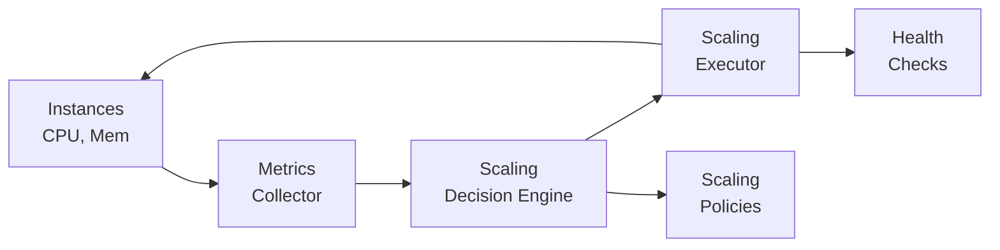

# Auto-Scaling

## TL;DR

Auto-scaling automatically adjusts compute capacity based on demand, adding resources during traffic spikes and removing them during lulls. This optimizes costs while maintaining performance. Key components include metrics collection, scaling policies, cooldown periods, and health checks. Modern systems use predictive scaling alongside reactive scaling for better responsiveness.

---

## Why Auto-Scaling?

Without auto-scaling:

```
Traffic Pattern:
     ▲
     │         ╱╲
     │        ╱  ╲        ╱╲
     │       ╱    ╲      ╱  ╲
     │ ─────╱      ╲────╱    ╲─────
     └────────────────────────────────► Time

Fixed Capacity (over-provisioned for peak):
     ▲
     │ ════════════════════════════════  ← Paying for unused capacity
     │         ╱╲
     │        ╱  ╲        ╱╲
     │       ╱    ╲      ╱  ╲
     │ ─────╱      ╲────╱    ╲─────
     └────────────────────────────────► Time
                    Wasted $$$ during low traffic
```

With auto-scaling:

```
Traffic Pattern:
     ▲
     │         ╱╲
     │        ╱  ╲        ╱╲
     │       ╱    ╲      ╱  ╲
     │ ─────╱      ╲────╱    ╲─────
     └────────────────────────────────► Time

Auto-scaled Capacity:
     ▲
     │        ┌──┐       ┌──┐
     │        │  │       │  │
     │   ─────┘  └───────┘  └─────  ← Capacity follows demand
     └────────────────────────────────► Time
                    Pay only for what you use
```

---

## Auto-Scaling Components



---

## Scaling Metrics

### Target Tracking

```python
from dataclasses import dataclass
from enum import Enum
from typing import List, Callable

class MetricType(Enum):
    CPU_UTILIZATION = "cpu"
    MEMORY_UTILIZATION = "memory"
    REQUEST_COUNT = "request_count"
    QUEUE_DEPTH = "queue_depth"
    RESPONSE_TIME = "response_time"
    CUSTOM = "custom"

@dataclass
class ScalingMetric:
    metric_type: MetricType
    target_value: float
    scale_in_cooldown: int = 300   # seconds
    scale_out_cooldown: int = 60   # seconds

class TargetTrackingScaler:
    """Scale to maintain target metric value"""
    
    def __init__(
        self,
        metric: ScalingMetric,
        min_capacity: int = 1,
        max_capacity: int = 100
    ):
        self.metric = metric
        self.min_capacity = min_capacity
        self.max_capacity = max_capacity
    
    def calculate_desired_capacity(
        self, 
        current_capacity: int,
        current_value: float
    ) -> int:
        """
        Calculate desired capacity based on target tracking.
        
        Formula: desired = current_capacity * (current_value / target_value)
        """
        if current_value == 0:
            return self.min_capacity
        
        # Calculate proportional capacity
        ratio = current_value / self.metric.target_value
        desired = int(current_capacity * ratio)
        
        # Add buffer for scale-out (10% headroom)
        if ratio > 1:
            desired = int(desired * 1.1)
        
        # Clamp to bounds
        return max(self.min_capacity, min(self.max_capacity, desired))

# Example: Scale to maintain 70% CPU
cpu_scaler = TargetTrackingScaler(
    metric=ScalingMetric(
        metric_type=MetricType.CPU_UTILIZATION,
        target_value=70.0
    ),
    min_capacity=2,
    max_capacity=50
)

# Current: 5 instances at 90% CPU
# Desired: 5 * (90/70) * 1.1 = 7 instances
desired = cpu_scaler.calculate_desired_capacity(
    current_capacity=5,
    current_value=90.0
)
```

### Step Scaling

```python
from dataclasses import dataclass
from typing import List, Optional

@dataclass
class StepAdjustment:
    lower_bound: Optional[float]  # None = negative infinity
    upper_bound: Optional[float]  # None = positive infinity
    adjustment: int               # Number of instances to add/remove

class StepScaler:
    """Scale based on step thresholds"""
    
    def __init__(
        self,
        scale_out_steps: List[StepAdjustment],
        scale_in_steps: List[StepAdjustment],
        min_capacity: int = 1,
        max_capacity: int = 100
    ):
        self.scale_out_steps = scale_out_steps
        self.scale_in_steps = scale_in_steps
        self.min_capacity = min_capacity
        self.max_capacity = max_capacity
    
    def calculate_adjustment(
        self,
        current_capacity: int,
        metric_value: float,
        threshold: float
    ) -> int:
        """Calculate capacity adjustment based on breach amount"""
        breach = metric_value - threshold
        
        if breach > 0:  # Scale out
            for step in self.scale_out_steps:
                if self._in_range(breach, step.lower_bound, step.upper_bound):
                    new_capacity = current_capacity + step.adjustment
                    return max(self.min_capacity, min(self.max_capacity, new_capacity))
        elif breach < 0:  # Scale in
            for step in self.scale_in_steps:
                if self._in_range(abs(breach), step.lower_bound, step.upper_bound):
                    new_capacity = current_capacity + step.adjustment
                    return max(self.min_capacity, min(self.max_capacity, new_capacity))
        
        return current_capacity
    
    def _in_range(self, value: float, lower: Optional[float], upper: Optional[float]) -> bool:
        if lower is not None and value < lower:
            return False
        if upper is not None and value >= upper:
            return False
        return True

# Example: Aggressive scale-out, conservative scale-in
step_scaler = StepScaler(
    scale_out_steps=[
        StepAdjustment(lower_bound=0, upper_bound=10, adjustment=1),
        StepAdjustment(lower_bound=10, upper_bound=20, adjustment=2),
        StepAdjustment(lower_bound=20, upper_bound=None, adjustment=5),
    ],
    scale_in_steps=[
        StepAdjustment(lower_bound=0, upper_bound=20, adjustment=-1),
        StepAdjustment(lower_bound=20, upper_bound=None, adjustment=-2),
    ]
)

# CPU at 95%, threshold at 70%
# Breach = 25% → add 5 instances
```

```
Step Scaling Visualization:

Metric Value (CPU %):

100 ─┬─────────────────────────────────────
     │ SCALE OUT: +5 instances
 90 ─┼─────────────────────────────────────
     │ SCALE OUT: +2 instances
 80 ─┼─────────────────────────────────────
     │ SCALE OUT: +1 instance
 70 ─┼═════════════════════════════════════  ← Target (no action)
     │ SCALE IN: -1 instance
 50 ─┼─────────────────────────────────────
     │ SCALE IN: -2 instances
 30 ─┴─────────────────────────────────────
```

### Scheduled Scaling

```python
from datetime import datetime, time
from dataclasses import dataclass
from typing import List
import croniter

@dataclass
class ScheduledAction:
    name: str
    schedule: str  # Cron expression
    min_capacity: int
    max_capacity: int
    desired_capacity: int

class ScheduledScaler:
    """Scale based on known patterns (time-of-day, events)"""
    
    def __init__(self, schedules: List[ScheduledAction]):
        self.schedules = schedules
    
    def get_capacity_at(self, dt: datetime) -> dict:
        """Get scheduled capacity at given time"""
        for schedule in self.schedules:
            cron = croniter.croniter(schedule.schedule, dt)
            # Check if we're within this schedule's active period
            prev_run = cron.get_prev(datetime)
            next_run = cron.get_next(datetime)
            
            # Simple: use most recent schedule
            if (dt - prev_run).total_seconds() < 3600:  # Within 1 hour
                return {
                    'min': schedule.min_capacity,
                    'max': schedule.max_capacity,
                    'desired': schedule.desired_capacity,
                    'schedule': schedule.name
                }
        
        return None  # No active schedule

# Example: Known traffic patterns
schedules = [
    # Business hours: high capacity
    ScheduledAction(
        name="business_hours",
        schedule="0 9 * * MON-FRI",  # 9 AM weekdays
        min_capacity=10,
        max_capacity=100,
        desired_capacity=20
    ),
    # Evening: medium capacity
    ScheduledAction(
        name="evening",
        schedule="0 18 * * MON-FRI",  # 6 PM weekdays
        min_capacity=5,
        max_capacity=50,
        desired_capacity=10
    ),
    # Night: low capacity
    ScheduledAction(
        name="night",
        schedule="0 22 * * *",  # 10 PM daily
        min_capacity=2,
        max_capacity=20,
        desired_capacity=3
    ),
    # Marketing event: pre-scale
    ScheduledAction(
        name="black_friday",
        schedule="0 0 25 11 *",  # Nov 25, midnight
        min_capacity=50,
        max_capacity=500,
        desired_capacity=100
    ),
]
```

---

## Predictive Scaling

```python
import numpy as np
from sklearn.ensemble import RandomForestRegressor
from datetime import datetime, timedelta
from typing import List, Tuple
from dataclasses import dataclass

@dataclass
class MetricDataPoint:
    timestamp: datetime
    value: float

class PredictiveScaler:
    """ML-based scaling predictions"""
    
    def __init__(
        self,
        lookback_hours: int = 168,  # 1 week
        forecast_hours: int = 2
    ):
        self.lookback_hours = lookback_hours
        self.forecast_hours = forecast_hours
        self.model = RandomForestRegressor(n_estimators=100)
        self.is_trained = False
    
    def _extract_features(self, dt: datetime) -> List[float]:
        """Extract time-based features"""
        return [
            dt.hour,
            dt.weekday(),
            dt.day,
            dt.month,
            1 if dt.weekday() >= 5 else 0,  # is_weekend
            np.sin(2 * np.pi * dt.hour / 24),  # Hour cyclical
            np.cos(2 * np.pi * dt.hour / 24),
            np.sin(2 * np.pi * dt.weekday() / 7),  # Day cyclical
            np.cos(2 * np.pi * dt.weekday() / 7),
        ]
    
    def train(self, history: List[MetricDataPoint]):
        """Train model on historical data"""
        X = []
        y = []
        
        for point in history:
            features = self._extract_features(point.timestamp)
            X.append(features)
            y.append(point.value)
        
        self.model.fit(X, y)
        self.is_trained = True
    
    def predict(self, current_time: datetime) -> List[Tuple[datetime, float]]:
        """Predict metric values for next forecast_hours"""
        if not self.is_trained:
            raise ValueError("Model not trained")
        
        predictions = []
        for hours_ahead in range(self.forecast_hours):
            future_time = current_time + timedelta(hours=hours_ahead)
            features = self._extract_features(future_time)
            predicted_value = self.model.predict([features])[0]
            predictions.append((future_time, predicted_value))
        
        return predictions
    
    def get_recommended_capacity(
        self,
        predictions: List[Tuple[datetime, float]],
        capacity_per_unit: float,
        target_utilization: float = 0.7
    ) -> int:
        """Convert predicted load to recommended capacity"""
        max_predicted = max(p[1] for p in predictions)
        # Scale to target utilization
        required_capacity = max_predicted / (capacity_per_unit * target_utilization)
        return int(np.ceil(required_capacity))

# Usage
predictor = PredictiveScaler()

# Train on historical data
historical_data = load_metrics_last_week()
predictor.train(historical_data)

# Predict next 2 hours
predictions = predictor.predict(datetime.now())
recommended = predictor.get_recommended_capacity(
    predictions,
    capacity_per_unit=100,  # Each instance handles 100 req/s
    target_utilization=0.7
)
```

```
Predictive Scaling Timeline:

     Predicted Traffic
          ▲
          │           ╭────╮
          │       ╭───╯    ╰───╮
          │   ╭───╯            ╰───╮
          │───╯                    ╰───
          └─────────────────────────────► Time
              │   │        │
              Now │        │
                  │        └── Predicted peak: scale up NOW
                  │
                  └── Lead time for instances to start

Traditional (reactive): Scales AFTER traffic increases
Predictive: Scales BEFORE traffic increases
```

---

## Cooldown and Stabilization

```python
from dataclasses import dataclass
from datetime import datetime, timedelta
from typing import Optional

@dataclass
class ScalingActivity:
    timestamp: datetime
    action: str  # 'scale_out' or 'scale_in'
    from_capacity: int
    to_capacity: int

class CooldownManager:
    """Prevent scaling thrashing"""
    
    def __init__(
        self,
        scale_out_cooldown: int = 60,    # seconds
        scale_in_cooldown: int = 300,    # seconds
        stabilization_window: int = 300  # seconds
    ):
        self.scale_out_cooldown = scale_out_cooldown
        self.scale_in_cooldown = scale_in_cooldown
        self.stabilization_window = stabilization_window
        self.activities: List[ScalingActivity] = []
        self.metric_history: List[Tuple[datetime, float]] = []
    
    def can_scale_out(self) -> bool:
        """Check if scale-out is allowed (cooldown passed)"""
        last_scale_out = self._get_last_activity('scale_out')
        if not last_scale_out:
            return True
        
        elapsed = (datetime.now() - last_scale_out.timestamp).total_seconds()
        return elapsed >= self.scale_out_cooldown
    
    def can_scale_in(self) -> bool:
        """Check if scale-in is allowed (cooldown and stabilization)"""
        # Check cooldown
        last_activity = self._get_last_activity()
        if last_activity:
            elapsed = (datetime.now() - last_activity.timestamp).total_seconds()
            if elapsed < self.scale_in_cooldown:
                return False
        
        # Check stabilization: metrics must be stable
        return self._is_metric_stable()
    
    def _is_metric_stable(self) -> bool:
        """Check if metric has been below threshold for stabilization window"""
        if not self.metric_history:
            return False
        
        window_start = datetime.now() - timedelta(seconds=self.stabilization_window)
        recent_metrics = [
            m for t, m in self.metric_history 
            if t >= window_start
        ]
        
        if not recent_metrics:
            return False
        
        # All values in window must be below threshold
        return all(m < self.scale_in_threshold for m in recent_metrics)
    
    def _get_last_activity(self, action: str = None) -> Optional[ScalingActivity]:
        if not self.activities:
            return None
        
        if action:
            matching = [a for a in self.activities if a.action == action]
            return matching[-1] if matching else None
        
        return self.activities[-1]
    
    def record_activity(self, activity: ScalingActivity):
        self.activities.append(activity)
        # Keep only last 100 activities
        self.activities = self.activities[-100:]
    
    def record_metric(self, value: float):
        self.metric_history.append((datetime.now(), value))
        # Keep only metrics within stabilization window
        cutoff = datetime.now() - timedelta(seconds=self.stabilization_window * 2)
        self.metric_history = [
            (t, v) for t, v in self.metric_history if t >= cutoff
        ]
```

```
Cooldown Prevents Thrashing:

Without cooldown:
Time ──────────────────────────────────────────────►
      ↑scale  ↓scale  ↑scale  ↓scale  ↑scale  ↓scale
      out     in      out     in      out     in
      
Instances: 5 → 7 → 5 → 8 → 5 → 7 → 5  (thrashing!)

With cooldown (300s scale-in):
Time ──────────────────────────────────────────────►
      ↑scale                              ↓scale
      out                                 in
      │←───── cooldown (wait) ────────────│
      
Instances: 5 → 7 ────────────────────────► 5  (stable)
```

---

## AWS Auto Scaling Configuration

```python
import boto3
from typing import List

class AWSAutoScalingManager:
    def __init__(self, region: str = 'us-east-1'):
        self.autoscaling = boto3.client('autoscaling', region_name=region)
        self.cloudwatch = boto3.client('cloudwatch', region_name=region)
    
    def create_auto_scaling_group(
        self,
        name: str,
        launch_template_id: str,
        min_size: int,
        max_size: int,
        desired_capacity: int,
        vpc_zone_ids: List[str],
        target_group_arns: List[str]
    ):
        """Create an Auto Scaling Group"""
        return self.autoscaling.create_auto_scaling_group(
            AutoScalingGroupName=name,
            LaunchTemplate={
                'LaunchTemplateId': launch_template_id,
                'Version': '$Latest'
            },
            MinSize=min_size,
            MaxSize=max_size,
            DesiredCapacity=desired_capacity,
            VPCZoneIdentifier=','.join(vpc_zone_ids),
            TargetGroupARNs=target_group_arns,
            HealthCheckType='ELB',
            HealthCheckGracePeriod=300,
            Tags=[
                {
                    'Key': 'Name',
                    'Value': name,
                    'PropagateAtLaunch': True
                }
            ]
        )
    
    def create_target_tracking_policy(
        self,
        asg_name: str,
        policy_name: str,
        target_value: float,
        metric_type: str = 'ASGAverageCPUUtilization'
    ):
        """Create target tracking scaling policy"""
        return self.autoscaling.put_scaling_policy(
            AutoScalingGroupName=asg_name,
            PolicyName=policy_name,
            PolicyType='TargetTrackingScaling',
            TargetTrackingConfiguration={
                'PredefinedMetricSpecification': {
                    'PredefinedMetricType': metric_type
                },
                'TargetValue': target_value,
                'ScaleInCooldown': 300,
                'ScaleOutCooldown': 60
            }
        )
    
    def create_step_scaling_policy(
        self,
        asg_name: str,
        policy_name: str,
        adjustment_type: str,
        step_adjustments: List[dict]
    ):
        """Create step scaling policy"""
        return self.autoscaling.put_scaling_policy(
            AutoScalingGroupName=asg_name,
            PolicyName=policy_name,
            PolicyType='StepScaling',
            AdjustmentType=adjustment_type,
            StepAdjustments=step_adjustments,
            MetricAggregationType='Average'
        )
    
    def create_scheduled_action(
        self,
        asg_name: str,
        action_name: str,
        schedule: str,  # Cron format
        min_size: int,
        max_size: int,
        desired_capacity: int
    ):
        """Create scheduled scaling action"""
        return self.autoscaling.put_scheduled_update_group_action(
            AutoScalingGroupName=asg_name,
            ScheduledActionName=action_name,
            Recurrence=schedule,
            MinSize=min_size,
            MaxSize=max_size,
            DesiredCapacity=desired_capacity
        )

# Usage example
manager = AWSAutoScalingManager()

# Create ASG
manager.create_auto_scaling_group(
    name='web-servers',
    launch_template_id='lt-0123456789',
    min_size=2,
    max_size=50,
    desired_capacity=5,
    vpc_zone_ids=['subnet-abc', 'subnet-def'],
    target_group_arns=['arn:aws:elasticloadbalancing:...']
)

# Add target tracking policy
manager.create_target_tracking_policy(
    asg_name='web-servers',
    policy_name='cpu-target-70',
    target_value=70.0
)

# Add scheduled scaling for known peaks
manager.create_scheduled_action(
    asg_name='web-servers',
    action_name='business-hours-scale-up',
    schedule='0 9 * * MON-FRI',
    min_size=10,
    max_size=100,
    desired_capacity=20
)
```

---

## Kubernetes Horizontal Pod Autoscaler

```yaml
# Basic HPA with CPU
apiVersion: autoscaling/v2
kind: HorizontalPodAutoscaler
metadata:
  name: web-app-hpa
spec:
  scaleTargetRef:
    apiVersion: apps/v1
    kind: Deployment
    name: web-app
  minReplicas: 3
  maxReplicas: 100
  metrics:
  - type: Resource
    resource:
      name: cpu
      target:
        type: Utilization
        averageUtilization: 70
  - type: Resource
    resource:
      name: memory
      target:
        type: Utilization
        averageUtilization: 80
  behavior:
    scaleDown:
      stabilizationWindowSeconds: 300
      policies:
      - type: Percent
        value: 10
        periodSeconds: 60
    scaleUp:
      stabilizationWindowSeconds: 0
      policies:
      - type: Percent
        value: 100
        periodSeconds: 15
      - type: Pods
        value: 4
        periodSeconds: 15
      selectPolicy: Max

---
# Custom metrics HPA
apiVersion: autoscaling/v2
kind: HorizontalPodAutoscaler
metadata:
  name: queue-processor-hpa
spec:
  scaleTargetRef:
    apiVersion: apps/v1
    kind: Deployment
    name: queue-processor
  minReplicas: 1
  maxReplicas: 50
  metrics:
  # Scale based on queue depth
  - type: External
    external:
      metric:
        name: sqs_queue_messages_visible
        selector:
          matchLabels:
            queue: "orders-queue"
      target:
        type: AverageValue
        averageValue: 10  # 10 messages per pod

---
# KEDA ScaledObject for advanced scaling
apiVersion: keda.sh/v1alpha1
kind: ScaledObject
metadata:
  name: kafka-consumer-scaler
spec:
  scaleTargetRef:
    name: kafka-consumer
  minReplicaCount: 0  # Scale to zero!
  maxReplicaCount: 100
  triggers:
  - type: kafka
    metadata:
      bootstrapServers: kafka:9092
      consumerGroup: my-group
      topic: events
      lagThreshold: '100'  # Scale up when lag > 100
```

---

## Scaling Patterns

### Scale by Queue Depth

```python
from dataclasses import dataclass
import math

@dataclass
class QueueMetrics:
    visible_messages: int
    in_flight_messages: int
    messages_per_second: float

class QueueBasedScaler:
    """Scale based on queue depth"""
    
    def __init__(
        self,
        messages_per_worker: int = 10,
        processing_time_seconds: float = 1.0,
        min_workers: int = 1,
        max_workers: int = 100
    ):
        self.messages_per_worker = messages_per_worker
        self.processing_time = processing_time_seconds
        self.min_workers = min_workers
        self.max_workers = max_workers
    
    def calculate_desired_workers(self, metrics: QueueMetrics) -> int:
        """Calculate workers needed to drain queue in reasonable time"""
        total_messages = metrics.visible_messages + metrics.in_flight_messages
        
        if total_messages == 0:
            return self.min_workers
        
        # Calculate based on target drain time
        target_drain_time = 60  # seconds
        messages_per_worker_per_second = 1 / self.processing_time
        
        # Workers needed = messages / (messages_per_worker_per_second * time)
        workers_needed = math.ceil(
            total_messages / (messages_per_worker_per_second * target_drain_time)
        )
        
        # Also consider incoming rate
        workers_for_incoming = math.ceil(
            metrics.messages_per_second * self.processing_time
        )
        
        desired = max(workers_needed, workers_for_incoming)
        return max(self.min_workers, min(self.max_workers, desired))

# Usage
scaler = QueueBasedScaler(
    messages_per_worker=10,
    processing_time_seconds=0.5,
    max_workers=50
)

metrics = QueueMetrics(
    visible_messages=1000,
    in_flight_messages=50,
    messages_per_second=100
)

desired_workers = scaler.calculate_desired_workers(metrics)
```

### Scale by Request Latency

```python
class LatencyBasedScaler:
    """Scale to maintain target latency"""
    
    def __init__(
        self,
        target_p99_ms: float = 100,
        max_latency_ms: float = 500,
        min_instances: int = 2,
        max_instances: int = 100
    ):
        self.target_p99 = target_p99_ms
        self.max_latency = max_latency_ms
        self.min_instances = min_instances
        self.max_instances = max_instances
    
    def calculate_desired_instances(
        self,
        current_instances: int,
        current_p99_ms: float,
        requests_per_second: float
    ) -> int:
        if current_p99_ms <= self.target_p99:
            # Latency OK, might be able to scale in
            headroom = self.target_p99 / current_p99_ms
            if headroom > 1.5:  # 50% headroom
                new_instances = int(current_instances / headroom)
                return max(self.min_instances, new_instances)
            return current_instances
        
        # Latency too high, scale out
        if current_p99_ms >= self.max_latency:
            # Emergency scale
            return min(self.max_instances, current_instances * 2)
        
        # Proportional scale
        ratio = current_p99_ms / self.target_p99
        new_instances = int(current_instances * ratio)
        return min(self.max_instances, new_instances)
```

---

## Health Checks and Replacement

```python
from enum import Enum
from dataclasses import dataclass
from typing import Optional
import asyncio

class HealthStatus(Enum):
    HEALTHY = "healthy"
    UNHEALTHY = "unhealthy"
    UNKNOWN = "unknown"

@dataclass 
class InstanceHealth:
    instance_id: str
    status: HealthStatus
    consecutive_failures: int
    last_check: float

class HealthCheckManager:
    """Manage instance health for auto-scaling"""
    
    def __init__(
        self,
        health_check_interval: int = 30,
        unhealthy_threshold: int = 3,
        healthy_threshold: int = 2,
        grace_period: int = 300
    ):
        self.interval = health_check_interval
        self.unhealthy_threshold = unhealthy_threshold
        self.healthy_threshold = healthy_threshold
        self.grace_period = grace_period
        self.instances: dict[str, InstanceHealth] = {}
    
    async def check_instance(self, instance_id: str, endpoint: str) -> bool:
        """Perform health check on instance"""
        try:
            async with aiohttp.ClientSession() as session:
                async with session.get(
                    endpoint,
                    timeout=aiohttp.ClientTimeout(total=5)
                ) as response:
                    return response.status == 200
        except Exception:
            return False
    
    async def run_health_checks(self, instances: dict[str, str]):
        """Run health checks on all instances"""
        tasks = []
        for instance_id, endpoint in instances.items():
            task = self._check_and_update(instance_id, endpoint)
            tasks.append(task)
        
        await asyncio.gather(*tasks)
    
    async def _check_and_update(self, instance_id: str, endpoint: str):
        is_healthy = await self.check_instance(instance_id, endpoint)
        
        if instance_id not in self.instances:
            self.instances[instance_id] = InstanceHealth(
                instance_id=instance_id,
                status=HealthStatus.UNKNOWN,
                consecutive_failures=0,
                last_check=time.time()
            )
        
        health = self.instances[instance_id]
        health.last_check = time.time()
        
        if is_healthy:
            health.consecutive_failures = 0
            if health.status != HealthStatus.HEALTHY:
                # Need consecutive successes to become healthy
                health.consecutive_successes = getattr(health, 'consecutive_successes', 0) + 1
                if health.consecutive_successes >= self.healthy_threshold:
                    health.status = HealthStatus.HEALTHY
        else:
            health.consecutive_failures += 1
            health.consecutive_successes = 0
            if health.consecutive_failures >= self.unhealthy_threshold:
                health.status = HealthStatus.UNHEALTHY
    
    def get_unhealthy_instances(self) -> List[str]:
        """Get list of unhealthy instances for replacement"""
        return [
            h.instance_id 
            for h in self.instances.values() 
            if h.status == HealthStatus.UNHEALTHY
        ]
```

---

## Scaling Costs Optimization

```python
from dataclasses import dataclass
from typing import List
from enum import Enum

class InstanceType(Enum):
    ON_DEMAND = "on_demand"
    SPOT = "spot"
    RESERVED = "reserved"

@dataclass
class InstanceCost:
    instance_type: str
    pricing_type: InstanceType
    hourly_cost: float
    capacity_units: int

class CostOptimizedScaler:
    """Optimize scaling for cost"""
    
    def __init__(
        self,
        reserved_capacity: int,    # Always-on reserved instances
        spot_percentage: float,    # Percentage of on-demand to use spot
        spot_fallback_to_on_demand: bool = True
    ):
        self.reserved_capacity = reserved_capacity
        self.spot_percentage = spot_percentage
        self.spot_fallback = spot_fallback_to_on_demand
    
    def calculate_instance_mix(self, desired_capacity: int) -> dict:
        """Calculate optimal mix of instance types"""
        mix = {
            InstanceType.RESERVED: 0,
            InstanceType.SPOT: 0,
            InstanceType.ON_DEMAND: 0
        }
        
        remaining = desired_capacity
        
        # First, use reserved capacity
        mix[InstanceType.RESERVED] = min(remaining, self.reserved_capacity)
        remaining -= mix[InstanceType.RESERVED]
        
        if remaining <= 0:
            return mix
        
        # Then, use spot for percentage of remaining
        spot_count = int(remaining * self.spot_percentage)
        mix[InstanceType.SPOT] = spot_count
        remaining -= spot_count
        
        # Rest is on-demand
        mix[InstanceType.ON_DEMAND] = remaining
        
        return mix
    
    def estimate_hourly_cost(
        self,
        mix: dict,
        costs: dict[InstanceType, float]
    ) -> float:
        """Estimate hourly cost for instance mix"""
        return sum(
            count * costs.get(instance_type, 0)
            for instance_type, count in mix.items()
        )

# Example costs
costs = {
    InstanceType.RESERVED: 0.05,   # ~60% discount
    InstanceType.SPOT: 0.03,       # ~75% discount (variable)
    InstanceType.ON_DEMAND: 0.12
}

scaler = CostOptimizedScaler(
    reserved_capacity=10,     # 10 reserved for baseline
    spot_percentage=0.7       # 70% spot for variable load
)

# For 50 instances:
# Reserved: 10 (baseline)
# Spot: (50-10) * 0.7 = 28
# On-demand: 40 - 28 = 12
mix = scaler.calculate_instance_mix(50)
hourly_cost = scaler.estimate_hourly_cost(mix, costs)
```

---

## Key Takeaways

1. **Use multiple metrics**: Combine CPU, memory, and application metrics (queue depth, latency) for accurate scaling

2. **Prefer target tracking**: Simpler and usually more effective than step scaling for most use cases

3. **Implement cooldowns**: Prevent thrashing with appropriate cooldown periods (faster scale-out, slower scale-in)

4. **Add scheduled scaling**: Pre-scale for known traffic patterns (business hours, events)

5. **Consider predictive scaling**: Use ML to anticipate traffic spikes before they happen

6. **Health checks matter**: Fast detection and replacement of unhealthy instances prevents capacity loss

7. **Optimize costs**: Use mix of reserved, spot, and on-demand instances based on workload predictability
