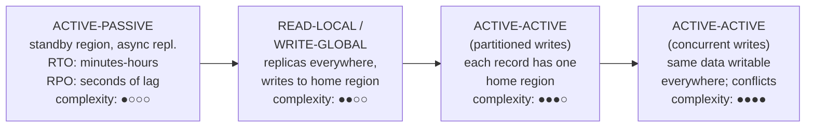
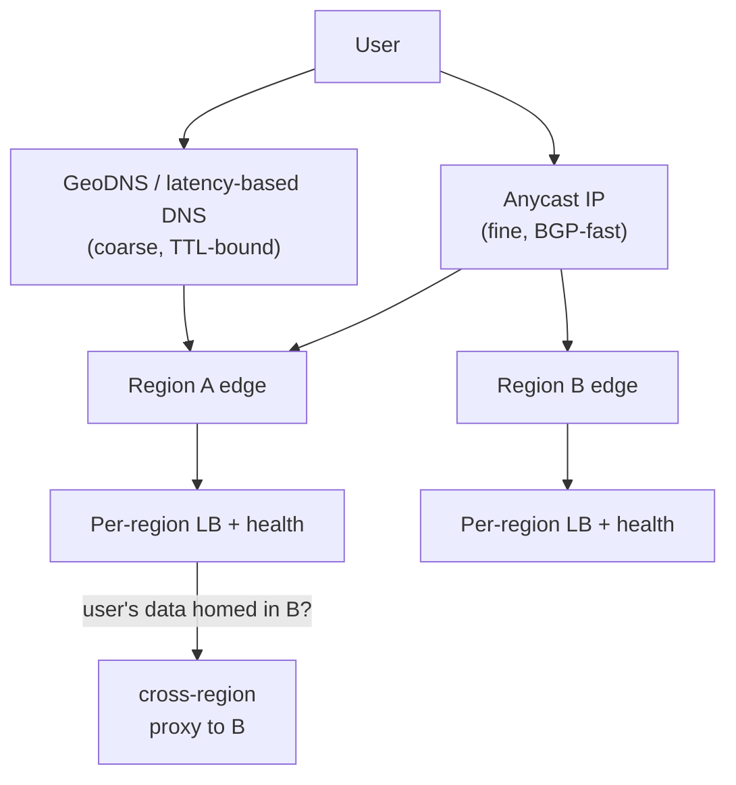

# Multi-Region Architecture

## TL;DR

Multi-region buys three things — latency proximity, survival of region-scale failure, and data residency compliance — and it charges in the only currency physics accepts: you cannot have synchronous replication across continents and low-latency writes at once (~80ms round trip US-East↔EU, ~150ms+ US↔APAC). Pick a posture per system: **active-passive** (one region serves, one stands by), **read-local/write-global** (reads everywhere, writes to a home region), or **active-active** (writes everywhere, conflicts managed). The compute tier is the easy part; the data tier dictates everything. Engineer failover as a product feature — static stability, capacity headroom, drilled runbooks — because an untested failover plan is a fiction with a dashboard.

---

## Why Go Multi-Region (and Why Not)

| Driver | What it actually requires |
|---|---|
| **Latency** — users on 3 continents | Read replicas or full active-active near users; CDN may already solve 80% ([CDN Architecture](./04-cdn-architecture.md)) |
| **Survivability** — region outage ≠ product outage | A second region with *capacity, data, and a tested promotion path* |
| **Residency** — EU data stays in EU | Data partitioning by jurisdiction — a *sharding* problem more than a replication one |

And the honest counterweight: multi-region multiplies infrastructure cost (often 1.8–2.5×), turns every data design into a consistency decision, and adds failure modes that single-region systems never see (split brain, replication lag during failover, cross-region config drift). A single region with multi-AZ redundancy already survives machine and datacenter failure; many businesses' actual availability needs stop there. Go multi-region for a reason you can name, and only for the systems that reason applies to — a typical end state is active-active for the stateless edge, read-local for the product database, and single-region for the admin tooling nobody will miss for an hour.

### The physics table

Round-trip times bound your synchronous options:

| Path | RTT (typical) | Synchronous write cost |
|---|---|---|
| Same AZ | < 1 ms | Free — do it always |
| Cross-AZ, same region | 1–2 ms | Cheap — standard HA |
| US-East ↔ US-West | ~60–70 ms | Felt on every write |
| US-East ↔ Europe | ~80–90 ms | User-visible |
| US ↔ Asia-Pacific | 150–250 ms | Prohibitive for interactive writes |

A quorum spanning three continents puts an intercontinental RTT inside every commit. Systems that do this (Spanner-style — see [Spanner](../09-whitepapers/04-spanner.md)) accept it deliberately and place replicas to keep quorums regional where possible. Everyone else replicates asynchronously and confronts the consequence: **RPO > 0** — a region lost mid-flight loses the unreplicated tail.

---

## The Posture Spectrum

**Active-passive.** All traffic to the primary region; the secondary receives async replication and idles (or serves only batch/BC work). Cheapest mental model; the catch is that the passive region decays — untested capacity, stale configs, expired credentials. If you choose this, the standby must take real traffic regularly (game days or a small permanent traffic slice), or it will fail precisely when promoted.

**Read-local / write-global.** Replicas in every region serve reads; writes route to the home region. Read latency wins for read-heavy products; writes pay one cross-region hop. The trap is **read-your-writes**: a user who writes (to the home region) then reads (from the local replica) can see time go backwards. Fixes: session stickiness to the home region for a window after a write, replica-lag-aware routing, or causal tokens ([Consistency Models](../01-foundations/04-consistency-models.md)).

**Active-active, partitioned writes.** Every region accepts writes — but each *record* has exactly one home region (EU users' data homed in EU, and so on). No write conflicts by construction, since ownership is single-writer per key ([Partitioning Strategies](../02-distributed-databases/05-partitioning-strategies.md)). This is the workhorse posture for global consumer products, and it makes residency a first-class property: the partition key includes jurisdiction. Costs: cross-partition operations become distributed workflows ([Sagas](../05-messaging/09-saga-pattern.md)), and *re-homing* a record (user moves continents) is a migration, not an UPDATE.

**Active-active, concurrent writes.** The same record writable in multiple regions concurrently — multi-leader replication with conflict resolution: last-writer-wins (silent data loss under skewed clocks), CRDTs (for data shaped like sets/counters/registers), or application merge logic ([Multi-Leader Replication](../02-distributed-databases/02-multi-leader-replication.md), [Conflict Resolution](../02-distributed-databases/04-conflict-resolution.md)). Reserve this for data where conflicts are rare or merge is natural (carts, likes, presence). Ledgers and inventory do not belong here.

---

## Routing Users

- **GeoDNS / latency-based DNS** is simple but bounded by resolver TTL honesty — plan for minutes of stale routing even with TTL=60, because resolvers and devices cache beyond TTL.
- **Anycast** (one IP advertised from all regions) converges in seconds via BGP and is how CDNs and modern edges steer; you stop controlling *which* region precisely, so the edge must handle "wrong region" arrivals.
- **The edge proxies, the data stays home:** when a request lands in region A for data homed in region B, terminate TLS and serve static/cacheable parts locally, proxy the data operations to B. One clean cross-region hop server-side beats the user's browser doing intercontinental TLS handshakes.
- Keep **session state out of regions** (signed tokens, not server sessions) so any region can authenticate any user instantly — a prerequisite for failover.

---

## Failover Engineering

Failover is where multi-region investments are won or lost. Principles that separate working designs from diagrams:

**Static stability.** The surviving region must not need *new* capacity, config pushes, or control-plane actions at failover time — the moment of regional failure is exactly when APIs to provision things are degraded and humans are panicking. Pre-provision headroom: in a 2-region design each region runs ≤ 50% utilized (or you accept brownout/load shedding on failover); 3 regions → ≤ 66%. Capacity you haven't reserved is capacity you don't have at 3 a.m.

**Decide who decides.** Split brain — both regions believing they're primary — corrupts data faster than downtime ever could. Promotion must go through a serialization point: a consensus-backed control plane spanning ≥3 failure domains, or an explicitly human two-person rule. Fence the demoted primary (revoke write credentials, fencing tokens at the storage layer — [Distributed Locks](../01-foundations/09-distributed-locks.md)) so a "dead" region that comes back mid-failover can't keep writing.

**Respect the RPO at the application layer.** Async replication means promotion loses the tail (seconds of writes). Decide *in advance* what happens to them: reconcile from logs? Replay from an event store? Apologize? For money-adjacent data, pair regional async replication with a durable cross-region write-ahead intent log ([Outbox](../05-messaging/07-outbox-pattern.md)) so the tail is recoverable even when the database's isn't.

**Fail back deliberately.** The original region returns with diverged data and cold caches. Failback is a second failover — schedule it, don't let it happen by DNS accident.

**Drill it.** Quarterly region evacuation with real traffic is the only evidence the plan works. Track time-to-healthy as an SLO on the *process* ([SLOs and Error Budgets](../11-observability/05-slos-error-budgets.md)). Teams that drill discover expired certs, hardcoded region names, and singleton cron jobs in the standby; teams that don't discover them during the outage.

### Failover decision table

| Scope of failure | Action | Typical RTO |
|---|---|---|
| One AZ | Nothing — multi-AZ absorbs it | 0 |
| Region degraded (elevated errors) | Shift traffic gradually away; don't promote storage yet | minutes |
| Region hard down | Promote storage, shift all traffic, fence old primary | minutes–1h (drilled) |
| Region down > RPO tolerance | Promote + run reconciliation playbook for lost tail | hours |

---

## Data Residency as Architecture

Residency (GDPR-adjacent regimes, sector rules) inverts the usual goal: data must **not** replicate freely. Treat jurisdiction as a shard dimension:

- Partition user data by home jurisdiction; the partition map itself (small, non-personal) replicates globally so any region can *route*.
- Derived data flows (analytics, search indexes, ML training, backups, logs with PII) inherit the constraint — the leak is never the primary database, it's the logging pipeline and the warehouse. Inventory every downstream copy ([Change Data Capture](../13-data-pipelines/04-change-data-capture.md) pipelines included).
- Cross-jurisdiction features (EU user messages US user) need explicit data contracts about what crosses the boundary — usually references and minimal projections, not full records.

---

## Checklist

- [ ] Posture chosen per data class (not one posture for the whole company) with a written reason
- [ ] RPO/RTO stated per system; lost-tail reconciliation defined where RPO > 0
- [ ] Read-your-writes handled (stickiness, lag-aware routing, or causal tokens)
- [ ] Static stability: surviving regions absorb failover load with pre-provisioned headroom
- [ ] Promotion serialized (consensus or two-person rule); old primary fenced
- [ ] Sessions stateless across regions; secrets/config replicated and drift-checked
- [ ] Singleton workloads (cron, schedulers, queue consumers) have a cross-region leadership story
- [ ] Residency-scoped data inventoried through *all* downstream copies
- [ ] Region evacuation drilled on a calendar, with time-to-healthy tracked
- [ ] Cost reviewed: cross-region egress and idle headroom are recurring line items, not surprises

---

## References

- [AWS Multi-Region Fundamentals](https://docs.aws.amazon.com/whitepapers/latest/aws-multi-region-fundamentals/aws-multi-region-fundamentals.html) — postures, static stability, control-plane dependencies
- [Static stability using Availability Zones](https://aws.amazon.com/builders-library/static-stability-using-availability-zones/) — Amazon Builders' Library; the concept generalizes to regions
- [Spanner: Google's Globally-Distributed Database](https://research.google/pubs/pub39966/) — the synchronous-global-consensus end of the spectrum
- [DynamoDB Global Tables](https://docs.aws.amazon.com/amazondynamodb/latest/developerguide/GlobalTables.html) — managed multi-leader with LWW conflict resolution; read the fine print
- [Challenges with distributed systems](https://aws.amazon.com/builders-library/challenges-with-distributed-systems/) — Amazon Builders' Library
- *Designing Data-Intensive Applications*, ch. 5 — replication topologies and their anomalies
