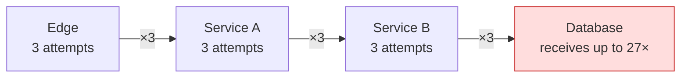
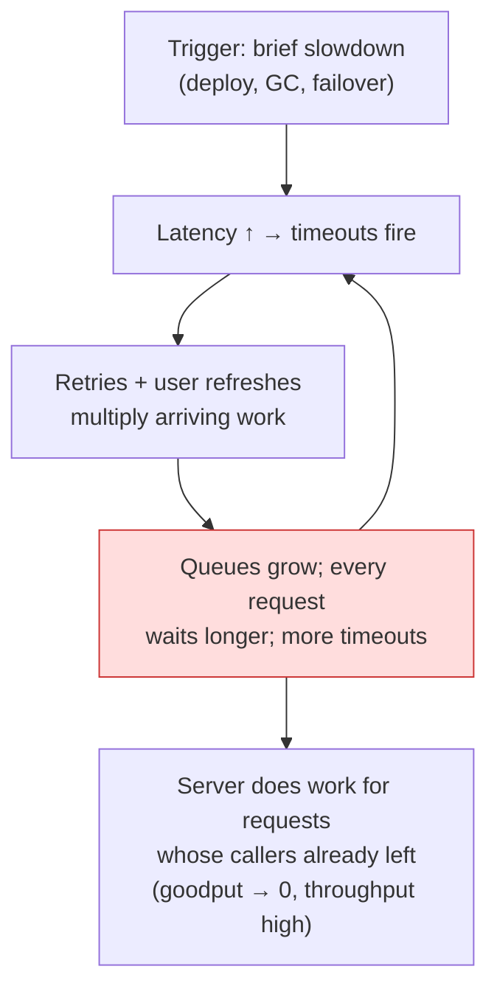

# Retries, Timeouts, and Hedging

## TL;DR

Timeouts, retries, and hedging are the most-deployed reliability patterns in any distributed system — and misconfigured retries are also the most common way systems destroy themselves. Set timeouts from observed latency percentiles and propagate **deadlines** end-to-end. Retry only idempotent operations, with **exponential backoff plus full jitter**, **bounded attempts**, and a **retry budget** that disables retrying when the system is sick — otherwise retries amplify load exactly when capacity is scarcest, producing retry storms and **metastable failures** that persist after the trigger clears. Hedge (send a backup request after ~p95) to cut tail latency on idempotent reads, at a few percent extra load. Layer the defenses: deadlines bound waiting, budgets bound amplification, circuit breakers stop the bleeding, load shedding protects goodput.

---

## Timeouts: Bounding How Long You Wait

Every remote call needs a timeout; the only question is whether you chose it or inherited a default (often infinite, or 30s — both wrong). Untimed calls accumulate as stuck threads and full connection pools, converting one slow dependency into your outage.

**Set timeouts from data, not vibes.** Start from the dependency's observed p99.9 plus margin; a timeout below p99 means you *cause* 1% failures, a timeout at 10× p99 means you wait pointlessly. Separate the phases — connect timeout (short: ~1s; failure is fast and crisp) from request timeout (workload-shaped).

**Propagate deadlines, don't stack timeouts.** Independent per-hop timeouts compound incoherently: a 10s edge timeout over services that each allow 10s guarantees the edge gives up while work continues downstream — burning capacity on responses nobody will read. Pass a single **deadline** (absolute time or remaining budget) down the call chain; every hop reserves its own cost and forwards the remainder; any hop with insufficient budget fails *immediately*:

```python
def handle(request, deadline: float):
    remaining = deadline - time.monotonic()
    if remaining < 0.05:                      # not enough budget to do useful work
        raise DeadlineExceeded("gave up before doing work, not after")

    rows = db.query(sql, timeout=min(remaining * 0.6, DB_MAX))
    return enrich(rows, timeout=(deadline - time.monotonic()) * 0.9)
```

gRPC propagates deadlines natively (`grpc-timeout` header); for HTTP, forward an `x-request-deadline` header and honor it. The cheapest work a loaded system can do is the work it declines early.

---

## Retries: Buying Reliability with Someone Else's Capacity

A retry converts a transient failure into a success — by submitting extra load. That trade is excellent when failures are rare and random, and catastrophic when failures are caused by overload, because then retries are gasoline.

### The amplification problem

Retries multiply **per layer**:



Three innocent-looking retry policies stack into 27× load on the bottom layer — precisely when it is already failing. Rules that follow:

- **Retry at one layer**, ideally the one that can make the failure invisible to a user (usually the closest to the client). Inner layers propagate errors fast instead of retrying.
- **Cap attempts** (2–3 total, not 10). If two retries didn't fix it, the failure isn't transient.
- **Never retry on connection-pool exhaustion, queue-full, 429, or deadline-exceeded** — those are the system telling you it's overloaded; retrying argues with it. Honor `Retry-After` when present.

### Backoff with full jitter

Synchronized clients retrying on a fixed schedule re-arrive as waves. Exponential backoff spreads attempts over time; **jitter** spreads them across clients. AWS's analysis showed *full jitter* (uniform random over the whole window) approaches the best completion time with the least contention:

```python
def backoff_full_jitter(attempt: int, base=0.1, cap=20.0) -> float:
    return random.uniform(0, min(cap, base * 2 ** attempt))
```

### Retry budgets: the circuit breaker for retries

Per-request caps don't bound *aggregate* amplification — 100% of requests each retrying twice is 3× load. A **retry budget** does: allow retries only while they're a small fraction of total traffic (canonically ~10–20%, the gRPC/Finagle approach):

```python
class RetryBudget:
    """Token bucket: deposits on requests, withdrawals on retries."""

    def __init__(self, ratio=0.1, min_per_sec=10):
        self.ratio, self.min_rate = ratio, min_per_sec
        self.tokens = 0.0

    def on_request(self):
        self.tokens = min(self.tokens + self.ratio, 100)

    def can_retry(self) -> bool:
        if self.tokens >= 1:
            self.tokens -= 1
            return True
        return False          # budget exhausted: fail fast, system is sick
```

In healthy conditions, every transient blip gets retried; in an incident, retrying disables itself system-wide and the dependency receives ~1.1× load instead of 3×. This single mechanism prevents most retry storms.

### Idempotency is the entry ticket

Retrying a non-idempotent operation is how customers get charged twice. Reads retry freely; writes retry only with an idempotency key the server deduplicates on ([Idempotency](../01-foundations/08-idempotency.md)). "The request timed out" does **not** mean it didn't happen — it means you don't know.

---

## Retry Storms and Metastable Failure

The failure mode that makes this article load-bearing: a system enters overload, retries (plus client refreshes, plus health-check evictions) amplify the load, and the amplification **sustains the overload after the original trigger is gone**. The system is stuck in a bad equilibrium — *metastable failure*. A brief database slowdown becomes a multi-hour outage that only ends when someone sheds load or turns retries off.



The signature on dashboards: **throughput normal-or-high, goodput near zero** — everyone is busy doing work that times out. Defenses, in order of leverage:

1. **Retry budgets** (above) — break the amplification loop at the source.
2. **Load shedding / admission control** — under pressure, reject excess *at the door* with cheap 429s and serve the admitted requests well ([Rate Limiting](./05-rate-limiting.md), [Backpressure](./07-backpressure.md)). LIFO queue draining helps too: the newest request is the one whose caller is most likely still waiting.
3. **Deadline checks before work** — drop requests whose budget already expired instead of executing them into the void.
4. **Circuit breakers** as the backstop that converts a drowning dependency into fast failures ([Circuit Breakers](./06-circuit-breakers.md)).
5. **Operator kill switch for retries** — a runtime flag that sets all retry policies to zero is one of the highest-value 20-line features you can ship before the incident that needs it.

Test for metastability explicitly: in load tests, push past saturation, *remove* the extra load, and verify the system recovers on its own. A system that stays degraded after the load drops has a metastable region in production too.

---

## Hedged Requests: Spending Load to Buy Tail Latency

Tail latency is dominated by rare slow replicas (GC, cache miss, bad disk). When a request fans out to many shards, the slowest leg sets the response time — at 100 fan-out, p99 server latency *is* your median user latency ("The Tail at Scale"). Hedging attacks this: send the request; if no response by ~p95, send a duplicate to a different replica; take the first answer and cancel the loser.

```python
async def hedged(call, replicas, hedge_after_s):       # hedge_after ≈ live p95
    first = asyncio.create_task(call(replicas[0]))
    done, _ = await asyncio.wait({first}, timeout=hedge_after_s)
    if done:
        return first.result()

    backup = asyncio.create_task(call(replicas[1]))
    done, pending = await asyncio.wait({first, backup},
                                       return_when=asyncio.FIRST_COMPLETED)
    for p in pending:
        p.cancel()                                      # cancellation must propagate!
    return done.pop().result()
```

Tuned at p95, hedging adds ~5% extra load and routinely cuts p99 latency by 2–10× on read paths. The rules:

- **Idempotent, read-mostly operations only.** A hedged write is a duplicate write.
- **Hedge after a delay** (p95–p99), never immediately — immediate duplication is 2× load for marginal gain.
- **Cancellation must work end-to-end**, or hedging quietly doubles backend load.
- **Disable hedging under overload** (tie it to the same budget machinery) — extra load is the wrong medicine for a saturated system. Variants: gRPC supports declarative hedging policies; "backup requests with cross-server cancellation" sends cancel messages to the loser, reclaiming even more wasted work.

---

## Putting It Together

| Layer of defense | Bounds | Mechanism |
|---|---|---|
| Timeout / deadline | How long one attempt waits | Percentile-derived, propagated budget |
| Retry policy | Failures a user sees | ≤3 attempts, backoff + full jitter, idempotent only |
| Retry budget | Aggregate amplification | ~10% token bucket, system-wide |
| Hedging | Tail latency | Backup request after p95, reads only, cancellable |
| Circuit breaker | Time spent on a dead dependency | Trip on error rate, probe to recover |
| Load shedding | Damage under overload | Admission control, LIFO, cheap rejects |

Declarative example (Envoy-style mesh config), because in 2026 most of this belongs in the platform layer, not application code:

```yaml
route:
  timeout: 2s                      # request deadline at the edge
  retry_policy:
    retry_on: "5xx,reset,connect-failure"
    num_retries: 2
    per_try_timeout: 0.8s
    retry_back_off: { base_interval: 0.1s, max_interval: 2s }
    retry_budget: { budget_percent: 10, min_retry_concurrency: 3 }
  hedge_policy:
    initial_requests: 1
    additional_request_chance: { numerator: 0 }   # enable per-route for hot reads
```

One platform-wide policy, observable and centrally adjustable, beats forty bespoke retry loops — and gives you the kill switch for free.

---

## References

- [The Tail at Scale](https://research.google/pubs/pub40801/) — Dean & Barroso; hedged and tied requests
- [Exponential Backoff and Jitter](https://aws.amazon.com/blogs/architecture/exponential-backoff-and-jitter/) — AWS; the full-jitter analysis
- [Timeouts, retries, and backoff with jitter](https://aws.amazon.com/builders-library/timeouts-retries-and-backoff-with-jitter/) — Amazon Builders' Library
- [Metastable Failures in Distributed Systems](https://sigops.org/s/conferences/hotos/2021/papers/hotos21-s11-bronson.pdf) — Bronson et al., HotOS '21
- [Fixing retries with token buckets and circuit breakers](https://aws.amazon.com/builders-library/timeouts-retries-and-backoff-with-jitter/) and [gRPC retry design](https://github.com/grpc/proposal/blob/master/A6-client-retries.md) — retry budgets in practice
- [SRE Book, ch. 21–22](https://sre.google/sre-book/handling-overload/) — handling overload and cascading failure
