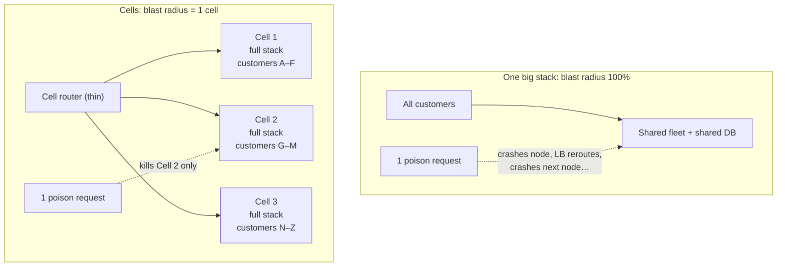
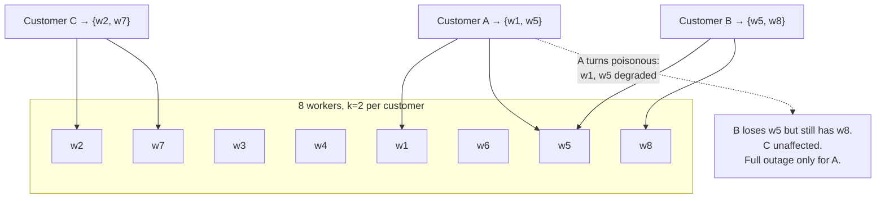

# Cell-Based Architecture and Shuffle Sharding

## TL;DR

Cell-based architecture caps blast radius by partitioning a service into **cells** — complete, independent copies of the full stack, each serving a fixed slice of customers — so an outage, poison-pill request, or bad data state takes down one cell's customers instead of everyone. The only global components left are a thin, boring **cell router** and a placement service, engineered to be simpler than everything they protect. **Shuffle sharding** achieves much of the same isolation combinatorially: assign each customer a random *subset* of shared workers, and the probability that two customers share their whole subset becomes vanishingly small — one abusive tenant degrades only the few who overlap. Cells also fix the scaling-ceiling problem: you load-test one cell to find its true limit, then add cells instead of growing an ever-larger untested blob. The price is cost overhead, hard cross-cell features, and serious tooling investment — which is why cells are a scale pattern, not a starting point.

---

## The Problem: Shared Fate

A conventional architecture — one fleet, one database tier, all customers mixed together — has a blast radius of 100%. Every class of correlated failure hits everyone:

- A **poison pill** (one customer's pathological request pattern crashing servers) cycles through the whole fleet, taking every node down in turn.
- A **noisy whale** saturates shared queues and connection pools for all tenants.
- A **bad deploy or data migration** is everywhere before its damage is visible.
- And the system runs at a scale **nobody has ever tested**: load tests validated 50K RPS two years ago; production is now at 400K, deep in unknown territory where the next emergent bottleneck (connection table, partition map size, GC behavior) is discovered live.



Cells turn "the service is down" into "4% of customers are degraded, and we know exactly which ones." That sentence is the entire business case.

---

## Cell Anatomy

A cell is a **complete vertical slice**: load balancer, application services, caches, queues, and — critically — its own database. Cells share *nothing* on the request path. If two cells share a database cluster, you have one cell with extra steps.

Design properties that make cells work:

- **Fixed maximum size.** A cell is capped at a load you have *actually tested* — the cell is your unit of load testing, capacity planning, and scaling. Need more capacity? Add a cell; never grow one past its validated ceiling. This converts scaling from extrapolation into replication.
- **Cell-independent infrastructure.** Quotas, limits, and dependencies are per-cell, so one cell hitting an account limit or a dependency brownout doesn't starve the rest.
- **Deployments ride the cell boundary.** Roll out cell by cell, in waves (one canary cell → small wave → rest), with bake time between waves. The cell is the natural canary domain: a bad release damages one cell's customers and stops ([Deployment Strategies](../15-deployment/01-deployment-strategies.md)).
- **Observability is cell-scoped.** Dashboards and alerts sliced per cell; an SLO breach in one cell pages with the cell ID attached ([SLOs & Error Budgets](../11-observability/05-slos-error-budgets.md)). Aggregate-only metrics hide exactly the failures cells exist to contain.

### The router: the thinnest possible layer

Something must map customer → cell, and that something is the new global single point of failure — so it must be radically simpler and more static than what it routes to:

- **Dumb and data-driven:** a lookup against a replicated, cached mapping table (customer ID → cell endpoint). No business logic, no per-request writes.
- **Statically stable:** the router keeps working from cached data when its own control plane is down. New customers might not onboard during that window; existing customers keep routing ([Multi-Region Architecture](./09-multi-region-architecture.md) — same principle).
- **Stable assignment:** customers are *placed*, not hashed-mod-N. Naive `hash(customer) % cell_count` reshuffles everyone when you add a cell — exactly what consistent hashing solves for caches, but for cells an **explicit placement map** is better still: it supports pinning (whale tenants get dedicated cells), draining (mark a cell closed to new placements), and compliance placement.
- Push the mapping to the edge where possible (DNS per-tenant subdomains, edge config), so the router barely exists at request time.

### Migration between cells

The operation that decides whether cells stay healthy: rebalancing tenants from hot cells, evacuating a sick cell, isolating a whale. It needs the same machinery as any live migration — dual-write or replicate the tenant's data to the target cell, verify, flip the routing entry, drain — and it's an [expand/contract](../15-deployment/03-database-migrations.md) problem per tenant. Build and drill this *before* you need it; a cell architecture without tenant migration tooling fills up like un-defragmentable disk.

---

## Shuffle Sharding: Isolation Without Full Cells

Full cells are heavyweight. Shuffle sharding gets you most of the blast-radius benefit *inside a shared fleet*, for the cost of an assignment function.

Instead of all customers sharing all N workers (blast radius: everyone), assign each customer a random **subset of k workers** — their shuffle shard:



The math is the point. With n workers choose k, there are C(n,k) distinct shards. For n=100, k=5 that's ~75 million combinations — the chance two customers share *all* five workers (full shared fate) is about 1 in 75 million, and partial overlap (1–2 workers) is survivable because clients retry onto their healthy shard members ([Retries & Hedging](./10-retries-timeouts-hedging.md)). One poisonous customer fully outages only themselves; everyone else statistically keeps quorum.

Requirements for it to actually work:

1. **Sticky assignment** — the shard is per-customer and stable (seeded hash of customer ID), not per-request random.
2. **Clients/routers must fail over within the shard** — a degraded member must not be retried forever while a healthy shard-mate idles.
3. **Bounded per-worker tenancy** — each worker serves many customers, but each *customer* touches few workers; capacity planning must account for overlap hot spots.

This is how Route 53 isolates customer DNS workloads and a standard layer inside cell routers themselves. Shuffle sharding composes with cells: cells bound the blast radius of *infrastructure and deploys*; shuffle shards bound the blast radius of *individual tenants* within a cell ([Multi-Tenancy](./12-multi-tenancy.md)).

```python
def shuffle_shard(customer_id: str, workers: list[str], k: int = 5) -> list[str]:
    """Stable k-subset per customer; seeded so assignment survives restarts."""
    rng = random.Random(hashlib.sha256(customer_id.encode()).digest())
    return rng.sample(sorted(workers), k)
```

---

## What Cells Cost You

| Cost | Reality | Mitigation |
|---|---|---|
| Infrastructure overhead | Each cell carries headroom + fixed costs; 10 cells ≠ 1/10 the price each | Right-size cell count; pooled lower tiers ([Multi-Tenancy](./12-multi-tenancy.md)) |
| Cross-customer features | "Global search," analytics, admin views now span cells | Async aggregation into a separate read-only global plane ([CDC](../13-data-pipelines/04-change-data-capture.md)) — never synchronous fan-out on the request path |
| Tenant skew | One whale outgrows any cell | Dedicated cells for whales; cap pooled-cell tenant size at placement time |
| Operational tooling | Placement, migration, per-cell deploy waves, fleet-wide config | This *is* the investment; budget it as a platform team deliverable |
| More moving parts | 20 cells = 20 of everything to patch and audit | Cells must be stamped from one template (IaC + [GitOps](../15-deployment/04-cicd-gitops.md)); a hand-grown cell is a snowflake with a blast radius |

**When to adopt:** multi-tenant systems past the scale where one customer's failure hurting everyone is an existential business risk; availability targets ≥ 99.95% where blast-radius math is the only honest path; regulated placement requirements. **When not to:** single-tenant-ish products, pre-product-market-fit systems, or anywhere you can't yet fund the placement/migration tooling — half-built cells (shared database, no migration path) deliver the cost without the isolation.

---

## Checklist

- [ ] Cell = full stack, nothing shared on the request path (especially not the database)
- [ ] Cell maximum size is load-tested; scaling = add cells, never grow past the ceiling
- [ ] Router is thin, cached, statically stable, and uses an explicit placement map
- [ ] Tenant migration between cells is built and drilled (rebalance, evacuate, isolate)
- [ ] Deploys roll cell-by-cell in waves with bake time; one cell is the canary domain
- [ ] Per-cell dashboards, SLOs, and alerts; blast radius of any incident is answerable in one query
- [ ] Whale tenants pinned to dedicated cells; pooled cells protected by shuffle sharding + per-tenant limits
- [ ] Cross-cell views built asynchronously off the cells, never synchronously across them
- [ ] N+1 cell capacity so any one cell can be evacuated at any time

---

## References

- [Workload isolation using shuffle-sharding](https://aws.amazon.com/builders-library/workload-isolation-using-shuffle-sharding/) — Colm MacCárthaigh, Amazon Builders' Library; the combinatorial argument
- [AWS Well-Architected: Cell-based architecture whitepaper](https://docs.aws.amazon.com/wellarchitected/latest/reducing-scope-of-impact-with-cell-based-architecture/reducing-scope-of-impact-with-cell-based-architecture.html)
- [Slack's migration to a cellular architecture](https://slack.engineering/slacks-migration-to-a-cellular-architecture/) — a production retrofit, with the routing and drain details
- [Amazon DynamoDB: A Scalable, Predictably Performant, and Fully Managed NoSQL Database Service](https://www.usenix.org/conference/atc22/presentation/elhemali) — USENIX ATC '22; cell discipline inside a flagship service
- [Static stability using Availability Zones](https://aws.amazon.com/builders-library/static-stability-using-availability-zones/) — the router's design philosophy
