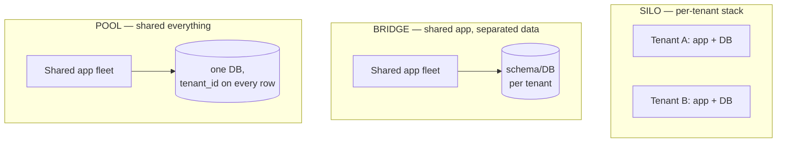

# Multi-Tenancy Patterns

## TL;DR

Multi-tenancy is one deployment serving many customers while pretending to each that they're alone — and the pretense has three layers: **data isolation** (silo: resources per tenant; pool: shared resources with `tenant_id` discipline + row-level security; bridge: hybrids), **performance isolation** (per-tenant rate limits, fair queuing, shuffle sharding — noisy neighbors are an *admission* problem, not a capacity problem), and **operational isolation** (per-tenant cost attribution, lifecycle: onboarding, export, deletion). The standard production answer is **tiered tenancy**: pooled infrastructure for the long tail, silos or dedicated cells for enterprise whales and regulated tenants. Whatever the model, tenant context must be cryptographically derived from auth — never from a client-supplied parameter — and enforced redundantly at the application *and* data layer, because cross-tenant leakage is the one bug class a SaaS business doesn't get to retry.

---

## The Three Models



| | Silo | Bridge (schema/DB-per-tenant) | Pool (shared tables) |
|---|---|---|---|
| Isolation | Strongest (infra boundary) | Strong (no shared tables) | Logical only — discipline + RLS |
| Cost per tenant | Highest; idle waste | Medium | Lowest; marginal tenant ≈ free |
| Onboarding | Provision a stack (minutes–hours) | Create schema/DB (seconds–minutes) | INSERT a row |
| Ceiling | Ops burden grows per tenant | Schema migrations × N tenants; connection counts | One huge dataset: index bloat, vacuum, hot partitions |
| Per-tenant restore / export / delete | Trivial | Easy | A `WHERE` clause and a prayer — design for it explicitly |
| Compliance ("our data must be separate") | Sells itself | Usually acceptable | Hardest conversation |

The bridge model's hidden tax is **migration multiplication**: every schema change runs N times ([Database Migrations](../15-deployment/03-database-migrations.md)), and a migration that's instant on one tenant's 10K rows takes hours on another's 500M. The pool model's hidden tax is that *every single query forever* must carry the tenant predicate — which is why you don't leave that to discipline:

```sql
-- Pool model: make the database enforce what code reviews can't.
ALTER TABLE invoices ENABLE ROW LEVEL SECURITY;

CREATE POLICY tenant_isolation ON invoices
    USING (tenant_id = current_setting('app.tenant_id')::uuid);

-- The app sets the tenant once per transaction, from the verified token:
-- SET LOCAL app.tenant_id = '7c0e...';   ← derived from auth, never from input
```

With RLS (or the equivalent: Spanner/CockroachDB row-level policies, DynamoDB leading-key `tenant_id` with IAM `LeadingKeys` conditions), a forgotten `WHERE tenant_id = ?` returns zero rows instead of another company's invoices. Defense in depth still applies: application-layer scoping *and* database enforcement *and* tests that actively attempt cross-tenant reads ([Authorization at Scale](../10-security/07-authorization-patterns.md) — tenancy is the outermost relation in the authz graph).

### Tiered tenancy: the production default

Real SaaS rarely picks one model. The pattern that wins: **pool the long tail, silo the whales** — free/SMB tiers on shared infrastructure where marginal cost approaches zero; enterprise and regulated tenants on dedicated schemas, databases, or full [cells](./11-cell-based-architecture.md), priced accordingly. Tier placement becomes a product attribute ("dedicated infrastructure" is a line item), and the architecture must support **promotion**: moving a growing tenant from pool to silo is a live data migration (dual-write, verify, flip routing — the same machinery as cell migration), and you will do it under sales pressure, so build it calmly first.

---

## Tenant Context: Identity Is the Root

Everything downstream depends on one rule: **tenant identity is established at authentication and carried in verified context — never inferred from a URL, header, or request body the client controls.** `GET /api/orgs/acme/invoices` with only a path check is an IDOR generator.

```python
@app.middleware
def tenant_context(request):
    claims = verify_jwt(request.token)            # cryptographic source of truth
    request.tenant = claims["org_id"]             # ← the only place tenancy enters

    if request.path_org and request.path_org != request.tenant:
        raise Forbidden("token/org mismatch")     # path is a convenience, not an authority

    db.execute("SET LOCAL app.tenant_id = %s", request.tenant)   # arms RLS
    metrics.tag(tenant=request.tenant)            # observability + cost attribution
    queue_headers["x-tenant"] = request.tenant    # propagate to async work
```

Propagation matters as much as establishment: background jobs, queue consumers, scheduled tasks, and [CDC](../13-data-pipelines/04-change-data-capture.md)-fed pipelines all execute *outside* a request and must carry tenant context explicitly — the classic leak is a batch job or a cache key (`cache[user_id]` instead of `cache[(tenant, user_id)]`) that forgot tenancy exists.

---

## Performance Isolation: The Noisy Neighbor

Shared infrastructure means shared queues, pools, and CPU — and tenant load is brutally skewed (one tenant is routinely 100× the median). Capacity doesn't fix this; **admission control does**:

- **Per-tenant rate limits and concurrency caps** at the front door, sized per tier ([Rate Limiting](./05-rate-limiting.md)). The limit's job is to make one tenant's spike *their* problem.
- **Fair queuing for async work:** never one global FIFO — a whale's 2M-job import parks everyone behind it. Per-tenant queues (or per-tenant sub-queues with round-robin/weighted draining) bound any tenant's share of worker throughput:

```python
def next_job(queues: dict[str, Queue], weights: dict[str, int]):
    """Weighted round-robin across tenant queues — a whale gets its weight, not the fleet."""
    for tenant in weighted_cycle(weights):
        if job := queues[tenant].try_pop():
            return job
```

- **Shuffle sharding** for shared worker fleets, so even a poisonous tenant degrades only its few shard-mates ([Cell-Based Architecture](./11-cell-based-architecture.md)).
- **Per-tenant circuit breaking / load shedding:** when overloaded, shed traffic *by tenant and tier*, not randomly — protecting paying tiers is a policy decision you encode, not an accident ([Backpressure](./07-backpressure.md)).
- **Database-level guards:** statement timeouts per role/tier, per-tenant connection budgets via the pooler, and watch for one tenant's skew turning into a hot partition ([Database Sharding](./03-database-sharding.md) — `tenant_id` as the leading shard key is natural but inherits tenant skew; large tenants may need their own partition).

The observability prerequisite for all of it: metrics tagged by tenant (top-N, not full cardinality), so "p99 is bad" decomposes into "p99 is bad *for whom, caused by whom*" — and cost attribution rides the same tags ([FinOps & Cost Engineering](../11-observability/06-finops-cost-engineering.md)).

---

## Tenant Lifecycle

The operations that distinguish a multi-tenant *product* from a multi-tenant *database*:

- **Onboarding** is a provisioning workflow ([Sagas](../05-messaging/09-saga-pattern.md)): create tenant record → provision tier resources (schema? cell placement?) → seed defaults → issue credentials. Idempotent and resumable, because sales demos happen mid-deploy.
- **Export** ("give us all our data") — contractually promised, GDPR-adjacent, and trivially hard in the pool model unless every table carries `tenant_id` and you've built the extract pipeline. Per-tenant export is also your migration primitive (pool→silo promotion, offboarding to the customer).
- **Deletion** must be provable: enumerate every store that holds tenant data — primary DB, caches, search indexes, object storage, warehouse, logs, backups — and delete or crypto-shred (per-tenant encryption keys make "delete the key" the backstop for stores you can't scrub, like old backups). The data inventory you need here is the same one [residency](./09-multi-region-architecture.md) demands; build it once.
- **Per-tenant restore:** "we deleted everything by accident, restore *us* to yesterday" — trivial in silo, a surgical extract-and-merge in pool. Decide the supported answer per tier *before* it's asked ([Disaster Recovery](../15-deployment/05-disaster-recovery.md)).
- **Testing:** a fleet of synthetic tenants in production (one per tier), exercised continuously — they're your canaries for isolation regressions, and a place to run cross-tenant *attack* tests (every endpoint probed with tenant A's token against tenant B's resources) in CI.

---

## Checklist

- [ ] Tenancy model chosen per tier, with pool→silo promotion built as a live migration
- [ ] Tenant identity derived from verified auth only; propagated to jobs, queues, caches, pipelines
- [ ] Database-level enforcement (RLS / leading-key + IAM) behind application scoping; cross-tenant access tests in CI
- [ ] Per-tenant rate limits, concurrency caps, and fair queuing; shed by tier under overload
- [ ] Tenant-tagged metrics and cost attribution; top-N noisy-tenant dashboards
- [ ] Whales identified and pinned (dedicated schema/cell); pooled-cell placement caps tenant size
- [ ] Export, deletion (incl. backups strategy), and per-tenant restore answered per tier
- [ ] Schema migration plan accounts for N× execution and tenant-size skew (bridge model)
- [ ] Synthetic tenants in production exercising every tier continuously

---

## References

- [AWS Well-Architected SaaS Lens](https://docs.aws.amazon.com/wellarchitected/latest/saas-lens/saas-lens.html) — silo/pool/bridge vocabulary and tiering patterns
- [Architecting multitenant solutions on Azure](https://learn.microsoft.com/en-us/azure/architecture/guide/multitenant/overview) — the deepest public catalog of tenancy trade-offs
- [PostgreSQL Row Level Security](https://www.postgresql.org/docs/current/ddl-rowsecurity.html) and [DynamoDB: condition keys for fine-grained access](https://docs.aws.amazon.com/amazondynamodb/latest/developerguide/specifying-conditions.html)
- [Citus: sharding Postgres by tenant](https://www.citusdata.com/blog/2017/03/09/multi-tenant-sharding-tutorial/) — pool model at scale with tenant-leading keys
- [Stripe: online migrations at scale](https://stripe.com/blog/online-migrations) — the dual-write playbook tenant promotion relies on
