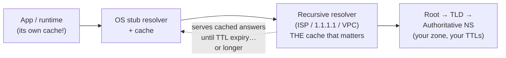
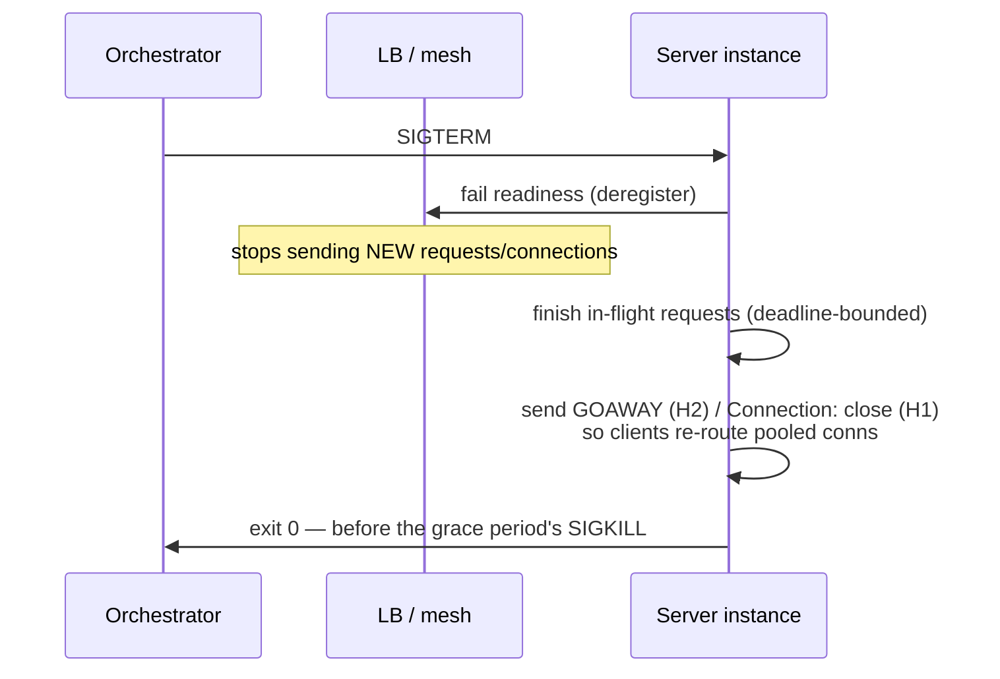

# DNS and Connection Management

## TL;DR

Two unglamorous layers sit under every request and cause an outsized share of real outages. **DNS** is a globally distributed, eventually consistent configuration database whose consistency knob is the TTL — and whose caches (recursive resolvers, operating systems, language runtimes, connection pools) routinely outlive the TTL you set, which is why "we updated the record" and "traffic moved" are different events separated by minutes. Treat DNS changes like deployments, beware negative caching, and never do blocking lookups on a hot path. **Connections** are the other tax: a TCP+TLS handshake costs 1–3 round trips before the first useful byte, so production systems amortize it with keep-alive and pools — sized by Little's law, bounded to protect the server, with client idle timeouts strictly shorter than the server's. The invisible ceilings — ephemeral-port exhaustion, NAT/conntrack table limits, mismatched idle timeouts — each look like random resets until you know to look for them. And on deploys: drain before you kill.

---

## DNS: The Config System Everything Depends On



A lookup walks stub → recursive → (root → TLD → authoritative), and **every hop caches**. The authoritative answer carries your TTL; everything after that is hope:

- **TTL is a ceiling on freshness, not a guarantee of change propagation.** Resolvers generally honor TTLs, but client-side layers add their own: the OS caches, browsers cache, and — the classic — **runtimes pin**: older JVMs cached successful lookups *forever* by default (`networkaddress.cache.ttl`); long-lived connection pools never re-resolve at all because the connection already exists. A "5-minute TTL" failover plan must account for the pool that resolved the address an hour ago and is still happily connected.
- **Failover math:** plan cutover as `TTL + resolver lag + client/pool refresh`, and validate empirically — for serious failovers, drop TTLs *in advance* (the TTL reduction itself takes one old-TTL period to propagate), then make the change. This is why [multi-region designs](./09-multi-region-architecture.md) treat DNS as the *coarse* steering layer and anycast or routing layers as the fast one.
- **Low TTLs aren't free:** TTL 30 on a high-traffic name multiplies resolver load and puts a DNS lookup's latency (and availability) in your users' critical path more often. Typical compromise: 60–300s on failover-relevant names, longer elsewhere.
- **Negative caching (RFC 2308):** NXDOMAIN answers are cached too — governed by the SOA minimum. The trap: you create a *new* record, but clients that asked seconds too early keep getting "does not exist" for the negative-TTL window. Querying a name before it exists effectively delays its birth.
- **DNS as traffic steering** — weighted, latency-based, geo, and health-checked records (plus alias/CNAME-flattening at apexes) make DNS the cheapest global router; its limits are TTL-speed convergence and resolver-granularity (you steer *resolvers*, and ECS only partially fixes that resolvers aggregate many users). Anycast steers per-packet at BGP speed instead ([Cloudflare](../08-case-studies/12-cloudflare.md)); CDNs combine both.
- **Service discovery via DNS** (Kubernetes CoreDNS, `SRV`/headless services, Consul) inherits all of the above *inside* the cluster: TTL-bound staleness vs. push-based discovery through an API/xDS ([Service Discovery](../12-service-mesh/01-service-discovery.md)). Fine for slowly-changing names; wrong as the only mechanism for fast endpoint churn — which is precisely what sidecars and load-balancer APIs solve.

**Failure modes to engineer against:** resolver outage (your app's availability now includes your resolver's — run redundant resolvers, cache in-process with TTL respect); slow DNS turning into thread-pool exhaustion (synchronous `getaddrinfo` on the request path with no timeout — give resolution its own timeout and do it off the hot path); and retry amplification when a popular name fails (every request retries resolution — [the usual storm math](./10-retries-timeouts-hedging.md)). For tier-0 dependencies, know your story for "DNS is down entirely": cached last-known-good answers beat hard failure.

---

## Connections: Amortizing the Handshake

The cost model that justifies everything else:

```
New HTTPS connection ≈ TCP (1 RTT) + TLS 1.3 (1 RTT; 2 for 1.2) + slow start ramp
At 1ms intra-DC: ~2-3ms overhead per request without reuse — 10x a fast request.
At 80ms cross-region: ~160-240ms before byte one. Reuse is not optional.
```

**Keep-alive + pooling** turns that into a one-time cost. The engineering is in the sizing and the edges:

- **Size pools with Little's law** ([Capacity Planning](../01-foundations/10-capacity-planning.md)): busy connections = QPS × mean latency. 2,000 QPS at 5ms = 10 busy; a pool of 20–30 covers bursts. Pools sized "big to be safe" (500) are how one degraded service DDoSes its own database during an incident — the pool *is* an admission-control valve; cap it near what the server can actually serve concurrently, and let excess requests queue or shed at the client ([Backpressure](./07-backpressure.md)).
- **Per-destination limits and fairness:** N service instances × pool size = the connection count your database sees. 200 pods × 50 connections = 10,000 backend connections — hence server-side poolers (PgBouncer-style) and per-client caps ([Multi-Tenancy](./12-multi-tenancy.md) logic at the connection layer).
- **The idle-timeout race:** if the server closes idle connections at 60s and your client considers them reusable for 65s, the client periodically writes into a connection the server just closed — surfacing as sporadic `connection reset`/`broken pipe` under low traffic. Rule: **client idle timeout < server idle timeout** (and LB idle timeouts sit between them; check all three). Validate-on-borrow or low TCP keepalive intervals are the belt-and-suspenders.
- **Pools pin DNS:** a pooled connection never re-resolves. Pair pools with bounded connection *lifetime* (e.g., max age 5–15 min) so endpoints rotated via DNS/discovery actually drain — this single setting is the difference between "failover in minutes" and "failover when every pod restarts."

### The invisible ceilings

- **Ephemeral port exhaustion:** an outbound connection consumes a local port per (src IP, dst IP, dst port) tuple — ~28K–64K ports per source IP, and closed connections linger in `TIME_WAIT` (≈60s). A proxy doing 2,000 *new* connections/s to one backend exhausts the tuple space in seconds. Fixes, in order: **reuse connections** (the whole point), more source IPs, then kernel tuning — not the reverse.
- **NAT / conntrack limits:** cloud NAT gateways allot finite SNAT ports per source (and Linux conntrack tables have finite entries). Symptom: outbound connections to *one* popular destination (an API, a SaaS) time out intermittently at scale while everything else is fine. Same fix hierarchy: reuse, then private connectivity/endpoints for chatty destinations, then bigger NAT allocations.
- **Protocol head-of-line:** HTTP/1.1 = one request at a time per connection (hence browsers' 6-connection workaround); HTTP/2 multiplexes streams over one connection but inherits **TCP's** head-of-line blocking under packet loss — one lost segment stalls all streams; HTTP/3/QUIC fixes that with independent streams ([the QUIC section in CDN Architecture](./04-cdn-architecture.md)); the wire-level mechanics — slow start, congestion control, QUIC internals — are in [Network Transport Internals](./14-network-transport-internals.md). Internally, gRPC-over-H2 plus the mesh's connection management is the standard answer ([Sidecar Pattern](../12-service-mesh/03-sidecar-pattern.md)).

### Graceful shutdown: draining

Deploys and scale-downs kill processes that hold live connections; done naively, every deploy is a micro-outage. The sequence ([Deployment Strategies](../15-deployment/01-deployment-strategies.md)):



The details that bite: deregistration must *precede* shutdown and propagate (sleep a few seconds after failing readiness — LB updates aren't instant); long-lived streams (WebSockets, gRPC streams, [SSE](../07-real-time/03-server-sent-events.md)) need an application-level "please reconnect" signal, because draining can't wait for a 4-hour stream; and the grace period must exceed your p99 request *plus* the drain choreography, or SIGKILL undoes the politeness. Lame-duck mode — serving while advertising "stop picking me" — is the same idea for service meshes.

---

## Checklist

- [ ] Failover-relevant DNS names have planned TTLs, a measured propagation budget, and a rehearsed change procedure (TTL pre-drop → change → verify from multiple resolvers)
- [ ] No blocking, timeout-less DNS resolution on request paths; in-process caching respects TTLs; runtime pinning settings audited (JVM et al.)
- [ ] Negative-caching window known for any "create then immediately use" record flow
- [ ] Pools sized from λ×W, capped to protect servers; per-destination connection counts computed fleet-wide
- [ ] Client idle < LB idle < server idle; bounded connection max-age so endpoints actually drain
- [ ] Outbound hot paths audited for ephemeral-port/SNAT ceilings (connections/s × destinations math done)
- [ ] Shutdown: deregister → drain (deadline) → GOAWAY → exit, with grace period > p99 + choreography; long-lived streams have a reconnect protocol
- [ ] Connection metrics exported: pool utilization/wait time, new-vs-reused ratio, resets, handshake latency — pool wait time is a leading indicator of saturation ([the utilization curve](../01-foundations/10-capacity-planning.md))

---

## References

- [RFC 1034/1035](https://www.rfc-editor.org/rfc/rfc1034) and [RFC 2308 (negative caching)](https://www.rfc-editor.org/rfc/rfc2308) — the actual semantics
- [Cloudflare Learning Center: DNS](https://www.cloudflare.com/learning/dns/what-is-dns/) — the resolution path, readably
- [Kubernetes: DNS for Services and Pods](https://kubernetes.io/docs/concepts/services-networking/dns-pod-service/) and [Debugging DNS Resolution](https://kubernetes.io/docs/tasks/administer-cluster/dns-debugging-resolution/) — in-cluster realities (ndots and friends)
- [AWS: NAT gateway port allocation](https://docs.aws.amazon.com/vpc/latest/userguide/nat-gateway-troubleshooting.html) and [Azure SNAT exhaustion guidance](https://learn.microsoft.com/en-us/azure/load-balancer/troubleshoot-outbound-connection) — the invisible ceilings, documented by their owners
- [Envoy: connection pooling](https://www.envoyproxy.io/docs/envoy/latest/intro/arch_overview/upstream/connection_pooling) — production pool semantics, per protocol
- *High Performance Browser Networking* (Ilya Grigorik) — handshake costs, keep-alive, H2; free online and still the best single reference
