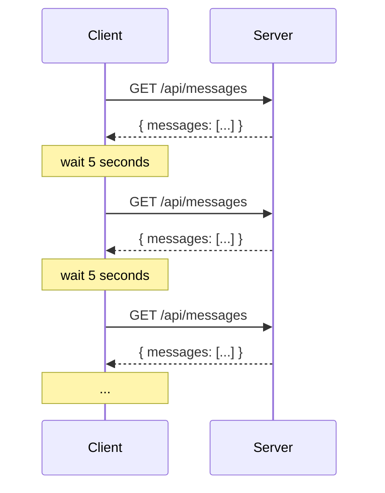
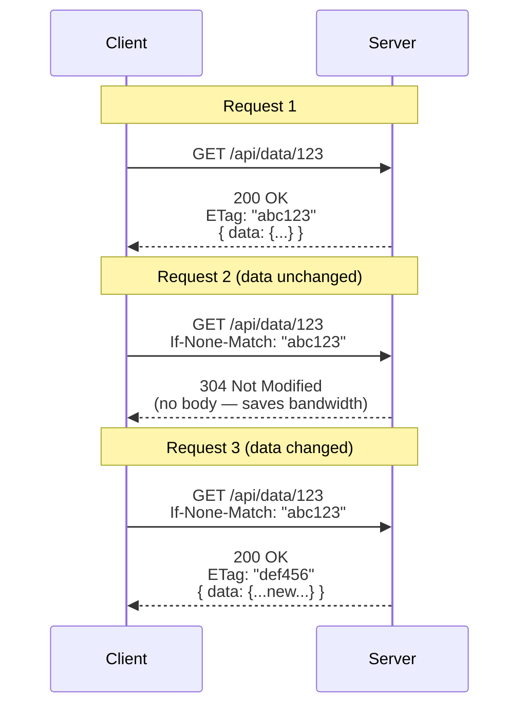

# Polling

## TL;DR

Polling is the simplest real-time communication pattern where clients periodically request updates from the server at fixed intervals. While inefficient compared to push-based alternatives, polling is universally supported, easy to implement, and works behind any firewall. It's suitable for low-frequency updates or as a fallback mechanism.

---

## How Polling Works



---

## Basic Implementation

### Client-Side Polling

```javascript
class PollingClient {
  constructor(url, interval = 5000) {
    this.url = url;
    this.interval = interval;
    this.isPolling = false;
    this.lastTimestamp = null;
    this.callbacks = [];
  }

  start() {
    if (this.isPolling) return;
    this.isPolling = true;
    this.poll();
  }

  stop() {
    this.isPolling = false;
  }

  onUpdate(callback) {
    this.callbacks.push(callback);
  }

  async poll() {
    while (this.isPolling) {
      try {
        const params = new URLSearchParams();
        if (this.lastTimestamp) {
          params.set('since', this.lastTimestamp);
        }

        const response = await fetch(`${this.url}?${params}`);
        const data = await response.json();

        if (data.updates && data.updates.length > 0) {
          this.lastTimestamp = data.timestamp;
          this.callbacks.forEach(cb => cb(data.updates));
        }

        // Wait before next poll
        await this.sleep(this.interval);
      } catch (error) {
        console.error('Polling error:', error);
        // Exponential backoff on error
        await this.sleep(this.interval * 2);
      }
    }
  }

  sleep(ms) {
    return new Promise(resolve => setTimeout(resolve, ms));
  }
}

// Usage
const poller = new PollingClient('/api/notifications', 5000);
poller.onUpdate((updates) => {
  updates.forEach(update => {
    displayNotification(update);
  });
});
poller.start();
```

### Server-Side Endpoint

```python
from flask import Flask, request, jsonify
from datetime import datetime
import time

app = Flask(__name__)

# In-memory store (use Redis in production)
messages = []
last_id = 0

@app.route('/api/messages', methods=['GET'])
def get_messages():
    """
    Polling endpoint that returns messages since last check.
    """
    since = request.args.get('since', type=float, default=0)
    
    # Get messages since timestamp
    new_messages = [
        msg for msg in messages 
        if msg['timestamp'] > since
    ]
    
    return jsonify({
        'messages': new_messages,
        'timestamp': time.time(),
        'count': len(new_messages)
    })

@app.route('/api/messages', methods=['POST'])
def post_message():
    """Add a new message."""
    global last_id
    last_id += 1
    
    message = {
        'id': last_id,
        'content': request.json['content'],
        'timestamp': time.time()
    }
    messages.append(message)
    
    return jsonify(message), 201
```

---

## Optimizing Polling

### Conditional Requests (ETag)

```python
import hashlib
import json

class ConditionalPollingHandler:
    """Use ETags to avoid sending unchanged data."""
    
    def __init__(self):
        self.data_cache = {}
    
    def generate_etag(self, data: dict) -> str:
        """Generate ETag from data content."""
        content = json.dumps(data, sort_keys=True)
        return hashlib.md5(content.encode()).hexdigest()
    
    def handle_poll(self, resource_id: str, if_none_match: str = None):
        # Get current data
        data = self.get_resource_data(resource_id)
        current_etag = self.generate_etag(data)
        
        # Check if client has current version
        if if_none_match == current_etag:
            # Data unchanged - return 304
            return None, 304, {'ETag': current_etag}
        
        # Return new data
        return data, 200, {'ETag': current_etag}

# Flask implementation
@app.route('/api/data/<resource_id>')
def get_data(resource_id):
    if_none_match = request.headers.get('If-None-Match')
    
    data, status, headers = handler.handle_poll(resource_id, if_none_match)
    
    if status == 304:
        return '', 304, headers
    
    response = jsonify(data)
    for key, value in headers.items():
        response.headers[key] = value
    return response
```



### Adaptive Polling Interval

```javascript
class AdaptivePollingClient {
  constructor(url, options = {}) {
    this.url = url;
    this.minInterval = options.minInterval || 1000;   // 1 second
    this.maxInterval = options.maxInterval || 60000;  // 1 minute
    this.currentInterval = options.initialInterval || 5000;
    this.decayFactor = options.decayFactor || 1.5;
    this.boostFactor = options.boostFactor || 0.5;
    this.consecutiveEmpty = 0;
  }

  adjustInterval(hasUpdates) {
    if (hasUpdates) {
      // Updates found - poll more frequently
      this.consecutiveEmpty = 0;
      this.currentInterval = Math.max(
        this.minInterval,
        this.currentInterval * this.boostFactor
      );
    } else {
      // No updates - slow down
      this.consecutiveEmpty++;
      if (this.consecutiveEmpty >= 3) {
        this.currentInterval = Math.min(
          this.maxInterval,
          this.currentInterval * this.decayFactor
        );
      }
    }
    
    console.log(`Next poll in ${this.currentInterval}ms`);
    return this.currentInterval;
  }

  async poll() {
    while (this.isPolling) {
      try {
        const response = await fetch(this.url);
        const data = await response.json();
        
        const hasUpdates = data.updates && data.updates.length > 0;
        
        if (hasUpdates) {
          this.handleUpdates(data.updates);
        }
        
        const nextInterval = this.adjustInterval(hasUpdates);
        await this.sleep(nextInterval);
        
      } catch (error) {
        // Error - increase interval
        this.currentInterval = Math.min(
          this.maxInterval,
          this.currentInterval * 2
        );
        await this.sleep(this.currentInterval);
      }
    }
  }
}
```

```
Adaptive Polling Visualization:

Activity Level:   High  ←─────────────────────→  Low
                    │                              │
Polling Interval:  1s   2s   5s   10s   30s   60s
                    │                              │
                    └──────────────────────────────┘
                    
When updates found: Interval decreases (more polling)
When no updates:    Interval increases (less polling)
```

### Batched Polling

```python
from flask import Flask, request, jsonify
from typing import List, Dict
import time

app = Flask(__name__)

class BatchPollingEndpoint:
    """
    Single endpoint that returns updates for multiple resources.
    Reduces number of HTTP requests.
    """
    
    def __init__(self):
        self.resources = {}
    
    def get_updates(self, resource_ids: List[str], since: float) -> Dict:
        """Get updates for multiple resources at once."""
        updates = {}
        
        for resource_id in resource_ids:
            if resource_id in self.resources:
                resource_updates = [
                    item for item in self.resources[resource_id]
                    if item['timestamp'] > since
                ]
                if resource_updates:
                    updates[resource_id] = resource_updates
        
        return {
            'updates': updates,
            'timestamp': time.time(),
            'resources_checked': len(resource_ids)
        }

batch_endpoint = BatchPollingEndpoint()

@app.route('/api/poll', methods=['POST'])
def batch_poll():
    """
    Batch polling endpoint.
    
    Request body:
    {
        "resources": ["messages", "notifications", "presence"],
        "since": 1609459200.123
    }
    """
    data = request.json
    resource_ids = data.get('resources', [])
    since = data.get('since', 0)
    
    result = batch_endpoint.get_updates(resource_ids, since)
    return jsonify(result)
```

```javascript
// Client-side batch polling
class BatchPollingClient {
  constructor(url, resources, interval = 5000) {
    this.url = url;
    this.resources = resources; // ['messages', 'notifications', 'presence']
    this.interval = interval;
    this.lastTimestamp = 0;
  }

  async poll() {
    const response = await fetch(this.url, {
      method: 'POST',
      headers: { 'Content-Type': 'application/json' },
      body: JSON.stringify({
        resources: this.resources,
        since: this.lastTimestamp
      })
    });

    const data = await response.json();
    this.lastTimestamp = data.timestamp;

    // Process updates by resource
    for (const [resource, updates] of Object.entries(data.updates)) {
      this.handleUpdates(resource, updates);
    }
  }
}
```

---

## Polling with Database Optimization

### Efficient Change Detection

```python
from datetime import datetime
from typing import List, Optional
import redis
from sqlalchemy import Column, Integer, String, DateTime, func
from sqlalchemy.orm import Session

class PollingOptimizer:
    """
    Use Redis to track changes and avoid expensive DB queries.
    """
    
    def __init__(self, redis_client: redis.Redis):
        self.redis = redis_client
        self.change_key_prefix = "changes:"
    
    def record_change(self, resource_type: str, resource_id: str):
        """Record that a resource changed."""
        key = f"{self.change_key_prefix}{resource_type}"
        timestamp = time.time()
        
        # Add to sorted set with timestamp as score
        self.redis.zadd(key, {resource_id: timestamp})
        
        # Trim old entries (keep last hour)
        cutoff = timestamp - 3600
        self.redis.zremrangebyscore(key, '-inf', cutoff)
    
    def get_changed_ids(self, resource_type: str, since: float) -> List[str]:
        """Get IDs of resources changed since timestamp."""
        key = f"{self.change_key_prefix}{resource_type}"
        
        # Get all IDs with score > since
        changed = self.redis.zrangebyscore(
            key, 
            f'({since}',  # Exclusive
            '+inf'
        )
        
        return [id.decode() for id in changed]
    
    def has_changes(self, resource_type: str, since: float) -> bool:
        """Quick check if any changes exist."""
        key = f"{self.change_key_prefix}{resource_type}"
        count = self.redis.zcount(key, f'({since}', '+inf')
        return count > 0

# Usage in polling endpoint
optimizer = PollingOptimizer(redis.Redis())

@app.route('/api/messages')
def get_messages():
    since = request.args.get('since', type=float, default=0)
    
    # Quick check - are there any changes?
    if not optimizer.has_changes('messages', since):
        return jsonify({'messages': [], 'timestamp': time.time()})
    
    # Get only changed message IDs
    changed_ids = optimizer.get_changed_ids('messages', since)
    
    # Fetch only changed messages from DB
    messages = db.session.query(Message)\
        .filter(Message.id.in_(changed_ids))\
        .all()
    
    return jsonify({
        'messages': [m.to_dict() for m in messages],
        'timestamp': time.time()
    })
```

### Cursor-Based Pagination

```python
from typing import Optional, List, Tuple
import base64
import json

class CursorPaginator:
    """
    Cursor-based pagination for efficient polling.
    Better than offset-based for real-time data.
    """
    
    def encode_cursor(self, timestamp: float, id: int) -> str:
        """Encode cursor from timestamp and ID."""
        data = {'ts': timestamp, 'id': id}
        return base64.urlsafe_b64encode(
            json.dumps(data).encode()
        ).decode()
    
    def decode_cursor(self, cursor: str) -> Tuple[float, int]:
        """Decode cursor to timestamp and ID."""
        try:
            data = json.loads(
                base64.urlsafe_b64decode(cursor.encode())
            )
            return data['ts'], data['id']
        except Exception:
            return 0, 0
    
    def get_page(
        self, 
        query, 
        cursor: Optional[str] = None,
        limit: int = 50
    ) -> Tuple[List, Optional[str]]:
        """
        Get a page of results after cursor.
        Returns (items, next_cursor).
        """
        if cursor:
            timestamp, last_id = self.decode_cursor(cursor)
            # Get items after cursor position
            query = query.filter(
                db.or_(
                    Message.timestamp > timestamp,
                    db.and_(
                        Message.timestamp == timestamp,
                        Message.id > last_id
                    )
                )
            )
        
        # Order by timestamp, then ID for stability
        items = query.order_by(
            Message.timestamp.asc(),
            Message.id.asc()
        ).limit(limit + 1).all()
        
        # Check if there are more items
        has_more = len(items) > limit
        if has_more:
            items = items[:limit]
        
        # Generate next cursor
        next_cursor = None
        if has_more and items:
            last_item = items[-1]
            next_cursor = self.encode_cursor(
                last_item.timestamp,
                last_item.id
            )
        
        return items, next_cursor

# Polling endpoint with cursor
paginator = CursorPaginator()

@app.route('/api/feed')
def get_feed():
    cursor = request.args.get('cursor')
    
    query = db.session.query(Message)
    items, next_cursor = paginator.get_page(query, cursor)
    
    return jsonify({
        'items': [item.to_dict() for item in items],
        'next_cursor': next_cursor,
        'has_more': next_cursor is not None
    })
```

---

## Polling Infrastructure

### Rate Limiting for Polling

```python
from functools import wraps
import time

class PollingRateLimiter:
    """
    Rate limit polling requests to prevent abuse.
    """
    
    def __init__(self, redis_client, min_interval: float = 1.0):
        self.redis = redis_client
        self.min_interval = min_interval
    
    def check_rate(self, client_id: str, endpoint: str) -> Tuple[bool, float]:
        """
        Check if client can poll.
        Returns (allowed, wait_time).
        """
        key = f"poll_rate:{endpoint}:{client_id}"
        now = time.time()
        
        last_poll = self.redis.get(key)
        if last_poll:
            elapsed = now - float(last_poll)
            if elapsed < self.min_interval:
                return False, self.min_interval - elapsed
        
        # Record this poll
        self.redis.setex(key, int(self.min_interval * 2), str(now))
        return True, 0

def rate_limited_poll(min_interval=1.0):
    """Decorator for rate-limited polling endpoints."""
    limiter = PollingRateLimiter(redis.Redis(), min_interval)
    
    def decorator(f):
        @wraps(f)
        def wrapper(*args, **kwargs):
            client_id = request.headers.get('X-Client-ID') or request.remote_addr
            endpoint = request.endpoint
            
            allowed, wait_time = limiter.check_rate(client_id, endpoint)
            
            if not allowed:
                return jsonify({
                    'error': 'Too many requests',
                    'retry_after': wait_time
                }), 429, {'Retry-After': str(int(wait_time) + 1)}
            
            return f(*args, **kwargs)
        return wrapper
    return decorator

@app.route('/api/updates')
@rate_limited_poll(min_interval=2.0)  # Max one poll every 2 seconds
def get_updates():
    # ... endpoint logic
    pass
```

### Server-Side Aggregation

```python
from collections import defaultdict
from threading import Lock
import time

class PollingAggregator:
    """
    Aggregate updates server-side to reduce DB queries.
    Multiple clients polling get same cached response.
    """
    
    def __init__(self, cache_ttl: float = 1.0):
        self.cache = {}
        self.cache_ttl = cache_ttl
        self.lock = Lock()
    
    def get_cached_or_compute(
        self, 
        cache_key: str, 
        compute_fn, 
        since: float
    ):
        """
        Return cached response or compute new one.
        """
        now = time.time()
        
        with self.lock:
            if cache_key in self.cache:
                cached_time, cached_since, cached_data = self.cache[cache_key]
                
                # Check if cache is fresh and covers requested time range
                if now - cached_time < self.cache_ttl and cached_since <= since:
                    # Filter to only include updates since requested time
                    filtered = [
                        item for item in cached_data 
                        if item['timestamp'] > since
                    ]
                    return filtered
            
            # Compute new result
            data = compute_fn()
            
            # Cache the result
            min_since = min(item['timestamp'] for item in data) if data else now
            self.cache[cache_key] = (now, min_since, data)
            
            return [item for item in data if item['timestamp'] > since]

aggregator = PollingAggregator(cache_ttl=1.0)

@app.route('/api/timeline')
def get_timeline():
    since = request.args.get('since', type=float, default=0)
    
    def compute():
        # Expensive DB query
        return db.session.query(Post)\
            .filter(Post.timestamp > time.time() - 3600)\
            .order_by(Post.timestamp.desc())\
            .limit(100)\
            .all()
    
    # Multiple clients polling within 1 second get same response
    posts = aggregator.get_cached_or_compute('timeline', compute, since)
    
    return jsonify({
        'posts': posts,
        'timestamp': time.time()
    })
```

---

## When to Use Polling

```
Decision Matrix:

                            Polling    Long-Polling    SSE    WebSocket
                            ─────────────────────────────────────────────
Update Frequency:
  Low (< 1/min)              ✓✓✓          ✓✓          ✓         ✓
  Medium (1/sec)              ✓           ✓✓         ✓✓        ✓✓
  High (10+/sec)              ✗            ✓          ✓        ✓✓✓

Simplicity:
  Implementation             ✓✓✓          ✓✓          ✓✓        ✓
  Debugging                  ✓✓✓          ✓✓          ✓✓        ✓
  
Infrastructure:
  Firewall friendly          ✓✓✓          ✓✓          ✓✓        ✓
  Load balancer friendly     ✓✓✓          ✓✓          ✓✓        ✓
  CDN cacheable              ✓✓✓          ✗           ✗         ✗

Use Polling When:
• Update frequency is low (< 1 per minute)
• Simplicity is priority
• Working with restrictive network environments
• Need CDN caching
• As fallback for WebSocket/SSE

Avoid Polling When:
• Real-time is critical (< 100ms latency required)
• High update frequency (creates too much traffic)
• Many concurrent users (server load)
```

---

## Key Takeaways

1. **Use conditional requests**: ETags and If-None-Match reduce bandwidth for unchanged data

2. **Implement adaptive intervals**: Increase polling frequency when active, decrease when idle

3. **Batch resources**: Single request for multiple resources reduces HTTP overhead

4. **Optimize database access**: Use change tracking (Redis) to avoid expensive queries

5. **Rate limit polling**: Prevent abuse and server overload from aggressive clients

6. **Cache server-side**: Aggregate identical polling requests to reduce database load

7. **Know when to upgrade**: Consider long-polling, SSE, or WebSockets for more real-time needs
