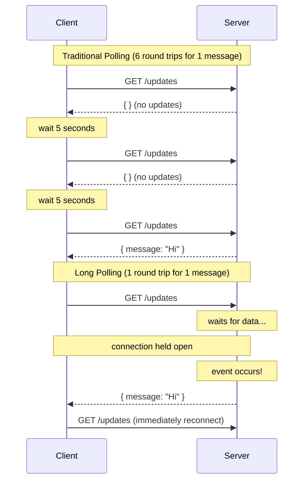
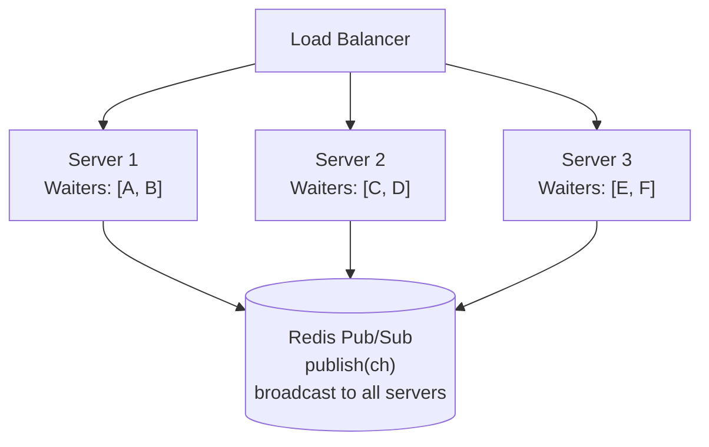

# Long Polling

## TL;DR

Long polling is an evolution of traditional polling where the server holds the request open until new data is available or a timeout occurs. This reduces unnecessary requests while providing near-real-time updates. The client immediately reconnects after each response, creating a persistent connection effect without WebSocket complexity.

---

## How Long Polling Works



---

## Basic Implementation

### Server-Side (Python/Flask)

```python
from flask import Flask, request, jsonify, Response
from threading import Event, Lock
from collections import defaultdict
import time
import uuid
import queue

app = Flask(__name__)

class LongPollingManager:
    def __init__(self, timeout: int = 30):
        self.timeout = timeout
        self.waiters = defaultdict(list)  # channel -> list of Events
        self.messages = defaultdict(queue.Queue)  # channel -> message queue
        self.lock = Lock()
    
    def wait_for_message(self, channel: str, timeout: float = None) -> dict:
        """
        Wait for a message on the channel.
        Blocks until message arrives or timeout.
        """
        timeout = timeout or self.timeout
        event = Event()
        message_holder = {'message': None}
        
        with self.lock:
            self.waiters[channel].append((event, message_holder))
        
        try:
            # Wait for event or timeout
            got_message = event.wait(timeout=timeout)
            
            if got_message and message_holder['message']:
                return message_holder['message']
            return None
        finally:
            with self.lock:
                self.waiters[channel] = [
                    w for w in self.waiters[channel] 
                    if w[0] != event
                ]
    
    def publish(self, channel: str, message: dict):
        """Publish message to all waiters on channel."""
        with self.lock:
            waiters = self.waiters[channel][:]
        
        for event, holder in waiters:
            holder['message'] = message
            event.set()

manager = LongPollingManager(timeout=30)

@app.route('/api/poll/<channel>')
def long_poll(channel):
    """
    Long polling endpoint.
    Holds connection until message or timeout.
    """
    since = request.args.get('since', type=float, default=0)
    timeout = request.args.get('timeout', type=float, default=30)
    timeout = min(timeout, 60)  # Cap at 60 seconds
    
    message = manager.wait_for_message(channel, timeout)
    
    if message:
        return jsonify({
            'status': 'message',
            'data': message,
            'timestamp': time.time()
        })
    else:
        return jsonify({
            'status': 'timeout',
            'timestamp': time.time()
        })

@app.route('/api/publish/<channel>', methods=['POST'])
def publish(channel):
    """Publish message to channel."""
    message = request.json
    message['id'] = str(uuid.uuid4())
    message['timestamp'] = time.time()
    
    manager.publish(channel, message)
    
    return jsonify({'status': 'published', 'message_id': message['id']})
```

### Client-Side (JavaScript)

```javascript
class LongPollingClient {
  constructor(baseUrl, channel, options = {}) {
    this.baseUrl = baseUrl;
    this.channel = channel;
    this.timeout = options.timeout || 30000;
    this.retryDelay = options.retryDelay || 1000;
    this.maxRetries = options.maxRetries || 5;
    this.isRunning = false;
    this.lastTimestamp = 0;
    this.retryCount = 0;
    this.abortController = null;
    this.callbacks = {
      message: [],
      error: [],
      connected: [],
      disconnected: []
    };
  }

  on(event, callback) {
    if (this.callbacks[event]) {
      this.callbacks[event].push(callback);
    }
  }

  emit(event, data) {
    if (this.callbacks[event]) {
      this.callbacks[event].forEach(cb => cb(data));
    }
  }

  async start() {
    if (this.isRunning) return;
    this.isRunning = true;
    this.emit('connected', { channel: this.channel });
    this.poll();
  }

  stop() {
    this.isRunning = false;
    if (this.abortController) {
      this.abortController.abort();
    }
    this.emit('disconnected', { channel: this.channel });
  }

  async poll() {
    while (this.isRunning) {
      try {
        this.abortController = new AbortController();
        
        const url = `${this.baseUrl}/poll/${this.channel}?` + 
          `since=${this.lastTimestamp}&timeout=${this.timeout / 1000}`;
        
        const response = await fetch(url, {
          signal: this.abortController.signal,
          // Important: set timeout slightly longer than server timeout
          timeout: this.timeout + 5000
        });

        if (!response.ok) {
          throw new Error(`HTTP ${response.status}`);
        }

        const data = await response.json();
        this.retryCount = 0; // Reset on success

        if (data.status === 'message') {
          this.lastTimestamp = data.timestamp;
          this.emit('message', data.data);
        }
        // On timeout, just continue polling

      } catch (error) {
        if (error.name === 'AbortError') {
          continue; // Normal stop
        }

        this.emit('error', error);
        this.retryCount++;

        if (this.retryCount >= this.maxRetries) {
          this.emit('disconnected', { reason: 'max_retries' });
          this.isRunning = false;
          return;
        }

        // Exponential backoff
        const delay = this.retryDelay * Math.pow(2, this.retryCount - 1);
        await this.sleep(Math.min(delay, 30000));
      }
    }
  }

  sleep(ms) {
    return new Promise(resolve => setTimeout(resolve, ms));
  }
}

// Usage
const client = new LongPollingClient('https://api.example.com', 'notifications');

client.on('message', (data) => {
  console.log('Received:', data);
  showNotification(data);
});

client.on('error', (error) => {
  console.error('Long polling error:', error);
});

client.start();
```

---

## Scaling Long Polling

### Redis Pub/Sub Backend

```python
import redis
import json
import threading
from typing import Callable, Dict, List
from flask import Flask
import gevent
from gevent import queue as gevent_queue

class RedisLongPollingManager:
    """
    Scalable long polling using Redis pub/sub.
    Works across multiple server instances.
    """
    
    def __init__(self, redis_url: str = 'redis://localhost:6379'):
        self.redis = redis.from_url(redis_url)
        self.pubsub = self.redis.pubsub()
        self.local_waiters: Dict[str, List] = {}
        self.lock = threading.Lock()
        
        # Start listener thread
        self.listener_thread = threading.Thread(target=self._listen)
        self.listener_thread.daemon = True
        self.listener_thread.start()
    
    def _listen(self):
        """Background thread listening to Redis."""
        for message in self.pubsub.listen():
            if message['type'] == 'message':
                channel = message['channel'].decode()
                data = json.loads(message['data'])
                self._notify_local_waiters(channel, data)
    
    def _notify_local_waiters(self, channel: str, data: dict):
        """Notify all local waiters for this channel."""
        with self.lock:
            waiters = self.local_waiters.get(channel, [])[:]
        
        for waiter_queue in waiters:
            try:
                waiter_queue.put(data)
            except:
                pass
    
    def subscribe(self, channel: str):
        """Subscribe to a channel."""
        self.pubsub.subscribe(channel)
    
    def wait_for_message(self, channel: str, timeout: float = 30) -> dict:
        """Wait for message with gevent-compatible queue."""
        waiter_queue = gevent_queue.Queue()
        
        with self.lock:
            if channel not in self.local_waiters:
                self.local_waiters[channel] = []
                self.subscribe(channel)
            self.local_waiters[channel].append(waiter_queue)
        
        try:
            return waiter_queue.get(timeout=timeout)
        except gevent_queue.Empty:
            return None
        finally:
            with self.lock:
                if channel in self.local_waiters:
                    self.local_waiters[channel] = [
                        w for w in self.local_waiters[channel]
                        if w != waiter_queue
                    ]
    
    def publish(self, channel: str, message: dict):
        """Publish message to Redis (all instances)."""
        self.redis.publish(channel, json.dumps(message))
```



### Connection Limits and Timeouts

```python
from dataclasses import dataclass
from typing import Dict, Set
import time

@dataclass
class ConnectionLimit:
    max_per_client: int = 6      # Max concurrent connections per client
    max_per_channel: int = 10000  # Max concurrent per channel
    max_total: int = 100000       # Max total connections

class ConnectionManager:
    """Manage connection limits for long polling."""
    
    def __init__(self, limits: ConnectionLimit = None):
        self.limits = limits or ConnectionLimit()
        self.connections_by_client: Dict[str, Set[str]] = {}
        self.connections_by_channel: Dict[str, int] = {}
        self.total_connections = 0
        self.lock = threading.Lock()
    
    def can_connect(self, client_id: str, channel: str) -> tuple[bool, str]:
        """Check if new connection is allowed."""
        with self.lock:
            # Check total limit
            if self.total_connections >= self.limits.max_total:
                return False, "Server at capacity"
            
            # Check per-client limit
            client_conns = self.connections_by_client.get(client_id, set())
            if len(client_conns) >= self.limits.max_per_client:
                return False, "Too many connections from client"
            
            # Check per-channel limit
            channel_count = self.connections_by_channel.get(channel, 0)
            if channel_count >= self.limits.max_per_channel:
                return False, "Channel at capacity"
            
            return True, ""
    
    def add_connection(self, client_id: str, channel: str, conn_id: str):
        """Register new connection."""
        with self.lock:
            if client_id not in self.connections_by_client:
                self.connections_by_client[client_id] = set()
            self.connections_by_client[client_id].add(conn_id)
            
            self.connections_by_channel[channel] = \
                self.connections_by_channel.get(channel, 0) + 1
            
            self.total_connections += 1
    
    def remove_connection(self, client_id: str, channel: str, conn_id: str):
        """Unregister connection."""
        with self.lock:
            if client_id in self.connections_by_client:
                self.connections_by_client[client_id].discard(conn_id)
                if not self.connections_by_client[client_id]:
                    del self.connections_by_client[client_id]
            
            if channel in self.connections_by_channel:
                self.connections_by_channel[channel] -= 1
                if self.connections_by_channel[channel] <= 0:
                    del self.connections_by_channel[channel]
            
            self.total_connections = max(0, self.total_connections - 1)

# Use in endpoint
conn_manager = ConnectionManager()

@app.route('/api/poll/<channel>')
def long_poll_with_limits(channel):
    client_id = request.headers.get('X-Client-ID') or request.remote_addr
    conn_id = str(uuid.uuid4())
    
    # Check limits
    allowed, reason = conn_manager.can_connect(client_id, channel)
    if not allowed:
        return jsonify({'error': reason}), 429
    
    conn_manager.add_connection(client_id, channel, conn_id)
    
    try:
        message = manager.wait_for_message(channel, timeout=30)
        return jsonify({'data': message, 'timestamp': time.time()})
    finally:
        conn_manager.remove_connection(client_id, channel, conn_id)
```

---

## Message Queuing for Reliability

```python
from collections import deque
from dataclasses import dataclass
from typing import List, Optional
import time

@dataclass
class QueuedMessage:
    id: str
    data: dict
    timestamp: float
    delivered_to: set  # Client IDs that received this message

class MessageQueue:
    """
    Message queue for reliable long polling.
    Clients can catch up on missed messages.
    """
    
    def __init__(self, max_age: float = 300, max_size: int = 1000):
        self.max_age = max_age
        self.max_size = max_size
        self.messages: deque = deque(maxlen=max_size)
        self.lock = threading.Lock()
    
    def add_message(self, message_id: str, data: dict) -> QueuedMessage:
        """Add message to queue."""
        msg = QueuedMessage(
            id=message_id,
            data=data,
            timestamp=time.time(),
            delivered_to=set()
        )
        
        with self.lock:
            self.messages.append(msg)
            self._cleanup()
        
        return msg
    
    def get_messages_since(
        self, 
        since_id: Optional[str],
        since_timestamp: float,
        client_id: str
    ) -> List[dict]:
        """Get messages since given point."""
        with self.lock:
            self._cleanup()
            
            result = []
            found_since = since_id is None
            
            for msg in self.messages:
                if not found_since:
                    if msg.id == since_id:
                        found_since = True
                    continue
                
                if msg.timestamp > since_timestamp:
                    result.append(msg.data)
                    msg.delivered_to.add(client_id)
            
            return result
    
    def _cleanup(self):
        """Remove expired messages."""
        cutoff = time.time() - self.max_age
        while self.messages and self.messages[0].timestamp < cutoff:
            self.messages.popleft()

class ReliableLongPolling:
    """
    Long polling with message queue for reliability.
    """
    
    def __init__(self):
        self.queues: Dict[str, MessageQueue] = {}
        self.waiters: Dict[str, List] = {}
        self.lock = threading.Lock()
    
    def get_or_create_queue(self, channel: str) -> MessageQueue:
        if channel not in self.queues:
            self.queues[channel] = MessageQueue()
        return self.queues[channel]
    
    def poll(
        self, 
        channel: str, 
        client_id: str,
        last_message_id: Optional[str],
        timeout: float = 30
    ) -> dict:
        """
        Poll for messages.
        First returns any missed messages, then waits for new ones.
        """
        queue = self.get_or_create_queue(channel)
        
        # Check for missed messages first
        missed = queue.get_messages_since(
            last_message_id,
            time.time() - queue.max_age,
            client_id
        )
        
        if missed:
            return {
                'status': 'messages',
                'messages': missed,
                'count': len(missed)
            }
        
        # Wait for new message
        event = threading.Event()
        message_holder = {'message': None}
        
        with self.lock:
            if channel not in self.waiters:
                self.waiters[channel] = []
            self.waiters[channel].append((event, message_holder, client_id))
        
        try:
            if event.wait(timeout=timeout):
                return {
                    'status': 'message',
                    'messages': [message_holder['message']],
                    'count': 1
                }
            return {'status': 'timeout', 'messages': [], 'count': 0}
        finally:
            with self.lock:
                self.waiters[channel] = [
                    w for w in self.waiters.get(channel, [])
                    if w[0] != event
                ]
```

---

## Load Balancer Configuration

```nginx
# nginx.conf for long polling

upstream backend {
    # Use IP hash for sticky sessions
    # (same client goes to same server)
    ip_hash;
    
    server backend1:8080;
    server backend2:8080;
    server backend3:8080;
}

server {
    listen 80;
    
    location /api/poll/ {
        proxy_pass http://backend;
        
        # Extended timeouts for long polling
        proxy_read_timeout 60s;
        proxy_send_timeout 60s;
        proxy_connect_timeout 5s;
        
        # Disable buffering
        proxy_buffering off;
        
        # Keep connection alive
        proxy_http_version 1.1;
        proxy_set_header Connection "";
        
        # Pass client info
        proxy_set_header X-Real-IP $remote_addr;
        proxy_set_header X-Forwarded-For $proxy_add_x_forwarded_for;
    }
    
    # Regular API endpoints with normal timeouts
    location /api/ {
        proxy_pass http://backend;
        proxy_read_timeout 30s;
    }
}
```

---

## Comparison with Other Techniques

```
                    Polling    Long-Polling    SSE         WebSocket
────────────────────────────────────────────────────────────────────────
Latency             High       Low-Medium      Low         Very Low
                    (interval) (~100ms)        (~10ms)     (~1ms)

Server Resources    Low        Medium          Medium      High
                    (stateless)(connections)   (connections)(connections)

Bandwidth           High       Low             Low         Very Low
                    (many req) (fewer req)     (streaming) (binary)

Bidirectional       No         No              No          Yes

Firewall Friendly   ✓✓✓        ✓✓              ✓✓          ✓

Implementation      Simple     Medium          Medium      Complex

Reconnection        N/A        Manual          Auto        Manual

Message Order       ✓          ✓               ✓           ✓ (manual)
────────────────────────────────────────────────────────────────────────

Use Long Polling When:
• Need lower latency than polling
• WebSocket/SSE not available (proxy issues)
• Moderate update frequency (1-10/sec)
• Need reliable message delivery
• Don't need bidirectional communication

Avoid Long Polling When:
• Very high update frequency
• Need bidirectional communication
• Have WebSocket/SSE support
• Server resources constrained
```

---

## Key Takeaways

1. **Lower latency than polling**: Messages delivered immediately when available, not at fixed intervals

2. **Handle reconnection gracefully**: Client should immediately reconnect after each response

3. **Implement timeouts properly**: Server timeout slightly shorter than client timeout to ensure clean responses

4. **Use Redis for scaling**: Pub/sub enables long polling across multiple server instances

5. **Queue messages for reliability**: Allow clients to catch up on missed messages after disconnect

6. **Manage connection limits**: Prevent resource exhaustion from too many open connections

7. **Configure infrastructure**: Load balancers need extended timeouts and sticky sessions
