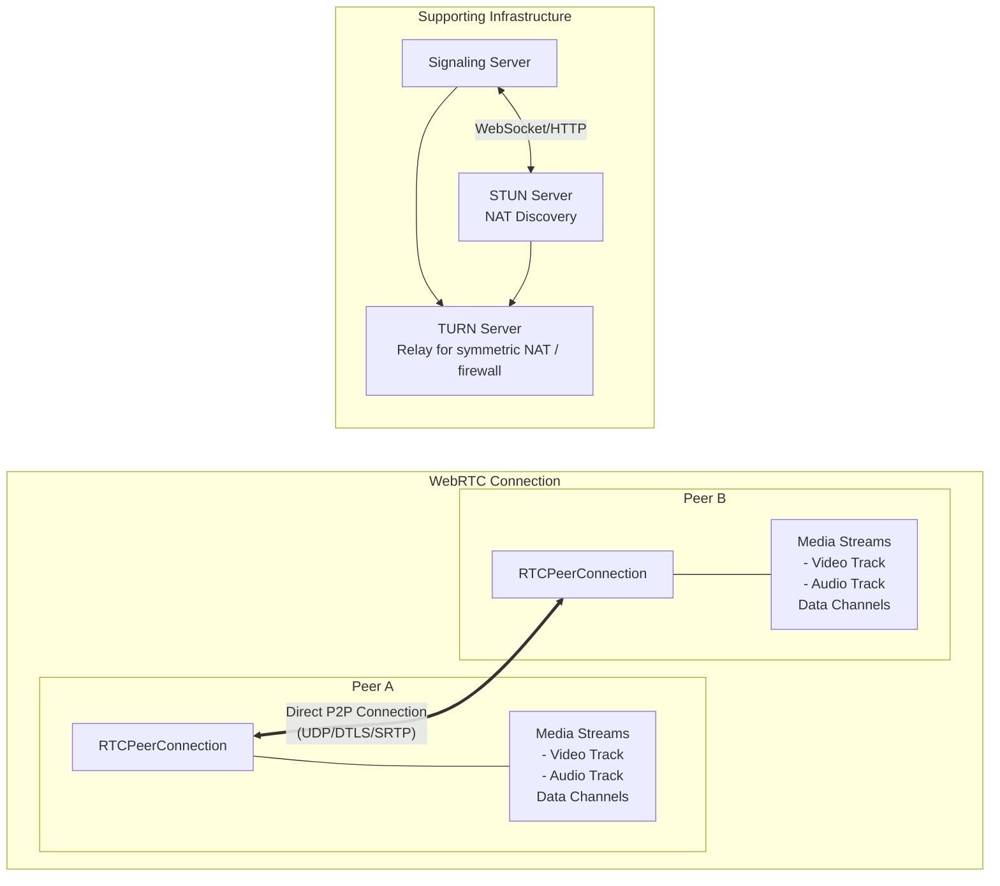
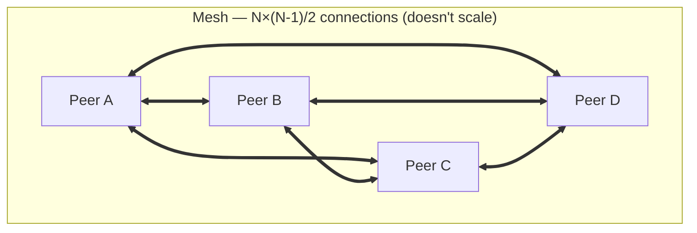
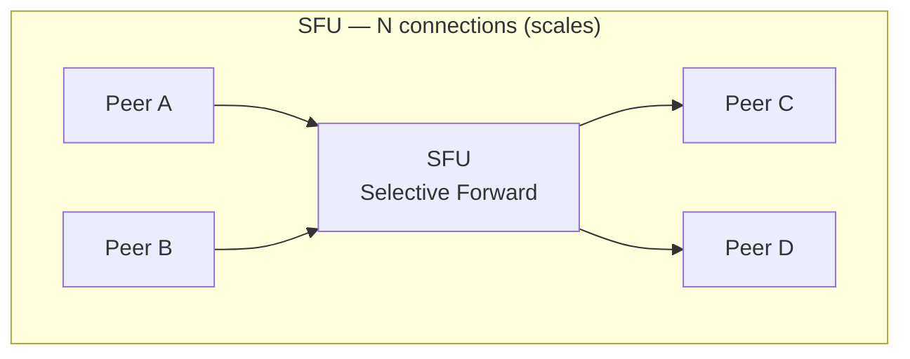

# WebRTC

## TL;DR

WebRTC (Web Real-Time Communication) enables peer-to-peer audio, video, and data sharing directly between browsers without requiring a server relay. It uses STUN/TURN servers for NAT traversal and a signaling server to exchange connection metadata. WebRTC is ideal for video conferencing, voice calls, screen sharing, and real-time gaming.

---

## WebRTC Architecture



---

## Connection Flow

```mermaid
sequenceDiagram
    participant A as Peer A
    participant S as Signaling Server
    participant B as Peer B

    A->>S: 1. Create Offer (SDP with media caps)
    S->>B: 2. Forward Offer
    B->>S: 3. Answer (SDP with media caps)
    S->>A: 4. Forward Answer
    A->>B: 5. ICE Candidate
    B->>A: ICE Candidate
    A<==>B: 6. Direct P2P Connection Established
```

---

## Basic Implementation

### Signaling Server (Python)

```python
import asyncio
import websockets
import json
from typing import Dict, Set

class SignalingServer:
    """
    Simple signaling server for WebRTC.
    Routes offers, answers, and ICE candidates between peers.
    """
    
    def __init__(self):
        self.rooms: Dict[str, Set[str]] = {}  # room_id -> set of peer_ids
        self.peers: Dict[str, websockets.WebSocketServerProtocol] = {}
        self.peer_rooms: Dict[str, str] = {}  # peer_id -> room_id
    
    async def register(self, websocket, peer_id: str, room_id: str):
        """Register peer in room."""
        self.peers[peer_id] = websocket
        self.peer_rooms[peer_id] = room_id
        
        if room_id not in self.rooms:
            self.rooms[room_id] = set()
        
        # Notify existing peers about new peer
        for existing_peer in self.rooms[room_id]:
            await self.send_to_peer(existing_peer, {
                'type': 'peer_joined',
                'peer_id': peer_id
            })
        
        # Send list of existing peers to new peer
        await self.send_to_peer(peer_id, {
            'type': 'room_peers',
            'peers': list(self.rooms[room_id])
        })
        
        self.rooms[room_id].add(peer_id)
    
    async def unregister(self, peer_id: str):
        """Remove peer from room."""
        if peer_id in self.peer_rooms:
            room_id = self.peer_rooms[peer_id]
            self.rooms[room_id].discard(peer_id)
            
            # Notify other peers
            for other_peer in self.rooms[room_id]:
                await self.send_to_peer(other_peer, {
                    'type': 'peer_left',
                    'peer_id': peer_id
                })
            
            del self.peer_rooms[peer_id]
        
        self.peers.pop(peer_id, None)
    
    async def send_to_peer(self, peer_id: str, message: dict):
        """Send message to specific peer."""
        if peer_id in self.peers:
            try:
                await self.peers[peer_id].send(json.dumps(message))
            except websockets.ConnectionClosed:
                await self.unregister(peer_id)
    
    async def handle_message(self, peer_id: str, message: dict):
        """Route signaling messages between peers."""
        msg_type = message.get('type')
        target = message.get('target')
        
        if msg_type == 'offer':
            # Forward offer to target peer
            await self.send_to_peer(target, {
                'type': 'offer',
                'offer': message['offer'],
                'from': peer_id
            })
        
        elif msg_type == 'answer':
            # Forward answer to target peer
            await self.send_to_peer(target, {
                'type': 'answer',
                'answer': message['answer'],
                'from': peer_id
            })
        
        elif msg_type == 'ice_candidate':
            # Forward ICE candidate to target peer
            await self.send_to_peer(target, {
                'type': 'ice_candidate',
                'candidate': message['candidate'],
                'from': peer_id
            })
    
    async def handler(self, websocket, path):
        """WebSocket connection handler."""
        peer_id = None
        
        try:
            async for message in websocket:
                data = json.loads(message)
                
                if data['type'] == 'join':
                    peer_id = data['peer_id']
                    room_id = data['room_id']
                    await self.register(websocket, peer_id, room_id)
                
                elif peer_id:
                    await self.handle_message(peer_id, data)
        
        finally:
            if peer_id:
                await self.unregister(peer_id)

# Run server
server = SignalingServer()
asyncio.run(websockets.serve(server.handler, 'localhost', 8765))
```

### Client-Side (JavaScript)

```javascript
class WebRTCClient {
  constructor(signalingUrl, peerId, roomId) {
    this.signalingUrl = signalingUrl;
    this.peerId = peerId;
    this.roomId = roomId;
    this.ws = null;
    this.peers = new Map(); // peerId -> RTCPeerConnection
    this.localStream = null;
    
    // STUN/TURN servers
    this.iceServers = [
      { urls: 'stun:stun.l.google.com:19302' },
      { urls: 'stun:stun1.l.google.com:19302' },
      // Add TURN server for NAT traversal fallback
      {
        urls: 'turn:turn.example.com:3478',
        username: 'user',
        credential: 'password'
      }
    ];
    
    this.callbacks = {
      onRemoteStream: null,
      onPeerConnected: null,
      onPeerDisconnected: null
    };
  }

  on(event, callback) {
    this.callbacks[event] = callback;
  }

  async start(mediaConstraints = { video: true, audio: true }) {
    // Get local media stream
    this.localStream = await navigator.mediaDevices.getUserMedia(mediaConstraints);
    
    // Connect to signaling server
    await this.connectSignaling();
    
    return this.localStream;
  }

  async connectSignaling() {
    return new Promise((resolve, reject) => {
      this.ws = new WebSocket(this.signalingUrl);
      
      this.ws.onopen = () => {
        this.ws.send(JSON.stringify({
          type: 'join',
          peer_id: this.peerId,
          room_id: this.roomId
        }));
        resolve();
      };
      
      this.ws.onmessage = (event) => {
        this.handleSignalingMessage(JSON.parse(event.data));
      };
      
      this.ws.onerror = reject;
    });
  }

  async handleSignalingMessage(message) {
    switch (message.type) {
      case 'room_peers':
        // Initiate connection to existing peers
        for (const peerId of message.peers) {
          await this.createOffer(peerId);
        }
        break;
      
      case 'peer_joined':
        // New peer will send offer, wait for it
        console.log(`Peer ${message.peer_id} joined`);
        break;
      
      case 'peer_left':
        this.handlePeerLeft(message.peer_id);
        break;
      
      case 'offer':
        await this.handleOffer(message.from, message.offer);
        break;
      
      case 'answer':
        await this.handleAnswer(message.from, message.answer);
        break;
      
      case 'ice_candidate':
        await this.handleIceCandidate(message.from, message.candidate);
        break;
    }
  }

  createPeerConnection(remotePeerId) {
    const pc = new RTCPeerConnection({ iceServers: this.iceServers });
    
    // Add local tracks
    this.localStream.getTracks().forEach(track => {
      pc.addTrack(track, this.localStream);
    });
    
    // Handle incoming tracks
    pc.ontrack = (event) => {
      if (this.callbacks.onRemoteStream) {
        this.callbacks.onRemoteStream(remotePeerId, event.streams[0]);
      }
    };
    
    // Handle ICE candidates
    pc.onicecandidate = (event) => {
      if (event.candidate) {
        this.ws.send(JSON.stringify({
          type: 'ice_candidate',
          target: remotePeerId,
          candidate: event.candidate
        }));
      }
    };
    
    // Connection state changes
    pc.onconnectionstatechange = () => {
      if (pc.connectionState === 'connected') {
        if (this.callbacks.onPeerConnected) {
          this.callbacks.onPeerConnected(remotePeerId);
        }
      } else if (pc.connectionState === 'failed' || 
                 pc.connectionState === 'disconnected') {
        if (this.callbacks.onPeerDisconnected) {
          this.callbacks.onPeerDisconnected(remotePeerId);
        }
      }
    };
    
    this.peers.set(remotePeerId, pc);
    return pc;
  }

  async createOffer(remotePeerId) {
    const pc = this.createPeerConnection(remotePeerId);
    
    const offer = await pc.createOffer();
    await pc.setLocalDescription(offer);
    
    this.ws.send(JSON.stringify({
      type: 'offer',
      target: remotePeerId,
      offer: pc.localDescription
    }));
  }

  async handleOffer(fromPeerId, offer) {
    const pc = this.createPeerConnection(fromPeerId);
    
    await pc.setRemoteDescription(new RTCSessionDescription(offer));
    const answer = await pc.createAnswer();
    await pc.setLocalDescription(answer);
    
    this.ws.send(JSON.stringify({
      type: 'answer',
      target: fromPeerId,
      answer: pc.localDescription
    }));
  }

  async handleAnswer(fromPeerId, answer) {
    const pc = this.peers.get(fromPeerId);
    if (pc) {
      await pc.setRemoteDescription(new RTCSessionDescription(answer));
    }
  }

  async handleIceCandidate(fromPeerId, candidate) {
    const pc = this.peers.get(fromPeerId);
    if (pc) {
      await pc.addIceCandidate(new RTCIceCandidate(candidate));
    }
  }

  handlePeerLeft(peerId) {
    const pc = this.peers.get(peerId);
    if (pc) {
      pc.close();
      this.peers.delete(peerId);
    }
    if (this.callbacks.onPeerDisconnected) {
      this.callbacks.onPeerDisconnected(peerId);
    }
  }

  stop() {
    // Close all peer connections
    this.peers.forEach(pc => pc.close());
    this.peers.clear();
    
    // Stop local stream
    if (this.localStream) {
      this.localStream.getTracks().forEach(track => track.stop());
    }
    
    // Close signaling
    if (this.ws) {
      this.ws.close();
    }
  }
}

// Usage
const client = new WebRTCClient('wss://signaling.example.com', 'user123', 'room1');

client.on('onRemoteStream', (peerId, stream) => {
  const video = document.createElement('video');
  video.srcObject = stream;
  video.autoplay = true;
  document.getElementById('remote-videos').appendChild(video);
});

const localStream = await client.start({ video: true, audio: true });
document.getElementById('local-video').srcObject = localStream;
```

---

## Data Channels

```javascript
class DataChannelClient extends WebRTCClient {
  constructor(signalingUrl, peerId, roomId) {
    super(signalingUrl, peerId, roomId);
    this.dataChannels = new Map(); // peerId -> RTCDataChannel
    this.messageHandlers = [];
  }

  onMessage(handler) {
    this.messageHandlers.push(handler);
  }

  createPeerConnection(remotePeerId) {
    const pc = super.createPeerConnection(remotePeerId);
    
    // Create data channel for sending
    const dc = pc.createDataChannel('messages', {
      ordered: true  // Guaranteed order
    });
    
    this.setupDataChannel(remotePeerId, dc);
    
    // Handle incoming data channel
    pc.ondatachannel = (event) => {
      this.setupDataChannel(remotePeerId, event.channel);
    };
    
    return pc;
  }

  setupDataChannel(peerId, channel) {
    channel.onopen = () => {
      console.log(`Data channel open with ${peerId}`);
      this.dataChannels.set(peerId, channel);
    };
    
    channel.onmessage = (event) => {
      const message = JSON.parse(event.data);
      this.messageHandlers.forEach(handler => {
        handler(peerId, message);
      });
    };
    
    channel.onclose = () => {
      this.dataChannels.delete(peerId);
    };
  }

  sendTo(peerId, message) {
    const channel = this.dataChannels.get(peerId);
    if (channel && channel.readyState === 'open') {
      channel.send(JSON.stringify(message));
    }
  }

  broadcast(message) {
    this.dataChannels.forEach((channel, peerId) => {
      this.sendTo(peerId, message);
    });
  }
}

// Usage: Real-time game
const game = new DataChannelClient('wss://signaling.example.com', 'player1', 'game-room');

game.onMessage((fromPeer, message) => {
  if (message.type === 'player_move') {
    updatePlayerPosition(fromPeer, message.position);
  }
});

// Broadcast position updates
setInterval(() => {
  game.broadcast({
    type: 'player_move',
    position: getLocalPlayerPosition()
  });
}, 50); // 20 updates per second
```

---

## TURN Server (Relay)

```mermaid
graph LR
    subgraph Scenario 1 — Direct P2P
        PA1["Peer A<br/>(Public)"] <==> PB1["Peer B<br/>(Public)"]
    end

    subgraph Scenario 2 — STUN
        PA2[Peer A] --- NATA[NAT A] <==> NATB[NAT B] --- PB2[Peer B]
        NATA --> STUN[STUN Server<br/>Discovers public IP/port]
        NATB --> STUN
    end

    subgraph Scenario 3 — TURN required
        PA3[Peer A] --- SNATA[Symmetric NAT A] --> TURN[TURN Server<br/>Relays traffic]
        PB3[Peer B] --- SNATB[Symmetric NAT B] --> TURN
    end
```

```python
# TURN server configuration (using coturn)
"""
# /etc/turnserver.conf

# Network
listening-port=3478
tls-listening-port=5349

# TLS certificates
cert=/etc/ssl/certs/turn.pem
pkey=/etc/ssl/private/turn.key

# Authentication
lt-cred-mech
user=webrtc:password123

# Realm
realm=example.com

# Allowed peer IPs (internal network)
denied-peer-ip=0.0.0.0-0.255.255.255
denied-peer-ip=10.0.0.0-10.255.255.255
denied-peer-ip=172.16.0.0-172.31.255.255
denied-peer-ip=192.168.0.0-192.168.255.255

# Logging
log-file=/var/log/turnserver.log
verbose
"""

# Dynamic TURN credentials (time-limited)
import hmac
import hashlib
import base64
import time

def generate_turn_credentials(secret: str, user: str, ttl: int = 86400):
    """Generate time-limited TURN credentials."""
    timestamp = int(time.time()) + ttl
    username = f"{timestamp}:{user}"
    
    # HMAC-SHA1 of timestamp:user
    password = base64.b64encode(
        hmac.new(
            secret.encode(),
            username.encode(),
            hashlib.sha1
        ).digest()
    ).decode()
    
    return {
        'username': username,
        'password': password,
        'ttl': ttl,
        'uris': [
            'turn:turn.example.com:3478?transport=udp',
            'turn:turn.example.com:3478?transport=tcp',
            'turns:turn.example.com:5349?transport=tcp'
        ]
    }
```

---

## Selective Forwarding Unit (SFU)





```python
import asyncio
from typing import Dict, Set, List
from dataclasses import dataclass

@dataclass
class Participant:
    id: str
    websocket: any
    tracks: Dict[str, 'TrackInfo']  # track_id -> TrackInfo

@dataclass
class TrackInfo:
    type: str  # 'video' or 'audio'
    participant_id: str
    subscribers: Set[str]

class SFUServer:
    """
    Simple SFU (Selective Forwarding Unit) concept.
    In production, use mediasoup, Janus, or similar.
    """
    
    def __init__(self):
        self.rooms: Dict[str, Dict[str, Participant]] = {}
    
    async def join_room(self, room_id: str, participant: Participant):
        """Participant joins room."""
        if room_id not in self.rooms:
            self.rooms[room_id] = {}
        
        room = self.rooms[room_id]
        
        # Notify existing participants
        for existing in room.values():
            await self.notify(existing, {
                'type': 'participant_joined',
                'participant_id': participant.id
            })
            
            # Send existing tracks to new participant
            for track in existing.tracks.values():
                await self.notify(participant, {
                    'type': 'track_available',
                    'participant_id': existing.id,
                    'track_id': track.id,
                    'track_type': track.type
                })
        
        room[participant.id] = participant
    
    async def publish_track(self, room_id: str, participant_id: str, 
                           track_id: str, track_type: str):
        """Participant publishes a track."""
        room = self.rooms.get(room_id, {})
        participant = room.get(participant_id)
        
        if participant:
            track = TrackInfo(
                type=track_type,
                participant_id=participant_id,
                subscribers=set()
            )
            participant.tracks[track_id] = track
            
            # Notify all other participants
            for other in room.values():
                if other.id != participant_id:
                    await self.notify(other, {
                        'type': 'track_available',
                        'participant_id': participant_id,
                        'track_id': track_id,
                        'track_type': track_type
                    })
    
    async def subscribe_track(self, room_id: str, subscriber_id: str,
                              publisher_id: str, track_id: str):
        """Subscribe to a track from another participant."""
        room = self.rooms.get(room_id, {})
        publisher = room.get(publisher_id)
        
        if publisher and track_id in publisher.tracks:
            publisher.tracks[track_id].subscribers.add(subscriber_id)
            
            # In real SFU: set up RTP forwarding
            # Return track details for WebRTC negotiation
            return {
                'type': 'subscribed',
                'publisher_id': publisher_id,
                'track_id': track_id
            }
    
    async def forward_media(self, room_id: str, publisher_id: str, 
                           track_id: str, media_data: bytes):
        """Forward media to all subscribers (simplified)."""
        room = self.rooms.get(room_id, {})
        publisher = room.get(publisher_id)
        
        if publisher and track_id in publisher.tracks:
            track = publisher.tracks[track_id]
            
            for subscriber_id in track.subscribers:
                subscriber = room.get(subscriber_id)
                if subscriber:
                    # Forward RTP packet
                    await self.send_media(subscriber, media_data)
```

---

## Screen Sharing

```javascript
class ScreenShareClient extends WebRTCClient {
  async startScreenShare() {
    try {
      // Get screen capture stream
      const screenStream = await navigator.mediaDevices.getDisplayMedia({
        video: {
          cursor: 'always',
          width: { ideal: 1920 },
          height: { ideal: 1080 },
          frameRate: { ideal: 30 }
        },
        audio: true  // System audio (if supported)
      });
      
      // Replace video track in all peer connections
      const screenTrack = screenStream.getVideoTracks()[0];
      
      this.peers.forEach((pc, peerId) => {
        const sender = pc.getSenders().find(s => 
          s.track && s.track.kind === 'video'
        );
        
        if (sender) {
          sender.replaceTrack(screenTrack);
        }
      });
      
      // Handle screen share stop
      screenTrack.onended = () => {
        this.stopScreenShare();
      };
      
      this.screenStream = screenStream;
      return screenStream;
      
    } catch (error) {
      if (error.name === 'NotAllowedError') {
        console.log('Screen share cancelled by user');
      }
      throw error;
    }
  }
  
  async stopScreenShare() {
    if (this.screenStream) {
      this.screenStream.getTracks().forEach(track => track.stop());
      
      // Restore camera track
      const cameraTrack = this.localStream.getVideoTracks()[0];
      
      this.peers.forEach((pc, peerId) => {
        const sender = pc.getSenders().find(s => 
          s.track && s.track.kind === 'video'
        );
        
        if (sender) {
          sender.replaceTrack(cameraTrack);
        }
      });
      
      this.screenStream = null;
    }
  }
}
```

---

## Recording

```javascript
class RecordingClient extends WebRTCClient {
  constructor(...args) {
    super(...args);
    this.recorder = null;
    this.recordedChunks = [];
  }
  
  startRecording(stream, options = {}) {
    const mimeType = this.getSupportedMimeType();
    
    this.recorder = new MediaRecorder(stream, {
      mimeType,
      videoBitsPerSecond: options.videoBitrate || 2500000
    });
    
    this.recordedChunks = [];
    
    this.recorder.ondataavailable = (event) => {
      if (event.data.size > 0) {
        this.recordedChunks.push(event.data);
      }
    };
    
    this.recorder.onstop = () => {
      this.saveRecording();
    };
    
    // Record in 1-second chunks for resilience
    this.recorder.start(1000);
  }
  
  stopRecording() {
    if (this.recorder && this.recorder.state !== 'inactive') {
      this.recorder.stop();
    }
  }
  
  getSupportedMimeType() {
    const types = [
      'video/webm;codecs=vp9,opus',
      'video/webm;codecs=vp8,opus',
      'video/webm',
      'video/mp4'
    ];
    
    for (const type of types) {
      if (MediaRecorder.isTypeSupported(type)) {
        return type;
      }
    }
    
    throw new Error('No supported video format');
  }
  
  saveRecording() {
    const blob = new Blob(this.recordedChunks, { type: 'video/webm' });
    const url = URL.createObjectURL(blob);
    
    const a = document.createElement('a');
    a.href = url;
    a.download = `recording-${Date.now()}.webm`;
    a.click();
    
    URL.revokeObjectURL(url);
  }
}
```

---

## Key Takeaways

1. **Peer-to-peer by default**: WebRTC establishes direct connections; use TURN servers only when P2P fails

2. **Signaling is separate**: WebRTC doesn't define signaling; use WebSocket, HTTP, or any channel for offer/answer exchange

3. **ICE handles NAT**: STUN discovers public addresses; TURN relays when direct connection impossible

4. **SFU for scaling**: Mesh topology doesn't scale; use SFU for video conferencing with many participants

5. **Data channels for low latency**: Use RTCDataChannel for game state, file transfer, or any real-time data

6. **Handle network changes**: Implement ICE restart for network switching (WiFi to cellular)

7. **Monitor connection quality**: Use getStats() API to monitor bitrate, packet loss, and adjust quality accordingly
