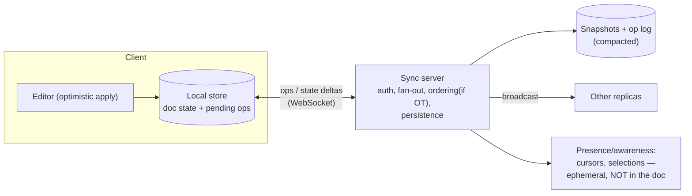

# CRDTs and Collaborative Editing

## TL;DR

Collaborative editing is concurrent writing with no time to coordinate: every keystroke applies locally and instantly (zero-latency optimism), then replicas must **converge to the same result** despite edits arriving in different orders. Two families solve it. **Operational Transformation (OT)** rewrites operations against the concurrent ones a central server has already accepted — proven (Google Docs), but correctness lives in fiendish transform functions and a required server ordering. **CRDTs** (Conflict-free Replicated Data Types) design the data itself so that merges are commutative, associative, and idempotent — replicas converge mathematically, with no central transformer, which is what makes offline-first and peer-to-peer sync possible (Yjs, Automerge). Production systems are pragmatic hybrids: Figma uses server-arbitrated last-writer-wins per property; text editors embed sequence CRDTs; and everything still runs through a server for persistence, [presence](./06-presence.md), and permissions. Use CRDTs for data shaped like sets, counters, registers, and text; keep global invariants (inventory, balances) on a single writer — convergence is not correctness.

---

## The Problem: Concurrency Without Coordination

Two users, same document, same moment:

```
Start:  "color"
Alice (offline, position 5): insert "s"      → intends "colors"
Bob   (position 0):          insert "the "   → intends "the color"
```

Apply both naively by position and one replica gets `"the colosr"` — Alice's index 5 meant *her* document, not Bob's. Locking is off the table (every keystroke would pay a round trip; offline users could never edit), so the system must accept concurrent operations and guarantee **strong eventual consistency**: any two replicas that have seen the same set of operations are in the same state, regardless of arrival order ([Consistency Models](../01-foundations/04-consistency-models.md)). That guarantee has exactly two industrial solutions.

## Path 1: Operational Transformation

Keep operations index-based, but **transform** each incoming operation against the concurrent ones already applied:

```mermaid
sequenceDiagram
    participant A as Alice
    participant S as Server (orders ops)
    participant B as Bob

    A->>S: insert("s", pos=5)
    B->>S: insert("the ", pos=0)
    Note over S: accepts Alice first;<br/>transforms Bob's op? no —<br/>transforms Alice's for Bob & vice versa
    S->>B: insert("s", pos=5+4=9)  ← shifted past "the "
    S->>A: insert("the ", pos=0)
    Note over A,B: both converge on "the colors"
```

The transform function `T(op1, op2)` answers: *how does op1 change if op2 already happened?* For plain text insert/delete this is tractable; add rich-text attributes, tables, and nested structures and the case explosion is notorious — several published OT algorithms were later proven wrong, and the practical fix (used by Google Docs, derived from the Jupiter system) is a **central server** that serializes operations so each client only ever transforms against one ordering. That works extremely well online, at the cost of: no server, no merge — long-offline edits and P2P are awkward, and the server is a correctness component, not just a relay.

## Path 2: CRDTs

Flip the burden from operations to **data structure design**: make the merge function itself order-insensitive. A state-based CRDT needs `merge(a, b)` to be commutative, associative, and idempotent — then replicas can gossip states in any order, with duplicates, and still converge.

```python
class GCounter:
    """Grow-only counter: one slot per replica; merge = element-wise max."""
    def __init__(self):
        self.slots: dict[str, int] = {}

    def increment(self, replica: str):
        self.slots[replica] = self.slots.get(replica, 0) + 1

    def value(self) -> int:
        return sum(self.slots.values())

    def merge(self, other: "GCounter"):
        for r, n in other.slots.items():
            self.slots[r] = max(self.slots.get(r, 0), n)   # idempotent, commutative


class ORSet:
    """Observed-remove set: add wins over concurrent remove.
    Each add gets a unique tag; remove deletes only the tags it has SEEN."""
    def __init__(self):
        self.adds: dict[str, set[str]] = {}      # element -> live tags

    def add(self, elem: str):
        self.adds.setdefault(elem, set()).add(uuid4().hex)

    def remove(self, elem: str):
        self.adds.get(elem, set()).clear()        # clears observed tags only

    def contains(self, elem: str) -> bool:
        return bool(self.adds.get(elem))

    def merge(self, other: "ORSet"):
        for elem, tags in other.adds.items():
            self.adds.setdefault(elem, set()).update(tags)
```

The standard toolbox: **PN-Counter** (increment/decrement as two G-Counters), **LWW-Register** (last-writer-wins by timestamp — convergent, but concurrent writes *lose data silently*; see [Conflict Resolution](../02-distributed-databases/04-conflict-resolution.md)), **OR-Set** (add-wins semantics chosen deliberately), and **sequence CRDTs** for text. CRDTs don't eliminate conflict semantics — they force you to *choose them up front* (add-wins or remove-wins? LWW or multi-value?) and then guarantee everyone computes the same answer.

### Text: sequence CRDTs

The text trick is replacing fragile integer indexes with **stable unique identifiers per character**. Each character gets an ID (replica, counter) and a reference to its left neighbor at insertion time; deletes leave **tombstones** rather than shifting positions. Alice's "insert s after the character with ID (a,5)" means the same thing on every replica forever — no transformation needed. The engineering history since the early designs (Logoot, RGA, and successors like YATA/Yjs and Automerge's columnar encoding) is mostly about taming the costs: metadata per character (solved with run-length blocks of consecutive runs), tombstone growth (periodic compaction once all replicas have seen the delete), and **interleaving anomalies** — two users typing concurrently at the same spot getting their words shuffled character-by-character — which naive position schemes exhibit and modern algorithms specifically order around. The practical takeaway: *never hand-roll a sequence CRDT*; use Yjs or Automerge, whose data structures make documents with millions of edits load in milliseconds.

### OT vs CRDT

| | OT | CRDT |
|---|---|---|
| Correctness lives in | Transform functions (hard, historically buggy) | Data-type merge laws (provable, local) |
| Server | Required, in the correctness path | Optional relay/persistence |
| Offline / P2P | Awkward | Native — merge is the whole model |
| Metadata overhead | Low (plain ops) | Per-element IDs + tombstones (engineered down) |
| Rich text / trees | Mature in products | Mature libraries (Yjs types, Automerge); JSON CRDTs |
| Semantic intent | Transform can encode richer intent | Merge is structural; intent must fit the type's law |
| Used by | Google Docs, classic Office co-editing | Figma-adjacent tools, Linear-style sync engines, Apple Notes, multiplayer libraries |

---

## The Sync Engine: What Production Actually Ships

A merge algorithm is maybe 20% of a collaborative product. The architecture around it:



- **Local-first write path:** apply to the local store instantly, queue the op, sync when connected ([WebSockets](./04-websockets.md) for the live channel; the queue survives offline periods). The UI never waits on the network — that's the entire feel of "multiplayer."
- **Persistence = snapshot + compacted log:** replay-from-genesis doesn't scale; periodically materialize a snapshot and garbage-collect tombstones/ops that every known replica has acknowledged — which requires tracking replica liveness, the quietly hard part of long-lived documents.
- **Presence is a separate, ephemeral channel.** Cursors, selections, and "who's here" change at 10× document rate and must not pollute document history ([Presence](./06-presence.md)).
- **The server still rules.** Even with CRDTs, production servers enforce auth and per-document permissions ([Authorization](../10-security/07-authorization-patterns.md)), validate schema, rate-limit, and arbitrate the things math can't: Figma's multiplayer deliberately uses **server-side last-writer-wins per object property** instead of full CRDTs — concurrent edits to the *same* property are rare in design tools, the server provides a total order anyway, and the simplification buys them throughput and debuggability. Linear-style sync engines similarly center on a server-ordered op log with client-side optimistic application. The lesson: pick the *weakest* convergence machinery your conflict patterns actually require.
- **Undo must be local-intent undo** — undoing *my* last edit, not the global last edit — which both OT and CRDT libraries support but applications must wire deliberately.

### Where CRDTs are the wrong tool

Convergence ≠ invariants. A CRDT happily converges both replicas to a state where the last concert seat sold twice — *agreeing* on the overbooking. Anything with global constraints (inventory, balances, uniqueness) needs a serialization point: single-writer per key, [consensus](../02-distributed-databases/08-consensus-algorithms.md), or [transactions](../01-foundations/01-acid-transactions.md). CRDTs shine where the merge semantics *are* the business semantics: documents, whiteboards, sets/flags/counters at the edge, shopping carts (the original Dynamo case), and offline-tolerant mobile state.

---

## References

- [A comprehensive study of Convergent and Commutative Replicated Data Types](https://inria.hal.science/inria-00555588) — Shapiro et al., 2011; the founding taxonomy
- [Interleaving anomalies in collaborative text editors](https://martin.kleppmann.com/papers/interleaving-papoc19.pdf) — Kleppmann et al.; why naive sequence CRDTs shuffle your words
- [Yjs](https://docs.yjs.dev/) and [Automerge](https://automerge.org/) — production CRDT libraries; their docs are excellent systems reading
- [How Figma's multiplayer technology works](https://www.figma.com/blog/how-figmas-multiplayer-technology-works/) — the deliberate not-quite-CRDT design
- [High-latency, low-bandwidth windowing in the Jupiter collaboration system](https://dl.acm.org/doi/10.1145/215585.215706) — the OT architecture behind Docs-style editors
- [Local-first software](https://www.inkandswitch.com/local-first/) — Ink & Switch; the architectural philosophy CRDTs enable
