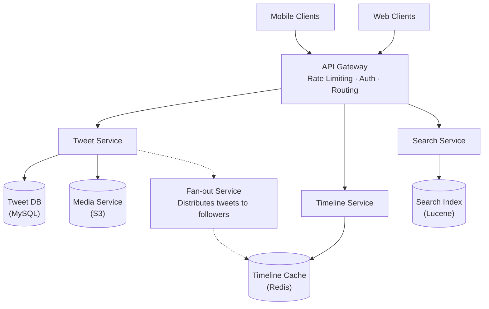
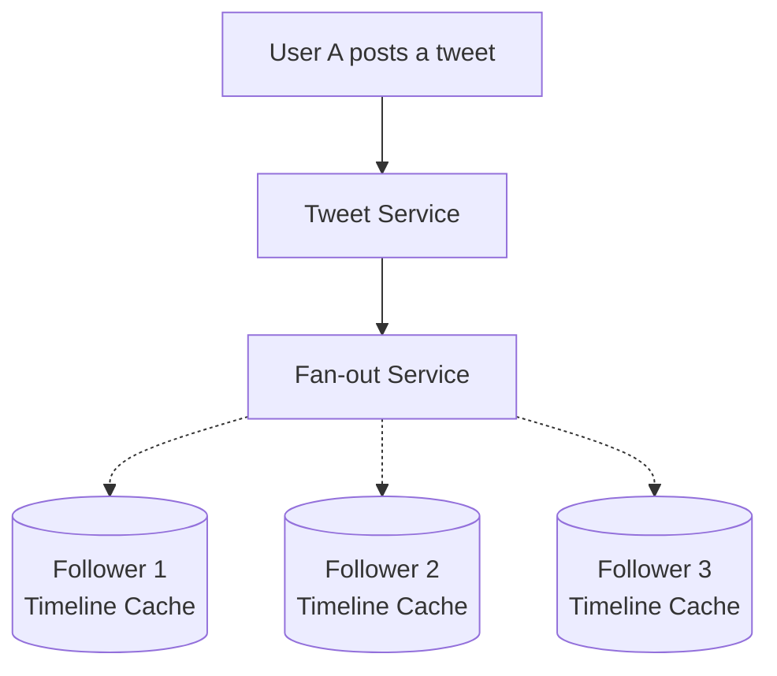
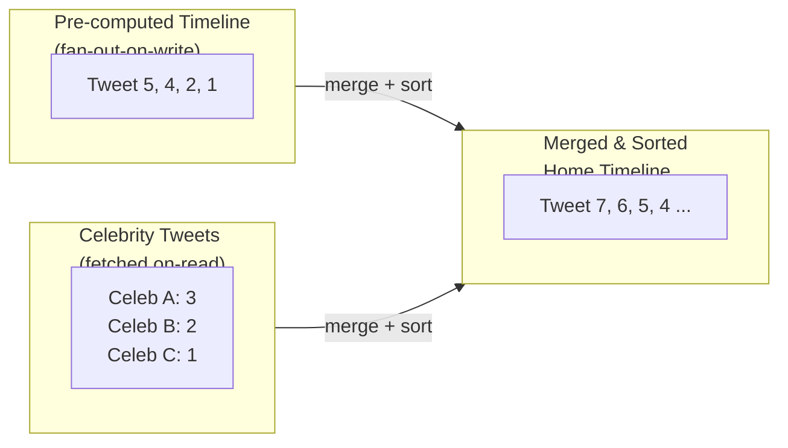
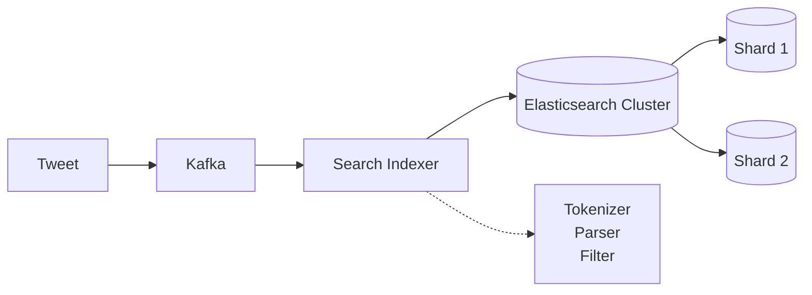

# Twitter System Design

## TL;DR

Twitter handles 500M+ tweets per day with a fan-out-on-write architecture for home timeline delivery. Key challenges include celebrity accounts with millions of followers (fan-out becomes expensive), real-time search indexing, and trend detection. The system uses a hybrid approach: fan-out for regular users, fan-out-on-read for celebrities.

---

## Core Requirements

### Functional Requirements
- Post tweets (280 characters, media attachments)
- Follow/unfollow users
- Home timeline (tweets from followed users)
- User timeline (user's own tweets)
- Search tweets
- Trending topics
- Notifications (mentions, likes, retweets)

### Non-Functional Requirements
- High availability (99.99%)
- Low latency timeline reads (< 200ms)
- Handle 500M tweets/day writes
- Support users with 50M+ followers
- Real-time trend detection

---

## High-Level Architecture



---

## Timeline Architecture

### Fan-Out-on-Write (Push Model)



Each follower's timeline cache gets the tweet ID appended.

```python
class FanOutService:
    def __init__(self, redis_client, follower_service):
        self.redis = redis_client
        self.follower_service = follower_service
        self.max_timeline_size = 800  # Keep last 800 tweets
    
    async def fan_out_tweet(self, tweet: Tweet):
        """
        Distribute tweet to all followers' timelines.
        """
        user_id = tweet.author_id
        follower_count = await self.follower_service.get_follower_count(user_id)
        
        # Check if user is a celebrity (high follower count)
        if follower_count > 10000:
            # Don't fan out for celebrities - use fan-out-on-read
            await self._mark_as_celebrity_tweet(tweet)
            return
        
        # Get all followers
        followers = await self.follower_service.get_followers(user_id)
        
        # Fan out to each follower's timeline
        pipe = self.redis.pipeline()
        
        for follower_id in followers:
            timeline_key = f"timeline:{follower_id}"
            
            # Add tweet ID to timeline (sorted set by timestamp)
            pipe.zadd(timeline_key, {tweet.id: tweet.created_at.timestamp()})
            
            # Trim to max size
            pipe.zremrangebyrank(timeline_key, 0, -self.max_timeline_size - 1)
        
        await pipe.execute()
    
    async def _mark_as_celebrity_tweet(self, tweet: Tweet):
        """Store in celebrity tweets index for fan-out-on-read."""
        await self.redis.zadd(
            f"celebrity_tweets:{tweet.author_id}",
            {tweet.id: tweet.created_at.timestamp()}
        )
```

### Fan-Out-on-Read for Celebrities

```python
class TimelineService:
    def __init__(self, redis_client, tweet_service, follow_service):
        self.redis = redis_client
        self.tweet_service = tweet_service
        self.follow_service = follow_service
    
    async def get_home_timeline(
        self, 
        user_id: str, 
        count: int = 20,
        max_id: str = None
    ) -> List[Tweet]:
        """
        Get home timeline with hybrid fan-out.
        """
        # 1. Get pre-computed timeline (fan-out-on-write results)
        timeline_key = f"timeline:{user_id}"
        
        if max_id:
            max_score = await self._get_tweet_score(max_id)
            cached_ids = await self.redis.zrevrangebyscore(
                timeline_key,
                max_score,
                '-inf',
                start=0,
                num=count
            )
        else:
            cached_ids = await self.redis.zrevrange(
                timeline_key,
                0,
                count - 1
            )
        
        # 2. Get tweets from celebrities user follows
        celebrity_followings = await self.follow_service.get_celebrity_followings(
            user_id
        )
        
        celebrity_tweets = []
        for celebrity_id in celebrity_followings:
            tweets = await self.redis.zrevrange(
                f"celebrity_tweets:{celebrity_id}",
                0,
                count - 1
            )
            celebrity_tweets.extend(tweets)
        
        # 3. Merge and sort
        all_tweet_ids = list(set(cached_ids + celebrity_tweets))
        
        # Fetch tweet objects
        tweets = await self.tweet_service.get_tweets_batch(all_tweet_ids)
        
        # Sort by created_at descending
        tweets.sort(key=lambda t: t.created_at, reverse=True)
        
        return tweets[:count]
```



---

## Tweet Storage

### Database Schema

```sql
-- Tweets table (sharded by tweet_id)
CREATE TABLE tweets (
    id BIGINT PRIMARY KEY,           -- Snowflake ID
    author_id BIGINT NOT NULL,
    content VARCHAR(280) NOT NULL,
    reply_to_id BIGINT,              -- If this is a reply
    retweet_of_id BIGINT,            -- If this is a retweet
    quote_tweet_id BIGINT,           -- If this is a quote tweet
    media_ids JSON,                  -- Array of media IDs
    created_at TIMESTAMP NOT NULL,
    
    INDEX idx_author_created (author_id, created_at DESC),
    INDEX idx_reply (reply_to_id),
    INDEX idx_retweet (retweet_of_id)
) ENGINE=InnoDB;

-- User timeline (denormalized for fast reads)
CREATE TABLE user_timeline (
    user_id BIGINT NOT NULL,
    tweet_id BIGINT NOT NULL,
    created_at TIMESTAMP NOT NULL,
    
    PRIMARY KEY (user_id, tweet_id),
    INDEX idx_user_time (user_id, created_at DESC)
) ENGINE=InnoDB;

-- Follows relationship
CREATE TABLE follows (
    follower_id BIGINT NOT NULL,
    followee_id BIGINT NOT NULL,
    created_at TIMESTAMP NOT NULL,
    
    PRIMARY KEY (follower_id, followee_id),
    INDEX idx_followee (followee_id)
) ENGINE=InnoDB;
```

### Tweet ID Generation (Snowflake)

```python
import time
import threading

class SnowflakeGenerator:
    """
    Twitter's Snowflake ID generator.
    64-bit IDs with embedded timestamp for ordering.
    
    Structure:
    | 1 bit unused | 41 bits timestamp | 10 bits machine | 12 bits sequence |
    """
    
    def __init__(self, machine_id: int):
        self.machine_id = machine_id & 0x3FF  # 10 bits
        self.sequence = 0
        self.last_timestamp = -1
        self.lock = threading.Lock()
        
        # Epoch: Twitter's epoch (Nov 4, 2010)
        self.epoch = 1288834974657
    
    def _current_millis(self) -> int:
        return int(time.time() * 1000)
    
    def _wait_next_millis(self, last_ts: int) -> int:
        ts = self._current_millis()
        while ts <= last_ts:
            ts = self._current_millis()
        return ts
    
    def next_id(self) -> int:
        with self.lock:
            timestamp = self._current_millis()
            
            if timestamp < self.last_timestamp:
                raise Exception("Clock moved backwards!")
            
            if timestamp == self.last_timestamp:
                self.sequence = (self.sequence + 1) & 0xFFF  # 12 bits
                if self.sequence == 0:
                    timestamp = self._wait_next_millis(self.last_timestamp)
            else:
                self.sequence = 0
            
            self.last_timestamp = timestamp
            
            # Compose ID
            id = ((timestamp - self.epoch) << 22) | \
                 (self.machine_id << 12) | \
                 self.sequence
            
            return id

# Usage
generator = SnowflakeGenerator(machine_id=1)
tweet_id = generator.next_id()  # e.g., 1234567890123456789

# Extract timestamp from ID
def extract_timestamp(tweet_id: int) -> int:
    epoch = 1288834974657
    return ((tweet_id >> 22) + epoch)
```

---

## Search Architecture



```python
class TweetSearchService:
    def __init__(self, es_client):
        self.es = es_client
        self.index_name = "tweets"
    
    async def index_tweet(self, tweet: Tweet):
        """Index tweet for search."""
        doc = {
            'id': tweet.id,
            'text': tweet.content,
            'author_id': tweet.author_id,
            'author_username': tweet.author.username,
            'created_at': tweet.created_at.isoformat(),
            'hashtags': self._extract_hashtags(tweet.content),
            'mentions': self._extract_mentions(tweet.content),
            'lang': self._detect_language(tweet.content),
            'engagement': {
                'likes': tweet.like_count,
                'retweets': tweet.retweet_count,
                'replies': tweet.reply_count
            }
        }
        
        await self.es.index(
            index=self.index_name,
            id=tweet.id,
            document=doc
        )
    
    async def search(
        self,
        query: str,
        filters: dict = None,
        size: int = 20
    ) -> List[Tweet]:
        """Search tweets with relevance ranking."""
        
        body = {
            'query': {
                'bool': {
                    'must': [
                        {
                            'multi_match': {
                                'query': query,
                                'fields': ['text^2', 'author_username'],
                                'type': 'best_fields'
                            }
                        }
                    ],
                    'filter': []
                }
            },
            'sort': [
                {'_score': 'desc'},
                {'created_at': 'desc'}
            ],
            'size': size
        }
        
        # Apply filters
        if filters:
            if filters.get('from_user'):
                body['query']['bool']['filter'].append({
                    'term': {'author_username': filters['from_user']}
                })
            
            if filters.get('since'):
                body['query']['bool']['filter'].append({
                    'range': {'created_at': {'gte': filters['since']}}
                })
        
        result = await self.es.search(index=self.index_name, body=body)
        
        return [hit['_source'] for hit in result['hits']['hits']]
    
    def _extract_hashtags(self, text: str) -> List[str]:
        import re
        return re.findall(r'#(\w+)', text)
    
    def _extract_mentions(self, text: str) -> List[str]:
        import re
        return re.findall(r'@(\w+)', text)
```

---

## Trending Topics

```python
import time
from collections import defaultdict
from typing import List, Tuple

class TrendingService:
    """
    Detect trending topics using sliding window and velocity.
    """
    
    def __init__(self, redis_client):
        self.redis = redis_client
        self.window_size = 3600  # 1 hour window
        self.bucket_size = 60    # 1 minute buckets
    
    async def record_hashtag(self, hashtag: str, location: str = "global"):
        """Record hashtag occurrence."""
        now = int(time.time())
        bucket = now // self.bucket_size
        
        # Increment count in current bucket
        key = f"trend:{location}:{hashtag}"
        await self.redis.hincrby(key, str(bucket), 1)
        
        # Set expiry
        await self.redis.expire(key, self.window_size * 2)
    
    async def get_trending(
        self, 
        location: str = "global",
        count: int = 10
    ) -> List[Tuple[str, float]]:
        """
        Get trending topics with velocity score.
        """
        now = int(time.time())
        current_bucket = now // self.bucket_size
        
        # Get all hashtag keys
        pattern = f"trend:{location}:*"
        keys = await self.redis.keys(pattern)
        
        scores = {}
        
        for key in keys:
            hashtag = key.decode().split(':')[-1]
            buckets = await self.redis.hgetall(key)
            
            # Calculate velocity (recent vs older)
            recent_count = 0
            older_count = 0
            
            for bucket_str, count in buckets.items():
                bucket = int(bucket_str)
                count = int(count)
                
                # Skip expired buckets
                if (current_bucket - bucket) * self.bucket_size > self.window_size:
                    continue
                
                if current_bucket - bucket <= 10:  # Last 10 minutes
                    recent_count += count
                else:
                    older_count += count
            
            # Velocity score: recent activity weighted more
            total = recent_count + older_count
            if total < 10:  # Minimum threshold
                continue
            
            velocity = (recent_count * 2 + older_count) / (self.window_size / 60)
            scores[hashtag] = velocity
        
        # Sort by score
        sorted_trends = sorted(
            scores.items(),
            key=lambda x: x[1],
            reverse=True
        )
        
        return sorted_trends[:count]
    
    async def get_personalized_trends(
        self,
        user_id: str,
        location: str
    ) -> List[Tuple[str, float]]:
        """
        Get trends personalized to user's interests.
        """
        # Get user's interests
        interests = await self._get_user_interests(user_id)
        
        # Get global trends
        global_trends = await self.get_trending(location)
        
        # Boost trends matching user interests
        boosted = []
        for hashtag, score in global_trends:
            boost = 1.0
            if hashtag.lower() in interests:
                boost = 1.5
            boosted.append((hashtag, score * boost))
        
        boosted.sort(key=lambda x: x[1], reverse=True)
        return boosted
```

---

## Notifications

```python
from enum import Enum
from dataclasses import dataclass
from typing import List

class NotificationType(Enum):
    LIKE = "like"
    RETWEET = "retweet"
    REPLY = "reply"
    MENTION = "mention"
    FOLLOW = "follow"
    QUOTE = "quote"

@dataclass
class Notification:
    id: str
    user_id: str
    type: NotificationType
    actor_id: str
    tweet_id: str = None
    created_at: float = None

class NotificationService:
    def __init__(self, redis_client, push_service):
        self.redis = redis_client
        self.push = push_service
        self.max_notifications = 1000
    
    async def create_notification(
        self,
        user_id: str,
        notification: Notification
    ):
        """Create and deliver notification."""
        # Store in notification list
        key = f"notifications:{user_id}"
        
        await self.redis.zadd(
            key,
            {notification.id: notification.created_at}
        )
        
        # Trim old notifications
        await self.redis.zremrangebyrank(key, 0, -self.max_notifications - 1)
        
        # Increment unread count
        await self.redis.incr(f"notifications:unread:{user_id}")
        
        # Check notification preferences
        prefs = await self._get_notification_prefs(user_id, notification.type)
        
        if prefs.get('push_enabled'):
            # Send push notification
            await self.push.send(
                user_id=user_id,
                title=self._format_title(notification),
                body=self._format_body(notification)
            )
    
    async def get_notifications(
        self,
        user_id: str,
        count: int = 20,
        cursor: str = None
    ) -> List[Notification]:
        """Get user's notifications."""
        key = f"notifications:{user_id}"
        
        if cursor:
            max_score = float(cursor)
            ids = await self.redis.zrevrangebyscore(
                key, max_score, '-inf',
                start=0, num=count
            )
        else:
            ids = await self.redis.zrevrange(key, 0, count - 1)
        
        notifications = await self._fetch_notifications(ids)
        
        # Mark as read
        await self.redis.set(f"notifications:unread:{user_id}", 0)
        
        return notifications
    
    async def aggregate_notifications(
        self,
        user_id: str,
        tweet_id: str,
        notification_type: NotificationType
    ):
        """
        Aggregate similar notifications.
        e.g., "User A and 5 others liked your tweet"
        """
        key = f"notification:aggregate:{tweet_id}:{notification_type.value}"
        
        # Add actor to aggregation
        await self.redis.sadd(key, notification.actor_id)
        await self.redis.expire(key, 86400)  # 24 hours
        
        # Get aggregated count
        count = await self.redis.scard(key)
        
        if count == 1:
            # First notification - create normally
            await self.create_notification(user_id, notification)
        else:
            # Update existing notification
            await self._update_aggregated_notification(
                user_id, tweet_id, notification_type, count
            )
```

---

## Key Metrics & Scale

| Metric | Value |
|--------|-------|
| Daily Active Users | 200M+ |
| Tweets per day | 500M+ |
| Timeline reads/sec | 300K+ |
| Search queries/sec | 50K+ |
| Average latency (timeline) | < 100ms |
| Fan-out time (non-celebrity) | < 5 seconds |

---

## Key Takeaways

1. **Hybrid fan-out**: Fan-out-on-write for regular users (pre-compute timelines), fan-out-on-read for celebrities (merge at read time)

2. **Snowflake IDs**: Time-ordered, distributed ID generation enables efficient range queries and implicit ordering

3. **Redis for timelines**: Timeline cache in Redis for fast reads; MySQL for persistence

4. **Real-time search**: Separate search index (Elasticsearch) with near-real-time ingestion via Kafka

5. **Velocity-based trending**: Detect trends based on rate of change, not just absolute counts

6. **Notification aggregation**: Group similar notifications ("A and 5 others liked...") to reduce noise
