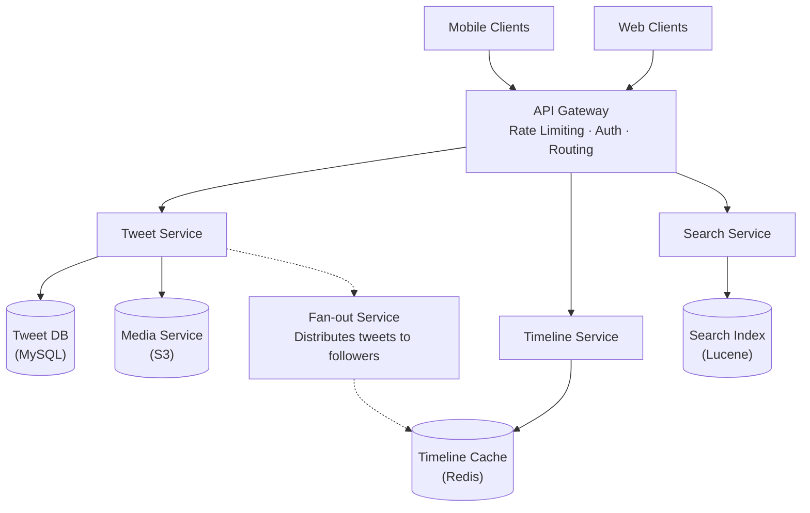
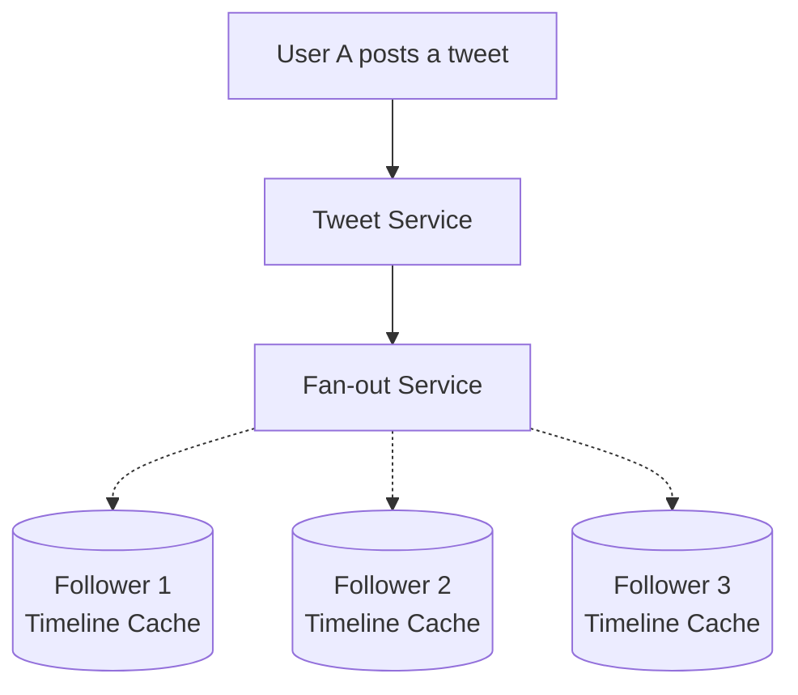
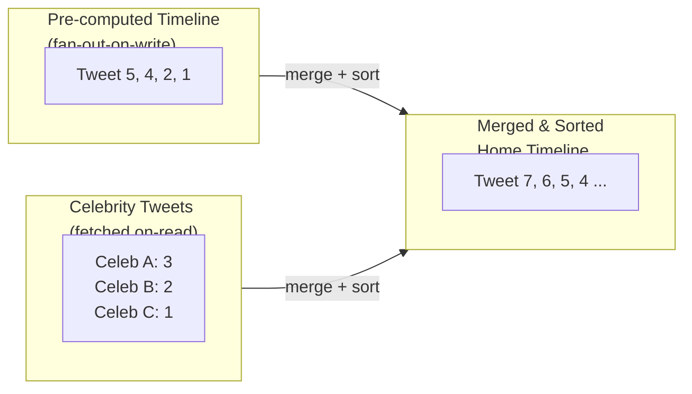
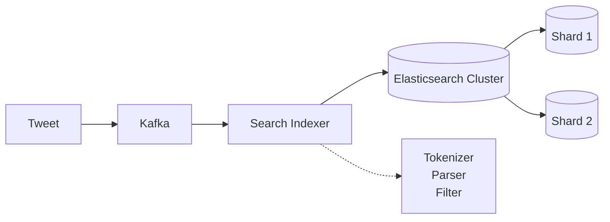

# Twitter System Design

## TL;DR

Twitter handles 500M+ tweets per day with a fan-out-on-write architecture for home timeline delivery. Key challenges include celebrity accounts with millions of followers (fan-out becomes expensive), real-time search indexing, and trend detection. The system uses a hybrid approach: fan-out for regular users, fan-out-on-read for celebrities.

---

## Core Requirements

### Functional Requirements
- Post tweets (280 characters, media attachments)
- Follow/unfollow users
- Home timeline (tweets from followed users)
- User timeline (user's own tweets)
- Search tweets
- Trending topics
- Notifications (mentions, likes, retweets)

### Non-Functional Requirements
- High availability (99.99%)
- Low latency timeline reads (< 200ms)
- Handle 500M tweets/day writes
- Support users with 50M+ followers
- Real-time trend detection

---

## High-Level Architecture



---

## Timeline Architecture

### Fan-Out-on-Write (Push Model)



Each follower's timeline cache gets the tweet ID appended.

```java
import com.twitter.finagle.Service;
import redis.clients.jedis.JedisCluster;
import redis.clients.jedis.Pipeline;
import java.util.List;
import java.util.concurrent.CompletableFuture;
import java.util.concurrent.ExecutorService;
import java.util.concurrent.Executors;

public class FanOutService {
    private final JedisCluster redis;
    private final FollowerService followerService;
    private final ExecutorService executor;
    private static final int MAX_TIMELINE_SIZE = 800; // Keep last 800 tweets

    public FanOutService(JedisCluster redis, FollowerService followerService) {
        this.redis = redis;
        this.followerService = followerService;
        this.executor = Executors.newFixedThreadPool(64);
    }

    /**
     * Distribute tweet to all followers' timelines.
     */
    public CompletableFuture<Void> fanOutTweet(Tweet tweet) {
        long userId = tweet.getAuthorId();

        return followerService.getFollowerCount(userId).thenComposeAsync(followerCount -> {
            // Check if user is a celebrity (high follower count)
            if (followerCount > 10_000) {
                // Don't fan out for celebrities - use fan-out-on-read
                return markAsCelebrityTweet(tweet);
            }

            // Get all followers and fan out
            return followerService.getFollowers(userId).thenAcceptAsync(followers -> {
                Pipeline pipe = redis.pipelined();

                for (Long followerId : followers) {
                    String timelineKey = "timeline:" + followerId;

                    // Add tweet ID to timeline (sorted set by timestamp)
                    pipe.zadd(timelineKey, tweet.getCreatedAt().toEpochMilli(), String.valueOf(tweet.getId()));

                    // Trim to max size
                    pipe.zremrangeByRank(timelineKey, 0, -MAX_TIMELINE_SIZE - 1);
                }

                pipe.sync();
            }, executor);
        }, executor);
    }

    /** Store in celebrity tweets index for fan-out-on-read. */
    private CompletableFuture<Void> markAsCelebrityTweet(Tweet tweet) {
        return CompletableFuture.runAsync(() -> {
            redis.zadd(
                "celebrity_tweets:" + tweet.getAuthorId(),
                tweet.getCreatedAt().toEpochMilli(),
                String.valueOf(tweet.getId())
            );
        }, executor);
    }
}
```

### Fan-Out-on-Read for Celebrities

```java
import com.twitter.finagle.Service;
import redis.clients.jedis.JedisCluster;
import java.util.*;
import java.util.concurrent.CompletableFuture;
import java.util.concurrent.ExecutorService;
import java.util.concurrent.Executors;
import java.util.stream.Collectors;

public class TimelineService extends Service<TimelineRequest, TimelineResponse> {
    private final JedisCluster redis;
    private final TweetService tweetService;
    private final FollowService followService;
    private final ExecutorService executor;

    public TimelineService(JedisCluster redis, TweetService tweetService, FollowService followService) {
        this.redis = redis;
        this.tweetService = tweetService;
        this.followService = followService;
        this.executor = Executors.newFixedThreadPool(32);
    }

    /**
     * Get home timeline with hybrid fan-out.
     */
    public CompletableFuture<List<Tweet>> getHomeTimeline(long userId, int count, Long maxId) {
        String timelineKey = "timeline:" + userId;

        // 1. Get pre-computed timeline (fan-out-on-write results)
        CompletableFuture<Set<String>> cachedFuture = CompletableFuture.supplyAsync(() -> {
            if (maxId != null) {
                double maxScore = redis.zscore(timelineKey, String.valueOf(maxId));
                return redis.zrevrangeByScore(timelineKey, maxScore, 0, 0, count);
            }
            return redis.zrevrange(timelineKey, 0, count - 1);
        }, executor);

        // 2. Get tweets from celebrities user follows
        CompletableFuture<List<String>> celebFuture = followService
            .getCelebrityFollowings(userId)
            .thenApplyAsync(celebrityIds -> {
                List<String> celebTweets = new ArrayList<>();
                for (Long celebrityId : celebrityIds) {
                    Set<String> tweets = redis.zrevrange("celebrity_tweets:" + celebrityId, 0, count - 1);
                    celebTweets.addAll(tweets);
                }
                return celebTweets;
            }, executor);

        // 3. Merge and sort
        return cachedFuture.thenCombineAsync(celebFuture, (cached, celeb) -> {
            Set<String> allIds = new LinkedHashSet<>(cached);
            allIds.addAll(celeb);
            return allIds;
        }, executor).thenComposeAsync(allIds -> {
            return tweetService.getTweetsBatch(
                allIds.stream().map(Long::parseLong).collect(Collectors.toList())
            );
        }, executor).thenApplyAsync(tweets -> {
            tweets.sort(Comparator.comparing(Tweet::getCreatedAt).reversed());
            return tweets.subList(0, Math.min(count, tweets.size()));
        }, executor);
    }
}
```



---

## Tweet Storage

### Database Schema

```sql
-- Tweets table (sharded by tweet_id)
CREATE TABLE tweets (
    id BIGINT PRIMARY KEY,           -- Snowflake ID
    author_id BIGINT NOT NULL,
    content VARCHAR(280) NOT NULL,
    reply_to_id BIGINT,              -- If this is a reply
    retweet_of_id BIGINT,            -- If this is a retweet
    quote_tweet_id BIGINT,           -- If this is a quote tweet
    media_ids JSON,                  -- Array of media IDs
    created_at TIMESTAMP NOT NULL,
    
    INDEX idx_author_created (author_id, created_at DESC),
    INDEX idx_reply (reply_to_id),
    INDEX idx_retweet (retweet_of_id)
) ENGINE=InnoDB;

-- User timeline (denormalized for fast reads)
CREATE TABLE user_timeline (
    user_id BIGINT NOT NULL,
    tweet_id BIGINT NOT NULL,
    created_at TIMESTAMP NOT NULL,
    
    PRIMARY KEY (user_id, tweet_id),
    INDEX idx_user_time (user_id, created_at DESC)
) ENGINE=InnoDB;

-- Follows relationship
CREATE TABLE follows (
    follower_id BIGINT NOT NULL,
    followee_id BIGINT NOT NULL,
    created_at TIMESTAMP NOT NULL,
    
    PRIMARY KEY (follower_id, followee_id),
    INDEX idx_followee (followee_id)
) ENGINE=InnoDB;
```

### Tweet ID Generation (Snowflake)

```java
import java.util.concurrent.atomic.AtomicLong;

/**
 * Twitter's Snowflake ID generator.
 * 64-bit IDs with embedded timestamp for ordering.
 *
 * Structure:
 * | 1 bit unused | 41 bits timestamp | 10 bits machine | 12 bits sequence |
 */
public class SnowflakeGenerator {
    private static final long TWITTER_EPOCH = 1288834974657L; // Nov 4, 2010
    private static final int MACHINE_ID_BITS = 10;
    private static final int SEQUENCE_BITS = 12;
    private static final long MAX_SEQUENCE = (1L << SEQUENCE_BITS) - 1; // 4095

    private final long machineId;
    private final AtomicLong sequence = new AtomicLong(0);
    private long lastTimestamp = -1L;

    public SnowflakeGenerator(int machineId) {
        this.machineId = machineId & 0x3FF; // 10 bits
    }

    private long currentMillis() {
        return System.currentTimeMillis();
    }

    private long waitNextMillis(long lastTs) {
        long ts = currentMillis();
        while (ts <= lastTs) {
            ts = currentMillis();
        }
        return ts;
    }

    public synchronized long nextId() {
        long timestamp = currentMillis();

        if (timestamp < lastTimestamp) {
            throw new IllegalStateException(
                "Clock moved backwards! Refusing to generate ID for "
                + (lastTimestamp - timestamp) + " milliseconds"
            );
        }

        if (timestamp == lastTimestamp) {
            long seq = sequence.incrementAndGet() & MAX_SEQUENCE;
            if (seq == 0) {
                timestamp = waitNextMillis(lastTimestamp);
            }
        } else {
            sequence.set(0);
        }

        lastTimestamp = timestamp;

        // Compose ID with bit manipulation
        return ((timestamp - TWITTER_EPOCH) << (MACHINE_ID_BITS + SEQUENCE_BITS))
             | (machineId << SEQUENCE_BITS)
             | sequence.get();
    }

    /** Extract creation timestamp from a Snowflake ID. */
    public static long extractTimestamp(long snowflakeId) {
        return (snowflakeId >> (MACHINE_ID_BITS + SEQUENCE_BITS)) + TWITTER_EPOCH;
    }

    // Usage
    public static void main(String[] args) {
        SnowflakeGenerator generator = new SnowflakeGenerator(1);
        long tweetId = generator.nextId(); // e.g., 1234567890123456789
        long createdAt = extractTimestamp(tweetId);
    }
}
```

---

## Search Architecture



```java
import com.twitter.finagle.Service;
import org.elasticsearch.action.index.IndexRequest;
import org.elasticsearch.action.search.SearchRequest;
import org.elasticsearch.action.search.SearchResponse;
import org.elasticsearch.client.RestHighLevelClient;
import org.elasticsearch.index.query.BoolQueryBuilder;
import org.elasticsearch.index.query.QueryBuilders;
import org.elasticsearch.search.builder.SearchSourceBuilder;
import org.elasticsearch.search.sort.SortOrder;

import java.util.*;
import java.util.concurrent.CompletableFuture;
import java.util.concurrent.ExecutorService;
import java.util.concurrent.Executors;
import java.util.regex.Matcher;
import java.util.regex.Pattern;
import java.util.stream.Collectors;

public class TweetSearchService extends Service<SearchRequest, SearchResponse> {
    private final RestHighLevelClient esClient;
    private final ExecutorService executor;
    private static final String INDEX_NAME = "tweets";
    private static final Pattern HASHTAG_PATTERN = Pattern.compile("#(\\w+)");
    private static final Pattern MENTION_PATTERN = Pattern.compile("@(\\w+)");

    public TweetSearchService(RestHighLevelClient esClient) {
        this.esClient = esClient;
        this.executor = Executors.newFixedThreadPool(16);
    }

    /** Index tweet for search. */
    public CompletableFuture<Void> indexTweet(Tweet tweet) {
        return CompletableFuture.runAsync(() -> {
            Map<String, Object> doc = new HashMap<>();
            doc.put("id", tweet.getId());
            doc.put("text", tweet.getContent());
            doc.put("author_id", tweet.getAuthorId());
            doc.put("author_username", tweet.getAuthor().getUsername());
            doc.put("created_at", tweet.getCreatedAt().toString());
            doc.put("hashtags", extractHashtags(tweet.getContent()));
            doc.put("mentions", extractMentions(tweet.getContent()));
            doc.put("engagement", Map.of(
                "likes", tweet.getLikeCount(),
                "retweets", tweet.getRetweetCount(),
                "replies", tweet.getReplyCount()
            ));

            IndexRequest request = new IndexRequest(INDEX_NAME)
                .id(String.valueOf(tweet.getId()))
                .source(doc);
            esClient.index(request);
        }, executor);
    }

    /** Search tweets with relevance ranking. */
    public CompletableFuture<List<Map<String, Object>>> search(
            String query, Map<String, String> filters, int size) {
        return CompletableFuture.supplyAsync(() -> {
            BoolQueryBuilder boolQuery = QueryBuilders.boolQuery()
                .must(QueryBuilders.multiMatchQuery(query, "text^2", "author_username")
                    .type("best_fields"));

            // Apply filters
            if (filters != null) {
                if (filters.containsKey("from_user")) {
                    boolQuery.filter(QueryBuilders.termQuery("author_username", filters.get("from_user")));
                }
                if (filters.containsKey("since")) {
                    boolQuery.filter(QueryBuilders.rangeQuery("created_at").gte(filters.get("since")));
                }
            }

            SearchSourceBuilder source = new SearchSourceBuilder()
                .query(boolQuery)
                .sort("_score", SortOrder.DESC)
                .sort("created_at", SortOrder.DESC)
                .size(size);

            SearchRequest searchRequest = new SearchRequest(INDEX_NAME).source(source);
            SearchResponse response = esClient.search(searchRequest);

            return Arrays.stream(response.getHits().getHits())
                .map(hit -> hit.getSourceAsMap())
                .collect(Collectors.toList());
        }, executor);
    }

    private List<String> extractHashtags(String text) {
        Matcher matcher = HASHTAG_PATTERN.matcher(text);
        List<String> tags = new ArrayList<>();
        while (matcher.find()) { tags.add(matcher.group(1)); }
        return tags;
    }

    private List<String> extractMentions(String text) {
        Matcher matcher = MENTION_PATTERN.matcher(text);
        List<String> mentions = new ArrayList<>();
        while (matcher.find()) { mentions.add(matcher.group(1)); }
        return mentions;
    }
}
```

---

## Trending Topics

```java
import redis.clients.jedis.JedisCluster;
import redis.clients.jedis.ScanParams;
import redis.clients.jedis.ScanResult;

import java.util.*;
import java.util.concurrent.CompletableFuture;
import java.util.concurrent.ExecutorService;
import java.util.concurrent.Executors;
import java.util.stream.Collectors;

/**
 * Detect trending topics using sliding window and velocity.
 * Backed by Redis (Twemcache) with Storm for real-time stream processing.
 */
public class TrendingService {
    private final JedisCluster redis;
    private final ExecutorService executor;
    private static final int WINDOW_SIZE = 3600;  // 1 hour window
    private static final int BUCKET_SIZE = 60;    // 1 minute buckets

    public TrendingService(JedisCluster redis) {
        this.redis = redis;
        this.executor = Executors.newFixedThreadPool(16);
    }

    /** Record hashtag occurrence. */
    public CompletableFuture<Void> recordHashtag(String hashtag, String location) {
        return CompletableFuture.runAsync(() -> {
            long now = System.currentTimeMillis() / 1000;
            long bucket = now / BUCKET_SIZE;

            String key = "trend:" + location + ":" + hashtag;
            redis.hincrBy(key, String.valueOf(bucket), 1);
            redis.expire(key, WINDOW_SIZE * 2);
        }, executor);
    }

    /** Get trending topics with velocity score. */
    public CompletableFuture<List<Map.Entry<String, Double>>> getTrending(String location, int count) {
        return CompletableFuture.supplyAsync(() -> {
            long now = System.currentTimeMillis() / 1000;
            long currentBucket = now / BUCKET_SIZE;

            String pattern = "trend:" + location + ":*";
            Set<String> keys = scanKeys(pattern);
            Map<String, Double> scores = new HashMap<>();

            for (String key : keys) {
                String hashtag = key.substring(key.lastIndexOf(':') + 1);
                Map<String, String> buckets = redis.hgetAll(key);

                long recentCount = 0;
                long olderCount = 0;

                for (Map.Entry<String, String> entry : buckets.entrySet()) {
                    long bucket = Long.parseLong(entry.getKey());
                    long cnt = Long.parseLong(entry.getValue());

                    // Skip expired buckets
                    if ((currentBucket - bucket) * BUCKET_SIZE > WINDOW_SIZE) continue;

                    if (currentBucket - bucket <= 10) { // Last 10 minutes
                        recentCount += cnt;
                    } else {
                        olderCount += cnt;
                    }
                }

                long total = recentCount + olderCount;
                if (total < 10) continue; // Minimum threshold

                double velocity = (recentCount * 2.0 + olderCount) / (WINDOW_SIZE / 60.0);
                scores.put(hashtag, velocity);
            }

            return scores.entrySet().stream()
                .sorted(Map.Entry.<String, Double>comparingByValue().reversed())
                .limit(count)
                .collect(Collectors.toList());
        }, executor);
    }

    /** Get trends personalized to user's interests. */
    public CompletableFuture<List<Map.Entry<String, Double>>> getPersonalizedTrends(
            long userId, String location) {
        return CompletableFuture.supplyAsync(() -> getUserInterests(userId), executor)
            .thenCombine(getTrending(location, 50), (interests, globalTrends) -> {
                Map<String, Double> boosted = new LinkedHashMap<>();
                for (Map.Entry<String, Double> entry : globalTrends) {
                    double boost = interests.contains(entry.getKey().toLowerCase()) ? 1.5 : 1.0;
                    boosted.put(entry.getKey(), entry.getValue() * boost);
                }
                return boosted.entrySet().stream()
                    .sorted(Map.Entry.<String, Double>comparingByValue().reversed())
                    .collect(Collectors.toList());
            });
    }

    private Set<String> scanKeys(String pattern) {
        Set<String> keys = new HashSet<>();
        ScanParams params = new ScanParams().match(pattern).count(100);
        String cursor = "0";
        do {
            ScanResult<String> result = redis.scan(cursor, params);
            keys.addAll(result.getResult());
            cursor = result.getCursor();
        } while (!"0".equals(cursor));
        return keys;
    }

    private Set<String> getUserInterests(long userId) {
        return redis.smembers("user:interests:" + userId);
    }
}
```

---

## Notifications

```java
import redis.clients.jedis.JedisCluster;
import java.util.*;
import java.util.concurrent.CompletableFuture;
import java.util.concurrent.ExecutorService;
import java.util.concurrent.Executors;
import java.util.stream.Collectors;

public enum NotificationType {
    LIKE("like"), RETWEET("retweet"), REPLY("reply"),
    MENTION("mention"), FOLLOW("follow"), QUOTE("quote");

    private final String value;
    NotificationType(String value) { this.value = value; }
    public String getValue() { return value; }
}

public class Notification {
    private final long id;
    private final long userId;
    private final NotificationType type;
    private final long actorId;
    private final Long tweetId;       // nullable
    private final double createdAt;

    public Notification(long id, long userId, NotificationType type,
                        long actorId, Long tweetId, double createdAt) {
        this.id = id;
        this.userId = userId;
        this.type = type;
        this.actorId = actorId;
        this.tweetId = tweetId;
        this.createdAt = createdAt;
    }

    // Getters omitted for brevity
    public long getId() { return id; }
    public long getUserId() { return userId; }
    public NotificationType getType() { return type; }
    public long getActorId() { return actorId; }
    public Long getTweetId() { return tweetId; }
    public double getCreatedAt() { return createdAt; }
}

public class NotificationService {
    private final JedisCluster redis;
    private final PushService pushService;
    private final ExecutorService executor;
    private static final int MAX_NOTIFICATIONS = 1000;

    public NotificationService(JedisCluster redis, PushService pushService) {
        this.redis = redis;
        this.pushService = pushService;
        this.executor = Executors.newFixedThreadPool(16);
    }

    /** Create and deliver notification. */
    public CompletableFuture<Void> createNotification(long userId, Notification notification) {
        return CompletableFuture.runAsync(() -> {
            String key = "notifications:" + userId;

            // Store in notification sorted set
            redis.zadd(key, notification.getCreatedAt(), String.valueOf(notification.getId()));

            // Trim old notifications
            redis.zremrangeByRank(key, 0, -MAX_NOTIFICATIONS - 1);

            // Increment unread count
            redis.incr("notifications:unread:" + userId);

            // Check notification preferences and send push
            Map<String, String> prefs = getNotificationPrefs(userId, notification.getType());
            if ("true".equals(prefs.get("push_enabled"))) {
                pushService.send(
                    userId,
                    formatTitle(notification),
                    formatBody(notification)
                );
            }
        }, executor);
    }

    /** Get user's notifications. */
    public CompletableFuture<List<Notification>> getNotifications(long userId, int count, Double cursor) {
        return CompletableFuture.supplyAsync(() -> {
            String key = "notifications:" + userId;
            Set<String> ids;

            if (cursor != null) {
                ids = redis.zrevrangeByScore(key, cursor, 0, 0, count);
            } else {
                ids = redis.zrevrange(key, 0, count - 1);
            }

            List<Notification> notifications = fetchNotifications(ids);

            // Mark as read
            redis.set("notifications:unread:" + userId, "0");
            return notifications;
        }, executor);
    }

    /**
     * Aggregate similar notifications.
     * e.g., "User A and 5 others liked your tweet"
     */
    public CompletableFuture<Void> aggregateNotifications(
            long userId, long tweetId, Notification notification) {
        return CompletableFuture.runAsync(() -> {
            String key = "notification:aggregate:" + tweetId + ":" + notification.getType().getValue();

            redis.sadd(key, String.valueOf(notification.getActorId()));
            redis.expire(key, 86400); // 24 hours

            long aggregatedCount = redis.scard(key);

            if (aggregatedCount == 1) {
                createNotification(userId, notification).join();
            } else {
                updateAggregatedNotification(userId, tweetId, notification.getType(), aggregatedCount);
            }
        }, executor);
    }

    private Map<String, String> getNotificationPrefs(long userId, NotificationType type) {
        return redis.hgetAll("notification:prefs:" + userId + ":" + type.getValue());
    }

    private String formatTitle(Notification n) { /* format based on type */ return ""; }
    private String formatBody(Notification n) { /* format based on type */ return ""; }
    private List<Notification> fetchNotifications(Set<String> ids) { return Collections.emptyList(); }
    private void updateAggregatedNotification(long userId, long tweetId, NotificationType type, long count) {}
}
```

---

## Key Metrics & Scale

| Metric | Value |
|--------|-------|
| Daily Active Users | 200M+ |
| Tweets per day | 500M+ |
| Timeline reads/sec | 300K+ |
| Search queries/sec | 50K+ |
| Average latency (timeline) | < 100ms |
| Fan-out time (non-celebrity) | < 5 seconds |

---

## Production Insights

### Celebrity Fan-Out and Thundering Herd

When a celebrity with 50M+ followers posts a tweet, naive fan-out-on-write would mean
writing to 50 million Redis sorted sets in a single burst. This creates a thundering herd
that can saturate network links, blow through Twemcache memory limits, and spike GC pauses
across the fan-out worker fleet. Twitter's mitigation is the hybrid model: accounts above
a follower threshold are flagged as "celebrity" and their tweets are never fanned out.
Instead, the Timeline Service merges celebrity tweets at read time. The threshold is
dynamic — it can be lowered during high-traffic events (e.g., Super Bowl) to shed write
load. An additional safeguard is rate-limiting the fan-out queue per author so that
automated bot accounts cannot trigger a write storm even if they accumulate followers.

### Manhattan KV Store Rationale

Twitter replaced its earlier MySQL-backed timeline store with Manhattan, an in-house
multi-tenant, eventually-consistent key-value store. The motivation was operational:
MySQL sharding required manual shard splits, cross-shard queries for user migrations,
and careful schema evolution. Manhattan provides automatic partition rebalancing,
tunable consistency (per-key read-your-writes when needed, eventual otherwise), and
native multi-datacenter replication via CRDT-like merge semantics. It stores timeline
data, user metadata, and social graph adjacency lists. The storage engine uses LSM
trees optimized for write-heavy workloads, and supports secondary indexes for reverse
lookups (e.g., "who follows this user?"). The API exposes range scans, which map
naturally to paginated timeline reads keyed by Snowflake IDs.

### Finagle RPC Circuit Breaking

Every inter-service call at Twitter goes through Finagle, a protocol-agnostic RPC
framework built on Netty. Finagle provides built-in circuit breaking using a
successive-failure policy: after N consecutive failures (or when the failure rate over
a sliding window exceeds a threshold), the circuit opens and subsequent requests are
failed fast for a configurable cool-down period. This prevents a single degraded
downstream (e.g., a slow Elasticsearch shard) from consuming all threads in the caller's
pool and cascading into a full outage. Finagle also supports request-level deadlines
propagated via Thrift context — if a timeline read has already exceeded its 200ms budget
by the time it reaches the tweet lookup service, the downstream call is abandoned early.
Load balancing uses a "power of two choices" algorithm (p2c) with latency-aware scoring,
routing requests away from slow hosts before the circuit even trips.

### Clock Skew in Snowflake ID Generation

Snowflake's correctness depends on a monotonically advancing clock. In production,
NTP corrections and VM live-migrations can cause the system clock to jump backward.
When `nextId()` detects `timestamp < lastTimestamp`, it throws rather than issuing a
duplicate or out-of-order ID. Twitter's operational response is threefold:
(1) Run NTP with `-x` flag to slew rather than step the clock, bounding corrections
to 500ppm drift instead of abrupt jumps.
(2) Monitor clock offset via a sidecar that compares the local clock to multiple NTP
sources and alerts when skew exceeds 10ms.
(3) Provision spare Snowflake workers with distinct machine IDs — when a worker refuses
to issue IDs due to clock regression, traffic is shifted to a healthy worker while the
affected host re-syncs. The 41-bit timestamp field gives roughly 69 years of headroom
from the Twitter epoch (Nov 4, 2010), meaning ID space exhaustion is not a near-term
concern, but the machine-ID assignment (10 bits = 1024 workers) requires coordination
via ZooKeeper to prevent collisions across data centers.

---

## Key Takeaways

1. **Hybrid fan-out**: Fan-out-on-write for regular users (pre-compute timelines), fan-out-on-read for celebrities (merge at read time)

2. **Snowflake IDs**: Time-ordered, distributed ID generation enables efficient range queries and implicit ordering

3. **Redis for timelines**: Timeline cache in Redis for fast reads; MySQL for persistence

4. **Real-time search**: Separate search index (Elasticsearch) with near-real-time ingestion via Kafka

5. **Velocity-based trending**: Detect trends based on rate of change, not just absolute counts

6. **Notification aggregation**: Group similar notifications ("A and 5 others liked...") to reduce noise
