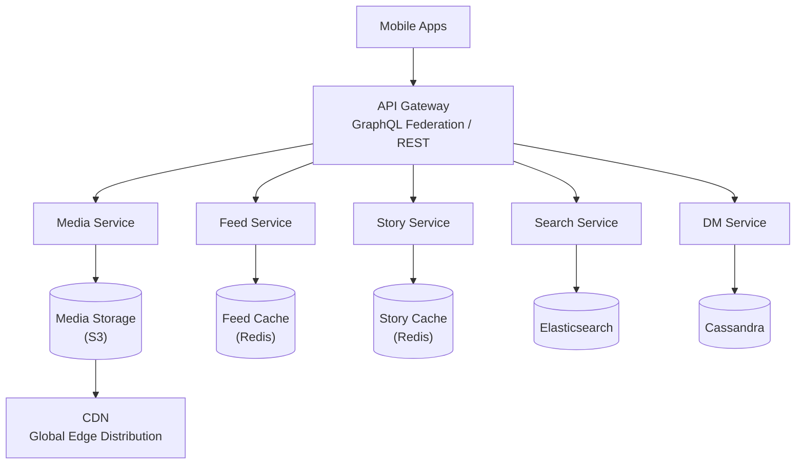
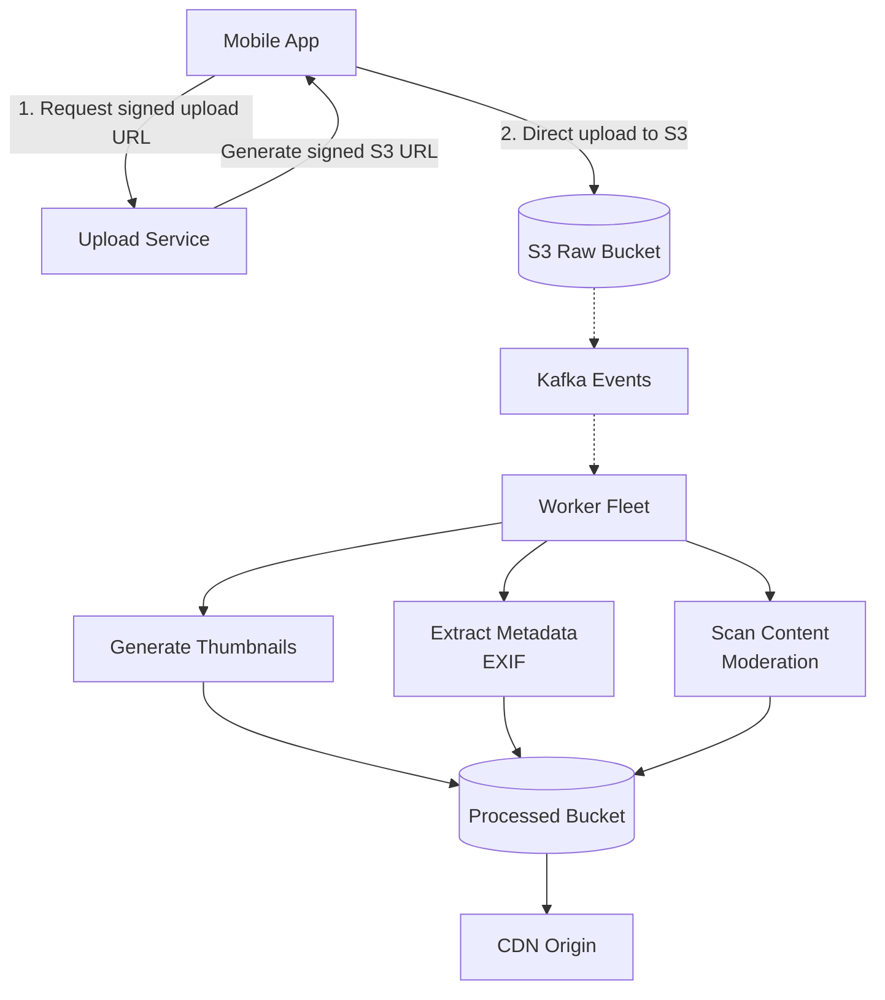

# Instagram System Design

## TL;DR

Instagram handles 2+ billion monthly active users with a focus on media-heavy content (photos, videos, stories). Key challenges include efficient image/video storage and delivery at scale, personalized feed ranking (not chronological), and handling viral content. The architecture emphasizes CDN distribution, async processing pipelines, and ML-based ranking.

---

## Core Requirements

### Functional Requirements
- Upload photos and videos
- Follow/unfollow users
- News feed (algorithmically ranked)
- Stories (24-hour ephemeral content)
- Direct messages
- Explore/discover content
- Likes, comments, saves
- Search (users, hashtags, locations)

### Non-Functional Requirements
- High availability (99.99%)
- Low latency feed loads (< 500ms)
- Handle 100M+ photos uploaded daily
- Efficient media storage and delivery
- Support viral content (sudden spikes)

---

## High-Level Architecture



---

## Media Upload Pipeline



```python
import boto3
import hashlib
from dataclasses import dataclass
from typing import List
import asyncio

@dataclass
class MediaVariant:
    name: str
    width: int
    height: int
    quality: int

class MediaProcessingService:
    """Process uploaded media into multiple variants."""
    
    VARIANTS = [
        MediaVariant("thumbnail", 150, 150, 80),
        MediaVariant("small", 320, 320, 80),
        MediaVariant("medium", 640, 640, 85),
        MediaVariant("large", 1080, 1080, 90),
        MediaVariant("original", 0, 0, 100),  # Keep original
    ]
    
    def __init__(self, s3_client, sqs_client):
        self.s3 = s3_client
        self.sqs = sqs_client
        self.raw_bucket = "instagram-raw"
        self.processed_bucket = "instagram-processed"
    
    async def process_upload(self, media_id: str, s3_key: str):
        """Process uploaded media."""
        
        # Download original
        original = await self._download(self.raw_bucket, s3_key)
        
        # Generate variants in parallel
        tasks = [
            self._generate_variant(media_id, original, variant)
            for variant in self.VARIANTS
        ]
        
        variant_keys = await asyncio.gather(*tasks)
        
        # Store variant metadata
        await self._store_variant_metadata(media_id, variant_keys)
        
        # Trigger CDN prefetch for popular regions
        await self._prefetch_to_cdn(variant_keys)
        
        return variant_keys
    
    async def _generate_variant(
        self, 
        media_id: str, 
        original: bytes,
        variant: MediaVariant
    ) -> str:
        """Generate a single variant."""
        from PIL import Image
        import io
        
        img = Image.open(io.BytesIO(original))
        
        if variant.width > 0:
            # Resize maintaining aspect ratio
            img.thumbnail((variant.width, variant.height), Image.LANCZOS)
        
        # Save to buffer
        buffer = io.BytesIO()
        img.save(buffer, format='JPEG', quality=variant.quality)
        buffer.seek(0)
        
        # Upload to S3
        key = f"media/{media_id}/{variant.name}.jpg"
        await self._upload(self.processed_bucket, key, buffer.read())
        
        return key
    
    def get_cdn_url(self, media_id: str, variant: str = "medium") -> str:
        """Get CDN URL for media variant."""
        return f"https://cdn.instagram.com/media/{media_id}/{variant}.jpg"
```

---

## News Feed Architecture

### Ranking-Based Feed (Not Chronological)

```python
from dataclasses import dataclass
from typing import List, Dict
import numpy as np

@dataclass
class FeedCandidate:
    post_id: str
    author_id: str
    created_at: float
    features: Dict[str, float]

class FeedRankingService:
    """
    Rank feed posts using ML model.
    Instagram uses engagement prediction models.
    """
    
    def __init__(self, model_service, feature_store):
        self.model = model_service
        self.features = feature_store
    
    async def generate_feed(
        self, 
        user_id: str, 
        count: int = 20
    ) -> List[str]:
        """Generate ranked feed for user."""
        
        # 1. Candidate Generation
        candidates = await self._get_candidates(user_id)
        
        # 2. Feature Extraction
        enriched = await self._extract_features(user_id, candidates)
        
        # 3. Ranking
        scored = await self._score_candidates(enriched)
        
        # 4. Diversification
        diversified = self._diversify(scored)
        
        # 5. Final selection
        return [c.post_id for c in diversified[:count]]
    
    async def _get_candidates(self, user_id: str) -> List[FeedCandidate]:
        """
        Get candidate posts from followed users.
        Also includes some explore candidates for discovery.
        """
        following = await self._get_following(user_id)
        
        candidates = []
        
        # Recent posts from following (last 3 days)
        for followee_id in following:
            posts = await self._get_recent_posts(followee_id, days=3)
            candidates.extend(posts)
        
        # Add some explore candidates (10%)
        explore_candidates = await self._get_explore_candidates(user_id)
        candidates.extend(explore_candidates[:len(candidates) // 10])
        
        return candidates
    
    async def _extract_features(
        self, 
        user_id: str,
        candidates: List[FeedCandidate]
    ) -> List[FeedCandidate]:
        """Extract ranking features for candidates."""
        
        for candidate in candidates:
            # User-author affinity
            candidate.features['affinity'] = await self.features.get_affinity(
                user_id, candidate.author_id
            )
            
            # Post engagement rate
            candidate.features['engagement_rate'] = await self.features.get_engagement_rate(
                candidate.post_id
            )
            
            # Recency (time decay)
            age_hours = (time.time() - candidate.created_at) / 3600
            candidate.features['recency'] = 1.0 / (1.0 + age_hours / 24)
            
            # Content type affinity
            candidate.features['content_affinity'] = await self.features.get_content_affinity(
                user_id, candidate.post_id
            )
            
            # Author engagement history
            candidate.features['author_engagement'] = await self.features.get_author_engagement(
                user_id, candidate.author_id
            )
        
        return candidates
    
    async def _score_candidates(
        self, 
        candidates: List[FeedCandidate]
    ) -> List[FeedCandidate]:
        """Score candidates using ML model."""
        
        # Prepare feature matrix
        feature_names = ['affinity', 'engagement_rate', 'recency', 
                        'content_affinity', 'author_engagement']
        
        X = np.array([
            [c.features[f] for f in feature_names]
            for c in candidates
        ])
        
        # Get predictions (probability of engagement)
        scores = await self.model.predict(X)
        
        for candidate, score in zip(candidates, scores):
            candidate.features['score'] = score
        
        # Sort by score
        candidates.sort(key=lambda c: c.features['score'], reverse=True)
        
        return candidates
    
    def _diversify(
        self, 
        candidates: List[FeedCandidate]
    ) -> List[FeedCandidate]:
        """
        Diversify feed to avoid showing too many posts
        from same author or same content type.
        """
        result = []
        author_counts = {}
        max_per_author = 3
        
        for candidate in candidates:
            author_id = candidate.author_id
            
            if author_counts.get(author_id, 0) < max_per_author:
                result.append(candidate)
                author_counts[author_id] = author_counts.get(author_id, 0) + 1
        
        return result
```

### Feed Caching Strategy

```python
class FeedCacheService:
    """
    Cache pre-computed feeds for fast reads.
    Invalidate on new posts from followed users.
    """
    
    def __init__(self, redis_client, ranking_service):
        self.redis = redis_client
        self.ranking = ranking_service
        self.cache_ttl = 300  # 5 minutes
    
    async def get_feed(
        self, 
        user_id: str, 
        cursor: str = None,
        count: int = 20
    ) -> tuple[List[str], str]:
        """Get feed with pagination."""
        
        cache_key = f"feed:v2:{user_id}"
        
        # Try cache first
        cached = await self.redis.get(cache_key)
        
        if not cached:
            # Generate and cache feed
            post_ids = await self.ranking.generate_feed(user_id, count=100)
            await self.redis.setex(
                cache_key, 
                self.cache_ttl,
                json.dumps(post_ids)
            )
        else:
            post_ids = json.loads(cached)
        
        # Pagination
        start_idx = 0
        if cursor:
            try:
                start_idx = post_ids.index(cursor) + 1
            except ValueError:
                start_idx = 0
        
        page = post_ids[start_idx:start_idx + count]
        next_cursor = page[-1] if len(page) == count else None
        
        return page, next_cursor
    
    async def invalidate_feed(self, user_id: str):
        """Invalidate user's feed cache."""
        await self.redis.delete(f"feed:v2:{user_id}")
    
    async def handle_new_post(self, author_id: str, post_id: str):
        """
        Handle new post - invalidate followers' feeds.
        Done async to not block post creation.
        """
        followers = await self._get_followers(author_id)
        
        pipe = self.redis.pipeline()
        for follower_id in followers:
            pipe.delete(f"feed:v2:{follower_id}")
        await pipe.execute()
```

---

## Stories Architecture

```python
from datetime import datetime, timedelta
from typing import List, Optional
import json

@dataclass
class Story:
    id: str
    author_id: str
    media_url: str
    created_at: datetime
    expires_at: datetime
    view_count: int = 0
    viewers: List[str] = None

class StoryService:
    """
    Stories are ephemeral content (24 hours).
    Stored in Redis with TTL.
    """
    
    def __init__(self, redis_client, media_service):
        self.redis = redis_client
        self.media = media_service
        self.story_ttl = 86400  # 24 hours
    
    async def create_story(
        self, 
        user_id: str, 
        media_id: str
    ) -> Story:
        """Create a new story."""
        story_id = generate_id()
        now = datetime.utcnow()
        
        story = Story(
            id=story_id,
            author_id=user_id,
            media_url=self.media.get_cdn_url(media_id),
            created_at=now,
            expires_at=now + timedelta(hours=24),
            viewers=[]
        )
        
        # Store story data
        story_key = f"story:{story_id}"
        await self.redis.setex(
            story_key,
            self.story_ttl,
            json.dumps(story.__dict__, default=str)
        )
        
        # Add to user's story list
        user_stories_key = f"user_stories:{user_id}"
        await self.redis.zadd(
            user_stories_key,
            {story_id: now.timestamp()}
        )
        await self.redis.expire(user_stories_key, self.story_ttl)
        
        # Notify followers
        await self._notify_followers(user_id, story_id)
        
        return story
    
    async def get_stories_feed(self, user_id: str) -> List[dict]:
        """
        Get story trays for users the viewer follows.
        Returns list of users with active stories.
        """
        following = await self._get_following(user_id)
        
        story_trays = []
        
        for followee_id in following:
            stories = await self._get_user_stories(followee_id)
            
            if stories:
                # Get unseen count
                unseen = await self._count_unseen(user_id, followee_id, stories)
                
                story_trays.append({
                    'user_id': followee_id,
                    'story_count': len(stories),
                    'unseen_count': unseen,
                    'latest_story_at': stories[0]['created_at'],
                    'preview_url': stories[0]['media_url']
                })
        
        # Sort by unseen first, then by latest
        story_trays.sort(
            key=lambda x: (x['unseen_count'] == 0, -x['latest_story_at']),
        )
        
        return story_trays
    
    async def view_story(self, viewer_id: str, story_id: str):
        """Record story view."""
        view_key = f"story_views:{story_id}"
        
        # Add to viewers set
        await self.redis.sadd(view_key, viewer_id)
        
        # Increment view count
        await self.redis.hincrby(f"story:{story_id}", "view_count", 1)
        
        # Track that user has seen this story
        seen_key = f"stories_seen:{viewer_id}"
        await self.redis.sadd(seen_key, story_id)
        await self.redis.expire(seen_key, self.story_ttl)
    
    async def _get_user_stories(self, user_id: str) -> List[dict]:
        """Get all active stories for a user."""
        story_ids = await self.redis.zrevrange(
            f"user_stories:{user_id}",
            0, -1
        )
        
        stories = []
        for story_id in story_ids:
            data = await self.redis.get(f"story:{story_id.decode()}")
            if data:
                stories.append(json.loads(data))
        
        return stories
```

---

## Explore/Discovery

```python
class ExploreService:
    """
    Personalized content discovery.
    Uses collaborative filtering and content-based recommendations.
    """
    
    def __init__(self, redis_client, ml_service, feature_store):
        self.redis = redis_client
        self.ml = ml_service
        self.features = feature_store
    
    async def get_explore_feed(
        self, 
        user_id: str,
        count: int = 30
    ) -> List[str]:
        """Generate personalized explore feed."""
        
        # 1. Get user interests
        interests = await self._get_user_interests(user_id)
        
        # 2. Get candidate posts
        candidates = await self._get_explore_candidates(interests)
        
        # 3. Filter already seen
        seen = await self._get_seen_posts(user_id)
        candidates = [c for c in candidates if c.post_id not in seen]
        
        # 4. Score and rank
        scored = await self._score_explore_candidates(user_id, candidates)
        
        # 5. Diversify by topic/author
        diversified = self._diversify_explore(scored)
        
        return [c.post_id for c in diversified[:count]]
    
    async def _get_user_interests(self, user_id: str) -> List[str]:
        """
        Infer user interests from:
        - Posts they've liked
        - Accounts they follow
        - Time spent viewing content
        - Hashtags they engage with
        """
        # Get recent engagements
        recent_likes = await self.features.get_recent_likes(user_id, days=30)
        
        # Extract topics/hashtags from liked posts
        topics = []
        for post_id in recent_likes:
            post_topics = await self.features.get_post_topics(post_id)
            topics.extend(post_topics)
        
        # Get top interests by frequency
        from collections import Counter
        topic_counts = Counter(topics)
        top_interests = [t for t, c in topic_counts.most_common(20)]
        
        return top_interests
    
    async def _get_explore_candidates(
        self, 
        interests: List[str]
    ) -> List[FeedCandidate]:
        """Get candidate posts for explore."""
        candidates = []
        
        # Posts trending in user's interest areas
        for interest in interests[:10]:
            trending = await self._get_trending_for_topic(interest)
            candidates.extend(trending)
        
        # Globally viral posts
        viral = await self._get_viral_posts()
        candidates.extend(viral)
        
        # Posts from suggested accounts
        suggested_accounts = await self._get_suggested_accounts()
        for account in suggested_accounts[:10]:
            posts = await self._get_top_posts(account)
            candidates.extend(posts)
        
        return candidates
```

---

## Data Storage

| System | Type | Stores |
|--------|------|--------|
| PostgreSQL | Relational DB | User profiles, Follows, Authentication, Settings |
| Cassandra | Wide-column | User feeds, Activity logs, Comments, Likes |
| Redis | In-memory cache | Feed cache, Story data, Sessions, Rate limits |
| S3 | Object storage | Photos, Videos, Thumbnails |
| Elasticsearch | Search engine | User search, Hashtag search, Location |
| Kafka | Event streaming | Events, Notifications, Analytics |

---

## Key Metrics & Scale

| Metric | Value |
|--------|-------|
| Monthly Active Users | 2B+ |
| Photos uploaded daily | 100M+ |
| Total photos stored | 100B+ |
| Storage size | Exabytes |
| Average image variants | 5 per photo |
| CDN bandwidth | Petabytes/day |
| Feed loads per day | Billions |

---

## Production Insights

### Cassandra Migration from PostgreSQL

Instagram's activity feed, comments, and likes originally lived in PostgreSQL. At ~500M users, write amplification on PostgreSQL's B-tree indexes became the bottleneck — every like required updating the post's like count, the user's activity feed, and the notification table, all against B-tree indexes with random I/O.

**Why Cassandra won:**
- LSM-tree write path: sequential I/O, writes are append-only to memtable → sstable. 10-50x faster for write-heavy workloads than PostgreSQL's in-place B-tree updates.
- Token-aware routing: the Java driver's `TokenAwarePolicy` routes requests directly to the replica owning the partition key, avoiding coordinator hops. For a `user_id`-partitioned table, this means single-node writes with no cross-node coordination.
- No joins by design: Cassandra has no JOIN support. Instagram enforced a "no-join discipline" at the application layer — every query pattern has a dedicated denormalized table. This forced engineers to think about access patterns upfront instead of relying on ad-hoc SQL joins.

**Migration strategy:**
- Dual-write: application writes to both PostgreSQL and Cassandra simultaneously for 4 weeks.
- Shadow-read validation: reads from Cassandra compared against PostgreSQL. Discrepancy rate tracked until < 0.01%.
- Cutover: read traffic shifted to Cassandra. PostgreSQL kept as fallback for 2 weeks, then decommissioned.
- Replication: `NetworkTopologyStrategy` with RF=3 per datacenter, `LOCAL_QUORUM` for reads and writes. Cross-DC replication is asynchronous — user sees their own writes (session consistency) but followers in other DCs may see 100-500ms staleness.

**Compaction strategy:** `LeveledCompactionStrategy` for read-heavy tables (user profiles, post metadata). `TimeWindowCompactionStrategy` for time-series data (activity feeds, notifications) where older data is rarely accessed and can be compacted into larger SSTables efficiently.

### Django Scaling at 2B MAU

Instagram is one of the largest Django deployments in the world. They never rewrote in a different framework — instead, they optimized Django itself.

**Raw SQL over ORM for hot paths:**
- Django's ORM generates SQL with `select_related` (JOIN) and `prefetch_related` (N+1 → 2 queries). For the feed endpoint (~50% of all traffic), this is too slow.
- Hot paths use raw SQL with hand-tuned queries: `cursor.execute("SELECT ...")` with pre-computed read replicas.
- A custom `PostHydrator` class fetches post data, author data, and social context (mutual friends who liked) in 3 parallel queries instead of ORM's serial chain.

**Read replica routing:**
- Custom Django database router routes `SELECT` queries to read replicas based on the request's AZ (availability zone).
- Sticky reads: after a write, subsequent reads from the same session are routed to the primary for 2 seconds to ensure read-your-writes consistency.
- Each Django app server maintains connection pools to 1 primary + 3 read replicas.

**Celery task architecture:**
- 4 priority queues: `critical` (notifications, DMs), `high` (feed updates, likes), `default` (analytics events, ML feature logging), `low` (email digests, data exports).
- Media transcoding runs on dedicated GPU-equipped worker fleets, not shared Celery workers.
- Fan-out (distributing a new post to followers' feeds) is the most expensive async operation — a celebrity post fans out to 100M+ follower feeds via batched Redis LPUSH operations.
- Task idempotency: every Celery task includes a `task_id` derived from the content hash. Duplicate tasks (from retry storms) are deduplicated at the broker level.

**gunicorn tuning:**
- `--preload`: loads the Django application once in the master process, then forks workers with copy-on-write memory sharing. Saves ~200MB per worker.
- Worker count: `2 * CPU_CORES + 1` for CPU-bound, `4 * CPU_CORES` for I/O-bound (Instagram uses the latter with gevent).
- `--max-requests 10000 --max-requests-jitter 1000`: recycle workers after 10K requests to prevent memory leaks from accumulating.
- `--timeout 30`: kill workers that take > 30s (indicates database lock wait or downstream service failure).

**Why not async Django:**
Instagram evaluated Django 4.x async views (ASGI) but decided against adoption because:
1. Their existing Celery infrastructure handles async workloads.
2. The ORM is not async-native — `sync_to_async` wrappers add overhead without real benefit.
3. The operational risk of migrating 10,000+ views to ASGI outweighs the latency benefit (~5ms improvement on p50).
4. WebSocket needs (real-time DMs, live video) are handled by a separate Go service, not Django.

### Image Processing Pipeline

Instagram processes 100M+ photo uploads per day. The pipeline must generate 5+ image variants (thumbnail, small, medium, large, original) per upload within 2 seconds of the upload completing.

**Pillow vs libvips:**
- Instagram originally used Pillow (PIL fork). At scale, Pillow's memory usage per image (loading the entire decoded image into RAM) became the bottleneck: a 12MP photo consumes ~48MB decoded.
- libvips uses demand-driven processing: it only loads the portion of the image being processed. Memory usage: ~7x less than Pillow for the same operation.
- Throughput: libvips generates thumbnails 3-5x faster than Pillow on the same hardware due to SIMD-optimized codecs and streaming I/O.

**Dedicated worker fleets:**
- Image processing does NOT run on Django app servers. It runs on dedicated `c5.2xlarge` (compute-optimized) worker fleets.
- Three tiers: `fast` (thumbnail + small, < 500ms SLA), `standard` (medium + large, < 2s SLA), `heavy` (video transcoding, filters, < 30s SLA).
- Workers consume from SQS FIFO queues with `MessageGroupId = user_id` to ensure per-user ordering (a user's second upload shouldn't complete before their first).
- Auto-scaling based on `ApproximateNumberOfMessagesVisible` — scale out when queue depth > 1000, scale in when < 100.

**Pre-signed S3 URL pattern:**
- The mobile client requests a pre-signed S3 PUT URL from the API server.
- The client uploads the image directly to S3, bypassing Django entirely. This eliminates the 10-50MB upload from hitting the app server's request handling pipeline.
- After S3 receives the upload, an S3 Event Notification triggers a Lambda that enqueues the processing job.
- Benefit: Django handles a 200-byte metadata request instead of a 10MB file upload. At 100M uploads/day, this saves ~1PB/day of app-server bandwidth.

**CDN cache key strategy:**
- URL format: `https://cdn.instagram.com/{variant_name}/{content_hash}.{format}`
- Example: `https://cdn.instagram.com/t/abc123def456.jpg` (thumbnail), `https://cdn.instagram.com/l/abc123def456.webp` (large, webp)
- Content-addressable: the hash changes when the image content changes (edit, filter applied). Old URLs remain valid (immutable).
- `Cache-Control: public, max-age=31536000, immutable` — cached forever. New versions get new hashes, so no purging needed.
- Three-tier CDN: edge PoP (< 10ms) → regional shield (< 50ms) → S3 origin (< 200ms). Cache hit rate > 99.5% at the edge for images older than 1 hour.

---

## Key Takeaways

1. **Direct-to-S3 uploads**: Bypass app servers for media uploads using signed URLs; process async

2. **Multiple image variants**: Generate thumbnails and sizes upfront; serve appropriate size for device

3. **ML-ranked feeds**: Engagement prediction models rank content; not chronological

4. **Stories in Redis**: Ephemeral content with TTL; no persistence needed

5. **CDN is critical**: Majority of requests served from edge; origin sees tiny fraction

6. **Cassandra for scale**: Wide-column store for high-write workloads (likes, comments, activity)

7. **Explore = Discovery**: Personalized recommendations drive engagement beyond just following
