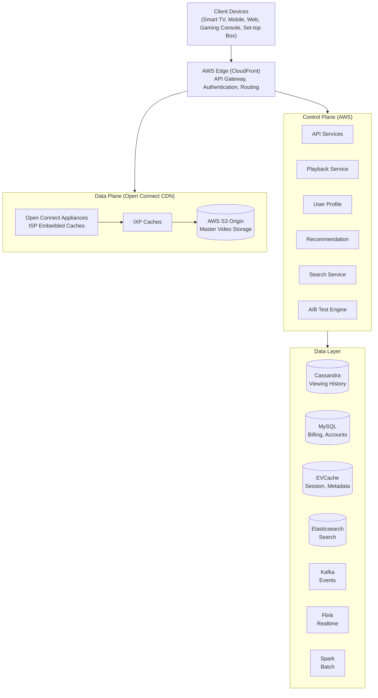
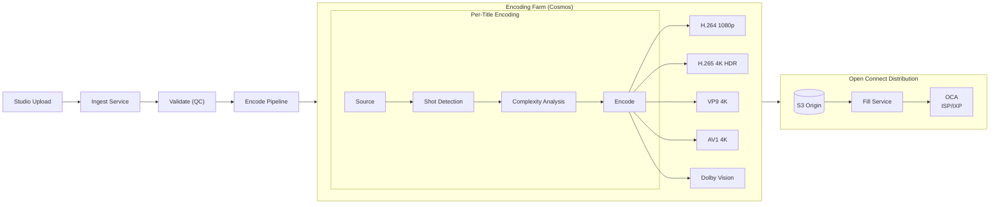
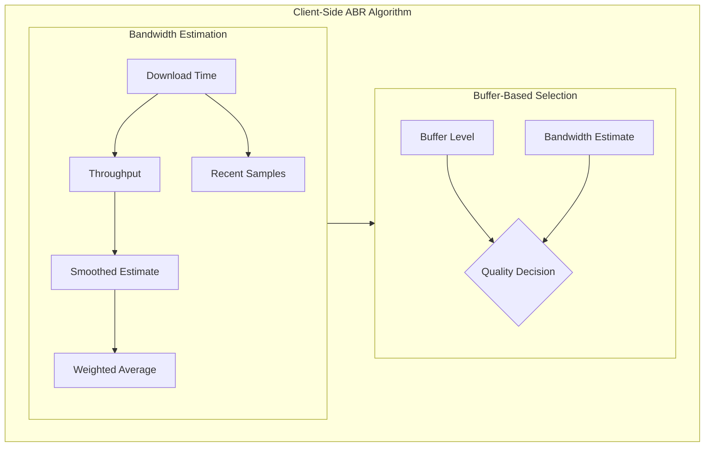
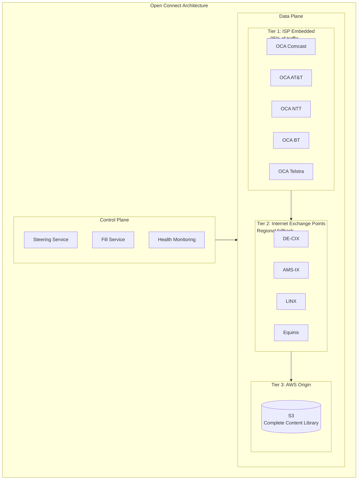
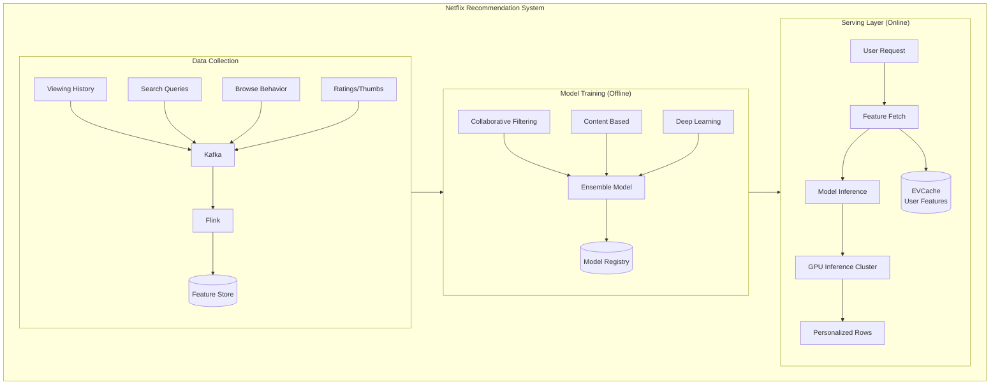

# Netflix System Design

## TL;DR

Netflix streams video to 230M+ subscribers across 190+ countries. The architecture centers on: **adaptive bitrate streaming** (ABR) that adjusts quality in real-time, **CDN infrastructure** (Open Connect) deployed at ISPs worldwide, **microservices architecture** (~1000 services), **recommendation engine** driving 80% of content discovery, and **chaos engineering** ensuring resilience. Key insight: optimize for buffering-free playback through predictive caching and distributed delivery.

---

## Core Requirements

### Functional Requirements
1. **Video streaming** - Play video content with adaptive quality
2. **Content discovery** - Personalized recommendations and search
3. **User profiles** - Multiple profiles per account with preferences
4. **Watchlist management** - Save content for later viewing
5. **Playback continuity** - Resume watching across devices
6. **Content ingestion** - Upload and process new content

### Non-Functional Requirements
1. **Availability** - 99.99% uptime (< 52 minutes downtime/year)
2. **Latency** - Video start < 2 seconds, no buffering
3. **Scale** - 230M+ subscribers, 400M+ hours streamed daily
4. **Global reach** - Low latency delivery in 190+ countries
5. **Fault tolerance** - Graceful degradation during failures

---

## High-Level Architecture



---

## Content Ingestion Pipeline



### Encoding Service Implementation

```python
from dataclasses import dataclass
from typing import List, Dict, Optional
from enum import Enum
import asyncio

class Codec(Enum):
    H264 = "h264"
    H265 = "hevc"
    VP9 = "vp9"
    AV1 = "av1"

class Resolution(Enum):
    SD_480 = (854, 480)
    HD_720 = (1280, 720)
    FHD_1080 = (1920, 1080)
    UHD_4K = (3840, 2160)

@dataclass
class EncodingProfile:
    codec: Codec
    resolution: Resolution
    bitrate_kbps: int
    frame_rate: float
    hdr: bool = False
    
@dataclass
class EncodingLadder:
    """Per-title optimized encoding ladder"""
    title_id: str
    profiles: List[EncodingProfile]
    
class PerTitleEncoder:
    """
    Netflix's per-title encoding optimizes bitrate ladders
    based on content complexity. Simple animations need fewer
    bits than action sequences.
    """
    
    def __init__(self):
        self.complexity_analyzer = ComplexityAnalyzer()
        self.shot_detector = ShotDetector()
    
    async def create_encoding_ladder(
        self, 
        title_id: str,
        source_path: str
    ) -> EncodingLadder:
        # Detect scene changes
        shots = await self.shot_detector.detect(source_path)
        
        # Analyze per-shot complexity
        complexities = []
        for shot in shots:
            complexity = await self.complexity_analyzer.analyze(
                source_path, 
                shot.start_frame, 
                shot.end_frame
            )
            complexities.append(complexity)
        
        # Calculate overall complexity score
        avg_complexity = sum(c.score for c in complexities) / len(complexities)
        
        # Generate optimized bitrate ladder
        profiles = self._generate_ladder(avg_complexity)
        
        return EncodingLadder(
            title_id=title_id,
            profiles=profiles
        )
    
    def _generate_ladder(self, complexity: float) -> List[EncodingProfile]:
        """
        Lower complexity = lower bitrates needed for same quality.
        Animation might use 50% less bitrate than action movie.
        """
        base_profiles = [
            # (resolution, base_bitrate_kbps, codec)
            (Resolution.SD_480, 1500, Codec.H264),
            (Resolution.HD_720, 3000, Codec.H264),
            (Resolution.FHD_1080, 5800, Codec.H265),
            (Resolution.UHD_4K, 16000, Codec.H265),
            (Resolution.UHD_4K, 12000, Codec.AV1),  # AV1 more efficient
        ]
        
        # Adjust bitrates based on complexity (0.0 - 1.0)
        complexity_factor = 0.5 + (complexity * 0.5)
        
        profiles = []
        for resolution, base_bitrate, codec in base_profiles:
            adjusted_bitrate = int(base_bitrate * complexity_factor)
            profiles.append(EncodingProfile(
                codec=codec,
                resolution=resolution,
                bitrate_kbps=adjusted_bitrate,
                frame_rate=24.0,
                hdr=(resolution == Resolution.UHD_4K)
            ))
        
        return profiles


class EncodingOrchestrator:
    """
    Cosmos - Netflix's media encoding platform.
    Manages distributed encoding across cloud resources.
    """
    
    def __init__(self, redis_client, s3_client, kafka_producer):
        self.redis = redis_client
        self.s3 = s3_client
        self.kafka = kafka_producer
        self.encoder = PerTitleEncoder()
    
    async def ingest_title(self, title_id: str, source_url: str) -> str:
        """Ingest and encode a new title"""
        job_id = f"encode:{title_id}:{int(time.time())}"
        
        # Create encoding job
        await self.redis.hset(f"job:{job_id}", mapping={
            "status": "pending",
            "title_id": title_id,
            "source_url": source_url,
            "created_at": time.time()
        })
        
        # Queue for processing
        await self.kafka.send(
            "encoding-jobs",
            key=title_id,
            value={"job_id": job_id, "source_url": source_url}
        )
        
        return job_id
    
    async def process_encoding_job(self, job_id: str):
        """Process encoding job - runs on encoding workers"""
        job = await self.redis.hgetall(f"job:{job_id}")
        title_id = job["title_id"]
        source_url = job["source_url"]
        
        # Download source
        await self.redis.hset(f"job:{job_id}", "status", "downloading")
        source_path = await self._download_source(source_url)
        
        # Generate optimized encoding ladder
        await self.redis.hset(f"job:{job_id}", "status", "analyzing")
        ladder = await self.encoder.create_encoding_ladder(title_id, source_path)
        
        # Encode all profiles in parallel
        await self.redis.hset(f"job:{job_id}", "status", "encoding")
        encode_tasks = []
        for profile in ladder.profiles:
            task = self._encode_profile(title_id, source_path, profile)
            encode_tasks.append(task)
        
        encoded_files = await asyncio.gather(*encode_tasks)
        
        # Upload to S3
        await self.redis.hset(f"job:{job_id}", "status", "uploading")
        for encoded_file, profile in zip(encoded_files, ladder.profiles):
            await self._upload_to_origin(title_id, encoded_file, profile)
        
        # Trigger CDN distribution
        await self._notify_open_connect(title_id, ladder)
        
        await self.redis.hset(f"job:{job_id}", "status", "complete")
```

---

## Adaptive Bitrate Streaming



**Buffer-Based Quality Selection**

| Buffer Level | Bandwidth Estimate | Quality Selection |
|---|---|---|
| < 10s | Low | Lower Quality |
| 10-30s | Medium | Maintain |
| > 30s | High | Upgrade |

### ABR Client Implementation

```javascript
class NetflixABRController {
  constructor(videoElement, manifestUrl) {
    this.video = videoElement;
    this.manifestUrl = manifestUrl;
    this.qualities = [];
    this.currentQualityIndex = 0;
    
    // Bandwidth estimation
    this.bandwidthSamples = [];
    this.maxSamples = 5;
    
    // Buffer thresholds
    this.minBuffer = 10;  // seconds
    this.maxBuffer = 60;  // seconds
    this.targetBuffer = 30;
    
    // Quality switch thresholds
    this.upgradeThreshold = 1.2;  // 20% headroom to upgrade
    this.downgradeThreshold = 0.9; // Aggressive downgrade
  }
  
  async initialize() {
    // Fetch manifest with all quality levels
    const manifest = await this.fetchManifest(this.manifestUrl);
    this.qualities = manifest.representations.sort(
      (a, b) => a.bandwidth - b.bandwidth
    );
    
    // Start with conservative quality
    this.currentQualityIndex = Math.floor(this.qualities.length / 3);
    
    // Begin fetching segments
    this.startBuffering();
  }
  
  async fetchSegment(segmentUrl) {
    const startTime = performance.now();
    
    const response = await fetch(segmentUrl);
    const data = await response.arrayBuffer();
    
    const endTime = performance.now();
    const durationMs = endTime - startTime;
    const sizeBytes = data.byteLength;
    
    // Calculate throughput in kbps
    const throughputKbps = (sizeBytes * 8) / durationMs;
    this.updateBandwidthEstimate(throughputKbps);
    
    return data;
  }
  
  updateBandwidthEstimate(sample) {
    this.bandwidthSamples.push(sample);
    
    // Keep rolling window
    if (this.bandwidthSamples.length > this.maxSamples) {
      this.bandwidthSamples.shift();
    }
  }
  
  getEstimatedBandwidth() {
    if (this.bandwidthSamples.length === 0) {
      return 3000; // Default 3 Mbps assumption
    }
    
    // Weighted average - recent samples weighted higher
    let weightedSum = 0;
    let weightSum = 0;
    
    this.bandwidthSamples.forEach((sample, index) => {
      const weight = index + 1; // Later samples have higher weight
      weightedSum += sample * weight;
      weightSum += weight;
    });
    
    // Conservative estimate - use 80th percentile
    const sorted = [...this.bandwidthSamples].sort((a, b) => a - b);
    const p80Index = Math.floor(sorted.length * 0.8);
    const p80 = sorted[p80Index];
    
    const weightedAvg = weightedSum / weightSum;
    
    // Use minimum of weighted average and 80th percentile
    return Math.min(weightedAvg, p80);
  }
  
  selectQuality() {
    const bandwidth = this.getEstimatedBandwidth();
    const bufferLevel = this.getBufferLevel();
    
    let targetQualityIndex = this.currentQualityIndex;
    
    // Find highest quality that fits bandwidth
    for (let i = this.qualities.length - 1; i >= 0; i--) {
      const quality = this.qualities[i];
      const requiredBandwidth = quality.bandwidth / 1000; // Convert to kbps
      
      if (requiredBandwidth < bandwidth * this.downgradeThreshold) {
        targetQualityIndex = i;
        break;
      }
    }
    
    // Buffer-based adjustments
    if (bufferLevel < this.minBuffer) {
      // Emergency - drop quality aggressively
      targetQualityIndex = Math.max(0, targetQualityIndex - 2);
    } else if (bufferLevel < this.targetBuffer) {
      // Below target - be conservative
      targetQualityIndex = Math.min(
        targetQualityIndex, 
        this.currentQualityIndex
      );
    } else if (bufferLevel > this.targetBuffer * 1.5) {
      // Plenty of buffer - consider upgrade
      if (bandwidth > this.qualities[this.currentQualityIndex + 1]?.bandwidth * this.upgradeThreshold) {
        targetQualityIndex = Math.min(
          this.qualities.length - 1,
          this.currentQualityIndex + 1
        );
      }
    }
    
    // Avoid oscillation - require sustained bandwidth for upgrade
    if (targetQualityIndex > this.currentQualityIndex) {
      if (!this.checkSustainedBandwidth(targetQualityIndex)) {
        targetQualityIndex = this.currentQualityIndex;
      }
    }
    
    this.currentQualityIndex = targetQualityIndex;
    return this.qualities[targetQualityIndex];
  }
  
  checkSustainedBandwidth(qualityIndex) {
    const requiredBandwidth = this.qualities[qualityIndex].bandwidth / 1000;
    
    // All recent samples must support this quality
    return this.bandwidthSamples.every(
      sample => sample > requiredBandwidth * this.upgradeThreshold
    );
  }
  
  getBufferLevel() {
    const buffered = this.video.buffered;
    if (buffered.length === 0) return 0;
    
    const currentTime = this.video.currentTime;
    for (let i = 0; i < buffered.length; i++) {
      if (buffered.start(i) <= currentTime && buffered.end(i) >= currentTime) {
        return buffered.end(i) - currentTime;
      }
    }
    return 0;
  }
  
  async startBuffering() {
    let segmentIndex = 0;
    
    while (true) {
      // Wait if buffer is full
      while (this.getBufferLevel() > this.maxBuffer) {
        await this.sleep(1000);
      }
      
      // Select quality for next segment
      const quality = this.selectQuality();
      
      // Fetch and append segment
      const segmentUrl = this.buildSegmentUrl(quality, segmentIndex);
      const segmentData = await this.fetchSegment(segmentUrl);
      await this.appendToBuffer(segmentData);
      
      segmentIndex++;
    }
  }
}
```

---

## Open Connect CDN Architecture



### Steering Service Implementation

```python
from dataclasses import dataclass
from typing import List, Optional, Dict
import hashlib
import time
from functools import lru_cache

@dataclass
class OpenConnectAppliance:
    id: str
    location: str  # e.g., "Comcast-San-Jose"
    tier: int  # 1=ISP, 2=IXP, 3=Origin
    capacity_gbps: float
    current_load: float  # 0.0 - 1.0
    healthy: bool
    lat: float
    lng: float
    
@dataclass
class ClientContext:
    client_ip: str
    asn: int  # Autonomous System Number (ISP identifier)
    country: str
    region: str
    device_type: str
    
@dataclass
class SteeringDecision:
    primary_oca: OpenConnectAppliance
    fallback_ocas: List[OpenConnectAppliance]
    ttl_seconds: int


class SteeringService:
    """
    Determines which OCA should serve content for each request.
    Goals: minimize latency, balance load, maximize cache hits.
    """
    
    def __init__(self, redis_client, metrics_client):
        self.redis = redis_client
        self.metrics = metrics_client
        self.ocas: Dict[str, OpenConnectAppliance] = {}
        self.asn_to_oca_map: Dict[int, List[str]] = {}  # ISP -> embedded OCAs
    
    async def get_steering_decision(
        self,
        client: ClientContext,
        title_id: str,
        quality: str
    ) -> SteeringDecision:
        """
        Select optimal OCA for client request.
        Priority: ISP-embedded > IXP > Origin
        """
        content_key = f"{title_id}:{quality}"
        
        # Get OCAs that have this content cached
        ocas_with_content = await self._get_ocas_with_content(content_key)
        
        # First try: ISP-embedded OCA
        isp_ocas = self._get_isp_ocas(client.asn)
        isp_candidates = [
            oca for oca in isp_ocas
            if oca.id in ocas_with_content and oca.healthy
        ]
        
        if isp_candidates:
            primary = self._select_best_oca(isp_candidates, client)
            fallbacks = [o for o in isp_candidates if o.id != primary.id][:2]
            
            return SteeringDecision(
                primary_oca=primary,
                fallback_ocas=self._add_tier_fallbacks(fallbacks, client),
                ttl_seconds=300  # Cache steering decision for 5 minutes
            )
        
        # Second try: IXP OCA
        ixp_ocas = await self._get_nearby_ixp_ocas(client)
        ixp_candidates = [
            oca for oca in ixp_ocas
            if oca.id in ocas_with_content and oca.healthy
        ]
        
        if ixp_candidates:
            primary = self._select_best_oca(ixp_candidates, client)
            return SteeringDecision(
                primary_oca=primary,
                fallback_ocas=self._get_origin_fallbacks(),
                ttl_seconds=60
            )
        
        # Fallback: Origin (S3 via CloudFront)
        return SteeringDecision(
            primary_oca=self._get_origin_oca(client.region),
            fallback_ocas=[],
            ttl_seconds=30
        )
    
    def _select_best_oca(
        self, 
        candidates: List[OpenConnectAppliance],
        client: ClientContext
    ) -> OpenConnectAppliance:
        """
        Score OCAs based on:
        - Load (lower is better)
        - Geographic proximity
        - Historical performance to this client
        """
        def score_oca(oca: OpenConnectAppliance) -> float:
            # Base score from load (0-100, lower load = higher score)
            load_score = (1.0 - oca.current_load) * 40
            
            # Capacity headroom
            capacity_score = min(oca.capacity_gbps / 100.0, 1.0) * 20
            
            # Proximity (would use actual RTT data in production)
            proximity_score = 40  # Simplified
            
            return load_score + capacity_score + proximity_score
        
        candidates.sort(key=score_oca, reverse=True)
        return candidates[0]
    
    async def _get_ocas_with_content(self, content_key: str) -> set:
        """Get set of OCA IDs that have this content cached"""
        # Content manifest stored in Redis
        oca_ids = await self.redis.smembers(f"content:{content_key}:ocas")
        return set(oca_ids)
    
    def _get_isp_ocas(self, asn: int) -> List[OpenConnectAppliance]:
        """Get OCAs embedded in this ISP's network"""
        oca_ids = self.asn_to_oca_map.get(asn, [])
        return [self.ocas[oid] for oid in oca_ids if oid in self.ocas]


class FillService:
    """
    Proactively fills OCAs with content before it's requested.
    Uses viewership prediction to pre-position popular content.
    """
    
    def __init__(self, redis_client, s3_client, prediction_service):
        self.redis = redis_client
        self.s3 = s3_client
        self.prediction = prediction_service
    
    async def run_fill_cycle(self):
        """
        Run during off-peak hours (typically 2-6 AM local time).
        Fill OCAs with predicted popular content.
        """
        while True:
            # Get all OCAs by region
            ocas_by_region = await self._get_ocas_by_region()
            
            for region, ocas in ocas_by_region.items():
                # Get predicted popular content for region
                popular_titles = await self.prediction.get_popular_titles(
                    region=region,
                    next_hours=24
                )
                
                for oca in ocas:
                    # Check what's already cached
                    cached = await self._get_cached_content(oca.id)
                    
                    # Determine what to fill
                    to_fill = []
                    for title in popular_titles:
                        if title.id not in cached:
                            to_fill.append(title)
                    
                    # Fill during off-peak
                    if self._is_off_peak(oca.location):
                        await self._fill_oca(oca, to_fill[:100])  # Top 100
            
            await asyncio.sleep(3600)  # Run hourly
    
    async def _fill_oca(self, oca: OpenConnectAppliance, titles: List):
        """Transfer content from origin to OCA"""
        for title in titles:
            # Get all quality levels
            qualities = await self._get_title_qualities(title.id)
            
            for quality in qualities:
                content_key = f"{title.id}:{quality}"
                
                # Initiate pull from origin
                await self._initiate_pull(
                    oca_id=oca.id,
                    s3_path=f"content/{title.id}/{quality}/",
                    priority=title.predicted_views
                )
                
                # Record content location
                await self.redis.sadd(
                    f"content:{content_key}:ocas",
                    oca.id
                )
```

---

## Recommendation System



### Recommendation Service Implementation

```python
from typing import List, Dict, Tuple
import numpy as np
from dataclasses import dataclass

@dataclass
class Title:
    id: str
    name: str
    genres: List[str]
    cast: List[str]
    director: str
    release_year: int
    embedding: np.ndarray  # Content embedding from deep learning model

@dataclass
class UserProfile:
    user_id: str
    viewing_history: List[Tuple[str, float, float]]  # (title_id, completion%, timestamp)
    taste_embedding: np.ndarray  # Learned user taste vector
    genre_preferences: Dict[str, float]
    recent_interactions: List[str]

@dataclass
class RecommendationRow:
    title: str  # Row title, e.g., "Because you watched Stranger Things"
    reason: str
    titles: List[Title]
    algorithm: str


class RecommendationService:
    """
    Netflix-style personalized recommendation service.
    Generates the rows of content seen on the homepage.
    """
    
    def __init__(
        self,
        evcache_client,
        model_service,
        content_catalog,
        ab_test_service
    ):
        self.cache = evcache_client
        self.models = model_service
        self.catalog = content_catalog
        self.ab_test = ab_test_service
    
    async def get_homepage(
        self, 
        user_id: str,
        device_type: str
    ) -> List[RecommendationRow]:
        """
        Generate personalized homepage rows for user.
        Different rows use different algorithms.
        """
        # Fetch user profile from cache
        profile = await self._get_user_profile(user_id)
        
        # Determine which algorithms to use (A/B testing)
        algorithms = await self.ab_test.get_algorithms(user_id)
        
        rows = []
        
        # Continue watching (highest priority)
        continue_row = await self._get_continue_watching(profile)
        if continue_row:
            rows.append(continue_row)
        
        # Because you watched X (similarity-based)
        for recent_title_id in profile.recent_interactions[:3]:
            similar_row = await self._get_similar_titles(
                profile, 
                recent_title_id
            )
            if similar_row:
                rows.append(similar_row)
        
        # Top picks for you (personalized ranking)
        top_picks = await self._get_top_picks(profile, algorithms)
        rows.append(top_picks)
        
        # Trending now (popularity with personalized ranking)
        trending = await self._get_trending(profile)
        rows.append(trending)
        
        # Genre rows (based on preferences)
        top_genres = sorted(
            profile.genre_preferences.items(),
            key=lambda x: x[1],
            reverse=True
        )[:5]
        
        for genre, _ in top_genres:
            genre_row = await self._get_genre_row(profile, genre)
            rows.append(genre_row)
        
        # New releases
        new_releases = await self._get_new_releases(profile)
        rows.append(new_releases)
        
        # Re-rank rows for optimal engagement
        rows = await self._rerank_rows(profile, rows, device_type)
        
        return rows
    
    async def _get_similar_titles(
        self, 
        profile: UserProfile,
        seed_title_id: str
    ) -> RecommendationRow:
        """
        Find titles similar to seed using content embeddings.
        Uses approximate nearest neighbor search.
        """
        seed_title = await self.catalog.get_title(seed_title_id)
        
        # Get candidate titles using ANN search
        candidates = await self.models.ann_search(
            embedding=seed_title.embedding,
            limit=100,
            exclude=set(t[0] for t in profile.viewing_history)
        )
        
        # Re-rank candidates using user taste
        scored_candidates = []
        for title in candidates:
            # Combine content similarity with user preference
            content_score = self._cosine_similarity(
                seed_title.embedding, 
                title.embedding
            )
            preference_score = self._cosine_similarity(
                profile.taste_embedding,
                title.embedding
            )
            
            # Weighted combination
            final_score = 0.6 * content_score + 0.4 * preference_score
            scored_candidates.append((title, final_score))
        
        # Sort and take top
        scored_candidates.sort(key=lambda x: x[1], reverse=True)
        top_titles = [t for t, _ in scored_candidates[:20]]
        
        return RecommendationRow(
            title=f"Because you watched {seed_title.name}",
            reason="similar_content",
            titles=top_titles,
            algorithm="content_similarity_v2"
        )
    
    async def _get_top_picks(
        self, 
        profile: UserProfile,
        algorithms: Dict
    ) -> RecommendationRow:
        """
        Personalized top picks using ensemble of models.
        """
        # Get all eligible titles
        all_titles = await self.catalog.get_eligible_titles(
            country=profile.country,
            exclude=set(t[0] for t in profile.viewing_history)
        )
        
        # Score with each model
        scores = {}
        
        # Collaborative filtering score
        cf_scores = await self.models.collaborative_filter(
            user_id=profile.user_id,
            title_ids=[t.id for t in all_titles]
        )
        
        # Content-based score
        content_scores = {
            t.id: self._cosine_similarity(profile.taste_embedding, t.embedding)
            for t in all_titles
        }
        
        # Deep learning model score
        dl_scores = await self.models.deep_ranking(
            user_embedding=profile.taste_embedding,
            titles=all_titles
        )
        
        # Ensemble weights (from A/B test config)
        weights = algorithms.get('top_picks_weights', {
            'cf': 0.4,
            'content': 0.3,
            'deep': 0.3
        })
        
        # Combine scores
        for title in all_titles:
            scores[title.id] = (
                weights['cf'] * cf_scores.get(title.id, 0) +
                weights['content'] * content_scores.get(title.id, 0) +
                weights['deep'] * dl_scores.get(title.id, 0)
            )
        
        # Sort and return top
        sorted_titles = sorted(
            all_titles,
            key=lambda t: scores[t.id],
            reverse=True
        )[:30]
        
        return RecommendationRow(
            title="Top Picks for You",
            reason="personalized_ranking",
            titles=sorted_titles,
            algorithm=f"ensemble_v3_{algorithms.get('version', 'default')}"
        )
    
    async def _rerank_rows(
        self,
        profile: UserProfile,
        rows: List[RecommendationRow],
        device_type: str
    ) -> List[RecommendationRow]:
        """
        Reorder rows based on predicted engagement.
        TV users might prefer different row ordering than mobile.
        """
        # Score each row based on historical engagement
        row_scores = []
        
        for row in rows:
            # Get historical CTR for this row type + user segment
            historical_ctr = await self._get_row_ctr(
                row.algorithm,
                profile.user_segment,
                device_type
            )
            
            # Adjust for freshness
            freshness_boost = self._calculate_freshness(row)
            
            # Final score
            score = historical_ctr * (1 + freshness_boost)
            row_scores.append((row, score))
        
        # Keep Continue Watching at top, rerank rest
        continue_row = None
        other_rows = []
        
        for row, score in row_scores:
            if row.reason == "continue_watching":
                continue_row = row
            else:
                other_rows.append((row, score))
        
        other_rows.sort(key=lambda x: x[1], reverse=True)
        
        result = []
        if continue_row:
            result.append(continue_row)
        result.extend([row for row, _ in other_rows])
        
        return result
    
    def _cosine_similarity(self, a: np.ndarray, b: np.ndarray) -> float:
        return float(np.dot(a, b) / (np.linalg.norm(a) * np.linalg.norm(b)))
```

---

## Microservices & Resilience

### Circuit Breaker with Hystrix Pattern

```python
import asyncio
from dataclasses import dataclass, field
from typing import Callable, TypeVar, Generic, Optional
from enum import Enum
import time
import random

T = TypeVar('T')

class CircuitState(Enum):
    CLOSED = "closed"      # Normal operation
    OPEN = "open"          # Failing, reject requests
    HALF_OPEN = "half_open"  # Testing if recovered

@dataclass
class CircuitBreakerConfig:
    failure_threshold: int = 5
    success_threshold: int = 3
    timeout_seconds: float = 30.0
    half_open_max_calls: int = 3

@dataclass
class CircuitBreakerMetrics:
    failures: int = 0
    successes: int = 0
    last_failure_time: Optional[float] = None
    half_open_calls: int = 0


class CircuitBreaker(Generic[T]):
    """
    Netflix Hystrix-style circuit breaker.
    Prevents cascade failures in microservices.
    """
    
    def __init__(
        self,
        name: str,
        config: CircuitBreakerConfig = None,
        fallback: Callable[[], T] = None
    ):
        self.name = name
        self.config = config or CircuitBreakerConfig()
        self.fallback = fallback
        self.state = CircuitState.CLOSED
        self.metrics = CircuitBreakerMetrics()
        self._lock = asyncio.Lock()
    
    async def call(self, func: Callable[[], T]) -> T:
        """Execute function with circuit breaker protection"""
        async with self._lock:
            if self.state == CircuitState.OPEN:
                if self._should_attempt_reset():
                    self.state = CircuitState.HALF_OPEN
                    self.metrics.half_open_calls = 0
                else:
                    return await self._handle_open()
            
            if self.state == CircuitState.HALF_OPEN:
                if self.metrics.half_open_calls >= self.config.half_open_max_calls:
                    return await self._handle_open()
                self.metrics.half_open_calls += 1
        
        try:
            result = await func()
            await self._on_success()
            return result
        except Exception as e:
            await self._on_failure()
            raise
    
    async def _on_success(self):
        async with self._lock:
            self.metrics.successes += 1
            
            if self.state == CircuitState.HALF_OPEN:
                if self.metrics.successes >= self.config.success_threshold:
                    # Recovered - close circuit
                    self.state = CircuitState.CLOSED
                    self.metrics = CircuitBreakerMetrics()
    
    async def _on_failure(self):
        async with self._lock:
            self.metrics.failures += 1
            self.metrics.last_failure_time = time.time()
            
            if self.state == CircuitState.HALF_OPEN:
                # Failed during test - open again
                self.state = CircuitState.OPEN
                self.metrics.successes = 0
            elif self.metrics.failures >= self.config.failure_threshold:
                # Too many failures - open circuit
                self.state = CircuitState.OPEN
    
    def _should_attempt_reset(self) -> bool:
        if self.metrics.last_failure_time is None:
            return True
        return (time.time() - self.metrics.last_failure_time) >= self.config.timeout_seconds
    
    async def _handle_open(self) -> T:
        if self.fallback:
            return await self.fallback()
        raise CircuitOpenError(f"Circuit {self.name} is open")


class ServiceMesh:
    """
    Netflix-style service mesh for inter-service communication.
    Handles discovery, load balancing, circuit breaking, retries.
    """
    
    def __init__(self, eureka_client, metrics_client):
        self.eureka = eureka_client
        self.metrics = metrics_client
        self.circuit_breakers: Dict[str, CircuitBreaker] = {}
    
    async def call_service(
        self,
        service_name: str,
        endpoint: str,
        method: str = "GET",
        data: dict = None,
        timeout: float = 5.0,
        retries: int = 3
    ):
        """Make resilient call to downstream service"""
        # Get or create circuit breaker
        cb = self._get_circuit_breaker(service_name)
        
        async def make_request():
            # Get healthy instances from Eureka
            instances = await self.eureka.get_instances(service_name)
            if not instances:
                raise NoInstancesError(f"No instances for {service_name}")
            
            # Client-side load balancing with retry
            last_error = None
            for attempt in range(retries):
                instance = self._select_instance(instances, attempt)
                
                try:
                    url = f"http://{instance.host}:{instance.port}{endpoint}"
                    
                    async with aiohttp.ClientSession() as session:
                        async with session.request(
                            method, 
                            url, 
                            json=data,
                            timeout=aiohttp.ClientTimeout(total=timeout)
                        ) as response:
                            if response.status >= 500:
                                raise ServerError(f"Server error: {response.status}")
                            return await response.json()
                            
                except Exception as e:
                    last_error = e
                    # Exponential backoff with jitter
                    await asyncio.sleep(
                        min(2 ** attempt + random.uniform(0, 1), 10)
                    )
            
            raise last_error
        
        return await cb.call(make_request)
    
    def _get_circuit_breaker(self, service_name: str) -> CircuitBreaker:
        if service_name not in self.circuit_breakers:
            self.circuit_breakers[service_name] = CircuitBreaker(
                name=service_name,
                fallback=lambda: self._get_fallback(service_name)
            )
        return self.circuit_breakers[service_name]
    
    def _select_instance(self, instances: List, attempt: int):
        """
        Select instance using weighted round-robin.
        Avoid recently failed instances.
        """
        # Filter to healthy instances
        healthy = [i for i in instances if i.healthy]
        
        if not healthy:
            healthy = instances  # Fallback to all
        
        # Weighted random based on capacity
        total_weight = sum(i.weight for i in healthy)
        r = random.uniform(0, total_weight)
        
        cumulative = 0
        for instance in healthy:
            cumulative += instance.weight
            if r <= cumulative:
                return instance
        
        return healthy[-1]
```

---

## Chaos Engineering

```python
from typing import List, Optional, Callable
from dataclasses import dataclass
from enum import Enum
import random
import asyncio

class ChaosType(Enum):
    LATENCY = "latency"
    EXCEPTION = "exception"
    KILL_INSTANCE = "kill_instance"
    NETWORK_PARTITION = "network_partition"
    CPU_STRESS = "cpu_stress"
    DISK_FULL = "disk_full"

@dataclass
class ChaosExperiment:
    id: str
    name: str
    chaos_type: ChaosType
    target_service: str
    target_percentage: float  # % of requests/instances affected
    duration_seconds: int
    parameters: dict  # Type-specific params


class ChaosMonkey:
    """
    Netflix's Chaos Monkey - randomly terminates instances.
    Forces teams to build resilient systems.
    """
    
    def __init__(self, asg_client, metrics_client, notification_client):
        self.asg = asg_client
        self.metrics = metrics_client
        self.notifications = notification_client
        self.enabled_groups = set()
    
    async def run_chaos_cycle(self):
        """
        Run during business hours to ensure engineers are present.
        Typically 9 AM - 3 PM weekdays.
        """
        while True:
            if not self._is_chaos_window():
                await asyncio.sleep(3600)
                continue
            
            # Get all opted-in auto-scaling groups
            groups = await self._get_eligible_groups()
            
            for group in groups:
                if random.random() < 0.1:  # 10% chance per cycle
                    await self._terminate_random_instance(group)
            
            await asyncio.sleep(3600)  # Run hourly
    
    async def _terminate_random_instance(self, group_name: str):
        """Terminate random instance in ASG"""
        instances = await self.asg.get_instances(group_name)
        
        if len(instances) <= 1:
            return  # Don't terminate last instance
        
        victim = random.choice(instances)
        
        # Notify before termination
        await self.notifications.send(
            channel="chaos-monkey",
            message=f"Terminating {victim.id} in {group_name}"
        )
        
        # Record experiment
        await self.metrics.record_experiment(
            type="instance_termination",
            target=victim.id,
            group=group_name
        )
        
        # Terminate
        await self.asg.terminate_instance(victim.id)
    
    def _is_chaos_window(self) -> bool:
        """Only run chaos during business hours"""
        now = datetime.now()
        
        # Weekdays only
        if now.weekday() >= 5:
            return False
        
        # 9 AM - 3 PM
        if now.hour < 9 or now.hour >= 15:
            return False
        
        return True


class LatencyMonkey:
    """
    Inject artificial latency to test timeout handling.
    """
    
    def __init__(self, redis_client):
        self.redis = redis_client
        self.active_experiments: Dict[str, ChaosExperiment] = {}
    
    async def inject_latency(
        self,
        service: str,
        latency_ms: int,
        percentage: float = 0.1,
        duration_seconds: int = 300
    ):
        """Start latency injection experiment"""
        experiment = ChaosExperiment(
            id=str(uuid.uuid4()),
            name=f"latency-{service}",
            chaos_type=ChaosType.LATENCY,
            target_service=service,
            target_percentage=percentage,
            duration_seconds=duration_seconds,
            parameters={"latency_ms": latency_ms}
        )
        
        # Store active experiment
        self.active_experiments[experiment.id] = experiment
        await self.redis.setex(
            f"chaos:latency:{service}",
            duration_seconds,
            json.dumps({
                "latency_ms": latency_ms,
                "percentage": percentage
            })
        )
        
        return experiment.id
    
    async def should_add_latency(self, service: str) -> Optional[int]:
        """Check if latency should be injected for this request"""
        config = await self.redis.get(f"chaos:latency:{service}")
        
        if not config:
            return None
        
        config = json.loads(config)
        
        if random.random() < config["percentage"]:
            return config["latency_ms"]
        
        return None


# Middleware to apply chaos
class ChaosMiddleware:
    def __init__(self, latency_monkey: LatencyMonkey):
        self.latency_monkey = latency_monkey
    
    async def __call__(self, request, call_next):
        service = request.headers.get("X-Target-Service", "unknown")
        
        # Check for latency injection
        latency = await self.latency_monkey.should_add_latency(service)
        if latency:
            await asyncio.sleep(latency / 1000.0)
        
        response = await call_next(request)
        return response
```

---

## Key Metrics & Scale

| Metric | Value |
|--------|-------|
| **Subscribers** | 230M+ |
| **Countries** | 190+ |
| **Peak concurrent streams** | 15M+ |
| **Hours streamed daily** | 400M+ |
| **Bandwidth (peak)** | 15% of global internet traffic |
| **CDN locations** | 17,000+ OCA servers |
| **Microservices** | ~1,000 |
| **Encoding outputs per title** | 1,200+ files (all quality/codec combinations) |
| **Recommendation API latency** | < 250ms p99 |
| **Content library** | 15,000+ titles |

---

## Key Takeaways

1. **Separation of control and data planes** - API logic runs in AWS, video delivery through dedicated CDN. Each optimized independently.

2. **Per-title encoding** - Analyze content complexity to optimize bitrate ladders. Simple content needs fewer bits than complex action sequences.

3. **Proactive content positioning** - Use viewership prediction to pre-fill OCAs during off-peak hours. Content is waiting before users request it.

4. **Client-side intelligence** - ABR algorithms on device make real-time quality decisions based on bandwidth and buffer state.

5. **Deep ISP integration** - Open Connect appliances embedded directly in ISP networks reduce transit costs and improve quality.

6. **Microservices with resilience** - 1000+ services with circuit breakers, retries, and fallbacks. Chaos engineering validates resilience.

7. **Personalization at scale** - ML models run on every request. EVCache reduces latency for feature lookup.

8. **Multi-codec strategy** - Encode in H.264, H.265, VP9, AV1 to optimize for device capabilities and bandwidth.
