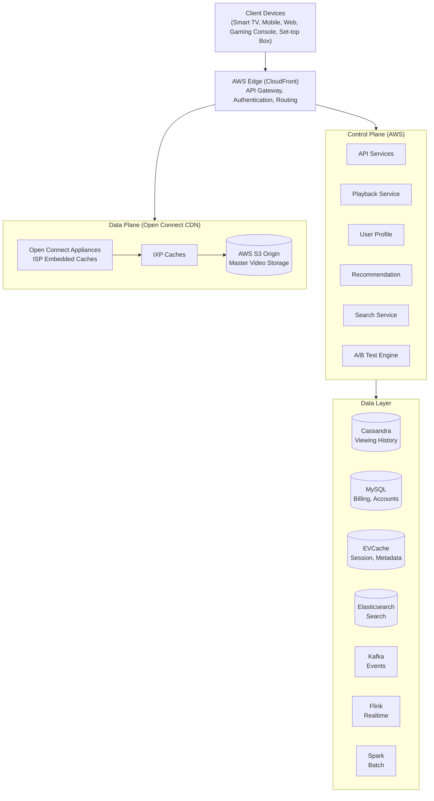
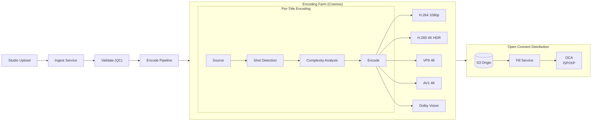
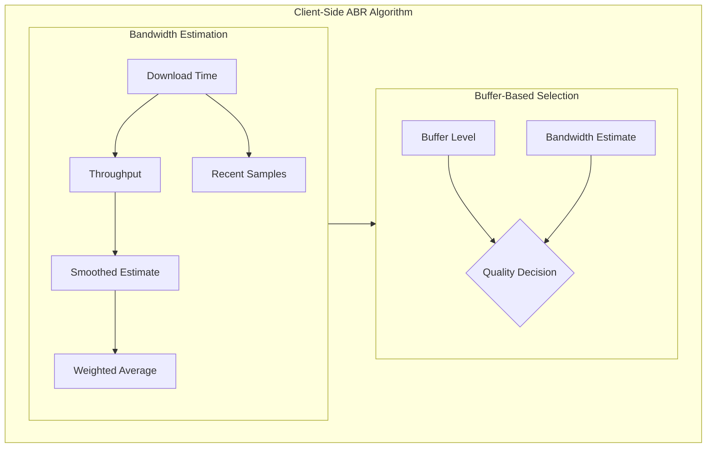
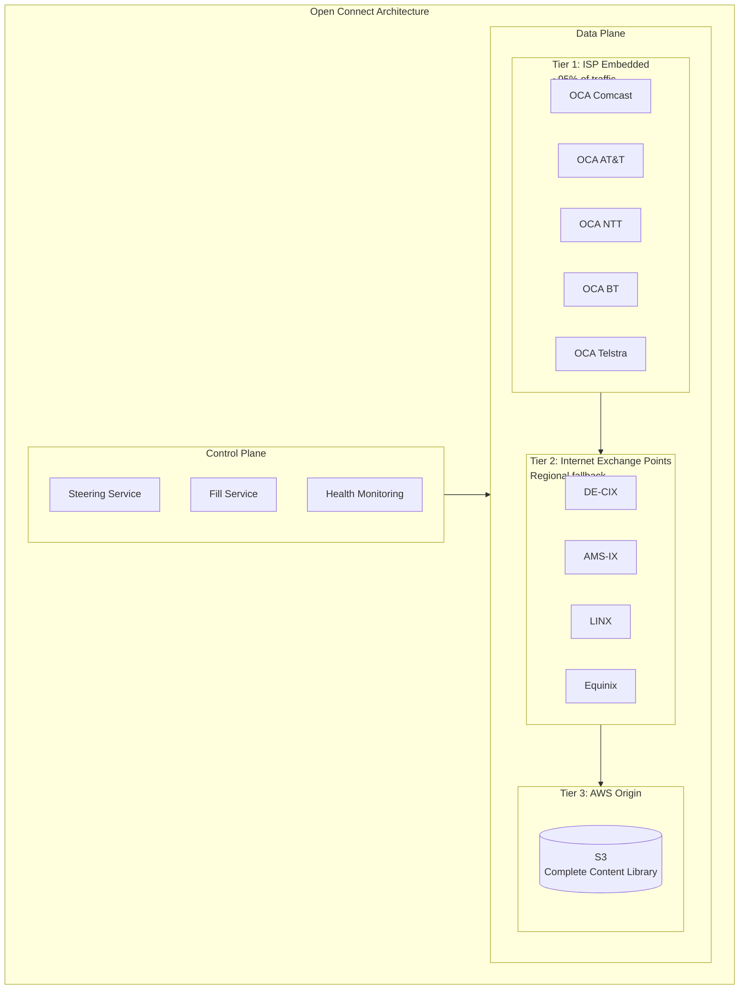
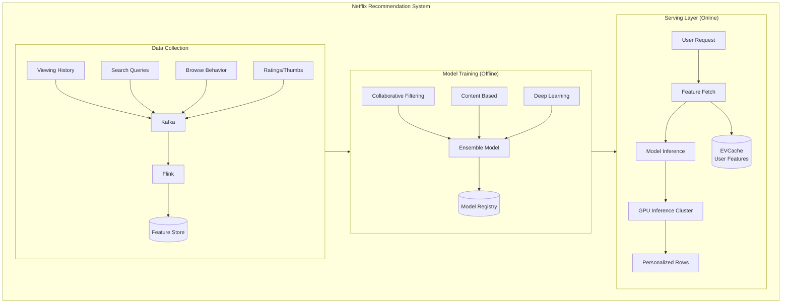

# Netflix System Design

## TL;DR

Netflix streams video to 230M+ subscribers across 190+ countries. The architecture centers on: **adaptive bitrate streaming** (ABR) that adjusts quality in real-time, **CDN infrastructure** (Open Connect) deployed at ISPs worldwide, **microservices architecture** (~1000 services), **recommendation engine** driving 80% of content discovery, and **chaos engineering** ensuring resilience. Key insight: optimize for buffering-free playback through predictive caching and distributed delivery.

---

## Core Requirements

### Functional Requirements
1. **Video streaming** - Play video content with adaptive quality
2. **Content discovery** - Personalized recommendations and search
3. **User profiles** - Multiple profiles per account with preferences
4. **Watchlist management** - Save content for later viewing
5. **Playback continuity** - Resume watching across devices
6. **Content ingestion** - Upload and process new content

### Non-Functional Requirements
1. **Availability** - 99.99% uptime (< 52 minutes downtime/year)
2. **Latency** - Video start < 2 seconds, no buffering
3. **Scale** - 230M+ subscribers, 400M+ hours streamed daily
4. **Global reach** - Low latency delivery in 190+ countries
5. **Fault tolerance** - Graceful degradation during failures

---

## High-Level Architecture



---

## Content Ingestion Pipeline



### Encoding Service Implementation

```java
// Netflix Encoding Service — Java (Spring Boot, Cosmos platform)
import java.util.*;
import java.util.concurrent.*;
import org.springframework.stereotype.Service;
import org.springframework.data.redis.core.RedisTemplate;
import org.springframework.kafka.core.KafkaTemplate;
import software.amazon.awssdk.services.s3.S3Client;

public enum Codec { H264, H265, VP9, AV1 }

public enum Resolution {
    SD_480(854, 480), HD_720(1280, 720), FHD_1080(1920, 1080), UHD_4K(3840, 2160);
    public final int width, height;
    Resolution(int w, int h) { this.width = w; this.height = h; }
}

public record EncodingProfile(Codec codec, Resolution resolution, int bitrateKbps, double frameRate, boolean hdr) {}
public record EncodingLadder(String titleId, List<EncodingProfile> profiles) {}

@Service
public class PerTitleEncoder {
    // Netflix's per-title encoding optimizes bitrate ladders
    // based on content complexity. Animations need fewer bits than action sequences.
    private final ComplexityAnalyzer complexityAnalyzer;
    private final ShotDetector shotDetector;
    private final ExecutorService encodingPool = Executors.newFixedThreadPool(
        Runtime.getRuntime().availableProcessors()
    );

    public CompletableFuture<EncodingLadder> createEncodingLadder(String titleId, String sourcePath) {
        return shotDetector.detect(sourcePath)
            .thenCompose(shots -> {
                // Analyze per-shot complexity in parallel
                List<CompletableFuture<ComplexityResult>> futures = shots.stream()
                    .map(shot -> complexityAnalyzer.analyze(sourcePath, shot.startFrame(), shot.endFrame()))
                    .toList();
                return CompletableFuture.allOf(futures.toArray(new CompletableFuture[0]))
                    .thenApply(v -> futures.stream()
                        .map(CompletableFuture::join)
                        .mapToDouble(ComplexityResult::score)
                        .average().orElse(0.5));
            })
            .thenApply(avgComplexity -> new EncodingLadder(titleId, generateLadder(avgComplexity)));
    }

    private List<EncodingProfile> generateLadder(double complexity) {
        // Lower complexity = lower bitrates for same quality
        double factor = 0.5 + (complexity * 0.5);
        return List.of(
            new EncodingProfile(Codec.H264, Resolution.SD_480, (int)(1500 * factor), 24.0, false),
            new EncodingProfile(Codec.H264, Resolution.HD_720, (int)(3000 * factor), 24.0, false),
            new EncodingProfile(Codec.H265, Resolution.FHD_1080, (int)(5800 * factor), 24.0, false),
            new EncodingProfile(Codec.H265, Resolution.UHD_4K, (int)(16000 * factor), 24.0, true),
            new EncodingProfile(Codec.AV1, Resolution.UHD_4K, (int)(12000 * factor), 24.0, true)
        );
    }
}

@Service
public class EncodingOrchestrator {
    // Cosmos — Netflix's media encoding platform
    private final RedisTemplate<String, String> redis;
    private final S3Client s3;
    private final KafkaTemplate<String, Map<String, String>> kafka;
    private final PerTitleEncoder encoder;

    public String ingestTitle(String titleId, String sourceUrl) {
        String jobId = "encode:" + titleId + ":" + System.currentTimeMillis();
        redis.opsForHash().putAll("job:" + jobId, Map.of(
            "status", "pending", "title_id", titleId,
            "source_url", sourceUrl, "created_at", String.valueOf(System.currentTimeMillis())
        ));
        kafka.send("encoding-jobs", titleId, Map.of("job_id", jobId, "source_url", sourceUrl));
        return jobId;
    }

    public void processEncodingJob(String jobId) {
        var job = redis.opsForHash().entries("job:" + jobId);
        String titleId = (String) job.get("title_id");
        String sourceUrl = (String) job.get("source_url");

        redis.opsForHash().put("job:" + jobId, "status", "downloading");
        String sourcePath = downloadSource(sourceUrl);

        redis.opsForHash().put("job:" + jobId, "status", "analyzing");
        EncodingLadder ladder = encoder.createEncodingLadder(titleId, sourcePath).join();

        redis.opsForHash().put("job:" + jobId, "status", "encoding");
        List<CompletableFuture<String>> encodeTasks = ladder.profiles().stream()
            .map(profile -> CompletableFuture.supplyAsync(
                () -> encodeProfile(titleId, sourcePath, profile)))
            .toList();
        List<String> encodedFiles = encodeTasks.stream()
            .map(CompletableFuture::join).toList();

        redis.opsForHash().put("job:" + jobId, "status", "uploading");
        for (int i = 0; i < encodedFiles.size(); i++) {
            uploadToOrigin(titleId, encodedFiles.get(i), ladder.profiles().get(i));
        }
        notifyOpenConnect(titleId, ladder);
        redis.opsForHash().put("job:" + jobId, "status", "complete");
    }
}
```

---

## Adaptive Bitrate Streaming



**Buffer-Based Quality Selection**

| Buffer Level | Bandwidth Estimate | Quality Selection |
|---|---|---|
| < 10s | Low | Lower Quality |
| 10-30s | Medium | Maintain |
| > 30s | High | Upgrade |

### ABR Client Implementation

```javascript
class NetflixABRController {
  constructor(videoElement, manifestUrl) {
    this.video = videoElement;
    this.manifestUrl = manifestUrl;
    this.qualities = [];
    this.currentQualityIndex = 0;

    // Bandwidth estimation
    this.bandwidthSamples = [];
    this.maxSamples = 5;

    // Buffer thresholds
    this.minBuffer = 10;  // seconds
    this.maxBuffer = 60;  // seconds
    this.targetBuffer = 30;

    // Quality switch thresholds
    this.upgradeThreshold = 1.2;  // 20% headroom to upgrade
    this.downgradeThreshold = 0.9; // Aggressive downgrade
  }

  async initialize() {
    // Fetch manifest with all quality levels
    const manifest = await this.fetchManifest(this.manifestUrl);
    this.qualities = manifest.representations.sort(
      (a, b) => a.bandwidth - b.bandwidth
    );

    // Start with conservative quality
    this.currentQualityIndex = Math.floor(this.qualities.length / 3);

    // Begin fetching segments
    this.startBuffering();
  }

  async fetchSegment(segmentUrl) {
    const startTime = performance.now();

    const response = await fetch(segmentUrl);
    const data = await response.arrayBuffer();

    const endTime = performance.now();
    const durationMs = endTime - startTime;
    const sizeBytes = data.byteLength;

    // Calculate throughput in kbps
    const throughputKbps = (sizeBytes * 8) / durationMs;
    this.updateBandwidthEstimate(throughputKbps);

    return data;
  }

  updateBandwidthEstimate(sample) {
    this.bandwidthSamples.push(sample);

    // Keep rolling window
    if (this.bandwidthSamples.length > this.maxSamples) {
      this.bandwidthSamples.shift();
    }
  }

  getEstimatedBandwidth() {
    if (this.bandwidthSamples.length === 0) {
      return 3000; // Default 3 Mbps assumption
    }

    // Weighted average - recent samples weighted higher
    let weightedSum = 0;
    let weightSum = 0;

    this.bandwidthSamples.forEach((sample, index) => {
      const weight = index + 1; // Later samples have higher weight
      weightedSum += sample * weight;
      weightSum += weight;
    });

    // Conservative estimate - use 80th percentile
    const sorted = [...this.bandwidthSamples].sort((a, b) => a - b);
    const p80Index = Math.floor(sorted.length * 0.8);
    const p80 = sorted[p80Index];

    const weightedAvg = weightedSum / weightSum;

    // Use minimum of weighted average and 80th percentile
    return Math.min(weightedAvg, p80);
  }

  selectQuality() {
    const bandwidth = this.getEstimatedBandwidth();
    const bufferLevel = this.getBufferLevel();

    let targetQualityIndex = this.currentQualityIndex;

    // Find highest quality that fits bandwidth
    for (let i = this.qualities.length - 1; i >= 0; i--) {
      const quality = this.qualities[i];
      const requiredBandwidth = quality.bandwidth / 1000; // Convert to kbps

      if (requiredBandwidth < bandwidth * this.downgradeThreshold) {
        targetQualityIndex = i;
        break;
      }
    }

    // Buffer-based adjustments
    if (bufferLevel < this.minBuffer) {
      // Emergency - drop quality aggressively
      targetQualityIndex = Math.max(0, targetQualityIndex - 2);
    } else if (bufferLevel < this.targetBuffer) {
      // Below target - be conservative
      targetQualityIndex = Math.min(
        targetQualityIndex,
        this.currentQualityIndex
      );
    } else if (bufferLevel > this.targetBuffer * 1.5) {
      // Plenty of buffer - consider upgrade
      if (bandwidth > this.qualities[this.currentQualityIndex + 1]?.bandwidth * this.upgradeThreshold) {
        targetQualityIndex = Math.min(
          this.qualities.length - 1,
          this.currentQualityIndex + 1
        );
      }
    }

    // Avoid oscillation - require sustained bandwidth for upgrade
    if (targetQualityIndex > this.currentQualityIndex) {
      if (!this.checkSustainedBandwidth(targetQualityIndex)) {
        targetQualityIndex = this.currentQualityIndex;
      }
    }

    this.currentQualityIndex = targetQualityIndex;
    return this.qualities[targetQualityIndex];
  }

  checkSustainedBandwidth(qualityIndex) {
    const requiredBandwidth = this.qualities[qualityIndex].bandwidth / 1000;

    // All recent samples must support this quality
    return this.bandwidthSamples.every(
      sample => sample > requiredBandwidth * this.upgradeThreshold
    );
  }

  getBufferLevel() {
    const buffered = this.video.buffered;
    if (buffered.length === 0) return 0;

    const currentTime = this.video.currentTime;
    for (let i = 0; i < buffered.length; i++) {
      if (buffered.start(i) <= currentTime && buffered.end(i) >= currentTime) {
        return buffered.end(i) - currentTime;
      }
    }
    return 0;
  }

  async startBuffering() {
    let segmentIndex = 0;

    while (true) {
      // Wait if buffer is full
      while (this.getBufferLevel() > this.maxBuffer) {
        await this.sleep(1000);
      }

      // Select quality for next segment
      const quality = this.selectQuality();

      // Fetch and append segment
      const segmentUrl = this.buildSegmentUrl(quality, segmentIndex);
      const segmentData = await this.fetchSegment(segmentUrl);
      await this.appendToBuffer(segmentData);

      segmentIndex++;
    }
  }
}
```

---

## Open Connect CDN Architecture



### Steering Service Implementation

```java
// Netflix Open Connect Steering — Java (Spring Boot, EVCache, Cassandra driver)
import java.util.*;
import java.util.concurrent.*;
import java.util.stream.*;
import org.springframework.stereotype.Service;
import com.netflix.evcache.EVCache;

public record OpenConnectAppliance(
    String id,
    String location,       // e.g., "Comcast-San-Jose"
    int tier,              // 1=ISP, 2=IXP, 3=Origin
    double capacityGbps,
    double currentLoad,    // 0.0 - 1.0
    boolean healthy,
    double lat,
    double lng
) {}

public record ClientContext(
    String clientIp,
    int asn,               // Autonomous System Number (ISP identifier)
    String country,
    String region,
    String deviceType
) {}

public record SteeringDecision(
    OpenConnectAppliance primaryOca,
    List<OpenConnectAppliance> fallbackOcas,
    int ttlSeconds
) {}


@Service
public class SteeringService {
    /**
     * Determines which OCA should serve content for each request.
     * Goals: minimize latency, balance load, maximize cache hits.
     */

    private final EVCache evCache;
    private final MetricsClient metrics;
    private final Map<String, OpenConnectAppliance> ocas = new ConcurrentHashMap<>();
    private final Map<Integer, List<String>> asnToOcaMap = new ConcurrentHashMap<>(); // ISP -> embedded OCAs

    public SteeringService(EVCache evCache, MetricsClient metrics) {
        this.evCache = evCache;
        this.metrics = metrics;
    }

    public CompletableFuture<SteeringDecision> getSteeringDecision(
            ClientContext client, String titleId, String quality) {
        /**
         * Select optimal OCA for client request.
         * Priority: ISP-embedded > IXP > Origin
         */
        String contentKey = titleId + ":" + quality;

        return getOcasWithContent(contentKey).thenCompose(ocasWithContent -> {
            // First try: ISP-embedded OCA
            List<OpenConnectAppliance> ispOcas = getIspOcas(client.asn());
            List<OpenConnectAppliance> ispCandidates = ispOcas.stream()
                .filter(oca -> ocasWithContent.contains(oca.id()) && oca.healthy())
                .toList();

            if (!ispCandidates.isEmpty()) {
                OpenConnectAppliance primary = selectBestOca(ispCandidates, client);
                List<OpenConnectAppliance> fallbacks = ispCandidates.stream()
                    .filter(o -> !o.id().equals(primary.id()))
                    .limit(2)
                    .collect(Collectors.toList());

                return CompletableFuture.completedFuture(new SteeringDecision(
                    primary,
                    addTierFallbacks(fallbacks, client),
                    300  // Cache steering decision for 5 minutes
                ));
            }

            // Second try: IXP OCA
            return getNearbyIxpOcas(client).thenApply(ixpOcas -> {
                List<OpenConnectAppliance> ixpCandidates = ixpOcas.stream()
                    .filter(oca -> ocasWithContent.contains(oca.id()) && oca.healthy())
                    .toList();

                if (!ixpCandidates.isEmpty()) {
                    OpenConnectAppliance primary = selectBestOca(ixpCandidates, client);
                    return new SteeringDecision(primary, getOriginFallbacks(), 60);
                }

                // Fallback: Origin (S3 via CloudFront)
                return new SteeringDecision(getOriginOca(client.region()), List.of(), 30);
            });
        });
    }

    private OpenConnectAppliance selectBestOca(
            List<OpenConnectAppliance> candidates, ClientContext client) {
        /**
         * Score OCAs based on:
         * - Load (lower is better)
         * - Geographic proximity
         * - Historical performance to this client
         */
        return candidates.stream()
            .max(Comparator.comparingDouble(oca -> scoreOca(oca, client)))
            .orElseThrow();
    }

    private double scoreOca(OpenConnectAppliance oca, ClientContext client) {
        // Base score from load (0-100, lower load = higher score)
        double loadScore = (1.0 - oca.currentLoad()) * 40;

        // Capacity headroom
        double capacityScore = Math.min(oca.capacityGbps() / 100.0, 1.0) * 20;

        // Proximity (would use actual RTT data in production)
        double proximityScore = 40;  // Simplified

        return loadScore + capacityScore + proximityScore;
    }

    private CompletableFuture<Set<String>> getOcasWithContent(String contentKey) {
        /** Get set of OCA IDs that have this content cached */
        return CompletableFuture.supplyAsync(() -> {
            try {
                Set<String> ocaIds = evCache.get("content:" + contentKey + ":ocas");
                return ocaIds != null ? ocaIds : Set.of();
            } catch (Exception e) {
                return Set.of();
            }
        });
    }

    private List<OpenConnectAppliance> getIspOcas(int asn) {
        /** Get OCAs embedded in this ISP's network */
        List<String> ocaIds = asnToOcaMap.getOrDefault(asn, List.of());
        return ocaIds.stream()
            .filter(ocas::containsKey)
            .map(ocas::get)
            .toList();
    }
}


@Service
public class FillService {
    /**
     * Proactively fills OCAs with content before it's requested.
     * Uses viewership prediction to pre-position popular content.
     */

    private final EVCache evCache;
    private final S3Client s3;
    private final PredictionService prediction;

    public FillService(EVCache evCache, S3Client s3, PredictionService prediction) {
        this.evCache = evCache;
        this.s3 = s3;
        this.prediction = prediction;
    }

    public void runFillCycle() {
        /**
         * Run during off-peak hours (typically 2-6 AM local time).
         * Fill OCAs with predicted popular content.
         */
        // Get all OCAs by region
        Map<String, List<OpenConnectAppliance>> ocasByRegion = getOcasByRegion();

        for (var entry : ocasByRegion.entrySet()) {
            String region = entry.getKey();
            List<OpenConnectAppliance> ocaList = entry.getValue();

            // Get predicted popular content for region
            List<Title> popularTitles = prediction.getPopularTitles(region, 24);

            for (OpenConnectAppliance oca : ocaList) {
                // Check what's already cached
                Set<String> cached = getCachedContent(oca.id());

                // Determine what to fill
                List<Title> toFill = popularTitles.stream()
                    .filter(title -> !cached.contains(title.id()))
                    .limit(100)  // Top 100
                    .toList();

                // Fill during off-peak
                if (isOffPeak(oca.location())) {
                    fillOca(oca, toFill);
                }
            }
        }
    }

    private void fillOca(OpenConnectAppliance oca, List<Title> titles) {
        /** Transfer content from origin to OCA */
        for (Title title : titles) {
            // Get all quality levels
            List<String> qualities = getTitleQualities(title.id());

            for (String quality : qualities) {
                String contentKey = title.id() + ":" + quality;

                // Initiate pull from origin
                initiatePull(oca.id(), "content/" + title.id() + "/" + quality + "/",
                    title.predictedViews());

                // Record content location
                try {
                    evCache.set("content:" + contentKey + ":ocas", oca.id());
                } catch (Exception e) {
                    // Log and continue
                }
            }
        }
    }
}
```

---

## Recommendation System



### Recommendation Service Implementation

```java
// Netflix Recommendation Service — Java (Spring Boot, EVCache, Cassandra)
import java.util.*;
import java.util.concurrent.*;
import java.util.stream.*;
import org.springframework.stereotype.Service;
import com.netflix.evcache.EVCache;
import com.datastax.oss.driver.api.core.CqlSession;

public record Title(
    String id,
    String name,
    List<String> genres,
    List<String> cast,
    String director,
    int releaseYear,
    double[] embedding   // Content embedding from deep learning model
) {}

public record UserProfile(
    String userId,
    List<ViewingRecord> viewingHistory,   // (titleId, completion%, timestamp)
    double[] tasteEmbedding,              // Learned user taste vector
    Map<String, Double> genrePreferences,
    List<String> recentInteractions,
    String country,
    String userSegment
) {}

public record ViewingRecord(String titleId, double completionPct, double timestamp) {}

public record RecommendationRow(
    String title,       // Row title, e.g., "Because you watched Stranger Things"
    String reason,
    List<Title> titles,
    String algorithm
) {}


@Service
public class RecommendationService {
    /**
     * Netflix-style personalized recommendation service.
     * Generates the rows of content seen on the homepage.
     */

    private final EVCache cache;
    private final ModelService models;
    private final ContentCatalog catalog;
    private final ABTestService abTest;

    public RecommendationService(EVCache cache, ModelService models,
            ContentCatalog catalog, ABTestService abTest) {
        this.cache = cache;
        this.models = models;
        this.catalog = catalog;
        this.abTest = abTest;
    }

    public CompletableFuture<List<RecommendationRow>> getHomepage(
            String userId, String deviceType) {
        /**
         * Generate personalized homepage rows for user.
         * Different rows use different algorithms.
         */
        return getUserProfile(userId).thenCompose(profile -> {
            // Determine which algorithms to use (A/B testing)
            Map<String, Object> algorithms = abTest.getAlgorithms(userId);

            List<CompletableFuture<Optional<RecommendationRow>>> rowFutures = new ArrayList<>();

            // Continue watching (highest priority)
            rowFutures.add(getContinueWatching(profile).thenApply(Optional::ofNullable));

            // Because you watched X (similarity-based)
            for (String recentTitleId : profile.recentInteractions().stream().limit(3).toList()) {
                rowFutures.add(getSimilarTitles(profile, recentTitleId)
                    .thenApply(Optional::ofNullable));
            }

            // Top picks for you (personalized ranking)
            rowFutures.add(getTopPicks(profile, algorithms).thenApply(Optional::of));

            // Trending now (popularity with personalized ranking)
            rowFutures.add(getTrending(profile).thenApply(Optional::of));

            // Genre rows (based on preferences)
            List<String> topGenres = profile.genrePreferences().entrySet().stream()
                .sorted(Map.Entry.<String, Double>comparingByValue().reversed())
                .limit(5)
                .map(Map.Entry::getKey)
                .toList();

            for (String genre : topGenres) {
                rowFutures.add(getGenreRow(profile, genre).thenApply(Optional::of));
            }

            // New releases
            rowFutures.add(getNewReleases(profile).thenApply(Optional::of));

            return CompletableFuture.allOf(rowFutures.toArray(new CompletableFuture[0]))
                .thenApply(v -> {
                    List<RecommendationRow> rows = rowFutures.stream()
                        .map(CompletableFuture::join)
                        .flatMap(Optional::stream)
                        .collect(Collectors.toList());

                    // Re-rank rows for optimal engagement
                    return rerankRows(profile, rows, deviceType);
                });
        });
    }

    private CompletableFuture<RecommendationRow> getSimilarTitles(
            UserProfile profile, String seedTitleId) {
        /**
         * Find titles similar to seed using content embeddings.
         * Uses approximate nearest neighbor search.
         */
        return CompletableFuture.supplyAsync(() -> {
            Title seedTitle = catalog.getTitle(seedTitleId);

            // Get candidate titles using ANN search
            Set<String> watchedIds = profile.viewingHistory().stream()
                .map(ViewingRecord::titleId)
                .collect(Collectors.toSet());
            List<Title> candidates = models.annSearch(seedTitle.embedding(), 100, watchedIds);

            // Re-rank candidates using user taste
            record ScoredTitle(Title title, double score) {}
            List<ScoredTitle> scoredCandidates = candidates.stream()
                .map(title -> {
                    // Combine content similarity with user preference
                    double contentScore = cosineSimilarity(seedTitle.embedding(), title.embedding());
                    double preferenceScore = cosineSimilarity(profile.tasteEmbedding(), title.embedding());

                    // Weighted combination
                    double finalScore = 0.6 * contentScore + 0.4 * preferenceScore;
                    return new ScoredTitle(title, finalScore);
                })
                .sorted(Comparator.comparingDouble(ScoredTitle::score).reversed())
                .limit(20)
                .toList();

            List<Title> topTitles = scoredCandidates.stream()
                .map(ScoredTitle::title).toList();

            return new RecommendationRow(
                "Because you watched " + seedTitle.name(),
                "similar_content",
                topTitles,
                "content_similarity_v2"
            );
        });
    }

    private CompletableFuture<RecommendationRow> getTopPicks(
            UserProfile profile, Map<String, Object> algorithms) {
        /**
         * Personalized top picks using ensemble of models.
         */
        return CompletableFuture.supplyAsync(() -> {
            // Get all eligible titles
            Set<String> watchedIds = profile.viewingHistory().stream()
                .map(ViewingRecord::titleId)
                .collect(Collectors.toSet());
            List<Title> allTitles = catalog.getEligibleTitles(profile.country(), watchedIds);

            // Score with each model
            List<String> titleIds = allTitles.stream().map(Title::id).toList();

            // Collaborative filtering score
            Map<String, Double> cfScores = models.collaborativeFilter(profile.userId(), titleIds);

            // Content-based score
            Map<String, Double> contentScores = allTitles.stream()
                .collect(Collectors.toMap(Title::id,
                    t -> cosineSimilarity(profile.tasteEmbedding(), t.embedding())));

            // Deep learning model score
            Map<String, Double> dlScores = models.deepRanking(profile.tasteEmbedding(), allTitles);

            // Ensemble weights (from A/B test config)
            @SuppressWarnings("unchecked")
            Map<String, Double> weights = (Map<String, Double>) algorithms.getOrDefault(
                "top_picks_weights", Map.of("cf", 0.4, "content", 0.3, "deep", 0.3));

            // Combine scores
            Map<String, Double> scores = new HashMap<>();
            for (Title title : allTitles) {
                scores.put(title.id(),
                    weights.get("cf") * cfScores.getOrDefault(title.id(), 0.0)
                    + weights.get("content") * contentScores.getOrDefault(title.id(), 0.0)
                    + weights.get("deep") * dlScores.getOrDefault(title.id(), 0.0));
            }

            // Sort and return top
            List<Title> sortedTitles = allTitles.stream()
                .sorted(Comparator.comparingDouble(
                    (Title t) -> scores.getOrDefault(t.id(), 0.0)).reversed())
                .limit(30)
                .toList();

            String version = (String) algorithms.getOrDefault("version", "default");
            return new RecommendationRow(
                "Top Picks for You",
                "personalized_ranking",
                sortedTitles,
                "ensemble_v3_" + version
            );
        });
    }

    private List<RecommendationRow> rerankRows(
            UserProfile profile, List<RecommendationRow> rows, String deviceType) {
        /**
         * Reorder rows based on predicted engagement.
         * TV users might prefer different row ordering than mobile.
         */
        record ScoredRow(RecommendationRow row, double score) {}

        List<ScoredRow> scoredRows = rows.stream().map(row -> {
            // Get historical CTR for this row type + user segment
            double historicalCtr = getRowCtr(row.algorithm(), profile.userSegment(), deviceType);

            // Adjust for freshness
            double freshnessBoost = calculateFreshness(row);

            // Final score
            double score = historicalCtr * (1 + freshnessBoost);
            return new ScoredRow(row, score);
        }).toList();

        // Keep Continue Watching at top, rerank rest
        RecommendationRow continueRow = null;
        List<ScoredRow> otherRows = new ArrayList<>();

        for (ScoredRow scored : scoredRows) {
            if ("continue_watching".equals(scored.row().reason())) {
                continueRow = scored.row();
            } else {
                otherRows.add(scored);
            }
        }

        otherRows.sort(Comparator.comparingDouble(ScoredRow::score).reversed());

        List<RecommendationRow> result = new ArrayList<>();
        if (continueRow != null) {
            result.add(continueRow);
        }
        otherRows.forEach(sr -> result.add(sr.row()));

        return result;
    }

    private double cosineSimilarity(double[] a, double[] b) {
        double dot = 0, normA = 0, normB = 0;
        for (int i = 0; i < a.length; i++) {
            dot += a[i] * b[i];
            normA += a[i] * a[i];
            normB += b[i] * b[i];
        }
        return dot / (Math.sqrt(normA) * Math.sqrt(normB));
    }
}
```

---

## Microservices & Resilience

### Circuit Breaker with Hystrix Pattern

```java
// Netflix Hystrix-style Circuit Breaker — Java (HystrixCommand API, Spring Boot)
// Note: Hystrix is in maintenance mode; resilience4j is the modern alternative.
import java.util.*;
import java.util.concurrent.*;
import java.util.concurrent.atomic.*;
import java.util.function.Supplier;
import com.netflix.hystrix.*;
import org.springframework.stereotype.Service;

public enum CircuitState {
    CLOSED,      // Normal operation
    OPEN,        // Failing, reject requests
    HALF_OPEN    // Testing if recovered
}

public record CircuitBreakerConfig(
    int failureThreshold,
    int successThreshold,
    long timeoutMillis,
    int halfOpenMaxCalls
) {
    public CircuitBreakerConfig() {
        this(5, 3, 30_000L, 3);
    }
}


public class CircuitBreaker<T> {
    /**
     * Netflix Hystrix-style circuit breaker.
     * Prevents cascade failures in microservices.
     */

    private final String name;
    private final CircuitBreakerConfig config;
    private final Supplier<CompletableFuture<T>> fallback;
    private volatile CircuitState state = CircuitState.CLOSED;
    private final AtomicInteger failures = new AtomicInteger(0);
    private final AtomicInteger successes = new AtomicInteger(0);
    private final AtomicInteger halfOpenCalls = new AtomicInteger(0);
    private volatile long lastFailureTime = 0;
    private final Object lock = new Object();

    public CircuitBreaker(String name, CircuitBreakerConfig config,
            Supplier<CompletableFuture<T>> fallback) {
        this.name = name;
        this.config = config != null ? config : new CircuitBreakerConfig();
        this.fallback = fallback;
    }

    public CompletableFuture<T> call(Supplier<CompletableFuture<T>> func) {
        /** Execute function with circuit breaker protection */
        synchronized (lock) {
            if (state == CircuitState.OPEN) {
                if (shouldAttemptReset()) {
                    state = CircuitState.HALF_OPEN;
                    halfOpenCalls.set(0);
                } else {
                    return handleOpen();
                }
            }

            if (state == CircuitState.HALF_OPEN) {
                if (halfOpenCalls.get() >= config.halfOpenMaxCalls()) {
                    return handleOpen();
                }
                halfOpenCalls.incrementAndGet();
            }
        }

        return func.get()
            .thenApply(result -> {
                onSuccess();
                return result;
            })
            .exceptionally(ex -> {
                onFailure();
                throw new CompletionException(ex);
            });
    }

    private void onSuccess() {
        synchronized (lock) {
            successes.incrementAndGet();

            if (state == CircuitState.HALF_OPEN) {
                if (successes.get() >= config.successThreshold()) {
                    // Recovered - close circuit
                    state = CircuitState.CLOSED;
                    failures.set(0);
                    successes.set(0);
                }
            }
        }
    }

    private void onFailure() {
        synchronized (lock) {
            failures.incrementAndGet();
            lastFailureTime = System.currentTimeMillis();

            if (state == CircuitState.HALF_OPEN) {
                // Failed during test - open again
                state = CircuitState.OPEN;
                successes.set(0);
            } else if (failures.get() >= config.failureThreshold()) {
                // Too many failures - open circuit
                state = CircuitState.OPEN;
            }
        }
    }

    private boolean shouldAttemptReset() {
        if (lastFailureTime == 0) return true;
        return (System.currentTimeMillis() - lastFailureTime) >= config.timeoutMillis();
    }

    private CompletableFuture<T> handleOpen() {
        if (fallback != null) {
            return fallback.get();
        }
        return CompletableFuture.failedFuture(
            new CircuitOpenException("Circuit " + name + " is open"));
    }
}


@Service
public class ServiceMesh {
    /**
     * Netflix-style service mesh for inter-service communication.
     * Handles discovery, load balancing, circuit breaking, retries.
     */

    private final EurekaClient eureka;
    private final MetricsClient metrics;
    private final Map<String, CircuitBreaker<Map<String, Object>>> circuitBreakers =
        new ConcurrentHashMap<>();

    public ServiceMesh(EurekaClient eureka, MetricsClient metrics) {
        this.eureka = eureka;
        this.metrics = metrics;
    }

    public CompletableFuture<Map<String, Object>> callService(
            String serviceName, String endpoint, String method,
            Map<String, Object> data, long timeoutMs, int retries) {
        /** Make resilient call to downstream service */
        CircuitBreaker<Map<String, Object>> cb = getCircuitBreaker(serviceName);

        return cb.call(() -> makeRequest(serviceName, endpoint, method, data, timeoutMs, retries));
    }

    private CompletableFuture<Map<String, Object>> makeRequest(
            String serviceName, String endpoint, String method,
            Map<String, Object> data, long timeoutMs, int retries) {

        return CompletableFuture.supplyAsync(() -> {
            // Get healthy instances from Eureka
            List<ServiceInstance> instances = eureka.getInstances(serviceName);
            if (instances.isEmpty()) {
                throw new NoInstancesException("No instances for " + serviceName);
            }

            // Client-side load balancing with retry
            Exception lastError = null;
            for (int attempt = 0; attempt < retries; attempt++) {
                ServiceInstance instance = selectInstance(instances, attempt);

                try {
                    String url = "http://" + instance.host() + ":" + instance.port() + endpoint;
                    return httpClient.request(method, url, data, timeoutMs);
                } catch (Exception e) {
                    lastError = e;
                    // Exponential backoff with jitter
                    try {
                        long sleepMs = (long) Math.min(
                            Math.pow(2, attempt) * 1000 + ThreadLocalRandom.current().nextLong(1000),
                            10_000);
                        Thread.sleep(sleepMs);
                    } catch (InterruptedException ie) {
                        Thread.currentThread().interrupt();
                        throw new RuntimeException(ie);
                    }
                }
            }

            throw new RuntimeException(lastError);
        });
    }

    private CircuitBreaker<Map<String, Object>> getCircuitBreaker(String serviceName) {
        return circuitBreakers.computeIfAbsent(serviceName,
            name -> new CircuitBreaker<>(name, new CircuitBreakerConfig(),
                () -> CompletableFuture.supplyAsync(() -> getFallback(name))));
    }

    private ServiceInstance selectInstance(List<ServiceInstance> instances, int attempt) {
        /**
         * Select instance using weighted round-robin.
         * Avoid recently failed instances.
         */
        // Filter to healthy instances
        List<ServiceInstance> healthy = instances.stream()
            .filter(ServiceInstance::healthy)
            .toList();

        if (healthy.isEmpty()) {
            healthy = instances;  // Fallback to all
        }

        // Weighted random based on capacity
        double totalWeight = healthy.stream().mapToDouble(ServiceInstance::weight).sum();
        double r = ThreadLocalRandom.current().nextDouble(totalWeight);

        double cumulative = 0;
        for (ServiceInstance instance : healthy) {
            cumulative += instance.weight();
            if (r <= cumulative) {
                return instance;
            }
        }

        return healthy.get(healthy.size() - 1);
    }
}
```

---

## Chaos Engineering

```java
// Netflix Chaos Engineering — Java (Spring Boot, Simian Army)
import java.util.*;
import java.util.concurrent.*;
import java.time.*;
import org.springframework.stereotype.Service;
import org.springframework.scheduling.annotation.Scheduled;

public enum ChaosType {
    LATENCY, EXCEPTION, KILL_INSTANCE, NETWORK_PARTITION, CPU_STRESS, DISK_FULL
}

public record ChaosExperiment(
    String id,
    String name,
    ChaosType chaosType,
    String targetService,
    double targetPercentage,   // % of requests/instances affected
    int durationSeconds,
    Map<String, Object> parameters  // Type-specific params
) {}


@Service
public class ChaosMonkey {
    /**
     * Netflix's Chaos Monkey - randomly terminates instances.
     * Forces teams to build resilient systems.
     */

    private final AutoScalingClient asg;
    private final MetricsClient metrics;
    private final NotificationClient notifications;
    private final Set<String> enabledGroups = ConcurrentHashMap.newKeySet();

    public ChaosMonkey(AutoScalingClient asg, MetricsClient metrics,
            NotificationClient notifications) {
        this.asg = asg;
        this.metrics = metrics;
        this.notifications = notifications;
    }

    @Scheduled(fixedRate = 3_600_000)  // Run hourly
    public void runChaosCycle() {
        /**
         * Run during business hours to ensure engineers are present.
         * Typically 9 AM - 3 PM weekdays.
         */
        if (!isChaosWindow()) {
            return;
        }

        // Get all opted-in auto-scaling groups
        List<String> groups = getEligibleGroups();

        for (String group : groups) {
            if (ThreadLocalRandom.current().nextDouble() < 0.1) {  // 10% chance per cycle
                terminateRandomInstance(group);
            }
        }
    }

    private void terminateRandomInstance(String groupName) {
        /** Terminate random instance in ASG */
        List<Instance> instances = asg.getInstances(groupName);

        if (instances.size() <= 1) {
            return;  // Don't terminate last instance
        }

        Instance victim = instances.get(ThreadLocalRandom.current().nextInt(instances.size()));

        // Notify before termination
        notifications.send("chaos-monkey",
            "Terminating " + victim.id() + " in " + groupName);

        // Record experiment
        metrics.recordExperiment("instance_termination", victim.id(), groupName);

        // Terminate
        asg.terminateInstance(victim.id());
    }

    private boolean isChaosWindow() {
        /** Only run chaos during business hours */
        LocalDateTime now = LocalDateTime.now();

        // Weekdays only
        if (now.getDayOfWeek().getValue() >= 6) {
            return false;
        }

        // 9 AM - 3 PM
        int hour = now.getHour();
        return hour >= 9 && hour < 15;
    }
}


@Service
public class LatencyMonkey {
    /**
     * Inject artificial latency to test timeout handling.
     */

    private final EVCache evCache;
    private final Map<String, ChaosExperiment> activeExperiments = new ConcurrentHashMap<>();

    public LatencyMonkey(EVCache evCache) {
        this.evCache = evCache;
    }

    public String injectLatency(String service, int latencyMs,
            double percentage, int durationSeconds) {
        /** Start latency injection experiment */
        ChaosExperiment experiment = new ChaosExperiment(
            UUID.randomUUID().toString(),
            "latency-" + service,
            ChaosType.LATENCY,
            service,
            percentage,
            durationSeconds,
            Map.of("latency_ms", latencyMs)
        );

        // Store active experiment
        activeExperiments.put(experiment.id(), experiment);
        try {
            evCache.set("chaos:latency:" + service,
                Map.of("latency_ms", latencyMs, "percentage", percentage),
                durationSeconds);
        } catch (Exception e) {
            // Log and continue
        }

        return experiment.id();
    }

    public OptionalInt shouldAddLatency(String service) {
        /** Check if latency should be injected for this request */
        try {
            @SuppressWarnings("unchecked")
            Map<String, Object> config = evCache.get("chaos:latency:" + service);

            if (config == null) {
                return OptionalInt.empty();
            }

            double percentage = ((Number) config.get("percentage")).doubleValue();
            if (ThreadLocalRandom.current().nextDouble() < percentage) {
                return OptionalInt.of(((Number) config.get("latency_ms")).intValue());
            }

            return OptionalInt.empty();
        } catch (Exception e) {
            return OptionalInt.empty();
        }
    }
}


// Filter to apply chaos (Spring Boot OncePerRequestFilter)
import org.springframework.web.filter.OncePerRequestFilter;
import javax.servlet.FilterChain;
import javax.servlet.http.HttpServletRequest;
import javax.servlet.http.HttpServletResponse;

public class ChaosFilter extends OncePerRequestFilter {

    private final LatencyMonkey latencyMonkey;

    public ChaosFilter(LatencyMonkey latencyMonkey) {
        this.latencyMonkey = latencyMonkey;
    }

    @Override
    protected void doFilterInternal(HttpServletRequest request,
            HttpServletResponse response, FilterChain filterChain)
            throws java.io.IOException, javax.servlet.ServletException {

        String service = request.getHeader("X-Target-Service");
        if (service == null) service = "unknown";

        // Check for latency injection
        OptionalInt latency = latencyMonkey.shouldAddLatency(service);
        if (latency.isPresent()) {
            try {
                Thread.sleep(latency.getAsInt());
            } catch (InterruptedException e) {
                Thread.currentThread().interrupt();
            }
        }

        filterChain.doFilter(request, response);
    }
}
```

---

## Key Metrics & Scale

| Metric | Value |
|--------|-------|
| **Subscribers** | 230M+ |
| **Countries** | 190+ |
| **Peak concurrent streams** | 15M+ |
| **Hours streamed daily** | 400M+ |
| **Bandwidth (peak)** | 15% of global internet traffic |
| **CDN locations** | 17,000+ OCA servers |
| **Microservices** | ~1,000 |
| **Encoding outputs per title** | 1,200+ files (all quality/codec combinations) |
| **Recommendation API latency** | < 250ms p99 |
| **Content library** | 15,000+ titles |

---

## Production Insights

### EVCache Miss Cost

EVCache is Netflix's distributed caching layer built on top of Memcached. A cache hit serves user feature vectors in **< 1ms** while a miss falls through to Cassandra at **5-10ms p50** and **25ms+ p99**. At Netflix's scale of 230M+ subscribers with multiple homepage loads per session, even a 1% increase in cache miss rate translates to **millions of additional Cassandra reads per hour**. Netflix mitigates this through:
- **Warm-up on deploy**: new EVCache instances are pre-populated before receiving traffic
- **Zone-aware replication**: data is replicated across 3 AWS availability zones so a zone failure does not cause a miss storm
- **Near-cache (L1)**: hot keys are cached in-process with a TTL of ~10 seconds to absorb thundering herd on popular title metadata

### Hystrix Thread Pool Isolation Sizing

Netflix pioneered bulkhead isolation through Hystrix thread pools. Each downstream dependency gets its own bounded thread pool, preventing a slow service from exhausting threads for healthy services. Sizing guidelines from production:
- **Thread pool size** = peak requests/sec x p99 latency (seconds) + small buffer. For a service with 200 RPS and 50ms p99: `200 * 0.05 + 4 = 14 threads`
- **Queue size**: Netflix typically sets `maxQueueSize` to 5-10. Larger queues mask latency issues; it is better to shed load via fallback than to queue
- **Timeout**: set to p99.5 of the dependency, not the average. A 50ms p99 service might have a 200ms timeout to account for GC pauses
- **Monitoring**: Hystrix dashboard streams real-time circuit state, thread pool utilization, and error rates. A pool consistently above 80% utilization is a signal to either scale the dependency or increase the pool

### Encoding Farm Economics

Netflix's Cosmos encoding platform processes every title into **~1,200 output files** (combinations of codec, resolution, bitrate, HDR, and audio tracks). Key cost drivers:
- **Per-title optimization** reduces aggregate storage and bandwidth by **~20%** compared to fixed-ladder encoding, saving hundreds of millions of dollars annually at Netflix's scale
- **AV1 encoding** is 10-50x slower than H.264 but produces files **30-40% smaller** at equivalent quality. Netflix amortizes the one-time compute cost against ongoing bandwidth savings across millions of playback sessions
- **Shot-based encoding**: splitting a title at scene boundaries allows parallel encoding of independent chunks. A 2-hour film with ~2,000 shots can be encoded across hundreds of workers, reducing wall-clock time from hours to **~15 minutes**
- **Codec rollout strategy**: new codecs (AV1) are encoded proactively but only served to devices that support them, allowing gradual bandwidth savings without client breakage

---

## Key Takeaways

1. **Separation of control and data planes** - API logic runs in AWS, video delivery through dedicated CDN. Each optimized independently.

2. **Per-title encoding** - Analyze content complexity to optimize bitrate ladders. Simple content needs fewer bits than complex action sequences.

3. **Proactive content positioning** - Use viewership prediction to pre-fill OCAs during off-peak hours. Content is waiting before users request it.

4. **Client-side intelligence** - ABR algorithms on device make real-time quality decisions based on bandwidth and buffer state.

5. **Deep ISP integration** - Open Connect appliances embedded directly in ISP networks reduce transit costs and improve quality.

6. **Microservices with resilience** - 1000+ services with circuit breakers, retries, and fallbacks. Chaos engineering validates resilience.

7. **Personalization at scale** - ML models run on every request. EVCache reduces latency for feature lookup.

8. **Multi-codec strategy** - Encode in H.264, H.265, VP9, AV1 to optimize for device capabilities and bandwidth.
