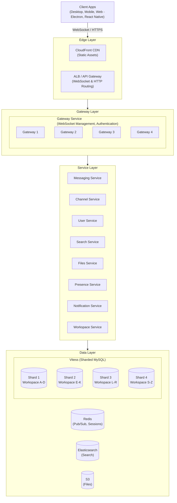
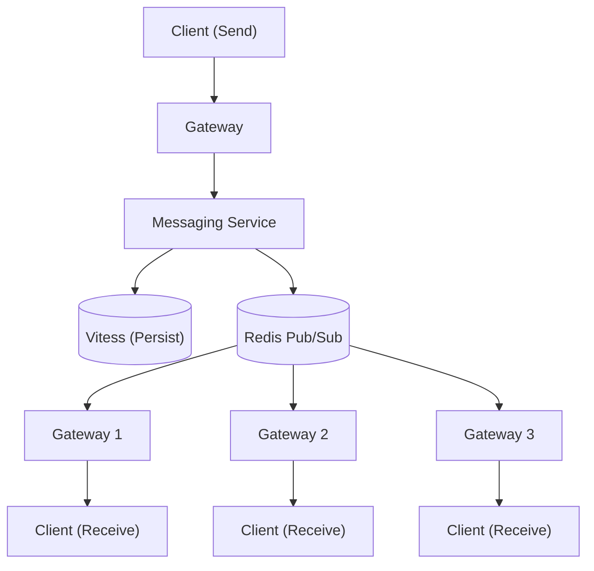
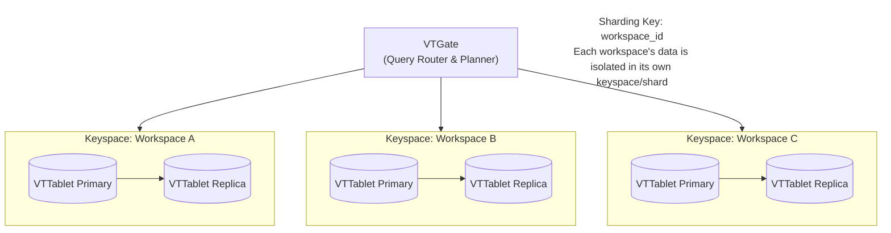
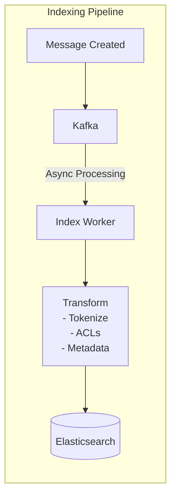
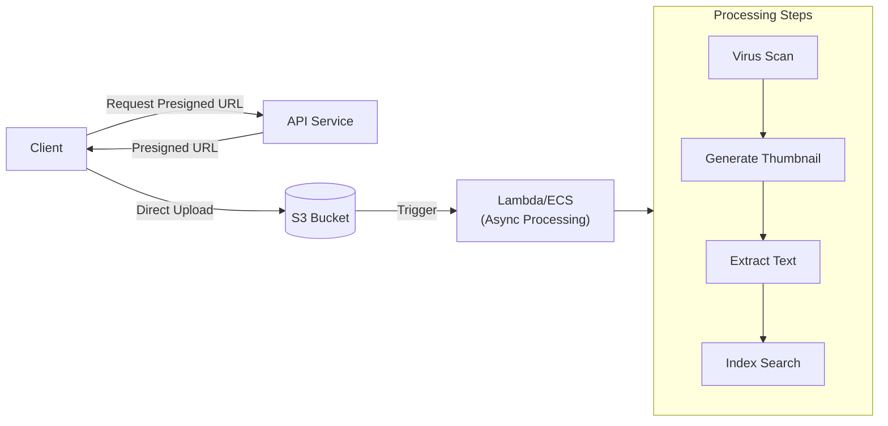

# Slack System Design

## TL;DR

Slack delivers real-time messaging to 20M+ daily active users across millions of workspaces. The architecture centers on: **channel-based message fanout** using pub/sub, **WebSocket connections** for real-time delivery, **sharded MySQL** for message persistence, **Vitess** for database scaling, and **eventual consistency** with conflict resolution. Key insight: optimize for workspace isolation while maintaining cross-workspace features like Slack Connect.

---

## Core Requirements

### Functional Requirements
1. **Real-time messaging** - Send and receive messages instantly
2. **Channels** - Public, private, and direct message channels
3. **Threads** - Reply to messages in threaded conversations
4. **File sharing** - Upload and share files in channels
5. **Search** - Full-text search across messages and files
6. **Presence** - Show user online/offline status
7. **Notifications** - Push, email, and in-app notifications

### Non-Functional Requirements
1. **Real-time latency** - Message delivery < 100ms
2. **Availability** - 99.99% uptime for messaging
3. **Scale** - 20M+ DAU, billions of messages daily
4. **Consistency** - Messages appear in correct order
5. **Multi-tenancy** - Strong workspace isolation

---

## High-Level Architecture



---

## Real-Time Messaging Flow



### Gateway Service Implementation

```java
import io.netty.bootstrap.ServerBootstrap;
import io.netty.channel.*;
import io.netty.channel.epoll.EpollServerSocketChannel;
import io.netty.channel.epoll.EpollEventLoopGroup;
import io.netty.handler.codec.http.websocketx.TextWebSocketFrame;
import io.lettuce.core.api.async.RedisAsyncCommands;
import com.fasterxml.jackson.databind.ObjectMapper;

import java.time.Instant;
import java.util.*;
import java.util.concurrent.ConcurrentHashMap;

public class WebSocketConnection {
    private final String connectionId;
    private final String userId;
    private final String workspaceId;
    private final ChannelHandlerContext ctx;
    private final Set<String> subscribedChannels = ConcurrentHashMap.newKeySet();
    private final long connectedAt = Instant.now().toEpochMilli();
    private volatile long lastPing = Instant.now().toEpochMilli();

    public WebSocketConnection(String connectionId, String userId,
                                String workspaceId, ChannelHandlerContext ctx) {
        this.connectionId = connectionId;
        this.userId = userId;
        this.workspaceId = workspaceId;
        this.ctx = ctx;
    }

    // Getters and setters omitted for brevity
    public String getConnectionId() { return connectionId; }
    public String getUserId() { return userId; }
    public String getWorkspaceId() { return workspaceId; }
    public ChannelHandlerContext getCtx() { return ctx; }
    public Set<String> getSubscribedChannels() { return subscribedChannels; }
    public long getLastPing() { return lastPing; }
    public void setLastPing(long lastPing) { this.lastPing = lastPing; }
}


/**
 * Manages WebSocket connections and message routing.
 * Each gateway server handles ~100K concurrent connections
 * using Netty with SO_REUSEPORT for kernel-level load balancing.
 */
public class GatewayService extends SimpleChannelInboundHandler<TextWebSocketFrame> {

    private final RedisAsyncCommands<String, String> redis;
    private final AuthService auth;
    private final String gatewayId;
    private final ObjectMapper mapper = new ObjectMapper();

    // Local connection registry
    private final Map<String, WebSocketConnection> connections = new ConcurrentHashMap<>();
    private final Map<String, Set<String>> userConnections = new ConcurrentHashMap<>();
    private final Map<String, Set<String>> channelConnections = new ConcurrentHashMap<>();

    public GatewayService(RedisAsyncCommands<String, String> redis,
                          AuthService auth, String gatewayId) {
        this.redis = redis;
        this.auth = auth;
        this.gatewayId = gatewayId;
    }

    public void handleConnection(ChannelHandlerContext ctx, String token) {
        // Authenticate
        User user = auth.validateToken(token);

        if (user == null) {
            ctx.close();
            return;
        }

        // Create connection record
        String connId = gatewayId + ":" + user.getId() + ":" + Instant.now().toEpochMilli();
        WebSocketConnection conn = new WebSocketConnection(
                connId, user.getId(), user.getWorkspaceId(), ctx);

        // Register connection
        registerConnection(conn);

        // Send initial state
        sendInitialState(conn);
    }

    @Override
    protected void channelRead0(ChannelHandlerContext ctx, TextWebSocketFrame frame) throws Exception {
        Map<String, Object> msg = mapper.readValue(frame.text(), Map.class);
        String connId = ctx.channel().attr(CONNECTION_ID_KEY).get();
        WebSocketConnection conn = connections.get(connId);
        if (conn == null) return;

        handleMessage(conn, msg);
    }

    private void registerConnection(WebSocketConnection conn) {
        // Local registry
        connections.put(conn.getConnectionId(), conn);
        userConnections.computeIfAbsent(conn.getUserId(), k -> ConcurrentHashMap.newKeySet())
                .add(conn.getConnectionId());

        // Redis for cross-gateway routing
        Map<String, String> connData = Map.of(
                "gateway", gatewayId,
                "workspace_id", conn.getWorkspaceId(),
                "connected_at", String.valueOf(conn.getConnectedAt())
        );
        redis.hset("user:connections:" + conn.getUserId(),
                conn.getConnectionId(), mapper.writeValueAsString(connData));

        // Update presence
        updatePresence(conn.getUserId(), "active");
    }

    private void handleMessage(WebSocketConnection conn, Map<String, Object> msg) {
        String msgType = (String) msg.get("type");

        switch (msgType) {
            case "subscribe":
                handleSubscribe(conn, (List<String>) msg.get("channels"));
                break;
            case "unsubscribe":
                handleUnsubscribe(conn, (List<String>) msg.get("channels"));
                break;
            case "message":
                handleSendMessage(conn, msg);
                break;
            case "typing":
                handleTyping(conn, msg);
                break;
            case "ping":
                conn.setLastPing(Instant.now().toEpochMilli());
                conn.getCtx().writeAndFlush(
                        new TextWebSocketFrame(mapper.writeValueAsString(Map.of("type", "pong"))));
                break;
        }
    }

    private void handleSubscribe(WebSocketConnection conn, List<String> channelIds) {
        for (String channelId : channelIds) {
            // Verify access
            if (!canAccessChannel(conn.getUserId(), channelId)) {
                continue;
            }

            // Local subscription
            conn.getSubscribedChannels().add(channelId);
            channelConnections.computeIfAbsent(channelId, k -> ConcurrentHashMap.newKeySet())
                    .add(conn.getConnectionId());

            // Subscribe to Redis pub/sub for this channel
            redis.subscribe("channel:" + channelId);
        }

        conn.getCtx().writeAndFlush(new TextWebSocketFrame(
                mapper.writeValueAsString(Map.of(
                        "type", "subscribed",
                        "channels", List.copyOf(conn.getSubscribedChannels())))));
    }

    public void handleChannelMessage(String channel, String message) {
        String channelId = channel.replace("channel:", "");
        Map<String, Object> data = mapper.readValue(message, Map.class);

        // Get all local connections subscribed to this channel
        Set<String> connIds = channelConnections.getOrDefault(channelId, Set.of());

        // Fan out to connections
        String payload = mapper.writeValueAsString(data);
        for (String connId : connIds) {
            WebSocketConnection conn = connections.get(connId);
            if (conn != null) {
                conn.getCtx().writeAndFlush(new TextWebSocketFrame(payload));
            }
        }
    }
}


/**
 * Publishes messages to Redis for cross-gateway distribution.
 */
public class MessagePublisher {

    private final RedisAsyncCommands<String, String> redis;
    private final ObjectMapper mapper = new ObjectMapper();

    public MessagePublisher(RedisAsyncCommands<String, String> redis) {
        this.redis = redis;
    }

    public void publishToChannel(String channelId, Map<String, Object> message) {
        redis.publish("channel:" + channelId, mapper.writeValueAsString(message));
    }

    public void publishToUser(String userId, Map<String, Object> message) {
        // Get all user's connections across gateways
        Map<String, String> connections = redis.hgetall("user:connections:" + userId)
                .get();

        // Group by gateway
        Map<String, List<String>> byGateway = new HashMap<>();
        for (Map.Entry<String, String> entry : connections.entrySet()) {
            Map<String, Object> data = mapper.readValue(entry.getValue(), Map.class);
            String gateway = (String) data.get("gateway");
            byGateway.computeIfAbsent(gateway, k -> new ArrayList<>())
                    .add(entry.getKey());
        }

        // Publish to each gateway's queue
        for (Map.Entry<String, List<String>> entry : byGateway.entrySet()) {
            redis.publish("gateway:" + entry.getKey() + ":messages",
                    mapper.writeValueAsString(Map.of(
                            "connections", entry.getValue(),
                            "message", message)));
        }
    }
}
```

---

## Message Storage with Vitess



### Message Service Implementation

```java
import org.jooq.DSLContext;
import org.jooq.Record;
import org.jooq.Result;
import io.lettuce.core.api.async.RedisAsyncCommands;
import com.fasterxml.jackson.databind.ObjectMapper;

import java.time.Instant;
import java.util.*;

public enum MessageType {
    STANDARD("standard"),
    THREAD_REPLY("thread_reply"),
    FILE("file"),
    SYSTEM("system");

    private final String value;
    MessageType(String value) { this.value = value; }
    public String getValue() { return value; }
}

public class Message {
    private String id;
    private String workspaceId;
    private String channelId;
    private String userId;
    private String content;
    private MessageType messageType;
    private String threadTs;    // Parent message timestamp for threads
    private String ts;          // Unique timestamp (Slack's message ID format)
    private Instant createdAt;
    private Instant editedAt;
    private Map<String, List<String>> reactions;  // emoji -> [userIds]
    private List<String> files; // file IDs

    // Constructor, getters, setters omitted for brevity
}


/**
 * Handles message CRUD operations with Vitess sharding.
 * Uses workspace_id as the sharding key.
 * Persistence via JOOQ for type-safe SQL against Vitess/MySQL.
 */
public class MessageService {

    private final DSLContext dsl;
    private final RedisAsyncCommands<String, String> redis;
    private final SearchService search;
    private final MessagePublisher publisher;
    private final ObjectMapper mapper = new ObjectMapper();

    public MessageService(DSLContext dsl, RedisAsyncCommands<String, String> redis,
                          SearchService search, MessagePublisher publisher) {
        this.dsl = dsl;
        this.redis = redis;
        this.search = search;
        this.publisher = publisher;
    }

    public Message sendMessage(String workspaceId, String channelId, String userId,
                                String content, String threadTs, List<String> files) {
        // Generate Slack-style timestamp ID
        String ts = generateTs();

        Message message = new Message();
        message.setId(UUID.randomUUID().toString());
        message.setWorkspaceId(workspaceId);
        message.setChannelId(channelId);
        message.setUserId(userId);
        message.setContent(content);
        message.setMessageType(threadTs != null ? MessageType.THREAD_REPLY : MessageType.STANDARD);
        message.setThreadTs(threadTs);
        message.setTs(ts);
        message.setCreatedAt(Instant.now());
        message.setReactions(Map.of());
        message.setFiles(files != null ? files : List.of());

        // Persist to Vitess (routed by workspace_id)
        persistMessage(message);

        // Update channel's last message
        updateChannelLastMessage(channelId, ts);

        // If thread reply, update thread metadata
        if (threadTs != null) {
            updateThread(channelId, threadTs, message);
        }

        // Index for search
        indexMessage(message);

        // Publish to subscribers
        publishMessage(message);

        return message;
    }

    private void persistMessage(Message message) {
        // Vitess routes to correct shard based on workspace_id
        dsl.insertInto(MESSAGES)
                .set(MESSAGES.ID, message.getId())
                .set(MESSAGES.WORKSPACE_ID, message.getWorkspaceId())
                .set(MESSAGES.CHANNEL_ID, message.getChannelId())
                .set(MESSAGES.USER_ID, message.getUserId())
                .set(MESSAGES.CONTENT, message.getContent())
                .set(MESSAGES.MESSAGE_TYPE, message.getMessageType().getValue())
                .set(MESSAGES.THREAD_TS, message.getThreadTs())
                .set(MESSAGES.TS, message.getTs())
                .set(MESSAGES.CREATED_AT, message.getCreatedAt())
                .set(MESSAGES.REACTIONS, mapper.writeValueAsString(message.getReactions()))
                .set(MESSAGES.FILES, mapper.writeValueAsString(message.getFiles()))
                .execute();
    }

    public MessagePage getChannelMessages(String workspaceId, String channelId,
                                           String cursor, int limit) {
        /**
         * Get messages in a channel with cursor pagination.
         * Cursor is the 'ts' of the last message.
         */
        var query = dsl.selectFrom(MESSAGES)
                .where(MESSAGES.WORKSPACE_ID.eq(workspaceId))
                .and(MESSAGES.CHANNEL_ID.eq(channelId))
                .and(MESSAGES.THREAD_TS.isNull());

        if (cursor != null) {
            query = query.and(MESSAGES.TS.lt(cursor));
        }

        Result<Record> rows = query.orderBy(MESSAGES.TS.desc())
                .limit(limit + 1)
                .fetch();

        List<Message> messages = rows.stream()
                .limit(limit)
                .map(this::rowToMessage)
                .toList();

        String nextCursor = rows.size() > limit ? rows.get(limit).get(MESSAGES.TS) : null;

        return new MessagePage(messages, nextCursor);
    }

    public List<Message> getThreadMessages(String workspaceId, String channelId,
                                            String threadTs) {
        return dsl.selectFrom(MESSAGES)
                .where(MESSAGES.WORKSPACE_ID.eq(workspaceId))
                .and(MESSAGES.CHANNEL_ID.eq(channelId))
                .and(MESSAGES.TS.eq(threadTs).or(MESSAGES.THREAD_TS.eq(threadTs)))
                .orderBy(MESSAGES.TS.asc())
                .fetch()
                .map(this::rowToMessage);
    }

    private String generateTs() {
        /**
         * Generate Slack-style timestamp.
         * Format: seconds.microseconds (e.g., "1609459200.000100")
         * Guaranteed unique within a workspace.
         */
        Instant now = Instant.now();
        long seconds = now.getEpochSecond();
        int micros = now.getNano() / 1000;
        String uniqueSuffix = UUID.randomUUID().toString().replace("-", "").substring(0, 6);
        return String.format("%d.%06d%s", seconds, micros, uniqueSuffix);
    }

    private void publishMessage(Message message) {
        Map<String, Object> payload = Map.of(
                "type", "message",
                "channel", message.getChannelId(),
                "user", message.getUserId(),
                "text", message.getContent(),
                "ts", message.getTs(),
                "thread_ts", message.getThreadTs() != null ? message.getThreadTs() : "",
                "files", message.getFiles()
        );

        publisher.publishToChannel(message.getChannelId(), payload);
    }
}


/**
 * Handles emoji reactions on messages.
 */
public class ReactionService {

    private final DSLContext dsl;
    private final RedisAsyncCommands<String, String> redis;
    private final MessagePublisher publisher;

    public ReactionService(DSLContext dsl, RedisAsyncCommands<String, String> redis,
                           MessagePublisher publisher) {
        this.dsl = dsl;
        this.redis = redis;
        this.publisher = publisher;
    }

    public void addReaction(String workspaceId, String channelId,
                            String messageTs, String userId, String emoji) {
        // Atomic update using JSON functions
        dsl.execute("""
            UPDATE messages
            SET reactions = JSON_ARRAY_APPEND(
                COALESCE(reactions, JSON_OBJECT(?, JSON_ARRAY())),
                CONCAT('$.', ?), ?
            )
            WHERE workspace_id = ?
              AND channel_id = ?
              AND ts = ?
            """, emoji, emoji, userId, workspaceId, channelId, messageTs);

        // Publish reaction event
        publisher.publishToChannel(channelId, Map.of(
                "type", "reaction_added",
                "channel", channelId,
                "ts", messageTs,
                "user", userId,
                "reaction", emoji
        ));
    }
}
```

---

## Search Architecture



```
Elasticsearch Cluster (per region)

  Index: messages-{workspace}
    Fields:
    - content (text, analyzed)
    - channel_id (keyword)
    - user_id (keyword)
    - ts (date)
    - channel_members (keyword[], for ACL)
    - attachments.content (text, for file search)

  Index: files-{workspace}
```

### Search Service Implementation

```java
import org.elasticsearch.client.RestHighLevelClient;
import org.elasticsearch.client.RequestOptions;
import org.elasticsearch.action.search.SearchRequest;
import org.elasticsearch.action.search.SearchResponse;
import org.elasticsearch.index.query.BoolQueryBuilder;
import org.elasticsearch.index.query.QueryBuilders;
import org.elasticsearch.search.builder.SearchSourceBuilder;
import org.elasticsearch.search.fetch.subphase.highlight.HighlightBuilder;
import org.elasticsearch.search.sort.SortOrder;
import org.elasticsearch.action.index.IndexRequest;
import org.springframework.kafka.annotation.KafkaListener;
import io.lettuce.core.api.async.RedisAsyncCommands;

import java.time.Instant;
import java.util.*;
import java.util.stream.Collectors;

public enum SearchScope {
    MESSAGES, FILES, ALL
}

public record SearchResult(
        String type,       // "message" or "file"
        String id,
        String channelId,
        String channelName,
        String userId,
        String content,
        String ts,
        List<String> highlights,
        float score
) {}

public record SearchQuery(
        String query,
        String workspaceId,
        String userId,
        SearchScope scope,
        String fromUser,
        String inChannel,
        Instant after,
        Instant before,
        boolean hasFile,
        int limit
) {
    public SearchQuery {
        if (scope == null) scope = SearchScope.ALL;
        if (limit <= 0) limit = 20;
    }
}


/**
 * Full-text search across messages and files.
 * Uses Elasticsearch with per-workspace indices.
 */
public class SearchService {

    private final RestHighLevelClient es;
    private final ChannelService channels;
    private final RedisAsyncCommands<String, String> redis;

    public SearchService(RestHighLevelClient es, ChannelService channels,
                         RedisAsyncCommands<String, String> redis) {
        this.es = es;
        this.channels = channels;
        this.redis = redis;
    }

    public List<SearchResult> search(SearchQuery query) throws Exception {
        // Get channels user has access to
        List<Channel> accessibleChannels = channels.getUserChannels(
                query.workspaceId(), query.userId());
        List<String> channelIds = accessibleChannels.stream()
                .map(Channel::getId).toList();

        // Build Elasticsearch query
        SearchSourceBuilder sourceBuilder = buildQuery(query, channelIds);

        // Determine index
        String index = switch (query.scope()) {
            case FILES -> "files-" + query.workspaceId();
            case MESSAGES -> "messages-" + query.workspaceId();
            case ALL -> "messages-" + query.workspaceId() + ",files-" + query.workspaceId();
        };

        SearchRequest request = new SearchRequest(index);
        request.source(sourceBuilder);

        SearchResponse response = es.search(request, RequestOptions.DEFAULT);

        // Transform results
        List<SearchResult> results = new ArrayList<>();
        for (var hit : response.getHits().getHits()) {
            Map<String, Object> source = hit.getSourceAsMap();
            String hitChannelId = (String) source.get("channel_id");
            results.add(new SearchResult(
                    hit.getIndex().split("-")[0],  // "messages" or "files"
                    hit.getId(),
                    hitChannelId,
                    getChannelName(hitChannelId, accessibleChannels),
                    (String) source.get("user_id"),
                    (String) source.get("content"),
                    (String) source.get("ts"),
                    hit.getHighlightFields().containsKey("content")
                            ? Arrays.asList(hit.getHighlightFields().get("content").getFragments())
                                    .stream().map(Object::toString).toList()
                            : List.of(),
                    hit.getScore()
            ));
        }

        return results;
    }

    private SearchSourceBuilder buildQuery(SearchQuery query, List<String> channelIds) {
        BoolQueryBuilder boolQuery = QueryBuilders.boolQuery()
                .must(QueryBuilders.multiMatchQuery(query.query(), "content", "attachments.content")
                        .field("content", 2.0f)
                        .type(org.elasticsearch.index.query.MultiMatchQueryBuilder.Type.BEST_FIELDS)
                        .fuzziness("AUTO"))
                .filter(QueryBuilders.termsQuery("channel_id", channelIds));

        // Optional filters
        if (query.fromUser() != null) {
            boolQuery.filter(QueryBuilders.termQuery("user_id", query.fromUser()));
        }
        if (query.inChannel() != null) {
            boolQuery.filter(QueryBuilders.termQuery("channel_id", query.inChannel()));
        }
        if (query.after() != null || query.before() != null) {
            var rangeQuery = QueryBuilders.rangeQuery("ts");
            if (query.after() != null) rangeQuery.gte(query.after().toString());
            if (query.before() != null) rangeQuery.lte(query.before().toString());
            boolQuery.filter(rangeQuery);
        }
        if (query.hasFile()) {
            boolQuery.filter(QueryBuilders.existsQuery("files"));
        }

        return new SearchSourceBuilder()
                .query(boolQuery)
                .highlighter(new HighlightBuilder()
                        .field("content", 150, 3))
                .sort("_score", SortOrder.DESC)
                .sort("ts", SortOrder.DESC)
                .size(query.limit());
    }
}


/**
 * Indexes messages and files for search.
 * Consumes from Kafka via Spring KafkaTemplate.
 */
public class SearchIndexer {

    private final RestHighLevelClient es;

    public SearchIndexer(RestHighLevelClient es) {
        this.es = es;
    }

    @KafkaListener(topics = "search-index", groupId = "search-indexer")
    public void processMessage(String payload) {
        try {
            Map<String, Object> message = new ObjectMapper().readValue(payload, Map.class);
            indexDocument(message);
        } catch (Exception e) {
            // Dead letter queue for failed indexing
            sendToDlq(message, e);
        }
    }

    private void indexDocument(Map<String, Object> message) throws Exception {
        String docType = (String) message.get("type");
        String workspaceId = (String) message.get("workspace_id");

        String index;
        Map<String, Object> doc;

        if ("message".equals(docType)) {
            index = "messages-" + workspaceId;
            doc = Map.of(
                    "channel_id", message.get("channel_id"),
                    "user_id", message.get("user_id"),
                    "content", message.get("content"),
                    "ts", message.get("ts"),
                    "thread_ts", message.getOrDefault("thread_ts", ""),
                    "files", message.getOrDefault("files", List.of()),
                    "channel_members", message.getOrDefault("channel_members", List.of())
            );
        } else {
            index = "files-" + workspaceId;
            doc = Map.of(
                    "channel_id", message.get("channel_id"),
                    "user_id", message.get("user_id"),
                    "filename", message.get("filename"),
                    "content", message.getOrDefault("extracted_text", ""),
                    "ts", message.get("ts"),
                    "filetype", message.get("filetype"),
                    "channel_members", message.getOrDefault("channel_members", List.of())
            );
        }

        IndexRequest request = new IndexRequest(index)
                .id((String) message.get("id"))
                .source(doc);
        // Async refresh for performance
        request.setRefreshPolicy(org.elasticsearch.action.support.WriteRequest.RefreshPolicy.NONE);

        es.index(request, RequestOptions.DEFAULT);
    }
}
```

---

## Presence System

```java
import io.lettuce.core.api.async.RedisAsyncCommands;
import io.lettuce.core.RedisFuture;

import java.time.Instant;
import java.util.*;

public enum PresenceStatus {
    ACTIVE("active"),
    AWAY("away"),
    DND("dnd"),       // Do Not Disturb
    OFFLINE("offline");

    private final String value;
    PresenceStatus(String value) { this.value = value; }
    public String getValue() { return value; }
}

public class UserPresence {
    private String userId;
    private PresenceStatus status;
    private String statusText;
    private String statusEmoji;
    private long lastActivity;
    private Long dndUntil;

    // Constructor, getters, setters omitted for brevity
}


/**
 * Tracks and broadcasts user presence status.
 * Optimized for read-heavy workloads with caching.
 */
public class PresenceService {

    private final RedisAsyncCommands<String, String> redis;
    private final MessagePublisher publisher;

    // Active/away threshold
    private static final long AWAY_THRESHOLD_SECONDS = 300;     // 5 minutes
    private static final long OFFLINE_THRESHOLD_SECONDS = 900;  // 15 minutes

    public PresenceService(RedisAsyncCommands<String, String> redis,
                           MessagePublisher publisher) {
        this.redis = redis;
        this.publisher = publisher;
    }

    public void updateActivity(String userId, String workspaceId) throws Exception {
        long now = Instant.now().getEpochSecond();

        // Get current presence
        UserPresence current = getPresence(userId);

        // Update activity time
        redis.hset("presence:" + userId, Map.of(
                "last_activity", String.valueOf(now),
                "workspace_id", workspaceId
        )).get();

        // If status changed, broadcast
        PresenceStatus newStatus = calculateStatus(now, current);
        if (current != null && newStatus != current.getStatus()) {
            broadcastPresenceChange(userId, workspaceId, newStatus);
        }
    }

    public void setStatus(String userId, String workspaceId,
                          PresenceStatus status, String statusText,
                          String statusEmoji, Long dndUntil) throws Exception {
        redis.hset("presence:" + userId, Map.of(
                "status", status.getValue(),
                "status_text", statusText != null ? statusText : "",
                "status_emoji", statusEmoji != null ? statusEmoji : "",
                "dnd_until", String.valueOf(dndUntil != null ? dndUntil : 0),
                "last_activity", String.valueOf(Instant.now().getEpochSecond())
        )).get();

        broadcastPresenceChange(userId, workspaceId, status);
    }

    public Map<String, UserPresence> getPresenceBatch(List<String> userIds) throws Exception {
        // Pipeline commands for efficiency
        Map<String, RedisFuture<Map<String, String>>> futures = new LinkedHashMap<>();
        for (String userId : userIds) {
            futures.put(userId, redis.hgetall("presence:" + userId));
        }

        Map<String, UserPresence> presences = new HashMap<>();
        long now = Instant.now().getEpochSecond();

        for (String userId : userIds) {
            Map<String, String> data = futures.get(userId).get();
            if (data != null && !data.isEmpty()) {
                presences.put(userId, dataToPresence(userId, data, now));
            } else {
                UserPresence offline = new UserPresence();
                offline.setUserId(userId);
                offline.setStatus(PresenceStatus.OFFLINE);
                offline.setLastActivity(0);
                presences.put(userId, offline);
            }
        }

        return presences;
    }

    public Map<String, UserPresence> getChannelPresence(String channelId) throws Exception {
        // Get channel members
        Set<String> memberIds = redis.smembers("channel:" + channelId + ":members").get();
        return getPresenceBatch(new ArrayList<>(memberIds));
    }

    private PresenceStatus calculateStatus(long now, UserPresence current) {
        if (current == null) {
            return PresenceStatus.ACTIVE;
        }

        // Check DND
        if (current.getDndUntil() != null && now < current.getDndUntil()) {
            return PresenceStatus.DND;
        }

        // Check manual status
        if (current.getStatus() == PresenceStatus.DND
                || current.getStatus() == PresenceStatus.AWAY) {
            return current.getStatus();
        }

        // Calculate based on activity
        long idleTime = now - current.getLastActivity();

        if (idleTime > OFFLINE_THRESHOLD_SECONDS) {
            return PresenceStatus.OFFLINE;
        } else if (idleTime > AWAY_THRESHOLD_SECONDS) {
            return PresenceStatus.AWAY;
        } else {
            return PresenceStatus.ACTIVE;
        }
    }

    private void broadcastPresenceChange(String userId, String workspaceId,
                                          PresenceStatus status) throws Exception {
        // Get all channels user is in
        Set<String> channelSet = redis.smembers("user:" + userId + ":channels").get();

        Map<String, Object> payload = Map.of(
                "type", "presence_change",
                "user", userId,
                "presence", status.getValue()
        );

        // Publish to each channel
        for (String channelId : channelSet) {
            publisher.publishToChannel(channelId, payload);
        }
    }
}


/**
 * Manages client subscriptions to presence updates.
 * Optimizes by batching and limiting subscription scope.
 */
public class PresenceSubscriptionManager {

    private final RedisAsyncCommands<String, String> redis;
    private final PresenceService presence;

    // Limit presence subscriptions per connection
    private static final int MAX_SUBSCRIPTIONS = 500;

    public PresenceSubscriptionManager(RedisAsyncCommands<String, String> redis,
                                        PresenceService presence) {
        this.redis = redis;
        this.presence = presence;
    }

    public Map<String, UserPresence> subscribeToUsers(String connectionId,
                                                       List<String> userIds) throws Exception {
        /**
         * Subscribe to presence updates for users.
         * Returns initial presence state.
         */
        // Limit subscriptions
        if (userIds.size() > MAX_SUBSCRIPTIONS) {
            userIds = userIds.subList(0, MAX_SUBSCRIPTIONS);
        }

        // Store subscriptions
        redis.sadd("conn:" + connectionId + ":presence_subs",
                userIds.toArray(new String[0])).get();

        // Return initial state
        return presence.getPresenceBatch(userIds);
    }
}
```

---

## File Upload Pipeline



### File Service Implementation

```java
import software.amazon.awssdk.services.s3.presigner.S3Presigner;
import software.amazon.awssdk.services.s3.presigner.model.PresignedPutObjectRequest;
import software.amazon.awssdk.services.s3.model.PutObjectRequest;
import software.amazon.awssdk.services.sqs.SqsClient;
import software.amazon.awssdk.services.sqs.model.SendMessageRequest;
import org.jooq.DSLContext;
import com.fasterxml.jackson.databind.ObjectMapper;

import java.time.Duration;
import java.util.*;

public class FileUpload {
    private String id;
    private String workspaceId;
    private String channelId;
    private String userId;
    private String filename;
    private String filetype;
    private long sizeBytes;
    private String urlPrivate;
    private String thumbUrl;
    private String status;  // "uploading", "processing", "ready", "error"

    // Constructor, getters, setters omitted for brevity
}


/**
 * Handles file uploads, processing, and retrieval.
 * Uses AWS S3 SDK v2 for presigned URLs and object storage.
 */
public class FileService {

    private final S3Presigner s3Presigner;
    private final DSLContext dsl;
    private final SqsClient sqs;
    private final String cdnUrl;
    private final ObjectMapper mapper = new ObjectMapper();

    // Upload limits
    private static final long MAX_FILE_SIZE = 1L * 1024 * 1024 * 1024; // 1GB
    private static final Set<String> ALLOWED_TYPES = Set.of(
            "image", "video", "audio", "application", "text");

    public FileService(S3Presigner s3Presigner, DSLContext dsl,
                       SqsClient sqs, String cdnUrl) {
        this.s3Presigner = s3Presigner;
        this.dsl = dsl;
        this.sqs = sqs;
        this.cdnUrl = cdnUrl;
    }

    public Map<String, Object> getUploadUrl(String workspaceId, String channelId,
                                             String userId, String filename,
                                             String contentType, long sizeBytes) {
        // Validate
        if (sizeBytes > MAX_FILE_SIZE) {
            throw new FileTooLargeException("Max size is " + MAX_FILE_SIZE + " bytes");
        }

        String mainType = contentType.split("/")[0];
        if (!ALLOWED_TYPES.contains(mainType)) {
            throw new InvalidFileTypeException("Type " + contentType + " not allowed");
        }

        // Generate file ID and path
        String fileId = UUID.randomUUID().toString();
        String s3Key = workspaceId + "/" + channelId + "/" + fileId + "/" + filename;

        // Create file record
        FileUpload fileRecord = new FileUpload();
        fileRecord.setId(fileId);
        fileRecord.setWorkspaceId(workspaceId);
        fileRecord.setChannelId(channelId);
        fileRecord.setUserId(userId);
        fileRecord.setFilename(filename);
        fileRecord.setFiletype(contentType);
        fileRecord.setSizeBytes(sizeBytes);
        fileRecord.setUrlPrivate(cdnUrl + "/" + s3Key);
        fileRecord.setStatus("uploading");

        saveFileRecord(fileRecord);

        // Generate presigned URL using AWS SDK v2
        PutObjectRequest putRequest = PutObjectRequest.builder()
                .bucket("slack-files")
                .key(s3Key)
                .contentType(contentType)
                .contentLength(sizeBytes)
                .build();

        PresignedPutObjectRequest presigned = s3Presigner.presignPutObject(b -> b
                .putObjectRequest(putRequest)
                .signatureDuration(Duration.ofHours(1)));

        return Map.of(
                "file_id", fileId,
                "upload_url", presigned.url().toString()
        );
    }

    public void confirmUpload(String fileId) throws Exception {
        FileUpload file = getFileRecord(fileId);

        // Update status
        updateFileStatus(fileId, "processing");

        // Queue for processing
        sqs.sendMessage(SendMessageRequest.builder()
                .queueUrl("file-processing-queue")
                .messageBody(mapper.writeValueAsString(Map.of(
                        "file_id", fileId,
                        "workspace_id", file.getWorkspaceId(),
                        "channel_id", file.getChannelId(),
                        "filename", file.getFilename(),
                        "filetype", file.getFiletype()
                )))
                .build());
    }

    public Optional<FileUpload> getFile(String fileId, String userId) {
        FileUpload file = getFileRecord(fileId);

        if (file == null) {
            return Optional.empty();
        }

        // Check access
        if (!canAccessFile(userId, file)) {
            throw new AccessDeniedException("No access to this file");
        }

        return Optional.of(file);
    }

    private boolean canAccessFile(String userId, FileUpload file) {
        return dsl.fetchExists(
                dsl.selectOne()
                        .from("channel_members")
                        .where("workspace_id = ?", file.getWorkspaceId())
                        .and("channel_id = ?", file.getChannelId())
                        .and("user_id = ?", userId));
    }
}


/**
 * Processes uploaded files (thumbnails, text extraction, scanning).
 */
public class FileProcessor {

    private final S3Presigner s3Presigner;
    private final SearchIndexer searchIndexer;
    private final AntivirusClient antivirus;

    public FileProcessor(S3Presigner s3Presigner, SearchIndexer searchIndexer,
                         AntivirusClient antivirus) {
        this.s3Presigner = s3Presigner;
        this.searchIndexer = searchIndexer;
        this.antivirus = antivirus;
    }

    public void processFile(Map<String, Object> message) {
        String fileId = (String) message.get("file_id");
        String filetype = (String) message.get("filetype");

        try {
            // Virus scan
            ScanResult scanResult = antivirus.scan((String) message.get("s3_key"));
            if (!scanResult.isClean()) {
                quarantineFile(fileId);
                return;
            }

            // Generate thumbnail for images/videos
            if (filetype.startsWith("image/") || filetype.startsWith("video/")) {
                generateThumbnail(fileId, message);
            }

            // Extract text for searchable content
            if (isSearchable(filetype)) {
                String text = extractText(fileId, message);
                if (text != null && !text.isEmpty()) {
                    searchIndexer.indexFile(
                            fileId,
                            (String) message.get("workspace_id"),
                            (String) message.get("channel_id"),
                            (String) message.get("filename"),
                            text);
                }
            }

            // Mark as ready
            updateStatus(fileId, "ready");

        } catch (Exception e) {
            updateStatus(fileId, "error");
            throw new RuntimeException(e);
        }
    }

    private boolean isSearchable(String filetype) {
        return filetype.startsWith("application/pdf")
                || filetype.startsWith("application/msword")
                || filetype.startsWith("application/vnd.openxmlformats-officedocument")
                || filetype.startsWith("text/");
    }
}
```

---

## Slack Connect (Cross-Workspace)

```java
import org.jooq.DSLContext;
import io.lettuce.core.api.async.RedisAsyncCommands;

import java.util.*;

public class SlackConnectChannel {
    private String id;
    private String name;
    private String hostWorkspaceId;       // Workspace that created the channel
    private List<String> connectedWorkspaceIds;
    private boolean pending;

    // Constructor, getters, setters omitted for brevity
}


/**
 * Manages channels shared between workspaces.
 * Special handling for multi-tenant message routing.
 */
public class SlackConnectService {

    private final DSLContext dsl;
    private final RedisAsyncCommands<String, String> redis;
    private final MessageService messages;

    public SlackConnectService(DSLContext dsl,
                                RedisAsyncCommands<String, String> redis,
                                MessageService messages) {
        this.dsl = dsl;
        this.redis = redis;
        this.messages = messages;
    }

    public SlackConnectChannel createSharedChannel(String hostWorkspaceId,
                                                    String channelName,
                                                    String creatorUserId) {
        String channelId = UUID.randomUUID().toString();

        SlackConnectChannel channel = new SlackConnectChannel();
        channel.setId(channelId);
        channel.setName(channelName);
        channel.setHostWorkspaceId(hostWorkspaceId);
        channel.setConnectedWorkspaceIds(List.of(hostWorkspaceId));
        channel.setPending(false);

        // Store in special cross-workspace keyspace
        // This data is replicated, not sharded by workspace
        dsl.execute("""
            INSERT INTO slack_connect_channels (
                id, name, host_workspace_id, created_at
            ) VALUES (?, ?, ?, NOW())
            """, channelId, channelName, hostWorkspaceId);

        // Add host workspace as connected
        addWorkspaceToChannel(channelId, hostWorkspaceId);

        return channel;
    }

    public String inviteWorkspace(String channelId, String invitingWorkspaceId,
                                   String targetWorkspaceId, String invitingUserId) {
        // Verify inviting workspace is connected
        SlackConnectChannel channel = getChannel(channelId);
        if (!channel.getConnectedWorkspaceIds().contains(invitingWorkspaceId)) {
            throw new NotConnectedException("Workspace not connected to channel");
        }

        // Create invitation
        String inviteId = UUID.randomUUID().toString();

        dsl.execute("""
            INSERT INTO slack_connect_invitations (
                id, channel_id, inviting_workspace_id, target_workspace_id,
                inviting_user_id, status, created_at
            ) VALUES (?, ?, ?, ?, ?, 'pending', NOW())
            """, inviteId, channelId, invitingWorkspaceId,
                targetWorkspaceId, invitingUserId);

        return inviteId;
    }

    public void acceptInvitation(String inviteId, String acceptingWorkspaceId,
                                  String acceptingUserId) {
        var invite = getInvitation(inviteId);

        if (!invite.getTargetWorkspaceId().equals(acceptingWorkspaceId)) {
            throw new InvalidInvitationException("Invitation not for this workspace");
        }

        // Add workspace to channel
        addWorkspaceToChannel(invite.getChannelId(), acceptingWorkspaceId);

        // Update invitation status
        dsl.execute("""
            UPDATE slack_connect_invitations
            SET status = 'accepted', accepted_at = NOW()
            WHERE id = ?
            """, inviteId);
    }

    public Message sendMessageToSharedChannel(String channelId, String senderWorkspaceId,
                                               String senderUserId, String content) {
        /**
         * Send message to shared channel.
         * Message must be visible in all connected workspaces.
         */
        SlackConnectChannel channel = getChannel(channelId);

        if (!channel.getConnectedWorkspaceIds().contains(senderWorkspaceId)) {
            throw new NotConnectedException("Workspace not connected to channel");
        }

        // Store message in shared keyspace
        Message message = messages.sendMessage(
                "shared",  // Special shared keyspace
                channelId,
                senderUserId,
                content,
                null,
                null);

        // Sync to all connected workspaces' search indices
        for (String workspaceId : channel.getConnectedWorkspaceIds()) {
            syncMessageToWorkspace(message, workspaceId);
        }

        return message;
    }
}
```

---

## Key Metrics & Scale

| Metric | Value |
|--------|-------|
| **Daily active users** | 20M+ |
| **Workspaces** | 750,000+ |
| **Messages per day** | 5B+ |
| **Concurrent connections** | 10M+ |
| **WebSocket servers** | 1,000+ |
| **Message delivery latency** | < 100ms |
| **Search index size** | Petabytes |
| **Files uploaded per day** | 1B+ |
| **Uptime SLA** | 99.99% |

---

## Production Insights

### Vitess Workspace-Level Sharding
- Slack shards exclusively on `workspace_id`, guaranteeing all data for a single workspace lives on one shard. This eliminates cross-shard joins for the vast majority of queries (channel listing, message fetch, membership checks).
- Large enterprise workspaces that outgrow a single shard are re-sharded into their own dedicated keyspace via Vitess `MoveTables`, performed online with zero downtime.
- The `slack_connect` keyspace is intentionally unsharded (replicated) because shared-channel metadata must be visible across workspace boundaries.

### Netty WebSocket Layer — 100K Connections per Host
- Gateway servers use Netty's `EpollEventLoopGroup` with `SO_REUSEPORT` enabled, allowing multiple acceptor threads to bind to the same port and letting the kernel distribute incoming connections evenly across threads.
- Each host maintains ~100K concurrent WebSocket connections at steady state. Back-pressure is managed through Netty's `ChannelOption.WRITE_BUFFER_WATER_MARK`; when the write buffer exceeds the high-water mark, the channel becomes non-writable and the gateway stops reading from Redis pub/sub for that connection until the buffer drains.
- Idle connection reaping runs on a `HashedWheelTimer` with 30-second ticks; connections that miss two consecutive pings are closed server-side to reclaim file descriptors.

### Message Ordering via `ts` Timestamp
- Every message receives a `ts` value composed of `epoch_seconds.microseconds + 6-char random suffix`. Within a single workspace shard, this value is the **primary ordering key** and doubles as the message's unique ID.
- Channel history queries (`ORDER BY ts DESC`) and cursor-based pagination (`WHERE ts < ?`) rely entirely on `ts`, making the query plan a simple index range scan on `(workspace_id, channel_id, ts)`.
- Thread replies carry a `thread_ts` that references the parent message's `ts`. Fetching a full thread is a single index scan: `WHERE (ts = ? OR thread_ts = ?) ORDER BY ts ASC`.

### Operational Considerations
- Redis pub/sub fan-out is the primary hot path; Slack uses dedicated Redis clusters for pub/sub traffic, separate from session/presence storage, to isolate failure domains.
- Elasticsearch indices are created per workspace. Workspaces on free plans share multi-tenant indices, while paid workspaces get dedicated indices for stronger isolation and independent scaling.
- File processing (virus scan, thumbnail generation, text extraction) runs asynchronously via SQS + ECS tasks. A failed processing step writes to a dead-letter queue and does not block the message from being delivered — the file simply shows as "processing" until retried.

---

## Key Takeaways

1. **Workspace-based sharding** - Vitess shards by workspace_id providing strong isolation and enabling independent scaling per tenant.

2. **Redis pub/sub for fanout** - Messages published to Redis channels, each gateway subscribes and fans out to local WebSocket connections.

3. **Gateway layer for connection management** - Stateful gateways handle WebSocket lifecycle. Connection registry in Redis enables cross-gateway messaging.

4. **Timestamps as message IDs** - Slack's `ts` format (epoch.sequence) provides ordering, uniqueness, and efficient pagination.

5. **Async file processing** - Direct uploads to S3, async processing for thumbnails/search indexing. Decouples upload latency from processing.

6. **Search with ACL filtering** - Elasticsearch indices per workspace, ACLs enforced at query time by filtering to accessible channels.

7. **Presence optimization** - Activity-based status calculation, batched presence queries, channel-scoped broadcast limiting.

8. **Slack Connect complexity** - Shared channels require global keyspace, multi-workspace message routing, and cross-tenant access control.
