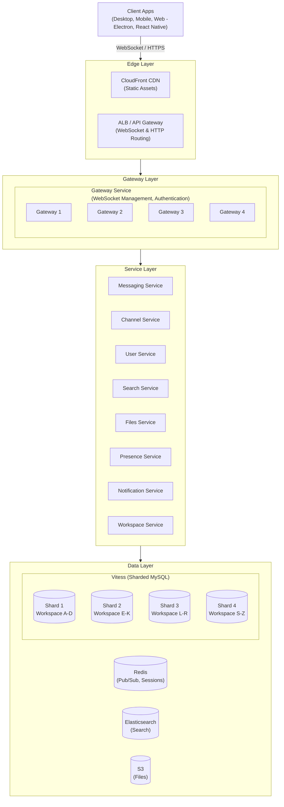
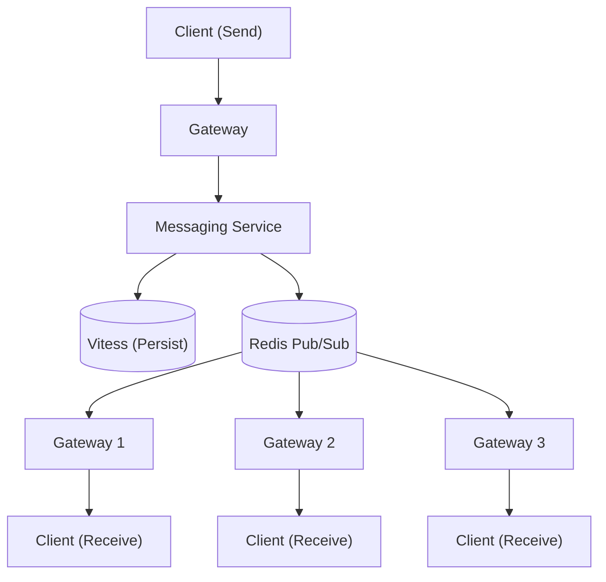
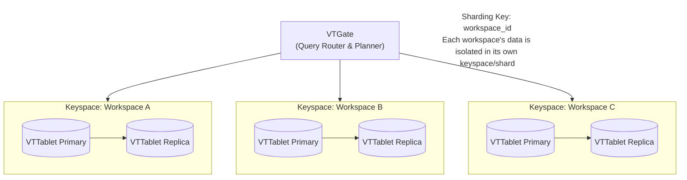
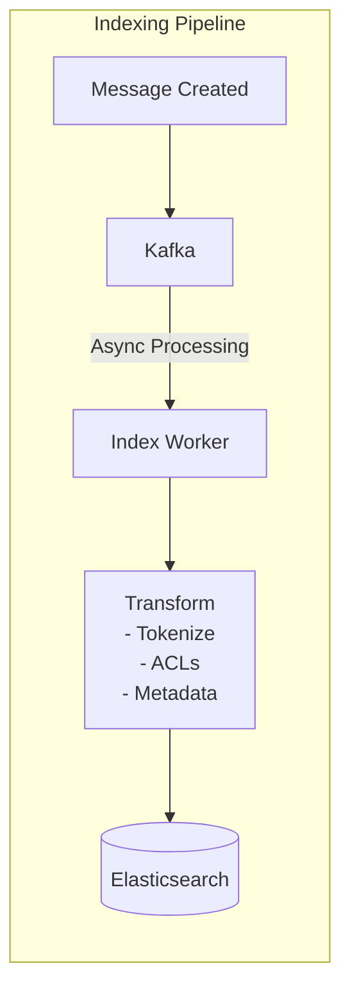
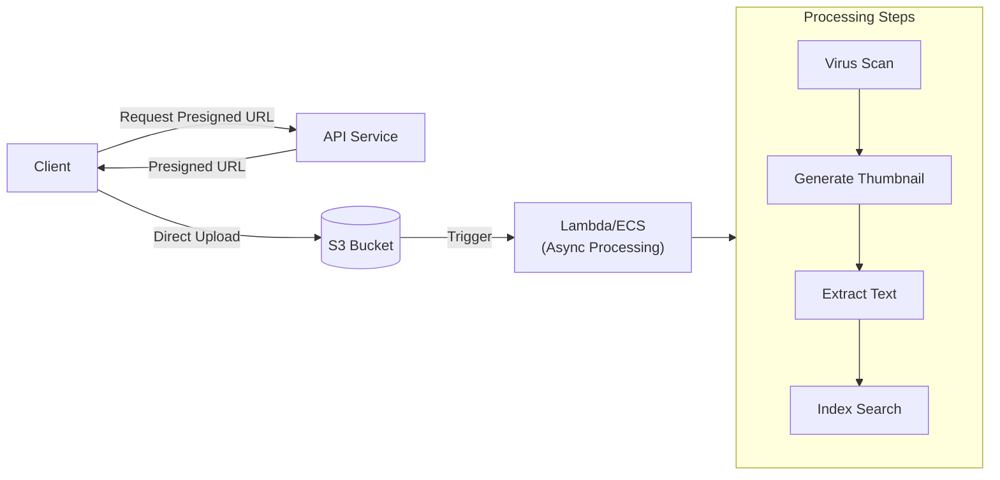

# Slack System Design

## TL;DR

Slack delivers real-time messaging to 20M+ daily active users across millions of workspaces. The architecture centers on: **channel-based message fanout** using pub/sub, **WebSocket connections** for real-time delivery, **sharded MySQL** for message persistence, **Vitess** for database scaling, and **eventual consistency** with conflict resolution. Key insight: optimize for workspace isolation while maintaining cross-workspace features like Slack Connect.

---

## Core Requirements

### Functional Requirements
1. **Real-time messaging** - Send and receive messages instantly
2. **Channels** - Public, private, and direct message channels
3. **Threads** - Reply to messages in threaded conversations
4. **File sharing** - Upload and share files in channels
5. **Search** - Full-text search across messages and files
6. **Presence** - Show user online/offline status
7. **Notifications** - Push, email, and in-app notifications

### Non-Functional Requirements
1. **Real-time latency** - Message delivery < 100ms
2. **Availability** - 99.99% uptime for messaging
3. **Scale** - 20M+ DAU, billions of messages daily
4. **Consistency** - Messages appear in correct order
5. **Multi-tenancy** - Strong workspace isolation

---

## High-Level Architecture



---

## Real-Time Messaging Flow



### Gateway Service Implementation

```python
from dataclasses import dataclass, field
from typing import Dict, Set, Optional, List
import asyncio
import json
import time
from enum import Enum

@dataclass
class WebSocketConnection:
    connection_id: str
    user_id: str
    workspace_id: str
    websocket: any  # aiohttp.WebSocketResponse
    subscribed_channels: Set[str] = field(default_factory=set)
    connected_at: float = field(default_factory=time.time)
    last_ping: float = field(default_factory=time.time)


class GatewayService:
    """
    Manages WebSocket connections and message routing.
    Each gateway server handles ~100K concurrent connections.
    """
    
    def __init__(self, redis_client, auth_service, gateway_id: str):
        self.redis = redis_client
        self.auth = auth_service
        self.gateway_id = gateway_id
        
        # Local connection registry
        self.connections: Dict[str, WebSocketConnection] = {}
        self.user_connections: Dict[str, Set[str]] = {}  # user_id -> connection_ids
        self.channel_connections: Dict[str, Set[str]] = {}  # channel_id -> connection_ids
    
    async def handle_connection(self, websocket, request):
        """Handle new WebSocket connection"""
        # Authenticate
        token = request.headers.get("Authorization", "").replace("Bearer ", "")
        user = await self.auth.validate_token(token)
        
        if not user:
            await websocket.close(code=4001, message="Unauthorized")
            return
        
        # Create connection record
        conn_id = f"{self.gateway_id}:{user.id}:{int(time.time()*1000)}"
        conn = WebSocketConnection(
            connection_id=conn_id,
            user_id=user.id,
            workspace_id=user.workspace_id,
            websocket=websocket
        )
        
        # Register connection
        await self._register_connection(conn)
        
        try:
            # Send initial state
            await self._send_initial_state(conn)
            
            # Handle messages
            async for msg in websocket:
                if msg.type == aiohttp.WSMsgType.TEXT:
                    await self._handle_message(conn, json.loads(msg.data))
                elif msg.type == aiohttp.WSMsgType.PING:
                    conn.last_ping = time.time()
                    await websocket.pong()
        finally:
            await self._unregister_connection(conn)
    
    async def _register_connection(self, conn: WebSocketConnection):
        """Register connection locally and in Redis"""
        # Local registry
        self.connections[conn.connection_id] = conn
        
        if conn.user_id not in self.user_connections:
            self.user_connections[conn.user_id] = set()
        self.user_connections[conn.user_id].add(conn.connection_id)
        
        # Redis for cross-gateway routing
        await self.redis.hset(
            f"user:connections:{conn.user_id}",
            conn.connection_id,
            json.dumps({
                "gateway": self.gateway_id,
                "workspace_id": conn.workspace_id,
                "connected_at": conn.connected_at
            })
        )
        
        # Update presence
        await self._update_presence(conn.user_id, "active")
    
    async def _handle_message(self, conn: WebSocketConnection, msg: dict):
        """Handle incoming WebSocket message"""
        msg_type = msg.get("type")
        
        if msg_type == "subscribe":
            await self._handle_subscribe(conn, msg["channels"])
        elif msg_type == "unsubscribe":
            await self._handle_unsubscribe(conn, msg["channels"])
        elif msg_type == "message":
            await self._handle_send_message(conn, msg)
        elif msg_type == "typing":
            await self._handle_typing(conn, msg)
        elif msg_type == "ping":
            conn.last_ping = time.time()
            await conn.websocket.send_json({"type": "pong"})
    
    async def _handle_subscribe(
        self, 
        conn: WebSocketConnection, 
        channel_ids: List[str]
    ):
        """Subscribe connection to channels"""
        for channel_id in channel_ids:
            # Verify access
            if not await self._can_access_channel(conn.user_id, channel_id):
                continue
            
            # Local subscription
            conn.subscribed_channels.add(channel_id)
            if channel_id not in self.channel_connections:
                self.channel_connections[channel_id] = set()
            self.channel_connections[channel_id].add(conn.connection_id)
            
            # Subscribe to Redis pub/sub for this channel
            await self.redis.subscribe(
                f"channel:{channel_id}",
                self._handle_channel_message
            )
        
        await conn.websocket.send_json({
            "type": "subscribed",
            "channels": list(conn.subscribed_channels)
        })
    
    async def _handle_channel_message(self, channel: str, message: str):
        """Handle message from Redis pub/sub"""
        channel_id = channel.replace("channel:", "")
        data = json.loads(message)
        
        # Get all local connections subscribed to this channel
        conn_ids = self.channel_connections.get(channel_id, set())
        
        # Fan out to connections
        tasks = []
        for conn_id in conn_ids:
            conn = self.connections.get(conn_id)
            if conn:
                tasks.append(conn.websocket.send_json(data))
        
        if tasks:
            await asyncio.gather(*tasks, return_exceptions=True)


class MessagePublisher:
    """
    Publishes messages to Redis for cross-gateway distribution.
    """
    
    def __init__(self, redis_client):
        self.redis = redis_client
    
    async def publish_to_channel(self, channel_id: str, message: dict):
        """Publish message to all channel subscribers"""
        await self.redis.publish(
            f"channel:{channel_id}",
            json.dumps(message)
        )
    
    async def publish_to_user(self, user_id: str, message: dict):
        """Publish message directly to a user (DM, notification)"""
        # Get all user's connections across gateways
        connections = await self.redis.hgetall(f"user:connections:{user_id}")
        
        # Group by gateway
        by_gateway = {}
        for conn_id, conn_data in connections.items():
            data = json.loads(conn_data)
            gateway = data["gateway"]
            if gateway not in by_gateway:
                by_gateway[gateway] = []
            by_gateway[gateway].append(conn_id)
        
        # Publish to each gateway's queue
        for gateway, conn_ids in by_gateway.items():
            await self.redis.publish(
                f"gateway:{gateway}:messages",
                json.dumps({
                    "connections": conn_ids,
                    "message": message
                })
            )
```

---

## Message Storage with Vitess



### Message Service Implementation

```python
from dataclasses import dataclass
from typing import List, Optional, Tuple
from datetime import datetime
import uuid
from enum import Enum

class MessageType(Enum):
    STANDARD = "standard"
    THREAD_REPLY = "thread_reply"
    FILE = "file"
    SYSTEM = "system"

@dataclass
class Message:
    id: str
    workspace_id: str
    channel_id: str
    user_id: str
    content: str
    message_type: MessageType
    thread_ts: Optional[str]  # Parent message timestamp for threads
    ts: str  # Unique timestamp (Slack's message ID format)
    created_at: datetime
    edited_at: Optional[datetime]
    reactions: dict  # emoji -> [user_ids]
    files: List[str]  # file IDs


class MessageService:
    """
    Handles message CRUD operations with Vitess sharding.
    Uses workspace_id as the sharding key.
    """
    
    def __init__(self, vitess_client, redis_client, search_client, publisher):
        self.vitess = vitess_client
        self.redis = redis_client
        self.search = search_client
        self.publisher = publisher
    
    async def send_message(
        self,
        workspace_id: str,
        channel_id: str,
        user_id: str,
        content: str,
        thread_ts: Optional[str] = None,
        files: List[str] = None
    ) -> Message:
        """Send a new message to a channel"""
        # Generate Slack-style timestamp ID
        ts = self._generate_ts()
        
        message = Message(
            id=str(uuid.uuid4()),
            workspace_id=workspace_id,
            channel_id=channel_id,
            user_id=user_id,
            content=content,
            message_type=MessageType.THREAD_REPLY if thread_ts else MessageType.STANDARD,
            thread_ts=thread_ts,
            ts=ts,
            created_at=datetime.utcnow(),
            edited_at=None,
            reactions={},
            files=files or []
        )
        
        # Persist to Vitess (routed by workspace_id)
        await self._persist_message(message)
        
        # Update channel's last message
        await self._update_channel_last_message(channel_id, ts)
        
        # If thread reply, update thread metadata
        if thread_ts:
            await self._update_thread(channel_id, thread_ts, message)
        
        # Index for search
        await self._index_message(message)
        
        # Publish to subscribers
        await self._publish_message(message)
        
        return message
    
    async def _persist_message(self, message: Message):
        """Persist message to Vitess-sharded MySQL"""
        query = """
            INSERT INTO messages (
                id, workspace_id, channel_id, user_id, content,
                message_type, thread_ts, ts, created_at, reactions, files
            ) VALUES (
                %(id)s, %(workspace_id)s, %(channel_id)s, %(user_id)s,
                %(content)s, %(message_type)s, %(thread_ts)s, %(ts)s,
                %(created_at)s, %(reactions)s, %(files)s
            )
        """
        
        # Vitess routes to correct shard based on workspace_id
        await self.vitess.execute(
            query,
            {
                "id": message.id,
                "workspace_id": message.workspace_id,
                "channel_id": message.channel_id,
                "user_id": message.user_id,
                "content": message.content,
                "message_type": message.message_type.value,
                "thread_ts": message.thread_ts,
                "ts": message.ts,
                "created_at": message.created_at,
                "reactions": json.dumps(message.reactions),
                "files": json.dumps(message.files)
            }
        )
    
    async def get_channel_messages(
        self,
        workspace_id: str,
        channel_id: str,
        cursor: Optional[str] = None,
        limit: int = 100
    ) -> Tuple[List[Message], Optional[str]]:
        """
        Get messages in a channel with cursor pagination.
        Cursor is the 'ts' of the last message.
        """
        query = """
            SELECT * FROM messages
            WHERE workspace_id = %(workspace_id)s
              AND channel_id = %(channel_id)s
              AND thread_ts IS NULL
        """
        
        params = {
            "workspace_id": workspace_id,
            "channel_id": channel_id,
            "limit": limit + 1
        }
        
        if cursor:
            query += " AND ts < %(cursor)s"
            params["cursor"] = cursor
        
        query += " ORDER BY ts DESC LIMIT %(limit)s"
        
        rows = await self.vitess.execute(query, params)
        
        messages = [self._row_to_message(row) for row in rows[:limit]]
        next_cursor = rows[limit].ts if len(rows) > limit else None
        
        return messages, next_cursor
    
    async def get_thread_messages(
        self,
        workspace_id: str,
        channel_id: str,
        thread_ts: str
    ) -> List[Message]:
        """Get all messages in a thread"""
        query = """
            SELECT * FROM messages
            WHERE workspace_id = %(workspace_id)s
              AND channel_id = %(channel_id)s
              AND (ts = %(thread_ts)s OR thread_ts = %(thread_ts)s)
            ORDER BY ts ASC
        """
        
        rows = await self.vitess.execute(
            query,
            {
                "workspace_id": workspace_id,
                "channel_id": channel_id,
                "thread_ts": thread_ts
            }
        )
        
        return [self._row_to_message(row) for row in rows]
    
    def _generate_ts(self) -> str:
        """
        Generate Slack-style timestamp.
        Format: seconds.microseconds (e.g., "1609459200.000100")
        Guaranteed unique within a workspace.
        """
        now = datetime.utcnow()
        seconds = int(now.timestamp())
        micros = now.microsecond
        
        # Add uniqueness suffix
        unique_suffix = uuid.uuid4().hex[:6]
        
        return f"{seconds}.{micros:06d}{unique_suffix}"
    
    async def _publish_message(self, message: Message):
        """Publish message to real-time subscribers"""
        payload = {
            "type": "message",
            "channel": message.channel_id,
            "user": message.user_id,
            "text": message.content,
            "ts": message.ts,
            "thread_ts": message.thread_ts,
            "files": message.files
        }
        
        await self.publisher.publish_to_channel(
            message.channel_id,
            payload
        )


class ReactionService:
    """Handles emoji reactions on messages"""
    
    def __init__(self, vitess_client, redis_client, publisher):
        self.vitess = vitess_client
        self.redis = redis_client
        self.publisher = publisher
    
    async def add_reaction(
        self,
        workspace_id: str,
        channel_id: str,
        message_ts: str,
        user_id: str,
        emoji: str
    ):
        """Add reaction to a message"""
        # Atomic update using JSON functions
        query = """
            UPDATE messages
            SET reactions = JSON_ARRAY_APPEND(
                COALESCE(
                    reactions,
                    JSON_OBJECT(%(emoji)s, JSON_ARRAY())
                ),
                CONCAT('$.', %(emoji)s),
                %(user_id)s
            )
            WHERE workspace_id = %(workspace_id)s
              AND channel_id = %(channel_id)s
              AND ts = %(message_ts)s
        """
        
        await self.vitess.execute(
            query,
            {
                "workspace_id": workspace_id,
                "channel_id": channel_id,
                "message_ts": message_ts,
                "user_id": user_id,
                "emoji": emoji
            }
        )
        
        # Publish reaction event
        await self.publisher.publish_to_channel(
            channel_id,
            {
                "type": "reaction_added",
                "channel": channel_id,
                "ts": message_ts,
                "user": user_id,
                "reaction": emoji
            }
        )
```

---

## Search Architecture



```
Elasticsearch Cluster (per region)

  Index: messages-{workspace}
    Fields:
    - content (text, analyzed)
    - channel_id (keyword)
    - user_id (keyword)
    - ts (date)
    - channel_members (keyword[], for ACL)
    - attachments.content (text, for file search)

  Index: files-{workspace}
```

### Search Service Implementation

```python
from typing import List, Optional, Dict
from dataclasses import dataclass
from datetime import datetime
from enum import Enum

class SearchScope(Enum):
    MESSAGES = "messages"
    FILES = "files"
    ALL = "all"

@dataclass
class SearchResult:
    type: str  # "message" or "file"
    id: str
    channel_id: str
    channel_name: str
    user_id: str
    content: str
    ts: str
    highlights: List[str]
    score: float

@dataclass
class SearchQuery:
    query: str
    workspace_id: str
    user_id: str
    scope: SearchScope = SearchScope.ALL
    from_user: Optional[str] = None
    in_channel: Optional[str] = None
    after: Optional[datetime] = None
    before: Optional[datetime] = None
    has_file: bool = False
    limit: int = 20


class SearchService:
    """
    Full-text search across messages and files.
    Uses Elasticsearch with per-workspace indices.
    """
    
    def __init__(self, es_client, channel_service, redis_client):
        self.es = es_client
        self.channels = channel_service
        self.redis = redis_client
    
    async def search(self, query: SearchQuery) -> List[SearchResult]:
        """Execute search query with ACL filtering"""
        # Get channels user has access to
        accessible_channels = await self.channels.get_user_channels(
            query.workspace_id,
            query.user_id
        )
        channel_ids = [c.id for c in accessible_channels]
        
        # Build Elasticsearch query
        es_query = self._build_query(query, channel_ids)
        
        # Execute search
        index = f"messages-{query.workspace_id}"
        if query.scope == SearchScope.FILES:
            index = f"files-{query.workspace_id}"
        elif query.scope == SearchScope.ALL:
            index = f"messages-{query.workspace_id},files-{query.workspace_id}"
        
        response = await self.es.search(
            index=index,
            body=es_query,
            size=query.limit
        )
        
        # Transform results
        results = []
        for hit in response["hits"]["hits"]:
            result = SearchResult(
                type=hit["_index"].split("-")[0],  # "messages" or "files"
                id=hit["_id"],
                channel_id=hit["_source"]["channel_id"],
                channel_name=self._get_channel_name(
                    hit["_source"]["channel_id"],
                    accessible_channels
                ),
                user_id=hit["_source"]["user_id"],
                content=hit["_source"]["content"],
                ts=hit["_source"]["ts"],
                highlights=hit.get("highlight", {}).get("content", []),
                score=hit["_score"]
            )
            results.append(result)
        
        return results
    
    def _build_query(
        self, 
        query: SearchQuery, 
        channel_ids: List[str]
    ) -> dict:
        """Build Elasticsearch query with filters"""
        must = [
            {
                "multi_match": {
                    "query": query.query,
                    "fields": ["content^2", "attachments.content"],
                    "type": "best_fields",
                    "fuzziness": "AUTO"
                }
            }
        ]
        
        filters = [
            # ACL: Only search in accessible channels
            {"terms": {"channel_id": channel_ids}}
        ]
        
        # Optional filters
        if query.from_user:
            filters.append({"term": {"user_id": query.from_user}})
        
        if query.in_channel:
            filters.append({"term": {"channel_id": query.in_channel}})
        
        if query.after or query.before:
            range_filter = {"range": {"ts": {}}}
            if query.after:
                range_filter["range"]["ts"]["gte"] = query.after.isoformat()
            if query.before:
                range_filter["range"]["ts"]["lte"] = query.before.isoformat()
            filters.append(range_filter)
        
        if query.has_file:
            filters.append({"exists": {"field": "files"}})
        
        return {
            "query": {
                "bool": {
                    "must": must,
                    "filter": filters
                }
            },
            "highlight": {
                "fields": {
                    "content": {
                        "fragment_size": 150,
                        "number_of_fragments": 3
                    }
                }
            },
            "sort": [
                {"_score": "desc"},
                {"ts": "desc"}
            ]
        }


class SearchIndexer:
    """Indexes messages and files for search"""
    
    def __init__(self, es_client, kafka_consumer):
        self.es = es_client
        self.kafka = kafka_consumer
    
    async def run(self):
        """Process indexing queue"""
        async for message in self.kafka.subscribe("search-index"):
            try:
                await self._index_document(message)
            except Exception as e:
                # Dead letter queue for failed indexing
                await self._send_to_dlq(message, e)
    
    async def _index_document(self, message: dict):
        """Index a single document"""
        doc_type = message["type"]
        workspace_id = message["workspace_id"]
        
        if doc_type == "message":
            index = f"messages-{workspace_id}"
            doc = {
                "channel_id": message["channel_id"],
                "user_id": message["user_id"],
                "content": message["content"],
                "ts": message["ts"],
                "thread_ts": message.get("thread_ts"),
                "files": message.get("files", []),
                "channel_members": message.get("channel_members", [])
            }
        elif doc_type == "file":
            index = f"files-{workspace_id}"
            doc = {
                "channel_id": message["channel_id"],
                "user_id": message["user_id"],
                "filename": message["filename"],
                "content": message.get("extracted_text", ""),
                "ts": message["ts"],
                "filetype": message["filetype"],
                "channel_members": message.get("channel_members", [])
            }
        
        await self.es.index(
            index=index,
            id=message["id"],
            body=doc,
            refresh=False  # Async refresh for performance
        )
```

---

## Presence System

```python
from typing import Dict, Set, Optional, List
from dataclasses import dataclass
from enum import Enum
import asyncio
import time

class PresenceStatus(Enum):
    ACTIVE = "active"
    AWAY = "away"
    DND = "dnd"  # Do Not Disturb
    OFFLINE = "offline"

@dataclass
class UserPresence:
    user_id: str
    status: PresenceStatus
    status_text: Optional[str]
    status_emoji: Optional[str]
    last_activity: float
    dnd_until: Optional[float]


class PresenceService:
    """
    Tracks and broadcasts user presence status.
    Optimized for read-heavy workloads with caching.
    """
    
    def __init__(self, redis_client, publisher):
        self.redis = redis_client
        self.publisher = publisher
        
        # Active/away threshold
        self.away_threshold_seconds = 300  # 5 minutes
        self.offline_threshold_seconds = 900  # 15 minutes
    
    async def update_activity(self, user_id: str, workspace_id: str):
        """Update user's last activity timestamp"""
        now = time.time()
        
        # Get current presence
        current = await self._get_presence(user_id)
        
        # Update activity time
        await self.redis.hset(
            f"presence:{user_id}",
            mapping={
                "last_activity": now,
                "workspace_id": workspace_id
            }
        )
        
        # If status changed, broadcast
        new_status = self._calculate_status(now, current)
        if current and new_status != current.status:
            await self._broadcast_presence_change(
                user_id, 
                workspace_id, 
                new_status
            )
    
    async def set_status(
        self,
        user_id: str,
        workspace_id: str,
        status: PresenceStatus,
        status_text: Optional[str] = None,
        status_emoji: Optional[str] = None,
        dnd_until: Optional[float] = None
    ):
        """Manually set user status"""
        await self.redis.hset(
            f"presence:{user_id}",
            mapping={
                "status": status.value,
                "status_text": status_text or "",
                "status_emoji": status_emoji or "",
                "dnd_until": dnd_until or 0,
                "last_activity": time.time()
            }
        )
        
        await self._broadcast_presence_change(user_id, workspace_id, status)
    
    async def get_presence_batch(
        self, 
        user_ids: List[str]
    ) -> Dict[str, UserPresence]:
        """Get presence for multiple users efficiently"""
        pipe = self.redis.pipeline()
        
        for user_id in user_ids:
            pipe.hgetall(f"presence:{user_id}")
        
        results = await pipe.execute()
        
        presences = {}
        now = time.time()
        
        for user_id, data in zip(user_ids, results):
            if data:
                presences[user_id] = self._data_to_presence(user_id, data, now)
            else:
                presences[user_id] = UserPresence(
                    user_id=user_id,
                    status=PresenceStatus.OFFLINE,
                    status_text=None,
                    status_emoji=None,
                    last_activity=0,
                    dnd_until=None
                )
        
        return presences
    
    async def get_channel_presence(
        self, 
        channel_id: str
    ) -> Dict[str, UserPresence]:
        """Get presence for all members of a channel"""
        # Get channel members
        member_ids = await self.redis.smembers(f"channel:{channel_id}:members")
        
        return await self.get_presence_batch(list(member_ids))
    
    def _calculate_status(
        self, 
        now: float, 
        current: Optional[UserPresence]
    ) -> PresenceStatus:
        """Calculate status based on activity"""
        if not current:
            return PresenceStatus.ACTIVE
        
        # Check DND
        if current.dnd_until and now < current.dnd_until:
            return PresenceStatus.DND
        
        # Check manual status
        if current.status in [PresenceStatus.DND, PresenceStatus.AWAY]:
            return current.status
        
        # Calculate based on activity
        idle_time = now - current.last_activity
        
        if idle_time > self.offline_threshold_seconds:
            return PresenceStatus.OFFLINE
        elif idle_time > self.away_threshold_seconds:
            return PresenceStatus.AWAY
        else:
            return PresenceStatus.ACTIVE
    
    async def _broadcast_presence_change(
        self,
        user_id: str,
        workspace_id: str,
        status: PresenceStatus
    ):
        """Broadcast presence change to relevant users"""
        # Get all channels user is in
        channels = await self.redis.smembers(f"user:{user_id}:channels")
        
        payload = {
            "type": "presence_change",
            "user": user_id,
            "presence": status.value
        }
        
        # Publish to each channel
        for channel_id in channels:
            await self.publisher.publish_to_channel(channel_id, payload)


class PresenceSubscriptionManager:
    """
    Manages client subscriptions to presence updates.
    Optimizes by batching and limiting subscription scope.
    """
    
    def __init__(self, redis_client, presence_service):
        self.redis = redis_client
        self.presence = presence_service
        
        # Limit presence subscriptions per connection
        self.max_subscriptions = 500
    
    async def subscribe_to_users(
        self,
        connection_id: str,
        user_ids: List[str]
    ) -> Dict[str, UserPresence]:
        """
        Subscribe to presence updates for users.
        Returns initial presence state.
        """
        # Limit subscriptions
        if len(user_ids) > self.max_subscriptions:
            user_ids = user_ids[:self.max_subscriptions]
        
        # Store subscriptions
        await self.redis.sadd(
            f"conn:{connection_id}:presence_subs",
            *user_ids
        )
        
        # Return initial state
        return await self.presence.get_presence_batch(user_ids)
```

---

## File Upload Pipeline



### File Service Implementation

```python
import hashlib
from dataclasses import dataclass
from typing import Optional, List
import mimetypes

@dataclass
class FileUpload:
    id: str
    workspace_id: str
    channel_id: str
    user_id: str
    filename: str
    filetype: str
    size_bytes: int
    url_private: str
    thumb_url: Optional[str]
    status: str  # "uploading", "processing", "ready", "error"


class FileService:
    """Handles file uploads, processing, and retrieval"""
    
    def __init__(self, s3_client, vitess_client, sqs_client, cdn_url: str):
        self.s3 = s3_client
        self.vitess = vitess_client
        self.sqs = sqs_client
        self.cdn_url = cdn_url
        
        # Upload limits
        self.max_file_size = 1 * 1024 * 1024 * 1024  # 1GB
        self.allowed_types = {"image", "video", "audio", "application", "text"}
    
    async def get_upload_url(
        self,
        workspace_id: str,
        channel_id: str,
        user_id: str,
        filename: str,
        content_type: str,
        size_bytes: int
    ) -> dict:
        """Get presigned URL for direct upload to S3"""
        # Validate
        if size_bytes > self.max_file_size:
            raise FileTooLargeError(f"Max size is {self.max_file_size} bytes")
        
        main_type = content_type.split("/")[0]
        if main_type not in self.allowed_types:
            raise InvalidFileTypeError(f"Type {content_type} not allowed")
        
        # Generate file ID and path
        file_id = str(uuid.uuid4())
        s3_key = f"{workspace_id}/{channel_id}/{file_id}/{filename}"
        
        # Create file record
        file_record = FileUpload(
            id=file_id,
            workspace_id=workspace_id,
            channel_id=channel_id,
            user_id=user_id,
            filename=filename,
            filetype=content_type,
            size_bytes=size_bytes,
            url_private=f"{self.cdn_url}/{s3_key}",
            thumb_url=None,
            status="uploading"
        )
        
        await self._save_file_record(file_record)
        
        # Generate presigned URL
        presigned = await self.s3.generate_presigned_post(
            Bucket="slack-files",
            Key=s3_key,
            Fields={
                "Content-Type": content_type,
            },
            Conditions=[
                ["content-length-range", 1, size_bytes],
                {"Content-Type": content_type}
            ],
            ExpiresIn=3600  # 1 hour
        )
        
        return {
            "file_id": file_id,
            "upload_url": presigned["url"],
            "fields": presigned["fields"]
        }
    
    async def confirm_upload(self, file_id: str):
        """Called after successful upload to trigger processing"""
        file = await self._get_file_record(file_id)
        
        # Update status
        await self._update_file_status(file_id, "processing")
        
        # Queue for processing
        await self.sqs.send_message(
            QueueUrl="file-processing-queue",
            MessageBody=json.dumps({
                "file_id": file_id,
                "workspace_id": file.workspace_id,
                "channel_id": file.channel_id,
                "filename": file.filename,
                "filetype": file.filetype
            })
        )
    
    async def get_file(
        self, 
        file_id: str, 
        user_id: str
    ) -> Optional[FileUpload]:
        """Get file with access control"""
        file = await self._get_file_record(file_id)
        
        if not file:
            return None
        
        # Check access
        if not await self._can_access_file(user_id, file):
            raise AccessDeniedError("No access to this file")
        
        return file
    
    async def _can_access_file(self, user_id: str, file: FileUpload) -> bool:
        """Check if user can access file (is member of channel)"""
        return await self.vitess.fetchone(
            """
            SELECT 1 FROM channel_members
            WHERE workspace_id = %(workspace_id)s
              AND channel_id = %(channel_id)s
              AND user_id = %(user_id)s
            """,
            {
                "workspace_id": file.workspace_id,
                "channel_id": file.channel_id,
                "user_id": user_id
            }
        ) is not None


class FileProcessor:
    """Processes uploaded files (thumbnails, text extraction, scanning)"""
    
    def __init__(self, s3_client, search_indexer, antivirus_client):
        self.s3 = s3_client
        self.search = search_indexer
        self.antivirus = antivirus_client
    
    async def process_file(self, message: dict):
        """Process a single file"""
        file_id = message["file_id"]
        filetype = message["filetype"]
        
        try:
            # Virus scan
            scan_result = await self.antivirus.scan(message["s3_key"])
            if not scan_result.is_clean:
                await self._quarantine_file(file_id)
                return
            
            # Generate thumbnail for images/videos
            if filetype.startswith(("image/", "video/")):
                await self._generate_thumbnail(file_id, message)
            
            # Extract text for searchable content
            if self._is_searchable(filetype):
                text = await self._extract_text(file_id, message)
                if text:
                    await self.search.index_file(
                        file_id=file_id,
                        workspace_id=message["workspace_id"],
                        channel_id=message["channel_id"],
                        filename=message["filename"],
                        extracted_text=text
                    )
            
            # Mark as ready
            await self._update_status(file_id, "ready")
            
        except Exception as e:
            await self._update_status(file_id, "error")
            raise
    
    def _is_searchable(self, filetype: str) -> bool:
        """Check if file type supports text extraction"""
        searchable = [
            "application/pdf",
            "application/msword",
            "application/vnd.openxmlformats-officedocument",
            "text/"
        ]
        return any(filetype.startswith(t) for t in searchable)
```

---

## Slack Connect (Cross-Workspace)

```python
from typing import List, Optional
from dataclasses import dataclass

@dataclass
class SlackConnectChannel:
    id: str
    name: str
    host_workspace_id: str  # Workspace that created the channel
    connected_workspace_ids: List[str]
    is_pending: bool


class SlackConnectService:
    """
    Manages channels shared between workspaces.
    Special handling for multi-tenant message routing.
    """
    
    def __init__(self, vitess_client, redis_client, message_service):
        self.vitess = vitess_client
        self.redis = redis_client
        self.messages = message_service
    
    async def create_shared_channel(
        self,
        host_workspace_id: str,
        channel_name: str,
        creator_user_id: str
    ) -> SlackConnectChannel:
        """Create a channel that can be shared with other workspaces"""
        channel_id = str(uuid.uuid4())
        
        channel = SlackConnectChannel(
            id=channel_id,
            name=channel_name,
            host_workspace_id=host_workspace_id,
            connected_workspace_ids=[host_workspace_id],
            is_pending=False
        )
        
        # Store in special cross-workspace keyspace
        # This data is replicated, not sharded by workspace
        await self.vitess.execute(
            """
            INSERT INTO slack_connect_channels (
                id, name, host_workspace_id, created_at
            ) VALUES (%(id)s, %(name)s, %(host_workspace_id)s, NOW())
            """,
            {"id": channel_id, "name": channel_name, "host_workspace_id": host_workspace_id},
            keyspace="slack_connect"  # Global keyspace
        )
        
        # Add host workspace as connected
        await self._add_workspace_to_channel(channel_id, host_workspace_id)
        
        return channel
    
    async def invite_workspace(
        self,
        channel_id: str,
        inviting_workspace_id: str,
        target_workspace_id: str,
        inviting_user_id: str
    ) -> str:
        """Send invitation to another workspace to join channel"""
        # Verify inviting workspace is connected
        channel = await self._get_channel(channel_id)
        if inviting_workspace_id not in channel.connected_workspace_ids:
            raise NotConnectedError("Workspace not connected to channel")
        
        # Create invitation
        invite_id = str(uuid.uuid4())
        
        await self.vitess.execute(
            """
            INSERT INTO slack_connect_invitations (
                id, channel_id, inviting_workspace_id, target_workspace_id,
                inviting_user_id, status, created_at
            ) VALUES (%(id)s, %(channel_id)s, %(inviting)s, %(target)s,
                     %(user)s, 'pending', NOW())
            """,
            {
                "id": invite_id,
                "channel_id": channel_id,
                "inviting": inviting_workspace_id,
                "target": target_workspace_id,
                "user": inviting_user_id
            },
            keyspace="slack_connect"
        )
        
        return invite_id
    
    async def accept_invitation(
        self,
        invite_id: str,
        accepting_workspace_id: str,
        accepting_user_id: str
    ):
        """Accept invitation to join shared channel"""
        invite = await self._get_invitation(invite_id)
        
        if invite.target_workspace_id != accepting_workspace_id:
            raise InvalidInvitationError("Invitation not for this workspace")
        
        # Add workspace to channel
        await self._add_workspace_to_channel(
            invite.channel_id,
            accepting_workspace_id
        )
        
        # Update invitation status
        await self.vitess.execute(
            """
            UPDATE slack_connect_invitations
            SET status = 'accepted', accepted_at = NOW()
            WHERE id = %(id)s
            """,
            {"id": invite_id},
            keyspace="slack_connect"
        )
    
    async def send_message_to_shared_channel(
        self,
        channel_id: str,
        sender_workspace_id: str,
        sender_user_id: str,
        content: str
    ):
        """
        Send message to shared channel.
        Message must be visible in all connected workspaces.
        """
        channel = await self._get_channel(channel_id)
        
        if sender_workspace_id not in channel.connected_workspace_ids:
            raise NotConnectedError("Workspace not connected to channel")
        
        # Store message in shared keyspace
        message = await self.messages.send_message(
            workspace_id="shared",  # Special shared keyspace
            channel_id=channel_id,
            user_id=sender_user_id,
            content=content
        )
        
        # Sync to all connected workspaces' search indices
        for workspace_id in channel.connected_workspace_ids:
            await self._sync_message_to_workspace(message, workspace_id)
        
        return message
```

---

## Key Metrics & Scale

| Metric | Value |
|--------|-------|
| **Daily active users** | 20M+ |
| **Workspaces** | 750,000+ |
| **Messages per day** | 5B+ |
| **Concurrent connections** | 10M+ |
| **WebSocket servers** | 1,000+ |
| **Message delivery latency** | < 100ms |
| **Search index size** | Petabytes |
| **Files uploaded per day** | 1B+ |
| **Uptime SLA** | 99.99% |

---

## Key Takeaways

1. **Workspace-based sharding** - Vitess shards by workspace_id providing strong isolation and enabling independent scaling per tenant.

2. **Redis pub/sub for fanout** - Messages published to Redis channels, each gateway subscribes and fans out to local WebSocket connections.

3. **Gateway layer for connection management** - Stateful gateways handle WebSocket lifecycle. Connection registry in Redis enables cross-gateway messaging.

4. **Timestamps as message IDs** - Slack's `ts` format (epoch.sequence) provides ordering, uniqueness, and efficient pagination.

5. **Async file processing** - Direct uploads to S3, async processing for thumbnails/search indexing. Decouples upload latency from processing.

6. **Search with ACL filtering** - Elasticsearch indices per workspace, ACLs enforced at query time by filtering to accessible channels.

7. **Presence optimization** - Activity-based status calculation, batched presence queries, channel-scoped broadcast limiting.

8. **Slack Connect complexity** - Shared channels require global keyspace, multi-workspace message routing, and cross-tenant access control.
