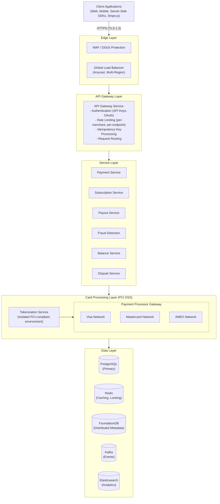
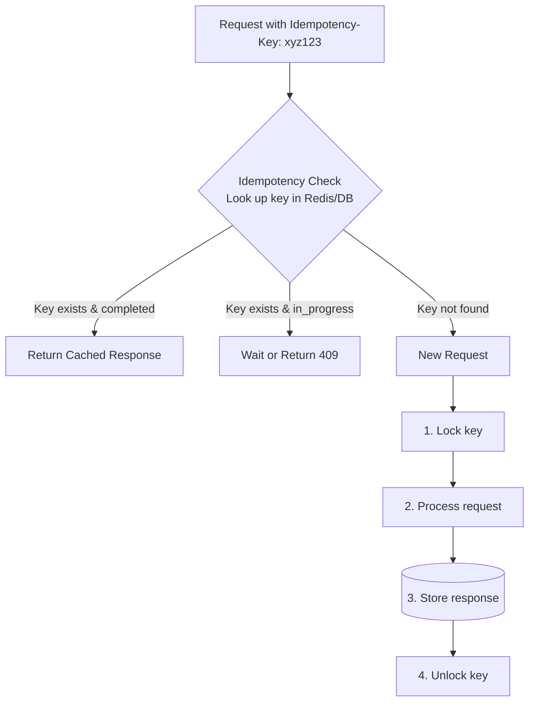
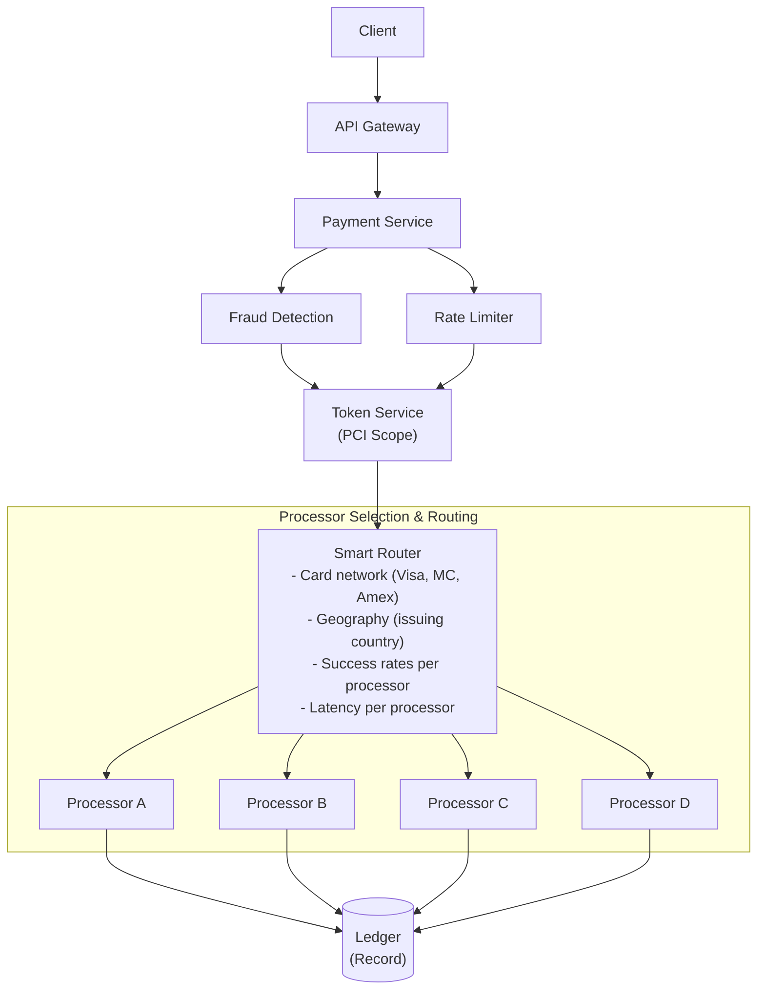

# Stripe System Design

## TL;DR

Stripe processes hundreds of billions of dollars annually with 99.999% uptime. The architecture centers on: **idempotency keys** for exactly-once payment processing, **double-entry bookkeeping** for financial accuracy, **request hedging** across multiple providers, **PCI DSS compliant infrastructure** isolation, and **rate limiting** with tenant fairness. Key insight: financial systems require correctness over availability - failed payments must never result in double charges or lost money.

---

## Core Requirements

### Functional Requirements
1. **Payment processing** - Charge credit cards, bank transfers, digital wallets
2. **Multi-currency** - Support 135+ currencies with conversion
3. **Subscriptions** - Recurring billing with proration
4. **Payouts** - Transfer funds to merchants
5. **Disputes** - Handle chargebacks and refunds
6. **Reporting** - Real-time dashboards and reconciliation

### Non-Functional Requirements
1. **Consistency** - Never double-charge, never lose money
2. **Availability** - 99.999% uptime (~5 minutes downtime/year)
3. **Latency** - Payment authorization < 2 seconds
4. **Security** - PCI DSS Level 1 compliance
5. **Auditability** - Complete transaction history

---

## High-Level Architecture



---

## Idempotency System



### Idempotency Implementation

```ruby
require "json"
require "digest"
require "securerandom"

module IdempotencyStatus
  STARTED   = "started"
  COMPLETED = "completed"
  FAILED    = "failed"
end

IdempotencyRecord = Struct.new(
  :key, :merchant_id, :status, :request_hash,
  :response, :created_at, :locked_until,
  keyword_init: true
)

# Ensures exactly-once processing for payment operations.
# Uses distributed locking with careful handling of edge cases.
class IdempotencyService
  LOCK_TIMEOUT = 60        # seconds
  KEY_EXPIRY   = 24 * 3600 # 24 hours

  def initialize(redis:, db:)
    @redis = redis
    @db    = db
  end

  # Execute the given block with idempotency guarantees.
  # Returns cached result if key was previously processed.
  def process_with_idempotency(idempotency_key:, merchant_id:, request_params:, &processor_fn)
    request_hash = compute_hash(request_params)

    existing = get_idempotency_record(idempotency_key, merchant_id)

    if existing
      return handle_existing_key(existing, request_hash, &processor_fn)
    end

    unless acquire_lock(idempotency_key, merchant_id, request_hash)
      raise ConcurrentRequestError, "Another request with this idempotency key is in progress"
    end

    begin
      result = processor_fn.call

      store_completed_result(idempotency_key, merchant_id, request_hash, result)

      result
    rescue => e
      if should_store_failure?(e)
        store_failed_result(idempotency_key, merchant_id, request_hash, e)
      else
        release_lock(idempotency_key, merchant_id)
      end

      raise
    end
  end

  private

  # Handle request with existing idempotency key
  def handle_existing_key(record, request_hash, &processor_fn)
    if record.request_hash != request_hash
      raise IdempotencyMismatchError, "Request parameters differ from original request"
    end

    case record.status
    when IdempotencyStatus::COMPLETED
      record.response
    when IdempotencyStatus::FAILED
      raise CachedFailureError, record.response["error"]
    when IdempotencyStatus::STARTED
      if record.locked_until && Time.now.to_f > record.locked_until
        retry_processing(record, &processor_fn)
      else
        raise ConcurrentRequestError, "Request is still being processed"
      end
    end
  end

  # Acquire distributed lock for idempotency key.
  # Uses INSERT ... ON CONFLICT DO NOTHING to avoid TOCTOU races.
  def acquire_lock(key, merchant_id, request_hash)
    lock_key      = "idem_lock:#{merchant_id}:#{key}"
    locked_until  = Time.now.to_f + LOCK_TIMEOUT

    acquired = @redis.set(
      lock_key,
      JSON.generate(locked_until: locked_until, request_hash: request_hash),
      nx: true,
      ex: LOCK_TIMEOUT
    )

    if acquired
      # Atomic insert — ON CONFLICT DO NOTHING prevents duplicate key races
      @db.exec_query(<<~SQL, [key, merchant_id, IdempotencyStatus::STARTED, request_hash, locked_until])
        INSERT INTO idempotency_keys (key, merchant_id, status, request_hash, locked_until, created_at)
        VALUES ($1, $2, $3, $4, $5, NOW())
        ON CONFLICT (merchant_id, key) DO NOTHING
      SQL
    end

    acquired
  end

  # Store successful result for future idempotent requests
  def store_completed_result(key, merchant_id, request_hash, result)
    @db.exec_query(<<~SQL, [IdempotencyStatus::COMPLETED, JSON.generate(result), key, merchant_id])
      UPDATE idempotency_keys
      SET status = $1, response = $2, locked_until = NULL
      WHERE key = $3 AND merchant_id = $4
    SQL

    @redis.del("idem_lock:#{merchant_id}:#{key}")

    @redis.setex(
      "idem_result:#{merchant_id}:#{key}",
      KEY_EXPIRY,
      JSON.generate(status: "completed", request_hash: request_hash, response: result)
    )
  end

  # Compute deterministic hash of request parameters
  def compute_hash(params)
    canonical = JSON.generate(params.sort_by { |k, _| k.to_s }.to_h)
    Digest::SHA256.hexdigest(canonical)
  end

  # Determine if failure should be cached (non-retryable)
  def should_store_failure?(error)
    [CardDeclinedError, InsufficientFundsError, InvalidCardError, FraudDetectedError].any? do |klass|
      error.is_a?(klass)
    end
  end
end
```

---

## Double-Entry Ledger System

```
┌─────────────────────────────────────────────────────────────────────────┐
│                    Double-Entry Bookkeeping                              │
│                                                                          │
│   Every transaction creates balanced debit and credit entries           │
│                                                                          │
│   Example: $100 payment from Customer → Merchant                        │
│                                                                          │
│   ┌─────────────────────────────────────────────────────────────────┐   │
│   │  Entry 1: Debit Customer Card Account         $100.00          │   │
│   │  Entry 2: Credit Stripe Pending Balance       $100.00          │   │
│   └─────────────────────────────────────────────────────────────────┘   │
│                              │                                          │
│                              ▼ (After settlement)                       │
│   ┌─────────────────────────────────────────────────────────────────┐   │
│   │  Entry 3: Debit Stripe Pending Balance        $100.00          │   │
│   │  Entry 4: Credit Stripe Revenue (2.9%)          $2.90          │   │
│   │  Entry 5: Credit Merchant Balance              $97.10          │   │
│   └─────────────────────────────────────────────────────────────────┘   │
│                                                                          │
│   Invariant: SUM(debits) = SUM(credits) = 0 always                      │
└─────────────────────────────────────────────────────────────────────────┘
```

### Ledger Implementation

```ruby
require "bigdecimal"
require "securerandom"
require "json"

module AccountType
  ASSET     = "asset"
  LIABILITY = "liability"
  EQUITY    = "equity"
  REVENUE   = "revenue"
  EXPENSE   = "expense"
end

module EntryType
  DEBIT  = "debit"
  CREDIT = "credit"
end

LedgerEntry = Struct.new(
  :id, :transaction_id, :account_id, :entry_type,
  :amount, :currency, :created_at, :metadata,
  keyword_init: true
)

LedgerTransaction = Struct.new(
  :id, :entries, :description, :idempotency_key, :created_at,
  keyword_init: true
)

# Double-entry bookkeeping system for financial transactions.
# Guarantees that debits always equal credits.
class LedgerService
  def initialize(db:, event_publisher:)
    @db     = db
    @events = event_publisher
  end

  # Create a balanced transaction with multiple entries.
  # All entries must sum to zero (debits = credits).
  def create_transaction(entries:, description:, idempotency_key: nil)
    validate_balance!(entries)

    transaction_id = SecureRandom.uuid

    ledger_entries = []

    ActiveRecord::Base.transaction do
      if idempotency_key
        existing = @db.select_one(<<~SQL, [idempotency_key])
          SELECT id FROM ledger_transactions WHERE idempotency_key = $1
        SQL
        return get_transaction(existing["id"]) if existing
      end

      @db.execute(<<~SQL, [transaction_id, description, idempotency_key])
        INSERT INTO ledger_transactions (id, description, idempotency_key, created_at)
        VALUES ($1, $2, $3, NOW())
      SQL

      entries.each do |entry|
        entry_id = SecureRandom.uuid
        account  = get_account(entry[:account_id])

        @db.execute(<<~SQL, [entry_id, transaction_id, entry[:account_id], entry[:entry_type], entry[:amount].to_s, entry[:currency], JSON.generate(entry.fetch(:metadata, {}))])
          INSERT INTO ledger_entries (id, transaction_id, account_id, entry_type, amount, currency, metadata, created_at)
          VALUES ($1, $2, $3, $4, $5, $6, $7, NOW())
        SQL

        update_account_balance(entry[:account_id], entry[:entry_type], entry[:amount], entry[:currency])

        ledger_entries << LedgerEntry.new(
          id: entry_id,
          transaction_id: transaction_id,
          account_id: entry[:account_id],
          entry_type: entry[:entry_type],
          amount: entry[:amount],
          currency: entry[:currency],
          created_at: Time.now.utc,
          metadata: entry.fetch(:metadata, {})
        )
      end
    end

    transaction = LedgerTransaction.new(
      id: transaction_id,
      entries: ledger_entries,
      description: description,
      idempotency_key: idempotency_key,
      created_at: Time.now.utc
    )

    debit_total = entries
      .select { |e| e[:entry_type] == EntryType::DEBIT }
      .sum { |e| e[:amount] }

    @events.publish("ledger.transaction.created", {
      transaction_id: transaction_id,
      entry_count: entries.size,
      total_amount: debit_total.to_s
    })

    transaction
  end

  private

  # Ensure debits equal credits for each currency
  def validate_balance!(entries)
    by_currency = Hash.new { |h, k| h[k] = { debit: BigDecimal("0"), credit: BigDecimal("0") } }

    entries.each do |entry|
      side = entry[:entry_type] == EntryType::DEBIT ? :debit : :credit
      by_currency[entry[:currency]][side] += entry[:amount]
    end

    by_currency.each do |currency, balances|
      if balances[:debit] != balances[:credit]
        raise UnbalancedTransactionError,
          "Transaction not balanced for #{currency}: debit=#{balances[:debit]}, credit=#{balances[:credit]}"
      end
    end
  end

  # Update account balance based on entry type and account type.
  # Assets/Expenses: Debit increases, Credit decreases.
  # Liabilities/Equity/Revenue: Credit increases, Debit decreases.
  def update_account_balance(account_id, entry_type, amount, currency)
    account = get_account(account_id)

    delta = if [AccountType::ASSET, AccountType::EXPENSE].include?(account.account_type)
              entry_type == EntryType::DEBIT ? amount : -amount
            else
              entry_type == EntryType::CREDIT ? amount : -amount
            end

    @db.execute(<<~SQL, [account_id, currency, delta.to_s])
      INSERT INTO account_balances (account_id, currency, balance)
      VALUES ($1, $2, $3)
      ON CONFLICT (account_id, currency)
      DO UPDATE SET balance = account_balances.balance + $3
    SQL
  end
end

# High-level payment operations using double-entry ledger
class PaymentLedger
  def initialize(ledger_service:, account_service:)
    @ledger   = ledger_service
    @accounts = account_service
  end

  # Record a successful payment charge
  def record_successful_charge(payment_id:, merchant_id:, customer_id:, amount:, currency:, fee_amount:)
    customer_account = @accounts.get_customer_card_account(customer_id)
    stripe_pending   = @accounts.get_stripe_pending_account
    stripe_revenue   = @accounts.get_stripe_revenue_account

    net_amount = amount - fee_amount

    entries = [
      { account_id: customer_account.id, entry_type: EntryType::DEBIT,
        amount: amount, currency: currency, metadata: { payment_id: payment_id } },
      { account_id: stripe_pending.id, entry_type: EntryType::CREDIT,
        amount: net_amount, currency: currency, metadata: { payment_id: payment_id, merchant_id: merchant_id } },
      { account_id: stripe_revenue.id, entry_type: EntryType::CREDIT,
        amount: fee_amount, currency: currency, metadata: { payment_id: payment_id, fee_type: "processing" } }
    ]

    @ledger.create_transaction(
      entries: entries,
      description: "Payment #{payment_id} from customer #{customer_id}",
      idempotency_key: "charge:#{payment_id}"
    )
  end

  # Record payout from Stripe to merchant bank account
  def record_payout(payout_id:, merchant_id:, amount:, currency:)
    merchant_balance = @accounts.get_merchant_balance_account(merchant_id)
    stripe_bank      = @accounts.get_stripe_bank_account(currency)

    entries = [
      { account_id: merchant_balance.id, entry_type: EntryType::DEBIT,
        amount: amount, currency: currency, metadata: { payout_id: payout_id } },
      { account_id: stripe_bank.id, entry_type: EntryType::CREDIT,
        amount: amount, currency: currency, metadata: { payout_id: payout_id } }
    ]

    @ledger.create_transaction(
      entries: entries,
      description: "Payout #{payout_id} to merchant #{merchant_id}",
      idempotency_key: "payout:#{payout_id}"
    )
  end
end
```

---

## Payment Processing Flow



### Payment Service Implementation

```ruby
require "bigdecimal"
require "securerandom"
require "concurrent"

module PaymentStatus
  PENDING         = "pending"
  REQUIRES_ACTION = "requires_action" # 3DS, etc.
  PROCESSING      = "processing"
  SUCCEEDED       = "succeeded"
  FAILED          = "failed"
  CANCELED        = "canceled"
end

PaymentIntent = Struct.new(
  :id, :merchant_id, :amount, :currency, :status,
  :payment_method_id, :customer_id, :metadata, :created_at,
  keyword_init: true
)

ProcessorResponse = Struct.new(
  :success, :processor, :authorization_code,
  :decline_code, :error_message, :latency_ms,
  keyword_init: true
)

# Orchestrates payment processing with multiple processors.
# Implements hedging, retries, and smart routing.
class PaymentService
  def initialize(db:, token_service:, fraud_service:, router:, ledger:, idempotency_service:)
    @db          = db
    @tokens      = token_service
    @fraud       = fraud_service
    @router      = router
    @ledger      = ledger
    @idempotency = idempotency_service
  end

  # Create a new payment intent
  def create_payment_intent(merchant_id:, amount:, currency:, payment_method_id: nil, customer_id: nil, metadata: nil, idempotency_key: nil)
    creator = proc do
      intent_id = "pi_#{SecureRandom.hex}"

      intent = PaymentIntent.new(
        id: intent_id,
        merchant_id: merchant_id,
        amount: amount,
        currency: currency,
        status: PaymentStatus::PENDING,
        payment_method_id: payment_method_id,
        customer_id: customer_id,
        metadata: metadata || {},
        created_at: Time.now.utc
      )

      save_payment_intent(intent)
      intent
    end

    if idempotency_key
      @idempotency.process_with_idempotency(
        idempotency_key: idempotency_key,
        merchant_id: merchant_id,
        request_params: { amount: amount.to_s, currency: currency, payment_method_id: payment_method_id },
        &creator
      )
    else
      creator.call
    end
  end

  # Confirm and process a payment intent
  def confirm_payment_intent(intent_id:, payment_method_id: nil, idempotency_key: nil)
    confirmer = proc do
      intent = get_payment_intent(intent_id)

      unless [PaymentStatus::PENDING, PaymentStatus::REQUIRES_ACTION].include?(intent.status)
        raise InvalidStateError, "Cannot confirm intent in #{intent.status} state"
      end

      pm_id = payment_method_id || intent.payment_method_id
      raise ValidationError, "Payment method required" unless pm_id

      update_intent_status(intent_id, PaymentStatus::PROCESSING)

      begin
        fraud_result = @fraud.evaluate(
          merchant_id: intent.merchant_id,
          amount: intent.amount,
          currency: intent.currency,
          payment_method_id: pm_id,
          customer_id: intent.customer_id
        )

        if fraud_result.block
          fail_payment(intent_id, "blocked_by_fraud_check")
          raise FraudDetectedError, "Payment blocked"
        end

        card_details = @tokens.get_card_details(pm_id)

        result = process_payment(
          intent: intent,
          card_details: card_details,
          fraud_score: fraud_result.score
        )

        if result.success
          fee = calculate_fee(intent.amount, intent.currency)
          @ledger.record_successful_charge(
            payment_id: intent_id,
            merchant_id: intent.merchant_id,
            customer_id: intent.customer_id,
            amount: intent.amount,
            currency: intent.currency,
            fee_amount: fee
          )

          intent.status = PaymentStatus::SUCCEEDED
          update_intent_status(intent_id, PaymentStatus::SUCCEEDED)
        else
          intent.status = PaymentStatus::FAILED
          fail_payment(intent_id, result.decline_code)
        end

        intent
      rescue => e
        fail_payment(intent_id, e.message)
        raise
      end
    end

    if idempotency_key
      @idempotency.process_with_idempotency(
        idempotency_key: idempotency_key,
        merchant_id: get_payment_intent(intent_id).merchant_id,
        request_params: { intent_id: intent_id, payment_method_id: payment_method_id },
        &confirmer
      )
    else
      confirmer.call
    end
  end

  private

  # Process payment with smart routing and hedging.
  # May send to multiple processors for redundancy.
  def process_payment(intent:, card_details:, fraud_score:)
    processors = @router.get_processors(
      card_network: card_details["network"],
      issuing_country: card_details["issuing_country"],
      amount: intent.amount,
      currency: intent.currency
    )

    should_hedge = intent.amount > 1000 &&
                   fraud_score < 0.3 &&
                   processors.size >= 2

    if should_hedge
      process_with_hedging(intent, card_details, processors.first(2))
    else
      process_sequential(intent, card_details, processors)
    end
  end

  # Send to multiple processors simultaneously.
  # Use first successful response, cancel others.
  def process_with_hedging(intent, card_details, processors)
    futures = processors.map do |processor|
      Concurrent::Future.execute do
        call_processor(processor, intent, card_details)
      end
    end

    result = nil
    futures.each do |future|
      future.wait
      if future.fulfilled? && future.value.success
        result = future.value
        void_other_authorizations_async(intent.id, result.processor)
        break
      end
    end

    result || futures.last.value
  end

  # Try processors sequentially until one succeeds.
  # Used for lower-value or higher-risk transactions.
  def process_sequential(intent, card_details, processors)
    last_result = nil

    processors.each do |processor|
      result = call_processor(processor, intent, card_details)
      return result if result.success
      return result if %w[do_not_retry fraud lost_card].include?(result.decline_code)

      last_result = result
    end

    last_result
  end
end

# Routes payments to optimal processor based on
# success rates, latency, and cost.
class SmartRouter
  def initialize(metrics:, redis:)
    @metrics = metrics
    @redis   = redis
  end

  # Get ranked list of processors for this payment
  def get_processors(card_network:, issuing_country:, amount:, currency:)
    all_processors = get_eligible_processors(card_network, currency)

    scored = all_processors.map do |processor|
      score = score_processor(processor, card_network, issuing_country, currency)
      [processor, score]
    end

    scored.sort_by { |_, s| -s }.map(&:first)
  end

  private

  # Score processor based on:
  # - Historical success rate
  # - Recent success rate (last hour)
  # - Latency
  # - Cost
  def score_processor(processor, card_network, issuing_country, _currency)
    key     = "processor_metrics:#{processor}:#{card_network}:#{issuing_country}"
    metrics = @redis.hgetall(key)

    return 0.5 if metrics.empty?

    success_rate     = metrics.fetch("success_rate", "0.95").to_f
    success_score    = success_rate * 0.4

    recent_rate      = metrics.fetch("success_rate_1h", "0.95").to_f
    recent_score     = recent_rate * 0.3

    avg_latency      = metrics.fetch("avg_latency_ms", "500").to_f
    latency_score    = [0, (1000 - avg_latency) / 1000].max * 0.2

    cost_bps         = metrics.fetch("cost_bps", "20").to_f
    cost_score       = [0, (50 - cost_bps) / 50].max * 0.1

    success_score + recent_score + latency_score + cost_score
  end
end
```

---

## Rate Limiting with Fairness

```ruby
RateLimitConfig = Struct.new(:requests_per_second, :burst_size, :enforce_fairness, keyword_init: true) do
  def initialize(requests_per_second:, burst_size:, enforce_fairness: true)
    super
  end
end

RateLimitResult = Struct.new(:allowed, :remaining, :reset_at, :retry_after, keyword_init: true)

# Token bucket rate limiter with tenant fairness.
# Prevents one merchant from consuming all capacity.
class TokenBucketRateLimiter
  GLOBAL_LIMIT = 100_000 # requests per second

  TOKEN_BUCKET_SCRIPT = <<~LUA
    local key = KEYS[1]
    local max_tokens = tonumber(ARGV[1])
    local refill_rate = tonumber(ARGV[2])
    local cost = tonumber(ARGV[3])
    local now = tonumber(ARGV[4])

    local bucket = redis.call('HMGET', key, 'tokens', 'last_update')
    local tokens = tonumber(bucket[1]) or max_tokens
    local last_update = tonumber(bucket[2]) or now

    -- Refill based on time elapsed
    local elapsed = now - last_update
    local refill = elapsed * refill_rate
    tokens = math.min(max_tokens, tokens + refill)

    local allowed = 0
    local remaining = tokens

    if tokens >= cost then
        tokens = tokens - cost
        allowed = 1
        remaining = tokens
    end

    redis.call('HMSET', key, 'tokens', tokens, 'last_update', now)
    redis.call('EXPIRE', key, 3600)  -- Clean up after 1 hour

    return {allowed, remaining}
  LUA

  def initialize(redis:, config:)
    @redis  = redis
    @config = config
  end

  # Check if request is allowed under rate limits.
  # Uses multi-level limiting: global, per-merchant, per-endpoint.
  def check_rate_limit(merchant_id:, endpoint:, cost: 1)
    now = Time.now.to_f

    endpoint_config = @config.fetch(endpoint) do
      RateLimitConfig.new(requests_per_second: 100, burst_size: 200)
    end

    global_result = check_bucket(
      key: "rate:global",
      max_tokens: GLOBAL_LIMIT,
      refill_rate: GLOBAL_LIMIT,
      cost: cost,
      now: now
    )
    return global_result unless global_result.allowed

    merchant_result = check_bucket(
      key: "rate:merchant:#{merchant_id}",
      max_tokens: endpoint_config.burst_size,
      refill_rate: endpoint_config.requests_per_second,
      cost: cost,
      now: now
    )
    return merchant_result unless merchant_result.allowed

    check_bucket(
      key: "rate:merchant:#{merchant_id}:#{endpoint}",
      max_tokens: endpoint_config.burst_size / 2,
      refill_rate: endpoint_config.requests_per_second / 2,
      cost: cost,
      now: now
    )
  end

  private

  # Atomic token bucket check using Redis Lua script.
  # Refills tokens based on time elapsed.
  def check_bucket(key:, max_tokens:, refill_rate:, cost:, now:)
    result = @redis.call(:eval, TOKEN_BUCKET_SCRIPT, keys: [key], argv: [max_tokens, refill_rate, cost, now])

    allowed   = result[0] == 1
    remaining = result[1].to_i

    retry_after = allowed ? nil : (cost - remaining).to_f / refill_rate

    RateLimitResult.new(
      allowed: allowed,
      remaining: remaining,
      reset_at: now + (max_tokens - remaining).to_f / refill_rate,
      retry_after: retry_after
    )
  end
end

# Adaptive rate limiting that adjusts based on
# system load and error rates.
class AdaptiveRateLimiter
  LOAD_THRESHOLD  = 0.8  # Start throttling at 80% capacity
  ERROR_THRESHOLD = 0.05 # Start throttling at 5% error rate

  def initialize(base_limiter:, metrics:)
    @base    = base_limiter
    @metrics = metrics
  end

  # Check rate limit with adaptive adjustments
  def check_rate_limit(merchant_id:, endpoint:, cost: 1)
    load       = @metrics.get_current_load
    error_rate = @metrics.get_error_rate_1m

    factor        = calculate_factor(load, error_rate)
    adjusted_cost = factor < 1 ? (cost / factor).to_i : cost

    @base.check_rate_limit(merchant_id: merchant_id, endpoint: endpoint, cost: adjusted_cost)
  end

  private

  # Calculate rate limit adjustment factor.
  # < 1.0 means we are under stress, reduce limits.
  def calculate_factor(load, error_rate)
    load_factor = if load > LOAD_THRESHOLD
                    1 - ((load - LOAD_THRESHOLD) / (1 - LOAD_THRESHOLD))
                  else
                    1.0
                  end

    error_factor = if error_rate > ERROR_THRESHOLD
                     1 - ((error_rate - ERROR_THRESHOLD) / (1 - ERROR_THRESHOLD))
                   else
                     1.0
                   end

    [load_factor, error_factor].min
  end
end
```

---

## Webhook Delivery System

```ruby
require "openssl"
require "json"
require "securerandom"
require "net/http"

WebhookEndpoint = Struct.new(:id, :merchant_id, :url, :events, :secret, :enabled, keyword_init: true)
WebhookEvent    = Struct.new(:id, :type, :data, :created_at, keyword_init: true)
WebhookDelivery = Struct.new(:id, :endpoint_id, :event_id, :attempt, :status_code, :response_body, :delivered_at, keyword_init: true)

# Reliable webhook delivery with retries and signatures.
# Guarantees at-least-once delivery.
class WebhookService
  # Retry schedule (exponential backoff)
  RETRY_DELAYS = [
    0,      # Immediate
    60,     # 1 minute
    300,    # 5 minutes
    3600,   # 1 hour
    7200,   # 2 hours
    14400,  # 4 hours
    28800,  # 8 hours
    43200   # 12 hours
  ].freeze

  MAX_ATTEMPTS = RETRY_DELAYS.size

  def initialize(db:, http_client:)
    @db   = db
    @http = http_client
  end

  # Trigger webhook event for a merchant
  def trigger_event(event_type:, data:, merchant_id:)
    event = WebhookEvent.new(
      id: "evt_#{SecureRandom.hex}",
      type: event_type,
      data: data,
      created_at: Time.now.to_f
    )

    save_event(event, merchant_id)

    endpoints = get_endpoints(merchant_id, event_type)

    endpoints.each do |endpoint|
      WebhookDeliveryWorker.perform_async(event.id, endpoint.id, 1)
    end
  end
end

# Sidekiq worker for async webhook delivery with retries
class WebhookDeliveryWorker
  include Sidekiq::Worker

  sidekiq_options queue: "webhook_deliveries", retry: false

  def perform(event_id, endpoint_id, attempt)
    event    = find_event(event_id)
    endpoint = find_endpoint(endpoint_id)
    return unless endpoint.enabled

    payload = {
      id: event.id,
      type: event.type,
      data: event.data,
      created: event.created_at,
      api_version: "2023-10-16"
    }

    signature = sign_payload(payload, endpoint.secret)

    begin
      start_time = Time.now.to_f

      response = deliver(
        url: endpoint.url,
        payload: payload,
        signature: signature
      )

      save_delivery(WebhookDelivery.new(
        id: "whd_#{SecureRandom.hex}",
        endpoint_id: endpoint.id,
        event_id: event.id,
        attempt: attempt,
        status_code: response.code.to_i,
        response_body: response.body&.slice(0, 1000),
        delivered_at: Time.now.to_f
      ))

      return if (200...300).cover?(response.code.to_i)

      schedule_retry(event.id, endpoint.id, attempt + 1)
    rescue StandardError => e
      save_delivery(WebhookDelivery.new(
        id: "whd_#{SecureRandom.hex}",
        endpoint_id: endpoint.id,
        event_id: event.id,
        attempt: attempt,
        status_code: nil,
        response_body: e.message.slice(0, 1000),
        delivered_at: nil
      ))

      schedule_retry(event.id, endpoint.id, attempt + 1)
    end
  end

  private

  # Schedule retry with exponential backoff
  def schedule_retry(event_id, endpoint_id, attempt)
    if attempt > WebhookService::MAX_ATTEMPTS
      mark_permanently_failed(event_id, endpoint_id)
      return
    end

    delay = WebhookService::RETRY_DELAYS[attempt - 1]
    WebhookDeliveryWorker.perform_in(delay, event_id, endpoint_id, attempt)
  end

  # Generate Stripe signature for payload.
  # Format: t={timestamp},v1={signature}
  def sign_payload(payload, secret)
    timestamp   = Time.now.to_i
    payload_str = JSON.generate(payload, space: nil)
    signed_data = "#{timestamp}.#{payload_str}"

    signature = OpenSSL::HMAC.hexdigest("SHA256", secret, signed_data)

    "t=#{timestamp},v1=#{signature}"
  end

  def deliver(url:, payload:, signature:)
    uri = URI(url)
    req = Net::HTTP::Post.new(uri)
    req["Content-Type"]    = "application/json"
    req["Stripe-Signature"] = signature
    req["User-Agent"]       = "Stripe/1.0"
    req.body = JSON.generate(payload)

    Net::HTTP.start(uri.hostname, uri.port, use_ssl: uri.scheme == "https", read_timeout: 30) do |http|
      http.request(req)
    end
  end
end
```

---

## Key Metrics & Scale

| Metric | Value |
|--------|-------|
| **Transaction Volume** | Hundreds of billions USD/year |
| **API Requests** | Billions per day |
| **Uptime** | 99.999% (5 nines) |
| **Payment Authorization** | < 2 seconds |
| **Merchants** | Millions globally |
| **Currencies Supported** | 135+ |
| **Countries** | 46+ |
| **Webhook Delivery Rate** | > 99.99% success |
| **Card Networks** | 20+ |
| **Fraud Detection Accuracy** | > 99% |

---

## Key Takeaways

1. **Idempotency is foundational** - Every mutating operation uses idempotency keys. Prevents double charges from retries, network issues, or bugs.

2. **Double-entry ledger** - All financial movements recorded as balanced debit/credit entries. Provides auditability and prevents money from being "lost."

3. **Smart routing with hedging** - Route to optimal processor based on success rates. For high-value payments, hedge across multiple processors for reliability.

4. **PCI isolation** - Card data handling in separate, heavily audited PCI-compliant infrastructure. Main systems never see raw card numbers.

5. **Multi-level rate limiting** - Global, per-merchant, and per-endpoint limits with fairness guarantees. Adaptive throttling based on system health.

6. **Consistent webhooks** - At-least-once delivery with signatures for verification. Exponential backoff with multiple retry attempts over hours.

7. **Optimistic locking for balances** - Use database transactions with version checks rather than distributed locks where possible.

8. **Correctness over availability** - Unlike typical web services, financial systems must never produce incorrect results. Better to fail than to double-charge.

---

## Production Insights

### Monolith-to-Services Journey

Stripe famously ran its core API as a large Ruby monolith for years. Rather than
pursuing a big-bang rewrite, engineering teams extracted services incrementally:

- **API layer** remains a Ruby monolith backed by Sinatra/custom framework, serving
  as the single entry point for all merchant requests. This "monolith as API gateway"
  pattern keeps routing logic centralized while downstream services own domain logic.
- **Payment processing**, **ledger**, and **risk evaluation** were the first workloads
  extracted into dedicated services, each backed by its own PostgreSQL cluster.
- Inter-service communication uses a combination of synchronous gRPC for latency-
  sensitive paths (auth/capture) and asynchronous message passing through a custom
  event bus for settlement, reconciliation, and reporting pipelines.
- Database migrations followed a strangler-fig approach: shadow-write to the new
  service database, validate consistency, then cut reads over. Rollback remained
  possible at every step because the monolith kept its own copy until parity was
  proven over multiple billing cycles.

### Sorbet Type Checker Adoption

Stripe co-developed Sorbet, a gradual type checker for Ruby, to address the
reliability gap inherent in a dynamically typed codebase at scale:

- Sorbet performs static analysis at development time and enforces runtime type
  contracts via `T.let`, `T.sig`, and `T::Struct` annotations. This catches
  entire categories of nil-related errors before deployment.
- Adoption was incremental: teams started by annotating public API boundaries
  (`sig` on controller actions and service interfaces) then expanded coverage
  inward. A `typed: strict` file-level directive gates enforcement per-file,
  allowing gradual rollout across millions of lines.
- Internal metrics showed a measurable reduction in production type-related
  incidents after reaching ~80% signature coverage on critical payment paths.
- Sorbet's speed (type-checking millions of lines in seconds) makes it viable
  as a pre-commit hook and CI gate without degrading developer velocity.

### Radar Fraud ML in <100ms

Stripe Radar evaluates fraud risk on every payment intent confirmation. The
system must return a score within the payment authorization latency budget:

- Feature extraction pulls from historical transaction graphs, device
  fingerprints, behavioral signals, and network-level metadata. Pre-computed
  feature stores in Redis keep hot-path lookups under 5ms.
- Model inference runs on a dedicated serving tier using an ensemble of gradient-
  boosted trees and neural embeddings. The p99 inference latency target is 50ms,
  leaving headroom within the overall 2-second authorization SLA.
- Models retrain continuously on labeled chargeback/dispute outcomes with a
  feedback loop lag of hours (not days), allowing Radar to adapt to emerging
  fraud vectors within a single business day.
- Merchant-specific overrides and custom rules layer on top of ML scores,
  evaluated as a lightweight rules engine in the same request path to avoid
  an additional network hop.
