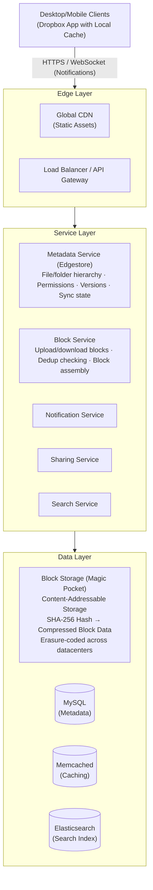
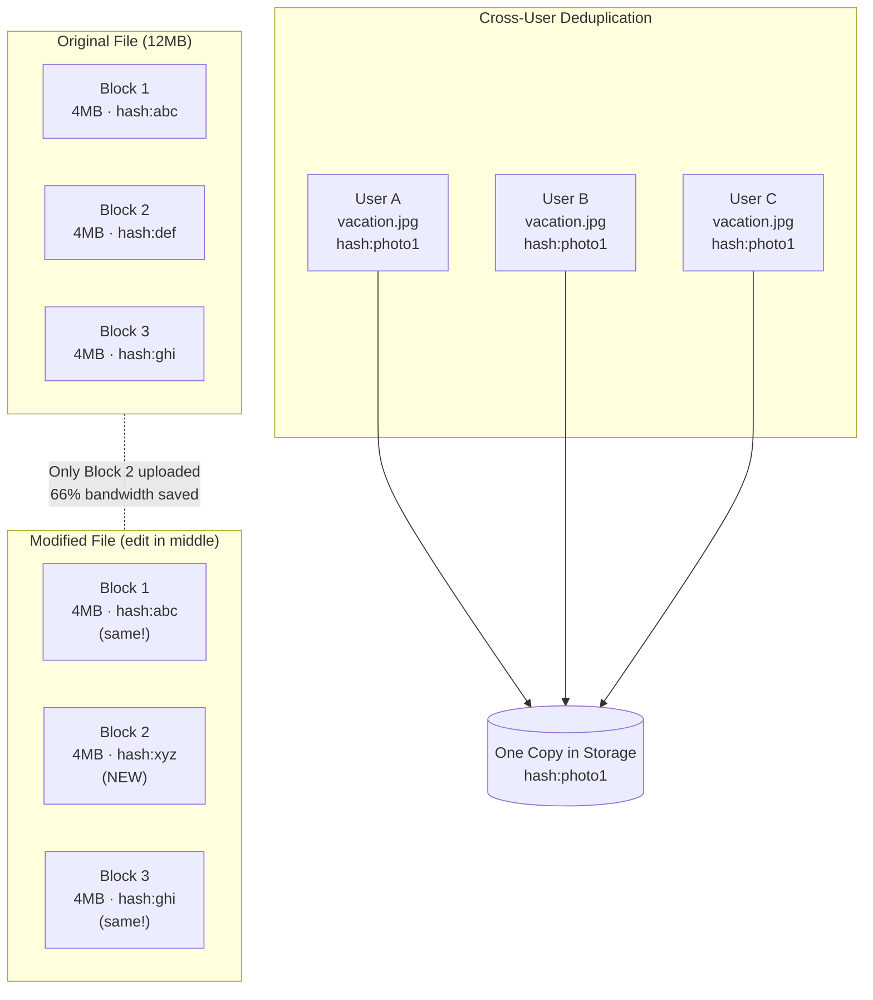
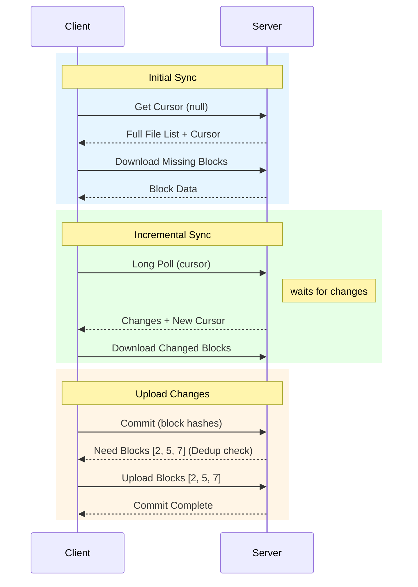
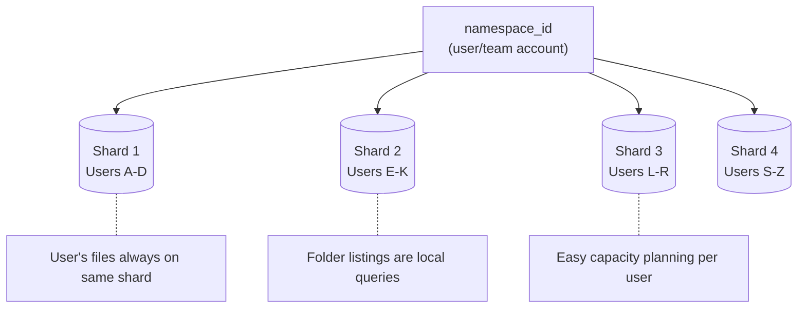

# Dropbox System Design

## TL;DR

Dropbox syncs files across 700M+ registered users with petabytes of storage. The architecture centers on: **block-level deduplication** storing unique 4MB blocks once, **content-addressable storage** using SHA-256 hashes, **sync protocol** with delta compression for efficient updates, **metadata service** tracking file trees separately from content, and **selective sync** for large folders. Key insight: most files are duplicates or small changes - dedupe at the block level achieves 60%+ storage savings.

---

## Core Requirements

### Functional Requirements
1. **File upload/download** - Store and retrieve files of any size
2. **Automatic sync** - Keep files synchronized across devices
3. **Sharing** - Share files and folders with permissions
4. **Version history** - Track and restore previous versions
5. **Conflict resolution** - Handle simultaneous edits
6. **Selective sync** - Choose which folders to sync locally

### Non-Functional Requirements
1. **Reliability** - 99.999% durability (never lose files)
2. **Consistency** - Strong consistency for metadata
3. **Efficiency** - Minimize bandwidth and storage
4. **Latency** - Near-instant sync for small changes
5. **Scale** - Billions of files, petabytes of data

---

## High-Level Architecture



---

## Block-Level Storage & Deduplication



### Block Service Implementation

```python
from dataclasses import dataclass
from typing import List, Optional, Tuple
import hashlib
import zlib
from enum import Enum

@dataclass
class Block:
    hash: str  # SHA-256 of content
    size: int
    compressed_size: int
    ref_count: int  # Number of files referencing this block

@dataclass
class FileManifest:
    file_id: str
    namespace_id: str  # User/team account
    path: str
    size: int
    block_hashes: List[str]
    version: int
    modified_at: float


class BlockService:
    """
    Content-addressable block storage with deduplication.
    Blocks are immutable and identified by their SHA-256 hash.
    """
    
    BLOCK_SIZE = 4 * 1024 * 1024  # 4MB blocks
    
    def __init__(self, storage_client, db_client, cache_client):
        self.storage = storage_client  # Magic Pocket or S3
        self.db = db_client
        self.cache = cache_client
    
    async def upload_file(
        self,
        namespace_id: str,
        path: str,
        file_stream,
        expected_size: int
    ) -> FileManifest:
        """
        Upload file in blocks with deduplication.
        Only uploads blocks that don't already exist.
        """
        block_hashes = []
        blocks_to_upload = []
        
        # Split into blocks and hash
        while True:
            chunk = await file_stream.read(self.BLOCK_SIZE)
            if not chunk:
                break
            
            # Compute hash
            block_hash = self._compute_hash(chunk)
            block_hashes.append(block_hash)
            
            # Check if block exists
            exists = await self._block_exists(block_hash)
            
            if not exists:
                # Compress and queue for upload
                compressed = zlib.compress(chunk, level=6)
                blocks_to_upload.append((block_hash, compressed, len(chunk)))
        
        # Upload new blocks in parallel
        if blocks_to_upload:
            await self._upload_blocks(blocks_to_upload)
        
        # Increment reference counts
        await self._increment_refs(block_hashes)
        
        # Create file manifest
        manifest = FileManifest(
            file_id=str(uuid.uuid4()),
            namespace_id=namespace_id,
            path=path,
            size=expected_size,
            block_hashes=block_hashes,
            version=1,
            modified_at=time.time()
        )
        
        return manifest
    
    async def download_file(
        self,
        manifest: FileManifest,
        output_stream
    ):
        """Download file by assembling blocks"""
        for block_hash in manifest.block_hashes:
            # Try cache first
            block_data = await self.cache.get(f"block:{block_hash}")
            
            if not block_data:
                # Fetch from storage
                compressed = await self.storage.get(block_hash)
                block_data = zlib.decompress(compressed)
                
                # Cache for future requests
                await self.cache.set(
                    f"block:{block_hash}",
                    block_data,
                    ttl=3600
                )
            
            await output_stream.write(block_data)
    
    async def get_upload_diff(
        self,
        namespace_id: str,
        path: str,
        client_block_hashes: List[str]
    ) -> List[int]:
        """
        Compare client's block list with server.
        Returns indices of blocks that need uploading.
        """
        needed_indices = []
        
        # Batch check existence
        existing = await self._batch_check_exists(client_block_hashes)
        
        for i, (block_hash, exists) in enumerate(zip(client_block_hashes, existing)):
            if not exists:
                needed_indices.append(i)
        
        return needed_indices
    
    async def _block_exists(self, block_hash: str) -> bool:
        """Check if block exists in storage"""
        # Check cache first
        cached = await self.cache.get(f"block_exists:{block_hash}")
        if cached is not None:
            return cached == b"1"
        
        # Check database
        exists = await self.db.fetchone(
            "SELECT 1 FROM blocks WHERE hash = $1",
            block_hash
        )
        
        # Cache result
        await self.cache.set(
            f"block_exists:{block_hash}",
            b"1" if exists else b"0",
            ttl=3600
        )
        
        return exists is not None
    
    async def _upload_blocks(self, blocks: List[Tuple[str, bytes, int]]):
        """Upload multiple blocks in parallel"""
        async def upload_one(block_hash: str, compressed: bytes, original_size: int):
            # Upload to storage
            await self.storage.put(block_hash, compressed)
            
            # Record in database
            await self.db.execute(
                """
                INSERT INTO blocks (hash, size, compressed_size, ref_count, created_at)
                VALUES ($1, $2, $3, 0, NOW())
                ON CONFLICT (hash) DO NOTHING
                """,
                block_hash, original_size, len(compressed)
            )
        
        tasks = [
            upload_one(h, c, s) 
            for h, c, s in blocks
        ]
        await asyncio.gather(*tasks)
    
    async def _increment_refs(self, block_hashes: List[str]):
        """Increment reference count for blocks"""
        # Batch update
        await self.db.execute(
            """
            UPDATE blocks
            SET ref_count = ref_count + 1
            WHERE hash = ANY($1)
            """,
            block_hashes
        )
    
    def _compute_hash(self, data: bytes) -> str:
        """Compute SHA-256 hash of block"""
        return hashlib.sha256(data).hexdigest()


class ContentDefinedChunking:
    """
    Variable-size chunking using Rabin fingerprinting.
    Provides better deduplication for insertions/deletions.
    """
    
    def __init__(
        self,
        min_size: int = 512 * 1024,    # 512KB min
        max_size: int = 8 * 1024 * 1024,  # 8MB max
        avg_size: int = 4 * 1024 * 1024   # 4MB average
    ):
        self.min_size = min_size
        self.max_size = max_size
        self.mask = self._compute_mask(avg_size)
    
    def chunk_file(self, data: bytes) -> List[Tuple[int, int, str]]:
        """
        Split file into variable-size chunks based on content.
        Returns list of (offset, length, hash) tuples.
        """
        chunks = []
        offset = 0
        length = len(data)
        
        while offset < length:
            # Find chunk boundary
            chunk_end = self._find_boundary(data, offset)
            
            chunk_data = data[offset:chunk_end]
            chunk_hash = hashlib.sha256(chunk_data).hexdigest()
            
            chunks.append((offset, len(chunk_data), chunk_hash))
            offset = chunk_end
        
        return chunks
    
    def _find_boundary(self, data: bytes, start: int) -> int:
        """Find chunk boundary using Rabin fingerprint"""
        length = len(data)
        pos = start + self.min_size
        
        if pos >= length:
            return length
        
        # Rolling hash to find boundary
        window = 48  # Sliding window size
        fp = 0  # Fingerprint
        
        while pos < length and pos < start + self.max_size:
            # Update fingerprint
            fp = ((fp << 1) + data[pos]) & 0xFFFFFFFF
            
            if pos >= start + window:
                fp ^= data[pos - window] << window
            
            # Check if boundary (low bits match pattern)
            if (fp & self.mask) == 0:
                return pos + 1
            
            pos += 1
        
        return min(pos, length)
    
    def _compute_mask(self, avg_size: int) -> int:
        """Compute mask for desired average chunk size"""
        bits = (avg_size - 1).bit_length()
        return (1 << bits) - 1
```

---

## Sync Protocol



### Sync Service Implementation

```python
from dataclasses import dataclass
from typing import List, Optional, Dict, Set
from enum import Enum
import asyncio

class ChangeType(Enum):
    ADD = "add"
    MODIFY = "modify"
    DELETE = "delete"
    MOVE = "move"

@dataclass
class FileChange:
    change_type: ChangeType
    path: str
    new_path: Optional[str]  # For moves
    revision: int
    block_hashes: Optional[List[str]]
    size: Optional[int]
    modified_at: float

@dataclass
class SyncCursor:
    namespace_id: str
    position: int  # Monotonically increasing position in change log
    device_id: str


class SyncService:
    """
    Handles file synchronization between clients and server.
    Uses cursor-based incremental sync with long polling.
    """
    
    def __init__(self, db_client, block_service, notification_service):
        self.db = db_client
        self.blocks = block_service
        self.notifications = notification_service
    
    async def get_changes(
        self,
        namespace_id: str,
        cursor: Optional[str],
        device_id: str,
        timeout: int = 60
    ) -> Tuple[List[FileChange], str]:
        """
        Get changes since cursor with long polling.
        Returns (changes, new_cursor).
        """
        if cursor:
            parsed = self._parse_cursor(cursor)
            position = parsed.position
        else:
            position = 0
        
        # Check for immediate changes
        changes = await self._get_changes_since(namespace_id, position)
        
        if changes:
            new_position = max(c.revision for c in changes)
            return changes, self._build_cursor(namespace_id, new_position, device_id)
        
        # Long poll - wait for changes
        try:
            await asyncio.wait_for(
                self._wait_for_changes(namespace_id, position),
                timeout=timeout
            )
            
            # Re-fetch after notification
            changes = await self._get_changes_since(namespace_id, position)
            new_position = max(c.revision for c in changes) if changes else position
            
            return changes, self._build_cursor(namespace_id, new_position, device_id)
            
        except asyncio.TimeoutError:
            # No changes, return empty with same cursor
            return [], self._build_cursor(namespace_id, position, device_id)
    
    async def commit_changes(
        self,
        namespace_id: str,
        device_id: str,
        changes: List[Dict]
    ) -> Tuple[List[FileChange], List[Dict]]:
        """
        Commit local changes to server.
        Returns (committed_changes, conflicts).
        """
        committed = []
        conflicts = []
        
        async with self.db.transaction() as tx:
            for change in changes:
                try:
                    result = await self._apply_change(tx, namespace_id, change)
                    committed.append(result)
                except ConflictError as e:
                    conflicts.append({
                        "path": change["path"],
                        "conflict_type": e.conflict_type,
                        "server_version": e.server_version
                    })
        
        # Notify other devices
        if committed:
            await self.notifications.notify_namespace(
                namespace_id,
                exclude_device=device_id
            )
        
        return committed, conflicts
    
    async def _apply_change(
        self,
        tx,
        namespace_id: str,
        change: Dict
    ) -> FileChange:
        """Apply a single change with conflict detection"""
        path = change["path"]
        
        # Get current server state
        server_file = await tx.fetchone(
            """
            SELECT revision, block_hashes, modified_at
            FROM files
            WHERE namespace_id = $1 AND path = $2
            """,
            namespace_id, path
        )
        
        # Check for conflicts
        client_base_revision = change.get("base_revision", 0)
        
        if server_file and server_file["revision"] != client_base_revision:
            raise ConflictError(
                conflict_type="concurrent_modification",
                server_version=server_file["revision"]
            )
        
        # Apply change
        if change["type"] == "delete":
            await tx.execute(
                """
                UPDATE files 
                SET deleted = true, revision = revision + 1
                WHERE namespace_id = $1 AND path = $2
                """,
                namespace_id, path
            )
            
            # Decrement block references
            if server_file:
                await self.blocks._decrement_refs(server_file["block_hashes"])
            
            change_type = ChangeType.DELETE
            block_hashes = None
            
        else:
            block_hashes = change["block_hashes"]
            
            # Check which blocks need uploading
            needed = await self.blocks.get_upload_diff(
                namespace_id, path, block_hashes
            )
            
            if needed:
                # Client needs to upload these blocks first
                raise NeedBlocksError(indices=needed)
            
            # Upsert file
            new_revision = (server_file["revision"] + 1) if server_file else 1
            
            await tx.execute(
                """
                INSERT INTO files (namespace_id, path, size, block_hashes, revision, modified_at)
                VALUES ($1, $2, $3, $4, $5, NOW())
                ON CONFLICT (namespace_id, path)
                DO UPDATE SET
                    size = EXCLUDED.size,
                    block_hashes = EXCLUDED.block_hashes,
                    revision = EXCLUDED.revision,
                    modified_at = EXCLUDED.modified_at,
                    deleted = false
                """,
                namespace_id, path, change["size"], block_hashes, new_revision
            )
            
            # Update block references
            await self.blocks._increment_refs(block_hashes)
            if server_file:
                await self.blocks._decrement_refs(server_file["block_hashes"])
            
            change_type = ChangeType.MODIFY if server_file else ChangeType.ADD
        
        # Record in change log
        change_record = FileChange(
            change_type=change_type,
            path=path,
            new_path=None,
            revision=new_revision,
            block_hashes=block_hashes,
            size=change.get("size"),
            modified_at=time.time()
        )
        
        await self._record_change(tx, namespace_id, change_record)
        
        return change_record
    
    async def _wait_for_changes(self, namespace_id: str, position: int):
        """Wait for changes using pub/sub notification"""
        channel = f"sync:{namespace_id}"
        
        async for message in self.notifications.subscribe(channel):
            if message["position"] > position:
                return


class ConflictResolver:
    """
    Handles file conflicts when multiple devices edit simultaneously.
    """
    
    def __init__(self, sync_service, block_service):
        self.sync = sync_service
        self.blocks = block_service
    
    async def resolve_conflict(
        self,
        namespace_id: str,
        path: str,
        local_version: Dict,
        server_version: Dict,
        strategy: str = "both"
    ) -> List[FileChange]:
        """
        Resolve conflict between local and server versions.
        Strategies: 'local', 'server', 'both' (conflict copy)
        """
        if strategy == "local":
            # Overwrite server with local
            return await self.sync.commit_changes(
                namespace_id,
                local_version["device_id"],
                [{
                    **local_version,
                    "base_revision": server_version["revision"]  # Force
                }]
            )
        
        elif strategy == "server":
            # Discard local changes
            return []
        
        elif strategy == "both":
            # Keep both - rename local as conflict copy
            base_name, ext = os.path.splitext(path)
            conflict_path = f"{base_name} (conflict copy){ext}"
            
            # Commit local version to new path
            local_version["path"] = conflict_path
            local_version["type"] = "add"
            
            return await self.sync.commit_changes(
                namespace_id,
                local_version["device_id"],
                [local_version]
            )
```

---

## Metadata Service (Edgestore)

**File Tree Structure:**

```
Namespace (User Account)
      │
      ├── /Documents
      │       ├── /Work
      │       │     ├── report.pdf
      │       │     └── presentation.pptx
      │       └── /Personal
      │             └── taxes.xlsx
      │
      └── /Photos
              ├── vacation.jpg
              └── family.png
```

**Sharding Strategy:**



### Metadata Service Implementation

```python
from dataclasses import dataclass
from typing import List, Optional, Dict
import time

@dataclass
class FileMetadata:
    id: str
    namespace_id: str
    path: str
    name: str
    is_folder: bool
    size: int
    block_hashes: Optional[List[str]]
    revision: int
    modified_at: float
    content_hash: Optional[str]  # Hash of complete file
    
@dataclass
class FolderContents:
    path: str
    entries: List[FileMetadata]
    cursor: Optional[str]
    has_more: bool


class MetadataService:
    """
    Manages file/folder hierarchy and metadata.
    Provides strong consistency for metadata operations.
    """
    
    def __init__(self, db_client, cache_client, block_service):
        self.db = db_client
        self.cache = cache_client
        self.blocks = block_service
    
    async def list_folder(
        self,
        namespace_id: str,
        path: str,
        recursive: bool = False,
        limit: int = 2000,
        cursor: Optional[str] = None
    ) -> FolderContents:
        """
        List contents of a folder with pagination.
        """
        # Normalize path
        path = self._normalize_path(path)
        
        # Build query
        if recursive:
            # All descendants
            condition = "path LIKE $3 || '%'"
            path_param = path if path == "/" else path + "/"
        else:
            # Direct children only
            condition = "parent_path = $3"
            path_param = path
        
        query = f"""
            SELECT id, path, name, is_folder, size, block_hashes,
                   revision, modified_at, content_hash
            FROM files
            WHERE namespace_id = $1
              AND deleted = false
              AND {condition}
        """
        
        params = [namespace_id, path_param]
        
        # Cursor-based pagination
        if cursor:
            cursor_data = self._parse_cursor(cursor)
            query += " AND (path > $4 OR (path = $4 AND id > $5))"
            params.extend([cursor_data["path"], cursor_data["id"]])
        
        query += " ORDER BY path, id LIMIT $" + str(len(params) + 1)
        params.append(limit + 1)
        
        rows = await self.db.fetch(query, *params)
        
        has_more = len(rows) > limit
        entries = [self._row_to_metadata(r) for r in rows[:limit]]
        
        next_cursor = None
        if has_more and entries:
            last = entries[-1]
            next_cursor = self._build_cursor(last.path, last.id)
        
        return FolderContents(
            path=path,
            entries=entries,
            cursor=next_cursor,
            has_more=has_more
        )
    
    async def get_metadata(
        self,
        namespace_id: str,
        path: str
    ) -> Optional[FileMetadata]:
        """Get metadata for a single file/folder"""
        path = self._normalize_path(path)
        
        # Check cache
        cache_key = f"meta:{namespace_id}:{path}"
        cached = await self.cache.get(cache_key)
        if cached:
            return FileMetadata(**json.loads(cached))
        
        row = await self.db.fetchone(
            """
            SELECT id, path, name, is_folder, size, block_hashes,
                   revision, modified_at, content_hash
            FROM files
            WHERE namespace_id = $1 AND path = $2 AND deleted = false
            """,
            namespace_id, path
        )
        
        if not row:
            return None
        
        metadata = self._row_to_metadata(row)
        
        # Cache with short TTL (metadata changes frequently)
        await self.cache.set(
            cache_key,
            json.dumps(metadata.__dict__),
            ttl=60
        )
        
        return metadata
    
    async def move(
        self,
        namespace_id: str,
        from_path: str,
        to_path: str
    ) -> FileMetadata:
        """Move/rename a file or folder"""
        from_path = self._normalize_path(from_path)
        to_path = self._normalize_path(to_path)
        
        async with self.db.transaction() as tx:
            # Check source exists
            source = await tx.fetchone(
                "SELECT * FROM files WHERE namespace_id = $1 AND path = $2",
                namespace_id, from_path
            )
            if not source:
                raise NotFoundError(f"Path not found: {from_path}")
            
            # Check destination doesn't exist
            dest = await tx.fetchone(
                "SELECT 1 FROM files WHERE namespace_id = $1 AND path = $2 AND deleted = false",
                namespace_id, to_path
            )
            if dest:
                raise ConflictError(f"Destination exists: {to_path}")
            
            if source["is_folder"]:
                # Move folder and all contents
                await tx.execute(
                    """
                    UPDATE files
                    SET path = $3 || SUBSTRING(path FROM LENGTH($2) + 1),
                        parent_path = CASE
                            WHEN path = $2 THEN $4
                            ELSE $3 || SUBSTRING(parent_path FROM LENGTH($2) + 1)
                        END,
                        revision = revision + 1
                    WHERE namespace_id = $1
                      AND (path = $2 OR path LIKE $2 || '/%')
                      AND deleted = false
                    """,
                    namespace_id, from_path, to_path, 
                    self._get_parent_path(to_path)
                )
            else:
                # Move single file
                await tx.execute(
                    """
                    UPDATE files
                    SET path = $3,
                        name = $4,
                        parent_path = $5,
                        revision = revision + 1
                    WHERE namespace_id = $1 AND path = $2
                    """,
                    namespace_id, from_path, to_path,
                    self._get_name(to_path),
                    self._get_parent_path(to_path)
                )
            
            # Invalidate caches
            await self._invalidate_caches(namespace_id, [from_path, to_path])
        
        return await self.get_metadata(namespace_id, to_path)
    
    async def search(
        self,
        namespace_id: str,
        query: str,
        path_prefix: Optional[str] = None,
        file_types: Optional[List[str]] = None,
        limit: int = 100
    ) -> List[FileMetadata]:
        """Search for files by name"""
        conditions = [
            "namespace_id = $1",
            "deleted = false",
            "name ILIKE $2"
        ]
        params = [namespace_id, f"%{query}%"]
        
        if path_prefix:
            conditions.append(f"path LIKE ${len(params) + 1} || '%'")
            params.append(self._normalize_path(path_prefix))
        
        if file_types:
            placeholders = ", ".join(f"${i}" for i in range(len(params) + 1, len(params) + 1 + len(file_types)))
            conditions.append(f"LOWER(SUBSTRING(name FROM '\\.([^.]+)$')) IN ({placeholders})")
            params.extend([ft.lower() for ft in file_types])
        
        sql = f"""
            SELECT id, path, name, is_folder, size, block_hashes,
                   revision, modified_at, content_hash
            FROM files
            WHERE {' AND '.join(conditions)}
            ORDER BY modified_at DESC
            LIMIT ${len(params) + 1}
        """
        params.append(limit)
        
        rows = await self.db.fetch(sql, *params)
        return [self._row_to_metadata(r) for r in rows]
    
    def _normalize_path(self, path: str) -> str:
        """Normalize path to consistent format"""
        # Remove trailing slash (except for root)
        if path != "/" and path.endswith("/"):
            path = path[:-1]
        
        # Ensure leading slash
        if not path.startswith("/"):
            path = "/" + path
        
        # Collapse multiple slashes
        while "//" in path:
            path = path.replace("//", "/")
        
        return path.lower()
```

---

## Sharing & Permissions

```python
from dataclasses import dataclass
from typing import List, Optional, Set
from enum import Enum

class Permission(Enum):
    VIEW = "view"
    EDIT = "edit"
    OWNER = "owner"

class LinkAccess(Enum):
    NONE = "none"
    VIEW = "view"
    EDIT = "edit"

@dataclass
class ShareLink:
    id: str
    namespace_id: str
    path: str
    access_level: LinkAccess
    password_hash: Optional[str]
    expires_at: Optional[float]
    download_count: int
    max_downloads: Optional[int]

@dataclass
class SharedFolder:
    id: str
    owner_namespace_id: str
    path: str
    members: List[Dict]  # {user_id, permission}


class SharingService:
    """
    Manages file/folder sharing and permissions.
    Supports both direct shares and shareable links.
    """
    
    def __init__(self, db_client, metadata_service, notification_service):
        self.db = db_client
        self.metadata = metadata_service
        self.notifications = notification_service
    
    async def share_folder(
        self,
        namespace_id: str,
        path: str,
        share_with: List[Dict],  # [{user_id, permission}]
        message: Optional[str] = None
    ) -> SharedFolder:
        """Share a folder with other users"""
        # Verify folder exists
        folder = await self.metadata.get_metadata(namespace_id, path)
        if not folder or not folder.is_folder:
            raise NotFoundError("Folder not found")
        
        share_id = str(uuid.uuid4())
        
        async with self.db.transaction() as tx:
            # Create shared folder record
            await tx.execute(
                """
                INSERT INTO shared_folders (id, owner_namespace_id, path, created_at)
                VALUES ($1, $2, $3, NOW())
                """,
                share_id, namespace_id, path
            )
            
            # Add members
            for member in share_with:
                await tx.execute(
                    """
                    INSERT INTO share_members (share_id, user_id, permission, added_at)
                    VALUES ($1, $2, $3, NOW())
                    """,
                    share_id, member["user_id"], member["permission"]
                )
                
                # Mount in member's namespace
                await self._mount_shared_folder(
                    tx,
                    member["user_id"],
                    share_id,
                    folder.name
                )
        
        # Notify members
        for member in share_with:
            await self.notifications.send_share_notification(
                recipient_id=member["user_id"],
                sharer_namespace_id=namespace_id,
                path=path,
                permission=member["permission"],
                message=message
            )
        
        return SharedFolder(
            id=share_id,
            owner_namespace_id=namespace_id,
            path=path,
            members=share_with
        )
    
    async def create_share_link(
        self,
        namespace_id: str,
        path: str,
        access_level: LinkAccess = LinkAccess.VIEW,
        password: Optional[str] = None,
        expires_in: Optional[int] = None,
        max_downloads: Optional[int] = None
    ) -> ShareLink:
        """Create a shareable link for a file/folder"""
        # Verify path exists
        item = await self.metadata.get_metadata(namespace_id, path)
        if not item:
            raise NotFoundError("Path not found")
        
        link_id = self._generate_link_id()  # Short, URL-safe ID
        
        password_hash = None
        if password:
            password_hash = bcrypt.hashpw(
                password.encode(), 
                bcrypt.gensalt()
            ).decode()
        
        expires_at = None
        if expires_in:
            expires_at = time.time() + expires_in
        
        await self.db.execute(
            """
            INSERT INTO share_links (
                id, namespace_id, path, access_level,
                password_hash, expires_at, max_downloads, created_at
            ) VALUES ($1, $2, $3, $4, $5, $6, $7, NOW())
            """,
            link_id, namespace_id, path, access_level.value,
            password_hash, expires_at, max_downloads
        )
        
        return ShareLink(
            id=link_id,
            namespace_id=namespace_id,
            path=path,
            access_level=access_level,
            password_hash=password_hash,
            expires_at=expires_at,
            download_count=0,
            max_downloads=max_downloads
        )
    
    async def access_share_link(
        self,
        link_id: str,
        password: Optional[str] = None
    ) -> Tuple[FileMetadata, bytes]:
        """Access content via share link"""
        link = await self._get_link(link_id)
        
        if not link:
            raise NotFoundError("Link not found or expired")
        
        # Check expiration
        if link.expires_at and time.time() > link.expires_at:
            raise ExpiredError("Link has expired")
        
        # Check download limit
        if link.max_downloads and link.download_count >= link.max_downloads:
            raise LimitExceededError("Download limit reached")
        
        # Check password
        if link.password_hash:
            if not password:
                raise AuthenticationError("Password required")
            
            if not bcrypt.checkpw(password.encode(), link.password_hash.encode()):
                raise AuthenticationError("Incorrect password")
        
        # Get file metadata
        metadata = await self.metadata.get_metadata(
            link.namespace_id,
            link.path
        )
        
        # Increment download count
        await self.db.execute(
            "UPDATE share_links SET download_count = download_count + 1 WHERE id = $1",
            link_id
        )
        
        return metadata
    
    async def check_permission(
        self,
        user_id: str,
        namespace_id: str,
        path: str,
        required_permission: Permission
    ) -> bool:
        """Check if user has required permission for path"""
        # Owner always has access
        user_namespace = await self._get_user_namespace(user_id)
        if user_namespace == namespace_id:
            return True
        
        # Check shared folder permissions
        share = await self._find_share_for_path(namespace_id, path, user_id)
        
        if not share:
            return False
        
        member = next(
            (m for m in share["members"] if m["user_id"] == user_id),
            None
        )
        
        if not member:
            return False
        
        # Check permission level
        permission_levels = {
            Permission.VIEW: 1,
            Permission.EDIT: 2,
            Permission.OWNER: 3
        }
        
        return permission_levels.get(
            Permission(member["permission"]), 0
        ) >= permission_levels[required_permission]
```

---

## Version History

```python
from dataclasses import dataclass
from typing import List, Optional
import time

@dataclass
class FileVersion:
    version_id: str
    path: str
    revision: int
    size: int
    block_hashes: List[str]
    content_hash: str
    modified_at: float
    modified_by: str
    is_deleted: bool


class VersionHistoryService:
    """
    Tracks file version history for recovery and auditing.
    Keeps versions for configurable retention period.
    """
    
    def __init__(self, db_client, block_service, config):
        self.db = db_client
        self.blocks = block_service
        
        # Retention settings
        self.retention_days = config.get("retention_days", 180)
        self.max_versions = config.get("max_versions", 100)
    
    async def record_version(
        self,
        namespace_id: str,
        path: str,
        metadata: FileMetadata,
        modified_by: str
    ):
        """Record a new version in history"""
        version_id = str(uuid.uuid4())
        
        await self.db.execute(
            """
            INSERT INTO file_versions (
                id, namespace_id, path, revision, size,
                block_hashes, content_hash, modified_at, modified_by, is_deleted
            ) VALUES ($1, $2, $3, $4, $5, $6, $7, $8, $9, false)
            """,
            version_id, namespace_id, path, metadata.revision,
            metadata.size, metadata.block_hashes, metadata.content_hash,
            metadata.modified_at, modified_by
        )
        
        # Increment block refs for version
        await self.blocks._increment_refs(metadata.block_hashes)
        
        # Cleanup old versions if needed
        await self._cleanup_old_versions(namespace_id, path)
    
    async def get_versions(
        self,
        namespace_id: str,
        path: str,
        limit: int = 50
    ) -> List[FileVersion]:
        """Get version history for a file"""
        rows = await self.db.fetch(
            """
            SELECT id, path, revision, size, block_hashes,
                   content_hash, modified_at, modified_by, is_deleted
            FROM file_versions
            WHERE namespace_id = $1 AND path = $2
            ORDER BY modified_at DESC
            LIMIT $3
            """,
            namespace_id, path, limit
        )
        
        return [
            FileVersion(
                version_id=r["id"],
                path=r["path"],
                revision=r["revision"],
                size=r["size"],
                block_hashes=r["block_hashes"],
                content_hash=r["content_hash"],
                modified_at=r["modified_at"],
                modified_by=r["modified_by"],
                is_deleted=r["is_deleted"]
            )
            for r in rows
        ]
    
    async def restore_version(
        self,
        namespace_id: str,
        path: str,
        version_id: str,
        restored_by: str
    ) -> FileMetadata:
        """Restore a previous version of a file"""
        # Get version
        version = await self._get_version(version_id)
        
        if not version or version.is_deleted:
            raise NotFoundError("Version not found")
        
        async with self.db.transaction() as tx:
            # Get current file
            current = await tx.fetchone(
                """
                SELECT revision, block_hashes FROM files
                WHERE namespace_id = $1 AND path = $2
                """,
                namespace_id, path
            )
            
            new_revision = (current["revision"] + 1) if current else 1
            
            # Record current as a version before overwriting
            if current:
                await self.record_version(
                    namespace_id, path,
                    self._row_to_metadata(current),
                    restored_by
                )
            
            # Restore file to previous version
            await tx.execute(
                """
                UPDATE files
                SET size = $3, block_hashes = $4, content_hash = $5,
                    revision = $6, modified_at = NOW(), deleted = false
                WHERE namespace_id = $1 AND path = $2
                """,
                namespace_id, path, version.size, version.block_hashes,
                version.content_hash, new_revision
            )
            
            # Update block references
            await self.blocks._increment_refs(version.block_hashes)
            if current:
                await self.blocks._decrement_refs(current["block_hashes"])
        
        return await self.metadata.get_metadata(namespace_id, path)
    
    async def _cleanup_old_versions(self, namespace_id: str, path: str):
        """Remove versions beyond retention policy"""
        cutoff = time.time() - (self.retention_days * 24 * 60 * 60)
        
        # Get versions to delete
        old_versions = await self.db.fetch(
            """
            SELECT id, block_hashes FROM file_versions
            WHERE namespace_id = $1 AND path = $2
              AND modified_at < $3
            ORDER BY modified_at ASC
            """,
            namespace_id, path, cutoff
        )
        
        # Also enforce max versions
        excess_versions = await self.db.fetch(
            """
            SELECT id, block_hashes FROM file_versions
            WHERE namespace_id = $1 AND path = $2
            ORDER BY modified_at DESC
            OFFSET $3
            """,
            namespace_id, path, self.max_versions
        )
        
        versions_to_delete = {v["id"]: v for v in old_versions}
        versions_to_delete.update({v["id"]: v for v in excess_versions})
        
        if versions_to_delete:
            # Delete versions
            await self.db.execute(
                "DELETE FROM file_versions WHERE id = ANY($1)",
                list(versions_to_delete.keys())
            )
            
            # Decrement block references
            for version in versions_to_delete.values():
                await self.blocks._decrement_refs(version["block_hashes"])
```

---

## Key Metrics & Scale

| Metric | Value |
|--------|-------|
| **Registered Users** | 700M+ |
| **Files Stored** | Billions |
| **Data Stored** | Exabytes |
| **Block Deduplication Rate** | ~60% |
| **Daily Syncs** | Billions |
| **Sync Latency** | < 5 seconds (small files) |
| **Durability** | 99.999999999% (11 nines) |
| **Block Size** | 4MB (variable with CDC) |
| **Version Retention** | 180 days (default) |
| **API Availability** | 99.99% |

---

## Key Takeaways

1. **Block-level deduplication** - SHA-256 addressed blocks stored once regardless of how many files reference them. 60%+ storage savings.

2. **Content-defined chunking** - Variable-size blocks based on content patterns handle insertions/deletions better than fixed-size blocks.

3. **Separate metadata and content** - Metadata (file trees, permissions) in MySQL, content blocks in dedicated storage. Different scaling needs.

4. **Cursor-based sync** - Monotonically increasing positions in change log enable efficient incremental sync without gaps.

5. **Long polling for real-time** - Clients hold open connections to receive immediate change notifications. Balances real-time with efficiency.

6. **Optimistic conflict handling** - Base revision tracking detects concurrent edits. Create conflict copies rather than losing changes.

7. **Selective sync** - Large folders can be excluded from local sync. Only download when accessed.

8. **Reference counting for GC** - Track how many files reference each block. Delete blocks when ref count reaches zero (with retention period).
