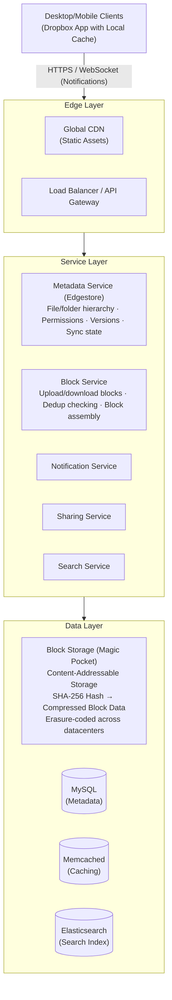
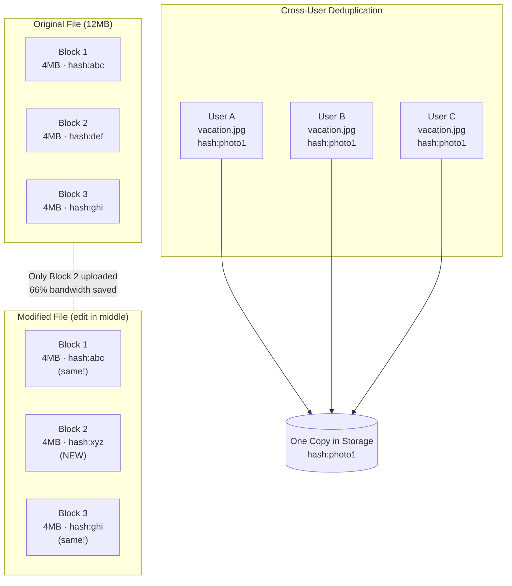
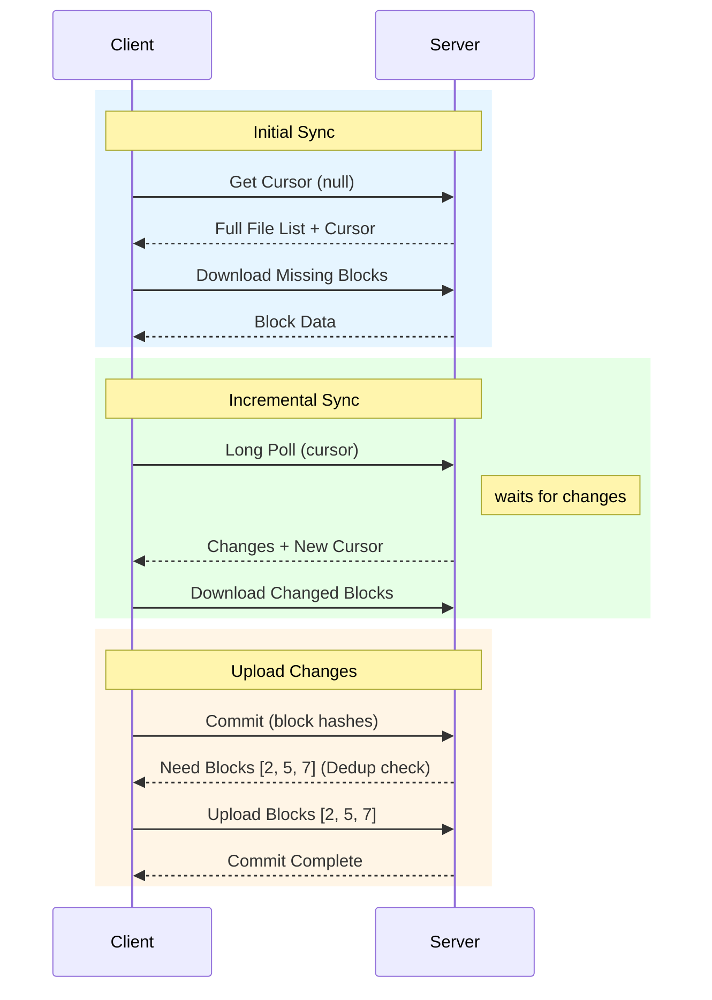
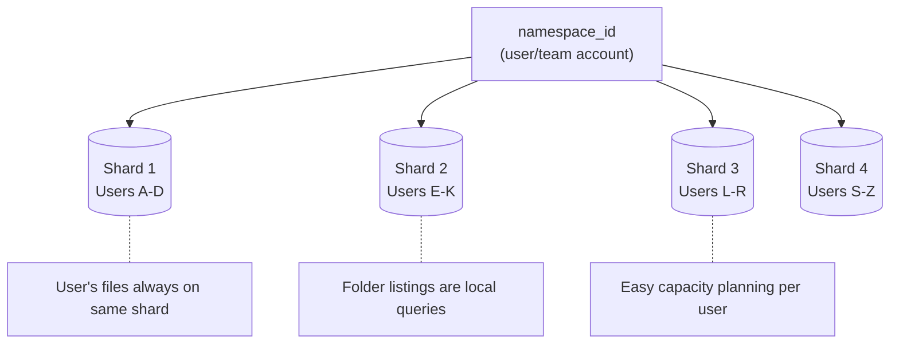

# Dropbox System Design

## TL;DR

Dropbox syncs files across 700M+ registered users with petabytes of storage. The architecture centers on: **block-level deduplication** storing unique 4MB blocks once, **content-addressable storage** using SHA-256 hashes, **sync protocol** with delta compression for efficient updates, **metadata service** tracking file trees separately from content, and **selective sync** for large folders. Key insight: most files are duplicates or small changes - dedupe at the block level achieves 60%+ storage savings.

---

## Core Requirements

### Functional Requirements
1. **File upload/download** - Store and retrieve files of any size
2. **Automatic sync** - Keep files synchronized across devices
3. **Sharing** - Share files and folders with permissions
4. **Version history** - Track and restore previous versions
5. **Conflict resolution** - Handle simultaneous edits
6. **Selective sync** - Choose which folders to sync locally

### Non-Functional Requirements
1. **Reliability** - 99.999% durability (never lose files)
2. **Consistency** - Strong consistency for metadata
3. **Efficiency** - Minimize bandwidth and storage
4. **Latency** - Near-instant sync for small changes
5. **Scale** - Billions of files, petabytes of data

---

## High-Level Architecture



---

## Block-Level Storage & Deduplication



### Block Service Implementation

```rust
// Block storage service (Magic Pocket): Rust
// Content-addressable block storage with deduplication.
// Blocks are immutable and identified by their SHA-256 hash.

use bytes::Bytes;
use sha2::{Sha256, Digest};
use std::sync::Arc;
use std::sync::atomic::{AtomicU64, Ordering};
use tokio::io::{AsyncRead, AsyncReadExt, AsyncWrite, AsyncWriteExt};
use uuid::Uuid;

const BLOCK_SIZE: usize = 4 * 1024 * 1024; // 4MB blocks

#[derive(Clone, Debug)]
struct Block {
    hash: String,       // SHA-256 of content
    size: u64,
    compressed_size: u64,
    ref_count: Arc<AtomicU64>,
}

#[derive(Clone, Debug)]
struct FileManifest {
    file_id: String,
    namespace_id: String, // User/team account
    path: String,
    size: u64,
    block_hashes: Vec<String>,
    version: u64,
    modified_at: f64,
}

struct BlockService {
    storage: Arc<dyn StorageClient>,   // Magic Pocket or S3
    db: Arc<dyn DbClient>,
    cache: Arc<dyn CacheClient>,
}

impl BlockService {
    /// Upload file in blocks with deduplication.
    /// Only uploads blocks that don't already exist.
    async fn upload_file(
        &self,
        namespace_id: &str,
        path: &str,
        file_stream: &mut (dyn AsyncRead + Unpin + Send),
        expected_size: u64,
    ) -> Result<FileManifest, BlockError> {
        let mut block_hashes = Vec::new();
        let mut blocks_to_upload = Vec::new();

        // Split into blocks and hash
        loop {
            let mut buf = vec![0u8; BLOCK_SIZE];
            let n = file_stream.read(&mut buf).await?;
            if n == 0 {
                break;
            }
            buf.truncate(n);

            let block_hash = compute_hash(&buf);
            block_hashes.push(block_hash.clone());

            if !self.block_exists(&block_hash).await? {
                let compressed = zstd::encode_all(&buf[..], 6)?;
                blocks_to_upload.push((block_hash, Bytes::from(compressed), n as u64));
            }
        }

        // Upload new blocks in parallel
        if !blocks_to_upload.is_empty() {
            self.upload_blocks(&blocks_to_upload).await?;
        }

        // Increment reference counts
        self.increment_refs(&block_hashes).await?;

        Ok(FileManifest {
            file_id: Uuid::new_v4().to_string(),
            namespace_id: namespace_id.to_string(),
            path: path.to_string(),
            size: expected_size,
            block_hashes,
            version: 1,
            modified_at: now_epoch(),
        })
    }

    /// Download file by assembling blocks.
    async fn download_file(
        &self,
        manifest: &FileManifest,
        output: &mut (dyn AsyncWrite + Unpin + Send),
    ) -> Result<(), BlockError> {
        for block_hash in &manifest.block_hashes {
            let cache_key = format!("block:{}", block_hash);

            let block_data = match self.cache.get(&cache_key).await? {
                Some(data) => data,
                None => {
                    let compressed = self.storage.get(block_hash).await?;
                    let data = zstd::decode_all(&compressed[..])?;
                    self.cache.set(&cache_key, &data, 3600).await?;
                    data
                }
            };

            output.write_all(&block_data).await?;
        }
        Ok(())
    }

    /// Compare client's block list with server.
    /// Returns indices of blocks that need uploading.
    async fn get_upload_diff(
        &self,
        _namespace_id: &str,
        _path: &str,
        client_block_hashes: &[String],
    ) -> Result<Vec<usize>, BlockError> {
        let existing = self.batch_check_exists(client_block_hashes).await?;

        Ok(client_block_hashes
            .iter()
            .zip(existing.iter())
            .enumerate()
            .filter(|(_, (_, &exists))| !exists)
            .map(|(i, _)| i)
            .collect())
    }

    /// Check if block exists in storage.
    async fn block_exists(&self, block_hash: &str) -> Result<bool, BlockError> {
        let cache_key = format!("block_exists:{}", block_hash);
        if let Some(val) = self.cache.get(&cache_key).await? {
            return Ok(val == b"1");
        }

        let exists = self
            .db
            .query_one("SELECT 1 FROM blocks WHERE hash = $1", &[block_hash])
            .await?
            .is_some();

        self.cache
            .set(&cache_key, if exists { b"1" } else { b"0" }, 3600)
            .await?;

        Ok(exists)
    }

    /// Upload multiple blocks in parallel.
    async fn upload_blocks(
        &self,
        blocks: &[(String, Bytes, u64)],
    ) -> Result<(), BlockError> {
        let mut handles = Vec::new();

        for (hash, compressed, original_size) in blocks {
            let storage = Arc::clone(&self.storage);
            let db = Arc::clone(&self.db);
            let hash = hash.clone();
            let compressed = compressed.clone();
            let original_size = *original_size;

            handles.push(tokio::spawn(async move {
                storage.put(&hash, &compressed).await?;
                db.execute(
                    "INSERT INTO blocks (hash, size, compressed_size, ref_count, created_at) \
                     VALUES ($1, $2, $3, 0, NOW()) ON CONFLICT (hash) DO NOTHING",
                    &[&hash, &original_size, &(compressed.len() as u64)],
                )
                .await?;
                Ok::<(), BlockError>(())
            }));
        }

        for handle in handles {
            handle.await??;
        }
        Ok(())
    }

    /// Increment reference count for blocks.
    async fn increment_refs(&self, block_hashes: &[String]) -> Result<(), BlockError> {
        self.db
            .execute(
                "UPDATE blocks SET ref_count = ref_count + 1 WHERE hash = ANY($1)",
                &[&block_hashes],
            )
            .await?;
        Ok(())
    }

    async fn batch_check_exists(&self, hashes: &[String]) -> Result<Vec<bool>, BlockError> {
        let mut result = Vec::with_capacity(hashes.len());
        for h in hashes {
            result.push(self.block_exists(h).await?);
        }
        Ok(result)
    }
}

fn compute_hash(data: &[u8]) -> String {
    let mut hasher = Sha256::new();
    hasher.update(data);
    format!("{:x}", hasher.finalize())
}

/// Variable-size chunking using Rabin fingerprinting.
/// Provides better deduplication for insertions/deletions.
struct ContentDefinedChunking {
    min_size: usize,  // 512KB min
    max_size: usize,  // 8MB max
    mask: u32,
}

impl ContentDefinedChunking {
    fn new(min_size: usize, max_size: usize, avg_size: usize) -> Self {
        let bits = ((avg_size - 1) as f64).log2().ceil() as u32;
        Self {
            min_size,
            max_size,
            mask: (1 << bits) - 1,
        }
    }

    fn default() -> Self {
        Self::new(512 * 1024, 8 * 1024 * 1024, 4 * 1024 * 1024)
    }

    /// Split file into variable-size chunks based on content.
    /// Returns list of (offset, length, hash) tuples.
    fn chunk_file(&self, data: &[u8]) -> Vec<(usize, usize, String)> {
        let mut chunks = Vec::new();
        let mut offset = 0;

        while offset < data.len() {
            let chunk_end = self.find_boundary(data, offset);
            let chunk_data = &data[offset..chunk_end];
            let chunk_hash = compute_hash(chunk_data);
            chunks.push((offset, chunk_data.len(), chunk_hash));
            offset = chunk_end;
        }

        chunks
    }

    /// Find chunk boundary using Rabin fingerprint.
    fn find_boundary(&self, data: &[u8], start: usize) -> usize {
        let length = data.len();
        let mut pos = start + self.min_size;

        if pos >= length {
            return length;
        }

        let window: usize = 48;
        let mut fp: u32 = 0;

        while pos < length && pos < start + self.max_size {
            fp = (fp << 1).wrapping_add(data[pos] as u32) & 0xFFFF_FFFF;

            if pos >= start + window {
                fp ^= (data[pos - window] as u32) << (window as u32);
            }

            if (fp & self.mask) == 0 {
                return pos + 1;
            }

            pos += 1;
        }

        std::cmp::min(pos, length)
    }
}
```

---

## Sync Protocol



### Sync Service Implementation

```go
// Sync engine: Go
// Handles file synchronization between clients and server.
// Uses cursor-based incremental sync with long polling.

package sync

import (
	"context"
	"encoding/json"
	"fmt"
	"sync"
	"time"
)

type ChangeType string

const (
	ChangeAdd    ChangeType = "add"
	ChangeModify ChangeType = "modify"
	ChangeDelete ChangeType = "delete"
	ChangeMove   ChangeType = "move"
)

type FileChange struct {
	ChangeType  ChangeType `json:"change_type"`
	Path        string     `json:"path"`
	NewPath     string     `json:"new_path,omitempty"` // For moves
	Revision    int64      `json:"revision"`
	BlockHashes []string   `json:"block_hashes,omitempty"`
	Size        int64      `json:"size,omitempty"`
	ModifiedAt  float64    `json:"modified_at"`
}

type SyncCursor struct {
	NamespaceID string `json:"namespace_id"`
	Position    int64  `json:"position"` // Monotonically increasing position in change log
	DeviceID    string `json:"device_id"`
}

type SyncService struct {
	db            DBClient
	blocks        *BlockServiceClient
	notifications *NotificationService
}

// GetChanges returns changes since cursor with long polling.
// Returns (changes, newCursor, error).
func (s *SyncService) GetChanges(
	ctx context.Context,
	namespaceID string,
	cursor string,
	deviceID string,
	timeout time.Duration,
) ([]FileChange, string, error) {
	var position int64
	if cursor != "" {
		parsed, err := parseCursor(cursor)
		if err != nil {
			return nil, "", err
		}
		position = parsed.Position
	}

	// Check for immediate changes
	changes, err := s.getChangesSince(ctx, namespaceID, position)
	if err != nil {
		return nil, "", err
	}

	if len(changes) > 0 {
		newPos := maxRevision(changes)
		return changes, buildCursor(namespaceID, newPos, deviceID), nil
	}

	// Long poll - wait for changes
	waitCtx, cancel := context.WithTimeout(ctx, timeout)
	defer cancel()

	ch := make(chan struct{}, 1)
	go s.waitForChanges(waitCtx, namespaceID, position, ch)

	select {
	case <-ch:
		changes, err = s.getChangesSince(ctx, namespaceID, position)
		if err != nil {
			return nil, "", err
		}
		newPos := position
		if len(changes) > 0 {
			newPos = maxRevision(changes)
		}
		return changes, buildCursor(namespaceID, newPos, deviceID), nil

	case <-waitCtx.Done():
		// No changes, return empty with same cursor
		return nil, buildCursor(namespaceID, position, deviceID), nil
	}
}

// CommitChanges commits local changes to server.
// Returns (committed, conflicts, error).
func (s *SyncService) CommitChanges(
	ctx context.Context,
	namespaceID string,
	deviceID string,
	changes []map[string]interface{},
) ([]FileChange, []map[string]interface{}, error) {
	var committed []FileChange
	var conflicts []map[string]interface{}

	tx, err := s.db.Begin(ctx)
	if err != nil {
		return nil, nil, err
	}
	defer tx.Rollback()

	for _, change := range changes {
		result, err := s.applyChange(ctx, tx, namespaceID, change)
		if err != nil {
			if ce, ok := err.(*ConflictError); ok {
				conflicts = append(conflicts, map[string]interface{}{
					"path":           change["path"],
					"conflict_type":  ce.ConflictType,
					"server_version": ce.ServerVersion,
				})
				continue
			}
			return nil, nil, err
		}
		committed = append(committed, *result)
	}

	if err := tx.Commit(); err != nil {
		return nil, nil, err
	}

	// Notify other devices
	if len(committed) > 0 {
		s.notifications.NotifyNamespace(namespaceID, deviceID)
	}

	return committed, conflicts, nil
}

// applyChange applies a single change with conflict detection.
func (s *SyncService) applyChange(
	ctx context.Context,
	tx Transaction,
	namespaceID string,
	change map[string]interface{},
) (*FileChange, error) {
	path := change["path"].(string)

	// Get current server state
	serverFile, err := tx.QueryRow(ctx,
		"SELECT revision, block_hashes, modified_at FROM files WHERE namespace_id = $1 AND path = $2",
		namespaceID, path,
	)
	if err != nil && err != ErrNoRows {
		return nil, err
	}

	// Check for conflicts
	clientBaseRevision := int64(0)
	if v, ok := change["base_revision"]; ok {
		clientBaseRevision = int64(v.(float64))
	}

	if serverFile != nil && serverFile.Revision != clientBaseRevision {
		return nil, &ConflictError{
			ConflictType:  "concurrent_modification",
			ServerVersion: serverFile.Revision,
		}
	}

	var changeType ChangeType
	var blockHashes []string
	var newRevision int64

	if change["type"].(string) == "delete" {
		_, err := tx.Exec(ctx,
			"UPDATE files SET deleted = true, revision = revision + 1 WHERE namespace_id = $1 AND path = $2",
			namespaceID, path,
		)
		if err != nil {
			return nil, err
		}

		if serverFile != nil {
			s.blocks.DecrementRefs(ctx, serverFile.BlockHashes)
		}

		changeType = ChangeDelete
		if serverFile != nil {
			newRevision = serverFile.Revision + 1
		} else {
			newRevision = 1
		}
	} else {
		blockHashes = toStringSlice(change["block_hashes"])

		needed, err := s.blocks.GetUploadDiff(ctx, namespaceID, path, blockHashes)
		if err != nil {
			return nil, err
		}
		if len(needed) > 0 {
			return nil, &NeedBlocksError{Indices: needed}
		}

		if serverFile != nil {
			newRevision = serverFile.Revision + 1
		} else {
			newRevision = 1
		}

		size := int64(change["size"].(float64))
		_, err = tx.Exec(ctx,
			`INSERT INTO files (namespace_id, path, size, block_hashes, revision, modified_at)
			 VALUES ($1, $2, $3, $4, $5, NOW())
			 ON CONFLICT (namespace_id, path) DO UPDATE SET
			   size = EXCLUDED.size, block_hashes = EXCLUDED.block_hashes,
			   revision = EXCLUDED.revision, modified_at = EXCLUDED.modified_at, deleted = false`,
			namespaceID, path, size, blockHashes, newRevision,
		)
		if err != nil {
			return nil, err
		}

		s.blocks.IncrementRefs(ctx, blockHashes)
		if serverFile != nil {
			s.blocks.DecrementRefs(ctx, serverFile.BlockHashes)
		}

		if serverFile != nil {
			changeType = ChangeModify
		} else {
			changeType = ChangeAdd
		}
	}

	fc := &FileChange{
		ChangeType:  changeType,
		Path:        path,
		Revision:    newRevision,
		BlockHashes: blockHashes,
		Size:        int64(change["size"].(float64)),
		ModifiedAt:  float64(time.Now().Unix()),
	}

	s.recordChange(ctx, tx, namespaceID, fc)

	return fc, nil
}

func (s *SyncService) waitForChanges(ctx context.Context, namespaceID string, position int64, ch chan<- struct{}) {
	channel := fmt.Sprintf("sync:%s", namespaceID)

	sub := s.notifications.Subscribe(channel)
	defer sub.Close()

	for {
		select {
		case msg := <-sub.C:
			if msg.Position > position {
				ch <- struct{}{}
				return
			}
		case <-ctx.Done():
			return
		}
	}
}

// ConflictResolver handles file conflicts when multiple devices edit simultaneously.
type ConflictResolver struct {
	syncService  *SyncService
	blockService *BlockServiceClient
}

// Resolve resolves conflict between local and server versions.
// Strategies: "local", "server", "both" (conflict copy).
func (r *ConflictResolver) Resolve(
	ctx context.Context,
	namespaceID string,
	path string,
	localVersion map[string]interface{},
	serverVersion map[string]interface{},
	strategy string,
) ([]FileChange, error) {
	switch strategy {
	case "local":
		localVersion["base_revision"] = serverVersion["revision"]
		committed, _, err := r.syncService.CommitChanges(
			ctx, namespaceID, localVersion["device_id"].(string),
			[]map[string]interface{}{localVersion},
		)
		return committed, err

	case "server":
		return nil, nil

	case "both":
		ext := pathExt(path)
		base := pathBase(path, ext)
		conflictPath := fmt.Sprintf("%s (conflict copy)%s", base, ext)
		localVersion["path"] = conflictPath
		localVersion["type"] = "add"
		committed, _, err := r.syncService.CommitChanges(
			ctx, namespaceID, localVersion["device_id"].(string),
			[]map[string]interface{}{localVersion},
		)
		return committed, err

	default:
		return nil, fmt.Errorf("unknown strategy: %s", strategy)
	}
}

func maxRevision(changes []FileChange) int64 {
	var m int64
	for _, c := range changes {
		if c.Revision > m {
			m = c.Revision
		}
	}
	return m
}
```

---

## Metadata Service (Edgestore)

**File Tree Structure:**

```
Namespace (User Account)
      │
      ├── /Documents
      │       ├── /Work
      │       │     ├── report.pdf
      │       │     └── presentation.pptx
      │       └── /Personal
      │             └── taxes.xlsx
      │
      └── /Photos
              ├── vacation.jpg
              └── family.png
```

**Sharding Strategy:**



### Metadata Service Implementation

```python
# Metadata service: Python (Edgestore)
from dataclasses import dataclass
from typing import List, Optional, Dict
import time

@dataclass
class FileMetadata:
    id: str
    namespace_id: str
    path: str
    name: str
    is_folder: bool
    size: int
    block_hashes: Optional[List[str]]
    revision: int
    modified_at: float
    content_hash: Optional[str]  # Hash of complete file

@dataclass
class FolderContents:
    path: str
    entries: List[FileMetadata]
    cursor: Optional[str]
    has_more: bool


class MetadataService:
    """
    Manages file/folder hierarchy and metadata.
    Provides strong consistency for metadata operations.
    """

    def __init__(self, db_client, cache_client, block_service):
        self.db = db_client
        self.cache = cache_client
        self.blocks = block_service

    async def list_folder(
        self,
        namespace_id: str,
        path: str,
        recursive: bool = False,
        limit: int = 2000,
        cursor: Optional[str] = None
    ) -> FolderContents:
        """
        List contents of a folder with pagination.
        """
        # Normalize path
        path = self._normalize_path(path)

        # Build query
        if recursive:
            # All descendants
            condition = "path LIKE $3 || '%'"
            path_param = path if path == "/" else path + "/"
        else:
            # Direct children only
            condition = "parent_path = $3"
            path_param = path

        query = f"""
            SELECT id, path, name, is_folder, size, block_hashes,
                   revision, modified_at, content_hash
            FROM files
            WHERE namespace_id = $1
              AND deleted = false
              AND {condition}
        """

        params = [namespace_id, path_param]

        # Cursor-based pagination
        if cursor:
            cursor_data = self._parse_cursor(cursor)
            query += " AND (path > $4 OR (path = $4 AND id > $5))"
            params.extend([cursor_data["path"], cursor_data["id"]])

        query += " ORDER BY path, id LIMIT $" + str(len(params) + 1)
        params.append(limit + 1)

        rows = await self.db.fetch(query, *params)

        has_more = len(rows) > limit
        entries = [self._row_to_metadata(r) for r in rows[:limit]]

        next_cursor = None
        if has_more and entries:
            last = entries[-1]
            next_cursor = self._build_cursor(last.path, last.id)

        return FolderContents(
            path=path,
            entries=entries,
            cursor=next_cursor,
            has_more=has_more
        )

    async def get_metadata(
        self,
        namespace_id: str,
        path: str
    ) -> Optional[FileMetadata]:
        """Get metadata for a single file/folder"""
        path = self._normalize_path(path)

        # Check cache
        cache_key = f"meta:{namespace_id}:{path}"
        cached = await self.cache.get(cache_key)
        if cached:
            return FileMetadata(**json.loads(cached))

        row = await self.db.fetchone(
            """
            SELECT id, path, name, is_folder, size, block_hashes,
                   revision, modified_at, content_hash
            FROM files
            WHERE namespace_id = $1 AND path = $2 AND deleted = false
            """,
            namespace_id, path
        )

        if not row:
            return None

        metadata = self._row_to_metadata(row)

        # Cache with short TTL (metadata changes frequently)
        await self.cache.set(
            cache_key,
            json.dumps(metadata.__dict__),
            ttl=60
        )

        return metadata

    async def move(
        self,
        namespace_id: str,
        from_path: str,
        to_path: str
    ) -> FileMetadata:
        """Move/rename a file or folder"""
        from_path = self._normalize_path(from_path)
        to_path = self._normalize_path(to_path)

        async with self.db.transaction() as tx:
            # Check source exists
            source = await tx.fetchone(
                "SELECT * FROM files WHERE namespace_id = $1 AND path = $2",
                namespace_id, from_path
            )
            if not source:
                raise NotFoundError(f"Path not found: {from_path}")

            # Check destination doesn't exist
            dest = await tx.fetchone(
                "SELECT 1 FROM files WHERE namespace_id = $1 AND path = $2 AND deleted = false",
                namespace_id, to_path
            )
            if dest:
                raise ConflictError(f"Destination exists: {to_path}")

            if source["is_folder"]:
                # Move folder and all contents
                await tx.execute(
                    """
                    UPDATE files
                    SET path = $3 || SUBSTRING(path FROM LENGTH($2) + 1),
                        parent_path = CASE
                            WHEN path = $2 THEN $4
                            ELSE $3 || SUBSTRING(parent_path FROM LENGTH($2) + 1)
                        END,
                        revision = revision + 1
                    WHERE namespace_id = $1
                      AND (path = $2 OR path LIKE $2 || '/%')
                      AND deleted = false
                    """,
                    namespace_id, from_path, to_path,
                    self._get_parent_path(to_path)
                )
            else:
                # Move single file
                await tx.execute(
                    """
                    UPDATE files
                    SET path = $3,
                        name = $4,
                        parent_path = $5,
                        revision = revision + 1
                    WHERE namespace_id = $1 AND path = $2
                    """,
                    namespace_id, from_path, to_path,
                    self._get_name(to_path),
                    self._get_parent_path(to_path)
                )

            # Invalidate caches
            await self._invalidate_caches(namespace_id, [from_path, to_path])

        return await self.get_metadata(namespace_id, to_path)

    async def search(
        self,
        namespace_id: str,
        query: str,
        path_prefix: Optional[str] = None,
        file_types: Optional[List[str]] = None,
        limit: int = 100
    ) -> List[FileMetadata]:
        """Search for files by name"""
        conditions = [
            "namespace_id = $1",
            "deleted = false",
            "name ILIKE $2"
        ]
        params = [namespace_id, f"%{query}%"]

        if path_prefix:
            conditions.append(f"path LIKE ${len(params) + 1} || '%'")
            params.append(self._normalize_path(path_prefix))

        if file_types:
            placeholders = ", ".join(f"${i}" for i in range(len(params) + 1, len(params) + 1 + len(file_types)))
            conditions.append(f"LOWER(SUBSTRING(name FROM '\\.([^.]+)$')) IN ({placeholders})")
            params.extend([ft.lower() for ft in file_types])

        sql = f"""
            SELECT id, path, name, is_folder, size, block_hashes,
                   revision, modified_at, content_hash
            FROM files
            WHERE {' AND '.join(conditions)}
            ORDER BY modified_at DESC
            LIMIT ${len(params) + 1}
        """
        params.append(limit)

        rows = await self.db.fetch(sql, *params)
        return [self._row_to_metadata(r) for r in rows]

    def _normalize_path(self, path: str) -> str:
        """Normalize path to consistent format"""
        # Remove trailing slash (except for root)
        if path != "/" and path.endswith("/"):
            path = path[:-1]

        # Ensure leading slash
        if not path.startswith("/"):
            path = "/" + path

        # Collapse multiple slashes
        while "//" in path:
            path = path.replace("//", "/")

        return path.lower()
```

---

## Sharing & Permissions

```python
# Sharing service: Python (Edgestore)
from dataclasses import dataclass
from typing import List, Optional, Set
from enum import Enum

class Permission(Enum):
    VIEW = "view"
    EDIT = "edit"
    OWNER = "owner"

class LinkAccess(Enum):
    NONE = "none"
    VIEW = "view"
    EDIT = "edit"

@dataclass
class ShareLink:
    id: str
    namespace_id: str
    path: str
    access_level: LinkAccess
    password_hash: Optional[str]
    expires_at: Optional[float]
    download_count: int
    max_downloads: Optional[int]

@dataclass
class SharedFolder:
    id: str
    owner_namespace_id: str
    path: str
    members: List[Dict]  # {user_id, permission}


class SharingService:
    """
    Manages file/folder sharing and permissions.
    Supports both direct shares and shareable links.
    """

    def __init__(self, db_client, metadata_service, notification_service):
        self.db = db_client
        self.metadata = metadata_service
        self.notifications = notification_service

    async def share_folder(
        self,
        namespace_id: str,
        path: str,
        share_with: List[Dict],  # [{user_id, permission}]
        message: Optional[str] = None
    ) -> SharedFolder:
        """Share a folder with other users"""
        # Verify folder exists
        folder = await self.metadata.get_metadata(namespace_id, path)
        if not folder or not folder.is_folder:
            raise NotFoundError("Folder not found")

        share_id = str(uuid.uuid4())

        async with self.db.transaction() as tx:
            # Create shared folder record
            await tx.execute(
                """
                INSERT INTO shared_folders (id, owner_namespace_id, path, created_at)
                VALUES ($1, $2, $3, NOW())
                """,
                share_id, namespace_id, path
            )

            # Add members
            for member in share_with:
                await tx.execute(
                    """
                    INSERT INTO share_members (share_id, user_id, permission, added_at)
                    VALUES ($1, $2, $3, NOW())
                    """,
                    share_id, member["user_id"], member["permission"]
                )

                # Mount in member's namespace
                await self._mount_shared_folder(
                    tx,
                    member["user_id"],
                    share_id,
                    folder.name
                )

        # Notify members
        for member in share_with:
            await self.notifications.send_share_notification(
                recipient_id=member["user_id"],
                sharer_namespace_id=namespace_id,
                path=path,
                permission=member["permission"],
                message=message
            )

        return SharedFolder(
            id=share_id,
            owner_namespace_id=namespace_id,
            path=path,
            members=share_with
        )

    async def create_share_link(
        self,
        namespace_id: str,
        path: str,
        access_level: LinkAccess = LinkAccess.VIEW,
        password: Optional[str] = None,
        expires_in: Optional[int] = None,
        max_downloads: Optional[int] = None
    ) -> ShareLink:
        """Create a shareable link for a file/folder"""
        # Verify path exists
        item = await self.metadata.get_metadata(namespace_id, path)
        if not item:
            raise NotFoundError("Path not found")

        link_id = self._generate_link_id()  # Short, URL-safe ID

        password_hash = None
        if password:
            password_hash = bcrypt.hashpw(
                password.encode(),
                bcrypt.gensalt()
            ).decode()

        expires_at = None
        if expires_in:
            expires_at = time.time() + expires_in

        await self.db.execute(
            """
            INSERT INTO share_links (
                id, namespace_id, path, access_level,
                password_hash, expires_at, max_downloads, created_at
            ) VALUES ($1, $2, $3, $4, $5, $6, $7, NOW())
            """,
            link_id, namespace_id, path, access_level.value,
            password_hash, expires_at, max_downloads
        )

        return ShareLink(
            id=link_id,
            namespace_id=namespace_id,
            path=path,
            access_level=access_level,
            password_hash=password_hash,
            expires_at=expires_at,
            download_count=0,
            max_downloads=max_downloads
        )

    async def access_share_link(
        self,
        link_id: str,
        password: Optional[str] = None
    ) -> Tuple[FileMetadata, bytes]:
        """Access content via share link"""
        link = await self._get_link(link_id)

        if not link:
            raise NotFoundError("Link not found or expired")

        # Check expiration
        if link.expires_at and time.time() > link.expires_at:
            raise ExpiredError("Link has expired")

        # Check download limit
        if link.max_downloads and link.download_count >= link.max_downloads:
            raise LimitExceededError("Download limit reached")

        # Check password
        if link.password_hash:
            if not password:
                raise AuthenticationError("Password required")

            if not bcrypt.checkpw(password.encode(), link.password_hash.encode()):
                raise AuthenticationError("Incorrect password")

        # Get file metadata
        metadata = await self.metadata.get_metadata(
            link.namespace_id,
            link.path
        )

        # Increment download count
        await self.db.execute(
            "UPDATE share_links SET download_count = download_count + 1 WHERE id = $1",
            link_id
        )

        return metadata

    async def check_permission(
        self,
        user_id: str,
        namespace_id: str,
        path: str,
        required_permission: Permission
    ) -> bool:
        """Check if user has required permission for path"""
        # Owner always has access
        user_namespace = await self._get_user_namespace(user_id)
        if user_namespace == namespace_id:
            return True

        # Check shared folder permissions
        share = await self._find_share_for_path(namespace_id, path, user_id)

        if not share:
            return False

        member = next(
            (m for m in share["members"] if m["user_id"] == user_id),
            None
        )

        if not member:
            return False

        # Check permission level
        permission_levels = {
            Permission.VIEW: 1,
            Permission.EDIT: 2,
            Permission.OWNER: 3
        }

        return permission_levels.get(
            Permission(member["permission"]), 0
        ) >= permission_levels[required_permission]
```

---

## Version History

```python
# Version history service: Python (Edgestore)
from dataclasses import dataclass
from typing import List, Optional
import time

@dataclass
class FileVersion:
    version_id: str
    path: str
    revision: int
    size: int
    block_hashes: List[str]
    content_hash: str
    modified_at: float
    modified_by: str
    is_deleted: bool


class VersionHistoryService:
    """
    Tracks file version history for recovery and auditing.
    Keeps versions for configurable retention period.
    """

    def __init__(self, db_client, block_service, config):
        self.db = db_client
        self.blocks = block_service

        # Retention settings
        self.retention_days = config.get("retention_days", 180)
        self.max_versions = config.get("max_versions", 100)

    async def record_version(
        self,
        namespace_id: str,
        path: str,
        metadata: FileMetadata,
        modified_by: str
    ):
        """Record a new version in history"""
        version_id = str(uuid.uuid4())

        await self.db.execute(
            """
            INSERT INTO file_versions (
                id, namespace_id, path, revision, size,
                block_hashes, content_hash, modified_at, modified_by, is_deleted
            ) VALUES ($1, $2, $3, $4, $5, $6, $7, $8, $9, false)
            """,
            version_id, namespace_id, path, metadata.revision,
            metadata.size, metadata.block_hashes, metadata.content_hash,
            metadata.modified_at, modified_by
        )

        # Increment block refs for version
        await self.blocks._increment_refs(metadata.block_hashes)

        # Cleanup old versions if needed
        await self._cleanup_old_versions(namespace_id, path)

    async def get_versions(
        self,
        namespace_id: str,
        path: str,
        limit: int = 50
    ) -> List[FileVersion]:
        """Get version history for a file"""
        rows = await self.db.fetch(
            """
            SELECT id, path, revision, size, block_hashes,
                   content_hash, modified_at, modified_by, is_deleted
            FROM file_versions
            WHERE namespace_id = $1 AND path = $2
            ORDER BY modified_at DESC
            LIMIT $3
            """,
            namespace_id, path, limit
        )

        return [
            FileVersion(
                version_id=r["id"],
                path=r["path"],
                revision=r["revision"],
                size=r["size"],
                block_hashes=r["block_hashes"],
                content_hash=r["content_hash"],
                modified_at=r["modified_at"],
                modified_by=r["modified_by"],
                is_deleted=r["is_deleted"]
            )
            for r in rows
        ]

    async def restore_version(
        self,
        namespace_id: str,
        path: str,
        version_id: str,
        restored_by: str
    ) -> FileMetadata:
        """Restore a previous version of a file"""
        # Get version
        version = await self._get_version(version_id)

        if not version or version.is_deleted:
            raise NotFoundError("Version not found")

        async with self.db.transaction() as tx:
            # Get current file
            current = await tx.fetchone(
                """
                SELECT revision, block_hashes FROM files
                WHERE namespace_id = $1 AND path = $2
                """,
                namespace_id, path
            )

            new_revision = (current["revision"] + 1) if current else 1

            # Record current as a version before overwriting
            if current:
                await self.record_version(
                    namespace_id, path,
                    self._row_to_metadata(current),
                    restored_by
                )

            # Restore file to previous version
            await tx.execute(
                """
                UPDATE files
                SET size = $3, block_hashes = $4, content_hash = $5,
                    revision = $6, modified_at = NOW(), deleted = false
                WHERE namespace_id = $1 AND path = $2
                """,
                namespace_id, path, version.size, version.block_hashes,
                version.content_hash, new_revision
            )

            # Update block references
            await self.blocks._increment_refs(version.block_hashes)
            if current:
                await self.blocks._decrement_refs(current["block_hashes"])

        return await self.metadata.get_metadata(namespace_id, path)

    async def _cleanup_old_versions(self, namespace_id: str, path: str):
        """Remove versions beyond retention policy"""
        cutoff = time.time() - (self.retention_days * 24 * 60 * 60)

        # Get versions to delete
        old_versions = await self.db.fetch(
            """
            SELECT id, block_hashes FROM file_versions
            WHERE namespace_id = $1 AND path = $2
              AND modified_at < $3
            ORDER BY modified_at ASC
            """,
            namespace_id, path, cutoff
        )

        # Also enforce max versions
        excess_versions = await self.db.fetch(
            """
            SELECT id, block_hashes FROM file_versions
            WHERE namespace_id = $1 AND path = $2
            ORDER BY modified_at DESC
            OFFSET $3
            """,
            namespace_id, path, self.max_versions
        )

        versions_to_delete = {v["id"]: v for v in old_versions}
        versions_to_delete.update({v["id"]: v for v in excess_versions})

        if versions_to_delete:
            # Delete versions
            await self.db.execute(
                "DELETE FROM file_versions WHERE id = ANY($1)",
                list(versions_to_delete.keys())
            )

            # Decrement block references
            for version in versions_to_delete.values():
                await self.blocks._decrement_refs(version["block_hashes"])
```

---

## Key Metrics & Scale

| Metric | Value |
|--------|-------|
| **Registered Users** | 700M+ |
| **Files Stored** | Billions |
| **Data Stored** | Exabytes |
| **Block Deduplication Rate** | ~60% |
| **Daily Syncs** | Billions |
| **Sync Latency** | < 5 seconds (small files) |
| **Durability** | 99.999999999% (11 nines) |
| **Block Size** | 4MB (variable with CDC) |
| **Version Retention** | 180 days (default) |
| **API Availability** | 99.99% |

---

## Production Insights

### Magic Pocket vs S3: The Cost Inflection Point

Dropbox famously migrated from AWS S3 to their own storage system, Magic Pocket, in 2016. At their scale (exabytes of data), S3 costs were roughly **$75M+/year**. Building and operating Magic Pocket in their own colocated datacenters cut storage costs by approximately **50-60%** within two years of full deployment. The breakeven point for building custom storage infrastructure is typically around **500 PB**; below that threshold, managed cloud storage remains more cost-effective when factoring in engineering headcount, hardware procurement, and facility costs.

Magic Pocket uses **erasure coding (Reed-Solomon)** rather than triple replication, achieving the same 11-nines durability at roughly **1.5x** raw storage overhead instead of **3x** with replication. Each block is split into data and parity shards distributed across multiple racks and datacenters.

### Python Metadata Bottleneck and the Edgestore Evolution

Dropbox's metadata layer (Edgestore) has remained Python-based throughout its history, but not without significant pain. The GIL became a bottleneck as metadata QPS grew into the millions. Key mitigations included:

- **Sharding MySQL aggressively** by namespace_id so each shard handles a bounded number of users
- **Memcached layers** absorbing 95%+ of read traffic before it hits MySQL
- **Connection pooling** via custom middleware to avoid per-request connection overhead
- **Async I/O adoption** (moving from synchronous Django to async frameworks) to improve concurrency per process

Despite these optimizations, metadata operations remain the primary latency bottleneck. A single `list_folder` call on a directory with 10,000+ entries can take 200-500ms even with caching. Dropbox has explored rewriting hot-path metadata services in Go but has kept the core Edgestore in Python due to the enormous migration cost.

### Block Deduplication: Collision Probability and Safety Margins

SHA-256 produces a 256-bit hash. The probability of a collision among `n` blocks follows the birthday paradox:

- At **1 billion blocks**: collision probability is approximately `2^-197` (negligible)
- At **1 trillion blocks**: collision probability is approximately `2^-177` (still negligible)
- To reach a **50% collision probability**, you would need approximately `2^128` blocks (3.4 x 10^38), far beyond any storage system ever built

Dropbox relies on this mathematical guarantee to skip byte-level verification after hash comparison. In practice, the risk of a SHA-256 collision causing silent data corruption is orders of magnitude lower than the risk of a cosmic ray flipping a bit in RAM. The real-world dedup hit rate of ~60% means that for every 10 blocks uploaded, 6 already exist in the system, saving both bandwidth and disk I/O.

Content-defined chunking (Rabin fingerprinting) further improves dedup efficiency for edit-heavy workloads. When a user inserts a paragraph in the middle of a document, fixed-size chunking invalidates every subsequent block. CDC keeps boundaries stable around unchanged content, typically reducing re-upload volume by **30-40%** compared to fixed chunking for text-heavy files.

---

## Key Takeaways

1. **Block-level deduplication** - SHA-256 addressed blocks stored once regardless of how many files reference them. 60%+ storage savings.

2. **Content-defined chunking** - Variable-size blocks based on content patterns handle insertions/deletions better than fixed-size blocks.

3. **Separate metadata and content** - Metadata (file trees, permissions) in MySQL, content blocks in dedicated storage. Different scaling needs.

4. **Cursor-based sync** - Monotonically increasing positions in change log enable efficient incremental sync without gaps.

5. **Long polling for real-time** - Clients hold open connections to receive immediate change notifications. Balances real-time with efficiency.

6. **Optimistic conflict handling** - Base revision tracking detects concurrent edits. Create conflict copies rather than losing changes.

7. **Selective sync** - Large folders can be excluded from local sync. Only download when accessed.

8. **Reference counting for GC** - Track how many files reference each block. Delete blocks when ref count reaches zero (with retention period).
