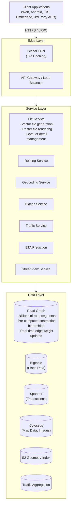
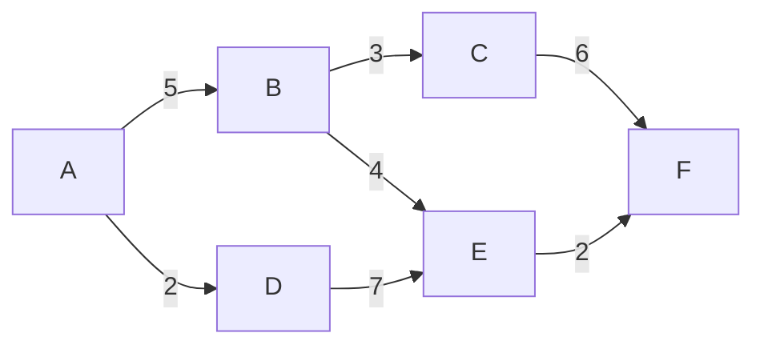
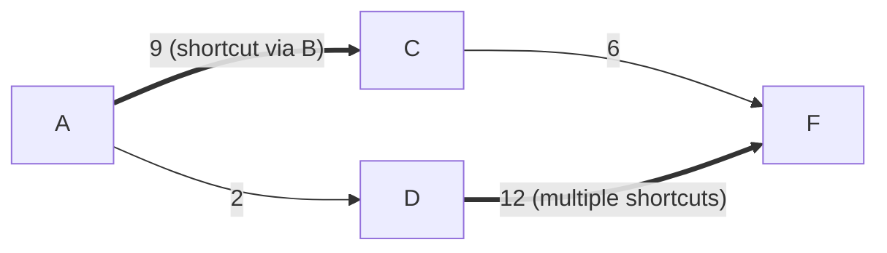
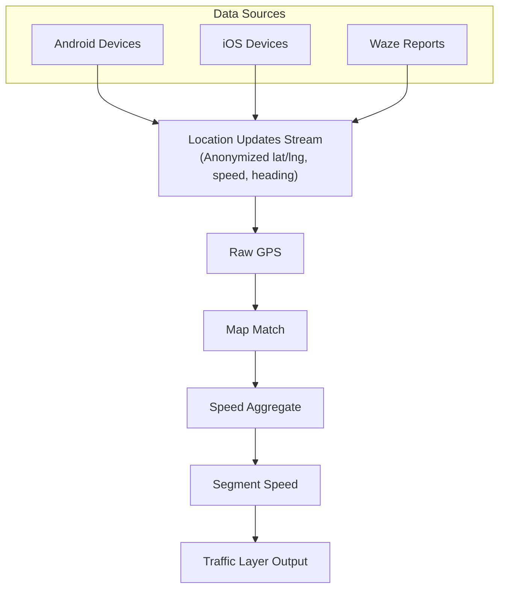

# Google Maps System Design

## TL;DR

Google Maps serves 1B+ monthly users with mapping, navigation, and location services. The architecture centers on: **tile-based map rendering** with vector tiles for efficient delivery, **graph-based routing** using contraction hierarchies for fast path finding, **real-time traffic** from aggregated device data, **geocoding** with probabilistic address parsing, and **spatial indexing** using S2 geometry. Key insight: pre-computation at multiple scales enables sub-second responses for complex geospatial queries.

---

## Core Requirements

### Functional Requirements
1. **Map display** - Render maps at any zoom level globally
2. **Directions** - Calculate routes with multiple transport modes
3. **Search** - Find places by name, category, or address
4. **Real-time traffic** - Show current traffic conditions
5. **ETA calculation** - Predict arrival times accurately
6. **Street View** - Display 360° street-level imagery

### Non-Functional Requirements
1. **Latency** - Map tiles < 100ms, routes < 500ms
2. **Accuracy** - ETA within 10% of actual travel time
3. **Scale** - 1B+ users, 25M+ updates daily
4. **Freshness** - Traffic data < 2 minute lag
5. **Coverage** - 220+ countries and territories

---

## High-Level Architecture



---

## Tile-Based Map Rendering

```
┌─────────────────────────────────────────────────────────────────────────┐
│                    Tile Pyramid (Zoom Levels)                            │
│                                                                          │
│   Zoom 0:   1 tile covers entire world                                  │
│   ┌─────────────────────────────────────────────────────────────────┐   │
│   │                        World                                     │   │
│   └─────────────────────────────────────────────────────────────────┘   │
│                                                                          │
│   Zoom 1:   4 tiles (2x2)                                               │
│   ┌────────────────────┐  ┌────────────────────┐                       │
│   │                    │  │                    │                       │
│   └────────────────────┘  └────────────────────┘                       │
│   ┌────────────────────┐  ┌────────────────────┐                       │
│   │                    │  │                    │                       │
│   └────────────────────┘  └────────────────────┘                       │
│                                                                          │
│   Zoom 20:  ~1 trillion tiles (street level detail)                     │
│                                                                          │
│   Tile addressing: /{z}/{x}/{y}                                         │
│   - z: zoom level (0-22)                                                │
│   - x: column (0 to 2^z - 1)                                            │
│   - y: row (0 to 2^z - 1)                                               │
│                                                                          │
│   ┌──────────────────────────────────────────────────────────────────┐  │
│   │                   Vector Tiles vs Raster Tiles                    │  │
│   │                                                                   │  │
│   │   Raster (PNG):          Vector (PBF):                           │  │
│   │   - Pre-rendered pixels  - Geometry + styling                    │  │
│   │   - Large file size      - Small file size                       │  │
│   │   - Fixed resolution     - Smooth at any zoom                    │  │
│   │   - Can't customize      - Client-side styling                   │  │
│   │                          - Rotation without blur                 │  │
│   └──────────────────────────────────────────────────────────────────┘  │
└─────────────────────────────────────────────────────────────────────────┘
```

### Tile Service Implementation

```go
package tile

import (
	"compress/gzip"
	"fmt"
	"math"
	"net/http"
	"strconv"
	"strings"
	"sync"
	"time"

	"google.golang.org/protobuf/proto"
)

// TileCoordinate represents a tile's position in the pyramid.
type TileCoordinate struct {
	Z int // Zoom level
	X int // Column
	Y int // Row
}

// ToBBox converts a tile coordinate to a lat/lng bounding box.
func (tc TileCoordinate) ToBBox() (latMin, lonMin, latMax, lonMax float64) {
	n := math.Pow(2, float64(tc.Z))

	lonMin = float64(tc.X)/n*360 - 180
	lonMax = float64(tc.X+1)/n*360 - 180

	latMax = math.Atan(math.Sinh(math.Pi*(1-2*float64(tc.Y)/n))) * 180 / math.Pi
	latMin = math.Atan(math.Sinh(math.Pi*(1-2*float64(tc.Y+1)/n))) * 180 / math.Pi
	return
}

// VectorTileFeature holds a single geometry and its properties.
type VectorTileFeature struct {
	GeometryType int             // 1=Point, 2=Line, 3=Polygon
	Geometry     [][2]int        // Screen coordinates
	Properties   map[string]string
}

// detailRange maps zoom ranges to visible layers.
type detailRange struct {
	minZ, maxZ int
	layers     []string
}

// TileService generates and serves map tiles at various zoom levels.
// Uses vector tiles for modern clients, raster for legacy.
type TileService struct {
	features     FeatureStore
	cache        CacheClient
	cdn          CDNClient
	detailLevels []detailRange
}

// NewTileService creates a TileService with default detail level thresholds.
func NewTileService(fs FeatureStore, cache CacheClient, cdn CDNClient) *TileService {
	return &TileService{
		features: fs,
		cache:    cache,
		cdn:      cdn,
		detailLevels: []detailRange{
			{0, 4, []string{"countries", "oceans"}},
			{5, 9, []string{"countries", "states", "major_roads", "major_water"}},
			{10, 13, []string{"cities", "roads", "water", "parks"}},
			{14, 16, []string{"buildings", "streets", "poi_major"}},
			{17, 22, []string{"buildings_detailed", "all_streets", "all_poi"}},
		},
	}
}

// GetVectorTile generates or retrieves a cached vector tile.
// Returns Protocol Buffer encoded tile bytes.
func (ts *TileService) GetVectorTile(coord TileCoordinate, layers []string) ([]byte, error) {
	cacheKey := fmt.Sprintf("vtile:%d:%d:%d", coord.Z, coord.X, coord.Y)

	// Check cache
	if cached, err := ts.cache.Get(cacheKey); err == nil && cached != nil {
		return cached, nil
	}

	// Determine which layers to include based on zoom
	activeLayers := ts.getLayersForZoom(coord.Z)
	if len(layers) > 0 {
		filtered := make([]string, 0)
		allowed := make(map[string]bool)
		for _, l := range activeLayers {
			allowed[l] = true
		}
		for _, l := range layers {
			if allowed[l] {
				filtered = append(filtered, l)
			}
		}
		activeLayers = filtered
	}

	// Get bounding box
	latMin, lonMin, latMax, lonMax := coord.ToBBox()
	bbox := [4]float64{latMin, lonMin, latMax, lonMax}

	// Fetch features from store
	features, err := ts.features.QueryBBox(bbox, activeLayers, ts.getSimplification(coord.Z))
	if err != nil {
		return nil, fmt.Errorf("query features: %w", err)
	}

	// Build vector tile
	tileBytes := ts.buildVectorTile(features, coord)

	// Compress with gzip
	compressed := gzipCompress(tileBytes)

	// Cache (longer TTL for lower zoom levels)
	ttl := 3600 * time.Second
	if coord.Z < 10 {
		ttl = 86400 * time.Second
	}
	ts.cache.SetEx(cacheKey, ttl, compressed)

	return compressed, nil
}

// buildVectorTile builds a vector tile in Mapbox Vector Tile (MVT) format.
// Uses Protocol Buffers encoding via proto.Marshal.
func (ts *TileService) buildVectorTile(features []VectorTileFeature, coord TileCoordinate) []byte {
	tile := &vectorpb.Tile{}

	// Group features by layer
	byLayer := make(map[string][]VectorTileFeature)
	for _, f := range features {
		layerName := f.Properties["layer"]
		if layerName == "" {
			layerName = "default"
		}
		byLayer[layerName] = append(byLayer[layerName], f)
	}

	// Build each layer
	extent := uint32(4096) // Tile coordinate space
	for layerName, layerFeatures := range byLayer {
		layer := &vectorpb.Tile_Layer{
			Name:    &layerName,
			Extent:  &extent,
			Version: proto.Uint32(2),
		}

		for _, feat := range layerFeatures {
			// Convert geometry to tile coordinates
			tileGeom := toTileCoords(feat.Geometry, coord, int(extent))

			// Encode geometry with delta encoding
			encodedGeom := encodeGeometry(feat.GeometryType, tileGeom)

			gt := vectorpb.Tile_GeomType(feat.GeometryType)
			layer.Features = append(layer.Features, &vectorpb.Tile_Feature{
				Type:     &gt,
				Geometry: encodedGeom,
			})
		}

		tile.Layers = append(tile.Layers, layer)
	}

	data, _ := proto.Marshal(tile)
	return data
}

// toTileCoords converts lat/lng pairs to tile coordinate space.
func toTileCoords(geometry [][2]int, coord TileCoordinate, extent int) [][2]int {
	latMin, lonMin, latMax, lonMax := coord.ToBBox()
	result := make([][2]int, len(geometry))

	for i, pt := range geometry {
		lat, lng := float64(pt[0]), float64(pt[1])
		x := int((lng - lonMin) / (lonMax - lonMin) * float64(extent))
		y := int((latMax - lat) / (latMax - latMin) * float64(extent))
		result[i] = [2]int{x, y}
	}
	return result
}

// getSimplification returns geometry simplification tolerance based on zoom.
// Lower zoom = more simplification.
func (ts *TileService) getSimplification(zoom int) float64 {
	baseTolerance := 0.0001
	return baseTolerance * math.Pow(2, float64(20-zoom))
}

// getLayersForZoom returns layers visible at a given zoom level.
func (ts *TileService) getLayersForZoom(zoom int) []string {
	var layers []string
	for _, dl := range ts.detailLevels {
		if zoom >= dl.minZ && zoom <= dl.maxZ {
			layers = append(layers, dl.layers...)
		}
	}
	return layers
}

// ServeHTTP exposes the tile service over HTTP.
func (ts *TileService) ServeHTTP(w http.ResponseWriter, r *http.Request) {
	// Parse /{z}/{x}/{y} from URL
	parts := strings.Split(strings.Trim(r.URL.Path, "/"), "/")
	if len(parts) < 3 {
		http.Error(w, "invalid tile path", http.StatusBadRequest)
		return
	}

	z, _ := strconv.Atoi(parts[0])
	x, _ := strconv.Atoi(parts[1])
	y, _ := strconv.Atoi(parts[2])

	coord := TileCoordinate{Z: z, X: x, Y: y}
	data, err := ts.GetVectorTile(coord, nil)
	if err != nil {
		http.Error(w, err.Error(), http.StatusInternalServerError)
		return
	}

	w.Header().Set("Content-Type", "application/x-protobuf")
	w.Header().Set("Content-Encoding", "gzip")
	w.Write(data)
}

// TilePrefetcher prefetches tiles ahead of user viewport for smooth panning.
type TilePrefetcher struct {
	tiles          *TileService
	prefetchRadius int
}

// NewTilePrefetcher creates a prefetcher with a default radius of 2 tiles.
func NewTilePrefetcher(ts *TileService) *TilePrefetcher {
	return &TilePrefetcher{tiles: ts, prefetchRadius: 2}
}

// PrefetchForViewport prefetches tiles around the current viewport concurrently.
func (tp *TilePrefetcher) PrefetchForViewport(center TileCoordinate, zoom int) {
	var wg sync.WaitGroup
	maxTile := (1 << zoom) - 1

	for dx := -tp.prefetchRadius; dx <= tp.prefetchRadius; dx++ {
		for dy := -tp.prefetchRadius; dy <= tp.prefetchRadius; dy++ {
			x := center.X + dx
			y := center.Y + dy

			if x < 0 || x > maxTile || y < 0 || y > maxTile {
				continue
			}

			wg.Add(1)
			go func(c TileCoordinate) {
				defer wg.Done()
				tp.tiles.GetVectorTile(c, nil)
			}(TileCoordinate{Z: zoom, X: x, Y: y})
		}
	}
	wg.Wait()
}
```

---

## Routing with Contraction Hierarchies

**Original Graph:**



**After Contraction (shortcuts added):**



> **Query:** Bidirectional search, always go UP in hierarchy
> - Forward search from source (upward only)
> - Backward search from target (upward only)
> - Meet in the middle at high-importance node
> - Unpack shortcuts to get actual path
>
> **Performance:** O(log n) instead of O(n) for Dijkstra

### Routing Service Implementation

```cpp
#include <cstdint>
#include <functional>
#include <limits>
#include <optional>
#include <queue>
#include <string>
#include <unordered_map>
#include <unordered_set>
#include <utility>
#include <vector>

enum class TravelMode { Driving, Walking, Bicycling, Transit };

struct RouteStep {
    std::pair<double, double> start_location;
    std::pair<double, double> end_location;
    int distance_meters;
    int duration_seconds;
    std::string polyline;
    std::string instructions;
    std::optional<std::string> maneuver;
};

struct Route {
    std::vector<RouteStep> steps;
    int distance_meters;
    int duration_seconds;
    std::string polyline;
    std::optional<int> traffic_duration_seconds;
    std::vector<std::string> warnings;
};

// Hash for std::pair used as unordered_map key.
struct PairHash {
    std::size_t operator()(const std::pair<int, int>& p) const {
        auto h1 = std::hash<int>{}(p.first);
        auto h2 = std::hash<int>{}(p.second);
        return h1 ^ (h2 << 32);
    }
};

/// Fast routing using pre-computed contraction hierarchies.
/// Reduces query time from O(n) to O(log n).
class ContractionHierarchyRouter {
public:
    ContractionHierarchyRouter(GraphStore& graph, TrafficService& traffic)
        : graph_(graph), traffic_(traffic) {}

    /// Find optimal route using contraction hierarchy.
    Route findRoute(
        std::pair<double, double> origin,
        std::pair<double, double> destination,
        TravelMode mode,
        std::optional<int64_t> departure_time = std::nullopt,
        std::vector<std::string> avoid = {}
    ) {
        // Snap to nearest road nodes
        int origin_node = graph_.nearestNode(origin, mode);
        int dest_node = graph_.nearestNode(destination, mode);

        // Run bidirectional CH query
        auto path_nodes = chQuery(origin_node, dest_node, mode);

        // Unpack shortcuts to get full path
        auto full_path = unpackPath(path_nodes);

        // Get current traffic weights if driving
        std::unordered_map<std::pair<int, int>, double, PairHash> edge_weights;
        if (mode == TravelMode::Driving && departure_time.has_value()) {
            edge_weights = traffic_.getTrafficWeights(full_path, *departure_time);
        }

        // Build route with turn-by-turn instructions
        return buildRoute(full_path, edge_weights, mode);
    }

private:
    GraphStore& graph_;
    TrafficService& traffic_;
    std::unordered_map<int, int> node_levels_;  // node_id -> level
    std::unordered_map<std::pair<int, int>, std::vector<int>, PairHash> shortcuts_;

    /// Bidirectional contraction hierarchy query.
    /// Forward search goes up, backward search goes up, meet in middle.
    std::vector<int> chQuery(int origin, int destination, TravelMode mode) {
        using Entry = std::tuple<double, int, int>;  // (distance, node, previous)

        // Min-heaps: (distance, node, previous)
        std::priority_queue<Entry, std::vector<Entry>, std::greater<>> forward_pq;
        std::priority_queue<Entry, std::vector<Entry>, std::greater<>> backward_pq;

        forward_pq.emplace(0.0, origin, -1);
        backward_pq.emplace(0.0, destination, -1);

        // Visited: node -> (distance, predecessor)
        std::unordered_map<int, std::pair<double, int>> forward_visited;
        std::unordered_map<int, std::pair<double, int>> backward_visited;

        forward_visited[origin] = {0.0, -1};
        backward_visited[destination] = {0.0, -1};

        double best_distance = std::numeric_limits<double>::infinity();
        int meeting_node = -1;

        while (!forward_pq.empty() || !backward_pq.empty()) {
            // Forward step
            if (!forward_pq.empty()) {
                auto [dist, node, prev] = forward_pq.top();
                forward_pq.pop();

                if (dist > best_distance) goto backward;

                // Check if backward search already visited this node
                if (auto it = backward_visited.find(node); it != backward_visited.end()) {
                    double total = dist + it->second.first;
                    if (total < best_distance) {
                        best_distance = total;
                        meeting_node = node;
                    }
                }

                // Expand only to higher-level nodes
                for (auto& [neighbor, weight] : getUpwardEdges(node, mode)) {
                    double new_dist = dist + weight;
                    auto it = forward_visited.find(neighbor);
                    if (it == forward_visited.end() || new_dist < it->second.first) {
                        forward_visited[neighbor] = {new_dist, node};
                        forward_pq.emplace(new_dist, neighbor, node);
                    }
                }
            }

            backward:
            // Backward step (similar logic)
            if (!backward_pq.empty()) {
                auto [dist, node, prev] = backward_pq.top();
                backward_pq.pop();

                if (dist > best_distance) continue;

                if (auto it = forward_visited.find(node); it != forward_visited.end()) {
                    double total = dist + it->second.first;
                    if (total < best_distance) {
                        best_distance = total;
                        meeting_node = node;
                    }
                }

                for (auto& [neighbor, weight] : getUpwardEdgesReverse(node, mode)) {
                    double new_dist = dist + weight;
                    auto it = backward_visited.find(neighbor);
                    if (it == backward_visited.end() || new_dist < it->second.first) {
                        backward_visited[neighbor] = {new_dist, node};
                        backward_pq.emplace(new_dist, neighbor, node);
                    }
                }
            }
        }

        if (meeting_node < 0) {
            throw std::runtime_error("No route found between points");
        }

        return reconstructPath(meeting_node, forward_visited, backward_visited);
    }

    /// Get edges to nodes with higher level (upward in hierarchy).
    std::vector<std::pair<int, double>> getUpwardEdges(int node, TravelMode mode) {
        int node_level = node_levels_.count(node) ? node_levels_[node] : 0;
        std::vector<std::pair<int, double>> edges;

        for (auto& [neighbor, weight] : graph_.getEdges(node, mode)) {
            int neighbor_level = node_levels_.count(neighbor) ? node_levels_[neighbor] : 0;
            if (neighbor_level >= node_level) {
                edges.emplace_back(neighbor, weight);
            }
        }
        return edges;
    }

    std::vector<std::pair<int, double>> getUpwardEdgesReverse(int node, TravelMode mode) {
        int node_level = node_levels_.count(node) ? node_levels_[node] : 0;
        std::vector<std::pair<int, double>> edges;

        for (auto& [neighbor, weight] : graph_.getReverseEdges(node, mode)) {
            int neighbor_level = node_levels_.count(neighbor) ? node_levels_[neighbor] : 0;
            if (neighbor_level >= node_level) {
                edges.emplace_back(neighbor, weight);
            }
        }
        return edges;
    }

    /// Recursively unpack shortcuts to get original path.
    std::vector<int> unpackPath(const std::vector<int>& path) {
        std::vector<int> full_path = {path[0]};

        for (size_t i = 0; i + 1 < path.size(); ++i) {
            auto key = std::make_pair(path[i], path[i + 1]);
            if (auto it = shortcuts_.find(key); it != shortcuts_.end()) {
                auto unpacked = unpackPath(it->second);
                full_path.insert(full_path.end(), unpacked.begin() + 1, unpacked.end());
            } else {
                full_path.push_back(path[i + 1]);
            }
        }
        return full_path;
    }

    /// Build route with instructions from node path.
    Route buildRoute(
        const std::vector<int>& path,
        const std::unordered_map<std::pair<int, int>, double, PairHash>& traffic_weights,
        TravelMode mode
    ) {
        std::vector<RouteStep> steps;
        int total_distance = 0;
        int total_duration = 0;
        int total_traffic_duration = 0;

        for (size_t i = 0; i + 1 < path.size(); ++i) {
            int u = path[i], v = path[i + 1];
            auto edge = graph_.getEdge(u, v);

            double base_duration = edge.length / edge.speed_limit;
            double traffic_duration = base_duration;

            auto tw = traffic_weights.find({u, v});
            if (tw != traffic_weights.end()) {
                traffic_duration = edge.length / tw->second;
            }

            auto u_coord = graph_.getNodeLocation(u);
            auto v_coord = graph_.getNodeLocation(v);

            auto [instruction, maneuver] = generateInstruction(
                edge, (i > 0) ? graph_.getEdge(path[i - 1], u) : edge
            );

            steps.push_back(RouteStep{
                .start_location = u_coord,
                .end_location = v_coord,
                .distance_meters = static_cast<int>(edge.length),
                .duration_seconds = static_cast<int>(base_duration),
                .polyline = edge.geometry_encoded,
                .instructions = instruction,
                .maneuver = maneuver,
            });

            total_distance += static_cast<int>(edge.length);
            total_duration += static_cast<int>(base_duration);
            total_traffic_duration += static_cast<int>(traffic_duration);
        }

        return Route{
            .steps = std::move(steps),
            .distance_meters = total_distance,
            .duration_seconds = total_duration,
            .polyline = mergePolylines(steps),
            .traffic_duration_seconds = total_traffic_duration,
            .warnings = {},
        };
    }
};

/// Find alternative routes that are meaningfully different.
/// Uses plateau method to find diverse paths.
class AlternativeRouteFinder {
public:
    explicit AlternativeRouteFinder(ContractionHierarchyRouter& router)
        : router_(router), similarity_threshold_(0.5) {}

    /// Find up to 'count' meaningfully different routes.
    std::vector<Route> findAlternatives(
        std::pair<double, double> origin,
        std::pair<double, double> destination,
        TravelMode mode,
        int count = 3
    ) {
        std::vector<Route> alternatives;

        // Get primary route
        alternatives.push_back(router_.findRoute(origin, destination, mode));

        // Find alternatives using via points
        for (int via_node : findViaCandidates(origin, destination, mode)) {
            auto alt = routeVia(origin, destination, via_node, mode);
            if (alt.has_value() && !tooSimilar(*alt, alternatives)) {
                alternatives.push_back(std::move(*alt));
                if (static_cast<int>(alternatives.size()) >= count) break;
            }
        }
        return alternatives;
    }

private:
    ContractionHierarchyRouter& router_;
    double similarity_threshold_;

    /// Check if route is too similar to existing routes.
    bool tooSimilar(const Route& route, const std::vector<Route>& existing) {
        auto route_edges = routeToEdgeSet(route);

        for (const auto& other : existing) {
            auto other_edges = routeToEdgeSet(other);

            size_t intersection = 0;
            for (const auto& e : route_edges) {
                if (other_edges.count(e)) ++intersection;
            }

            std::unordered_set<std::pair<int, int>, PairHash> union_set(
                route_edges.begin(), route_edges.end());
            union_set.insert(other_edges.begin(), other_edges.end());

            double overlap = static_cast<double>(intersection) / union_set.size();
            if (overlap > similarity_threshold_) return true;
        }
        return false;
    }
};
```

---

## Real-Time Traffic



**Traffic Layer Output:**

| Speed Ratio | Color  | Edge Weight Multiplier     |
|-------------|--------|----------------------------|
| > 0.8       | Green  | 1.0 (free flow)            |
| 0.5 - 0.8   | Yellow | 1.3                        |
| 0.25 - 0.5  | Orange | 2.0                        |
| < 0.25      | Red    | 3.0+ (severe congestion)   |

### Traffic Service Implementation

```go
package traffic

import (
	"fmt"
	"sort"
	"sync"
	"time"

	"github.com/confluentinc/confluent-kafka-go/v2/kafka"
)

// TrafficSegment holds real-time speed data for a road segment.
type TrafficSegment struct {
	SegmentID     string
	SpeedKmh      float64
	FreeFlowSpeed float64
	Confidence    float64
	UpdatedAt     int64
}

// TrafficIncident represents a traffic event such as an accident.
type TrafficIncident struct {
	IncidentID   string
	Location     [2]float64
	IncidentType string // "accident", "construction", "road_closure"
	Severity     int    // 1-5
	Description  string
	StartTime    int64
	EndTime      *int64
}

// TrafficService aggregates real-time traffic data from device probes
// and updates edge weights for routing.
type TrafficService struct {
	consumer      *kafka.Consumer
	segments      SegmentStore
	incidents     IncidentStore

	// Guards the in-memory aggregation windows.
	mu            sync.RWMutex
	windows       map[string][]speedSample

	windowSeconds int
	minSamples    int
}

type speedSample struct {
	Speed     float64
	Timestamp int64
}

// NewTrafficService creates a TrafficService that reads from Kafka.
func NewTrafficService(
	consumer *kafka.Consumer,
	segments SegmentStore,
	incidents IncidentStore,
) *TrafficService {
	return &TrafficService{
		consumer:      consumer,
		segments:      segments,
		incidents:     incidents,
		windows:       make(map[string][]speedSample),
		windowSeconds: 120, // 2-minute windows
		minSamples:    5,
	}
}

// ProcessLocationUpdate processes an incoming location update from a device.
func (ts *TrafficService) ProcessLocationUpdate(
	deviceID string, // Anonymized
	lat, lng float64,
	speedMps float64,
	heading float64,
	timestamp int64,
) error {
	// Map match to road segment
	segmentID, err := ts.mapMatch(lat, lng, heading)
	if err != nil || segmentID == "" {
		return err // Couldn't match to road
	}

	// Add to aggregation window
	windowKey := ts.getWindowKey(segmentID, timestamp)

	ts.mu.Lock()
	ts.windows[windowKey] = append(ts.windows[windowKey], speedSample{
		Speed:     speedMps * 3.6, // Convert m/s to km/h
		Timestamp: timestamp,
	})
	ts.mu.Unlock()

	return nil
}

// AggregateWindow is called when an aggregation window closes.
// It computes median speed for the segment.
func (ts *TrafficService) AggregateWindow(windowKey string) error {
	segmentID, _ := ts.parseWindowKey(windowKey)

	ts.mu.RLock()
	samples := ts.windows[windowKey]
	ts.mu.RUnlock()

	if len(samples) < ts.minSamples {
		return nil // Not enough data
	}

	// Compute median speed (robust to outliers)
	speeds := make([]float64, len(samples))
	for i, s := range samples {
		speeds[i] = s.Speed
	}
	sort.Float64s(speeds)
	medianSpeed := speeds[len(speeds)/2]

	// Get free flow speed for segment
	segmentInfo, err := ts.segments.GetSegment(segmentID)
	if err != nil {
		return fmt.Errorf("get segment: %w", err)
	}
	freeFlow := segmentInfo.SpeedLimit * 0.95 // 95% of limit is free flow

	// Calculate confidence based on sample count
	confidence := float64(len(samples)) / 20.0
	if confidence > 1.0 {
		confidence = 1.0
	}

	traffic := TrafficSegment{
		SegmentID:     segmentID,
		SpeedKmh:      medianSpeed,
		FreeFlowSpeed: freeFlow,
		Confidence:    confidence,
		UpdatedAt:     samples[0].Timestamp,
	}

	return ts.segments.UpdateTraffic(traffic)
}

// GetTrafficWeights returns traffic-adjusted edge weights for a path.
// Returns speed in km/h for each edge.
func (ts *TrafficService) GetTrafficWeights(
	path []int,
	departureTime int64,
) (map[[2]int]float64, error) {
	weights := make(map[[2]int]float64)

	for i := 0; i+1 < len(path); i++ {
		u, v := path[i], path[i+1]
		segmentID := fmt.Sprintf("%d_%d", u, v)

		traffic, err := ts.segments.GetTraffic(segmentID)
		if err == nil && traffic != nil && traffic.Confidence > 0.5 {
			weights[[2]int{u, v}] = traffic.SpeedKmh
		} else {
			predicted, err := ts.predictSpeed(segmentID, departureTime)
			if err != nil {
				return nil, err
			}
			weights[[2]int{u, v}] = predicted
		}
	}
	return weights, nil
}

// predictSpeed uses historical patterns to predict speed.
// Uses day-of-week and time-of-day patterns.
func (ts *TrafficService) predictSpeed(segmentID string, timeOfDay int64) (float64, error) {
	patterns, err := ts.segments.GetHistoricalPatterns(segmentID)
	if err != nil {
		return 0, err
	}

	t := time.Unix(timeOfDay, 0).UTC()
	dayOfWeek := int(t.Weekday())
	bucket := t.Hour()*4 + t.Minute()/15

	if dayPatterns, ok := patterns[dayOfWeek]; ok {
		if speed, ok := dayPatterns[bucket]; ok {
			return speed, nil
		}
	}

	// Fall back to segment speed limit
	segment, err := ts.segments.GetSegment(segmentID)
	if err != nil {
		return 0, err
	}
	return segment.SpeedLimit * 0.7, nil // Assume 70% of limit
}

// TrafficTileGenerator generates traffic overlay tiles for map display.
type TrafficTileGenerator struct {
	traffic *TrafficService
	tiles   *TileService

	// Color mapping: speed ratio range -> hex color
	colors []struct {
		minR, maxR float64
		color      string
	}
}

// NewTrafficTileGenerator creates a generator with standard color thresholds.
func NewTrafficTileGenerator(traffic *TrafficService, tiles *TileService) *TrafficTileGenerator {
	return &TrafficTileGenerator{
		traffic: traffic,
		tiles:   tiles,
		colors: []struct {
			minR, maxR float64
			color      string
		}{
			{0.8, 1.0, "#00FF00"},  // Green - free flow
			{0.5, 0.8, "#FFFF00"},  // Yellow - slow
			{0.25, 0.5, "#FFA500"}, // Orange - heavy
			{0.0, 0.25, "#FF0000"}, // Red - severe
		},
	}
}

// GenerateTrafficTile generates a traffic overlay tile.
func (tg *TrafficTileGenerator) GenerateTrafficTile(coord TileCoordinate) ([]byte, error) {
	latMin, lonMin, latMax, lonMax := coord.ToBBox()
	bbox := [4]float64{latMin, lonMin, latMax, lonMax}

	segments, err := tg.tiles.GetRoadSegments(bbox)
	if err != nil {
		return nil, err
	}

	var features []map[string]interface{}
	for _, seg := range segments {
		traffic, err := tg.traffic.segments.GetTraffic(seg.ID)
		if err != nil || traffic == nil {
			continue
		}

		ratio := traffic.SpeedKmh / traffic.FreeFlowSpeed
		color := tg.getColor(ratio)

		features = append(features, map[string]interface{}{
			"type":     "Feature",
			"geometry": seg.Geometry,
			"properties": map[string]interface{}{
				"color":       color,
				"speed_ratio": ratio,
				"layer":       "traffic",
			},
		})
	}

	return tg.buildTrafficTile(features, coord)
}

func (tg *TrafficTileGenerator) getColor(ratio float64) string {
	for _, c := range tg.colors {
		if ratio >= c.minR && ratio < c.maxR {
			return c.color
		}
	}
	return "#FF0000" // Default to red
}
```

---

## Geocoding & Places

```go
package geocoding

import (
	"sort"
	"strings"

	"github.com/golang/geo/s2"
)

// GeocodingResult represents a single geocoding match.
type GeocodingResult struct {
	FormattedAddress string
	Location         s2.LatLng
	PlaceID          string
	Types            []string
	Confidence       float64
	Components       map[string]string
}

// Place represents a physical location in the index.
type Place struct {
	PlaceID          string
	Name             string
	Location         s2.LatLng
	Types            []string
	Rating           *float64
	UserRatingsTotal *int
	Address          string
	OpeningHours     map[string]interface{}
	Components       map[string]string
}

// GeocodingService converts addresses to coordinates (geocoding) and
// coordinates to addresses (reverse geocoding).
type GeocodingService struct {
	parser AddressParser
	places PlaceIndex
	s2idx  S2Index
}

// NewGeocodingService creates a GeocodingService.
func NewGeocodingService(parser AddressParser, places PlaceIndex, s2idx S2Index) *GeocodingService {
	return &GeocodingService{parser: parser, places: places, s2idx: s2idx}
}

// Geocode converts an address string to coordinates.
// Uses probabilistic parsing to handle various formats.
func (gs *GeocodingService) Geocode(
	address string,
	region *string,
	bounds *[4]float64,
) ([]GeocodingResult, error) {
	// Parse address into components
	parsed, err := gs.parser.Parse(address)
	if err != nil {
		return nil, err
	}

	// Search for matching places
	candidates, err := gs.findCandidates(parsed, region, bounds)
	if err != nil {
		return nil, err
	}

	// Score and rank candidates
	type scored struct {
		place Place
		score float64
	}
	var scoredList []scored
	for _, c := range candidates {
		scoredList = append(scoredList, scored{c, gs.scoreCandidate(c, parsed)})
	}
	sort.Slice(scoredList, func(i, j int) bool {
		return scoredList[i].score > scoredList[j].score
	})

	// Convert to results (top 5)
	limit := 5
	if len(scoredList) < limit {
		limit = len(scoredList)
	}
	results := make([]GeocodingResult, 0, limit)
	for _, s := range scoredList[:limit] {
		results = append(results, GeocodingResult{
			FormattedAddress: gs.formatAddress(s.place),
			Location:         s.place.Location,
			PlaceID:          s.place.PlaceID,
			Types:            s.place.Types,
			Confidence:       s.score,
			Components:       s.place.Components,
		})
	}
	return results, nil
}

// ReverseGeocode converts coordinates to an address.
// Uses S2 geometry for efficient spatial lookup.
func (gs *GeocodingService) ReverseGeocode(
	lat, lng float64,
	resultTypes []string,
) ([]GeocodingResult, error) {
	// Get S2 cell covering this point
	ll := s2.LatLngFromDegrees(lat, lng)
	cellID := s2.CellIDFromLatLng(ll)

	// Find nearest address points
	nearby, err := gs.places.FindNearby(
		cellID,
		100, // radius_meters
		[]string{"street_address", "route", "locality"},
	)
	if err != nil {
		return nil, err
	}

	if len(nearby) == 0 {
		// Expand search radius
		nearby, err = gs.places.FindNearby(cellID, 1000, resultTypes)
		if err != nil {
			return nil, err
		}
	}

	// Sort by distance
	type placeWithDist struct {
		place    Place
		distance float64
	}
	var withDist []placeWithDist
	for _, p := range nearby {
		dist := haversineDistance(ll, p.Location)
		withDist = append(withDist, placeWithDist{p, dist})
	}
	sort.Slice(withDist, func(i, j int) bool {
		return withDist[i].distance < withDist[j].distance
	})

	// Build results (top 5)
	limit := 5
	if len(withDist) < limit {
		limit = len(withDist)
	}
	results := make([]GeocodingResult, 0, limit)
	for _, pd := range withDist[:limit] {
		results = append(results, GeocodingResult{
			FormattedAddress: gs.formatAddress(pd.place),
			Location:         pd.place.Location,
			PlaceID:          pd.place.PlaceID,
			Types:            pd.place.Types,
			Confidence:       1.0 - (pd.distance / 1000), // Decay with distance
			Components:       pd.place.Components,
		})
	}
	return results, nil
}

// findCandidates searches for candidate matches for a parsed address.
func (gs *GeocodingService) findCandidates(
	parsed map[string]string,
	region *string,
	bounds *[4]float64,
) ([]Place, error) {
	var queries []map[string]string

	// Try exact match first
	if parsed["street_number"] != "" && parsed["route"] != "" {
		queries = append(queries, map[string]string{
			"street_number": parsed["street_number"],
			"route":         parsed["route"],
			"locality":      parsed["locality"],
		})
	}

	// Try without number
	if parsed["route"] != "" {
		queries = append(queries, map[string]string{
			"route":    parsed["route"],
			"locality": parsed["locality"],
		})
	}

	// Try just locality
	if parsed["locality"] != "" {
		queries = append(queries, map[string]string{
			"locality":            parsed["locality"],
			"administrative_area": parsed["administrative_area"],
		})
	}

	var candidates []Place
	for _, q := range queries {
		results, err := gs.places.Search(q, region, bounds, 10)
		if err != nil {
			return nil, err
		}
		candidates = append(candidates, results...)
	}
	return candidates, nil
}

// PlacesService searches and retrieves place information.
// Uses S2 geometry for spatial indexing.
type PlacesService struct {
	bigtable     BigtableClient
	s2idx        S2Index
	autocomplete AutocompleteIndex
}

// NewPlacesService creates a PlacesService.
func NewPlacesService(bt BigtableClient, s2idx S2Index, ac AutocompleteIndex) *PlacesService {
	return &PlacesService{bigtable: bt, s2idx: s2idx, autocomplete: ac}
}

// NearbySearch finds places near a location.
// Uses S2 covering to efficiently query spatial index.
func (ps *PlacesService) NearbySearch(
	location s2.LatLng,
	radiusMeters int,
	types []string,
	keyword *string,
) ([]Place, error) {
	// Get S2 cells covering the search area
	cellID := s2.CellIDFromLatLng(location)
	covering := ps.s2idx.GetCovering(cellID, radiusMeters, 8)

	// Query each cell
	var allPlaces []Place
	for _, cid := range covering {
		places, err := ps.bigtable.Scan("places", "s2:"+cid.ToToken(), types)
		if err != nil {
			return nil, err
		}
		allPlaces = append(allPlaces, places...)
	}

	// Filter by actual distance and keyword
	var results []Place
	for _, p := range allPlaces {
		dist := haversineDistance(location, p.Location)
		if dist > float64(radiusMeters) {
			continue
		}
		if keyword != nil && !strings.Contains(
			strings.ToLower(p.Name), strings.ToLower(*keyword),
		) {
			continue
		}
		if len(types) > 0 && !hasAnyType(p.Types, types) {
			continue
		}
		results = append(results, p)
	}

	// Sort by relevance (popularity + distance)
	sort.Slice(results, func(i, j int) bool {
		return ps.rankPlace(results[i], location) < ps.rankPlace(results[j], location)
	})

	if len(results) > 20 {
		results = results[:20]
	}
	return results, nil
}

// TextSearch searches places by text query.
// Combines text search with optional location bias.
func (ps *PlacesService) TextSearch(
	query string,
	location *s2.LatLng,
	radiusMeters *int,
) ([]Place, error) {
	// Text search in index
	textResults, err := ps.bigtable.TextSearch("places", query)
	if err != nil {
		return nil, err
	}

	if location != nil && radiusMeters != nil {
		// Filter to radius
		var filtered []Place
		for _, p := range textResults {
			if haversineDistance(*location, p.Location) <= float64(*radiusMeters) {
				filtered = append(filtered, p)
			}
		}
		// Re-rank with location bias
		sort.Slice(filtered, func(i, j int) bool {
			return ps.rankPlace(filtered[i], *location) < ps.rankPlace(filtered[j], *location)
		})
		return filtered, nil
	}
	return textResults, nil
}

// Autocomplete provides autocomplete suggestions as the user types.
// Optimized for low latency with prefix search.
func (ps *PlacesService) Autocomplete(
	input string,
	sessionToken string,
	location *s2.LatLng,
	types []string,
) ([]map[string]interface{}, error) {
	// Get prefix matches from trie-based index
	suggestions, err := ps.autocomplete.PrefixSearch(
		strings.ToLower(input), 10, types,
	)
	if err != nil {
		return nil, err
	}

	// Add location bias if provided
	if location != nil {
		for _, s := range suggestions {
			loc := s["location"].(s2.LatLng)
			s["distance_meters"] = haversineDistance(*location, loc)
		}
		sort.Slice(suggestions, func(i, j int) bool {
			popI := suggestions[i]["popularity"].(float64)
			popJ := suggestions[j]["popularity"].(float64)
			distI := suggestions[i]["distance_meters"].(float64)
			distJ := suggestions[j]["distance_meters"].(float64)
			return (-popI + distI/10000) < (-popJ + distJ/10000)
		})
	}

	if len(suggestions) > 5 {
		suggestions = suggestions[:5]
	}
	return suggestions, nil
}
```

---

## Key Metrics & Scale

| Metric | Value |
|--------|-------|
| **Monthly Active Users** | 1B+ |
| **Countries Covered** | 220+ |
| **Road Network** | 25M+ miles mapped |
| **Street View Coverage** | 10M+ miles |
| **Daily Routing Requests** | Billions |
| **Route Calculation Time** | < 500ms |
| **Tile Requests/Second** | Millions |
| **Traffic Update Latency** | < 2 minutes |
| **Location Updates/Day** | Billions |
| **Places in Database** | 200M+ |

---

## Production Insights

### Contraction Hierarchy Pre-computation
- CH pre-processing runs offline on the full road graph (~1B edges) and takes hours on a large cluster, but the resulting overlay graph fits in memory on each routing server (~10-20 GB for a continent).
- Node ordering uses edge-difference heuristic: contract the node that adds the fewest shortcuts first. A bad ordering can blow up the overlay size by 10x, so iterative re-ordering passes are standard.
- Partition-based CH (PCH) splits the graph into cells; shortcuts only span cell boundaries, allowing incremental updates when a road segment changes without a full rebuild. Google's internal system rebuilds partitions on a rolling basis, typically completing a full global refresh within 24 hours.
- Live traffic is layered on top of the static CH by customizable edge weights (CCH). The topology stays fixed; only the weight table is swapped, which takes milliseconds per query.

### S2 Cells vs Geohash
- S2 uses a Hilbert curve projection onto six cube faces, guaranteeing cells of roughly equal area everywhere on Earth. Geohash cells stretch significantly near the poles.
- S2 cell levels 12-16 (roughly 3 km^2 down to 0.5 m^2) are used for place indexing. Level 12 covers city-block search; level 16 is fine enough for "which side of the street" disambiguation.
- S2 coverings avoid the "boundary problem" of geohash: a circular query produces a tight set of cells with no false-negative strips along hash boundaries, eliminating the need for multi-prefix queries.
- The `github.com/golang/geo/s2` library mirrors the C++ reference implementation and is used in production systems like CockroachDB and Uber's H3 comparison benchmarks.

### Traffic Probe Anonymization and HMM Map Matching
- Raw GPS traces are truncated to grid cells (~100 m) before leaving the device and are assigned rotating, ephemeral identifiers so that no server-side join can reconstruct a user's full trip.
- Map matching uses a Hidden Markov Model: each GPS ping is an observation; road segments are hidden states; emission probability decays with distance from the ping, and transition probability penalizes U-turns and impossible segment jumps.
- The Viterbi algorithm finds the most likely segment sequence in O(T * S^2) where T is the number of pings and S is the candidate segment count per ping (typically 3-5 after spatial filtering).
- Aggregated segment speeds are only published when the sample count exceeds a k-anonymity threshold (typically k >= 5 probes within a 2-minute window) to prevent re-identification of individual drivers on low-traffic roads.
- Speed outliers (e.g., emergency vehicles, GPS drift) are trimmed using a median-based approach rather than mean, since median is robust to the heavy-tailed noise distribution common in urban canyons and tunnels.

---

## Key Takeaways

1. **Tile-based rendering** - Pyramid of pre-rendered tiles at each zoom level. Vector tiles enable client-side styling and smooth zoom.

2. **Contraction hierarchies** - Pre-compute shortcuts to reduce routing from O(n) to O(log n). Critical for real-time route calculation.

3. **S2 geometry** - Hierarchical spatial indexing for efficient geo queries. Cells at multiple levels enable range queries and covering.

4. **Crowd-sourced traffic** - Aggregate anonymous device location updates. Map matching converts GPS to road segments.

5. **Multi-scale detail** - Different map features visible at different zoom levels. Roads simplify at lower zooms, POIs appear at higher zooms.

6. **Edge weight updates** - Traffic conditions update edge weights in real-time. Routing uses current weights, not just distance.

7. **Probabilistic geocoding** - Parse addresses into components, score multiple interpretations, return ranked candidates.

8. **Extensive pre-computation** - Tile generation, routing hierarchies, traffic patterns computed offline. Online queries just look up results.
