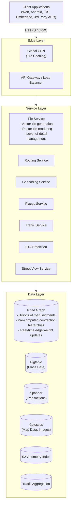
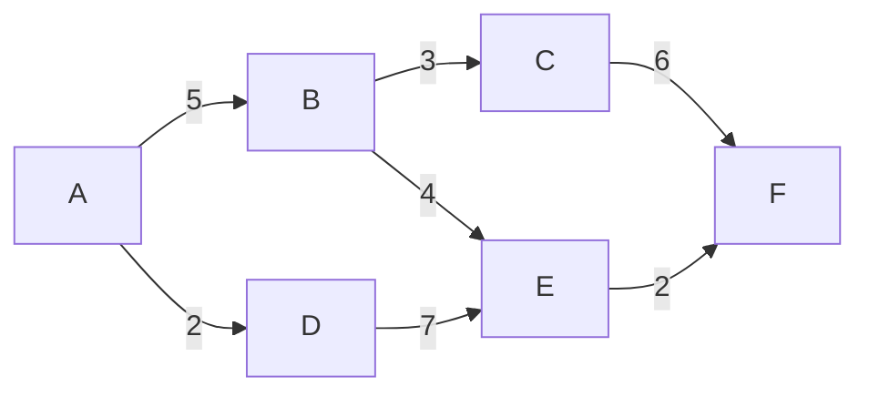
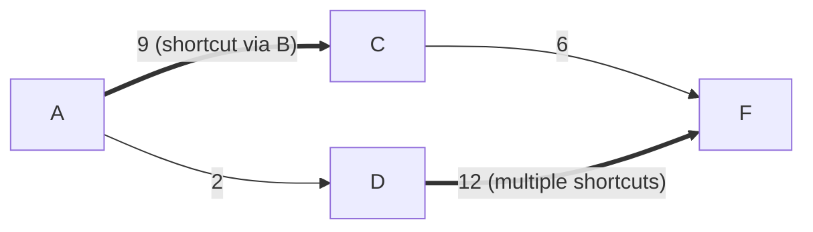
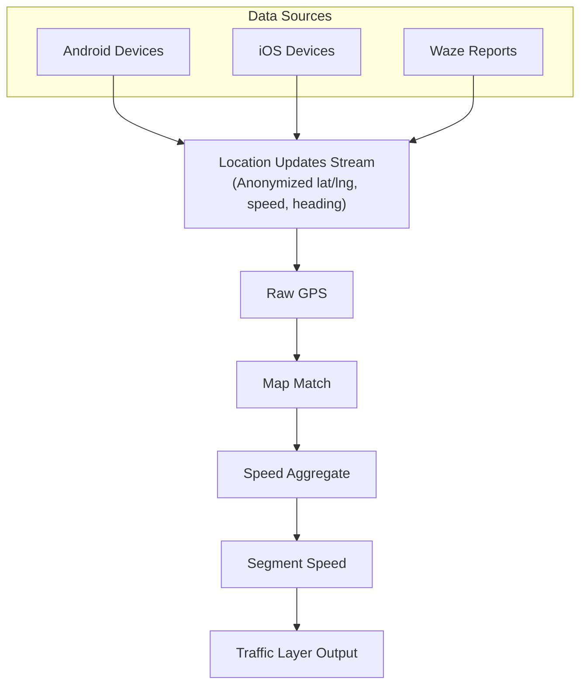

# Google Maps System Design

## TL;DR

Google Maps serves 1B+ monthly users with mapping, navigation, and location services. The architecture centers on: **tile-based map rendering** with vector tiles for efficient delivery, **graph-based routing** using contraction hierarchies for fast path finding, **real-time traffic** from aggregated device data, **geocoding** with probabilistic address parsing, and **spatial indexing** using S2 geometry. Key insight: pre-computation at multiple scales enables sub-second responses for complex geospatial queries.

---

## Core Requirements

### Functional Requirements
1. **Map display** - Render maps at any zoom level globally
2. **Directions** - Calculate routes with multiple transport modes
3. **Search** - Find places by name, category, or address
4. **Real-time traffic** - Show current traffic conditions
5. **ETA calculation** - Predict arrival times accurately
6. **Street View** - Display 360° street-level imagery

### Non-Functional Requirements
1. **Latency** - Map tiles < 100ms, routes < 500ms
2. **Accuracy** - ETA within 10% of actual travel time
3. **Scale** - 1B+ users, 25M+ updates daily
4. **Freshness** - Traffic data < 2 minute lag
5. **Coverage** - 220+ countries and territories

---

## High-Level Architecture



---

## Tile-Based Map Rendering

```
┌─────────────────────────────────────────────────────────────────────────┐
│                    Tile Pyramid (Zoom Levels)                            │
│                                                                          │
│   Zoom 0:   1 tile covers entire world                                  │
│   ┌─────────────────────────────────────────────────────────────────┐   │
│   │                        World                                     │   │
│   └─────────────────────────────────────────────────────────────────┘   │
│                                                                          │
│   Zoom 1:   4 tiles (2x2)                                               │
│   ┌────────────────────┐  ┌────────────────────┐                       │
│   │                    │  │                    │                       │
│   └────────────────────┘  └────────────────────┘                       │
│   ┌────────────────────┐  ┌────────────────────┐                       │
│   │                    │  │                    │                       │
│   └────────────────────┘  └────────────────────┘                       │
│                                                                          │
│   Zoom 20:  ~1 trillion tiles (street level detail)                     │
│                                                                          │
│   Tile addressing: /{z}/{x}/{y}                                         │
│   - z: zoom level (0-22)                                                │
│   - x: column (0 to 2^z - 1)                                            │
│   - y: row (0 to 2^z - 1)                                               │
│                                                                          │
│   ┌──────────────────────────────────────────────────────────────────┐  │
│   │                   Vector Tiles vs Raster Tiles                    │  │
│   │                                                                   │  │
│   │   Raster (PNG):          Vector (PBF):                           │  │
│   │   - Pre-rendered pixels  - Geometry + styling                    │  │
│   │   - Large file size      - Small file size                       │  │
│   │   - Fixed resolution     - Smooth at any zoom                    │  │
│   │   - Can't customize      - Client-side styling                   │  │
│   │                          - Rotation without blur                 │  │
│   └──────────────────────────────────────────────────────────────────┘  │
└─────────────────────────────────────────────────────────────────────────┘
```

### Tile Service Implementation

```python
from dataclasses import dataclass
from typing import List, Optional, Tuple
import math
import struct

@dataclass
class TileCoordinate:
    z: int  # Zoom level
    x: int  # Column
    y: int  # Row
    
    def to_bbox(self) -> Tuple[float, float, float, float]:
        """Convert tile coordinate to lat/lng bounding box"""
        n = 2 ** self.z
        
        lon_min = self.x / n * 360 - 180
        lon_max = (self.x + 1) / n * 360 - 180
        
        lat_max = math.degrees(math.atan(math.sinh(math.pi * (1 - 2 * self.y / n))))
        lat_min = math.degrees(math.atan(math.sinh(math.pi * (1 - 2 * (self.y + 1) / n))))
        
        return (lat_min, lon_min, lat_max, lon_max)


@dataclass
class VectorTileFeature:
    geometry_type: int  # 1=Point, 2=Line, 3=Polygon
    geometry: List[Tuple[int, int]]  # Screen coordinates
    properties: dict


class TileService:
    """
    Generates and serves map tiles at various zoom levels.
    Uses vector tiles for modern clients, raster for legacy.
    """
    
    def __init__(self, feature_store, cache_client, cdn_client):
        self.features = feature_store
        self.cache = cache_client
        self.cdn = cdn_client
        
        # Level of detail thresholds
        self.detail_levels = {
            (0, 4): ["countries", "oceans"],
            (5, 9): ["countries", "states", "major_roads", "major_water"],
            (10, 13): ["cities", "roads", "water", "parks"],
            (14, 16): ["buildings", "streets", "poi_major"],
            (17, 22): ["buildings_detailed", "all_streets", "all_poi"]
        }
    
    async def get_vector_tile(
        self,
        coord: TileCoordinate,
        layers: Optional[List[str]] = None
    ) -> bytes:
        """
        Generate or retrieve cached vector tile.
        Returns Protocol Buffer encoded tile.
        """
        cache_key = f"vtile:{coord.z}:{coord.x}:{coord.y}"
        
        # Check cache
        cached = await self.cache.get(cache_key)
        if cached:
            return cached
        
        # Determine which layers to include based on zoom
        active_layers = self._get_layers_for_zoom(coord.z)
        if layers:
            active_layers = [l for l in active_layers if l in layers]
        
        # Get bounding box
        bbox = coord.to_bbox()
        
        # Fetch features from store
        features = await self.features.query_bbox(
            bbox=bbox,
            layers=active_layers,
            simplification=self._get_simplification(coord.z)
        )
        
        # Build vector tile
        tile = self._build_vector_tile(features, coord)
        
        # Compress
        compressed = self._compress_tile(tile)
        
        # Cache (longer TTL for lower zoom levels)
        ttl = 86400 if coord.z < 10 else 3600
        await self.cache.setex(cache_key, ttl, compressed)
        
        return compressed
    
    def _build_vector_tile(
        self,
        features: List[VectorTileFeature],
        coord: TileCoordinate
    ) -> bytes:
        """
        Build vector tile in Mapbox Vector Tile (MVT) format.
        Uses Protocol Buffers encoding.
        """
        tile = VectorTile()
        
        # Group features by layer
        by_layer = {}
        for feature in features:
            layer = feature.properties.get("layer", "default")
            if layer not in by_layer:
                by_layer[layer] = []
            by_layer[layer].append(feature)
        
        # Build each layer
        for layer_name, layer_features in by_layer.items():
            layer = tile.add_layer(layer_name)
            layer.extent = 4096  # Tile coordinate space
            
            for feature in layer_features:
                # Convert geometry to tile coordinates
                tile_geom = self._to_tile_coords(
                    feature.geometry, 
                    coord,
                    layer.extent
                )
                
                # Encode geometry with delta encoding
                encoded_geom = self._encode_geometry(
                    feature.geometry_type,
                    tile_geom
                )
                
                layer.add_feature(
                    geometry_type=feature.geometry_type,
                    geometry=encoded_geom,
                    properties=feature.properties
                )
        
        return tile.serialize()
    
    def _to_tile_coords(
        self,
        geometry: List[Tuple[float, float]],
        coord: TileCoordinate,
        extent: int
    ) -> List[Tuple[int, int]]:
        """Convert lat/lng to tile coordinate space"""
        bbox = coord.to_bbox()
        lat_min, lon_min, lat_max, lon_max = bbox
        
        result = []
        for lat, lng in geometry:
            x = int((lng - lon_min) / (lon_max - lon_min) * extent)
            y = int((lat_max - lat) / (lat_max - lat_min) * extent)
            result.append((x, y))
        
        return result
    
    def _get_simplification(self, zoom: int) -> float:
        """
        Get geometry simplification tolerance based on zoom.
        Lower zoom = more simplification.
        """
        # Tolerance in degrees
        base_tolerance = 0.0001
        return base_tolerance * (2 ** (20 - zoom))
    
    def _get_layers_for_zoom(self, zoom: int) -> List[str]:
        """Get layers visible at this zoom level"""
        layers = []
        for (min_z, max_z), layer_list in self.detail_levels.items():
            if min_z <= zoom <= max_z:
                layers.extend(layer_list)
        return layers


class TilePrefetcher:
    """
    Prefetch tiles ahead of user viewport for smooth panning.
    """
    
    def __init__(self, tile_service):
        self.tiles = tile_service
        self.prefetch_radius = 2  # Tiles in each direction
    
    async def prefetch_for_viewport(
        self,
        center: TileCoordinate,
        zoom: int
    ):
        """Prefetch tiles around current viewport"""
        coords_to_fetch = []
        
        for dx in range(-self.prefetch_radius, self.prefetch_radius + 1):
            for dy in range(-self.prefetch_radius, self.prefetch_radius + 1):
                x = center.x + dx
                y = center.y + dy
                
                # Validate coordinates
                max_tile = 2 ** zoom - 1
                if 0 <= x <= max_tile and 0 <= y <= max_tile:
                    coords_to_fetch.append(TileCoordinate(zoom, x, y))
        
        # Fetch in parallel
        await asyncio.gather(*[
            self.tiles.get_vector_tile(coord)
            for coord in coords_to_fetch
        ])
```

---

## Routing with Contraction Hierarchies

**Original Graph:**



**After Contraction (shortcuts added):**



> **Query:** Bidirectional search, always go UP in hierarchy
> - Forward search from source (upward only)
> - Backward search from target (upward only)
> - Meet in the middle at high-importance node
> - Unpack shortcuts to get actual path
>
> **Performance:** O(log n) instead of O(n) for Dijkstra

### Routing Service Implementation

```python
from dataclasses import dataclass
from typing import List, Optional, Tuple, Dict
import heapq
from enum import Enum

class TravelMode(Enum):
    DRIVING = "driving"
    WALKING = "walking"
    BICYCLING = "bicycling"
    TRANSIT = "transit"

@dataclass
class RouteStep:
    start_location: Tuple[float, float]
    end_location: Tuple[float, float]
    distance_meters: int
    duration_seconds: int
    polyline: str
    instructions: str
    maneuver: Optional[str]

@dataclass
class Route:
    steps: List[RouteStep]
    distance_meters: int
    duration_seconds: int
    polyline: str
    traffic_duration_seconds: Optional[int]
    warnings: List[str]


class ContractionHierarchyRouter:
    """
    Fast routing using pre-computed contraction hierarchies.
    Reduces query time from O(n) to O(log n).
    """
    
    def __init__(self, graph_store, traffic_service):
        self.graph = graph_store
        self.traffic = traffic_service
        
        # Pre-loaded hierarchy levels
        self.node_levels: Dict[int, int] = {}  # node_id -> level
        self.shortcuts: Dict[Tuple[int, int], List[int]] = {}  # (u, v) -> path
    
    async def find_route(
        self,
        origin: Tuple[float, float],
        destination: Tuple[float, float],
        mode: TravelMode,
        departure_time: Optional[int] = None,
        avoid: Optional[List[str]] = None
    ) -> Route:
        """
        Find optimal route using contraction hierarchy.
        """
        # Snap to nearest road nodes
        origin_node = await self.graph.nearest_node(origin, mode)
        dest_node = await self.graph.nearest_node(destination, mode)
        
        # Run bidirectional CH query
        path_nodes = self._ch_query(origin_node, dest_node, mode)
        
        # Unpack shortcuts to get full path
        full_path = self._unpack_path(path_nodes)
        
        # Get current traffic weights if driving
        if mode == TravelMode.DRIVING and departure_time:
            edge_weights = await self.traffic.get_traffic_weights(
                full_path,
                departure_time
            )
        else:
            edge_weights = None
        
        # Build route with turn-by-turn instructions
        route = await self._build_route(full_path, edge_weights, mode)
        
        return route
    
    def _ch_query(
        self,
        origin: int,
        destination: int,
        mode: TravelMode
    ) -> List[int]:
        """
        Bidirectional contraction hierarchy query.
        Forward search goes up, backward search goes up, meet in middle.
        """
        # Priority queues: (distance, node, previous)
        forward_pq = [(0, origin, None)]
        backward_pq = [(0, destination, None)]
        
        # Visited with distances and predecessors
        forward_visited = {origin: (0, None)}
        backward_visited = {destination: (0, None)}
        
        best_distance = float('inf')
        meeting_node = None
        
        while forward_pq or backward_pq:
            # Forward step
            if forward_pq:
                dist, node, prev = heapq.heappop(forward_pq)
                
                if dist > best_distance:
                    continue
                
                # Check if we've found a better path through this node
                if node in backward_visited:
                    total = dist + backward_visited[node][0]
                    if total < best_distance:
                        best_distance = total
                        meeting_node = node
                
                # Expand only to higher-level nodes
                for neighbor, weight in self._get_upward_edges(node, mode):
                    new_dist = dist + weight
                    if neighbor not in forward_visited or new_dist < forward_visited[neighbor][0]:
                        forward_visited[neighbor] = (new_dist, node)
                        heapq.heappush(forward_pq, (new_dist, neighbor, node))
            
            # Backward step (similar logic)
            if backward_pq:
                dist, node, prev = heapq.heappop(backward_pq)
                
                if dist > best_distance:
                    continue
                
                if node in forward_visited:
                    total = dist + forward_visited[node][0]
                    if total < best_distance:
                        best_distance = total
                        meeting_node = node
                
                for neighbor, weight in self._get_upward_edges_reverse(node, mode):
                    new_dist = dist + weight
                    if neighbor not in backward_visited or new_dist < backward_visited[neighbor][0]:
                        backward_visited[neighbor] = (new_dist, node)
                        heapq.heappush(backward_pq, (new_dist, neighbor, node))
        
        if meeting_node is None:
            raise NoRouteFoundError("No route found between points")
        
        # Reconstruct path
        return self._reconstruct_path(
            meeting_node,
            forward_visited,
            backward_visited
        )
    
    def _get_upward_edges(
        self,
        node: int,
        mode: TravelMode
    ) -> List[Tuple[int, float]]:
        """Get edges to nodes with higher level (upward in hierarchy)"""
        node_level = self.node_levels.get(node, 0)
        edges = []
        
        for neighbor, weight in self.graph.get_edges(node, mode):
            neighbor_level = self.node_levels.get(neighbor, 0)
            if neighbor_level >= node_level:
                edges.append((neighbor, weight))
        
        return edges
    
    def _unpack_path(self, path: List[int]) -> List[int]:
        """Recursively unpack shortcuts to get original path"""
        full_path = [path[0]]
        
        for i in range(len(path) - 1):
            u, v = path[i], path[i + 1]
            
            if (u, v) in self.shortcuts:
                # This is a shortcut - unpack it
                shortcut_path = self.shortcuts[(u, v)]
                full_path.extend(self._unpack_path(shortcut_path)[1:])
            else:
                full_path.append(v)
        
        return full_path
    
    async def _build_route(
        self,
        path: List[int],
        traffic_weights: Optional[Dict],
        mode: TravelMode
    ) -> Route:
        """Build route with instructions from node path"""
        steps = []
        total_distance = 0
        total_duration = 0
        total_traffic_duration = 0
        
        for i in range(len(path) - 1):
            u, v = path[i], path[i + 1]
            
            # Get edge data
            edge = await self.graph.get_edge(u, v)
            
            # Calculate duration
            base_duration = edge.length / edge.speed_limit
            
            if traffic_weights and (u, v) in traffic_weights:
                traffic_duration = edge.length / traffic_weights[(u, v)]
            else:
                traffic_duration = base_duration
            
            # Get coordinates
            u_coord = await self.graph.get_node_location(u)
            v_coord = await self.graph.get_node_location(v)
            
            # Generate instruction
            instruction, maneuver = self._generate_instruction(
                edge, 
                await self.graph.get_edge(path[i-1] if i > 0 else u, u),
            )
            
            steps.append(RouteStep(
                start_location=u_coord,
                end_location=v_coord,
                distance_meters=int(edge.length),
                duration_seconds=int(base_duration),
                polyline=edge.geometry_encoded,
                instructions=instruction,
                maneuver=maneuver
            ))
            
            total_distance += edge.length
            total_duration += base_duration
            total_traffic_duration += traffic_duration
        
        return Route(
            steps=steps,
            distance_meters=int(total_distance),
            duration_seconds=int(total_duration),
            polyline=self._merge_polylines([s.polyline for s in steps]),
            traffic_duration_seconds=int(total_traffic_duration),
            warnings=[]
        )


class AlternativeRouteFinder:
    """
    Find alternative routes that are meaningfully different.
    Uses plateau method to find diverse paths.
    """
    
    def __init__(self, router: ContractionHierarchyRouter):
        self.router = router
        self.similarity_threshold = 0.5  # Max overlap allowed
    
    async def find_alternatives(
        self,
        origin: Tuple[float, float],
        destination: Tuple[float, float],
        mode: TravelMode,
        count: int = 3
    ) -> List[Route]:
        """Find up to 'count' meaningfully different routes"""
        alternatives = []
        
        # Get primary route
        primary = await self.router.find_route(origin, destination, mode)
        alternatives.append(primary)
        
        # Find alternatives using via points
        for via_node in self._find_via_candidates(origin, destination, mode):
            alt_route = await self._route_via(origin, destination, via_node, mode)
            
            if alt_route and not self._too_similar(alt_route, alternatives):
                alternatives.append(alt_route)
                
                if len(alternatives) >= count:
                    break
        
        return alternatives
    
    def _too_similar(self, route: Route, existing: List[Route]) -> bool:
        """Check if route is too similar to existing routes"""
        route_edges = set(self._route_to_edges(route))
        
        for other in existing:
            other_edges = set(self._route_to_edges(other))
            overlap = len(route_edges & other_edges) / len(route_edges | other_edges)
            
            if overlap > self.similarity_threshold:
                return True
        
        return False
```

---

## Real-Time Traffic



**Traffic Layer Output:**

| Speed Ratio | Color  | Edge Weight Multiplier     |
|-------------|--------|----------------------------|
| > 0.8       | Green  | 1.0 (free flow)            |
| 0.5 - 0.8   | Yellow | 1.3                        |
| 0.25 - 0.5  | Orange | 2.0                        |
| < 0.25      | Red    | 3.0+ (severe congestion)   |

### Traffic Service Implementation

```python
from dataclasses import dataclass
from typing import Dict, List, Tuple, Optional
import time
from collections import defaultdict

@dataclass
class TrafficSegment:
    segment_id: str
    speed_kmh: float
    free_flow_speed: float
    confidence: float
    updated_at: int

@dataclass
class TrafficIncident:
    incident_id: str
    location: Tuple[float, float]
    incident_type: str  # "accident", "construction", "road_closure"
    severity: int  # 1-5
    description: str
    start_time: int
    end_time: Optional[int]


class TrafficService:
    """
    Aggregates real-time traffic data from device probes.
    Updates edge weights for routing.
    """
    
    def __init__(self, stream_processor, segment_store, incident_store):
        self.stream = stream_processor
        self.segments = segment_store
        self.incidents = incident_store
        
        # Aggregation window
        self.window_seconds = 120  # 2 minute windows
        
        # Min samples for confidence
        self.min_samples = 5
    
    async def process_location_update(
        self,
        device_id: str,  # Anonymized
        lat: float,
        lng: float,
        speed_mps: float,
        heading: float,
        timestamp: int
    ):
        """Process incoming location update from device"""
        # Map match to road segment
        segment_id = await self._map_match(lat, lng, heading)
        
        if not segment_id:
            return  # Couldn't match to road
        
        # Add to aggregation window
        window_key = self._get_window_key(segment_id, timestamp)
        
        await self.stream.add_to_window(
            window_key,
            {
                "speed": speed_mps * 3.6,  # Convert to km/h
                "timestamp": timestamp
            }
        )
    
    async def aggregate_window(self, window_key: str):
        """
        Called when aggregation window closes.
        Computes average speed for segment.
        """
        segment_id, window_start = self._parse_window_key(window_key)
        
        # Get all samples in window
        samples = await self.stream.get_window_samples(window_key)
        
        if len(samples) < self.min_samples:
            return  # Not enough data
        
        # Compute median speed (robust to outliers)
        speeds = sorted([s["speed"] for s in samples])
        median_speed = speeds[len(speeds) // 2]
        
        # Get free flow speed for segment
        segment_info = await self.segments.get_segment(segment_id)
        free_flow = segment_info.speed_limit * 0.95  # Assume 95% of limit is free flow
        
        # Calculate confidence based on sample count
        confidence = min(1.0, len(samples) / 20)
        
        # Store traffic segment
        traffic = TrafficSegment(
            segment_id=segment_id,
            speed_kmh=median_speed,
            free_flow_speed=free_flow,
            confidence=confidence,
            updated_at=window_start
        )
        
        await self.segments.update_traffic(traffic)
    
    async def get_traffic_weights(
        self,
        path: List[int],
        departure_time: int
    ) -> Dict[Tuple[int, int], float]:
        """
        Get traffic-adjusted edge weights for a path.
        Returns speed in km/h for each edge.
        """
        weights = {}
        
        for i in range(len(path) - 1):
            u, v = path[i], path[i + 1]
            segment_id = f"{u}_{v}"
            
            traffic = await self.segments.get_traffic(segment_id)
            
            if traffic and traffic.confidence > 0.5:
                # Use real traffic data
                weights[(u, v)] = traffic.speed_kmh
            else:
                # Fall back to historical/predicted
                predicted = await self._predict_speed(
                    segment_id, 
                    departure_time
                )
                weights[(u, v)] = predicted
        
        return weights
    
    async def _predict_speed(
        self,
        segment_id: str,
        time_of_day: int
    ) -> float:
        """
        Predict speed using historical patterns.
        Uses day-of-week and time-of-day patterns.
        """
        # Get historical speed patterns
        patterns = await self.segments.get_historical_patterns(segment_id)
        
        # Find matching time slot (15-minute buckets)
        day_of_week = time.gmtime(time_of_day).tm_wday
        hour = time.gmtime(time_of_day).tm_hour
        minute = time.gmtime(time_of_day).tm_min
        
        bucket = hour * 4 + minute // 15
        
        if patterns and day_of_week in patterns:
            return patterns[day_of_week].get(bucket, patterns["default"])
        
        # Fall back to segment speed limit
        segment = await self.segments.get_segment(segment_id)
        return segment.speed_limit * 0.7  # Assume 70% of limit


class TrafficTileGenerator:
    """
    Generate traffic overlay tiles for map display.
    """
    
    def __init__(self, traffic_service, tile_service):
        self.traffic = traffic_service
        self.tiles = tile_service
        
        # Color mapping
        self.colors = {
            (0.8, 1.0): "#00FF00",   # Green - free flow
            (0.5, 0.8): "#FFFF00",   # Yellow - slow
            (0.25, 0.5): "#FFA500",  # Orange - heavy
            (0.0, 0.25): "#FF0000",  # Red - severe
        }
    
    async def generate_traffic_tile(
        self,
        coord: TileCoordinate
    ) -> bytes:
        """Generate traffic overlay tile"""
        bbox = coord.to_bbox()
        
        # Get segments in bbox
        segments = await self.tiles.get_road_segments(bbox)
        
        features = []
        for segment in segments:
            traffic = await self.traffic.get_segment_traffic(segment.id)
            
            if traffic:
                ratio = traffic.speed_kmh / traffic.free_flow_speed
                color = self._get_color(ratio)
                
                features.append({
                    "type": "Feature",
                    "geometry": segment.geometry,
                    "properties": {
                        "color": color,
                        "speed_ratio": ratio,
                        "layer": "traffic"
                    }
                })
        
        return self._build_traffic_tile(features, coord)
    
    def _get_color(self, ratio: float) -> str:
        for (min_r, max_r), color in self.colors.items():
            if min_r <= ratio < max_r:
                return color
        return self.colors[(0.0, 0.25)]  # Default to red
```

---

## Geocoding & Places

```python
from dataclasses import dataclass
from typing import List, Optional, Tuple
import re

@dataclass
class GeocodingResult:
    formatted_address: str
    location: Tuple[float, float]
    place_id: str
    types: List[str]
    confidence: float
    components: dict

@dataclass
class Place:
    place_id: str
    name: str
    location: Tuple[float, float]
    types: List[str]
    rating: Optional[float]
    user_ratings_total: Optional[int]
    address: str
    opening_hours: Optional[dict]


class GeocodingService:
    """
    Convert addresses to coordinates (geocoding) and
    coordinates to addresses (reverse geocoding).
    """
    
    def __init__(self, address_parser, place_index, s2_index):
        self.parser = address_parser
        self.places = place_index
        self.s2 = s2_index
    
    async def geocode(
        self,
        address: str,
        region: Optional[str] = None,
        bounds: Optional[Tuple[float, float, float, float]] = None
    ) -> List[GeocodingResult]:
        """
        Convert address string to coordinates.
        Uses probabilistic parsing to handle various formats.
        """
        # Parse address into components
        parsed = await self.parser.parse(address)
        
        # Search for matching places
        candidates = await self._find_candidates(parsed, region, bounds)
        
        # Score and rank candidates
        scored = []
        for candidate in candidates:
            score = self._score_candidate(candidate, parsed)
            scored.append((candidate, score))
        
        scored.sort(key=lambda x: x[1], reverse=True)
        
        # Convert to results
        results = []
        for candidate, score in scored[:5]:
            results.append(GeocodingResult(
                formatted_address=self._format_address(candidate),
                location=candidate.location,
                place_id=candidate.place_id,
                types=candidate.types,
                confidence=score,
                components=candidate.components
            ))
        
        return results
    
    async def reverse_geocode(
        self,
        lat: float,
        lng: float,
        result_types: Optional[List[str]] = None
    ) -> List[GeocodingResult]:
        """
        Convert coordinates to address.
        Uses S2 geometry for efficient spatial lookup.
        """
        # Get S2 cell covering this point
        cell_id = self.s2.cell_from_point(lat, lng)
        
        # Find nearest address points
        nearby = await self.places.find_nearby(
            cell_id,
            radius_meters=100,
            types=["street_address", "route", "locality"]
        )
        
        if not nearby:
            # Expand search radius
            nearby = await self.places.find_nearby(
                cell_id,
                radius_meters=1000,
                types=result_types
            )
        
        # Sort by distance
        results = []
        for place in nearby:
            distance = self._haversine_distance(
                (lat, lng),
                place.location
            )
            
            results.append((place, distance))
        
        results.sort(key=lambda x: x[1])
        
        # Build results
        return [
            GeocodingResult(
                formatted_address=self._format_address(place),
                location=place.location,
                place_id=place.place_id,
                types=place.types,
                confidence=1.0 - (distance / 1000),  # Decay with distance
                components=place.components
            )
            for place, distance in results[:5]
        ]
    
    async def _find_candidates(
        self,
        parsed: dict,
        region: Optional[str],
        bounds: Optional[Tuple]
    ) -> List[Place]:
        """Find candidate matches for parsed address"""
        queries = []
        
        # Try exact match first
        if parsed.get("street_number") and parsed.get("route"):
            queries.append({
                "street_number": parsed["street_number"],
                "route": parsed["route"],
                "locality": parsed.get("locality")
            })
        
        # Try without number
        if parsed.get("route"):
            queries.append({
                "route": parsed["route"],
                "locality": parsed.get("locality")
            })
        
        # Try just locality
        if parsed.get("locality"):
            queries.append({
                "locality": parsed["locality"],
                "administrative_area": parsed.get("administrative_area")
            })
        
        candidates = []
        for query in queries:
            results = await self.places.search(
                query,
                region=region,
                bounds=bounds,
                limit=10
            )
            candidates.extend(results)
        
        return candidates


class PlacesService:
    """
    Search and retrieve place information.
    Uses S2 geometry for spatial indexing.
    """
    
    def __init__(self, bigtable_client, s2_index, autocomplete_index):
        self.bigtable = bigtable_client
        self.s2 = s2_index
        self.autocomplete = autocomplete_index
    
    async def nearby_search(
        self,
        location: Tuple[float, float],
        radius_meters: int,
        types: Optional[List[str]] = None,
        keyword: Optional[str] = None
    ) -> List[Place]:
        """
        Find places near a location.
        Uses S2 covering to efficiently query spatial index.
        """
        # Get S2 cells covering the search area
        center_cell = self.s2.cell_from_point(location[0], location[1])
        covering = self.s2.get_covering(
            center_cell,
            radius_meters,
            max_cells=8
        )
        
        # Query each cell
        all_places = []
        for cell_id in covering:
            places = await self.bigtable.scan(
                table="places",
                row_prefix=f"s2:{cell_id}",
                filter=types
            )
            all_places.extend(places)
        
        # Filter by actual distance and keyword
        results = []
        for place in all_places:
            distance = self._haversine_distance(location, place.location)
            
            if distance > radius_meters:
                continue
            
            if keyword and keyword.lower() not in place.name.lower():
                continue
            
            if types and not any(t in place.types for t in types):
                continue
            
            results.append(place)
        
        # Sort by relevance (popularity + distance)
        results.sort(key=lambda p: self._rank_place(p, location))
        
        return results[:20]
    
    async def text_search(
        self,
        query: str,
        location: Optional[Tuple[float, float]] = None,
        radius_meters: Optional[int] = None
    ) -> List[Place]:
        """
        Search places by text query.
        Combines text search with optional location bias.
        """
        # Text search in Elasticsearch
        text_results = await self.elasticsearch.search(
            index="places",
            query={
                "bool": {
                    "must": [
                        {"match": {"name": query}}
                    ]
                }
            }
        )
        
        if location and radius_meters:
            # Filter to radius
            results = [
                p for p in text_results
                if self._haversine_distance(location, p.location) <= radius_meters
            ]
            
            # Re-rank with location bias
            results.sort(key=lambda p: self._rank_place(p, location))
        else:
            results = text_results
        
        return results
    
    async def autocomplete(
        self,
        input: str,
        session_token: str,
        location: Optional[Tuple[float, float]] = None,
        types: Optional[List[str]] = None
    ) -> List[dict]:
        """
        Provide autocomplete suggestions as user types.
        Optimized for low latency with prefix search.
        """
        # Get prefix matches from trie-based index
        suggestions = await self.autocomplete.prefix_search(
            input.lower(),
            limit=10,
            types=types
        )
        
        # Add location bias if provided
        if location:
            for s in suggestions:
                distance = self._haversine_distance(location, s["location"])
                s["distance_meters"] = distance
            
            suggestions.sort(key=lambda s: (
                -s.get("popularity", 0) + s["distance_meters"] / 10000
            ))
        
        return suggestions[:5]
```

---

## Key Metrics & Scale

| Metric | Value |
|--------|-------|
| **Monthly Active Users** | 1B+ |
| **Countries Covered** | 220+ |
| **Road Network** | 25M+ miles mapped |
| **Street View Coverage** | 10M+ miles |
| **Daily Routing Requests** | Billions |
| **Route Calculation Time** | < 500ms |
| **Tile Requests/Second** | Millions |
| **Traffic Update Latency** | < 2 minutes |
| **Location Updates/Day** | Billions |
| **Places in Database** | 200M+ |

---

## Key Takeaways

1. **Tile-based rendering** - Pyramid of pre-rendered tiles at each zoom level. Vector tiles enable client-side styling and smooth zoom.

2. **Contraction hierarchies** - Pre-compute shortcuts to reduce routing from O(n) to O(log n). Critical for real-time route calculation.

3. **S2 geometry** - Hierarchical spatial indexing for efficient geo queries. Cells at multiple levels enable range queries and covering.

4. **Crowd-sourced traffic** - Aggregate anonymous device location updates. Map matching converts GPS to road segments.

5. **Multi-scale detail** - Different map features visible at different zoom levels. Roads simplify at lower zooms, POIs appear at higher zooms.

6. **Edge weight updates** - Traffic conditions update edge weights in real-time. Routing uses current weights, not just distance.

7. **Probabilistic geocoding** - Parse addresses into components, score multiple interpretations, return ranked candidates.

8. **Extensive pre-computation** - Tile generation, routing hierarchies, traffic patterns computed offline. Online queries just look up results.
