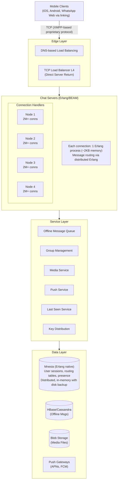
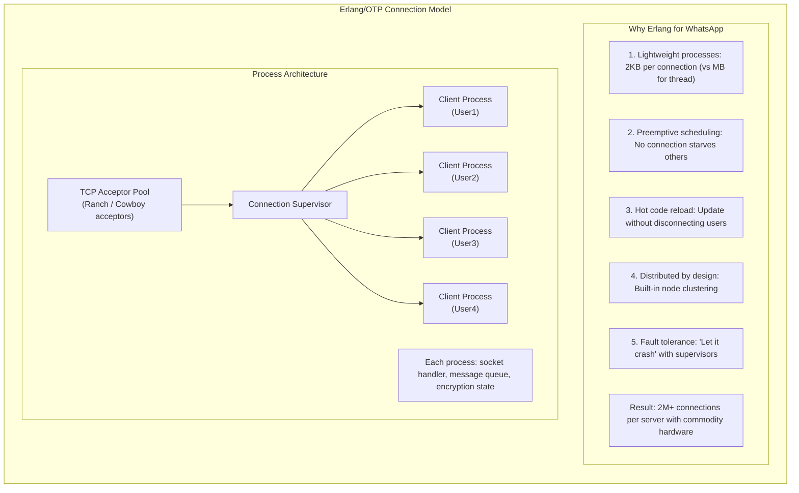
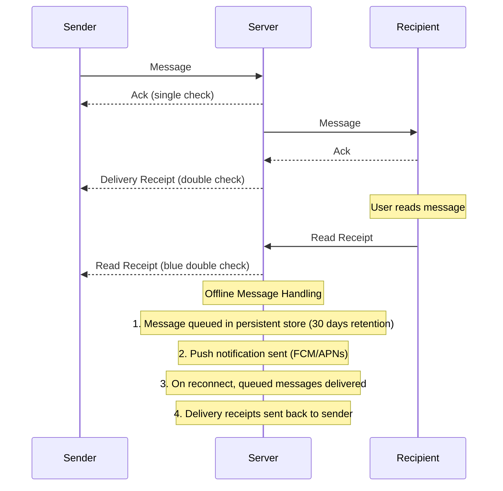

# WhatsApp System Design

## TL;DR

WhatsApp delivers 100B+ messages daily to 2B+ users with end-to-end encryption. The architecture centers on: **Erlang/BEAM for connection handling** (millions of connections per server), **XMPP-based protocol** for messaging, **end-to-end encryption** using Signal Protocol, **offline message queuing** with delivery receipts, and **media delivery via CDN** with encrypted blobs. Key insight: extreme efficiency per server (1 engineer : 14M users at acquisition) through careful technology choices and minimal feature set.

---

## Core Requirements

### Functional Requirements
1. **1:1 messaging** - Send text, images, videos, documents
2. **Group messaging** - Up to 1024 members per group
3. **Voice/video calls** - Peer-to-peer with server relay fallback
4. **Status updates** - Ephemeral 24-hour stories
5. **Delivery status** - Sent, delivered, read receipts
6. **End-to-end encryption** - Messages only readable by participants

### Non-Functional Requirements
1. **Latency** - Message delivery < 200ms when online
2. **Reliability** - Never lose messages, offline queue for days
3. **Scale** - 2B+ users, 100B+ messages/day
4. **Efficiency** - Minimize battery, bandwidth, server costs
5. **Security** - E2E encryption, no server-side message storage

---

## High-Level Architecture



---

## Erlang Connection Architecture



### Connection Handler Implementation

```erlang
-module(wa_connection).
-behaviour(gen_server).

-export([start_link/1, send_message/2, disconnect/1]).
-export([init/1, handle_call/3, handle_cast/2, handle_info/2, terminate/2]).

-record(state, {
    socket,
    user_id,
    session_key,
    last_seen,
    pending_acks = #{},      % message_id -> {timestamp, retries}
    message_queue = queue:new()
}).

%% Client connects
start_link(Socket) ->
    gen_server:start_link(?MODULE, [Socket], []).

init([Socket]) ->
    %% Set socket options for WhatsApp protocol
    ok = inet:setopts(Socket, [
        binary,
        {packet, 4},       % Length-prefixed frames
        {active, once},    % Flow control
        {nodelay, true},   % Disable Nagle for low latency
        {keepalive, true}
    ]),
    
    %% Wait for authentication
    {ok, #state{socket = Socket}, 30000}. % 30s auth timeout

handle_info({tcp, Socket, Data}, State) ->
    %% Reactivate socket for next message
    inet:setopts(Socket, [{active, once}]),
    
    %% Parse and handle message
    case wa_protocol:decode(Data) of
        {auth, AuthData} ->
            handle_auth(AuthData, State);
        {message, Msg} ->
            handle_incoming_message(Msg, State);
        {ack, MsgId} ->
            handle_ack(MsgId, State);
        {receipt, Receipt} ->
            handle_receipt(Receipt, State);
        {ping, _} ->
            send_pong(State),
            {noreply, State#state{last_seen = erlang:system_time(second)}};
        _ ->
            {noreply, State}
    end;

handle_info({tcp_closed, _Socket}, State) ->
    %% Client disconnected - cleanup
    cleanup_session(State),
    {stop, normal, State};

handle_info(check_pending_acks, State) ->
    %% Retry unacked messages
    NewState = retry_pending_messages(State),
    erlang:send_after(5000, self(), check_pending_acks),
    {noreply, NewState};

handle_info({deliver_message, From, Msg}, State) ->
    %% Message from another user for this connection
    case State#state.socket of
        undefined ->
            %% User offline - queue for later or push
            queue_offline_message(State#state.user_id, From, Msg),
            {noreply, State};
        Socket ->
            %% Deliver immediately
            Encoded = wa_protocol:encode({message, From, Msg}),
            gen_tcp:send(Socket, Encoded),
            
            %% Track for ack
            MsgId = maps:get(id, Msg),
            PendingAcks = maps:put(MsgId, {erlang:system_time(second), 0}, 
                                   State#state.pending_acks),
            {noreply, State#state{pending_acks = PendingAcks}}
    end.

handle_auth(AuthData, State) ->
    case wa_auth:verify(AuthData) of
        {ok, UserId, SessionKey} ->
            %% Register this process for the user
            wa_registry:register(UserId, self()),
            
            %% Load and deliver offline messages
            OfflineMsgs = wa_offline:get_messages(UserId),
            lists:foreach(fun(Msg) ->
                self() ! {deliver_message, maps:get(from, Msg), Msg}
            end, OfflineMsgs),
            wa_offline:clear(UserId),
            
            %% Start ack checker
            erlang:send_after(5000, self(), check_pending_acks),
            
            %% Send auth success
            send_auth_success(State#state.socket),
            
            {noreply, State#state{
                user_id = UserId,
                session_key = SessionKey,
                last_seen = erlang:system_time(second)
            }};
        {error, _Reason} ->
            gen_tcp:close(State#state.socket),
            {stop, auth_failed, State}
    end.

handle_incoming_message(Msg, State) ->
    %% Message from this client to another user
    ToUser = maps:get(to, Msg),
    MsgId = maps:get(id, Msg),
    
    %% Send ack to sender
    send_ack(State#state.socket, MsgId),
    
    %% Route to recipient
    case wa_registry:lookup(ToUser) of
        {ok, Pid} when is_pid(Pid) ->
            %% User online on this cluster
            Pid ! {deliver_message, State#state.user_id, Msg},
            send_delivery_receipt(State#state.socket, MsgId, delivered);
        {ok, {Node, Pid}} ->
            %% User on different node
            {wa_connection, Node} ! {deliver_message, ToUser, State#state.user_id, Msg};
        not_found ->
            %% User offline - queue message
            wa_offline:store(ToUser, State#state.user_id, Msg),
            %% Send push notification
            wa_push:send(ToUser, Msg)
    end,
    
    {noreply, State}.

%% Send message to a user (called from other processes)
send_message(Pid, Msg) when is_pid(Pid) ->
    Pid ! {deliver_message, maps:get(from, Msg), Msg}.

retry_pending_messages(State) ->
    Now = erlang:system_time(second),
    MaxRetries = 3,
    RetryInterval = 5,
    
    NewPending = maps:filtermap(fun(MsgId, {Timestamp, Retries}) ->
        case Now - Timestamp > RetryInterval of
            true when Retries < MaxRetries ->
                %% Retry
                resend_message(State#state.socket, MsgId),
                {true, {Now, Retries + 1}};
            true ->
                %% Max retries exceeded - message lost
                log_failed_delivery(MsgId),
                false;
            false ->
                {true, {Timestamp, Retries}}
        end
    end, State#state.pending_acks),
    
    State#state{pending_acks = NewPending}.
```

---

## End-to-End Encryption (Signal Protocol)

```
┌─────────────────────────────────────────────────────────────────────────┐
│                    Signal Protocol Overview                              │
│                                                                          │
│   ┌──────────────────────────────────────────────────────────────────┐  │
│   │                    Key Types                                      │  │
│   │                                                                   │  │
│   │   Identity Key:     Long-term key pair (per device)              │  │
│   │   Signed Pre-Key:   Medium-term key, rotated periodically        │  │
│   │   One-Time Pre-Keys: Single-use keys for initial key exchange    │  │
│   │   Session Keys:     Derived keys for message encryption          │  │
│   └──────────────────────────────────────────────────────────────────┘  │
│                                                                          │
│   ┌──────────────────────────────────────────────────────────────────┐  │
│   │                    Initial Key Exchange (X3DH)                    │  │
│   │                                                                   │  │
│   │   Alice wants to message Bob (who may be offline):               │  │
│   │                                                                   │  │
│   │   1. Alice fetches from server:                                  │  │
│   │      - Bob's Identity Key (IKB)                                  │  │
│   │      - Bob's Signed Pre-Key (SPKB)                               │  │
│   │      - One of Bob's One-Time Pre-Keys (OPKB)                     │  │
│   │                                                                   │  │
│   │   2. Alice computes shared secret:                               │  │
│   │      DH1 = DH(IKA, SPKB)                                         │  │
│   │      DH2 = DH(EKA, IKB)                                          │  │
│   │      DH3 = DH(EKA, SPKB)                                         │  │
│   │      DH4 = DH(EKA, OPKB)                                         │  │
│   │      SK = KDF(DH1 || DH2 || DH3 || DH4)                          │  │
│   │                                                                   │  │
│   │   3. Alice sends first message + ephemeral key (EKA)             │  │
│   │                                                                   │  │
│   │   4. Bob can derive same SK using his private keys              │  │
│   └──────────────────────────────────────────────────────────────────┘  │
│                                                                          │
│   ┌──────────────────────────────────────────────────────────────────┐  │
│   │                    Double Ratchet (Per-Message)                   │  │
│   │                                                                   │  │
│   │   Each message uses new keys via two ratchets:                   │  │
│   │                                                                   │  │
│   │   DH Ratchet:     New DH exchange on each reply                  │  │
│   │                   (provides forward secrecy)                     │  │
│   │                                                                   │  │
│   │   Symmetric Ratchet: KDF chain for consecutive messages          │  │
│   │                      (allows async messaging)                    │  │
│   │                                                                   │  │
│   │   Result: Compromise of one key doesn't reveal past/future msgs  │  │
│   └──────────────────────────────────────────────────────────────────┘  │
└─────────────────────────────────────────────────────────────────────────┘
```

### Encryption Implementation

```python
from dataclasses import dataclass
from typing import Optional, Tuple, Dict
from cryptography.hazmat.primitives.asymmetric.x25519 import X25519PrivateKey, X25519PublicKey
from cryptography.hazmat.primitives import hashes
from cryptography.hazmat.primitives.kdf.hkdf import HKDF
from cryptography.hazmat.primitives.ciphers.aead import AESGCM
import os

@dataclass
class KeyBundle:
    """Public keys published to server for initial key exchange"""
    identity_key: bytes
    signed_prekey: bytes
    signed_prekey_signature: bytes
    one_time_prekeys: list  # List of (id, public_key) tuples


@dataclass
class SessionState:
    """State of an encrypted session with a peer"""
    root_key: bytes
    sending_chain_key: bytes
    receiving_chain_key: Optional[bytes]
    sending_ratchet_key: X25519PrivateKey
    receiving_ratchet_key: Optional[X25519PublicKey]
    message_number_sending: int = 0
    message_number_receiving: int = 0
    previous_counter: int = 0
    skipped_message_keys: Dict[Tuple[bytes, int], bytes] = None


class SignalProtocol:
    """
    Implementation of Signal Protocol for E2E encryption.
    Used by WhatsApp for message encryption.
    """
    
    def __init__(self, identity_key: X25519PrivateKey):
        self.identity_key = identity_key
        self.signed_prekey = X25519PrivateKey.generate()
        self.one_time_prekeys = []
        self.sessions: Dict[str, SessionState] = {}
        
        # Generate initial one-time prekeys
        for _ in range(100):
            self.one_time_prekeys.append(X25519PrivateKey.generate())
    
    def get_key_bundle(self) -> KeyBundle:
        """Get public keys to publish to server"""
        # Sign the signed prekey with identity key
        signature = self._sign_key(
            self.signed_prekey.public_key().public_bytes_raw()
        )
        
        return KeyBundle(
            identity_key=self.identity_key.public_key().public_bytes_raw(),
            signed_prekey=self.signed_prekey.public_key().public_bytes_raw(),
            signed_prekey_signature=signature,
            one_time_prekeys=[
                (i, k.public_key().public_bytes_raw())
                for i, k in enumerate(self.one_time_prekeys)
            ]
        )
    
    def initiate_session(
        self,
        peer_id: str,
        peer_bundle: KeyBundle,
        used_one_time_key_id: Optional[int] = None
    ) -> bytes:
        """
        Initiate session using X3DH key exchange.
        Returns ephemeral key to send with first message.
        """
        # Generate ephemeral key
        ephemeral_key = X25519PrivateKey.generate()
        
        # Parse peer's public keys
        peer_identity = X25519PublicKey.from_public_bytes(peer_bundle.identity_key)
        peer_signed_prekey = X25519PublicKey.from_public_bytes(peer_bundle.signed_prekey)
        
        # Compute DH values
        dh1 = self._dh(self.identity_key, peer_signed_prekey)
        dh2 = self._dh(ephemeral_key, peer_identity)
        dh3 = self._dh(ephemeral_key, peer_signed_prekey)
        
        if used_one_time_key_id is not None:
            peer_one_time = X25519PublicKey.from_public_bytes(
                peer_bundle.one_time_prekeys[used_one_time_key_id][1]
            )
            dh4 = self._dh(ephemeral_key, peer_one_time)
            shared_secret = dh1 + dh2 + dh3 + dh4
        else:
            shared_secret = dh1 + dh2 + dh3
        
        # Derive initial keys
        root_key, chain_key = self._kdf_rk(shared_secret, b"WhatsAppInitial")
        
        # Create session
        self.sessions[peer_id] = SessionState(
            root_key=root_key,
            sending_chain_key=chain_key,
            receiving_chain_key=None,
            sending_ratchet_key=ephemeral_key,
            receiving_ratchet_key=peer_signed_prekey,
            skipped_message_keys={}
        )
        
        return ephemeral_key.public_key().public_bytes_raw()
    
    def encrypt_message(
        self,
        peer_id: str,
        plaintext: bytes
    ) -> Tuple[bytes, bytes, int]:
        """
        Encrypt message using current session.
        Returns (ciphertext, ratchet_public_key, message_number).
        """
        session = self.sessions[peer_id]
        
        # Derive message key from chain
        message_key, new_chain_key = self._kdf_ck(session.sending_chain_key)
        session.sending_chain_key = new_chain_key
        
        # Encrypt with AES-GCM
        nonce = os.urandom(12)
        cipher = AESGCM(message_key)
        
        # Associated data includes header info
        ad = (
            session.sending_ratchet_key.public_key().public_bytes_raw() +
            session.message_number_sending.to_bytes(4, 'big')
        )
        
        ciphertext = nonce + cipher.encrypt(nonce, plaintext, ad)
        
        msg_number = session.message_number_sending
        session.message_number_sending += 1
        
        return (
            ciphertext,
            session.sending_ratchet_key.public_key().public_bytes_raw(),
            msg_number
        )
    
    def decrypt_message(
        self,
        peer_id: str,
        ciphertext: bytes,
        ratchet_key: bytes,
        message_number: int
    ) -> bytes:
        """Decrypt received message"""
        session = self.sessions[peer_id]
        
        peer_ratchet = X25519PublicKey.from_public_bytes(ratchet_key)
        
        # Check if we need to ratchet
        if session.receiving_ratchet_key is None or \
           ratchet_key != session.receiving_ratchet_key.public_bytes_raw():
            # New ratchet key - advance DH ratchet
            self._dh_ratchet(session, peer_ratchet)
        
        # Try skipped message keys first
        key_id = (ratchet_key, message_number)
        if key_id in session.skipped_message_keys:
            message_key = session.skipped_message_keys.pop(key_id)
        else:
            # Skip ahead if needed
            while session.message_number_receiving < message_number:
                mk, session.receiving_chain_key = self._kdf_ck(
                    session.receiving_chain_key
                )
                session.skipped_message_keys[
                    (ratchet_key, session.message_number_receiving)
                ] = mk
                session.message_number_receiving += 1
            
            message_key, session.receiving_chain_key = self._kdf_ck(
                session.receiving_chain_key
            )
            session.message_number_receiving += 1
        
        # Decrypt
        nonce = ciphertext[:12]
        ct = ciphertext[12:]
        ad = ratchet_key + message_number.to_bytes(4, 'big')
        
        cipher = AESGCM(message_key)
        return cipher.decrypt(nonce, ct, ad)
    
    def _dh_ratchet(self, session: SessionState, peer_ratchet: X25519PublicKey):
        """Advance the DH ratchet"""
        # Store old receiving chain key for skipped messages
        session.previous_counter = session.message_number_receiving
        session.message_number_receiving = 0
        session.message_number_sending = 0
        
        # Update receiving chain
        dh_out = self._dh(session.sending_ratchet_key, peer_ratchet)
        session.root_key, session.receiving_chain_key = self._kdf_rk(
            session.root_key, dh_out
        )
        session.receiving_ratchet_key = peer_ratchet
        
        # Generate new sending ratchet
        session.sending_ratchet_key = X25519PrivateKey.generate()
        dh_out = self._dh(session.sending_ratchet_key, peer_ratchet)
        session.root_key, session.sending_chain_key = self._kdf_rk(
            session.root_key, dh_out
        )
    
    def _dh(self, private: X25519PrivateKey, public: X25519PublicKey) -> bytes:
        """Diffie-Hellman key exchange"""
        return private.exchange(public)
    
    def _kdf_rk(self, root_key: bytes, dh_output: bytes) -> Tuple[bytes, bytes]:
        """Root key KDF"""
        output = HKDF(
            algorithm=hashes.SHA256(),
            length=64,
            salt=root_key,
            info=b"WhatsAppRootKey"
        ).derive(dh_output)
        return output[:32], output[32:]
    
    def _kdf_ck(self, chain_key: bytes) -> Tuple[bytes, bytes]:
        """Chain key KDF"""
        message_key = HKDF(
            algorithm=hashes.SHA256(),
            length=32,
            salt=None,
            info=b"WhatsAppMessageKey"
        ).derive(chain_key + b"\x01")
        
        new_chain_key = HKDF(
            algorithm=hashes.SHA256(),
            length=32,
            salt=None,
            info=b"WhatsAppChainKey"
        ).derive(chain_key + b"\x02")
        
        return message_key, new_chain_key
```

---

## Message Delivery Flow



### Message Queue Implementation

```python
from dataclasses import dataclass
from typing import List, Optional
import time

@dataclass
class QueuedMessage:
    message_id: str
    from_user: str
    to_user: str
    encrypted_content: bytes
    timestamp: int
    priority: int  # Higher = more important (calls > messages)
    expiry: int  # When to delete if not delivered


class OfflineMessageQueue:
    """
    Stores messages for offline users.
    Uses HBase/Cassandra for persistence with TTL.
    """
    
    def __init__(self, hbase_client, push_service, config):
        self.hbase = hbase_client
        self.push = push_service
        self.max_queue_size = config.get("max_queue_size", 1000)
        self.retention_days = config.get("retention_days", 30)
    
    async def queue_message(
        self,
        from_user: str,
        to_user: str,
        message: dict
    ):
        """Queue message for offline user"""
        message_id = message["id"]
        timestamp = int(time.time() * 1000)
        expiry = timestamp + (self.retention_days * 24 * 60 * 60 * 1000)
        
        queued = QueuedMessage(
            message_id=message_id,
            from_user=from_user,
            to_user=to_user,
            encrypted_content=message["encrypted_content"],
            timestamp=timestamp,
            priority=self._get_priority(message.get("type", "text")),
            expiry=expiry
        )
        
        # Store in HBase with user as row key
        row_key = f"{to_user}#{timestamp}#{message_id}"
        
        await self.hbase.put(
            table="offline_messages",
            row=row_key,
            data={
                "msg:from": from_user,
                "msg:content": queued.encrypted_content,
                "msg:priority": str(queued.priority),
                "msg:expiry": str(expiry)
            },
            ttl=self.retention_days * 24 * 60 * 60
        )
        
        # Check queue size
        queue_size = await self._get_queue_size(to_user)
        if queue_size > self.max_queue_size:
            # Remove oldest low-priority messages
            await self._prune_queue(to_user)
        
        # Send push notification
        await self.push.notify(
            to_user,
            from_user=from_user,
            message_type=message.get("type", "text"),
            preview=None  # No preview - E2E encrypted
        )
    
    async def get_messages(
        self,
        user_id: str,
        limit: int = 100
    ) -> List[QueuedMessage]:
        """Get queued messages for user"""
        # Scan HBase with user prefix
        start_row = f"{user_id}#"
        end_row = f"{user_id}$"
        
        results = await self.hbase.scan(
            table="offline_messages",
            start_row=start_row,
            end_row=end_row,
            limit=limit
        )
        
        messages = []
        for row_key, data in results:
            parts = row_key.split("#")
            message_id = parts[2]
            timestamp = int(parts[1])
            
            messages.append(QueuedMessage(
                message_id=message_id,
                from_user=data["msg:from"],
                to_user=user_id,
                encrypted_content=data["msg:content"],
                timestamp=timestamp,
                priority=int(data.get("msg:priority", "0")),
                expiry=int(data.get("msg:expiry", "0"))
            ))
        
        # Sort by priority (high first) then timestamp
        messages.sort(key=lambda m: (-m.priority, m.timestamp))
        
        return messages
    
    async def acknowledge_delivery(
        self,
        user_id: str,
        message_ids: List[str]
    ):
        """Remove delivered messages from queue"""
        for message_id in message_ids:
            # Find and delete the row
            # In practice, would batch these deletes
            await self.hbase.delete_by_id(
                table="offline_messages",
                user_id=user_id,
                message_id=message_id
            )
    
    def _get_priority(self, message_type: str) -> int:
        """Assign priority based on message type"""
        priorities = {
            "call": 100,
            "video_call": 100,
            "voice_message": 50,
            "image": 30,
            "text": 10,
            "status": 5
        }
        return priorities.get(message_type, 10)
    
    async def _prune_queue(self, user_id: str):
        """Remove old low-priority messages when queue is full"""
        messages = await self.get_messages(user_id, limit=self.max_queue_size + 100)
        
        if len(messages) <= self.max_queue_size:
            return
        
        # Sort by priority (low first) then timestamp (old first)
        messages.sort(key=lambda m: (m.priority, m.timestamp))
        
        # Delete excess
        to_delete = messages[:len(messages) - self.max_queue_size]
        
        await self.acknowledge_delivery(
            user_id,
            [m.message_id for m in to_delete]
        )
```

---

## Group Messaging

```python
from dataclasses import dataclass
from typing import List, Set, Optional
import asyncio

@dataclass
class Group:
    group_id: str
    name: str
    creator: str
    admins: Set[str]
    members: Set[str]
    created_at: int
    settings: dict  # admin-only messages, disappearing, etc.

@dataclass
class SenderKey:
    """Group encryption uses sender keys for efficiency"""
    key_id: int
    chain_key: bytes
    signature_key: bytes


class GroupService:
    """
    Manages group chats with up to 1024 members.
    Uses Sender Keys for efficient group encryption.
    """
    
    MAX_GROUP_SIZE = 1024
    
    def __init__(self, db_client, connection_registry, offline_queue):
        self.db = db_client
        self.registry = connection_registry
        self.offline = offline_queue
    
    async def send_group_message(
        self,
        group_id: str,
        sender_id: str,
        message: dict
    ):
        """
        Send message to all group members.
        Uses sender keys - sender encrypts once, all can decrypt.
        """
        group = await self._get_group(group_id)
        
        if sender_id not in group.members:
            raise PermissionError("Not a group member")
        
        if group.settings.get("admins_only") and sender_id not in group.admins:
            raise PermissionError("Only admins can send messages")
        
        # Get sender's current sender key for this group
        sender_key = await self._get_sender_key(group_id, sender_id)
        
        if not sender_key:
            # Generate new sender key and distribute
            sender_key = await self._create_sender_key(group_id, sender_id)
            await self._distribute_sender_key(group_id, sender_id, sender_key)
        
        # Encrypt message with sender key (once for all)
        encrypted = self._encrypt_with_sender_key(
            message["content"],
            sender_key
        )
        
        # Advance chain
        sender_key = await self._advance_sender_key(group_id, sender_id)
        
        # Fan out to all members
        delivery_tasks = []
        for member_id in group.members:
            if member_id != sender_id:
                task = self._deliver_to_member(
                    group_id,
                    sender_id,
                    member_id,
                    encrypted,
                    message
                )
                delivery_tasks.append(task)
        
        # Send in parallel
        results = await asyncio.gather(*delivery_tasks, return_exceptions=True)
        
        # Track delivery status
        delivered = sum(1 for r in results if r is True)
        
        return {
            "message_id": message["id"],
            "delivered_to": delivered,
            "total_members": len(group.members) - 1
        }
    
    async def _deliver_to_member(
        self,
        group_id: str,
        sender_id: str,
        recipient_id: str,
        encrypted: bytes,
        message: dict
    ) -> bool:
        """Deliver group message to single member"""
        # Check if member has sender's key
        has_key = await self._member_has_sender_key(
            group_id,
            recipient_id,
            sender_id
        )
        
        if not has_key:
            # Need to send sender key via 1:1 encryption first
            await self._send_sender_key_message(
                group_id,
                sender_id,
                recipient_id
            )
        
        # Deliver group message
        connection = await self.registry.lookup(recipient_id)
        
        group_message = {
            "type": "group_message",
            "group_id": group_id,
            "sender_id": sender_id,
            "message_id": message["id"],
            "encrypted_content": encrypted,
            "timestamp": message["timestamp"]
        }
        
        if connection:
            # Online - deliver directly
            await connection.deliver(group_message)
            return True
        else:
            # Offline - queue
            await self.offline.queue_message(
                sender_id,
                recipient_id,
                group_message
            )
            return False
    
    async def _distribute_sender_key(
        self,
        group_id: str,
        sender_id: str,
        sender_key: SenderKey
    ):
        """
        Distribute sender's key to all group members.
        Each distribution is E2E encrypted 1:1.
        """
        group = await self._get_group(group_id)
        
        key_message = {
            "type": "sender_key",
            "group_id": group_id,
            "sender_id": sender_id,
            "key_id": sender_key.key_id,
            "chain_key": sender_key.chain_key,
            "signature_key": sender_key.signature_key
        }
        
        for member_id in group.members:
            if member_id != sender_id:
                # Encrypt 1:1 with member's session
                await self._send_encrypted_1to1(
                    sender_id,
                    member_id,
                    key_message
                )
    
    async def add_members(
        self,
        group_id: str,
        admin_id: str,
        new_member_ids: List[str]
    ):
        """Add new members to group"""
        group = await self._get_group(group_id)
        
        if admin_id not in group.admins:
            raise PermissionError("Only admins can add members")
        
        if len(group.members) + len(new_member_ids) > self.MAX_GROUP_SIZE:
            raise ValueError(f"Group cannot exceed {self.MAX_GROUP_SIZE} members")
        
        # Add members
        for member_id in new_member_ids:
            group.members.add(member_id)
        
        await self._save_group(group)
        
        # New members need all sender keys
        for existing_member in group.members:
            if existing_member not in new_member_ids:
                sender_key = await self._get_sender_key(group_id, existing_member)
                if sender_key:
                    for new_member in new_member_ids:
                        await self._send_sender_key_message(
                            group_id,
                            existing_member,
                            new_member
                        )
        
        # Notify group
        await self._send_system_message(
            group_id,
            f"{admin_id} added {', '.join(new_member_ids)}"
        )
    
    async def remove_member(
        self,
        group_id: str,
        admin_id: str,
        member_id: str
    ):
        """Remove member from group"""
        group = await self._get_group(group_id)
        
        if admin_id not in group.admins and admin_id != member_id:
            raise PermissionError("Only admins can remove members")
        
        group.members.discard(member_id)
        group.admins.discard(member_id)
        
        await self._save_group(group)
        
        # Rotate all sender keys (removed member can't decrypt new messages)
        for remaining_member in group.members:
            await self._rotate_sender_key(group_id, remaining_member)
        
        await self._send_system_message(
            group_id,
            f"{member_id} left the group"
        )
```

---

## Media Handling

```python
from dataclasses import dataclass
from typing import Optional, Tuple
import hashlib

@dataclass
class MediaUpload:
    media_id: str
    mime_type: str
    size_bytes: int
    encryption_key: bytes
    sha256_hash: bytes
    url: str


class MediaService:
    """
    Handles media upload/download with E2E encryption.
    Media stored as encrypted blobs - server cannot decrypt.
    """
    
    def __init__(self, blob_storage, cdn_client, config):
        self.storage = blob_storage
        self.cdn = cdn_client
        self.max_size = config.get("max_size_mb", 100) * 1024 * 1024
    
    async def upload_media(
        self,
        user_id: str,
        file_data: bytes,
        mime_type: str
    ) -> MediaUpload:
        """
        Upload encrypted media.
        Client encrypts with random key before upload.
        Key is sent in message, not to server.
        """
        if len(file_data) > self.max_size:
            raise ValueError(f"File too large. Max {self.max_size // 1024 // 1024}MB")
        
        # Generate encryption key (client-side in real implementation)
        encryption_key = os.urandom(32)
        
        # Encrypt media
        encrypted = self._encrypt_media(file_data, encryption_key)
        
        # Calculate hash of encrypted content
        sha256_hash = hashlib.sha256(encrypted).digest()
        
        # Generate media ID
        media_id = hashlib.sha256(sha256_hash + os.urandom(16)).hexdigest()[:24]
        
        # Upload to blob storage
        blob_path = f"media/{user_id}/{media_id}"
        await self.storage.put(
            blob_path,
            encrypted,
            content_type="application/octet-stream"  # Always binary
        )
        
        # Get CDN URL
        cdn_url = await self.cdn.get_signed_url(
            blob_path,
            expiry_hours=336  # 2 weeks
        )
        
        return MediaUpload(
            media_id=media_id,
            mime_type=mime_type,
            size_bytes=len(file_data),
            encryption_key=encryption_key,
            sha256_hash=sha256_hash,
            url=cdn_url
        )
    
    async def download_media(
        self,
        url: str,
        encryption_key: bytes,
        expected_hash: bytes
    ) -> bytes:
        """
        Download and decrypt media.
        Verifies hash before decrypting.
        """
        # Download encrypted blob
        encrypted = await self.cdn.fetch(url)
        
        # Verify hash
        actual_hash = hashlib.sha256(encrypted).digest()
        if actual_hash != expected_hash:
            raise IntegrityError("Media hash mismatch")
        
        # Decrypt
        return self._decrypt_media(encrypted, encryption_key)
    
    def _encrypt_media(self, data: bytes, key: bytes) -> bytes:
        """Encrypt media with AES-256-CBC"""
        iv = os.urandom(16)
        cipher = Cipher(
            algorithms.AES(key),
            modes.CBC(iv)
        )
        encryptor = cipher.encryptor()
        
        # PKCS7 padding
        padding_length = 16 - (len(data) % 16)
        padded = data + bytes([padding_length] * padding_length)
        
        encrypted = encryptor.update(padded) + encryptor.finalize()
        
        return iv + encrypted
    
    def _decrypt_media(self, encrypted: bytes, key: bytes) -> bytes:
        """Decrypt media"""
        iv = encrypted[:16]
        ciphertext = encrypted[16:]
        
        cipher = Cipher(
            algorithms.AES(key),
            modes.CBC(iv)
        )
        decryptor = cipher.decryptor()
        
        padded = decryptor.update(ciphertext) + decryptor.finalize()
        
        # Remove padding
        padding_length = padded[-1]
        return padded[:-padding_length]
```

---

## Key Metrics & Scale

| Metric | Value |
|--------|-------|
| **Monthly Active Users** | 2B+ |
| **Daily Messages** | 100B+ |
| **Peak Messages/Second** | 60M+ |
| **Connections per Server** | 2M+ |
| **Servers (at acquisition)** | ~550 |
| **Engineers (at acquisition)** | ~35 |
| **Message Latency** | < 200ms |
| **Group Size Limit** | 1024 members |
| **Media Size Limit** | 100MB (video), 16MB (images) |
| **Offline Queue Retention** | 30 days |

---

## Key Takeaways

1. **Erlang for massive concurrency** - Lightweight processes (2KB each) enable 2M+ connections per server. Supervision trees provide fault tolerance.

2. **Minimal feature set** - Focus on core messaging. Each feature adds complexity. WhatsApp's simplicity enabled extreme efficiency.

3. **Signal Protocol for E2E encryption** - Double Ratchet provides forward secrecy. Server never sees plaintext. Sender keys optimize group messaging.

4. **Server can't read messages** - All content encrypted client-side. Server is a dumb relay. Trust model shifted to endpoints.

5. **Offline message queue** - Messages stored until delivered (30 days). Push notification triggers app. Delivery receipts confirm delivery.

6. **Media as encrypted blobs** - Media encrypted with random key. Key sent in message, not stored on server. CDN delivers encrypted bytes.

7. **Phone number identity** - No usernames, no discovery friction. Contact list syncing for network effects. PSTN for verification.

8. **Extreme efficiency** - 1 engineer per 14M users at acquisition. Careful technology choices over scaling headcount.
