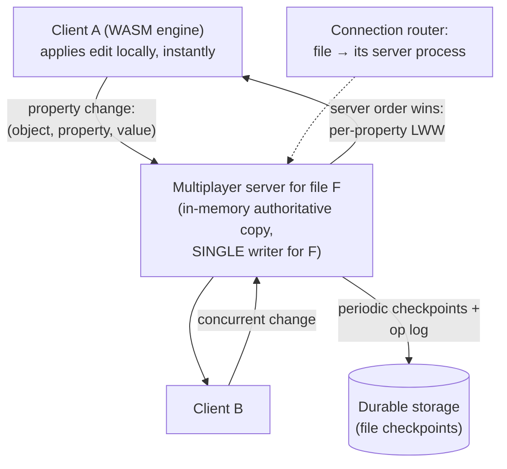

# Figma System Design

## TL;DR

Figma made a browser tab feel like a native design tool shared by a whole team. Three load-bearing decisions: a **C++ engine compiled to WebAssembly** rendering to WebGL (the browser is the distribution, not the architecture); **multiplayer sync that is deliberately *not* a full CRDT** — every open file is owned by exactly one stateful multiplayer server process that applies **per-property last-writer-wins** with server-arbitrated ordering, because design files tolerate property-level LWW but not text-style merge anomalies; and a **single Postgres-centered metadata plane** that survived hypergrowth through a now-canonical sequence — vertical splitting, then application-coordinated horizontal sharding behind a query proxy (`colos`, DBProxy) without changing the application's mental model. The overall lesson: pick the *weakest* consistency machinery your domain truly needs, and put a single writer wherever you can get away with it.

---

## Core Requirements

### Functional
1. **Real-time co-editing** — many cursors in one file, every change visible to everyone in ~100ms
2. **Design-tool fidelity** — vector rendering, huge documents, 60fps pan/zoom in a browser
3. **Offline tolerance** — keep editing through disconnects; reconcile on reconnect
4. **File organization** — teams, projects, permissions, comments, version history
5. **Plugins & embeds** — third-party code against live documents

### Non-Functional
1. **Latency** — local edits apply instantly (optimistic); remote propagation ~100ms
2. **Convergence** — all participants reach the same document state, always
3. **Durability** — no lost work; recoverable history ([checkpoints](../15-deployment/05-disaster-recovery.md))
4. **Scale** — millions of files; each file's session fits one server, but there are very many files

---

## Multiplayer: One File, One Server, Property-Level LWW

The defining choice. A Figma document is a **tree of objects** (frames, shapes, text nodes), each object a bag of properties. Concurrent edits are resolved like this:

- **Granularity is the design.** Conflicts resolve per *(object, property)* — two designers editing the same rectangle's `fill` race (last write wins, server order), but one editing `fill` while another edits `width` merge perfectly. In a design tool, simultaneous same-property edits are rare and visually self-correcting, so LWW's "lost update" is a non-event — the [Conflict Resolution](../02-distributed-databases/04-conflict-resolution.md) trade made consciously.
- **Why not a full CRDT?** Figma's team studied them and kept only the parts they needed: CRDTs buy convergence *without a central authority*, but Figma always has one (the file's server), so it can take the simpler model, a total order, and far less metadata. Two genuinely CRDT-ish techniques survive where LWW fails: **object identity** (IDs, not array indexes, so concurrent inserts don't collide) and **fractional indexing** for child order — position is a real number between neighbors; concurrent reorders converge without renumbering ([CRDTs and Collaborative Editing](../07-real-time/07-crdts-collaborative-editing.md) covers the spectrum this point sits on).
- **Tree-structure edge cases** get server arbitration: reparenting an object whose parent was concurrently deleted, cycle prevention — cases where property-wise merging is semantically wrong and the single writer simply decides.
- **Offline** = client keeps its op log, replays against the server's current state on reconnect; the server's order is truth, the client reconciles ([the sync-engine shape](../07-real-time/07-crdts-collaborative-editing.md)). Undo is **local-intent undo**, computed against your own ops.
- **The file server is a [single-writer partition](../01-foundations/09-distributed-locks.md):** routing pins file → process ([cell-router thinking](../06-scaling/11-cell-based-architecture.md) at per-file granularity); crash recovery = reload last checkpoint + replay the tail ([WAL logic](../03-storage-engines/04-write-ahead-logging.md) at the application layer).

## Rendering: The Browser Is a Deployment Target

The editor is a C++ scene-graph-and-renderer compiled to **WebAssembly**, drawing via WebGL/WebGPU — not DOM, not SVG. Documents are loaded into a compact binary format; rendering is a tile-based pipeline with culling, much closer to a game engine than a web app. Systems consequences: deterministic performance independent of DOM diffing; one engine shared across browser/desktop (Electron)/mobile; and the multiplayer protocol speaks the engine's compact object model rather than JSON trees — bandwidth and GC pressure stay bounded even on 100MB documents.

## The Metadata Plane: Postgres, Stretched Then Sharded

Files are blobs + op logs; everything else — users, teams, file metadata, permissions, comments — lived in **one Postgres instance** far longer than folklore says is possible. The scaling sequence (told across Figma's 2023–24 engineering posts) is a reusable playbook:

1. **Buy headroom first:** bigger boxes, read replicas, [PgBouncer pooling](../04-caching/03-distributed-caching.md)-style connection discipline, query tuning — boring moves that deferred architecture for years.
2. **Vertical partitioning:** peel high-traffic table groups into their own Postgres instances ("colos"), chosen so cross-group joins/transactions are rare — a domain decomposition, not a data one.
3. **Horizontal sharding, application-transparent:** for the tables that still outgrew a box, shard by a small set of keys, fronted by **DBProxy** — a query-engine-aware proxy that parses SQL, routes by shard key, scatter-gathers the few cross-shard queries, and rejects the patterns sharding can't honor. Critically: **logical sharding before physical** (views simulating shard boundaries on one box to validate the application), then [dual-write/verify cutover](../15-deployment/03-database-migrations.md) per table group.
4. The principles they stated outright: shard as little as possible, keep the relational model and transactional islands per shard ([Database Sharding](../06-scaling/03-database-sharding.md)), and make the proxy — not 500 call sites — own routing.

---

## Lessons

1. **Choose consistency machinery by domain, not fashion.** Property-LWW + object identity + fractional indexing covers a design tool; full text-CRDT machinery would add metadata and anomaly classes for no product benefit. The weakest sufficient model wins.
2. **A single writer per natural unit (the file) deletes whole problem classes** — conflict resolution, distributed locking, fan-in ordering — at the price of a routing layer and per-unit capacity ceilings you must monitor.
3. **WASM changed the boundary of "web app":** shipping the *same* native engine everywhere collapsed platform divergence — an architecture decision disguised as a performance one.
4. **The Postgres saga is the modern default path:** vertical split → logical shard rehearsal → proxy-mediated horizontal shard, each step reversible. Distributed-database rewrites are the move of last resort.
5. **Multiplayer is a product feature with an architecture bill:** presence, cursors, and instant feedback ([Presence](../07-real-time/06-presence.md), [WebSockets](../07-real-time/04-websockets.md)) ride the same session server — co-locating them with document authority is what makes them cheap.

## References

- [How Figma's multiplayer technology works](https://www.figma.com/blog/how-figmas-multiplayer-technology-works/) — the LWW/CRDT reasoning, firsthand
- [Realtime editing of ordered sequences (fractional indexing)](https://www.figma.com/blog/realtime-editing-of-ordered-sequences/)
- [Building a professional design tool on the web (WebAssembly engine)](https://www.figma.com/blog/webassembly-cut-figmas-load-time-by-3x/)
- [The growing pains of database architecture (vertical partitioning)](https://www.figma.com/blog/how-figma-scaled-to-multiple-databases/) and [How Figma's databases team lived to tell the scale (DBProxy sharding)](https://www.figma.com/blog/how-figmas-databases-team-lived-to-tell-the-scale/)
- [CRDTs and Collaborative Editing](../07-real-time/07-crdts-collaborative-editing.md) — the pattern article this case study grounds
