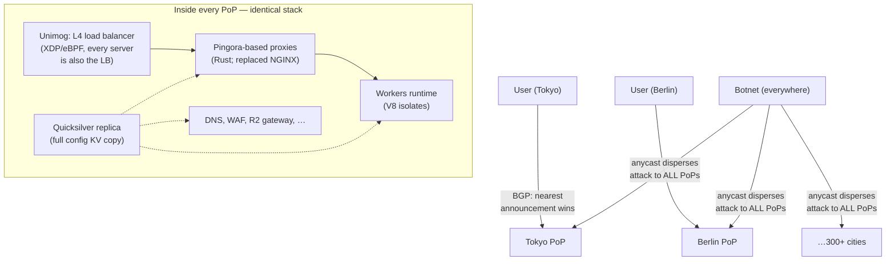

# Cloudflare System Design

## TL;DR

Cloudflare runs one of the largest edge networks on earth (300+ cities, tens of millions of requests per second) on a contrarian doctrine: **every server runs every service**. There is no "CDN tier" and "Workers tier" — one homogeneous fleet, with **anycast** steering each user to the nearest city and any machine able to answer anything. The consequences cascade: DDoS absorption becomes a side effect of the architecture (attack traffic disperses across the planet instead of concentrating); compute-at-edge needed a runtime three orders of magnitude lighter than containers (**V8 isolates** — Workers); configuration for millions of customers must reach every machine in seconds (**Quicksilver**, a read-optimized replicated KV); and stateful coordination gets a deliberately *non*-edge answer (**Durable Objects** — one single-writer actor per key, placed once, moved as needed). It is the most complete public example of [cell-less](../06-scaling/11-cell-based-architecture.md) horizontal uniformity — isolation by dispersion rather than partition.

---

## Core Requirements

### Functional
1. **Reverse proxy/CDN** for a large fraction of the web — caching, TLS, HTTP routing
2. **DDoS mitigation** at line rate, without human reaction time
3. **Programmable edge** — customer code running in every city
4. **Edge data** — config instantly everywhere; KV/queues/objects/state for apps
5. **DNS** — one of the largest authoritative + recursive (1.1.1.1) deployments

### Non-Functional
1. **Latency** — terminate TLS within ~10–50ms of most humans on earth
2. **Absorption** — survive multi-Tbps attacks as routine, not incidents
3. **Uniformity** — any machine, any city serves any customer (no special boxes)
4. **Change velocity** — config changes visible globally in < ~5 seconds

---

## Anycast + Homogeneous Fleet: The Doctrine

- **Anycast everywhere:** the same IP prefixes announced from every city; BGP routes each user to the topologically nearest PoP ([Multi-Region routing](../06-scaling/09-multi-region-architecture.md) taken to its limit — no GeoDNS, no TTL staleness, rerouting at BGP convergence speed when a PoP drains).
- **DDoS defense is the topology.** A botnet's traffic enters at *its* nearest PoPs — the attack is automatically sharded across the fleet, so no single site eats the aggregate. Per-machine filtering then happens in **XDP/eBPF before the kernel stack** (the L4 layer and dropping logic run at NIC line rate), turning "mitigation" into a property rather than a procedure.
- **Every server runs every service.** No service-specific hardware pools: utilization smooths (capacity follows total demand, not per-product forecasts), any-machine failure is absorbed by identical neighbors ([static stability](../06-scaling/09-multi-region-architecture.md)), and a new product inherits 300 cities on day one. The price: every service must be a well-behaved multi-tenant citizen on shared boxes — strict per-tenant budgets and [shuffle-shard-style](../06-scaling/11-cell-based-architecture.md) blast-radius thinking inside each machine.
- **Pingora:** the NGINX-based proxy layer was rewritten in Rust — memory safety for the code that touches *all* traffic, connection-reuse and customization wins, and (open-sourced) it became the substrate of their proxy products.

## Workers: Isolates, Not Containers

Edge compute with containers fails the math: thousands of customers × hundreds of PoPs × cold-start seconds × container memory = impossible. Workers instead runs customer code as **V8 isolates** — the same sandboxing Chrome uses per-tab — thousands per process:

| | Container/microVM | V8 isolate (Workers) |
|---|---|---|
| Cold start | 100ms–seconds | **~ms or less** (often pre-warmed by the HTTP handshake) |
| Memory per tenant | 10s–100s of MB | ~few MB |
| Density per machine | Dozens–hundreds | **Thousands** |
| Isolation boundary | Kernel/VM | V8 sandbox + process-level defenses |
| Tenant code model | Anything | JS/WASM, CPU-time-capped, no raw sockets |

The trade is real: a constrained runtime (JS/WASM, capability-style APIs) in exchange for density that makes "run on every machine in every city" economically sane — the [multi-tenancy admission-control story](../06-scaling/12-multi-tenancy.md) executed at the runtime layer (CPU-time limits per request, not best-effort fairness). Spectre-class risks of shared-process tenancy are handled with mitigations plus the option to quarantine suspicious tenants into separate processes.

## Quicksilver: Config as a Replicated Read Path

Every request consults customer configuration (WAF rules, routing, certs, Workers code). That lookup must be **local and microsecond-fast** on every machine, yet updates (millions/day) must reach the planet in seconds:

- One **write path** at the core accepts changes and appends them to a replication log; every machine holds a **full local replica** (LMDB-style memory-mapped store) applying the log — reads never leave the box ([read-local/write-global](../06-scaling/09-multi-region-architecture.md) in miniature, replacing the prior Kyoto-Tycoon system that buckled at this fan-out).
- Properties worth copying: read amplification handled by replicate-everything (config is small relative to traffic); bounded propagation (~seconds) is *measured and alerted on* as a product SLO ([freshness SLI](../11-observability/05-slos-error-budgets.md)); and the log is the interface — new consumers (Workers code distribution) ride the same pipe ([CDC-shaped thinking](../13-data-pipelines/04-change-data-capture.md)).

## Durable Objects: Admitting the Edge Needs a Home for State

Stateless edge + global KV (eventually consistent, cached) covers reads, but coordination — a chat room, a counter, a booking — needs a serialization point. Cloudflare's answer is the actor model productized: a **Durable Object** is a named single-threaded object with private storage; the platform places **exactly one live instance** somewhere, routes all requests for that ID to it, and migrates it toward its traffic. Strong consistency comes from [single-writer-per-key](../01-foundations/09-distributed-locks.md) rather than consensus-per-operation; storage is journaled (now SQLite-backed with replicated WAL). The honest geometry: your object lives in *one* place — latency is great near it and intercontinental far from it — i.e., the edge platform converges back to [partitioned active-active](../06-scaling/09-multi-region-architecture.md) with per-key homes, because physics doesn't exempt edge networks.

---

## Lessons

1. **Dispersion is an isolation strategy.** Anycast + homogeneity turns attack and load concentration into fleet-wide dilution — the inverse of cells, suited when requests are small, stateless, and tenant-mixed.
2. **Density dictates the runtime.** "Code in 300 cities" was a sandbox-economics problem; isolates over containers is the kind of order-of-magnitude move that creates product categories.
3. **Replicate small data totally; route to big state singly.** Quicksilver (copy everything everywhere) and Durable Objects (one home per key) are the two clean endpoints; most "edge state" confusion comes from wanting both at once.
4. **Rewrite the hot sheet-metal in a safe language:** Pingora's Rust rewrite of the all-traffic proxy is the strongest public case for memory safety as an availability investment.
5. **Make the dangerous path the fast path:** DDoS filtering in XDP, config reads from local memory — the architecture pre-decides what happens under stress, instead of asking software to react ([static stability](../06-scaling/09-multi-region-architecture.md), again).

## References

- [A Brief Primer on Anycast](https://blog.cloudflare.com/a-brief-anycast-primer/) and [Unimog: Cloudflare's edge load balancer](https://blog.cloudflare.com/unimog-cloudflares-edge-load-balancer/)
- [How Workers works: isolates](https://developers.cloudflare.com/workers/reference/how-workers-works/) and [Cloud Computing without Containers](https://blog.cloudflare.com/cloud-computing-without-containers/)
- [Introducing Quicksilver: configuration distribution at internet scale](https://blog.cloudflare.com/introducing-quicksilver-configuration-distribution-at-internet-scale/)
- [Durable Objects](https://blog.cloudflare.com/introducing-workers-durable-objects/) and [Zero-latency SQLite storage in every Durable Object](https://blog.cloudflare.com/sqlite-in-durable-objects/)
- [Introducing Pingora](https://blog.cloudflare.com/introducing-pingora/) — the Rust proxy rationale
