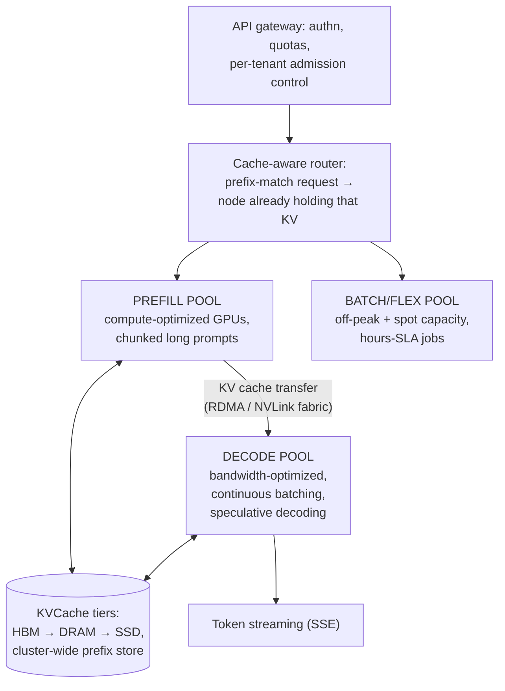

# LLM Inference Platforms: Serving Tokens at Planetary Scale

## TL;DR

A composite case study of the systems serving frontier models (drawn from public sources: Moonshot's Mooncake paper, DeepSeek's V3/R1 inference write-ups, vLLM/SGLang production deployments, and provider engineering posts) — because token serving has become a first-class datacenter workload with its own architecture school. The shape that has converged: **disaggregate prefill from decode** (opposite hardware profiles, separate pools, KV cache shipped between them); treat the **KV cache as the system's central asset** (a multi-tier, cluster-wide cache whose hit rate is the dominant cost lever); schedule for **goodput under SLO** (TTFT for prefill, inter-token latency for decode) rather than raw throughput; and segment the fleet by workload class (interactive / agentic / batch) with [cell-style isolation](../06-scaling/11-cell-based-architecture.md). The economics inverted classic serving intuition: compute is bought per token-of-attention, so cache reuse, batching discipline, and routing intelligence — not bigger GPUs — decide margins.

---

## Core Requirements

### Functional
1. **Chat/completion APIs** — streaming tokens, tool calls, structured outputs
2. **Heterogeneous traffic** — interactive chat, long-document analysis, agent loops resending huge transcripts, offline batch
3. **Many models** — frontier + small/fast tiers, fine-tunes/LoRAs, versions pinned per customer
4. **Prompt caching** — agents resend 100K-token prefixes every turn; pricing assumes reuse

### Non-Functional
1. **TTFT** (time to first token) — interactive p95 well under ~1s even with long prompts
2. **ITL** (inter-token latency) — smooth streaming under load (tens of ms)
3. **Goodput** — maximize requests *meeting both SLOs* per GPU-hour, not tokens/sec
4. **Cost** — tokens are the unit economics ([FinOps](../11-observability/06-finops-cost-engineering.md)); cache hit rate is the margin
5. **Isolation** — one tenant's 1M-token prompt must not freeze everyone's streams ([multi-tenancy](../06-scaling/12-multi-tenancy.md))

---

## The Workload's Physics

Autoregressive transformers ([the architecture is the workload](../09-whitepapers/15-attention-transformers.md)) split every request into two phases with opposite profiles:

| | Prefill (process prompt) | Decode (generate tokens) |
|---|---|---|
| Compute shape | One huge parallel pass — **compute-bound** | Whole model once *per token* — **memory-bandwidth-bound** |
| Latency metric | TTFT | ITL |
| Batching behavior | Few requests saturate FLOPs | Wants huge batches to amortize weight reads |
| Resource it stresses | FLOPs | HBM bandwidth + **KV cache capacity** |

Co-locating both on one GPU makes them fight: a long prefill stalls every co-batched stream's ITL; decode batches starve prefill FLOPs. Within a replica, **chunked prefill** interleaves them; at fleet scale the answer is structural:

## Architecture: Disaggregated, KV-Centric

- **Prefill/decode disaggregation** (DistServe's argument; **Mooncake** — Kimi's serving platform — is the canonical production account): separate pools sized independently against their own SLOs, with KV blocks streamed across a fast fabric. Mooncake's framing goes further: the *cluster's aggregate DRAM/SSD* is organized as a *KVCache-centric* store, and scheduling optimizes cache reuse and transfer cost jointly — under overload, an **early-rejection** policy declines work predicted to miss SLO before it wastes prefill ([load shedding](../06-scaling/10-retries-timeouts-hedging.md), applied with a cost model).
- **The KV/prefix cache is the product's economics.** Agentic traffic resends conversation prefixes every turn; system prompts repeat across millions of calls. Engines share prefixes within a node (PagedAttention block sharing, SGLang's RadixAttention); platforms extend it cluster-wide with tiering and **cache-aware routing** (hash the prompt prefix; route to the replica already warm — a [consistent-hashing](../02-distributed-databases/05-partitioning-strategies.md) problem where the "data" is recomputable but expensive). Provider-side prompt-caching discounts (~90% off cached input) are this internal machinery, priced.
- **Decode-side throughput stack:** continuous batching (token-granularity batch membership), speculative decoding (draft/EAGLE-style — accept multiple tokens per target-model pass), FP8/INT4 quantization, and for MoE frontier models, **wide expert parallelism** (DeepSeek's open inference notes: experts spread across many GPUs, all-to-all routing on the fabric, prefill and decode phases parallelized differently) ([LLM Infrastructure](../16-llm-systems/05-llm-infrastructure.md) covers each mechanism).
- **Fleet segmentation:** interactive, agentic (long prefixes, bursty turns), and batch classes run on separate pools or priority bands — batch/flex tiers (50%-off, hours-latency) exist to soak off-peak capacity, the classic utilization play ([FinOps](../11-observability/06-finops-cost-engineering.md)) for hardware whose cost is dominated by ownership, not usage.

## Scheduling: Goodput, Not Throughput

The operative dashboards are *SLO-attainment* dashboards: a scheduler change that raises tokens/sec but pushes p95 TTFT past target has negative value. Concretely:

- **Admission control per tenant** at the gateway (token-rate budgets, concurrent-stream caps), because one tenant's agent swarm is the [noisy neighbor](../06-scaling/12-multi-tenancy.md) and GPUs cannot be oversubscribed gracefully.
- **Queue discipline by class:** interactive preempts batch; long prompts are chunked so they never monopolize a replica; stuck/abandoned streams are cancelled aggressively (a disconnected client's decode is pure waste — [deadline propagation](../06-scaling/10-retries-timeouts-hedging.md) for tokens).
- **Heat management mirrors any stateful fleet:** replicas with hot prefix caches are precious (cache affinity vs load balance is a live tension); model weights themselves are a placement problem (which models are resident where — a bin-packing layer that looks like a CDN for 100GB artifacts).
- **Failure handling:** a dead decode replica loses its in-flight KV — sessions either re-prefill elsewhere (latency blip, the common choice) or platforms replicate/checkpoint KV for premium tiers; [hedging applies to prefill reads, never to billable decode](../06-scaling/10-retries-timeouts-hedging.md).

## Observability and Safety

Per-request traces carry tokens in/out/cached, queue time, prefill time, ITL distribution, cache hit ratio, and cost — [OTel GenAI conventions](../16-llm-systems/10-llm-evaluation.md) made this portable. Quality is monitored *statistically* (sampled online evals, refusal/guardrail rates as SLIs) because correctness isn't binary; and model/version rollouts run as [canary-gated deployments](../15-deployment/04-cicd-gitops.md) against eval suites plus live metric diffs — the same discipline as any deploy, with fuzzier verdicts.

---

## Lessons

1. **Disaggregate by physics:** when one request has two phases with opposite hardware profiles, separating the pools converts an internal fight into independent capacity planning — the prefill/decode split is [read/write-path separation](../06-scaling/09-multi-region-architecture.md) reborn for FLOPs.
2. **Name your central asset and design around it:** these platforms are KV-cache systems that happen to run models; hit rate is the cost structure, so routing, tiering, pricing, and even harness design upstream ([append-only prompts](../16-llm-systems/09-harness-engineering.md)) all serve it.
3. **Goodput under SLO is the only honest metric** for latency-shaped multi-tenant serving — raw throughput numbers hide congestive collapse.
4. **Token economics discipline the whole stack:** cost-per-solved-request flows from cache hits, batch tiers, and quantization choices — the rare domain where the infra team's dashboard *is* the gross-margin model.
5. **It's all prior art recombined:** continuous batching is connection multiplexing, prefix caches are CDNs, early rejection is admission control, expert parallelism is sharding — the patterns in this book, re-instantiated for a new workload in under three years.

## References

- [Mooncake: A KVCache-centric Disaggregated Architecture for LLM Serving](https://arxiv.org/abs/2407.00079) — Moonshot/Kimi's production platform; the defining paper of the school
- [DistServe: Disaggregating Prefill and Decoding](https://arxiv.org/abs/2401.09670) — the goodput argument
- [DeepSeek-V3 Technical Report](https://arxiv.org/abs/2412.19437) and DeepSeek's open-source inference releases — wide-EP MoE serving in public
- [vLLM](https://github.com/vllm-project/vllm) / [SGLang](https://github.com/sgl-project/sglang) — the engines; their production case studies document the fleet patterns
- [LLM Infrastructure](../16-llm-systems/05-llm-infrastructure.md) and [Harness Engineering](../16-llm-systems/09-harness-engineering.md) — the pattern articles this case study instantiates
