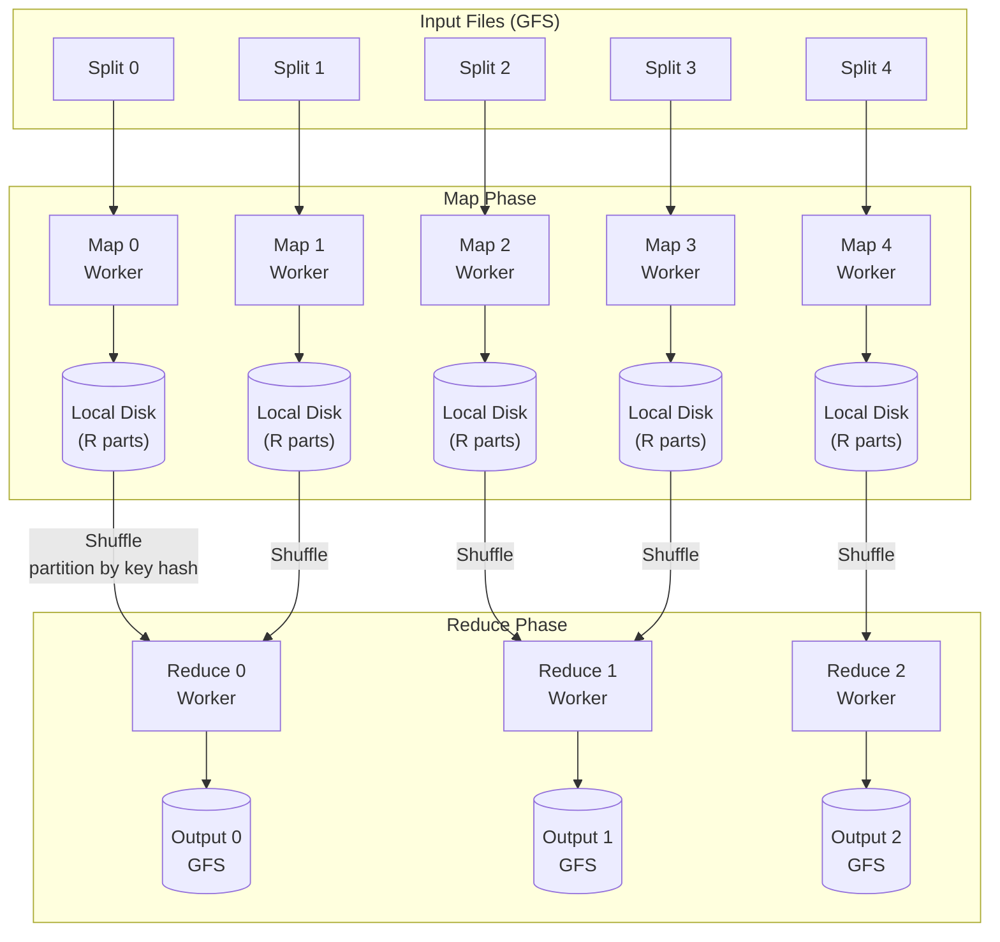

# MapReduce: Simplified Data Processing on Large Clusters

## Paper Overview

**Authors:** Jeffrey Dean, Sanjay Ghemawat (Google)  
**Published:** OSDI 2004  
**Citation:** One of the most cited papers in computer science

## TL;DR

MapReduce is a programming model for processing large datasets in parallel across a distributed cluster. Users define **map** functions that process key-value pairs to generate intermediate pairs, and **reduce** functions that merge intermediate values with the same key. The runtime handles parallelization, fault tolerance, and data distribution automatically. This abstraction enabled Google to run thousands of different computations on commodity hardware while hiding the complexity of distributed systems.

---

## Problem Statement

Before MapReduce, Google engineers had to write custom distributed systems for each computation:
- Crawling the web
- Building the search index
- Analyzing logs
- Computing PageRank

Each system needed to handle:
- Parallelization across hundreds of machines
- Data distribution and load balancing
- Fault tolerance for machine failures
- Network optimization

This was complex, error-prone, and duplicated effort.

---

## Core Abstraction

```
┌─────────────────────────────────────────────────────────────────────────┐
│                    MapReduce Programming Model                           │
│                                                                          │
│   map(key1, value1) → list(key2, value2)                                │
│   reduce(key2, list(value2)) → list(value2)                             │
│                                                                          │
│   ┌──────────────────────────────────────────────────────────────────┐  │
│   │                        Example: Word Count                        │  │
│   │                                                                   │  │
│   │   Input: "hello world hello"                                     │  │
│   │                                                                   │  │
│   │   map("doc1", "hello world hello"):                              │  │
│   │       emit("hello", 1)                                           │  │
│   │       emit("world", 1)                                           │  │
│   │       emit("hello", 1)                                           │  │
│   │                                                                   │  │
│   │   reduce("hello", [1, 1]):                                       │  │
│   │       emit("hello", 2)                                           │  │
│   │                                                                   │  │
│   │   reduce("world", [1]):                                          │  │
│   │       emit("world", 1)                                           │  │
│   └──────────────────────────────────────────────────────────────────┘  │
└─────────────────────────────────────────────────────────────────────────┘
```

---

## Execution Flow



### Execution Steps

1. **Split input**: Divide input into M splits (typically 16-64 MB each)
2. **Fork processes**: Master assigns map/reduce tasks to workers
3. **Map phase**: Workers read splits, apply map function, buffer output in memory
4. **Partition**: Buffered output partitioned into R regions by hash(key) mod R
5. **Write locally**: Partitioned data written to local disk
6. **Shuffle**: Reduce workers fetch their partition from all map workers
7. **Sort**: Reduce workers sort by key (external sort if needed)
8. **Reduce phase**: Iterate over sorted data, apply reduce function
9. **Output**: Write reduce output to GFS

---

## Implementation Details

### Master Data Structures

```python
from dataclasses import dataclass, field
from typing import Dict, List, Optional, Set
from enum import Enum
import time

class TaskState(Enum):
    IDLE = "idle"
    IN_PROGRESS = "in_progress"
    COMPLETED = "completed"

class TaskType(Enum):
    MAP = "map"
    REDUCE = "reduce"

@dataclass
class MapTask:
    task_id: int
    input_split: str  # GFS file path
    state: TaskState = TaskState.IDLE
    worker_id: Optional[str] = None
    start_time: Optional[float] = None
    output_locations: List[str] = field(default_factory=list)  # R locations

@dataclass
class ReduceTask:
    task_id: int
    partition: int  # Partition number (0 to R-1)
    state: TaskState = TaskState.IDLE
    worker_id: Optional[str] = None
    start_time: Optional[float] = None
    input_locations: List[str] = field(default_factory=list)  # From all mappers


class MapReduceMaster:
    """
    Master coordinates the entire MapReduce job.
    Tracks task states, handles failures, and manages workers.
    """
    
    def __init__(self, input_files: List[str], num_reducers: int):
        self.num_mappers = len(input_files)
        self.num_reducers = num_reducers
        
        # Initialize map tasks
        self.map_tasks: Dict[int, MapTask] = {
            i: MapTask(task_id=i, input_split=f)
            for i, f in enumerate(input_files)
        }
        
        # Initialize reduce tasks
        self.reduce_tasks: Dict[int, ReduceTask] = {
            i: ReduceTask(task_id=i, partition=i)
            for i in range(num_reducers)
        }
        
        # Worker tracking
        self.workers: Dict[str, float] = {}  # worker_id -> last_heartbeat
        self.worker_timeout = 10.0  # seconds
    
    def get_task(self, worker_id: str) -> Optional[Dict]:
        """Assign a task to a worker"""
        self.workers[worker_id] = time.time()
        
        # Prefer map tasks first (reduce can't start until maps complete)
        for task_id, task in self.map_tasks.items():
            if task.state == TaskState.IDLE:
                task.state = TaskState.IN_PROGRESS
                task.worker_id = worker_id
                task.start_time = time.time()
                
                return {
                    "type": TaskType.MAP,
                    "task_id": task_id,
                    "input_split": task.input_split,
                    "num_reducers": self.num_reducers
                }
        
        # All maps done? Assign reduce tasks
        if self._all_maps_complete():
            for task_id, task in self.reduce_tasks.items():
                if task.state == TaskState.IDLE:
                    task.state = TaskState.IN_PROGRESS
                    task.worker_id = worker_id
                    task.start_time = time.time()
                    
                    # Collect input locations from all mappers
                    input_locations = []
                    for map_task in self.map_tasks.values():
                        input_locations.append(
                            map_task.output_locations[task_id]
                        )
                    
                    return {
                        "type": TaskType.REDUCE,
                        "task_id": task_id,
                        "partition": task.partition,
                        "input_locations": input_locations
                    }
        
        return None  # No tasks available
    
    def task_completed(
        self, 
        worker_id: str, 
        task_type: TaskType,
        task_id: int,
        output_locations: List[str]
    ):
        """Handle task completion notification"""
        if task_type == TaskType.MAP:
            task = self.map_tasks[task_id]
            if task.worker_id == worker_id:
                task.state = TaskState.COMPLETED
                task.output_locations = output_locations
        else:
            task = self.reduce_tasks[task_id]
            if task.worker_id == worker_id:
                task.state = TaskState.COMPLETED
    
    def check_timeouts(self):
        """Re-assign tasks from failed workers"""
        now = time.time()
        
        # Check for worker timeouts
        failed_workers = set()
        for worker_id, last_heartbeat in self.workers.items():
            if now - last_heartbeat > self.worker_timeout:
                failed_workers.add(worker_id)
        
        # Re-assign map tasks
        for task in self.map_tasks.values():
            if task.state == TaskState.IN_PROGRESS:
                if task.worker_id in failed_workers:
                    task.state = TaskState.IDLE
                    task.worker_id = None
        
        # Re-assign reduce tasks
        for task in self.reduce_tasks.values():
            if task.state == TaskState.IN_PROGRESS:
                if task.worker_id in failed_workers:
                    task.state = TaskState.IDLE
                    task.worker_id = None
        
        # Also re-run completed map tasks if worker failed
        # (reduce workers may not have fetched data yet)
        for task in self.map_tasks.values():
            if task.state == TaskState.COMPLETED:
                if task.worker_id in failed_workers:
                    task.state = TaskState.IDLE
                    task.worker_id = None
    
    def _all_maps_complete(self) -> bool:
        return all(t.state == TaskState.COMPLETED for t in self.map_tasks.values())
    
    def is_done(self) -> bool:
        return all(t.state == TaskState.COMPLETED for t in self.reduce_tasks.values())
```

### Worker Implementation

```python
class MapReduceWorker:
    """
    Worker executes map and reduce tasks.
    """
    
    def __init__(self, worker_id: str, master_address: str):
        self.worker_id = worker_id
        self.master = master_address
        self.map_fn = None
        self.reduce_fn = None
    
    def run(self):
        """Main worker loop"""
        while True:
            # Request task from master
            task = self.request_task()
            
            if task is None:
                # No tasks available, sleep and retry
                time.sleep(1)
                continue
            
            if task["type"] == TaskType.MAP:
                self.execute_map(task)
            else:
                self.execute_reduce(task)
    
    def execute_map(self, task: Dict):
        """Execute a map task"""
        task_id = task["task_id"]
        input_file = task["input_split"]
        num_reducers = task["num_reducers"]
        
        # Read input
        content = self.read_gfs(input_file)
        
        # Apply map function
        intermediate = []
        for key, value in self.parse_input(content):
            for output_key, output_value in self.map_fn(key, value):
                intermediate.append((output_key, output_value))
        
        # Partition by reduce task
        partitions = [[] for _ in range(num_reducers)]
        for key, value in intermediate:
            partition = hash(key) % num_reducers
            partitions[partition].append((key, value))
        
        # Write partitions to local disk
        output_locations = []
        for partition_id, partition_data in enumerate(partitions):
            location = f"/tmp/mr-{task_id}-{partition_id}"
            self.write_local(location, partition_data)
            output_locations.append(f"{self.worker_id}:{location}")
        
        # Notify master
        self.notify_complete(TaskType.MAP, task_id, output_locations)
    
    def execute_reduce(self, task: Dict):
        """Execute a reduce task"""
        task_id = task["task_id"]
        input_locations = task["input_locations"]
        
        # Fetch all intermediate data for this partition
        intermediate = []
        for location in input_locations:
            worker, path = location.split(":")
            data = self.fetch_from_worker(worker, path)
            intermediate.extend(data)
        
        # Sort by key
        intermediate.sort(key=lambda x: x[0])
        
        # Group by key and apply reduce
        output = []
        i = 0
        while i < len(intermediate):
            key = intermediate[i][0]
            values = []
            
            # Collect all values for this key
            while i < len(intermediate) and intermediate[i][0] == key:
                values.append(intermediate[i][1])
                i += 1
            
            # Apply reduce function
            for output_value in self.reduce_fn(key, values):
                output.append((key, output_value))
        
        # Write output to GFS
        output_file = f"/output/part-{task_id:05d}"
        self.write_gfs(output_file, output)
        
        # Notify master
        self.notify_complete(TaskType.REDUCE, task_id, [output_file])
```

---

## Fault Tolerance

### Worker Failure

```
┌─────────────────────────────────────────────────────────────────────────┐
│                    Handling Worker Failures                              │
│                                                                          │
│   Map Worker Fails:                                                     │
│   ┌──────────────────────────────────────────────────────────────────┐  │
│   │   1. Master detects via missing heartbeats                       │  │
│   │   2. All map tasks on that worker reset to IDLE                  │  │
│   │   3. Tasks re-assigned to other workers                          │  │
│   │   4. Reduce workers notified of new intermediate locations       │  │
│   │                                                                   │  │
│   │   Note: Completed map tasks ALSO re-executed because output      │  │
│   │         is on local disk (inaccessible if worker dead)           │  │
│   └──────────────────────────────────────────────────────────────────┘  │
│                                                                          │
│   Reduce Worker Fails:                                                  │
│   ┌──────────────────────────────────────────────────────────────────┐  │
│   │   1. Master detects via missing heartbeats                       │  │
│   │   2. Only IN_PROGRESS reduce tasks reset to IDLE                │  │
│   │   3. Tasks re-assigned to other workers                          │  │
│   │                                                                   │  │
│   │   Note: Completed reduce tasks NOT re-executed because output   │  │
│   │         is on GFS (globally accessible)                          │  │
│   └──────────────────────────────────────────────────────────────────┘  │
│                                                                          │
│   Master Failure:                                                       │
│   ┌──────────────────────────────────────────────────────────────────┐  │
│   │   Original paper: Abort job, user restarts                       │  │
│   │   Later systems: Checkpointing, standby master                   │  │
│   └──────────────────────────────────────────────────────────────────┘  │
└─────────────────────────────────────────────────────────────────────────┘
```

### Deterministic Execution

For fault tolerance to work correctly:
- Map and Reduce functions must be **deterministic**
- Same input → same output, always
- Re-execution produces identical results
- Non-deterministic functions can cause inconsistencies

---

## Optimizations

### Locality Optimization

```
┌─────────────────────────────────────────────────────────────────────────┐
│                    Data Locality Optimization                            │
│                                                                          │
│   GFS stores data in 64MB chunks, replicated 3x                         │
│                                                                          │
│   ┌────────────────────────────────────────────────────────────────┐    │
│   │   GFS Chunk Locations for Input Split                          │    │
│   │                                                                 │    │
│   │   Split "input-0": replicas on [Machine A, Machine B, Machine C]│    │
│   │                                                                 │    │
│   │   Master scheduling priority:                                   │    │
│   │   1. Schedule map task on machine with replica (local read)    │    │
│   │   2. Schedule on machine on same rack (rack-local)             │    │
│   │   3. Schedule anywhere (remote read)                            │    │
│   │                                                                 │    │
│   │   Result: Most reads are local, minimizing network bandwidth   │    │
│   └────────────────────────────────────────────────────────────────┘    │
└─────────────────────────────────────────────────────────────────────────┘
```

### Combiner Function

```python
# Without combiner: Each mapper emits ("the", 1) thousands of times
# Lots of network traffic during shuffle

def word_count_map(key, value):
    for word in value.split():
        emit(word, 1)

def word_count_reduce(key, values):
    emit(key, sum(values))

# With combiner: Partial aggregation on mapper before shuffle
def word_count_combiner(key, values):
    # Same as reduce, runs locally on mapper
    emit(key, sum(values))

# Mapper output: ("the", 4523) instead of thousands of ("the", 1)
# Much less data transferred during shuffle
```

### Backup Tasks

```
┌─────────────────────────────────────────────────────────────────────────┐
│                    Handling Stragglers                                   │
│                                                                          │
│   Problem: One slow machine can delay entire job                        │
│   - Bad disk                                                            │
│   - Competing workloads                                                 │
│   - CPU throttling                                                      │
│                                                                          │
│   Solution: Backup tasks                                                │
│   ┌──────────────────────────────────────────────────────────────────┐  │
│   │   When job is almost complete (e.g., 90% of tasks done):         │  │
│   │   1. Identify still-running tasks                                │  │
│   │   2. Schedule backup executions on other machines                │  │
│   │   3. First to complete wins, other killed                        │  │
│   │                                                                   │  │
│   │   Cost: Few percent more resources                               │  │
│   │   Benefit: Significantly reduced tail latency                    │  │
│   └──────────────────────────────────────────────────────────────────┘  │
│                                                                          │
│   Example from paper:                                                   │
│   - Sort 1TB without backup tasks: 1283 seconds                        │
│   - Sort 1TB with backup tasks: 891 seconds (44% faster)               │
└─────────────────────────────────────────────────────────────────────────┘
```

---

## Example Applications

### Distributed Grep

```python
def grep_map(key, value):
    # key: filename, value: file contents
    for line in value.split('\n'):
        if re.search(pattern, line):
            emit(line, "1")

def grep_reduce(key, values):
    emit(key, None)  # Just output matching lines
```

### URL Access Count

```python
def url_map(key, value):
    # key: log line number, value: log entry
    parsed = parse_log_entry(value)
    emit(parsed.url, 1)

def url_reduce(key, values):
    emit(key, sum(values))
```

### Inverted Index

```python
def index_map(key, value):
    # key: document ID, value: document content
    for word in value.split():
        emit(word, key)

def index_reduce(key, values):
    # key: word, values: list of document IDs
    emit(key, sorted(set(values)))
```

### PageRank Iteration

```python
def pagerank_map(key, value):
    # key: page URL, value: (current_rank, outlinks)
    current_rank, outlinks = value
    
    # Distribute rank to outlinks
    contribution = current_rank / len(outlinks)
    for outlink in outlinks:
        emit(outlink, contribution)
    
    # Emit graph structure
    emit(key, outlinks)

def pagerank_reduce(key, values):
    # Separate contributions from graph structure
    outlinks = None
    total_contribution = 0
    
    for value in values:
        if isinstance(value, list):
            outlinks = value
        else:
            total_contribution += value
    
    # PageRank formula
    new_rank = 0.15 + 0.85 * total_contribution
    emit(key, (new_rank, outlinks))
```

---

## Performance Results (from paper)

### Grep

- 10^10 100-byte records (1 TB)
- Pattern occurs in 92,337 records
- M = 15,000 map tasks, R = 1 reduce task
- 1,764 machines
- **Time: 150 seconds** (including ~60s startup overhead)
- Peak: 30 GB/s aggregate read rate

### Sort

- 10^10 100-byte records (1 TB)
- M = 15,000 map tasks, R = 4,000 reduce tasks
- 1,764 machines
- **Time: 891 seconds** (with backup tasks)
- Three phases visible: map (~200s), shuffle (~600s), reduce (~100s)

---

## Limitations

1. **Only batch processing** - Not suitable for real-time or interactive queries
2. **Disk-based shuffle** - Expensive I/O between phases
3. **Limited to map + reduce** - Complex algorithms need multiple jobs
4. **No iteration support** - Each iteration = full job restart
5. **High latency** - Startup overhead, materialization between phases

---

## Legacy and Influence

### Direct Descendants
- **Hadoop MapReduce** - Open source implementation
- **Apache Spark** - In-memory, DAG-based (addressed many limitations)
- **Apache Flink** - Stream processing with batch

### Broader Impact
- Popularized functional programming patterns in data processing
- Demonstrated viability of commodity hardware for big data
- Inspired cloud computing models (EMR, Dataproc)
- Influenced SQL-on-Hadoop systems (Hive, Pig)

---

## Key Takeaways

1. **Simple abstraction, powerful results** - Two functions (map, reduce) express surprisingly many computations.

2. **Automatic parallelization** - Users write sequential code; framework handles distribution.

3. **Fault tolerance through re-execution** - Deterministic functions + lineage tracking = no lost work.

4. **Data locality matters** - Schedule computation near data to minimize network I/O.

5. **Backup tasks for stragglers** - Small resource cost for large latency improvement.

6. **Commodity hardware works** - Expect failures, design for them, scale out not up.

7. **Intermediate data on local disk** - Reduces network traffic, enables recovery without re-running entire pipeline.
