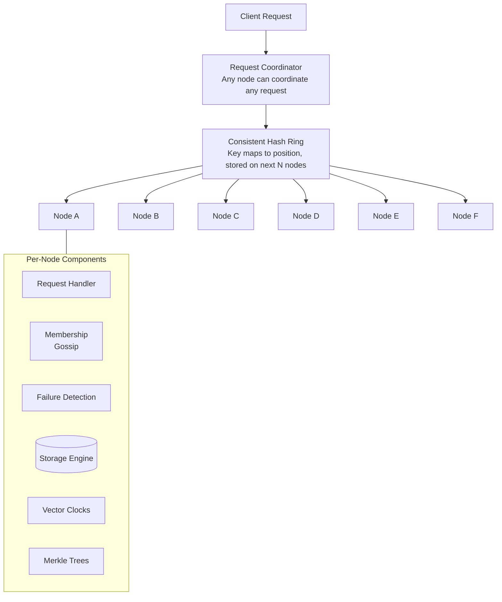

# Dynamo: Amazon's Highly Available Key-Value Store

## Paper Overview

**Authors:** Giuseppe DeCandia et al. (Amazon)  
**Published:** SOSP 2007  
**Context:** Designed for Amazon's shopping cart and session storage

## TL;DR

Dynamo is a highly available key-value store that sacrifices consistency under certain failure scenarios. It uses **consistent hashing** for partitioning, **vector clocks** for conflict detection, **quorum-based replication** for tunable consistency, **sloppy quorum** with hinted handoff for availability, and **anti-entropy with Merkle trees** for replica synchronization. Dynamo pioneered many techniques now standard in distributed databases.

---

## Problem Statement

Amazon's e-commerce platform required:
- **Always writable** - Shopping cart must accept writes even during failures
- **Low latency** - 99.9th percentile response time matters (tail latency)
- **Highly available** - Outage = lost revenue
- **Scalable** - Handle holiday traffic spikes

Traditional RDBMS couldn't meet these requirements:
- Single-master writes limit availability
- Strong consistency adds latency
- Vertical scaling has limits

---

## Design Philosophy

```
┌─────────────────────────────────────────────────────────────────────────┐
│                    Dynamo Design Principles                              │
│                                                                          │
│   ┌──────────────────────────────────────────────────────────────────┐  │
│   │                     CAP Theorem Choice                            │  │
│   │                                                                   │  │
│   │   Consistency ──────────────── Availability                      │  │
│   │                      │                                           │  │
│   │                      │                                           │  │
│   │                      ▼                                           │  │
│   │               Partition Tolerance                                │  │
│   │                                                                   │  │
│   │   Dynamo chooses: AP (Availability + Partition Tolerance)        │  │
│   │   Consistency is eventual, conflicts resolved at read time       │  │
│   └──────────────────────────────────────────────────────────────────┘  │
│                                                                          │
│   Key Design Decisions:                                                 │
│   1. Incremental scalability (add nodes seamlessly)                    │
│   2. Symmetry (no distinguished nodes)                                  │
│   3. Decentralization (no single point of failure)                     │
│   4. Heterogeneity (handle mixed hardware)                             │
└─────────────────────────────────────────────────────────────────────────┘
```

---

## System Architecture



---

## Consistent Hashing with Virtual Nodes

```
┌─────────────────────────────────────────────────────────────────────────┐
│                    Consistent Hashing                                    │
│                                                                          │
│   Basic Consistent Hashing Problem:                                     │
│   - Uneven distribution (random positions)                              │
│   - Node addition/removal moves too much data                          │
│                                                                          │
│   Solution: Virtual Nodes                                               │
│   ┌──────────────────────────────────────────────────────────────────┐  │
│   │                                                                   │  │
│   │   Physical Node A → Virtual Nodes: A1, A2, A3, A4, ...          │  │
│   │   Physical Node B → Virtual Nodes: B1, B2, B3, B4, ...          │  │
│   │                                                                   │  │
│   │           A1                                                      │  │
│   │            ●                                                      │  │
│   │        ╱       ╲                                                 │  │
│   │      B2 ●         ● A3                                           │  │
│   │     ╱               ╲                                            │  │
│   │   ●                   ●                                          │  │
│   │  B1                   A2                                         │  │
│   │     ╲               ╱                                            │  │
│   │      A4 ●         ● B4                                           │  │
│   │        ╲       ╱                                                 │  │
│   │            ●                                                      │  │
│   │           B3                                                      │  │
│   │                                                                   │  │
│   │   Benefits:                                                      │  │
│   │   - Even distribution (many positions average out)               │  │
│   │   - Heterogeneity (more vnodes for powerful machines)           │  │
│   │   - Smoother rebalancing (remove vnodes incrementally)          │  │
│   └──────────────────────────────────────────────────────────────────┘  │
└─────────────────────────────────────────────────────────────────────────┘
```

### Implementation

```python
from dataclasses import dataclass
from typing import Dict, List, Optional, Set
import hashlib
import bisect

@dataclass
class VirtualNode:
    physical_node: str
    token: int  # Position on ring


class ConsistentHashRing:
    """
    Consistent hash ring with virtual nodes.
    """
    
    def __init__(self, replication_factor: int = 3):
        self.replication_factor = replication_factor
        self.ring: List[VirtualNode] = []  # Sorted by token
        self.tokens: List[int] = []  # Just tokens, for binary search
        self.nodes: Dict[str, int] = {}  # node -> num_vnodes
    
    def add_node(self, node: str, num_vnodes: int = 150):
        """Add physical node with virtual nodes"""
        self.nodes[node] = num_vnodes
        
        for i in range(num_vnodes):
            # Hash node name + vnode index to get position
            token = self._hash(f"{node}:{i}")
            vnode = VirtualNode(physical_node=node, token=token)
            
            # Insert in sorted order
            pos = bisect.bisect_left(self.tokens, token)
            self.ring.insert(pos, vnode)
            self.tokens.insert(pos, token)
    
    def remove_node(self, node: str):
        """Remove physical node and all its virtual nodes"""
        if node not in self.nodes:
            return
        
        # Remove all vnodes for this physical node
        self.ring = [vn for vn in self.ring if vn.physical_node != node]
        self.tokens = [vn.token for vn in self.ring]
        del self.nodes[node]
    
    def get_preference_list(self, key: str) -> List[str]:
        """
        Get preference list for a key.
        Returns N distinct physical nodes responsible for key.
        """
        if not self.ring:
            return []
        
        token = self._hash(key)
        
        # Find first position >= key's token
        pos = bisect.bisect_left(self.tokens, token)
        if pos >= len(self.ring):
            pos = 0
        
        # Walk ring clockwise until we have N distinct physical nodes
        preference_list = []
        seen_nodes: Set[str] = set()
        
        for i in range(len(self.ring)):
            idx = (pos + i) % len(self.ring)
            physical_node = self.ring[idx].physical_node
            
            if physical_node not in seen_nodes:
                preference_list.append(physical_node)
                seen_nodes.add(physical_node)
                
                if len(preference_list) >= self.replication_factor:
                    break
        
        return preference_list
    
    def get_coordinator(self, key: str) -> str:
        """Get the coordinator node for a key (first in preference list)"""
        return self.get_preference_list(key)[0]
    
    def _hash(self, key: str) -> int:
        """Hash key to ring position"""
        return int(hashlib.md5(key.encode()).hexdigest(), 16)
```

---

## Vector Clocks

```
┌─────────────────────────────────────────────────────────────────────────┐
│                    Vector Clocks for Conflict Detection                  │
│                                                                          │
│   Problem: Concurrent writes to same key on different nodes             │
│   Solution: Track causality with vector clocks                          │
│                                                                          │
│   ┌──────────────────────────────────────────────────────────────────┐  │
│   │   Example: Shopping cart updates                                  │  │
│   │                                                                   │  │
│   │   Initial:  cart = [], clock = []                                │  │
│   │                                                                   │  │
│   │   Client 1 on Node A:                                            │  │
│   │     Add item X → cart = [X], clock = [(A,1)]                    │  │
│   │                                                                   │  │
│   │   Client 2 reads from A, then writes to Node B:                  │  │
│   │     Add item Y → cart = [X,Y], clock = [(A,1), (B,1)]           │  │
│   │                                                                   │  │
│   │   Client 3 reads from A (before B's write), writes to Node C:   │  │
│   │     Add item Z → cart = [X,Z], clock = [(A,1), (C,1)]           │  │
│   │                                                                   │  │
│   │   Conflict detected! Neither clock dominates:                    │  │
│   │     [(A,1), (B,1)] vs [(A,1), (C,1)]                            │  │
│   │                                                                   │  │
│   │   Resolution: Return both versions to client                     │  │
│   │     Client merges: cart = [X,Y,Z], clock = [(A,1), (B,1), (C,1)]│  │
│   └──────────────────────────────────────────────────────────────────┘  │
│                                                                          │
│   Clock Comparison Rules:                                               │
│   - Clock A dominates B if all(A[i] >= B[i]) and any(A[i] > B[i])      │
│   - If neither dominates → concurrent → conflict                        │
└─────────────────────────────────────────────────────────────────────────┘
```

### Implementation

```python
from dataclasses import dataclass, field
from typing import Dict, List, Tuple, Optional
import copy

@dataclass
class VectorClock:
    """
    Vector clock for tracking causality.
    Maps node_id -> logical timestamp
    """
    clock: Dict[str, int] = field(default_factory=dict)
    
    def increment(self, node_id: str):
        """Increment clock for a node (on write)"""
        self.clock[node_id] = self.clock.get(node_id, 0) + 1
    
    def merge(self, other: 'VectorClock') -> 'VectorClock':
        """Merge two clocks (take max of each component)"""
        merged = VectorClock()
        all_nodes = set(self.clock.keys()) | set(other.clock.keys())
        
        for node in all_nodes:
            merged.clock[node] = max(
                self.clock.get(node, 0),
                other.clock.get(node, 0)
            )
        
        return merged
    
    def dominates(self, other: 'VectorClock') -> bool:
        """Check if this clock causally dominates other"""
        dominated = False
        
        for node in set(self.clock.keys()) | set(other.clock.keys()):
            self_val = self.clock.get(node, 0)
            other_val = other.clock.get(node, 0)
            
            if self_val < other_val:
                return False  # Other has something we don't
            if self_val > other_val:
                dominated = True
        
        return dominated
    
    def concurrent_with(self, other: 'VectorClock') -> bool:
        """Check if clocks are concurrent (neither dominates)"""
        return not self.dominates(other) and not other.dominates(self)
    
    def copy(self) -> 'VectorClock':
        return VectorClock(clock=copy.copy(self.clock))


@dataclass
class VersionedValue:
    """Value with its vector clock"""
    value: any
    clock: VectorClock
    timestamp: float  # Wall clock for display/pruning


class DynamoStore:
    """
    Key-value store with vector clock versioning.
    """
    
    def __init__(self, node_id: str):
        self.node_id = node_id
        self.data: Dict[str, List[VersionedValue]] = {}
    
    def get(self, key: str) -> List[VersionedValue]:
        """
        Get all versions of a key.
        Returns list because there may be conflicts.
        """
        return self.data.get(key, [])
    
    def put(
        self, 
        key: str, 
        value: any, 
        context: Optional[VectorClock] = None
    ) -> VectorClock:
        """
        Put a value with optional context (from previous get).
        Returns new vector clock.
        """
        if context:
            new_clock = context.copy()
        else:
            new_clock = VectorClock()
        
        new_clock.increment(self.node_id)
        
        new_version = VersionedValue(
            value=value,
            clock=new_clock,
            timestamp=time.time()
        )
        
        existing = self.data.get(key, [])
        
        # Remove versions dominated by new version
        surviving = [
            v for v in existing
            if not new_clock.dominates(v.clock)
        ]
        
        # Add new version
        surviving.append(new_version)
        
        self.data[key] = surviving
        
        return new_clock
    
    def reconcile(
        self, 
        key: str, 
        remote_versions: List[VersionedValue]
    ):
        """
        Reconcile local versions with remote versions.
        Used during read repair and anti-entropy.
        """
        local = self.data.get(key, [])
        all_versions = local + remote_versions
        
        # Keep only versions not dominated by any other
        surviving = []
        
        for v in all_versions:
            dominated = any(
                other.clock.dominates(v.clock)
                for other in all_versions
                if other is not v
            )
            if not dominated:
                # Check for duplicates (same clock)
                is_dup = any(
                    s.clock.clock == v.clock.clock
                    for s in surviving
                )
                if not is_dup:
                    surviving.append(v)
        
        self.data[key] = surviving
```

---

## Quorum System

```
┌─────────────────────────────────────────────────────────────────────────┐
│                    Quorum-Based Replication                              │
│                                                                          │
│   N = Number of replicas                                                │
│   R = Read quorum (number of nodes to read from)                        │
│   W = Write quorum (number of nodes to write to)                        │
│                                                                          │
│   ┌──────────────────────────────────────────────────────────────────┐  │
│   │   Consistency Guarantees:                                         │  │
│   │                                                                   │  │
│   │   R + W > N  →  Strong consistency (read sees latest write)      │  │
│   │                                                                   │  │
│   │   Example: N=3, R=2, W=2                                         │  │
│   │   - Write to 2 nodes before acknowledging                        │  │
│   │   - Read from 2 nodes                                            │  │
│   │   - At least 1 node has latest value (overlap guaranteed)        │  │
│   └──────────────────────────────────────────────────────────────────┘  │
│                                                                          │
│   ┌──────────────────────────────────────────────────────────────────┐  │
│   │   Common Configurations:                                          │  │
│   │                                                                   │  │
│   │   (N=3, R=1, W=3): Fast reads, slow writes, strong consistency   │  │
│   │   (N=3, R=3, W=1): Slow reads, fast writes, risk stale reads     │  │
│   │   (N=3, R=2, W=2): Balanced (Dynamo default)                     │  │
│   │   (N=3, R=1, W=1): Fast but weak consistency                     │  │
│   └──────────────────────────────────────────────────────────────────┘  │
│                                                                          │
│   ┌──────────────────────────────────────────────────────────────────┐  │
│   │   Write Operation (W=2, N=3):                                     │  │
│   │                                                                   │  │
│   │   Coordinator ────┬───▶ Replica A ✓                              │  │
│   │                   ├───▶ Replica B ✓   → Success (2 acks)         │  │
│   │                   └───▶ Replica C (async, may fail)              │  │
│   └──────────────────────────────────────────────────────────────────┘  │
└─────────────────────────────────────────────────────────────────────────┘
```

### Implementation

```python
from dataclasses import dataclass
from typing import List, Optional, Tuple
import asyncio

@dataclass
class QuorumConfig:
    n: int = 3  # Replication factor
    r: int = 2  # Read quorum
    w: int = 2  # Write quorum


class DynamoCoordinator:
    """
    Coordinates read/write operations with quorum.
    """
    
    def __init__(
        self, 
        node_id: str,
        ring: ConsistentHashRing,
        quorum: QuorumConfig
    ):
        self.node_id = node_id
        self.ring = ring
        self.quorum = quorum
        self.local_store = DynamoStore(node_id)
    
    async def get(self, key: str) -> Tuple[any, VectorClock]:
        """
        Read with quorum.
        Returns merged value and context for subsequent writes.
        """
        preference_list = self.ring.get_preference_list(key)
        
        # Send read requests to N nodes
        tasks = []
        for node in preference_list[:self.quorum.n]:
            task = self._read_from_node(node, key)
            tasks.append(task)
        
        # Wait for R responses
        responses = []
        for coro in asyncio.as_completed(tasks):
            try:
                result = await coro
                if result:
                    responses.append(result)
                
                if len(responses) >= self.quorum.r:
                    break
            except Exception:
                continue
        
        if len(responses) < self.quorum.r:
            raise InsufficientReplicasError("Could not reach read quorum")
        
        # Merge all versions
        all_versions = []
        for versions in responses:
            all_versions.extend(versions)
        
        # Reconcile (keep non-dominated versions)
        reconciled = self._reconcile_versions(all_versions)
        
        # Read repair: update stale replicas asynchronously
        asyncio.create_task(
            self._read_repair(key, reconciled, preference_list)
        )
        
        if len(reconciled) == 1:
            return reconciled[0].value, reconciled[0].clock
        else:
            # Multiple versions - return all for client to resolve
            return [v.value for v in reconciled], self._merge_clocks(reconciled)
    
    async def put(
        self, 
        key: str, 
        value: any,
        context: Optional[VectorClock] = None
    ) -> bool:
        """
        Write with quorum.
        Context should be from a previous get (for conflict handling).
        """
        preference_list = self.ring.get_preference_list(key)
        
        # Prepare versioned value
        if context:
            new_clock = context.copy()
        else:
            new_clock = VectorClock()
        new_clock.increment(self.node_id)
        
        versioned = VersionedValue(
            value=value,
            clock=new_clock,
            timestamp=time.time()
        )
        
        # Send write requests to N nodes
        tasks = []
        for node in preference_list[:self.quorum.n]:
            task = self._write_to_node(node, key, versioned)
            tasks.append(task)
        
        # Wait for W acknowledgments
        acks = 0
        for coro in asyncio.as_completed(tasks):
            try:
                await coro
                acks += 1
                
                if acks >= self.quorum.w:
                    return True
            except Exception:
                continue
        
        if acks < self.quorum.w:
            raise InsufficientReplicasError("Could not reach write quorum")
        
        return True
    
    def _reconcile_versions(
        self, 
        versions: List[VersionedValue]
    ) -> List[VersionedValue]:
        """Keep only versions not dominated by others"""
        surviving = []
        
        for v in versions:
            dominated = any(
                other.clock.dominates(v.clock)
                for other in versions
                if other is not v
            )
            if not dominated:
                # Deduplicate by clock
                is_dup = any(
                    s.clock.clock == v.clock.clock
                    for s in surviving
                )
                if not is_dup:
                    surviving.append(v)
        
        return surviving
    
    def _merge_clocks(
        self, 
        versions: List[VersionedValue]
    ) -> VectorClock:
        """Merge clocks from multiple versions"""
        merged = VectorClock()
        for v in versions:
            merged = merged.merge(v.clock)
        return merged
    
    async def _read_repair(
        self,
        key: str,
        reconciled: List[VersionedValue],
        preference_list: List[str]
    ):
        """Update stale replicas with reconciled versions"""
        for node in preference_list[:self.quorum.n]:
            try:
                await self._write_to_node(node, key, reconciled[0])
            except Exception:
                pass  # Best effort
```

---

## Sloppy Quorum and Hinted Handoff

```
┌─────────────────────────────────────────────────────────────────────────┐
│                    Sloppy Quorum for High Availability                   │
│                                                                          │
│   Problem: Strict quorum fails if any N nodes in preference list down  │
│                                                                          │
│   Solution: Sloppy quorum with hinted handoff                           │
│   ┌──────────────────────────────────────────────────────────────────┐  │
│   │                                                                   │  │
│   │   Key K's preference list: [A, B, C]                             │  │
│   │   Node A is down                                                 │  │
│   │                                                                   │  │
│   │   Strict quorum: Write fails if W=2 and A down                   │  │
│   │                                                                   │  │
│   │   Sloppy quorum:                                                 │  │
│   │   - Walk further around ring                                     │  │
│   │   - Find next healthy node (D)                                   │  │
│   │   - Write to B, C, D (D holds "hint" for A)                     │  │
│   │   - When A recovers, D sends hint to A                          │  │
│   │   - D deletes hinted data                                        │  │
│   │                                                                   │  │
│   │                 Ring                                              │  │
│   │            A (down)                                               │  │
│   │              ●                                                    │  │
│   │          ╱       ╲                                               │  │
│   │        B ●         ● C       K's data written to B, C, D        │  │
│   │       ╱               ╲      D holds hint: "this belongs to A"  │  │
│   │     D ●─────────────────● E                                      │  │
│   │                                                                   │  │
│   └──────────────────────────────────────────────────────────────────┘  │
│                                                                          │
│   Trade-off:                                                            │
│   - Increases availability (writes succeed during failures)            │
│   - Weakens durability guarantee (data on "wrong" node)                │
│   - Eventual consistency (hint delivery is async)                       │
└─────────────────────────────────────────────────────────────────────────┘
```

### Implementation

```python
@dataclass
class HintedValue:
    """Value stored as hint for another node"""
    target_node: str
    key: str
    value: VersionedValue
    created_at: float


class HintedHandoffManager:
    """
    Manages hinted handoff for temporarily failed nodes.
    """
    
    def __init__(self, node_id: str, max_hints_per_node: int = 10000):
        self.node_id = node_id
        self.hints: Dict[str, List[HintedValue]] = {}  # target_node -> hints
        self.max_hints = max_hints_per_node
    
    def store_hint(
        self,
        target_node: str,
        key: str,
        value: VersionedValue
    ):
        """Store a hint for a failed node"""
        if target_node not in self.hints:
            self.hints[target_node] = []
        
        hint = HintedValue(
            target_node=target_node,
            key=key,
            value=value,
            created_at=time.time()
        )
        
        self.hints[target_node].append(hint)
        
        # Limit hints per node
        if len(self.hints[target_node]) > self.max_hints:
            self.hints[target_node] = self.hints[target_node][-self.max_hints:]
    
    async def deliver_hints(self, target_node: str):
        """Deliver stored hints when node recovers"""
        hints = self.hints.pop(target_node, [])
        
        for hint in hints:
            try:
                await self._send_hint(target_node, hint)
            except Exception:
                # Re-queue failed hints
                self.store_hint(target_node, hint.key, hint.value)
    
    async def run_hint_delivery(self, node_monitor):
        """Background task to deliver hints to recovered nodes"""
        while True:
            for target_node in list(self.hints.keys()):
                if await node_monitor.is_alive(target_node):
                    await self.deliver_hints(target_node)
            
            await asyncio.sleep(10)  # Check every 10 seconds
```

---

## Anti-Entropy with Merkle Trees

```
┌─────────────────────────────────────────────────────────────────────────┐
│                    Merkle Trees for Replica Sync                         │
│                                                                          │
│   Problem: How to efficiently find differences between replicas?        │
│   Naive: Compare all keys → O(n) data transfer                         │
│   Smart: Merkle tree → O(log n) to find diffs                          │
│                                                                          │
│   ┌──────────────────────────────────────────────────────────────────┐  │
│   │                     Merkle Tree Structure                         │  │
│   │                                                                   │  │
│   │                        Root Hash                                  │  │
│   │                           │                                       │  │
│   │              ┌────────────┴────────────┐                         │  │
│   │              │                         │                         │  │
│   │         Hash(L)                    Hash(R)                       │  │
│   │           │                           │                          │  │
│   │      ┌────┴────┐                ┌─────┴─────┐                   │  │
│   │      │         │                │           │                   │  │
│   │   Hash(LL)  Hash(LR)        Hash(RL)    Hash(RR)               │  │
│   │      │         │                │           │                   │  │
│   │   [keys     [keys            [keys       [keys                  │  │
│   │    0-99]    100-199]         200-299]    300-399]               │  │
│   │                                                                   │  │
│   └──────────────────────────────────────────────────────────────────┘  │
│                                                                          │
│   Sync Process:                                                         │
│   ┌──────────────────────────────────────────────────────────────────┐  │
│   │   1. Compare root hashes                                         │  │
│   │      - If equal: replicas identical, done                       │  │
│   │      - If different: descend                                    │  │
│   │                                                                   │  │
│   │   2. Compare child hashes                                        │  │
│   │      - Only descend into subtrees with different hashes         │  │
│   │                                                                   │  │
│   │   3. At leaves: exchange differing keys                         │  │
│   │                                                                   │  │
│   │   Result: O(log n) hash comparisons + transfer only diffs       │  │
│   └──────────────────────────────────────────────────────────────────┘  │
└─────────────────────────────────────────────────────────────────────────┘
```

### Implementation

```python
import hashlib
from typing import Dict, List, Optional, Tuple

class MerkleTree:
    """
    Merkle tree for efficient replica comparison.
    Each node in tree covers a range of the key space.
    """
    
    def __init__(self, depth: int = 10):
        self.depth = depth
        self.num_leaves = 2 ** depth
        # Tree stored as array: index 1 = root, 2*i = left child, 2*i+1 = right
        self.tree: List[Optional[bytes]] = [None] * (2 * self.num_leaves)
        self.dirty_leaves: set = set()
    
    def update(self, key: str, value_hash: bytes):
        """Update tree with a key's value hash"""
        leaf_idx = self._key_to_leaf(key)
        tree_idx = self.num_leaves + leaf_idx
        
        # Update leaf
        self.tree[tree_idx] = self._combine_hash(
            self.tree[tree_idx] or b'',
            value_hash
        )
        self.dirty_leaves.add(leaf_idx)
    
    def rebuild(self):
        """Rebuild internal nodes from dirty leaves upward"""
        # Find all ancestors of dirty leaves
        dirty_nodes = set()
        for leaf_idx in self.dirty_leaves:
            idx = self.num_leaves + leaf_idx
            while idx > 1:
                idx //= 2
                dirty_nodes.add(idx)
        
        # Rebuild from bottom up
        for idx in sorted(dirty_nodes, reverse=True):
            left = self.tree[2 * idx] or b''
            right = self.tree[2 * idx + 1] or b''
            self.tree[idx] = self._combine_hash(left, right)
        
        self.dirty_leaves.clear()
    
    def get_root_hash(self) -> bytes:
        """Get root hash of tree"""
        return self.tree[1] or b''
    
    def get_node_hash(self, level: int, index: int) -> bytes:
        """Get hash of node at given level and index"""
        tree_idx = (2 ** level) + index
        return self.tree[tree_idx] or b''
    
    def find_differences(
        self, 
        other: 'MerkleTree'
    ) -> List[Tuple[int, int]]:
        """
        Find leaf ranges with differences.
        Returns list of (start_leaf, end_leaf) ranges.
        """
        differences = []
        self._find_diff_recursive(other, 1, differences)
        return differences
    
    def _find_diff_recursive(
        self,
        other: 'MerkleTree',
        idx: int,
        differences: List[Tuple[int, int]]
    ):
        """Recursively find differing subtrees"""
        if self.tree[idx] == other.tree[idx]:
            return  # Subtree identical
        
        if idx >= self.num_leaves:
            # Leaf node - this is a difference
            leaf_idx = idx - self.num_leaves
            differences.append((leaf_idx, leaf_idx + 1))
        else:
            # Internal node - check children
            self._find_diff_recursive(other, 2 * idx, differences)
            self._find_diff_recursive(other, 2 * idx + 1, differences)
    
    def _key_to_leaf(self, key: str) -> int:
        """Map key to leaf index"""
        key_hash = int(hashlib.md5(key.encode()).hexdigest(), 16)
        return key_hash % self.num_leaves
    
    def _combine_hash(self, left: bytes, right: bytes) -> bytes:
        """Combine two hashes"""
        return hashlib.sha256(left + right).digest()


class AntiEntropyService:
    """
    Background service for replica synchronization.
    """
    
    def __init__(self, store: DynamoStore, ring: ConsistentHashRing):
        self.store = store
        self.ring = ring
        self.merkle_trees: Dict[str, MerkleTree] = {}  # key_range -> tree
    
    async def sync_with_replica(self, replica_node: str, key_range: str):
        """Synchronize key range with another replica"""
        local_tree = self.merkle_trees.get(key_range)
        if not local_tree:
            return
        
        # Get remote tree
        remote_tree = await self._fetch_merkle_tree(replica_node, key_range)
        
        # Find differences
        diff_ranges = local_tree.find_differences(remote_tree)
        
        # Exchange differing keys
        for start_leaf, end_leaf in diff_ranges:
            local_keys = self._get_keys_in_range(key_range, start_leaf, end_leaf)
            remote_keys = await self._fetch_keys_in_range(
                replica_node, key_range, start_leaf, end_leaf
            )
            
            # Exchange data
            for key, versions in remote_keys.items():
                self.store.reconcile(key, versions)
            
            for key in local_keys:
                versions = self.store.get(key)
                await self._send_versions(replica_node, key, versions)
    
    async def run(self):
        """Background anti-entropy loop"""
        while True:
            # Pick random key range and replica to sync
            key_range = self._pick_random_range()
            replica = self._pick_random_replica(key_range)
            
            try:
                await self.sync_with_replica(replica, key_range)
            except Exception:
                pass  # Best effort
            
            await asyncio.sleep(60)  # Sync every minute
```

---

## Failure Detection with Gossip

```
┌─────────────────────────────────────────────────────────────────────────┐
│                    Gossip-Based Failure Detection                        │
│                                                                          │
│   Each node maintains:                                                  │
│   - List of all nodes and their heartbeat counters                     │
│   - Timestamp of last received heartbeat                               │
│                                                                          │
│   ┌──────────────────────────────────────────────────────────────────┐  │
│   │   Gossip Protocol:                                                │  │
│   │                                                                   │  │
│   │   Every T seconds:                                               │  │
│   │   1. Increment own heartbeat counter                             │  │
│   │   2. Pick random node                                            │  │
│   │   3. Send membership list                                        │  │
│   │   4. Merge received list (take max heartbeats)                   │  │
│   │                                                                   │  │
│   │   If heartbeat hasn't increased in T_fail seconds:               │  │
│   │   - Mark node as suspected                                       │  │
│   │                                                                   │  │
│   │   If suspected for T_cleanup seconds:                            │  │
│   │   - Mark node as failed                                          │  │
│   │                                                                   │  │
│   └──────────────────────────────────────────────────────────────────┘  │
│                                                                          │
│   Properties:                                                           │
│   - Decentralized (no central monitor)                                 │
│   - Eventually consistent membership view                              │
│   - O(log N) convergence time                                          │
│   - Robust to network partitions                                       │
└─────────────────────────────────────────────────────────────────────────┘
```

---

## Key Results from Paper

### Performance

| Metric | 99.9th percentile |
|--------|-------------------|
| Read latency | 10ms |
| Write latency | 10ms |
| Success rate | 99.94% |

### Durability

- Data replicated across multiple data centers
- Vector clocks ensure no lost updates
- Anti-entropy catches any divergence

---

## Influence and Legacy

### Direct Descendants
- **Apache Cassandra** - Open source Dynamo-inspired database
- **Riak** - Commercial Dynamo implementation
- **Voldemort** - LinkedIn's key-value store

### Concepts Adopted Widely
- Consistent hashing (used in almost all distributed systems)
- Vector clocks (conflict-free data types, CRDTs)
- Quorum-based replication
- Gossip protocols
- Sloppy quorum and hinted handoff

---

## Key Takeaways

1. **Availability over consistency** - For shopping cart, accepting writes is more important than perfect consistency.

2. **Conflict resolution at read time** - Don't block writes; let clients resolve conflicts.

3. **Virtual nodes for even distribution** - Solve consistent hashing's imbalance with multiple positions per node.

4. **Vector clocks track causality** - Detect concurrent writes without blocking.

5. **Tunable consistency** - N, R, W parameters let applications choose their trade-offs.

6. **Sloppy quorum preserves availability** - Write to any N healthy nodes, hand off later.

7. **Merkle trees for efficient sync** - Compare trees, not data, to find differences.

8. **Gossip for decentralized membership** - No single point of failure for cluster state.
