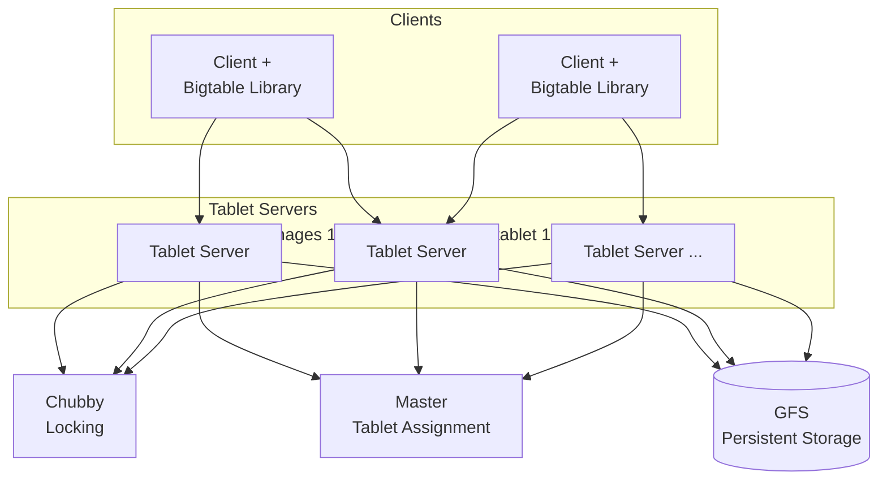
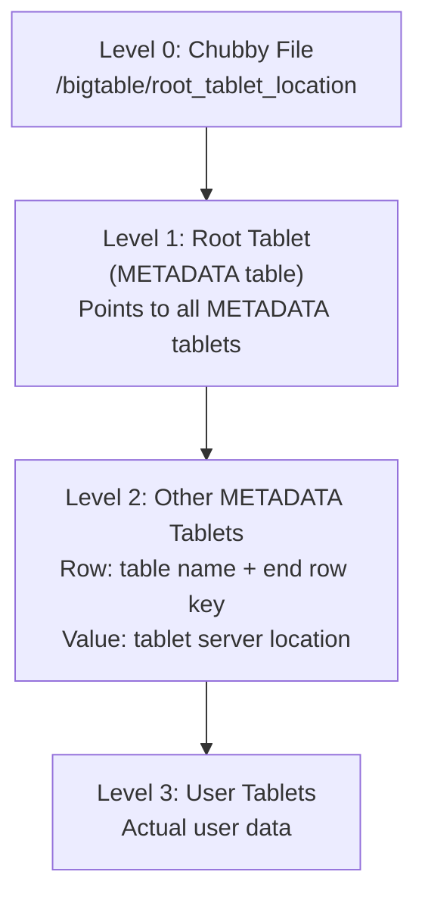
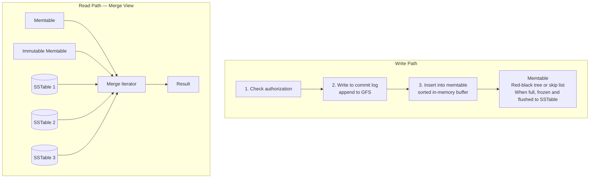

# Bigtable: A Distributed Storage System for Structured Data

## Paper Overview

**Authors:** Fay Chang et al. (Google)  
**Published:** OSDI 2006  
**Context:** Google's internal storage for web indexing, Google Earth, Google Finance

## TL;DR

Bigtable is a distributed storage system for managing structured data at petabyte scale. It provides a **sparse, distributed, persistent multi-dimensional sorted map** indexed by `(row, column, timestamp)`. Key innovations include **tablets** for horizontal scaling, **SSTable-based storage** with in-memory buffering, **single-row transactions** without full ACID, and integration with **GFS and Chubby** for storage and coordination. Bigtable influenced virtually all modern NoSQL databases.

---

## Problem Statement

Google needed storage for:
- **Web indexing**: Crawled pages, links, anchor text (petabytes)
- **Google Earth**: Satellite imagery at multiple resolutions
- **Google Finance**: Time-series stock data
- **Personalization**: User preferences across products

Requirements:
- Petabyte scale, billions of rows
- High throughput for batch processing
- Low latency for interactive serving
- Self-managing, automatic scaling
- Integration with MapReduce

---

## Data Model

```
┌─────────────────────────────────────────────────────────────────────────┐
│                    Bigtable Data Model                                   │
│                                                                          │
│   (row_key, column_key, timestamp) → value                              │
│                                                                          │
│   ┌──────────────────────────────────────────────────────────────────┐  │
│   │   Example: Web Table                                              │  │
│   │                                                                   │  │
│   │   Row Key: Reversed URL (com.google.www)                         │  │
│   │                                                                   │  │
│   │   ┌────────────────┬──────────────────┬──────────────────────┐   │  │
│   │   │    Row Key     │   contents:html  │   anchor:cnn.com     │   │  │
│   │   │                │                  │   anchor:nyt.com     │   │  │
│   │   ├────────────────┼──────────────────┼──────────────────────┤   │  │
│   │   │                │ t=5: "<html>..." │ t=9: "CNN"           │   │  │
│   │   │ com.google.www │ t=3: "<html>..." │ t=8: "click here"    │   │  │
│   │   │                │ t=1: "<html>..." │                      │   │  │
│   │   ├────────────────┼──────────────────┼──────────────────────┤   │  │
│   │   │ com.cnn.www    │ t=6: "<html>..." │ t=5: "CNN Home"      │   │  │
│   │   └────────────────┴──────────────────┴──────────────────────┘   │  │
│   │                                                                   │  │
│   │   Key Properties:                                                │  │
│   │   - Rows sorted lexicographically                               │  │
│   │   - Column families: contents, anchor                           │  │
│   │   - Columns: contents:html, anchor:cnn.com                      │  │
│   │   - Multiple versions per cell (timestamped)                    │  │
│   │   - Sparse: no storage for empty cells                          │  │
│   └──────────────────────────────────────────────────────────────────┘  │
└─────────────────────────────────────────────────────────────────────────┘
```

### Key Design Choices

```
┌─────────────────────────────────────────────────────────────────────────┐
│   Rows:                                                                 │
│   - Arbitrary string (up to 64KB)                                      │
│   - Single-row transactions (atomic read-modify-write)                 │
│   - Sorted by row key (locality for range scans)                       │
│                                                                          │
│   Column Families:                                                      │
│   - Groups of columns with common properties                           │
│   - Unit of access control                                             │
│   - Created at schema time (not dynamic)                               │
│   - Example: "anchor" family, "contents" family                        │
│                                                                          │
│   Columns:                                                              │
│   - Format: family:qualifier                                           │
│   - Qualifiers can be created dynamically                              │
│   - Example: anchor:cnn.com, anchor:nytimes.com                        │
│                                                                          │
│   Timestamps:                                                           │
│   - 64-bit integers (microseconds or user-defined)                     │
│   - Multiple versions per cell                                         │
│   - Garbage collection: keep last N versions or versions newer than T  │
└─────────────────────────────────────────────────────────────────────────┘
```

---

## Architecture



---

## Tablets

```
┌─────────────────────────────────────────────────────────────────────────┐
│                    Tablet: Unit of Distribution                          │
│                                                                          │
│   A tablet is a contiguous range of rows                                │
│                                                                          │
│   ┌──────────────────────────────────────────────────────────────────┐  │
│   │   Table: webtable                                                 │  │
│   │                                                                   │  │
│   │   ┌────────────────────────────────────────────────────────────┐ │  │
│   │   │ Tablet 1: rows [aaa...] to [com.facebook...]              │ │  │
│   │   │ Tablet 2: rows [com.google...] to [com.yahoo...]          │ │  │
│   │   │ Tablet 3: rows [com.youtube...] to [org.apache...]        │ │  │
│   │   │ Tablet 4: rows [org.wikipedia...] to [zzz...]             │ │  │
│   │   └────────────────────────────────────────────────────────────┘ │  │
│   │                                                                   │  │
│   │   As tablets grow, they split:                                   │  │
│   │   Tablet 2 → Tablet 2a [com.google...] to [com.twitter...]      │  │
│   │              Tablet 2b [com.uber...] to [com.yahoo...]          │  │
│   │                                                                   │  │
│   └──────────────────────────────────────────────────────────────────┘  │
│                                                                          │
│   Benefits:                                                             │
│   - Fine-grained load balancing (move tablets between servers)         │
│   - Efficient recovery (only restore failed tablet, not whole table)   │
│   - Parallel processing (distribute tablets across cluster)            │
└─────────────────────────────────────────────────────────────────────────┘
```

### Tablet Location



> Client caches tablet locations; cache invalidated on miss.
> 3 network round trips for cold cache, 0 for warm cache.

---

## SSTable Storage Format

```
┌─────────────────────────────────────────────────────────────────────────┐
│                    SSTable (Sorted String Table)                         │
│                                                                          │
│   Immutable, sorted file of key-value pairs                             │
│                                                                          │
│   ┌──────────────────────────────────────────────────────────────────┐  │
│   │                     SSTable File                                  │  │
│   │                                                                   │  │
│   │   ┌─────────────────────────────────────────────────────────┐    │  │
│   │   │                   Data Blocks                            │    │  │
│   │   │   ┌───────────┐ ┌───────────┐ ┌───────────┐             │    │  │
│   │   │   │  Block 0  │ │  Block 1  │ │  Block 2  │ ...         │    │  │
│   │   │   │  64KB     │ │  64KB     │ │  64KB     │             │    │  │
│   │   │   │ (sorted   │ │ (sorted   │ │ (sorted   │             │    │  │
│   │   │   │  k-v pairs)│ │  k-v pairs)│ │  k-v pairs)│            │    │  │
│   │   │   └───────────┘ └───────────┘ └───────────┘             │    │  │
│   │   └─────────────────────────────────────────────────────────┘    │  │
│   │                                                                   │  │
│   │   ┌─────────────────────────────────────────────────────────┐    │  │
│   │   │                   Index Block                            │    │  │
│   │   │   Block 0: key "aaa" at offset 0                        │    │  │
│   │   │   Block 1: key "bbb" at offset 65536                    │    │  │
│   │   │   Block 2: key "ccc" at offset 131072                   │    │  │
│   │   │   ...                                                    │    │  │
│   │   └─────────────────────────────────────────────────────────┘    │  │
│   │                                                                   │  │
│   │   ┌─────────────────────────────────────────────────────────┐    │  │
│   │   │                   Bloom Filter                           │    │  │
│   │   │   Fast "key might exist" / "key definitely doesn't"     │    │  │
│   │   └─────────────────────────────────────────────────────────┘    │  │
│   │                                                                   │  │
│   │   ┌─────────────────────────────────────────────────────────┐    │  │
│   │   │                   Footer                                 │    │  │
│   │   │   Offset to index block, bloom filter                   │    │  │
│   │   └─────────────────────────────────────────────────────────┘    │  │
│   └──────────────────────────────────────────────────────────────────┘  │
│                                                                          │
│   Read path:                                                            │
│   1. Load index into memory (small)                                     │
│   2. Binary search index for block containing key                       │
│   3. Load and search that one block                                     │
└─────────────────────────────────────────────────────────────────────────┘
```

---

## Tablet Serving



### Implementation

```python
from dataclasses import dataclass, field
from typing import Dict, List, Optional, Iterator, Tuple
import time
from sortedcontainers import SortedDict

@dataclass
class Cell:
    value: bytes
    timestamp: int

@dataclass
class ColumnFamily:
    name: str
    columns: Dict[str, List[Cell]] = field(default_factory=dict)
    max_versions: int = 3


class Memtable:
    """
    In-memory sorted buffer for recent writes.
    Implemented as sorted map.
    """
    
    def __init__(self, max_size_bytes: int = 64 * 1024 * 1024):
        self.data: SortedDict = SortedDict()  # row_key -> {cf -> {col -> [cells]}}
        self.size_bytes = 0
        self.max_size = max_size_bytes
        self.frozen = False
    
    def put(
        self,
        row_key: str,
        column_family: str,
        column: str,
        value: bytes,
        timestamp: Optional[int] = None
    ):
        """Insert or update a cell"""
        if self.frozen:
            raise Exception("Memtable is frozen")
        
        if timestamp is None:
            timestamp = int(time.time() * 1000000)
        
        if row_key not in self.data:
            self.data[row_key] = {}
        
        if column_family not in self.data[row_key]:
            self.data[row_key][column_family] = {}
        
        if column not in self.data[row_key][column_family]:
            self.data[row_key][column_family][column] = []
        
        cell = Cell(value=value, timestamp=timestamp)
        self.data[row_key][column_family][column].append(cell)
        
        # Sort by timestamp descending (newest first)
        self.data[row_key][column_family][column].sort(
            key=lambda c: c.timestamp, 
            reverse=True
        )
        
        self.size_bytes += len(row_key) + len(column_family) + len(column) + len(value) + 8
    
    def get(
        self,
        row_key: str,
        column_family: Optional[str] = None,
        column: Optional[str] = None,
        max_versions: int = 1
    ) -> Optional[Dict]:
        """Get cells for a row"""
        if row_key not in self.data:
            return None
        
        row_data = self.data[row_key]
        
        if column_family and column_family in row_data:
            if column and column in row_data[column_family]:
                return {column_family: {column: row_data[column_family][column][:max_versions]}}
            return {column_family: row_data[column_family]}
        
        return row_data
    
    def scan(
        self,
        start_row: str,
        end_row: str
    ) -> Iterator[Tuple[str, Dict]]:
        """Scan rows in range"""
        for row_key in self.data.irange(start_row, end_row, inclusive=(True, False)):
            yield row_key, self.data[row_key]
    
    def is_full(self) -> bool:
        return self.size_bytes >= self.max_size
    
    def freeze(self):
        """Freeze memtable for flushing"""
        self.frozen = True


class SSTableWriter:
    """Writes memtable to SSTable file format"""
    
    def __init__(self, file_path: str, block_size: int = 64 * 1024):
        self.file_path = file_path
        self.block_size = block_size
        self.index_entries = []
        self.bloom_filter = BloomFilter(expected_items=100000)
    
    def write(self, memtable: Memtable):
        """Write memtable to SSTable file"""
        with open(self.file_path, 'wb') as f:
            current_block = []
            current_block_size = 0
            block_offset = 0
            first_key_in_block = None
            
            for row_key, row_data in memtable.data.items():
                # Serialize row
                row_bytes = self._serialize_row(row_key, row_data)
                
                # Add to bloom filter
                self.bloom_filter.add(row_key)
                
                # Check if we need new block
                if current_block_size + len(row_bytes) > self.block_size and current_block:
                    # Write current block
                    block_data = b''.join(current_block)
                    f.write(block_data)
                    
                    # Record in index
                    self.index_entries.append((first_key_in_block, block_offset))
                    
                    block_offset += len(block_data)
                    current_block = []
                    current_block_size = 0
                    first_key_in_block = None
                
                if first_key_in_block is None:
                    first_key_in_block = row_key
                
                current_block.append(row_bytes)
                current_block_size += len(row_bytes)
            
            # Write last block
            if current_block:
                block_data = b''.join(current_block)
                f.write(block_data)
                self.index_entries.append((first_key_in_block, block_offset))
                block_offset += len(block_data)
            
            # Write index
            index_offset = block_offset
            f.write(self._serialize_index())
            
            # Write bloom filter
            bloom_offset = f.tell()
            f.write(self.bloom_filter.serialize())
            
            # Write footer
            f.write(self._serialize_footer(index_offset, bloom_offset))


class SSTableReader:
    """Reads from SSTable file"""
    
    def __init__(self, file_path: str):
        self.file_path = file_path
        self.index = []
        self.bloom_filter = None
        self._load_metadata()
    
    def _load_metadata(self):
        """Load index and bloom filter into memory"""
        with open(self.file_path, 'rb') as f:
            # Read footer
            f.seek(-16, 2)  # Last 16 bytes
            footer = f.read(16)
            index_offset, bloom_offset = struct.unpack('QQ', footer)
            
            # Load index
            f.seek(index_offset)
            index_data = f.read(bloom_offset - index_offset)
            self.index = self._parse_index(index_data)
            
            # Load bloom filter
            f.seek(bloom_offset)
            bloom_data = f.read()
            bloom_data = bloom_data[:-16]  # Exclude footer
            self.bloom_filter = BloomFilter.deserialize(bloom_data)
    
    def get(self, row_key: str) -> Optional[Dict]:
        """Get a row from SSTable"""
        # Check bloom filter first
        if not self.bloom_filter.might_contain(row_key):
            return None
        
        # Binary search index for block
        block_idx = self._find_block(row_key)
        if block_idx < 0:
            return None
        
        # Read and search block
        block = self._read_block(block_idx)
        return self._search_block(block, row_key)
    
    def _find_block(self, row_key: str) -> int:
        """Binary search to find block containing key"""
        left, right = 0, len(self.index) - 1
        result = -1
        
        while left <= right:
            mid = (left + right) // 2
            if self.index[mid][0] <= row_key:
                result = mid
                left = mid + 1
            else:
                right = mid - 1
        
        return result


class TabletServer:
    """
    Manages multiple tablets.
    Handles reads, writes, and compaction.
    """
    
    def __init__(self, server_id: str, gfs_client, chubby_client):
        self.server_id = server_id
        self.gfs = gfs_client
        self.chubby = chubby_client
        self.tablets: Dict[str, Tablet] = {}
    
    def load_tablet(self, tablet_id: str, metadata: dict):
        """Load a tablet from GFS"""
        tablet = Tablet(
            tablet_id=tablet_id,
            start_row=metadata['start_row'],
            end_row=metadata['end_row'],
            sstable_files=metadata['sstables'],
            gfs_client=self.gfs
        )
        
        # Replay commit log
        tablet.replay_log(metadata['commit_log'])
        
        self.tablets[tablet_id] = tablet
    
    def write(
        self,
        tablet_id: str,
        row_key: str,
        mutations: List[dict]
    ):
        """Write to a tablet"""
        tablet = self.tablets[tablet_id]
        
        # Write to commit log first (durability)
        log_entry = self._create_log_entry(row_key, mutations)
        tablet.commit_log.append(log_entry)
        
        # Apply to memtable
        for mutation in mutations:
            tablet.memtable.put(
                row_key=row_key,
                column_family=mutation['cf'],
                column=mutation['column'],
                value=mutation['value'],
                timestamp=mutation.get('timestamp')
            )
        
        # Check if memtable needs flushing
        if tablet.memtable.is_full():
            self._flush_memtable(tablet)
    
    def read(
        self,
        tablet_id: str,
        row_key: str,
        columns: Optional[List[str]] = None
    ) -> Optional[Dict]:
        """Read from a tablet"""
        tablet = self.tablets[tablet_id]
        
        # Merge from all sources
        result = {}
        
        # Check memtable (newest)
        mem_result = tablet.memtable.get(row_key)
        if mem_result:
            result = self._merge_results(result, mem_result)
        
        # Check immutable memtable
        if tablet.immutable_memtable:
            imm_result = tablet.immutable_memtable.get(row_key)
            if imm_result:
                result = self._merge_results(result, imm_result)
        
        # Check SSTables (oldest to newest)
        for sstable in tablet.sstables:
            sst_result = sstable.get(row_key)
            if sst_result:
                result = self._merge_results(result, sst_result)
        
        return result if result else None
    
    def _flush_memtable(self, tablet: 'Tablet'):
        """Flush memtable to SSTable"""
        # Freeze current memtable
        tablet.memtable.freeze()
        tablet.immutable_memtable = tablet.memtable
        tablet.memtable = Memtable()
        
        # Write to SSTable in background
        sstable_path = f"{tablet.tablet_id}_{time.time()}.sst"
        writer = SSTableWriter(sstable_path)
        writer.write(tablet.immutable_memtable)
        
        # Add to tablet's SSTables
        tablet.sstables.append(SSTableReader(sstable_path))
        tablet.immutable_memtable = None
        
        # Clear commit log
        tablet.commit_log.clear()
```

---

## Compaction

```
┌─────────────────────────────────────────────────────────────────────────┐
│                    Compaction Types                                      │
│                                                                          │
│   Minor Compaction:                                                     │
│   - Convert memtable to SSTable                                         │
│   - Frees memory                                                        │
│   - Reduces commit log                                                  │
│                                                                          │
│   Merging Compaction:                                                   │
│   - Merge multiple SSTables into one                                    │
│   - Reduces number of files to check on read                           │
│   - Reclaims space from deletions                                       │
│                                                                          │
│   Major Compaction:                                                     │
│   - Merge ALL SSTables into single SSTable                             │
│   - Removes all deleted data and old versions                          │
│   - Most expensive, done periodically                                   │
│                                                                          │
│   ┌──────────────────────────────────────────────────────────────────┐  │
│   │   Before Merging:                                                 │  │
│   │   SST1: [(a,1), (b,1), (c,1)]                                    │  │
│   │   SST2: [(a,2), (d,1)]         a has newer version in SST2       │  │
│   │   SST3: [(b, DELETE), (e,1)]   b is deleted                      │  │
│   │                                                                   │  │
│   │   After Major Compaction:                                        │  │
│   │   SST: [(a,2), (c,1), (d,1), (e,1)]                              │  │
│   │                                                                   │  │
│   │   - Old version of 'a' removed                                   │  │
│   │   - 'b' deleted entirely                                         │  │
│   │   - Space reclaimed                                              │  │
│   └──────────────────────────────────────────────────────────────────┘  │
└─────────────────────────────────────────────────────────────────────────┘
```

---

## Locality Groups

```
┌─────────────────────────────────────────────────────────────────────────┐
│                    Locality Groups                                       │
│                                                                          │
│   Column families can be grouped into locality groups                   │
│   Each locality group stored in separate SSTable                        │
│                                                                          │
│   ┌──────────────────────────────────────────────────────────────────┐  │
│   │   Example: Web crawl table                                        │  │
│   │                                                                   │  │
│   │   Locality Group 1: "contents"                                   │  │
│   │   - Column family: contents                                      │  │
│   │   - Large, read infrequently                                     │  │
│   │   - Stored on disk                                               │  │
│   │                                                                   │  │
│   │   Locality Group 2: "metadata"                                   │  │
│   │   - Column families: language, checksum, links                   │  │
│   │   - Small, read frequently                                       │  │
│   │   - Cached in memory                                             │  │
│   │                                                                   │  │
│   │   Benefits:                                                      │  │
│   │   - Read language without loading contents                       │  │
│   │   - Better cache utilization                                     │  │
│   │   - Different compression for different types                    │  │
│   │                                                                   │  │
│   └──────────────────────────────────────────────────────────────────┘  │
│                                                                          │
│   Options per locality group:                                           │
│   - In-memory (for small, frequently accessed data)                    │
│   - Compression algorithm (none, gzip, snappy)                         │
│   - Bloom filter settings                                              │
└─────────────────────────────────────────────────────────────────────────┘
```

---

## Master Operations

```python
class BigtableMaster:
    """
    Master server responsibilities:
    - Tablet assignment to servers
    - Detecting tablet server failures
    - Load balancing tablets
    - Schema changes
    """
    
    def __init__(self, chubby_client):
        self.chubby = chubby_client
        self.tablet_servers: Dict[str, TabletServerInfo] = {}
        self.tablet_assignments: Dict[str, str] = {}  # tablet_id -> server_id
        
        # Acquire master lock in Chubby
        self.master_lock = self.chubby.acquire("/bigtable/master")
    
    def assign_tablet(self, tablet_id: str):
        """Assign an unassigned tablet to a server"""
        # Find server with least load
        target_server = self._find_least_loaded_server()
        
        # Update METADATA table
        self._update_metadata(tablet_id, target_server)
        
        # Notify tablet server
        self._send_assignment(target_server, tablet_id)
        
        self.tablet_assignments[tablet_id] = target_server
    
    def monitor_tablet_servers(self):
        """Monitor tablet server health via Chubby"""
        # Each tablet server holds exclusive lock on file in Chubby
        # Lock directory: /bigtable/servers/{server_id}
        
        while True:
            for server_id, info in list(self.tablet_servers.items()):
                lock_path = f"/bigtable/servers/{server_id}"
                
                if not self.chubby.file_exists(lock_path):
                    # Server lost its lock - it's dead
                    self._handle_server_failure(server_id)
            
            time.sleep(1)
    
    def _handle_server_failure(self, server_id: str):
        """Reassign tablets from failed server"""
        # Find tablets assigned to failed server
        tablets_to_reassign = [
            tid for tid, sid in self.tablet_assignments.items()
            if sid == server_id
        ]
        
        # Remove server from active set
        del self.tablet_servers[server_id]
        
        # Reassign each tablet
        for tablet_id in tablets_to_reassign:
            del self.tablet_assignments[tablet_id]
            self.assign_tablet(tablet_id)
    
    def split_tablet(self, tablet_id: str, split_key: str):
        """Split a tablet that has grown too large"""
        current_server = self.tablet_assignments[tablet_id]
        
        # Create two new tablet entries in METADATA
        new_tablet_id_1 = f"{tablet_id}_a"
        new_tablet_id_2 = f"{tablet_id}_b"
        
        # Old tablet: [start, end) → [start, split_key) and [split_key, end)
        
        # Update METADATA
        self._create_tablet_metadata(new_tablet_id_1, start_row, split_key)
        self._create_tablet_metadata(new_tablet_id_2, split_key, end_row)
        
        # Assign tablets (may go to different servers for load balance)
        self.assign_tablet(new_tablet_id_1)
        self.assign_tablet(new_tablet_id_2)
```

---

## Optimizations

### Bloom Filters

```
Avoid disk reads for non-existent keys

┌──────────────────────────────────────────────────────────────────┐
│ Before:                                                          │
│   Read "xyz" → check every SSTable → not found                  │
│   Cost: Multiple disk reads                                      │
│                                                                  │
│ After:                                                           │
│   Read "xyz" → bloom filter says "definitely not" → skip file   │
│   Cost: In-memory bit check                                      │
│                                                                  │
│ False positive rate ~1% with 10 bits per key                    │
└──────────────────────────────────────────────────────────────────┘
```

### Block Cache

```
Two-level caching:
1. Scan cache: For sequential reads (MapReduce)
2. Block cache: For random reads (serving)

Trade-off configurable per table based on workload
```

### Commit Log Optimization

```
┌──────────────────────────────────────────────────────────────────┐
│ Problem:                                                         │
│   Separate log per tablet → many concurrent writes to GFS       │
│                                                                  │
│ Solution:                                                        │
│   Single log per tablet server, interleaved entries             │
│                                                                  │
│ Recovery complexity:                                             │
│   Sort log by (tablet, sequence) → parallel replay per tablet   │
└──────────────────────────────────────────────────────────────────┘
```

---

## Real-World Usage at Google

| Application | Data Size | Notes |
|-------------|-----------|-------|
| Google Analytics | 200 TB | Click stream data |
| Google Earth | 70 TB | Satellite imagery |
| Personalized Search | 4 PB | User indices |
| Crawl | 800 TB | Web pages |
| Orkut | 9 TB | Social graph |

---

## Influence and Legacy

### Direct Descendants
- **Apache HBase** - Open source Bigtable implementation
- **Apache Cassandra** - Combined Bigtable data model with Dynamo distribution

### Concepts Adopted
- SSTable format (RocksDB, LevelDB)
- LSM-tree storage (most modern databases)
- Tablet-based sharding
- Column families
- Multi-version timestamps

---

## Key Takeaways

1. **Simple data model, complex implementation** - Sparse map with timestamps is easy to understand, powerful in practice.

2. **Single-row transactions sufficient** - Most applications don't need cross-row ACID.

3. **SSTables + memtables = LSM tree** - Write-optimized storage with good read performance.

4. **Locality groups optimize access patterns** - Separate storage for different column families.

5. **Tablets enable fine-grained scaling** - Move, split, and replicate at tablet granularity.

6. **Bloom filters essential for sparse data** - Avoid disk reads for absent keys.

7. **Build on reliable components** - GFS for storage, Chubby for coordination.

8. **Compression and caching are critical** - Trade CPU for I/O at this scale.
