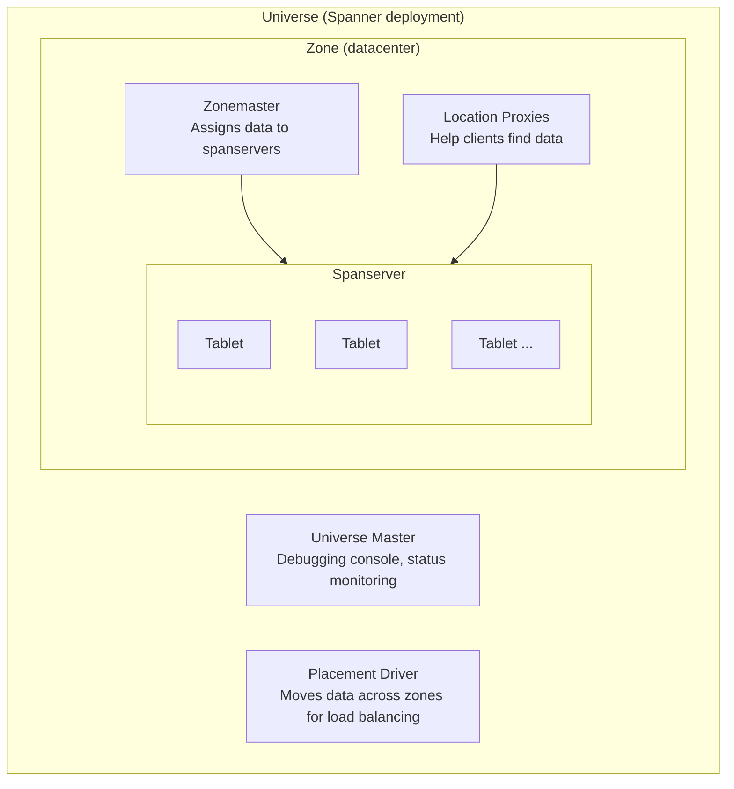
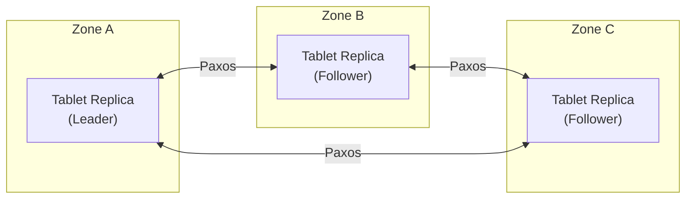
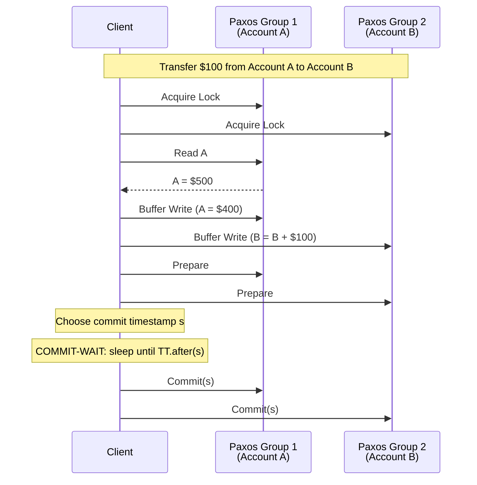

# Spanner: Google's Globally Distributed Database

## Paper Overview

**Authors:** James C. Corbett et al. (Google)  
**Published:** OSDI 2012  
**Context:** Powers Google's advertising backend, F1

## TL;DR

Spanner is a globally distributed database that provides **external consistency** (the strongest form of consistency) for distributed transactions. Its key innovation is **TrueTime**, a globally synchronized clock API with bounded uncertainty, which enables **lock-free read-only transactions** and globally consistent snapshots. Spanner combines the schema and SQL of traditional databases with the scalability of NoSQL systems.

---

## Problem Statement

Previous Google systems had trade-offs:
- **Bigtable**: Scalable but no cross-row transactions
- **Megastore**: Transactions but poor write throughput
- **MySQL shards**: Neither scalable nor globally distributed

Applications needed:
- Global distribution for latency and availability
- Strong consistency for correctness
- SQL and schemas for developer productivity
- Horizontal scalability

---

## Key Innovation: TrueTime

```
┌─────────────────────────────────────────────────────────────────────────┐
│                    TrueTime API                                          │
│                                                                          │
│   Traditional clocks give a single timestamp:                           │
│   now() → 1234567890                                                    │
│                                                                          │
│   TrueTime returns an interval with bounded uncertainty:                │
│   TT.now() → [earliest, latest]                                        │
│                                                                          │
│   ┌──────────────────────────────────────────────────────────────────┐  │
│   │   Guarantee: actual time is within [earliest, latest]            │  │
│   │                                                                   │  │
│   │   ──────────────┬──────────────────────┬────────────────────────│  │
│   │                 │      uncertainty      │                        │  │
│   │             earliest                 latest                      │  │
│   │                 │◀────── ε ──────────▶│                         │  │
│   │                         │                                        │  │
│   │                    actual time                                   │  │
│   │                    (somewhere in here)                           │  │
│   │                                                                   │  │
│   │   Typical ε (epsilon): 1-7ms                                     │  │
│   └──────────────────────────────────────────────────────────────────┘  │
│                                                                          │
│   How it works:                                                         │
│   - GPS receivers in datacenters (accurate to microseconds)            │
│   - Atomic clocks as backup                                            │
│   - Time masters in each datacenter                                    │
│   - Daemon on each machine polls time masters                          │
│   - Uncertainty grows between polls, shrinks after sync                │
└─────────────────────────────────────────────────────────────────────────┘
```

### TrueTime Implementation

```python
from dataclasses import dataclass
from typing import Tuple
import time

@dataclass
class TTInterval:
    """TrueTime interval representing bounded uncertainty"""
    earliest: float  # Microseconds since epoch
    latest: float
    
    @property
    def uncertainty(self) -> float:
        """Uncertainty epsilon in microseconds"""
        return (self.latest - self.earliest) / 2


class TrueTime:
    """
    TrueTime API simulation.
    In real Spanner, backed by GPS/atomic clock infrastructure.
    """
    
    def __init__(self, max_clock_drift_us: float = 200):
        self.max_drift = max_clock_drift_us
        self.last_sync = time.time()
        self.sync_interval = 30.0  # Sync every 30 seconds
    
    def now(self) -> TTInterval:
        """
        Get current time as interval.
        Uncertainty grows between syncs.
        """
        current = time.time()
        
        # Calculate uncertainty based on time since last sync
        time_since_sync = current - self.last_sync
        uncertainty = self.max_drift * (time_since_sync / self.sync_interval)
        
        # Bound uncertainty
        uncertainty = min(uncertainty, 7000)  # Max 7ms
        
        current_us = current * 1_000_000
        
        return TTInterval(
            earliest=current_us - uncertainty,
            latest=current_us + uncertainty
        )
    
    def after(self, t: float) -> bool:
        """Returns true if t is definitely in the past"""
        return self.now().earliest > t
    
    def before(self, t: float) -> bool:
        """Returns true if t is definitely in the future"""
        return self.now().latest < t
```

---

## Architecture



---

## Data Model

```
┌─────────────────────────────────────────────────────────────────────────┐
│                    Spanner Data Model                                    │
│                                                                          │
│   Directories (sharding unit):                                          │
│   ┌──────────────────────────────────────────────────────────────────┐  │
│   │   A directory = set of contiguous rows sharing a common prefix   │  │
│   │                                                                   │  │
│   │   Table: Users                                                   │  │
│   │   ┌────────────────────────────────────────────────────────────┐ │  │
│   │   │ user_id  │ name      │ email              │ created_at     │ │  │
│   │   ├──────────┼───────────┼────────────────────┼────────────────┤ │  │
│   │   │ 1001     │ Alice     │ alice@example.com  │ 2024-01-01     │ │  │
│   │   │ 1002     │ Bob       │ bob@example.com    │ 2024-01-02     │ │  │
│   │   └────────────────────────────────────────────────────────────┘ │  │
│   │                                                                   │  │
│   │   Table: Albums (interleaved with Users)                         │  │
│   │   ┌────────────────────────────────────────────────────────────┐ │  │
│   │   │ user_id  │ album_id │ title              │ created_at      │ │  │
│   │   ├──────────┼──────────┼────────────────────┼─────────────────┤ │  │
│   │   │ 1001     │ 1        │ "Vacation 2024"    │ 2024-01-15      │ │  │
│   │   │ 1001     │ 2        │ "Family"           │ 2024-02-01      │ │  │
│   │   │ 1002     │ 1        │ "Pets"             │ 2024-01-10      │ │  │
│   │   └────────────────────────────────────────────────────────────┘ │  │
│   │                                                                   │  │
│   │   Interleaving (colocates related data):                         │  │
│   │                                                                   │  │
│   │   Physical storage:                                              │  │
│   │   ┌────────────────────────────────────────────────────────────┐ │  │
│   │   │ user:1001                                                  │ │  │
│   │   │ user:1001/album:1                                          │ │  │
│   │   │ user:1001/album:2                                          │ │  │
│   │   │ user:1002                                                  │ │  │
│   │   │ user:1002/album:1                                          │ │  │
│   │   └────────────────────────────────────────────────────────────┘ │  │
│   │                                                                   │  │
│   │   Directory = all rows with same user_id prefix                  │  │
│   │   → Can be moved/replicated together                             │  │
│   └──────────────────────────────────────────────────────────────────┘  │
└─────────────────────────────────────────────────────────────────────────┘
```

---

## Replication with Paxos



> **Leader responsibilities:** Coordinates Paxos, assigns timestamps to transactions, maintains lock table for pessimistic concurrency.
> **Leader election:** 10-second lease (refreshed by Paxos); must wait for lease to expire before new leader.
> Paxos group per tablet = unit of replication. Typically 3 or 5 replicas. Majority must agree for writes.

---

## Transactions

### Read-Write Transactions



### Commit Wait

```
┌─────────────────────────────────────────────────────────────────────────┐
│                    Commit Wait: The Key to External Consistency          │
│                                                                          │
│   Problem: Two transactions on different machines                       │
│   - T1 commits at time s1                                              │
│   - T2 starts after T1 commits (from wall-clock perspective)           │
│   - T2 must see T1's effects (external consistency)                    │
│                                                                          │
│   Without TrueTime:                                                     │
│   - Clocks might disagree about ordering                               │
│   - T2 could get timestamp < s1 even though it started later           │
│                                                                          │
│   With TrueTime and Commit Wait:                                        │
│   ┌──────────────────────────────────────────────────────────────────┐  │
│   │                                                                   │  │
│   │   T1 chooses s1 at TT.now().latest                               │  │
│   │   T1 waits until TT.after(s1) = true                             │  │
│   │   T1 commits and notifies client                                 │  │
│   │                                                                   │  │
│   │   ───────┬─────────────────────────┬──────────────────────────   │  │
│   │          │    commit-wait period    │                            │  │
│   │          │                         │                             │  │
│   │          s1                    TT.after(s1)                      │  │
│   │          │                         │                             │  │
│   │          ▼                         ▼                             │  │
│   │      [s1 could be here]    [s1 definitely passed]               │  │
│   │                                                                   │  │
│   │   When T2 starts (after T1 commits):                             │  │
│   │   - T1's commit is in the past                                   │  │
│   │   - T2's timestamp will be > s1                                  │  │
│   │   - T2 will see T1's effects                                     │  │
│   │                                                                   │  │
│   └──────────────────────────────────────────────────────────────────┘  │
│                                                                          │
│   Commit-wait duration = 2ε (twice the uncertainty)                    │
│   Typical: 2-14ms (worth it for correctness)                           │
└─────────────────────────────────────────────────────────────────────────┘
```

### Read-Only Transactions (Lock-Free)

```
┌─────────────────────────────────────────────────────────────────────────┐
│                    Lock-Free Read-Only Transactions                      │
│                                                                          │
│   Read-only transactions don't need locks!                              │
│                                                                          │
│   Algorithm:                                                            │
│   1. Assign timestamp sread = TT.now().latest                          │
│   2. Read data at timestamp sread from any replica                     │
│   3. Wait for replica to have data up to sread (safe time)             │
│                                                                          │
│   ┌──────────────────────────────────────────────────────────────────┐  │
│   │   Why this works:                                                 │  │
│   │                                                                   │  │
│   │   - sread = TT.now().latest guarantees actual time <= sread      │  │
│   │   - All commits before sread are visible (commit-wait ensures)   │  │
│   │   - No future commits will have timestamp <= sread               │  │
│   │   - Therefore: snapshot at sread is consistent!                  │  │
│   │                                                                   │  │
│   │   Benefits:                                                      │  │
│   │   - No coordination needed                                       │  │
│   │   - Read from any replica (locality)                            │  │
│   │   - No blocking on write transactions                           │  │
│   │   - Scales horizontally with read replicas                      │  │
│   └──────────────────────────────────────────────────────────────────┘  │
│                                                                          │
│   Safe Time:                                                            │
│   - Each replica tracks safe time tsafe                                │
│   - tsafe = min(Paxos safe time, prepared transaction time)           │
│   - Read at sread waits until tsafe >= sread                          │
│   - Typically only waits for Paxos to catch up                        │
└─────────────────────────────────────────────────────────────────────────┘
```

---

## Implementation

```python
from dataclasses import dataclass, field
from typing import Dict, List, Optional, Set, Tuple
from enum import Enum
import threading
import time

class TransactionState(Enum):
    ACTIVE = "active"
    PREPARED = "prepared"
    COMMITTED = "committed"
    ABORTED = "aborted"

@dataclass
class Lock:
    key: str
    mode: str  # "shared" or "exclusive"
    holder: str  # Transaction ID

@dataclass
class Transaction:
    txn_id: str
    state: TransactionState
    start_time: float
    commit_time: Optional[float] = None
    read_set: Set[str] = field(default_factory=set)
    write_buffer: Dict[str, bytes] = field(default_factory=dict)
    participants: Set[str] = field(default_factory=set)  # Paxos group IDs


class SpannerCoordinator:
    """
    Transaction coordinator for Spanner.
    Handles 2PC with Paxos participants.
    """
    
    def __init__(self, true_time: TrueTime):
        self.tt = true_time
        self.transactions: Dict[str, Transaction] = {}
        self.lock_table: Dict[str, Lock] = {}
        self.lock = threading.Lock()
    
    def begin_transaction(self, txn_id: str) -> Transaction:
        """Start a new read-write transaction"""
        txn = Transaction(
            txn_id=txn_id,
            state=TransactionState.ACTIVE,
            start_time=self.tt.now().latest
        )
        self.transactions[txn_id] = txn
        return txn
    
    def acquire_lock(
        self, 
        txn_id: str, 
        key: str, 
        mode: str
    ) -> bool:
        """Acquire lock using two-phase locking"""
        with self.lock:
            existing = self.lock_table.get(key)
            
            if existing is None:
                # No lock held
                self.lock_table[key] = Lock(key=key, mode=mode, holder=txn_id)
                return True
            
            if existing.holder == txn_id:
                # Already hold lock, maybe upgrade
                if mode == "exclusive" and existing.mode == "shared":
                    existing.mode = "exclusive"
                return True
            
            if mode == "shared" and existing.mode == "shared":
                # Shared locks compatible
                return True
            
            # Conflict - would need to wait or abort
            return False
    
    def read(
        self, 
        txn_id: str, 
        key: str, 
        paxos_group: 'PaxosGroup'
    ) -> Optional[bytes]:
        """Read a key within transaction"""
        txn = self.transactions[txn_id]
        
        # Check write buffer first
        if key in txn.write_buffer:
            return txn.write_buffer[key]
        
        # Acquire shared lock
        if not self.acquire_lock(txn_id, key, "shared"):
            raise LockConflictError(f"Cannot acquire lock on {key}")
        
        txn.read_set.add(key)
        txn.participants.add(paxos_group.group_id)
        
        # Read from Paxos group
        return paxos_group.read(key)
    
    def write(
        self, 
        txn_id: str, 
        key: str, 
        value: bytes,
        paxos_group: 'PaxosGroup'
    ):
        """Buffer a write within transaction"""
        txn = self.transactions[txn_id]
        
        # Acquire exclusive lock
        if not self.acquire_lock(txn_id, key, "exclusive"):
            raise LockConflictError(f"Cannot acquire lock on {key}")
        
        txn.write_buffer[key] = value
        txn.participants.add(paxos_group.group_id)
    
    def commit(self, txn_id: str, paxos_groups: Dict[str, 'PaxosGroup']) -> float:
        """
        Commit transaction using 2PC over Paxos groups.
        Returns commit timestamp.
        """
        txn = self.transactions[txn_id]
        
        # Phase 1: Prepare all participants
        prepare_timestamps = []
        
        for group_id in txn.participants:
            group = paxos_groups[group_id]
            
            # Get writes for this group
            group_writes = {
                k: v for k, v in txn.write_buffer.items()
                if self._key_belongs_to_group(k, group_id)
            }
            
            # Prepare returns prepare timestamp
            prepare_ts = group.prepare(txn_id, group_writes)
            prepare_timestamps.append(prepare_ts)
        
        # Choose commit timestamp: max of all prepare timestamps
        # and at least TT.now().latest
        commit_ts = max(
            max(prepare_timestamps) if prepare_timestamps else 0,
            self.tt.now().latest
        )
        
        txn.commit_time = commit_ts
        txn.state = TransactionState.PREPARED
        
        # COMMIT-WAIT: Wait until commit timestamp is definitely in the past
        self._commit_wait(commit_ts)
        
        # Phase 2: Commit all participants
        for group_id in txn.participants:
            group = paxos_groups[group_id]
            group.commit(txn_id, commit_ts)
        
        txn.state = TransactionState.COMMITTED
        
        # Release locks
        self._release_locks(txn_id)
        
        return commit_ts
    
    def _commit_wait(self, commit_ts: float):
        """Wait until commit timestamp is definitely in the past"""
        while not self.tt.after(commit_ts):
            time.sleep(0.001)  # 1ms sleep
    
    def _release_locks(self, txn_id: str):
        """Release all locks held by transaction"""
        with self.lock:
            keys_to_release = [
                k for k, lock in self.lock_table.items()
                if lock.holder == txn_id
            ]
            for key in keys_to_release:
                del self.lock_table[key]


class ReadOnlyTransaction:
    """
    Lock-free read-only transaction.
    Uses snapshot isolation with TrueTime.
    """
    
    def __init__(self, true_time: TrueTime):
        self.tt = true_time
        self.read_timestamp = self.tt.now().latest
    
    def read(
        self, 
        key: str, 
        paxos_group: 'PaxosGroup'
    ) -> Optional[bytes]:
        """
        Read at snapshot timestamp.
        No locks needed - reads are consistent.
        """
        # Wait for safe time
        paxos_group.wait_for_safe_time(self.read_timestamp)
        
        # Read at snapshot
        return paxos_group.read_at(key, self.read_timestamp)


class PaxosGroup:
    """
    A Paxos replication group managing a set of tablets.
    """
    
    def __init__(self, group_id: str, replicas: List[str]):
        self.group_id = group_id
        self.replicas = replicas
        self.leader: Optional[str] = None
        self.data: Dict[str, List[Tuple[float, bytes]]] = {}  # key -> [(ts, value)]
        self.safe_time = 0.0
        self.prepared_txns: Dict[str, Tuple[float, Dict]] = {}  # txn_id -> (ts, writes)
    
    def prepare(self, txn_id: str, writes: Dict[str, bytes]) -> float:
        """
        Prepare phase of 2PC.
        Returns prepare timestamp.
        """
        prepare_ts = time.time() * 1_000_000
        
        # Log prepare to Paxos
        self._paxos_log({
            "type": "prepare",
            "txn_id": txn_id,
            "timestamp": prepare_ts,
            "writes": writes
        })
        
        self.prepared_txns[txn_id] = (prepare_ts, writes)
        
        return prepare_ts
    
    def commit(self, txn_id: str, commit_ts: float):
        """
        Commit phase of 2PC.
        Applies writes at commit timestamp.
        """
        _, writes = self.prepared_txns.pop(txn_id)
        
        # Log commit to Paxos
        self._paxos_log({
            "type": "commit",
            "txn_id": txn_id,
            "timestamp": commit_ts
        })
        
        # Apply writes
        for key, value in writes.items():
            if key not in self.data:
                self.data[key] = []
            self.data[key].append((commit_ts, value))
            # Keep sorted by timestamp
            self.data[key].sort(key=lambda x: x[0])
        
        # Advance safe time
        self._update_safe_time()
    
    def read_at(self, key: str, timestamp: float) -> Optional[bytes]:
        """Read value at specific timestamp (snapshot read)"""
        if key not in self.data:
            return None
        
        # Find latest version <= timestamp
        for ts, value in reversed(self.data[key]):
            if ts <= timestamp:
                return value
        
        return None
    
    def wait_for_safe_time(self, timestamp: float):
        """Wait until safe time >= timestamp"""
        while self.safe_time < timestamp:
            time.sleep(0.001)
    
    def _update_safe_time(self):
        """
        Update safe time.
        Safe time = min of Paxos safe time and minimum prepared timestamp.
        """
        paxos_safe = self._get_paxos_safe_time()
        
        if self.prepared_txns:
            min_prepared = min(ts for ts, _ in self.prepared_txns.values())
            self.safe_time = min(paxos_safe, min_prepared)
        else:
            self.safe_time = paxos_safe
    
    def _get_paxos_safe_time(self) -> float:
        """Get safe time from Paxos (simplified)"""
        # In real implementation, this comes from Paxos replication lag
        return time.time() * 1_000_000 - 1000  # 1ms behind
    
    def _paxos_log(self, entry: dict):
        """Log entry through Paxos consensus (simplified)"""
        # In real implementation, this would replicate to Paxos followers
        pass
```

---

## Schema Changes

```
┌─────────────────────────────────────────────────────────────────────────┐
│                    Non-Blocking Schema Changes                           │
│                                                                          │
│   Traditional approach: Take table offline for DDL                      │
│   Spanner approach: Multi-phase, distributed, non-blocking             │
│                                                                          │
│   ┌──────────────────────────────────────────────────────────────────┐  │
│   │   Example: Add column with default value                          │  │
│   │                                                                   │  │
│   │   Phase 1: Prepare                                               │  │
│   │   - Schema change registered with timestamp t1                   │  │
│   │   - All servers notified                                         │  │
│   │                                                                   │  │
│   │   Phase 2: Transition (at t1)                                    │  │
│   │   - New writes include new column                                │  │
│   │   - Reads return default for missing values                      │  │
│   │                                                                   │  │
│   │   Phase 3: Backfill (in background)                              │  │
│   │   - Update existing rows with default value                      │  │
│   │   - Uses internal transactions                                   │  │
│   │                                                                   │  │
│   │   Phase 4: Complete                                              │  │
│   │   - Schema change fully active                                   │  │
│   │   - Old schema no longer valid                                   │  │
│   │                                                                   │  │
│   └──────────────────────────────────────────────────────────────────┘  │
│                                                                          │
│   No downtime, no locking of reads/writes during change!               │
└─────────────────────────────────────────────────────────────────────────┘
```

---

## Performance Results

### Latency (from paper)

| Operation | Mean | 99th percentile |
|-----------|------|-----------------|
| Read-only txn (1 read) | 8.7ms | 31.5ms |
| Read-only txn (across DCs) | 14.4ms | 52.4ms |
| Read-write txn (1 write) | 17.0ms | 75.0ms |
| Commit-wait contribution | ~2-4ms | ~8ms |

### Scalability

- Linear write scaling with Paxos groups
- Linear read scaling with replicas
- F1 (AdWords): 2+ PB, millions of QPS

---

## Influence and Legacy

### Direct Influence
- **CockroachDB** - Open-source Spanner-like database
- **TiDB** - Distributed SQL with similar design
- **YugabyteDB** - Spanner-inspired distributed SQL
- **Cloud Spanner** - Google's managed service

### Key Innovations Adopted
- TrueTime/HLC for ordering
- Lock-free read-only transactions
- Interleaved tables for locality
- Non-blocking schema changes

---

## Key Takeaways

1. **TrueTime enables external consistency** - Bounded clock uncertainty + commit-wait ensures global ordering.

2. **Lock-free reads scale infinitely** - Read-only transactions don't coordinate, read from any replica.

3. **Commit-wait is the price for correctness** - Few milliseconds of latency for guaranteed consistency.

4. **Interleaving collocates related data** - Reduces distributed transactions for common access patterns.

5. **Paxos per shard, 2PC across shards** - Replication and transactions handled at different levels.

6. **Schema changes without downtime** - Multi-phase approach keeps database available.

7. **GPS + atomic clocks matter** - Investment in infrastructure enables simpler algorithms.

8. **Strong consistency is achievable globally** - Don't settle for eventual consistency if you don't have to.
