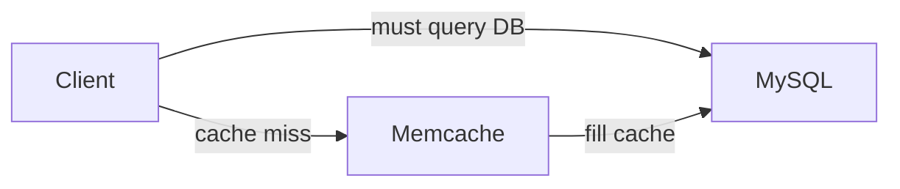
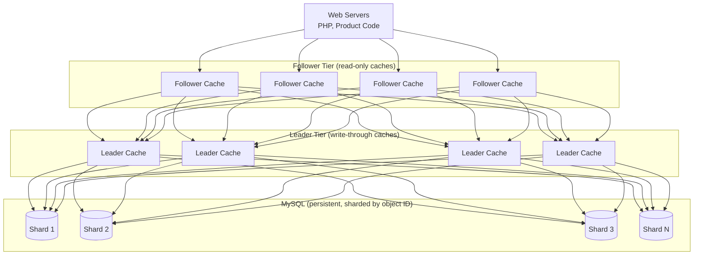
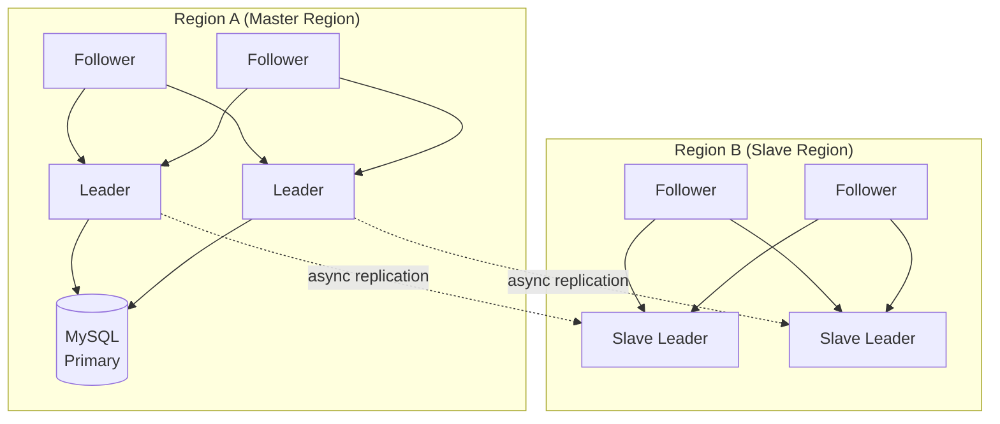

# TAO: Facebook's Distributed Data Store for the Social Graph

## Paper Overview

- **Title**: TAO: Facebook's Distributed Data Store for the Social Graph
- **Authors**: Nathan Bronson, Zach Amsden, George Cabrera, et al.
- **Published**: USENIX ATC 2013
- **Context**: Facebook needed efficient read-heavy storage for social graph data

## TL;DR

TAO is a geographically distributed, read-optimized data store that provides:
- **Graph-native API** for objects and associations
- **Read-through/write-through caching** for efficiency
- **Eventually consistent** with per-object consistency
- **Handles billions of reads per second** with minimal latency

## Problem Statement

### Challenges with Existing Solutions

```
┌─────────────────────────────────────────────────────────────────┐
│                     Facebook's Requirements                      │
├─────────────────────────────────────────────────────────────────┤
│                                                                  │
│  1. Read-Dominated Workload                                     │
│     - 99.8% reads, 0.2% writes                                  │
│     - Memcached alone couldn't handle graph queries             │
│                                                                  │
│  2. Graph Data Model                                            │
│     - Objects: Users, Posts, Photos, etc.                       │
│     - Associations: Friendships, Likes, Comments                │
│                                                                  │
│  3. Global Scale                                                │
│     - Billions of users                                         │
│     - Hundreds of billions of objects/associations              │
│     - Multiple data centers worldwide                           │
│                                                                  │
│  4. Consistency Requirements                                    │
│     - Users should see their own writes                         │
│     - Eventually consistent is acceptable for others            │
│                                                                  │
└─────────────────────────────────────────────────────────────────┘
```

### Why Not Just Memcached + MySQL?



> **Lookaside Cache Issues:**
> 1. Clients must handle cache misses
> 2. Thundering herd on popular items
> 3. No graph-aware operations
> 4. Stale data after writes

## TAO Data Model

### Objects and Associations

```
┌─────────────────────────────────────────────────────────────────┐
│                        TAO Data Model                           │
├─────────────────────────────────────────────────────────────────┤
│                                                                  │
│  OBJECTS (Nodes)                                                │
│  ┌──────────────────────────────────────────────┐               │
│  │  (id) ─────> (otype, data)                   │               │
│  │                                               │               │
│  │  Example:                                     │               │
│  │  id: 12345                                    │               │
│  │  otype: USER                                  │               │
│  │  data: {name: "Alice", ...}                  │               │
│  └──────────────────────────────────────────────┘               │
│                                                                  │
│  ASSOCIATIONS (Edges)                                           │
│  ┌──────────────────────────────────────────────┐               │
│  │  (id1, atype, id2) ─────> (time, data)       │               │
│  │                                               │               │
│  │  Example:                                     │               │
│  │  id1: 12345 (Alice)                          │               │
│  │  atype: FRIEND                                │               │
│  │  id2: 67890 (Bob)                            │               │
│  │  time: 1609459200                             │               │
│  │  data: {}                                     │               │
│  └──────────────────────────────────────────────┘               │
│                                                                  │
│  Association Lists (sorted by time descending)                  │
│  ┌──────────────────────────────────────────────┐               │
│  │  (id1, atype) ─────> [(id2, time, data), ...]│               │
│  │                                               │               │
│  │  Example: Alice's friends                     │               │
│  │  (12345, FRIEND) -> [(67890, t1), (11111, t2)]│               │
│  └──────────────────────────────────────────────┘               │
│                                                                  │
└─────────────────────────────────────────────────────────────────┘
```

### TAO API

```python
class TaoAPI:
    """TAO's graph-native API."""
    
    # Object operations
    def object_get(self, id: int) -> dict:
        """Get object by ID."""
        pass
    
    def object_create(self, otype: str, data: dict) -> int:
        """Create new object, return ID."""
        pass
    
    def object_update(self, id: int, data: dict) -> bool:
        """Update object data."""
        pass
    
    def object_delete(self, id: int) -> bool:
        """Delete object."""
        pass
    
    # Association operations
    def assoc_add(self, id1: int, atype: str, id2: int, 
                  time: int, data: dict) -> bool:
        """Add association between objects."""
        pass
    
    def assoc_delete(self, id1: int, atype: str, id2: int) -> bool:
        """Delete association."""
        pass
    
    def assoc_get(self, id1: int, atype: str, 
                  id2_set: set) -> list:
        """Get specific associations."""
        pass
    
    def assoc_count(self, id1: int, atype: str) -> int:
        """Count associations of type."""
        pass
    
    def assoc_range(self, id1: int, atype: str, 
                    offset: int, limit: int) -> list:
        """Get range of associations (time-ordered)."""
        pass
    
    def assoc_time_range(self, id1: int, atype: str,
                         high: int, low: int, limit: int) -> list:
        """Get associations in time range."""
        pass
```

## Architecture

### Two-Tier Caching



### Read Path

```python
class TaoCache:
    """TAO caching layer implementation."""
    
    def __init__(self, is_leader: bool):
        self.cache = {}  # In-memory cache
        self.is_leader = is_leader
        self.leader = None  # Reference to leader (if follower)
        self.storage = None  # MySQL connection (if leader)
        self.followers = []  # List of followers (if leader)
    
    def get_object(self, id: int) -> dict:
        """Read-through cache for objects."""
        # Check local cache first
        cache_key = f"obj:{id}"
        if cache_key in self.cache:
            return self.cache[cache_key]
        
        if self.is_leader:
            # Leader: fetch from MySQL
            result = self.storage.query_object(id)
            if result:
                self.cache[cache_key] = result
            return result
        else:
            # Follower: ask leader
            result = self.leader.get_object(id)
            if result:
                self.cache[cache_key] = result
            return result
    
    def get_assoc_range(self, id1: int, atype: str, 
                        offset: int, limit: int) -> list:
        """Get association list with range query."""
        cache_key = f"assoc:{id1}:{atype}"
        
        if cache_key in self.cache:
            assoc_list = self.cache[cache_key]
            return assoc_list[offset:offset + limit]
        
        if self.is_leader:
            # Fetch full association list from MySQL
            assoc_list = self.storage.query_assoc_list(id1, atype)
            self.cache[cache_key] = assoc_list
            return assoc_list[offset:offset + limit]
        else:
            # Ask leader
            assoc_list = self.leader.get_assoc_range(
                id1, atype, 0, float('inf')
            )
            self.cache[cache_key] = assoc_list
            return assoc_list[offset:offset + limit]
```

### Write Path

```python
class TaoLeader(TaoCache):
    """TAO leader with write-through caching."""
    
    def __init__(self):
        super().__init__(is_leader=True)
        self.version_counter = 0
    
    def write_object(self, id: int, data: dict) -> bool:
        """Write-through for object updates."""
        # 1. Write to MySQL first (synchronous)
        success = self.storage.update_object(id, data)
        if not success:
            return False
        
        # 2. Update local cache
        cache_key = f"obj:{id}"
        self.cache[cache_key] = data
        self.version_counter += 1
        
        # 3. Invalidate follower caches (async)
        self._send_invalidation(cache_key)
        
        return True
    
    def add_association(self, id1: int, atype: str, 
                        id2: int, time: int, data: dict) -> bool:
        """Write-through for association adds."""
        # 1. Write to MySQL
        success = self.storage.insert_assoc(id1, atype, id2, time, data)
        if not success:
            return False
        
        # 2. Update local association list cache
        cache_key = f"assoc:{id1}:{atype}"
        if cache_key in self.cache:
            # Insert in sorted order by time (descending)
            assoc_list = self.cache[cache_key]
            new_entry = (id2, time, data)
            self._insert_sorted(assoc_list, new_entry)
        
        # 3. Update association count
        count_key = f"count:{id1}:{atype}"
        if count_key in self.cache:
            self.cache[count_key] += 1
        
        # 4. Invalidate followers
        self._send_invalidation(cache_key)
        self._send_invalidation(count_key)
        
        return True
    
    def _send_invalidation(self, cache_key: str):
        """Send async invalidation to all followers."""
        for follower in self.followers:
            # Async message
            follower.invalidate(cache_key)
    
    def _insert_sorted(self, assoc_list: list, entry: tuple):
        """Insert entry in time-sorted order."""
        time = entry[1]
        for i, existing in enumerate(assoc_list):
            if time > existing[1]:
                assoc_list.insert(i, entry)
                return
        assoc_list.append(entry)
```

## Multi-Region Architecture

### Geographic Distribution



> **Writes:** Always go to master region leaders.
> **Reads:** Served locally from followers/slave leaders.

### Read-After-Write Consistency

```python
class TaoClient:
    """Client-side TAO operations with read-after-write consistency."""
    
    def __init__(self, local_cache: TaoCache, master_leader: TaoLeader):
        self.local_cache = local_cache
        self.master_leader = master_leader
        self.recent_writes = {}  # Key -> (value, timestamp)
        self.write_window = 20  # seconds
    
    def write_object(self, id: int, data: dict) -> bool:
        """Write always goes to master leader."""
        success = self.master_leader.write_object(id, data)
        if success:
            # Track recent write for read-after-write consistency
            cache_key = f"obj:{id}"
            self.recent_writes[cache_key] = (data, time.time())
        return success
    
    def read_object(self, id: int) -> dict:
        """Read from local cache with write-tracking."""
        cache_key = f"obj:{id}"
        
        # Check if we recently wrote this object
        if cache_key in self.recent_writes:
            data, write_time = self.recent_writes[cache_key]
            if time.time() - write_time < self.write_window:
                # Return our recent write, not possibly stale cache
                return data
            else:
                # Write is old enough, cache should be consistent
                del self.recent_writes[cache_key]
        
        # Read from local cache
        return self.local_cache.get_object(id)
    
    def _cleanup_old_writes(self):
        """Periodically clean up old write tracking."""
        now = time.time()
        expired = [
            key for key, (_, ts) in self.recent_writes.items()
            if now - ts > self.write_window
        ]
        for key in expired:
            del self.recent_writes[key]
```

## Consistency Model

### Per-Object Consistency

```
┌─────────────────────────────────────────────────────────────────┐
│                   TAO Consistency Model                         │
├─────────────────────────────────────────────────────────────────┤
│                                                                  │
│  Guarantees:                                                    │
│                                                                  │
│  1. Read-after-write (same client)                              │
│     - Client sees its own writes immediately                    │
│     - Achieved via write tracking on client                     │
│                                                                  │
│  2. Eventual consistency (cross-client)                         │
│     - Other clients eventually see updates                      │
│     - Typically within seconds                                  │
│                                                                  │
│  3. Per-object serialization                                    │
│     - All writes to an object go through one leader             │
│     - Prevents write conflicts                                  │
│                                                                  │
│  NOT Guaranteed:                                                │
│                                                                  │
│  1. Cross-object consistency                                    │
│     - No transactions across multiple objects                   │
│     - Application must handle partial updates                   │
│                                                                  │
│  2. Ordering across objects                                     │
│     - Updates to different objects may arrive out of order      │
│                                                                  │
└─────────────────────────────────────────────────────────────────┘
```

### Handling Inverse Associations

```python
class TaoInverseAssociations:
    """Handle bidirectional associations in TAO."""
    
    def add_bidirectional_assoc(self, id1: int, id2: int, 
                                 atype: str, inverse_atype: str,
                                 time: int, data: dict) -> bool:
        """
        Add association in both directions.
        
        Example: FRIEND relationship
        - Alice (id1) FRIEND Bob (id2)
        - Bob (id2) FRIEND Alice (id1)
        """
        # Get leaders for both objects
        leader1 = self.get_leader_for_object(id1)
        leader2 = self.get_leader_for_object(id2)
        
        # Add forward association
        success1 = leader1.add_association(
            id1, atype, id2, time, data
        )
        
        # Add inverse association
        success2 = leader2.add_association(
            id2, inverse_atype, id1, time, data
        )
        
        # Note: These are NOT atomic!
        # If one fails, we have inconsistency
        # TAO accepts this trade-off for performance
        
        if not success1 or not success2:
            # Log for async repair
            self.log_partial_failure(id1, id2, atype)
        
        return success1 and success2
    
    def repair_inverse_inconsistency(self, id1: int, id2: int, 
                                      atype: str):
        """Background job to repair inverse association mismatches."""
        # Check both directions
        forward = self.assoc_get(id1, atype, {id2})
        inverse = self.assoc_get(id2, self.get_inverse(atype), {id1})
        
        if forward and not inverse:
            # Add missing inverse
            self.add_association(id2, self.get_inverse(atype), id1, 
                               forward[0]['time'], forward[0]['data'])
        elif inverse and not forward:
            # Add missing forward
            self.add_association(id1, atype, id2,
                               inverse[0]['time'], inverse[0]['data'])
```

## Performance Optimizations

### Cache Efficiency

```python
class TaoOptimizations:
    """Performance optimizations in TAO."""
    
    def __init__(self):
        self.cache = {}
        self.hot_objects = LRUCache(max_size=10_000_000)
        self.assoc_count_cache = {}
    
    def cache_association_list(self, id1: int, atype: str, 
                               assoc_list: list):
        """
        Cache full association list.
        
        Key insight: Cache entire lists, not individual edges.
        This enables efficient range queries.
        """
        cache_key = f"assoc:{id1}:{atype}"
        self.cache[cache_key] = assoc_list
        
        # Also cache count
        count_key = f"count:{id1}:{atype}"
        self.assoc_count_cache[count_key] = len(assoc_list)
    
    def handle_high_degree_nodes(self, id1: int, atype: str) -> list:
        """
        Handle nodes with millions of edges (celebrities).
        
        Strategy: Only cache recent subset.
        """
        cache_key = f"assoc:{id1}:{atype}"
        
        # Check if this is a high-degree node
        count = self.get_assoc_count(id1, atype)
        
        if count > 10000:
            # Only cache most recent 10K associations
            # Older ones require DB lookup
            return self.storage.query_assoc_range(
                id1, atype, offset=0, limit=10000
            )
        else:
            # Cache entire list
            return self.storage.query_assoc_list(id1, atype)
    
    def batch_get_objects(self, ids: list) -> dict:
        """
        Batch fetch multiple objects.
        
        Reduces round trips for common access patterns.
        """
        results = {}
        missing = []
        
        # Check cache first
        for id in ids:
            cache_key = f"obj:{id}"
            if cache_key in self.cache:
                results[id] = self.cache[cache_key]
            else:
                missing.append(id)
        
        # Batch fetch missing from storage
        if missing:
            fetched = self.storage.batch_query_objects(missing)
            for id, data in fetched.items():
                results[id] = data
                self.cache[f"obj:{id}"] = data
        
        return results
```

### Thundering Herd Prevention

```python
class ThunderingHerdProtection:
    """Prevent cache stampedes on popular items."""
    
    def __init__(self):
        self.cache = {}
        self.pending_fetches = {}  # Key -> Future
        self.locks = defaultdict(threading.Lock)
    
    def get_with_protection(self, key: str, 
                            fetch_func: callable) -> any:
        """
        Single-flight pattern for cache misses.
        
        Only one request fetches from DB; others wait.
        """
        # Fast path: cache hit
        if key in self.cache:
            return self.cache[key]
        
        with self.locks[key]:
            # Double-check after acquiring lock
            if key in self.cache:
                return self.cache[key]
            
            # Check if another request is already fetching
            if key in self.pending_fetches:
                future = self.pending_fetches[key]
            else:
                # We're the first - start the fetch
                future = Future()
                self.pending_fetches[key] = future
                
                try:
                    result = fetch_func()
                    self.cache[key] = result
                    future.set_result(result)
                except Exception as e:
                    future.set_exception(e)
                finally:
                    del self.pending_fetches[key]
        
        # Wait for result (either we fetched or someone else did)
        return future.result()
```

## Failure Handling

### Cache Failures

```
┌─────────────────────────────────────────────────────────────────┐
│                   TAO Failure Scenarios                         │
├─────────────────────────────────────────────────────────────────┤
│                                                                  │
│  Scenario 1: Follower Failure                                   │
│  ┌──────────────────────────────────────────────┐               │
│  │  Followers    ┌───┐ ┌─X─┐ ┌───┐              │               │
│  │               │ F │ │ F │ │ F │              │               │
│  │               └─┬─┘ └───┘ └─┬─┘              │               │
│  │                 │     │     │                │               │
│  │  Impact: Traffic redirects to other followers │               │
│  │  Recovery: Restart, cold cache refill        │               │
│  └──────────────────────────────────────────────┘               │
│                                                                  │
│  Scenario 2: Leader Failure                                     │
│  ┌──────────────────────────────────────────────┐               │
│  │  Leaders      ┌───┐ ┌─X─┐ ┌───┐              │               │
│  │               │ L │ │ L │ │ L │              │               │
│  │               └─┬─┘ └───┘ └─┬─┘              │               │
│  │                 │     │     │                │               │
│  │  Impact: Writes fail, reads from stale cache  │               │
│  │  Recovery: Failover to backup leader          │               │
│  └──────────────────────────────────────────────┘               │
│                                                                  │
│  Scenario 3: MySQL Shard Failure                                │
│  ┌──────────────────────────────────────────────┐               │
│  │  MySQL       ┌───┐ ┌─X─┐ ┌───┐               │               │
│  │              │ S │ │ S │ │ S │               │               │
│  │              └───┘ └───┘ └───┘               │               │
│  │                                               │               │
│  │  Impact: Affected objects unavailable         │               │
│  │  Mitigation: Serve stale cached data          │               │
│  └──────────────────────────────────────────────┘               │
│                                                                  │
└─────────────────────────────────────────────────────────────────┘
```

### Graceful Degradation

```python
class TaoResilience:
    """Graceful degradation strategies."""
    
    def __init__(self):
        self.cache = {}
        self.stale_on_error = True
        self.max_stale_time = 3600  # 1 hour
    
    def get_with_fallback(self, key: str) -> tuple:
        """
        Return cached data even if stale during outages.
        
        Returns: (data, is_stale)
        """
        cached = self.cache.get(key)
        
        try:
            # Try to get fresh data
            fresh_data = self.fetch_from_leader(key)
            self.cache[key] = {
                'data': fresh_data,
                'timestamp': time.time()
            }
            return (fresh_data, False)
            
        except LeaderUnavailable:
            if cached:
                # Return stale data
                age = time.time() - cached['timestamp']
                if age < self.max_stale_time:
                    return (cached['data'], True)
            
            # No cached data or too stale
            raise
    
    def mark_data_stale(self, key: str):
        """Mark cached data as stale after invalidation failure."""
        if key in self.cache:
            self.cache[key]['stale'] = True
            # Don't delete - better to serve stale than nothing
```

## Key Results

### Production Performance

```
┌─────────────────────────────────────────────────────────────────┐
│                     TAO Performance                              │
├─────────────────────────────────────────────────────────────────┤
│                                                                  │
│  Throughput:                                                    │
│  ┌─────────────────────────────────────────────┐                │
│  │  Billions of reads per second               │                │
│  │  Millions of writes per second              │                │
│  └─────────────────────────────────────────────┘                │
│                                                                  │
│  Latency:                                                       │
│  ┌─────────────────────────────────────────────┐                │
│  │  Read (cache hit):     < 1ms                │                │
│  │  Read (cache miss):    ~10ms                │                │
│  │  Write:                ~10-50ms             │                │
│  └─────────────────────────────────────────────┘                │
│                                                                  │
│  Cache Hit Rates:                                               │
│  ┌─────────────────────────────────────────────┐                │
│  │  Objects:      ~96% hit rate                │                │
│  │  Associations: ~92% hit rate                │                │
│  │  Counts:       ~98% hit rate                │                │
│  └─────────────────────────────────────────────┘                │
│                                                                  │
│  Scale:                                                         │
│  ┌─────────────────────────────────────────────┐                │
│  │  Hundreds of billions of objects            │                │
│  │  Trillions of associations                  │                │
│  │  Thousands of cache servers                 │                │
│  └─────────────────────────────────────────────┘                │
│                                                                  │
└─────────────────────────────────────────────────────────────────┘
```

## Influence and Legacy

### Impact on Industry

1. **Graph-native APIs**: Influenced other social graph stores
2. **Read-through caching**: Widely adopted pattern
3. **Two-tier caching**: Leader/follower model for scale
4. **Eventually consistent**: Acceptable for social data

### TAO vs. Alternatives

```
┌──────────────────────────────────────────────────────────────┐
│                    TAO vs. Alternatives                      │
├──────────────────────────────────────────────────────────────┤
│                                                               │
│  TAO vs. Memcached + MySQL:                                  │
│  - Graph-aware API (not key-value)                           │
│  - Managed cache consistency                                 │
│  - Thundering herd protection built-in                       │
│                                                               │
│  TAO vs. Graph Databases (Neo4j, etc.):                      │
│  - Simpler model (just objects + edges)                      │
│  - Extreme read optimization                                 │
│  - No complex traversals (done in application)               │
│                                                               │
│  TAO vs. Distributed KV Stores:                              │
│  - Association lists as first-class citizens                 │
│  - Time-ordered edge storage                                 │
│  - Count caching                                             │
│                                                               │
└──────────────────────────────────────────────────────────────┘
```

## Key Takeaways

1. **Read optimization matters**: 99.8% reads justifies complex caching
2. **Domain-specific APIs**: Graph operations > generic key-value
3. **Two-tier caching**: Followers for reads, leaders for consistency
4. **Accept eventual consistency**: For social data, it's the right trade-off
5. **Protect against thundering herd**: Essential at Facebook's scale
6. **Per-object consistency**: Simpler than distributed transactions
7. **Serve stale over nothing**: Graceful degradation is crucial
